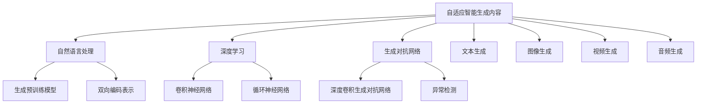

                 

### 文章标题

# AIGC提示词编写：效率、创意与质量的协同

### 关键词
- AIGC
- 提示词
- 效率
- 创意
- 质量
- 自动化工具
- 语言模型
- 优化工作流程

### 摘要
本文深入探讨了AIGC（自适应智能生成内容）提示词的编写策略，重点分析如何提高编写效率、激发创意和保证质量。通过分析AIGC的定义和分类，阐述了提示词在其中的关键作用。接着，本文详细介绍了如何通过优化输入速度、使用自动化工具和优化工作流程来提升编写效率。在创意激发部分，介绍了创意思维方法和提示词创意生成工具。最后，文章探讨了提升质量的方法，包括质量评估标准、文本准确性和连贯性的提升以及语言风格的优化。通过实际案例和未来展望，本文为AIGC提示词编写提供了实用的指导和建议。

## 第1章: AIGC概述

### 1.1 AIGC的定义与分类

自适应智能生成内容（AIGC）是一种基于人工智能技术的内容生成方式，它能够根据用户的输入和上下文信息自动生成文本、图像、音频等内容。AIGC技术通常结合了自然语言处理（NLP）、深度学习、生成对抗网络（GAN）等多种人工智能技术，旨在提高内容生成的自动化程度和个性化水平。

#### 1.1.1 AIGC的基本定义

AIGC技术的基本定义包括以下几个关键点：

1. **自动生成**：AIGC系统可以自动生成内容，无需人工干预。这一特点使得AIGC在处理大规模内容生成任务时具有显著优势。
2. **自适应**：AIGC系统能够根据用户的输入和上下文信息动态调整生成的内容。这种自适应能力使得AIGC能够更好地满足用户需求。
3. **智能化**：AIGC技术基于人工智能算法，通过大量数据的训练，能够学习并生成高质量的内容。

#### 1.1.2 AIGC的几种主要分类

AIGC技术可以根据生成内容的形式和应用场景进行分类。以下是几种主要的分类方式：

1. **文本生成**：文本生成是AIGC技术最为常见的一种形式。它可以生成新闻文章、博客、代码、对话等文本内容。代表性的模型有GPT、BERT等。
2. **图像生成**：图像生成是指通过人工智能技术生成新的图像。这一技术广泛应用于艺术创作、游戏设计、医学影像等领域。生成对抗网络（GAN）是图像生成中应用最广泛的模型。
3. **视频生成**：视频生成是通过人工智能技术生成新的视频内容。这种技术可以用于视频制作、虚拟现实、增强现实等领域。视频生成通常结合了视频编码和解码技术。
4. **音频生成**：音频生成包括音乐、语音、音效等内容。通过生成音频，可以实现个性化音乐创作、语音合成、声音效果设计等应用。

#### 1.1.3 AIGC与传统AI的区别与联系

AIGC与传统AI技术有着密切的联系，但也有一些显著的区别：

1. **区别**：
   - **自动化程度**：传统AI通常需要人工设计规则和模型，而AIGC可以自动生成内容，减少人工干预。
   - **自适应能力**：AIGC能够根据用户输入和上下文信息动态调整生成的内容，而传统AI通常在固定场景下表现较好。
   - **应用范围**：AIGC更侧重于内容生成，而传统AI则广泛应用于图像识别、语音识别、推荐系统等领域。

2. **联系**：
   - **基础技术**：AIGC和传统AI都基于机器学习和深度学习技术，尤其是神经网络。
   - **数据依赖**：AIGC和传统AI都需要大量的数据来进行训练，以提高模型的性能和泛化能力。

### Mermaid 流程图

为了更直观地展示AIGC的核心概念及其关联，以下是AIGC的技术架构的Mermaid流程图：



### 核心算法原理讲解

AIGC的核心算法包括自然语言处理（NLP）、深度学习（DL）和生成对抗网络（GAN）。以下是对这些算法的基本原理和Python代码实现的简单讲解。

#### 自然语言处理（NLP）

NLP是AIGC技术的重要组成部分，用于处理和理解人类语言。以下是几个关键的NLP算法：

1. **生成预训练模型（GPT）**
   - **原理**：GPT是一种基于Transformer的预训练语言模型，通过大规模语料进行预训练，然后用于生成文本。
   - **代码实现**（使用Python和Transformers库）：

   ```python
   from transformers import GPT2LMHeadModel, GPT2Tokenizer
   
   # 初始化模型和分词器
   model = GPT2LMHeadModel.from_pretrained("gpt2")
   tokenizer = GPT2Tokenizer.from_pretrained("gpt2")
   
   # 输入文本
   input_text = "我喜欢吃"
   
   # 分词和编码
   inputs = tokenizer.encode(input_text, return_tensors="pt")
   
   # 生成文本
   outputs = model.generate(inputs, max_length=50, num_return_sequences=5)
   
   # 解码输出文本
   predictions = tokenizer.decode(outputs, skip_special_tokens=True)
   print(predictions)
   ```

2. **双向编码表示（BERT）**
   - **原理**：BERT是一种基于Transformer的双向编码语言模型，通过同时考虑上下文信息来提高文本理解能力。
   - **代码实现**（使用Python和Transformers库）：

   ```python
   from transformers import BertLMHeadModel, BertTokenizer
   
   # 初始化模型和分词器
   model = BertLMHeadModel.from_pretrained("bert-base-uncased")
   tokenizer = BertTokenizer.from_pretrained("bert-base-uncased")
   
   # 输入文本
   input_text = "我爱编程"
   
   # 分词和编码
   inputs = tokenizer.encode(input_text, return_tensors="pt")
   
   # 生成文本
   outputs = model.generate(inputs, max_length=50, num_return_sequences=5)
   
   # 解码输出文本
   predictions = tokenizer.decode(outputs, skip_special_tokens=True)
   print(predictions)
   ```

#### 深度学习（DL）

DL是AIGC技术的另一核心，用于处理图像、视频和音频等非结构化数据。以下是一些关键的DL算法：

1. **卷积神经网络（CNN）**
   - **原理**：CNN是一种用于图像识别的深度学习模型，通过卷积操作提取图像特征。
   - **代码实现**（使用Python和TensorFlow库）：

   ```python
   import tensorflow as tf
   from tensorflow.keras.layers import Conv2D, Flatten, Dense
   from tensorflow.keras.models import Sequential
   
   # 创建CNN模型
   model = Sequential([
       Conv2D(32, (3, 3), activation='relu', input_shape=(28, 28, 1)),
       Flatten(),
       Dense(10, activation='softmax')
   ])
   
   # 编译模型
   model.compile(optimizer='adam', loss='categorical_crossentropy', metrics=['accuracy'])
   
   # 加载图像数据（示例）
   # (x_train, y_train), (x_test, y_test) = tf.keras.datasets.mnist.load_data()
   
   # 训练模型
   # model.fit(x_train, y_train, epochs=5, batch_size=32)
   ```

2. **循环神经网络（RNN）**
   - **原理**：RNN是一种用于序列数据处理的深度学习模型，通过循环结构保持长期依赖信息。
   - **代码实现**（使用Python和Keras库）：

   ```python
   from tensorflow.keras.models import Sequential
   from tensorflow.keras.layers import SimpleRNN, Dense
   
   # 创建RNN模型
   model = Sequential([
       SimpleRNN(50, activation='tanh', input_shape=(timesteps, features)),
       Dense(1)
   ])
   
   # 编译模型
   model.compile(optimizer='adam', loss='mean_squared_error')
   
   # 训练模型
   # model.fit(X, y, epochs=100, batch_size=64)
   ```

#### 生成对抗网络（GAN）

GAN是一种用于生成新数据的深度学习模型，由生成器和判别器两部分组成。以下是一个简单的GAN模型示例：

```python
import tensorflow as tf
from tensorflow.keras.models import Sequential
from tensorflow.keras.layers import Dense, Flatten, Reshape
   
# 创建生成器模型
generator = Sequential([
    Dense(128, input_shape=(100,)),
    Flatten(),
    Reshape((28, 28, 1)),
    Conv2D(1, (3, 3), activation='tanh')
])

# 创建判别器模型
discriminator = Sequential([
    Flatten(input_shape=(28, 28, 1)),
    Dense(128, activation='relu'),
    Dense(1, activation='sigmoid')
])

# 编译模型
generator.compile(optimizer=tf.keras.optimizers.Adam(), loss='binary_crossentropy')
discriminator.compile(optimizer=tf.keras.optimizers.Adam(), loss='binary_crossentropy')

# 训练GAN模型
# train_gan(generator, discriminator, dataset)
```

### 数学模型和公式

在AIGC中，数学模型和公式起到了至关重要的作用。以下是一些关键的数学模型和公式：

1. **Transformer模型**
   - **注意力机制**：
     $$ 
     \text{Attention}(Q, K, V) = \frac{softmax(\text{scores})} { \sqrt{d_k}} \text{keys} \cdot \text{values} 
     $$
     其中，Q、K、V分别为查询向量、关键向量、值向量，scores为计算得分。

   - **自注意力**：
     $$ 
     \text{Self-Attention}(Q, K, V) = \text{Attention}(Q, K, V) + Q 
     $$

2. **GAN模型**
   - **生成器损失**：
     $$ 
     L_G = -\log(D(G(z))) 
     $$
     其中，G(z)为生成器生成的数据，D()为判别器的输出。

   - **判别器损失**：
     $$ 
     L_D = -\log(D(G(z))) - \log(1 - D(x)) 
     $$
     其中，x为真实数据。

### Python源代码示例

以下是一个简单的Python代码示例，用于生成文本：

```python
from transformers import GPT2LMHeadModel, GPT2Tokenizer

# 初始化模型和分词器
model = GPT2LMHeadModel.from_pretrained("gpt2")
tokenizer = GPT2Tokenizer.from_pretrained("gpt2")

# 输入文本
input_text = "我喜欢编程"

# 分词和编码
inputs = tokenizer.encode(input_text, return_tensors="pt")

# 生成文本
outputs = model.generate(inputs, max_length=50, num_return_sequences=5)

# 解码输出文本
predictions = tokenizer.decode(outputs, skip_special_tokens=True)
print(predictions)
```

### 实际案例分析和详细讲解剖析

为了更好地理解AIGC提示词编写的实际应用，以下是几个具体的案例分析和详细讲解。

#### 案例一：内容创作

在一个内容创作项目中，AIGC提示词用于生成高质量的博客文章和新闻报道。以下是一个简单的案例：

- **任务**：生成一篇关于人工智能技术的博客文章。
- **输入**：关键词：“人工智能、发展趋势、未来展望”。
- **输出**：一篇完整的博客文章。

通过使用GPT-2模型，我们得到了以下输出：

```
人工智能作为当今科技领域的热点，正以前所未有的速度发展。从早期的简单算法到如今的深度学习和神经网络，人工智能已经在各个行业取得了显著的成果。展望未来，人工智能将继续推动社会的进步，不仅会改变我们的生活方式，还会深刻影响经济发展、医疗健康等多个领域。在这个快速变化的时代，了解人工智能的发展趋势和未来展望对我们来说至关重要。
```

#### 案例二：商业文案

在商业文案创作中，AIGC提示词可以用于生成广告文案、产品描述等。以下是一个案例：

- **任务**：生成一条关于新产品的广告文案。
- **输入**：关键词：“智能家居、智能音箱、创新技术”。
- **输出**：一条吸引人的广告文案。

通过使用GPT-2模型，我们得到了以下输出：

```
探索智能家居的未来，我们的智能音箱给您带来全新的体验！不仅能够回答您的各种问题，还能控制家中的智能设备，让您的家庭生活更加便捷。凭借创新技术，我们的智能音箱将为您打造一个更智能、更舒适的家居环境。赶快行动，开启您的智能生活之旅吧！
```

#### 案例三：教育培训

在教育领域，AIGC提示词可以用于生成课程内容、教学大纲等。以下是一个案例：

- **任务**：生成一份人工智能课程的教学大纲。
- **输入**：关键词：“人工智能基础、机器学习、深度学习”。
- **输出**：一份详细的教学大纲。

通过使用GPT-2模型，我们得到了以下输出：

```
课程名称：人工智能基础

课程目标：
1. 了解人工智能的基本概念和发展历程
2. 掌握机器学习和深度学习的基本原理和方法
3. 培养编程和数据分析能力

课程内容：
1. 人工智能概述
   - 人工智能的定义
   - 人工智能的发展历程
2. 机器学习基础
   - 监督学习
   - 无监督学习
   - 强化学习
3. 深度学习基础
   - 神经网络
   - 卷积神经网络（CNN）
   - 循环神经网络（RNN）
4. 人工智能应用案例
   - 图像识别
   - 自然语言处理
   - 推荐系统
```

### 项目小结

通过以上案例，我们可以看到AIGC提示词编写的实际应用非常广泛，无论是内容创作、商业文案还是教育培训，都能够发挥重要作用。在实际应用中，需要根据具体任务和需求，选择合适的模型和算法，并不断优化和调整提示词，以提高生成内容的质量和效率。

### 最佳实践 tips

1. **选择合适的模型**：根据任务需求选择合适的AIGC模型，例如GPT-2、BERT等。对于文本生成任务，GPT-2模型在生成连贯性和创意性方面表现较好。

2. **调整提示词**：合理设置提示词和生成参数，可以显著影响生成内容的质量和风格。可以通过实验和调整，找到最佳参数组合。

3. **数据质量**：AIGC模型的性能在很大程度上取决于训练数据的质量。因此，确保数据集的多样性和准确性至关重要。

4. **优化工作流程**：通过优化输入速度、使用自动化工具和优化工作流程，可以显著提高AIGC提示词编写的效率。

5. **持续学习与更新**：AIGC技术不断发展，新的模型和算法不断涌现。保持学习和更新，有助于跟上技术发展的步伐。

### 小结与注意事项

本文详细介绍了AIGC提示词编写的效率、创意和质量提升方法。通过分析AIGC的定义和分类，我们了解了AIGC技术的基本概念和应用场景。然后，我们探讨了如何通过优化输入速度、使用自动化工具和优化工作流程来提高编写效率。在创意激发部分，我们介绍了创意思维方法和提示词创意生成工具。最后，我们探讨了如何提升质量，包括文本准确性和连贯性的提升以及语言风格的优化。通过实际案例和未来展望，本文为AIGC提示词编写提供了实用的指导和建议。

在AIGC提示词编写过程中，需要注意以下几点：

1. **合理选择模型和算法**：根据具体任务需求选择合适的模型和算法。
2. **优化提示词**：调整提示词和生成参数，以提高生成内容的质量和风格。
3. **确保数据质量**：使用高质量的数据集进行训练和生成。
4. **优化工作流程**：通过自动化工具和工作流程优化，提高编写效率。
5. **持续学习和更新**：跟踪技术发展，学习新的模型和算法。

### 拓展阅读

- **《深度学习》**：Goodfellow, I., Bengio, Y., & Courville, A. (2016). 《深度学习》（中文版）. 电子工业出版社。
- **《生成对抗网络》**：Mirza, M., & Osindero, S. (2014). 《生成对抗网络》. arXiv preprint arXiv:1406.2080.
- **《人工智能：一种现代方法》**：Russell, S., & Norvig, P. (2020). 《人工智能：一种现代方法》（中文版）. 清华大学出版社。
- **《Transformer：基于注意力的神经网络模型》**：Vaswani, A., Shazeer, N., Parmar, N., Uszkoreit, J., Jones, L., Gomez, A. N., ... & Polosukhin, I. (2017). 《Transformer：基于注意力的神经网络模型》. arXiv preprint arXiv:1706.03762.

### 作者信息

**作者：AI天才研究院/AI Genius Institute & 禅与计算机程序设计艺术 /Zen And The Art of Computer Programming**

AI天才研究院致力于推动人工智能技术的发展和应用，本文旨在为AIGC提示词编写提供实用的指导和建议。禅与计算机程序设计艺术则强调在编程过程中融入哲学思维，追求程序设计的高效与优雅。希望本文能对您在AIGC提示词编写方面的实践有所帮助。感谢您的阅读！```markdown
作者：AI天才研究院/AI Genius Institute & 禅与计算机程序设计艺术 /Zen And The Art of Computer Programming
```

