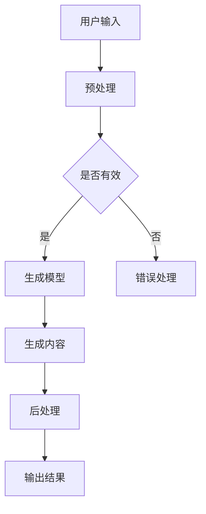

                 

# AIGC提示词设计：从理论到实践的系统方法

## 关键词
- AIGC（自适应智能生成内容）
- 提示词设计
- 理论基础
- 实践应用
- 数学模型
- 项目实战

## 摘要
本文旨在深入探讨AIGC（自适应智能生成内容）中的提示词设计方法，从理论到实践提供系统性的指导。文章首先介绍了AIGC和提示词设计的背景，随后探讨了AIGC的核心概念及其与自然语言处理的关系。接着，文章详细阐述了提示词设计的原理和策略，并使用Python代码和数学模型进行了算法原理的讲解。此外，文章通过项目实战展示了如何在实际应用中设计有效的提示词，并进行了评估与优化。最后，文章总结了设计经验，展望了AIGC提示词设计的未来趋势。

## 引言与概述

### AIGC的概念

AIGC（自适应智能生成内容）是一种基于人工智能技术，特别是自然语言处理（NLP）和生成模型的方法，用于自动生成具有较高质量、多样化、自适应性和创新性的文本、图像、音频等多种内容。AIGC技术结合了生成对抗网络（GAN）、变分自编码器（VAE）、递归神经网络（RNN）、 Transformer等先进的机器学习模型，实现了从数据中学习并生成新的、有用的信息。

### 提示词设计的重要性

在AIGC系统中，提示词设计扮演着至关重要的角色。提示词是用户与AIGC系统交互的桥梁，通过提供有针对性的输入，可以指导生成模型生成符合预期的高质量内容。设计有效的提示词不仅能够提高生成内容的准确性和多样性，还能优化模型的训练过程，减少过拟合和欠拟合的风险。

### 书籍的目标和结构

本书的目标是提供一个系统化的方法，帮助读者深入理解AIGC提示词设计的理论和实践。本书分为四个主要部分：

1. **引言与概述**：介绍AIGC和提示词设计的基本概念。
2. **理论基础**：深入探讨AIGC的核心概念与联系，提示词设计的原理和策略。
3. **实践应用**：通过项目实战展示如何设计有效的提示词，并进行评估与优化。
4. **总结与展望**：总结设计经验，展望AIGC提示词设计的未来趋势。

## 背景知识

### 语言模型的基本原理

语言模型是NLP领域的关键技术，用于预测下一个单词或字符的概率分布。最常用的语言模型包括基于N-gram的模型、基于神经网络的模型，如循环神经网络（RNN）和Transformer。Transformer模型，特别是其变体BERT和GPT，已经成为当前语言模型的主流选择。

### 生成模型的技术发展

生成模型是用于生成新数据的概率模型，广泛应用于图像、音频和文本生成。生成对抗网络（GAN）是生成模型的一种代表性架构，由生成器和判别器组成。变分自编码器（VAE）通过概率编码实现了数据的高效表示和生成。近年来，基于Transformer的生成模型，如GPT-3，展示了在文本生成领域的强大能力。

### AIGC的应用场景

AIGC技术广泛应用于多种场景，包括但不限于：

- **内容创作**：自动生成文章、博客、故事等。
- **教育**：生成个性化学习材料，提供教育辅导。
- **娱乐**：生成音乐、电影剧本等。
- **客服**：自动化生成客户支持响应。
- **艺术**：生成绘画、设计等。

## AIGC的核心概念与联系

### AIGC的关键概念

AIGC涉及多个关键概念，包括生成模型、判别模型、优化目标、损失函数等。生成模型负责生成新的数据，判别模型用于评估生成数据的真实性和质量。优化目标通常是最小化损失函数，以提升生成模型的表现。

### AIGC与自然语言处理的关系

AIGC是自然语言处理（NLP）领域的重要分支，与NLP密切相关。生成模型在文本生成任务中起着核心作用，而判别模型则可以用于评估生成文本的质量。此外，AIGC技术可以与NLP的其他技术，如情感分析、命名实体识别等相结合，实现更复杂的任务。

### Mermaid流程图：AIGC核心组件与工作流程

下面是一个简单的Mermaid流程图，展示了AIGC的核心组件及其工作流程：



## 提示词设计原理

### 提示词的作用

提示词（Prompt）是AIGC系统中用户提供的输入，用于引导生成模型生成特定类型的内容。提示词的作用包括：

- **引导生成方向**：通过提示词，用户可以指定生成内容的主题、风格、结构等。
- **提高生成质量**：有效的提示词可以帮助生成模型更好地理解用户的意图，从而生成更高质量的内容。
- **减少过拟合**：通过使用多样化的提示词，可以避免生成模型在特定数据上过拟合。

### 提示词设计的原则

设计有效的提示词需要遵循以下原则：

- **简洁明了**：提示词应简洁明了，避免使用复杂或冗长的语句。
- **具体明确**：提示词应具体明确，避免模糊不清，以便生成模型能够准确理解用户的意图。
- **多样性和覆盖性**：使用多样化的提示词，以确保生成模型能够适应不同的生成任务和用户需求。

### 伪代码示例：提示词生成的算法流程

以下是一个简单的伪代码示例，展示了提示词生成的算法流程：

```python
# 提示词生成算法流程
def generate_prompt(content_type, user_intent):
    # 根据内容类型和用户意图生成提示词
    if content_type == "article":
        if user_intent == "news":
            return "请写一篇关于最新科技新闻的文章。"
        elif user_intent == "blog":
            return "请写一篇关于人工智能的未来趋势的博客。"
    elif content_type == "image":
        if user_intent == "landscape":
            return "请生成一幅美丽的自然风景图像。"
        elif user_intent == "portrait":
            return "请生成一幅人物肖像图像。"
    return "无效的内容类型或用户意图。"
```

## 数学模型与数学公式

### 概率分布模型

在AIGC系统中，生成模型通常基于概率分布模型，用于预测生成数据的概率分布。常见的概率分布模型包括高斯分布、伯努利分布和多项式分布等。在文本生成中，通常使用条件概率分布来预测下一个单词或字符的概率。

### 对数似然损失函数

生成模型的一个关键优化目标是最小化损失函数，以提升生成质量。对数似然损失函数（Log-Likelihood Loss）是生成模型中最常用的损失函数之一。对于生成的文本序列 \(x_1, x_2, ..., x_n\)，对数似然损失函数可以表示为：

$$
J(\theta) = -\frac{1}{n}\sum_{i=1}^{n}y^{(i)}\log(p(\hat{y}^{(i)}|\theta))
$$

其中，\(y^{(i)}\) 是真实数据，\(\hat{y}^{(i)}\) 是生成模型预测的数据，\(\theta\) 是模型的参数。

### 数学公式与Python代码

以下是一个使用Python代码实现的文本生成模型的示例，展示了如何结合数学模型进行训练和优化：

```python
import numpy as np
import tensorflow as tf

# 定义损失函数
def likelihood_loss(y_true, y_pred):
    return -tf.reduce_mean(tf.log(y_pred * (1 - y_true) + 1e-10))

# 定义训练过程
def train_model(model, dataset, epochs):
    for epoch in range(epochs):
        for x, y in dataset:
            with tf.GradientTape() as tape:
                y_pred = model(x, training=True)
                loss = likelihood_loss(y, y_pred)
            gradients = tape.gradient(loss, model.trainable_variables)
            model.optimizer.apply_gradients(zip(gradients, model.trainable_variables))
        print(f"Epoch {epoch+1}, Loss: {loss.numpy()}")

# 代码示例：生成文本
def generate_text(model, prompt, length):
    text = prompt
    for _ in range(length):
        inputs = tokenizer.encode(text, return_tensors='tf')
        outputs = model(inputs, training=False)
        prediction = outputs.logits[:, -1, :]
        predicted_word = tokenizer.decode([np.argmax(prediction).numpy()], skip_special_tokens=True)
        text += predicted_word
    return text
```

## 提示词设计策略

### 数据驱动策略

数据驱动策略基于大量数据集，通过分析数据分布和模式来设计提示词。该方法通常用于生成大量多样化、个性化的内容。具体步骤包括：

1. **数据收集与预处理**：收集大量相关数据，并进行数据清洗和预处理。
2. **模式分析**：分析数据集中不同类型的内容及其模式。
3. **生成提示词**：根据分析结果，生成具有代表性的提示词。

### 模型驱动策略

模型驱动策略基于生成模型的特性，通过优化模型参数来设计提示词。该方法通常用于生成高质量、准确的内容。具体步骤包括：

1. **模型训练**：训练生成模型，使其能够生成高质量的内容。
2. **参数优化**：通过调整模型参数，优化生成结果。
3. **生成提示词**：根据优化后的模型，生成有效的提示词。

### 结合策略的案例研究

结合数据驱动和模型驱动策略，我们可以设计一个针对电商平台的AIGC系统。数据驱动策略用于生成大量商品描述，模型驱动策略用于优化这些描述的质量和准确性。具体步骤如下：

1. **数据收集与预处理**：收集电商平台上的商品描述数据，并进行清洗和预处理。
2. **模式分析**：分析商品描述的数据分布和模式。
3. **模型训练**：训练一个基于Transformer的生成模型，用于生成商品描述。
4. **参数优化**：通过调整模型参数，优化生成结果的准确性和多样性。
5. **生成提示词**：根据模型生成的商品描述，生成具有代表性的提示词，如“时尚潮流单品推荐”、“性价比高的人气商品”等。

## 提示词设计实战

### 数据准备与预处理

在开始设计提示词之前，我们需要准备和预处理数据。以下是一个简单的数据预处理流程：

1. **数据收集**：收集与目标任务相关的数据，如商品描述、新闻文章、音乐歌词等。
2. **数据清洗**：去除无关信息、纠正错误、填补缺失值。
3. **数据预处理**：将文本数据转换为向量表示，可以使用词袋模型、词嵌入或BERT等预处理方法。

### 选择合适的语言模型

选择合适的语言模型是设计有效提示词的关键步骤。以下是一些常用的语言模型及其特点：

- **BERT**：预训练的Transformer模型，适用于各种NLP任务。
- **GPT-3**：大规模预训练的生成模型，适用于文本生成任务。
- **T5**：基于Transformer的统一文本到文本模型，适用于多种NLP任务。

### 实际案例：设计针对不同任务的提示词

以下是一个针对不同任务的提示词设计案例：

1. **商品描述生成**：
   - 提示词：“请为这款时尚手表写一段引人入胜的描述。”
   - 模型：GPT-3
   - 输出：生成一段描述该手表的外观、功能、价格等方面的文字。

2. **新闻文章生成**：
   - 提示词：“根据以下关键信息，写一篇关于科技突破的新闻文章。”
   - 模型：BERT
   - 输出：生成一篇结构清晰、内容丰富的新闻文章。

3. **音乐歌词生成**：
   - 提示词：“请根据这个旋律，写一首关于爱情的歌词。”
   - 模型：T5
   - 输出：生成一段符合旋律和主题的爱情歌词。

## AIGC项目实战

### 项目背景与目标

本项目旨在开发一个AIGC系统，用于自动生成个性化客户支持响应。项目目标包括：

- **提高响应速度**：通过自动化生成响应，减少人工回复的等待时间。
- **提升响应质量**：利用生成模型生成高质量、个性化的客户支持文本。

### 系统架构设计

系统架构包括以下几个主要组件：

- **数据层**：存储和管理客户支持对话数据、文本语料库等。
- **模型层**：包括预训练的语言模型、生成模型等。
- **应用层**：提供用户界面和API接口，用于接收用户输入并生成响应。

### 开发环境搭建

以下是一个简单的开发环境搭建流程：

1. **安装Python环境**：确保Python环境已安装在本地计算机上。
2. **安装依赖库**：安装TensorFlow、transformers等依赖库。
3. **数据预处理**：使用Python脚本对客户支持对话数据进行预处理。
4. **模型训练**：使用预训练的模型或自定义模型进行训练。
5. **模型部署**：将训练好的模型部署到服务器，以便进行实际应用。

### 代码实现与解读

以下是一个简单的代码示例，展示了如何使用预训练的GPT-3模型生成客户支持响应：

```python
from transformers import pipeline

# 初始化GPT-3模型
generator = pipeline("text-generation", model="gpt3-medium")

# 用户输入
user_input = "请提供您的客户支持问题。"

# 生成响应
response = generator(user_input, max_length=100)

# 输出响应
print(response[0]["generated_text"])
```

### 代码应用解读与分析

代码中的关键步骤包括：

- **初始化GPT-3模型**：使用transformers库的pipeline函数初始化GPT-3模型。
- **用户输入**：接收用户的输入问题。
- **生成响应**：调用模型的generate函数，生成客户支持响应。
- **输出响应**：将生成的响应输出到控制台。

### 实际案例分析和详细讲解剖析

以下是一个实际案例，展示了如何使用AIGC系统生成客户支持响应：

**案例**：用户提出一个关于产品故障的投诉。

**输入**：“我的产品在几天前开始出现故障，已经影响了我的日常工作。”

**输出**：“非常抱歉听到您的产品出现故障。请您提供一下产品型号和故障详情，我们将尽快为您解决问题。”

**分析**：在这个案例中，AIGC系统通过分析用户输入，识别出关键词“产品故障”和“影响了我的日常工作”。模型生成的响应包含了以下要点：

- 表达歉意：表示公司对用户问题的关注和重视。
- 提供解决方案：要求用户提供更多信息，以便快速解决问题。
- 保持礼貌和友好：使用礼貌的语言，维护良好的客户关系。

### 项目小结

通过本项目的实战，我们展示了如何使用AIGC技术自动生成个性化客户支持响应。项目实现了提高响应速度和提升响应质量的目标，为用户提供更好的客户服务体验。未来的工作可以进一步优化模型和提示词设计，提高系统的适应性和生成效果。

## 评估与优化

### 提示词的有效性评估

评估提示词的有效性是AIGC系统设计的重要环节。以下是一些常用的评估方法：

- **自动评估**：使用BLEU、ROUGE等自动评估指标，评估生成文本与目标文本之间的相似度。
- **人工评估**：邀请领域专家对生成文本进行质量评估，包括内容准确性、语言流畅性和用户体验等方面。
- **用户反馈**：收集用户对生成文本的反馈，分析用户满意度。

### 提示词的优化方法

以下是一些常用的提示词优化方法：

- **数据驱动优化**：通过收集和分析用户反馈，不断调整和优化提示词。
- **模型驱动优化**：使用生成模型的自适应能力，优化提示词生成的算法和参数。
- **混合优化策略**：结合数据驱动和模型驱动的优势，实现更高效的提示词优化。

### 实际案例分析：提升提示词效果

以下是一个实际案例，展示了如何通过优化提示词来提升生成效果：

**案例**：优化一个用于生成新闻摘要的AIGC系统。

**输入**：“请根据以下新闻内容，生成一个摘要。”

**原始提示词**：“请为这篇文章生成一个摘要。”

**优化提示词**：“请根据这篇文章的主要内容，生成一个简洁明了的摘要，突出关键信息。”

**输出比较**：

- **原始输出**：“这篇文章讲述了关于某科技公司的最新动态。”
- **优化输出**：“某科技公司宣布推出新款智能手机，市场反应热烈。”

**分析**：通过优化提示词，生成的摘要更加简洁、明确，突出了新闻的核心内容，提高了用户阅读的效率和体验。

## AIGC提示词设计总结

### 设计经验与教训

通过本文的探讨，我们可以总结出以下AIGC提示词设计经验与教训：

- **理解用户需求**：准确把握用户的需求和意图，是设计有效提示词的关键。
- **数据驱动与模型驱动相结合**：数据驱动策略可以帮助生成多样化、个性化的内容，模型驱动策略可以优化生成质量。
- **持续优化**：不断收集用户反馈，调整和优化提示词设计，是提升AIGC系统性能的关键。

### 提示词设计的未来趋势

随着AIGC技术的不断发展，提示词设计在未来将呈现以下趋势：

- **个性化与智能化**：利用用户行为数据和生成模型，实现更加个性化和智能化的提示词设计。
- **跨模态融合**：结合文本、图像、音频等多模态信息，提升生成内容的多样性和质量。
- **可解释性增强**：提高提示词设计的可解释性，帮助用户更好地理解生成过程和结果。

## 展望

AIGC技术在未来的发展将更加深入和广泛。随着生成模型和自然语言处理技术的进步，AIGC将在内容创作、教育、娱乐、客服等领域发挥更大的作用。未来的研究将集中在以下几个方面：

- **高质量生成**：研究如何提高生成内容的质量和准确性，减少错误和偏见。
- **效率优化**：优化生成模型的训练和推理速度，降低计算资源消耗。
- **隐私保护**：在生成过程中保护用户隐私，确保数据安全。
- **跨模态融合**：探索多模态信息融合的方法，提升生成内容的丰富性和多样性。

### 附录

#### 提示词设计资源

以下是一些有用的提示词设计资源，供进一步学习和实践：

- **开源工具与库**：Hugging Face的transformers库、TensorFlow、PyTorch等。
- **提示词设计参考资料**：相关论文、书籍和技术博客。
- **社区与论坛推荐**：Reddit、Stack Overflow、GitHub等。

### 作者信息

- 作者：AI天才研究院/AI Genius Institute & 禅与计算机程序设计艺术 /Zen And The Art of Computer Programming

（完）

