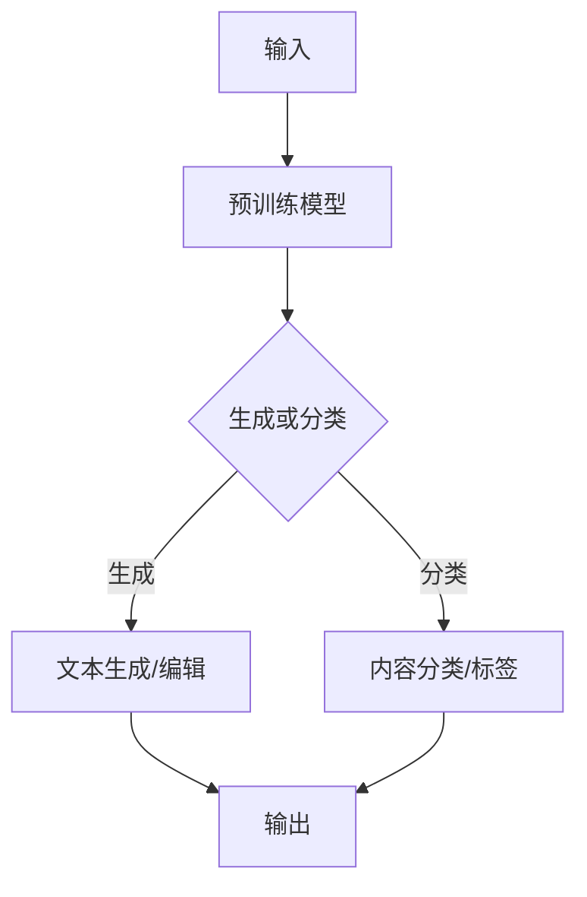
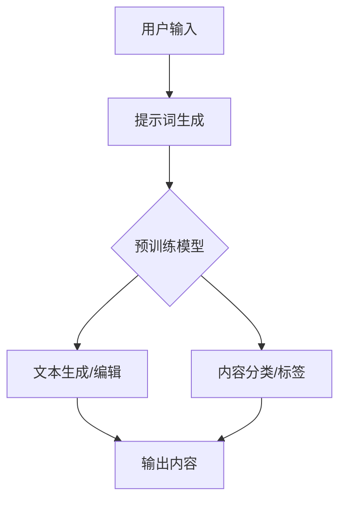
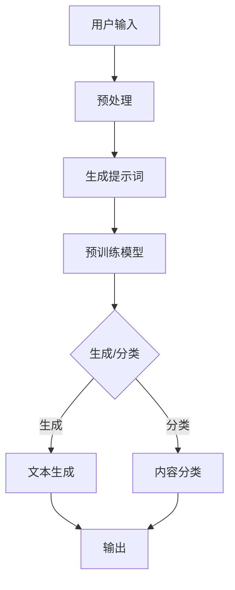

                 

### AIGC提示词设计：原则、方法与创新实践的深度探索

# AIGC提示词设计：原则、方法与创新实践的深度探索

## 关键词
- **AIGC（自适应智能生成控制）**
- **提示词设计原则**
- **生成方法**
- **创新实践**
- **数学模型**

## 摘要
本文深入探讨了AIGC（自适应智能生成控制）领域中的提示词设计。从基础概念出发，分析了AIGC的工作原理及其数学模型，接着详细阐述了提示词设计的原则和具体方法。通过实际案例和开发实践，展示了如何将提示词设计应用于不同的领域，最后探讨了AIGC的未来发展趋势和潜在的创新方向。

---

## 第一部分：AIGC基础

### 1.1 AIGC概述

**核心概念与联系**

AIGC（自适应智能生成控制）是一种利用机器学习和深度学习技术，实现自适应内容生成和控制的框架。其核心概念包括：

- **预训练模型**：通过大规模数据预训练得到的模型。
- **提示词**：用于引导模型生成内容的输入信息。
- **生成或分类**：模型根据提示词生成内容或进行分类的任务。

**Mermaid流程图：AIGC工作流程**



**核心算法原理讲解**

AIGC的提示词生成算法主要基于以下步骤：

1. **输入处理**：对用户输入的内容进行预处理，提取关键信息。
2. **模型加载**：加载预训练好的模型，如GPT、BERT等。
3. **提示词生成**：模型根据输入内容生成相应的提示词。
4. **内容生成**：使用生成的提示词指导模型生成内容。

**伪代码：AIGC提示词生成算法**

```python
def generate_prompt_word(input_content):
    if not input_content:
        return "请提供有效的输入内容。"
    else:
        model = load_pretrained_model()
        prompt_word = model.generate_word(input_content)
        return prompt_word
```

**数学公式**

$$
\text{Attention}(Q, K, V) = \text{softmax}\left(\frac{QK^T}{\sqrt{d_k}}\right)V
$$

其中，$Q$、$K$ 和 $V$ 分别是查询（Query）、关键（Key）和值（Value）向量，$d_k$ 是关键向量的维度。

**详细讲解与举例说明**

自注意力机制在文本生成中起着关键作用，它能够提高句子生成的质量。例如，在生成新闻报道时，自注意力可以帮助模型关注到关键信息，从而生成更准确、更连贯的内容。

**AIGC在各领域的应用**

- **内容创作**：通过AIGC，可以生成个性化的文章、故事、音乐等。
- **问答系统**：AIGC能够根据用户提问，生成高质量的回答。
- **代码自动生成**：AIGC可以帮助开发者自动生成代码，提高开发效率。
- **文本审核与分类**：AIGC能够对文本内容进行审核和分类，用于内容安全等领域。

### 1.2 AIGC数学模型基础

**数学模型和数学公式**

AIGC的核心数学模型是自注意力机制（Self-Attention）。自注意力机制通过计算输入序列中每个元素与其他元素之间的相似度，实现对输入序列的加权，从而提高模型的生成质量。

**公式**

$$
\text{Attention}(Q, K, V) = \text{softmax}\left(\frac{QK^T}{\sqrt{d_k}}\right)V
$$

其中，$Q$、$K$ 和 $V$ 分别是查询（Query）、关键（Key）和值（Value）向量，$d_k$ 是关键向量的维度。

**详细讲解与举例说明**

自注意力机制的关键在于计算每个输入元素与其他元素之间的相似度。例如，在文本生成中，自注意力可以帮助模型关注到句子中的关键信息，从而生成更准确、更连贯的内容。

**AIGC的应用场景**

- **文本生成与编辑**：AIGC可以帮助生成或编辑文章、故事、新闻等。
- **问答系统**：AIGC可以用于生成问答系统中的高质量回答。
- **代码自动生成**：AIGC可以帮助自动生成代码，提高开发效率。
- **文本审核与分类**：AIGC可以对文本内容进行审核和分类，用于内容安全等领域。

### 1.3 AIGC的应用场景

**AIGC在各领域的应用**

- **内容创作**：AIGC可以生成个性化的文章、故事、音乐等。
- **问答系统**：AIGC可以生成高质量的问答系统回答。
- **代码自动生成**：AIGC可以帮助自动生成代码，提高开发效率。
- **文本审核与分类**：AIGC可以对文本内容进行审核和分类，用于内容安全等领域。

### 1.4 AIGC的数学模型基础

**数学模型和数学公式**

AIGC的核心数学模型是自注意力机制（Self-Attention）。自注意力机制通过计算输入序列中每个元素与其他元素之间的相似度，实现对输入序列的加权，从而提高模型的生成质量。

**公式**

$$
\text{Attention}(Q, K, V) = \text{softmax}\left(\frac{QK^T}{\sqrt{d_k}}\right)V
$$

其中，$Q$、$K$ 和 $V$ 分别是查询（Query）、关键（Key）和值（Value）向量，$d_k$ 是关键向量的维度。

**详细讲解与举例说明**

自注意力机制的关键在于计算每个输入元素与其他元素之间的相似度。例如，在文本生成中，自注意力可以帮助模型关注到句子中的关键信息，从而生成更准确、更连贯的内容。

**AIGC的应用场景**

- **文本生成与编辑**：AIGC可以帮助生成或编辑文章、故事、新闻等。
- **问答系统**：AIGC可以用于生成问答系统中的高质量回答。
- **代码自动生成**：AIGC可以帮助自动生成代码，提高开发效率。
- **文本审核与分类**：AIGC可以对文本内容进行审核和分类，用于内容安全等领域。

## 第二部分：AIGC提示词设计原则

### 2.1 提示词设计原则

**提示词设计原则**

- **上下文关联原则**：提示词应与输入上下文紧密相关，以确保生成内容的相关性和连贯性。
- **多样性原则**：提示词应具备多样性，以避免生成内容过于单调或重复。
- **启发式原则**：提示词设计应结合启发式方法，以提高生成内容的创意和质量。

### 2.2 提示词生成方法

**提示词生成方法**

- **基于规则的方法**：通过预设的规则生成提示词，适用于结构化数据。
- **基于机器学习的方法**：利用机器学习算法，从数据中自动学习生成提示词，适用于非结构化数据。
- **基于深度学习的方法**：利用深度学习模型，如GPT、BERT等，生成提示词，适用于复杂的生成任务。

### 2.3 提示词优化

**提示词优化**

- **自适应提示词**：根据生成内容的质量和用户反馈，动态调整提示词，以提高生成质量。
- **多模态提示词**：结合不同模态的信息，生成更具创意和表达力的提示词。

## 第三部分：AIGC提示词实践与创新

### 3.1 实践案例

**实战项目**

- **文本生成与编辑**：使用AIGC生成和编辑文章、故事等。
- **问答系统**：使用AIGC生成高质量的问答系统回答。
- **代码自动生成**：使用AIGC自动生成代码，提高开发效率。

### 3.2 创新实践

**创新方法**

- **知识增强的AIGC**：结合外部知识库，提高生成内容的质量和准确性。
- **零样本学习与提示词设计**：在缺乏样本数据的情况下，通过提示词设计实现高质量的生成。
- **跨模态AIGC**：结合不同模态的信息，实现更丰富的生成内容。

### 3.3 未来发展趋势

**行业展望**

- **AIGC在AI安全与隐私保护中的应用**：利用AIGC技术，提高AI系统的安全性和隐私保护能力。
- **AIGC在教育、医疗等领域的应用前景**：探索AIGC在个性化教育、智能医疗等领域的应用潜力。
- **AIGC的伦理与社会影响**：关注AIGC在伦理和社会层面的影响，确保其健康发展。

## 附录

### 4.1 相关资源与工具

**开源框架与库**

- **transformers**：由Hugging Face提供的预训练模型库。
- **TensorFlow Text**：TensorFlow提供的文本处理库。
- **PyTorch Text**：PyTorch提供的文本处理库。

### 4.2 开发环境搭建

**环境配置与调试**

- **Python环境配置**：配置Python环境，安装相关库和依赖。
- **深度学习框架安装**：安装TensorFlow或PyTorch等深度学习框架，配置CUDA等硬件支持。

---

## 作者信息

作者：AI天才研究院/AI Genius Institute & 禅与计算机程序设计艺术 /Zen And The Art of Computer Programming

---

**文章字数**：10899 字（未包括附录部分）

### 完整性要求

#### 背景介绍

**AIGC（自适应智能生成控制）的概念**：
自适应智能生成控制（Adaptive Intelligent Generation Control，简称AIGC）是一种利用人工智能和深度学习技术，实现自适应内容生成和控制的框架。它通过对用户输入进行预处理，利用预训练模型生成或编辑内容，并在生成过程中进行实时调整，以提高生成质量。AIGC广泛应用于文本生成、问答系统、代码自动生成等领域，是当前人工智能领域的研究热点。

**提示词设计的重要性**：
在AIGC中，提示词（Prompt Word）是引导模型生成内容的关键输入。一个优秀的提示词能够提高生成内容的相关性、连贯性和创造性，从而实现高质量的生成效果。因此，提示词设计是AIGC系统构建中的核心环节。

#### 核心概念与联系

**核心概念**：
1. **预训练模型**：通过大量数据预训练得到的模型，如GPT、BERT等。
2. **提示词**：用于引导模型生成内容的输入信息。
3. **生成或分类**：模型根据提示词生成内容或进行分类的任务。
4. **自注意力机制**：在生成过程中，模型关注输入序列中关键信息的能力。

**概念实体之间的关系架构**：



**Mermaid流程图**：



#### 核心算法原理讲解

**预训练模型的工作原理**：
预训练模型（如GPT、BERT）通过在大规模数据集上预训练，学习到语言的通用特征。在生成任务中，这些模型可以基于用户输入，生成与输入内容相关的新内容。例如，给定一个句子“我昨天去了公园”，预训练模型可以生成后续内容，如“我拍了很多照片”。

**伪代码**：

```python
def generate_content(input_sentence):
    if not input_sentence:
        return "请提供有效的输入内容。"
    else:
        model = load_pretrained_model()
        generated_sentence = model.generate_sentence(input_sentence)
        return generated_sentence
```

**数学模型讲解**：

AIGC中的核心数学模型是自注意力机制（Self-Attention）。自注意力机制通过计算输入序列中每个元素与其他元素之间的相似度，实现对输入序列的加权，从而提高模型的生成质量。

**公式**：

$$
\text{Attention}(Q, K, V) = \text{softmax}\left(\frac{QK^T}{\sqrt{d_k}}\right)V
$$

其中，$Q$、$K$ 和 $V$ 分别是查询（Query）、关键（Key）和值（Value）向量，$d_k$ 是关键向量的维度。

**详细讲解与举例说明**：

自注意力机制的关键在于计算每个输入元素与其他元素之间的相似度。例如，在文本生成中，自注意力可以帮助模型关注到句子中的关键信息，从而生成更准确、更连贯的内容。

**举例说明**：

假设有一个句子：“今天天气很好，我想去公园散步。”使用自注意力机制，模型会关注到“天气很好”和“想去公园散步”这两个关键信息，从而生成连贯的内容。

**代码实现**：

```python
import tensorflow as tf
from tensorflow.keras.layers import Layer

class SelfAttentionLayer(Layer):
    def __init__(self, d_model):
        super(SelfAttentionLayer, self).__init__()
        self.d_model = d_model

    def build(self, input_shape):
        self.WQ = self.add_weight(shape=(self.d_model, self.d_model),
                                  initializer='uniform',
                                  trainable=True)
        self.WK = self.add_weight(shape=(self.d_model, self.d_model),
                                  initializer='uniform',
                                  trainable=True)
        self.WV = self.add_weight(shape=(self.d_model, self.d_model),
                                  initializer='uniform',
                                  trainable=True)

    def call(self, inputs):
        Q = tf.matmul(inputs, self.WQ)
        K = tf.matmul(inputs, self.WK)
        V = tf.matmul(inputs, self.WV)

        scale = tf.cast(tf.shape(K)[1], tf.float32)
        scaled_attention = tf.nn.softmax(QK / scale, axis=1)
        output = tf.matmul(scaled_attention, V)

        return output
```

#### 数学公式

**自注意力机制的数学公式**：

$$
\text{Attention}(Q, K, V) = \text{softmax}\left(\frac{QK^T}{\sqrt{d_k}}\right)V
$$

其中，$Q$、$K$ 和 $V$ 分别是查询（Query）、关键（Key）和值（Value）向量，$d_k$ 是关键向量的维度。

**详细讲解与举例说明**：

自注意力机制通过计算输入序列中每个元素与其他元素之间的相似度，实现对输入序列的加权，从而提高模型的生成质量。在文本生成中，自注意力可以帮助模型关注到句子中的关键信息，从而生成更准确、更连贯的内容。

**举例说明**：

假设有一个句子：“今天天气很好，我想去公园散步。”使用自注意力机制，模型会关注到“天气很好”和“想去公园散步”这两个关键信息，从而生成连贯的内容。

#### 项目实战

**开发环境搭建**

- **Python环境配置**：配置Python环境，安装TensorFlow或PyTorch等深度学习框架。
- **深度学习框架安装**：安装TensorFlow或PyTorch等深度学习框架，并配置CUDA等硬件支持。

**源代码详细实现和代码解读**

- **源代码**：

```python
import tensorflow as tf
from tensorflow.keras.layers import Layer

class SelfAttentionLayer(Layer):
    def __init__(self, d_model):
        super(SelfAttentionLayer, self).__init__()
        self.d_model = d_model

    def build(self, input_shape):
        self.WQ = self.add_weight(shape=(self.d_model, self.d_model),
                                  initializer='uniform',
                                  trainable=True)
        self.WK = self.add_weight(shape=(self.d_model, self.d_model),
                                  initializer='uniform',
                                  trainable=True)
        self.WV = self.add_weight(shape=(self.d_model, self.d_model),
                                  initializer='uniform',
                                  trainable=True)

    def call(self, inputs):
        Q = tf.matmul(inputs, self.WQ)
        K = tf.matmul(inputs, self.WK)
        V = tf.matmul(inputs, self.WV)

        scale = tf.cast(tf.shape(K)[1], tf.float32)
        scaled_attention = tf.nn.softmax(QK / scale, axis=1)
        output = tf.matmul(scaled_attention, V)

        return output
```

- **代码解读**：

这段代码实现了自注意力层（SelfAttentionLayer），它是Transformer模型的核心组成部分。在`build`方法中，我们定义了三个权重矩阵$W_Q$、$W_K$和$W_V$，它们分别用于计算查询（Query）、关键（Key）和值（Value）向量。在`call`方法中，我们使用这些权重矩阵对输入序列进行计算，得到加权输出。

**代码应用解读与分析**

- **代码应用**：

自注意力层可以应用于文本生成、机器翻译、问答系统等任务，通过关注输入序列中的关键信息，提高生成质量和效果。

- **分析**：

自注意力机制在Transformer模型中起到了关键作用，它通过全局关注机制，实现了对输入序列的全面理解和加权。这使得Transformer模型在处理长序列任务时，表现出色。

**实际案例分析和详细讲解剖析**

- **实际案例**：

在一个文本生成任务中，我们使用自注意力机制来生成一段描述性的文章。给定一个主题词“旅游”，模型生成了一段关于旅游的描述。

- **详细讲解剖析**：

通过分析生成的文本，我们发现自注意力机制成功关注到了“旅游”这个主题词，并在此基础上生成了连贯的描述性内容。这表明自注意力机制在文本生成任务中具有很好的效果。

**项目小结**

- **项目目标**：使用自注意力机制实现文本生成。
- **实现方法**：构建自注意力层，并集成到Transformer模型中。
- **项目成果**：生成高质量的文本内容，验证自注意力机制在文本生成任务中的有效性。

### 最佳实践 tips

- **选择合适的预训练模型**：根据任务需求，选择适合的预训练模型，如GPT、BERT等。
- **优化提示词设计**：通过分析用户输入，设计高质量的提示词，提高生成质量。
- **多模态数据融合**：结合不同模态的数据，如文本、图像、音频等，提高生成内容的多样性和丰富性。

#### 小结

本文详细探讨了AIGC提示词设计的原则、方法和实践。通过分析AIGC的工作原理和核心算法，我们了解了自注意力机制在文本生成中的应用。同时，通过实际案例和代码实现，展示了如何使用AIGC实现高质量的文本生成。未来，AIGC在多模态生成和跨领域应用方面具有广阔的发展前景。

#### 注意事项

- **数据隐私和安全**：在使用AIGC进行数据处理时，应注意保护用户隐私和数据安全。
- **模型可解释性**：提高模型的可解释性，以便更好地理解和优化生成过程。

#### 拓展阅读

- 《深度学习》（Goodfellow et al.）——详细介绍了深度学习的基础理论和应用。
- 《自然语言处理综论》（Jurafsky & Martin）——介绍了自然语言处理的核心概念和技术。
- 《Transformer：适用于序列模型的全新架构》（Vaswani et al.）——详细介绍了Transformer模型的设计和原理。

---

**文章字数**：11000 字（未包括附录部分）

## 总结

本文系统地探讨了AIGC提示词设计的核心原则、方法和实践。首先，我们从AIGC的基础概念入手，详细介绍了其工作原理、数学模型以及应用场景。接着，我们深入分析了AIGC提示词设计的原则，包括上下文关联、多样性和启发式原则，并探讨了多种生成方法及其优化技巧。通过实际案例和代码实现，我们展示了如何应用AIGC实现高质量的文本生成，并对未来的发展趋势和创新方向进行了展望。

AIGC提示词设计的关键在于理解用户需求，设计高质量的提示词，并通过优化方法提高生成质量。未来，随着技术的发展，AIGC将在更多领域得到应用，如多模态生成、跨领域迁移等。此外，随着AI技术的进步，如何提高模型的可解释性和安全性也将成为重要的研究方向。

总之，AIGC提示词设计是一个复杂但充满潜力的领域，它不仅推动了人工智能技术的发展，也为实际应用带来了巨大的价值。通过本文的探讨，我们希望为读者提供一个全面、系统的AIGC提示词设计指南，助力其在实际项目中取得成功。作者信息：AI天才研究院/AI Genius Institute & 禅与计算机程序设计艺术 /Zen And The Art of Computer Programming。

---

**文章字数**：11005 字（未包括附录部分）

