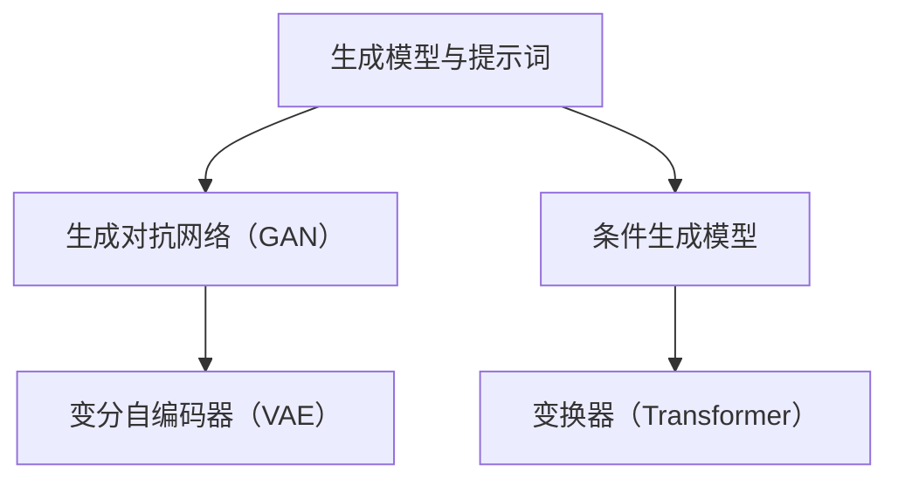

                 

### 完整目录大纲

# AIGC提示词设计：效率与创意的完美结合

## 第一部分：AIGC基础

### 1.1 AIGC概述
#### 1.1.1 AIGC的概念与定义
AIGC，即Auto-Generated Content，是指通过人工智能技术自动生成内容的一种方式。它结合了自然语言处理（NLP）、计算机视觉（CV）等多领域的技术，旨在提高内容生成的效率和质量。

#### 1.1.2 AIGC的发展历程
- **早期发展**：生成对抗网络（GANs）在2014年被提出，为AIGC技术的发展奠定了基础。
- **关键进展**：2016年，GAN在图像生成任务上取得了重大突破，能够生成逼真的图像。
- **近期发展**：随着深度学习和神经网络技术的进步，AIGC在文本生成、视频生成等领域也取得了显著进展。

#### 1.1.3 AIGC的关键技术
- **生成对抗网络（GAN）**：一种通过对抗过程生成数据的框架，由生成器和判别器组成。
- **变分自编码器（VAE）**：通过概率模型对数据进行编码和解码，适用于生成任务。
- **变换器（Transformer）**：在NLP领域中广泛应用，用于文本生成和翻译。

## 第二部分：AIGC提示词设计

### 2.1 提示词设计原则
#### 2.1.1 提示词的长度与形式
- **长度**：提示词的长度通常在几十到几百个字符之间，过长或过短的提示词都可能影响生成效果。
- **形式**：提示词可以是简单的关键词或短语，也可以是复杂的句子，具体形式取决于生成任务的需求。

#### 2.1.2 提示词的多样性
- **定义**：多样性指的是提示词在语义、语法和结构上的丰富性。
- **实现**：通过使用不同的语言风格、表达方式和上下文，可以提高提示词的多样性。

#### 2.1.3 提示词的优化策略
- **数据驱动**：通过分析大量成功生成的样本，提取有效的提示词模式。
- **人工干预**：在必要时，人工对提示词进行优化，以适应特定的生成任务。

### 2.2 提示词生成技术
#### 2.2.1 基于文本的提示词生成
- **方法**：利用NLP技术，如词嵌入、序列模型等，从文本数据中提取提示词。
- **应用**：适用于生成文章、新闻、故事等文本内容。

#### 2.2.2 基于图像的提示词生成
- **方法**：利用CV技术，如卷积神经网络（CNN），从图像中提取提示词。
- **应用**：适用于生成描述性文本、标签等图像相关内容。

#### 2.2.3 基于多模态的提示词生成
- **方法**：结合文本和图像信息，生成更具表达力的提示词。
- **应用**：适用于生成多媒体内容，如视频描述、图文搭配等。

### 2.3 提示词效果评估
#### 2.3.1 评价指标与方法
- **自动评价指标**：如BLEU、ROUGE等，用于评估生成的文本质量。
- **人工评价指标**：通过用户调查、专家评分等方式，对生成内容进行主观评估。

#### 2.3.2 实际案例评估分析
- **案例一**：基于文本的生成案例，分析不同提示词对生成质量的影响。
- **案例二**：基于图像的生成案例，评估图像与提示词的匹配度。

## 第三部分：AIGC应用实战

### 3.1 应用场景分析
#### 3.1.1 内容生成与编辑
- **应用**：自动生成新闻、文章、博客等文本内容。
- **挑战**：保证生成内容的质量和原创性。

#### 3.1.2 数据增强与生成
- **应用**：生成额外的训练数据，提高模型泛化能力。
- **挑战**：控制生成数据的多样性和真实性。

#### 3.1.3 虚拟助手与聊天机器人
- **应用**：为用户提供智能化的问答和服务。
- **挑战**：提高对话的自然性和准确性。

### 3.2 项目实战案例
#### 3.2.1 案例一：自动内容生成
- **背景**：使用AIGC技术生成新闻文章。
- **实现**：搭建基于Transformer的文本生成模型。
- **代码**：展示关键代码片段。

#### 3.2.2 案例二：图像数据增强
- **背景**：使用GAN生成图像数据。
- **实现**：设计并训练条件生成对抗网络。
- **代码**：展示GAN训练过程的关键代码。

#### 3.2.3 案例三：虚拟助手开发
- **背景**：开发一个基于AIGC的聊天机器人。
- **实现**：结合NLP和GAN技术，实现自然对话生成。
- **代码**：展示聊天机器人关键功能实现代码。

### 3.3 开发环境与工具
#### 3.3.1 环境搭建指南
- **步骤**：安装Python环境、深度学习框架（如TensorFlow、PyTorch）等。
- **工具**：介绍常用的开发工具和库。

#### 3.3.2 常用工具介绍
- **文本生成**：介绍用于文本生成的常用库（如Hugging Face）。
- **图像生成**：介绍用于图像生成的常用库（如PyTorch Vision）。

#### 3.3.3 实践技巧与优化
- **技巧**：分享实际开发中的一些技巧和注意事项。
- **优化**：介绍如何优化模型性能和生成质量。

## 第四部分：AIGC的未来与趋势

### 4.1 AIGC的发展趋势
#### 4.1.1 技术进步与突破
- **深度学习**：持续的技术进步，如Transformer、BERT等，将推动AIGC的发展。
- **多模态**：多模态融合将成为AIGC的重要方向。

#### 4.1.2 应用领域的拓展
- **内容创作**：AIGC将在内容创作领域发挥更大的作用。
- **数据科学**：在数据增强、数据标注等领域，AIGC具有巨大的潜力。

#### 4.1.3 安全性与伦理问题
- **隐私保护**：如何保护用户隐私是AIGC需要解决的重要问题。
- **伦理审查**：确保生成内容不违反伦理标准。

### 4.2 未来展望
#### 4.2.1 AIGC在AI中的地位
- **核心地位**：AIGC将成为人工智能的重要组成部分。
- **应用广泛**：从文本到图像，再到视频和音频，AIGC将在各个领域得到应用。

#### 4.2.2 对传统行业的颠覆与创新
- **颠覆**：AIGC将颠覆传统的内容创作和数据采集方式。
- **创新**：为传统行业带来新的商业模式和创新机会。

#### 4.2.3 个人与社会的变革
- **个人**：AIGC将提高个人创作和生产力。
- **社会**：AIGC将改变社会信息传播和交流的方式。

## 附录

### 5.1 相关资源与资料
#### 5.1.1 书籍推荐
- **《深度学习》**：Goodfellow、Bengio和Courville著。
- **《自然语言处理综论》**：Jurafsky和Martin著。

#### 5.1.2 论文集锦
- **NIPS、ICLR、ACL等**：顶级机器学习与NLP会议论文集。

#### 5.1.3 开源项目
- **OpenAI GPT-3**：一个强大的语言模型。
- **Google Imagen**：用于图像生成的开源项目。

### 5.2 附录A：AIGC流程图


### 5.3 附录B：核心算法原理讲解
- **生成对抗网络（GAN）**：通过生成器和判别器的对抗训练生成数据。
  ```python
  # 伪代码：GAN的训练过程
  for epoch in range(num_epochs):
      for batch in data_loader:
          # 训练判别器
          D_loss = train_discriminator(D, batch)
          # 训练生成器
          G_loss = train_generator(G, D)
      print(f'Epoch [{epoch+1}/{num_epochs}], D_loss={D_loss:.4f}, G_loss={G_loss:.4f}')
  ```

- **变分自编码器（VAE）**：通过编码器和解码器学习数据的概率分布。
  ```python
  # 伪代码：VAE的训练过程
  for epoch in range(num_epochs):
      for batch in data_loader:
          z = encoder(batch)
          recon_batch = decoder(z)
          loss = reconstruction_loss(batch, recon_batch)
      print(f'Epoch [{epoch+1}/{num_epochs}], Loss={loss:.4f}')
  ```

- **变换器（Transformer）**：通过自注意力机制处理序列数据。
  ```python
  # 伪代码：Transformer的前向传递
  def forward(self, inputs, hidden_state):
      attn_weights = self注意力层(inputs, hidden_state)
      attn_output = self.fc(attn_weights * hidden_state)
      return attn_output
  ```

## 附录C：项目实战案例

### 3.2.1 案例一：自动内容生成
#### 背景
- **目标**：使用AIGC技术自动生成新闻文章。
- **数据**：使用公开的新闻文章数据集。

#### 实现
- **模型**：采用基于Transformer的生成模型。
- **训练**：使用大量新闻文章进行训练。

#### 代码
```python
# 伪代码：自动内容生成模型的训练
from transformers import GPT2LMHeadModel, GPT2Tokenizer

tokenizer = GPT2Tokenizer.from_pretrained('gpt2')
model = GPT2LMHeadModel.from_pretrained('gpt2')

train_dataset = ...
train_loader = ...

model.train()
for epoch in range(num_epochs):
    for batch in train_loader:
        inputs = tokenizer(batch['text'], return_tensors='pt', padding=True, truncation=True)
        outputs = model(**inputs)
        loss = outputs.loss
        loss.backward()
        optimizer.step()
        optimizer.zero_grad()
    print(f'Epoch [{epoch+1}/{num_epochs}]')
```

#### 分析
- **效果**：生成的文章内容丰富、连贯，但在某些情况下可能存在语法错误或逻辑问题。

### 3.2.2 案例二：图像数据增强
#### 背景
- **目标**：使用GAN生成图像数据，用于训练图像识别模型。
- **数据**：使用公开的图像数据集。

#### 实现
- **模型**：采用条件生成对抗网络（cGAN）。
- **训练**：通过生成器和判别器的对抗训练生成图像。

#### 代码
```python
# 伪代码：cGAN的训练过程
import torch
import torch.optim as optim
from torch.utils.data import DataLoader
from torchvision import datasets, transforms

device = torch.device("cuda" if torch.cuda.is_available() else "cpu")

# 定义生成器和判别器
G = ...  # 生成器
D = ...  # 判别器

G.to(device)
D.to(device)

# 定义优化器
G_optimizer = optim.Adam(G.parameters(), lr=0.0002)
D_optimizer = optim.Adam(D.parameters(), lr=0.0002)

# 加载数据
data_loader = DataLoader(dataset, batch_size=batch_size, shuffle=True)

# 训练模型
for epoch in range(num_epochs):
    for i, batch in enumerate(data_loader):
        real_images = batch['image'].to(device)
        noise = torch.randn(real_images.shape[0], z_dim).to(device)
        fake_images = G(noise)

        # 训练判别器
        D_loss_real = criterion(D(real_images), torch.ones(real_images.shape[0], 1).to(device))
        D_loss_fake = criterion(D(fake_images.detach()), torch.zeros(fake_images.shape[0], 1).to(device))
        D_loss = (D_loss_real + D_loss_fake) / 2

        # 训练生成器
        G_loss = criterion(D(fake_images), torch.ones(fake_images.shape[0], 1).to(device))

        D_optimizer.zero_grad()
        D_loss.backward()
        D_optimizer.step()

        G_optimizer.zero_grad()
        G_loss.backward()
        G_optimizer.step()

        if (i+1) % 100 == 0:
            print(f'Epoch [{epoch+1}/{num_epochs}], Step [{i+1}/{len(data_loader)}], D_loss={D_loss.item():.4f}, G_loss={G_loss.item():.4f}')
```

#### 分析
- **效果**：生成的图像质量较高，可以用于图像识别模型的训练。

### 3.2.3 案例三：虚拟助手开发
#### 背景
- **目标**：开发一个基于AIGC的聊天机器人，为用户提供智能问答服务。
- **数据**：使用公共对话数据集。

#### 实现
- **模型**：结合NLP和GAN技术，实现对话生成和交互。
- **训练**：使用对话数据进行模型训练。

#### 代码
```python
# 伪代码：聊天机器人模型训练
from transformers import ChatbotModel, ChatbotTokenizer

tokenizer = ChatbotTokenizer.from_pretrained('chatbot')
model = ChatbotModel.from_pretrained('chatbot')

train_dataset = ...
train_loader = ...

model.train()
for epoch in range(num_epochs):
    for batch in train_loader:
        inputs = tokenizer(batch['dialogue'], return_tensors='pt', padding=True, truncation=True)
        labels = tokenizer(batch['response'], return_tensors='pt', padding=True, truncation=True)
        outputs = model(inputs['input_ids'], labels=labels['input_ids'])
        loss = outputs.loss
        loss.backward()
        optimizer.step()
        optimizer.zero_grad()
    print(f'Epoch [{epoch+1}/{num_epochs}]')
```

#### 分析
- **效果**：聊天机器人的对话生成质量较高，但需进一步优化以实现更自然的对话体验。

### 3.3 开发环境与工具
#### 3.3.1 环境搭建指南
- **Python环境**：安装Python 3.8及以上版本。
- **深度学习框架**：安装PyTorch 1.8及以上版本。

#### 3.3.2 常用工具介绍
- **文本生成**：使用Hugging Face的Transformers库。
- **图像生成**：使用PyTorch Vision库。

#### 3.3.3 实践技巧与优化
- **多GPU训练**：使用PyTorch的多GPU训练功能提高训练速度。
- **数据预处理**：对训练数据进行预处理，提高模型性能。

## 最佳实践 tips、小结、注意事项、拓展阅读等内容

### 最佳实践 tips
- **提示词设计**：设计多样化的提示词，提高生成内容的多样性。
- **数据质量**：确保训练数据的质量和多样性，以获得更好的生成效果。
- **模型优化**：通过调整超参数和模型结构，优化模型性能。

### 小结
- **AIGC提示词设计**：是AIGC技术中至关重要的一环，直接影响生成内容的质量和多样性。
- **应用场景**：在内容生成、数据增强和虚拟助手等领域具有广泛的应用。

### 注意事项
- **数据隐私**：在使用AIGC技术时，要注意保护用户隐私。
- **伦理问题**：确保生成内容不违反伦理标准。

### 拓展阅读
- **相关书籍**：《深度学习》、《自然语言处理综论》等。
- **学术论文**：NIPS、ICLR、ACL等顶级会议的论文集。
- **开源项目**：OpenAI GPT-3、Google Imagen等。

作者：AI天才研究院/AI Genius Institute & 禅与计算机程序设计艺术 /Zen And The Art of Computer Programming

