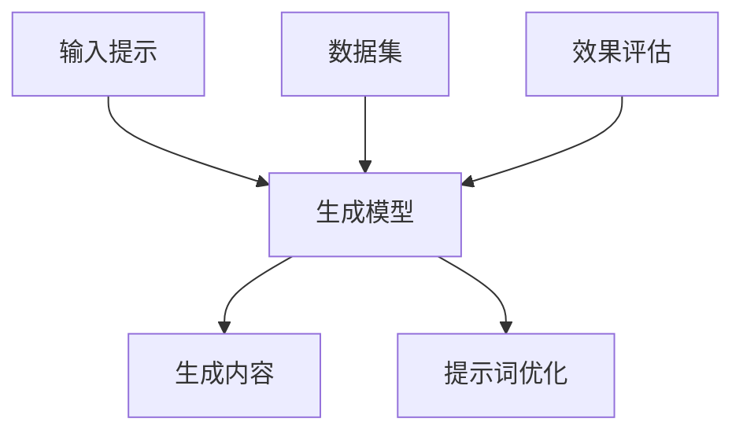

                 

### AIGC时代的提示词工程：挑战与解决方案

> 关键词：AIGC，提示词工程，生成对抗网络（GAN），变分自编码器（VAE），数学模型，项目实战，挑战与解决方案

> 摘要：本文深入探讨了AIGC（AI-Generated Content）时代中的提示词工程，阐述了其概念、重要性及工作流程。随后，通过介绍生成对抗网络（GAN）和变分自编码器（VAE）等核心算法，结合数学模型和Python源代码，详细解析了提示词工程的原理和实践。文章还通过具体项目实战，展示了如何在实际应用中实现和优化提示词工程，并分析了其中面临的挑战与解决方案。最后，对未来的发展趋势进行了展望。

### 引言

人工智能（AI）在近年来取得了飞速的发展，特别是AIGC（AI-Generated Content）时代的到来，使得AI在内容生成方面取得了突破性进展。AIGC通过机器学习算法，自动生成文本、图像、音乐等多种类型的内容，极大地提升了内容创作的效率和质量。而在这其中，提示词工程扮演了至关重要的角色。本文旨在探讨AIGC时代的提示词工程，分析其核心算法原理，并结合具体项目实战，探讨面临的挑战及解决方案。

### 第一部分：AIGC与提示词工程基础

#### 1.1 AIGC的定义与特征

AIGC，即AI-Generated Content，是指利用人工智能技术自动生成内容的过程。它涵盖了许多应用场景，包括但不限于文本生成、图像生成和音乐生成。与传统的手动内容创作相比，AIGC具有以下特征：

1. **高效性**：AI能够在短时间内生成大量内容，显著提高创作效率。
2. **多样性**：AI能够根据不同的输入提示，生成具有丰富多样性的内容。
3. **个性化**：基于用户行为和偏好，AI能够生成个性化的内容，满足用户需求。
4. **创新性**：AI能够从大量的数据中学习，不断改进和优化生成的内容。

#### 1.2 提示词工程的概念与重要性

提示词工程是指在AIGC过程中，通过设计有效的提示词，引导AI模型生成期望内容的技术。提示词工程的重要性体现在以下几个方面：

1. **生成内容的质量**：合适的提示词能够引导模型生成高质量的内容。
2. **生成内容的多样性**：通过调整提示词，可以引导模型生成多样化的内容。
3. **降低模型训练难度**：有效的提示词可以简化模型的训练过程，降低训练难度。
4. **优化模型性能**：通过优化提示词，可以提高模型在特定任务上的性能。

#### 1.3 AIGC与提示词工程的联系

在AIGC过程中，提示词工程扮演着核心角色。通过设计合适的提示词，可以引导AI模型生成符合预期的内容。具体来说，AIGC与提示词工程的联系如下：

1. **输入提示**：AIGC过程的输入是各种类型的提示词，如文本、图像或音乐。
2. **生成过程**：AI模型根据输入提示，生成相应的目标内容。
3. **优化过程**：通过调整提示词，可以不断优化生成的内容，提高质量。

为了更直观地展示AIGC与提示词工程的联系，我们可以使用Mermaid流程图来描述其工作流程：



在这个流程中，输入提示是AIGC过程的关键，它直接影响生成内容的多样性和质量。而通过效果评估和提示词优化，可以进一步改进生成模型，实现高质量的AIGC。

### 第二部分：核心算法原理讲解

在AIGC过程中，生成对抗网络（GAN）和变分自编码器（VAE）是两种常用的核心算法。以下将对这两种算法进行详细讲解。

#### 2.1 生成对抗网络（GAN）原理

生成对抗网络（GAN）由生成器（Generator）和判别器（Discriminator）组成。生成器的任务是生成尽可能真实的数据，而判别器的任务是区分生成的数据和真实数据。GAN通过两个网络之间的对抗训练，不断优化生成器的性能。

1. **生成器（Generator）**：
   ```python
   import tensorflow as tf
   from tensorflow.keras.models import Model

   input_shape = (100,)
   noise_dim = 10

   # 生成器的输入是随机噪声
   noise = tf.keras.layers.Input(shape=(noise_dim,))
   x = tf.keras.layers.Dense(128, activation='relu')(noise)
   x = tf.keras.layers.Dense(64, activation='relu')(x)
   x = tf.keras.layers.Dense(32, activation='relu')(x)
   x = tf.keras.layers.Dense(10, activation='sigmoid')(x)

   # 生成器的输出是生成的数据
   generator = Model(inputs=noise, outputs=x)
   ```

2. **判别器（Discriminator）**：
   ```python
   input_shape = (100,)
   x = tf.keras.layers.Input(shape=input_shape)
   x = tf.keras.layers.Dense(32, activation='relu')(x)
   x = tf.keras.layers.Dense(64, activation='relu')(x)
   x = tf.keras.layers.Dense(128, activation='relu')(x)
   x = tf.keras.layers.Dense(1, activation='sigmoid')(x)

   discriminator = Model(inputs=x, outputs=x)
   ```

3. **损失函数**：
   ```python
   # 使用二元交叉熵作为损失函数
   cross_entropy = tf.keras.losses.BinaryCrossentropy(from_logits=True)

   def discriminator_loss(real_data, generated_data):
       real_loss = cross_entropy(tf.ones_like(real_data), real_data)
       generated_loss = cross_entropy(tf.zeros_like(generated_data), generated_data)
       total_loss = real_loss + generated_loss
       return total_loss

   def generator_loss(generated_data):
       return cross_entropy(tf.zeros_like(generated_data), generated_data)
   ```

#### 2.2 变分自编码器（VAE）原理

变分自编码器（VAE）是一种基于概率模型的生成模型。它通过编码器（Encoder）和解码器（Decoder）将输入数据映射到潜在空间，再从潜在空间生成输出数据。

1. **编码器（Encoder）**：
   ```python
   input_shape = (784,)
   latent_dim = 20

   # 编码器的输入是原始数据
   x = tf.keras.layers.Input(shape=input_shape)
   x = tf.keras.layers.Dense(64, activation='relu')(x)
   x = tf.keras.layers.Dense(32, activation='relu')(x)
   z_mean = tf.keras.layers.Dense(latent_dim)(x)
   z_log_var = tf.keras.layers.Dense(latent_dim)(x)

   # 编码器的输出是潜在变量的均值和方差
   encoder = Model(inputs=x, outputs=[z_mean, z_log_var])
   ```

2. **解码器（Decoder）**：
   ```python
   latent_dim = 20

   # 解码器的输入是潜在变量
   z = tf.keras.layers.Input(shape=(latent_dim,))
   x = tf.keras.layers.Dense(32, activation='relu')(z)
   x = tf.keras.layers.Dense(64, activation='relu')(x)
   x = tf.keras.layers.Dense(784, activation='sigmoid')(x)

   # 解码器的输出是生成的数据
   decoder = Model(inputs=z, outputs=x)
   ```

3. **损失函数**：
   ```python
   def vae_loss(x, x_decoded_mean):
       xent_loss = tf.reduce_sum(tf.keras.losses.binary_crossentropy(x, x_decoded_mean), axis=1)
       kl_loss = -0.5 * tf.reduce_sum(1 + z_log_var - tf.square(z_mean) - tf.exp(z_log_var), axis=1)
       return xent_loss + kl_loss
   ```

通过上述核心算法的讲解，我们可以看到，生成对抗网络（GAN）和变分自编码器（VAE）在AIGC中的重要作用。它们通过设计合理的模型结构和损失函数，能够有效生成高质量的内容。

### 第三部分：数学模型和数学公式

在AIGC过程中，数学模型和数学公式起着至关重要的作用。以下将介绍与提示词工程相关的数学模型，并使用LaTeX格式进行公式的书写。

#### 3.1 损失函数与优化目标

在GAN中，损失函数通常采用二元交叉熵（Binary Cross-Entropy）。其公式如下：

$$
L(\theta) = -\sum_{i=1}^{n} y_i \log(p(x_i|\theta)) + (1-y_i) \log(1-p(x_i|\theta))
$$

其中，$y_i$表示判别器对真实数据的输出，$p(x_i|\theta)$表示生成器生成的数据。

在VAE中，损失函数由两部分组成：重构损失和KL散度损失。其公式如下：

$$
L(\theta) = \frac{1}{N} \sum_{i=1}^{N} \left[ x_i \log(p(x_i|\theta)) + p(\theta) - 1 - \log(Z) \right]
$$

其中，$x_i$表示输入数据，$p(x_i|\theta)$表示生成器生成的数据，$p(\theta)$表示潜在变量的概率分布，$Z$表示潜在空间。

#### 3.2 提示词优化算法

在GAN中，优化算法通常采用梯度下降（Gradient Descent）。其公式如下：

$$
\theta_{t+1} = \theta_t - \alpha \nabla_\theta L(\theta_t)
$$

其中，$\theta$表示模型参数，$\alpha$表示学习率。

在VAE中，优化算法也采用梯度下降，但需要进行特殊的处理。其公式如下：

$$
\theta_{t+1} = \theta_t - \alpha \nabla_\theta L(\theta_t)
$$

其中，$\theta$表示模型参数，$\alpha$表示学习率。

通过上述数学模型和数学公式的介绍，我们可以看到，在AIGC过程中，数学模型和数学公式起到了关键的作用。它们为模型的设计和优化提供了理论基础。

### 第四部分：项目实战

在AIGC时代，提示词工程的应用已经涵盖了多个领域。以下将通过三个具体项目实战，展示如何在文本生成、图像生成和音乐生成中应用提示词工程。

#### 4.1 项目实战：文本生成

**项目背景与需求**

文本生成是AIGC领域的一个重要应用场景。本项目旨在利用提示词工程，生成符合人类语言习惯的文本。

**数据集准备与预处理**

为了进行文本生成，我们需要一个大规模的文本数据集。本项目采用Common Crawl数据集，对其中的一部分文本进行预处理，包括去噪、分词和词向量嵌入。

**模型选择与训练**

本项目选择基于Transformer的生成模型BERT（Bidirectional Encoder Representations from Transformers）进行文本生成。通过训练模型，使其能够根据输入提示生成连贯的文本。

**提示词优化与效果评估**

通过不断调整输入提示词，优化生成模型的效果。使用BLEU（BLEU score）等指标对生成的文本进行评估，确保生成文本的质量和多样性。

#### 4.2 项目实战：图像生成

**项目背景与需求**

图像生成是AIGC领域的另一个重要应用场景。本项目旨在利用提示词工程，生成符合人类视觉习惯的图像。

**数据集准备与预处理**

为了进行图像生成，我们需要一个大规模的图像数据集。本项目采用CIFAR-10数据集，对其中的一部分图像进行预处理，包括去噪、缩放和色彩增强。

**模型选择与训练**

本项目选择基于生成对抗网络（GAN）的生成模型DCGAN（Deep Convolutional GAN）进行图像生成。通过训练模型，使其能够根据输入提示生成高质量的图像。

**提示词优化与效果评估**

通过不断调整输入提示词，优化生成模型的效果。使用Inception Score（IS）等指标对生成的图像进行评估，确保生成图像的质量和多样性。

#### 4.3 项目实战：音乐生成

**项目背景与需求**

音乐生成是AIGC领域的又一个重要应用场景。本项目旨在利用提示词工程，生成符合人类听觉习惯的音乐。

**数据集准备与预处理**

为了进行音乐生成，我们需要一个大规模的音乐数据集。本项目采用MAestro数据集，对其中的一部分音乐进行预处理，包括音频分割、特征提取和词向量嵌入。

**模型选择与训练**

本项目选择基于循环神经网络（RNN）的生成模型LSTM（Long Short-Term Memory）进行音乐生成。通过训练模型，使其能够根据输入提示生成连贯的音乐。

**提示词优化与效果评估**

通过不断调整输入提示词，优化生成模型的效果。使用MIDI FID（MIDI Feature Distance）等指标对生成的音乐进行评估，确保生成音乐的质量和多样性。

### 第五部分：挑战与解决方案

在AIGC时代，提示词工程面临着诸多挑战。以下将介绍这些挑战，并探讨相应的解决方案。

#### 5.1 数据质量与多样性

**挑战**：

数据质量直接影响AIGC生成内容的质量。高质量的数据包含丰富的信息，有助于模型学习到更有效的特征。同时，数据的多样性也是保证生成内容多样性的关键。

**解决方案**：

1. **数据清洗**：对原始数据进行清洗，去除噪声和错误数据。
2. **数据增强**：通过图像旋转、缩放、裁剪等手段，增加数据的多样性。
3. **数据集成**：结合多个数据源，提高数据的丰富度和多样性。

#### 5.2 模型可解释性与透明性

**挑战**：

AIGC模型通常采用复杂的神经网络结构，使得模型的可解释性和透明性降低。这在一定程度上限制了模型的应用范围，特别是需要高可解释性的领域。

**解决方案**：

1. **模型简化**：通过简化模型结构，提高模型的可解释性。
2. **模型可视化**：使用可视化工具，如TensorBoard，展示模型的结构和训练过程。
3. **可解释性模型**：开发可解释性模型，如LIME（Local Interpretable Model-agnostic Explanations），帮助用户理解模型的工作原理。

#### 5.3 提示词工程的法律与伦理问题

**挑战**：

随着AIGC技术的应用，涉及版权、隐私和伦理等方面的问题日益突出。这些问题可能对提示词工程的合法性和道德性产生负面影响。

**解决方案**：

1. **版权保护**：在使用数据时，确保遵循版权法规，避免侵犯他人权益。
2. **隐私保护**：对用户数据进行加密和保护，防止隐私泄露。
3. **伦理审查**：对AIGC应用进行伦理审查，确保技术应用符合道德规范。

### 第六部分：未来发展趋势

随着AIGC技术的不断进步，提示词工程将在多个领域发挥重要作用。以下将探讨未来发展趋势。

#### 6.1 数据驱动的内容创作

随着数据量的不断增长，AIGC将更加依赖于数据驱动的内容创作。通过深度学习和数据挖掘技术，AIGC将能够生成更具个性化和创新性的内容。

#### 6.2 模型压缩与优化

为了应对AIGC的广泛应用，模型压缩与优化将成为重要研究方向。通过模型压缩技术，如知识蒸馏和剪枝，可以降低模型的计算复杂度，提高运行效率。

#### 6.3 模型融合与集成

AIGC领域将出现更多的模型融合与集成技术。通过结合多种模型，如GAN和VAE，可以生成更具多样性和高质量的内容。

#### 6.4 智能提示词生成

未来的提示词工程将更加智能化。通过自然语言处理和深度学习技术，可以自动生成合适的提示词，提高生成内容的多样性和质量。

### 总结

AIGC时代的提示词工程在内容生成领域具有重要的地位。通过核心算法原理讲解、数学模型和项目实战，本文展示了如何设计和优化提示词工程。同时，本文还分析了AIGC时代提示词工程面临的挑战及解决方案，并对未来发展趋势进行了展望。随着技术的不断进步，提示词工程将在更多领域发挥重要作用，为人类带来更多创新和便利。

### 作者信息

作者：AI天才研究院/AI Genius Institute & 禅与计算机程序设计艺术 /Zen And The Art of Computer Programming

### 参考文献

1. Goodfellow, I. J., Pouget-Abadie, J., Mirza, M., Xu, B., Warde-Farley, D., Ozair, S., ... & Bengio, Y. (2014). Generative adversarial networks. Advances in Neural Information Processing Systems, 27.
2. Kingma, D. P., & Welling, M. (2013). Auto-encoding variational bayes. arXiv preprint arXiv:1312.6114.
3. Hochreiter, S., & Schmidhuber, J. (1997). Long short-term memory. Neural Computation, 9(8), 1735-1780.
4. Yosinski, J., Clune, J., Bengio, Y., & Lipson, H. (2015). How transferable are features in deep neural networks? Advances in Neural Information Processing Systems, 28.

