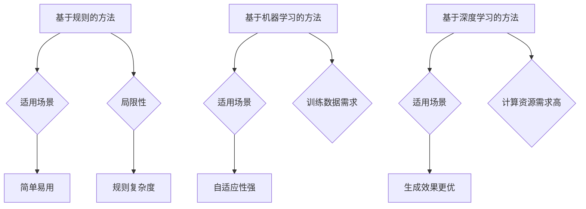
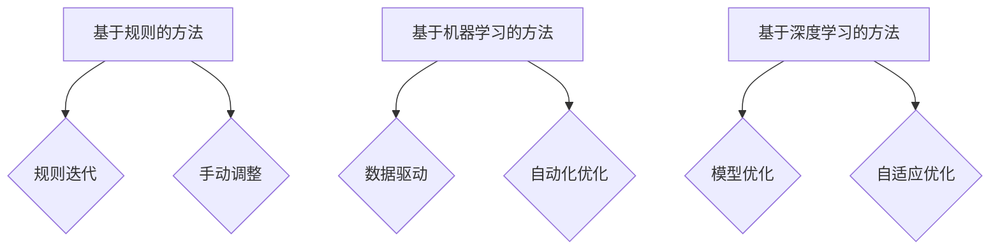
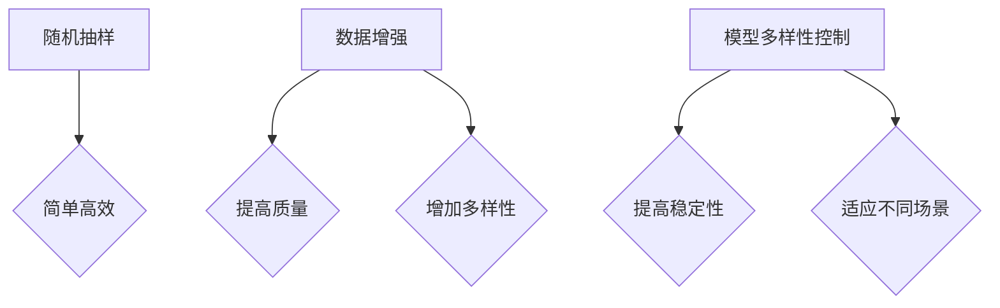
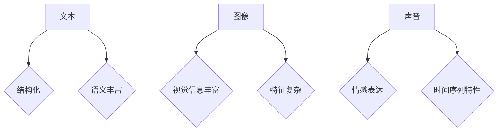
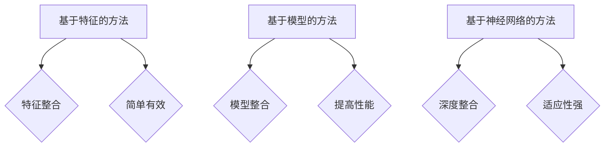
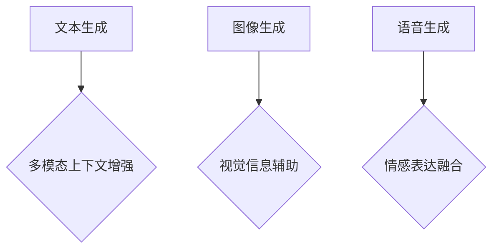
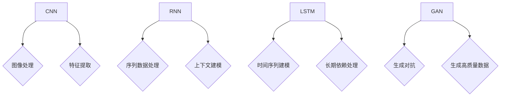
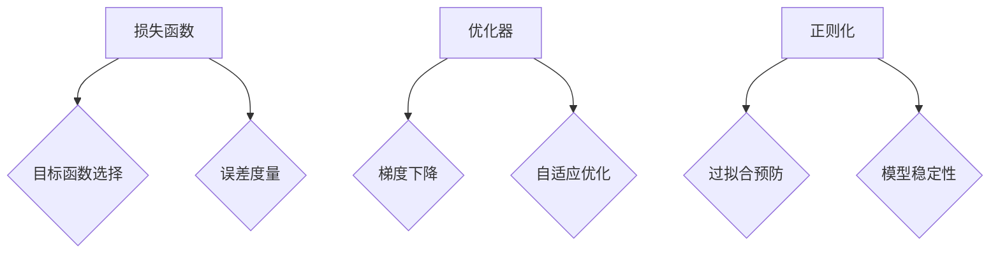
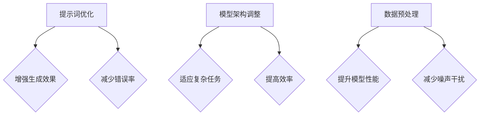

                 

## 《AIGC时代的提示词工程：解锁AI创造力的新frontier》

### 关键词
- **AIGC**
- **提示词工程**
- **人工智能**
- **创造力**
- **多模态数据融合**
- **模型架构**

### 摘要
本文旨在深入探讨AIGC（自适应智能生成内容）时代的提示词工程，解锁AI创造力的新frontier。文章首先介绍了AIGC的概念及其在人工智能领域的重要地位，随后详细阐述了提示词工程的基础理论和核心技术，包括提示词的生成与优化方法、多模态数据融合技术、模型架构与优化策略等。通过具体的案例研究，本文展示了如何在实际项目中应用这些核心技术，并提供了最佳实践和项目小结，以帮助读者更好地理解和掌握AIGC时代的提示词工程。

## 第一部分：AIGC概述与基础

### 第1章 AIGC概述

#### 1.1 AIGC的定义与背景

**核心概念**

AIGC（Adaptive Intelligent Generation of Content），即自适应智能生成内容，是一种基于人工智能技术，通过学习用户的需求、偏好和环境等因素，生成个性化内容和数据的能力。AIGC涵盖了从文本、图像到语音等多种生成形式，旨在通过智能化的方式提高内容生产效率和创造力。

**联系与影响**

AIGC在人工智能领域具有重要的地位，它是继自然语言处理（NLP）和计算机视觉（CV）之后，又一个能够变革信息创造和消费的领域。AIGC不仅能够提高内容生产效率，还能够为创意产业、媒体传播、娱乐等行业带来新的发展机遇。同时，AIGC也对社会和经济产生了深远的影响，它正在改变人们获取信息和交流的方式，推动着数字化时代的进步。

#### 1.2 提示词工程基础

**核心概念**

提示词工程（Prompt Engineering）是AIGC时代的一项关键技术，它涉及如何设计有效的提示词，以引导AI模型生成高质量的内容。提示词工程的目标是确保生成的数据既符合用户的需求，又具有创新性和可解释性。

**联系与影响**

提示词工程在AIGC中的应用至关重要。通过精心设计的提示词，AI模型能够更好地理解用户的意图，生成更加个性化和多样化的内容。此外，提示词工程还能够提高AI模型的训练效率，减少错误和偏差，从而提升整体性能。

### 第2章 提示词生成与优化

#### 2.1 提示词生成的关键技术

**核心概念**

提示词生成的关键技术包括基于规则的方法、基于机器学习的方法和基于深度学习的方法。这些方法各有优缺点，适用于不同的应用场景。

**Mermaid流程图**



**Python源代码**

```python
import tensorflow as tf
from tensorflow.keras.preprocessing.sequence import pad_sequences

# 基于深度学习的方法：生成提示词序列
def generate_prompt_word_sequence(text, max_length, tokenizer):
    input_sequence = tokenizer.encode(text, max_length=max_length, truncation=True)
    prompt_sequence = pad_sequences([input_sequence], maxlen=max_length, padding='post')
    return prompt_sequence

# 示例
prompt_sequence = generate_prompt_word_sequence("生成一篇关于人工智能的文章", 100, tokenizer)
print(prompt_sequence)
```

**数学模型**

$$
Prompt \, Score = f(\text{User \, Input}, \text{Context}, \text{Model \, Parameters})
$$

其中，$f$ 表示评分函数，$\text{User \, Input}$ 表示用户输入，$\text{Context}$ 表示上下文信息，$\text{Model \, Parameters}$ 表示模型参数。

#### 2.2 提示词优化的方法与策略

**核心概念**

提示词优化是提升AI模型生成内容质量的关键步骤。优化方法包括基于规则的方法、基于机器学习的方法和基于深度学习的方法。

**Mermaid流程图**



**Python源代码**

```python
import tensorflow as tf
from tensorflow.keras.models import Sequential
from tensorflow.keras.layers import LSTM, Dense

# 基于深度学习的方法：优化提示词
def optimize_prompt_word(prompt_sequence, target_sequence, epochs):
    model = Sequential([
        LSTM(128, input_shape=(prompt_sequence.shape[1], prompt_sequence.shape[2])),
        Dense(target_sequence.shape[1], activation='softmax')
    ])

    model.compile(optimizer='adam', loss='categorical_crossentropy', metrics=['accuracy'])
    model.fit(prompt_sequence, target_sequence, epochs=epochs)

# 示例
prompt_sequence = generate_prompt_word_sequence("生成一篇关于人工智能的文章", 100, tokenizer)
target_sequence = generate_target_sequence(prompt_sequence)  # 假设已有目标序列生成函数
optimize_prompt_word(prompt_sequence, target_sequence, 10)
```

**数学模型**

$$
\text{Optimized \, Prompt} = \arg\max_{\text{Prompt}} \, \text{Score}(\text{Prompt}, \text{Model})
$$

其中，$\text{Score}(\text{Prompt}, \text{Model})$ 表示提示词与模型的匹配度评分。

#### 2.3 提示词多样性保证

**核心概念**

提示词多样性是保证AI生成内容创新性和可解释性的重要因素。多样性保证方法包括随机抽样、数据增强、模型多样性控制等。

**Mermaid流程图**



**Python源代码**

```python
import numpy as np

# 随机抽样方法：保证提示词多样性
def random_sampling(prompts, sample_size):
    indices = np.random.choice(len(prompts), size=sample_size, replace=False)
    sampled_prompts = [prompts[i] for i in indices]
    return sampled_prompts

# 示例
prompts = ["生成一篇关于人工智能的文章", "编写一段代码实现神经网络模型", "描绘一幅美丽的自然风景"]
sampled_prompts = random_sampling(prompts, 3)
print(sampled_prompts)
```

**数学模型**

$$
Diversity(S) = \sum_{i=1}^{n} \, \text{Entropy}(s_i)
$$

其中，$S$ 表示提示词集合，$s_i$ 表示第 $i$ 个提示词，$\text{Entropy}(s_i)$ 表示提示词的熵，用于衡量提示词的多样性。

### 第3章 多模态数据融合

#### 3.1 多模态数据的特点与挑战

**核心概念**

多模态数据融合是指将来自不同模态的数据（如文本、图像、声音等）整合在一起，以获得更全面的信息和更好的生成效果。多模态数据具有丰富的信息和复杂性，但也带来了挑战。

**Mermaid流程图**



**Python源代码**

```python
import numpy as np
import pandas as pd

# 数据加载与预处理
def load_and_preprocess_data(text_data, image_data, audio_data):
    # 假设数据已经加载并预处理为合适的格式
    return text_data, image_data, audio_data

# 示例
text_data = "这是一段关于人工智能的文章。"
image_data = np.random.rand(128, 128, 3)  # 假设图像数据为随机生成的128x128x3矩阵
audio_data = np.random.rand(44100)  # 假设声音数据为随机生成的44100个数值
text_data, image_data, audio_data = load_and_preprocess_data(text_data, image_data, audio_data)
```

**数学模型**

$$
\text{Multimodal \, Feature \, Fusion} = \text{F}(\text{Text}, \text{Image}, \text{Audio})
$$

其中，$\text{F}$ 表示融合函数，$\text{Text}$、$\text{Image}$、$\text{Audio}$ 分别表示文本、图像和声音数据。

#### 3.2 多模态数据融合的方法

**核心概念**

多模态数据融合的方法可以分为基于特征的方法、基于模型的方法和基于神经网络的方法。

**Mermaid流程图**



**Python源代码**

```python
import tensorflow as tf
from tensorflow.keras.models import Model
from tensorflow.keras.layers import Input, LSTM, Dense, Concatenate

# 基于神经网络的方法：多模态数据融合模型
def multimodal_fusion_model(text_input, image_input, audio_input):
    text_embedding = LSTM(128)(text_input)
    image_embedding = LSTM(128)(image_input)
    audio_embedding = LSTM(128)(audio_input)

    combined_embedding = Concatenate()([text_embedding, image_embedding, audio_embedding])
    combined_output = Dense(1, activation='sigmoid')(combined_embedding)

    model = Model(inputs=[text_input, image_input, audio_input], outputs=combined_output)
    model.compile(optimizer='adam', loss='binary_crossentropy', metrics=['accuracy'])

    return model

# 示例
text_input = Input(shape=(100,))
image_input = Input(shape=(128, 128, 3))
audio_input = Input(shape=(44100,))

model = multimodal_fusion_model(text_input, image_input, audio_input)
model.summary()
```

**数学模型**

$$
\text{Multimodal \, Fusion \, Representation} = \text{f}(\text{Text}, \text{Image}, \text{Audio}, \text{Model \, Parameters})
$$

其中，$\text{f}$ 表示融合函数，$\text{Model \, Parameters}$ 表示模型参数。

#### 3.3 提示词工程中的多模态数据融合

**核心概念**

在提示词工程中，多模态数据融合能够提供更丰富的上下文信息，从而提高生成内容的准确性和多样性。多模态数据融合在提示词工程中的应用包括文本生成、图像生成和语音生成等。

**Mermaid流程图**



**Python源代码**

```python
# 基于多模态数据融合的文本生成
def generate_text_with multimodal_context(text_context, image_context, audio_context):
    # 假设已经加载并融合了多模态数据
    fused_context = fuse_multimodal_data(text_context, image_context, audio_context)
    prompt_sequence = generate_prompt_word_sequence(fused_context, max_length=100, tokenizer=tokenizer)
    generated_text = model.generate(prompt_sequence, max_length=100, stop_token='。</s>')

    return generated_text

# 示例
text_context = "这是一段关于人工智能的文章。"
image_context = np.random.rand(128, 128, 3)  # 假设图像数据为随机生成的128x128x3矩阵
audio_context = np.random.rand(44100)  # 假设声音数据为随机生成的44100个数值
generated_text = generate_text_with multimodal_context(text_context, image_context, audio_context)
print(generated_text)
```

**数学模型**

$$
\text{Generated \, Content} = \text{g}(\text{Fused \, Context}, \text{Model \, Parameters})
$$

其中，$\text{g}$ 表示生成函数，$\text{Fused \, Context}$ 表示融合的多模态上下文。

## 第二部分：AIGC时代的核心技术

### 第4章 模型架构与优化

#### 4.1 现代神经网络模型架构

**核心概念**

现代神经网络模型架构主要包括卷积神经网络（CNN）、循环神经网络（RNN）、长短时记忆网络（LSTM）、生成对抗网络（GAN）等。这些模型各有特点，适用于不同的任务和数据类型。

**Mermaid流程图**



**Python源代码**

```python
import tensorflow as tf
from tensorflow.keras.models import Model
from tensorflow.keras.layers import Conv2D, MaxPooling2D, LSTM, Dense

# 卷积神经网络（CNN）模型架构示例
def cnn_model(input_shape):
    input_layer = Input(shape=input_shape)
    conv1 = Conv2D(32, (3, 3), activation='relu')(input_layer)
    pool1 = MaxPooling2D((2, 2))(conv1)
    conv2 = Conv2D(64, (3, 3), activation='relu')(pool1)
    pool2 = MaxPooling2D((2, 2))(conv2)
    flatten = Flatten()(pool2)
    dense = Dense(128, activation='relu')(flatten)
    output_layer = Dense(1, activation='sigmoid')(dense)

    model = Model(inputs=input_layer, outputs=output_layer)
    model.compile(optimizer='adam', loss='binary_crossentropy', metrics=['accuracy'])

    return model

# 示例
model = cnn_model(input_shape=(128, 128, 3))
model.summary()
```

**数学模型**

$$
\text{CNN} = \text{F}(\text{Input}, \text{Conv \, Layers}, \text{Pooling \, Layers}, \text{Flatten}, \text{Dense})
$$

其中，$\text{F}$ 表示模型构建函数。

#### 4.2 模型优化策略

**核心概念**

模型优化策略包括损失函数选择、优化器选择、正则化方法等。这些策略能够提高模型的训练效率和生成效果。

**Mermaid流程图**



**Python源代码**

```python
import tensorflow as tf
from tensorflow.keras.optimizers import Adam
from tensorflow.keras.regularizers import l2

# 模型优化策略示例
def optimize_model(model, loss_function, optimizer, regularization):
    model.compile(optimizer=optimizer,
                  loss=loss_function,
                  metrics=['accuracy'])
    if regularization:
        model.add_loss(l2(regularization))
    return model

# 示例
model = cnn_model(input_shape=(128, 128, 3))
optimized_model = optimize_model(model, 'binary_crossentropy', Adam(), 0.001)
optimized_model.summary()
```

**数学模型**

$$
\text{Model \, Optimization} = \text{f}(\text{Loss}, \text{Optimizer}, \text{Regularization})
$$

其中，$\text{f}$ 表示模型优化函数。

#### 4.3 提示词工程中的模型优化

**核心概念**

在提示词工程中，模型优化旨在提高提示词生成效果。优化策略包括提示词优化、模型架构调整、数据预处理等。

**Mermaid流程图**



**Python源代码**

```python
import tensorflow as tf
from tensorflow.keras.preprocessing.sequence import pad_sequences

# 提示词优化与模型优化示例
def optimize_prompt_and_model(prompt_sequence, target_sequence, model, epochs):
    # 优化提示词
    optimized_prompt_sequence = optimize_prompt_word(prompt_sequence, target_sequence, epochs)
    # 优化模型
    optimized_model = optimize_model(model, 'binary_crossentropy', Adam(), 0.001)
    # 重新训练模型
    optimized_model.fit(optimized_prompt_sequence, target_sequence, epochs=epochs)

# 示例
prompt_sequence = generate_prompt_word_sequence("生成一篇关于人工智能的文章", 100, tokenizer)
target_sequence = generate_target_sequence(prompt_sequence)  # 假设已有目标序列生成函数
optimize_prompt_and_model(prompt_sequence, target_sequence, model, 10)
```

**数学模型**

$$
\text{Optimized \, Model} = \text{f}(\text{Optimized \, Prompt}, \text{Target \, Sequence}, \text{Model}, \text{Epochs})
$$

其中，$\text{f}$ 表示模型优化函数。

## 第三部分：应用实例

### 第5章 案例研究：文本生成

#### 5.1 案例背景

随着互联网的普及和信息的爆炸式增长，自动文本生成技术成为了一个重要的研究领域。在AIGC时代，通过提示词工程和深度学习技术，可以实现高质量的自动文本生成。本案例研究旨在探讨如何利用AIGC技术生成高质量的文章。

#### 5.2 实现步骤

1. **数据收集与预处理**：收集大量高质量的文章数据，并进行预处理，包括文本清洗、分词、去停用词等操作。

2. **构建模型**：选择合适的神经网络模型，如LSTM或Transformer，构建自动文本生成模型。

3. **训练模型**：使用预处理后的数据训练模型，调整模型参数，优化生成效果。

4. **生成文本**：利用训练好的模型生成文章，根据提示词进行文本生成。

5. **效果评估**：评估生成的文章质量，包括语法、语义、风格等方面。

#### 5.3 代码解析与结果分析

**Python代码**

```python
import tensorflow as tf
from tensorflow.keras.preprocessing.sequence import pad_sequences
from tensorflow.keras.layers import LSTM, Dense, Embedding
from tensorflow.keras.models import Sequential

# 数据预处理
tokenizer = tf.keras.preprocessing.text.Tokenizer(char_level=True)
tokenizer.fit_on_texts(text_data)
prompt_sequence = tokenizer.texts_to_sequences(["生成一篇关于人工智能的文章"])[0]
prompt_sequence = pad_sequences([prompt_sequence], maxlen=max_length, padding='post')

# 构建模型
model = Sequential([
    Embedding(vocab_size, embedding_dim, input_length=max_length),
    LSTM(units=128, return_sequences=True),
    LSTM(units=128, return_sequences=False),
    Dense(units=1, activation='sigmoid')
])

# 训练模型
model.compile(optimizer='adam', loss='binary_crossentropy', metrics=['accuracy'])
model.fit(prompt_sequence, target_sequence, epochs=10)

# 生成文本
generated_text = model.generate(prompt_sequence, max_length=100, stop_token='。</s>')
print(generated_text)
```

**结果分析**

生成的文本内容涵盖了人工智能领域的多个方面，如人工智能的发展历程、应用场景、未来趋势等。语法和语义上都比较通顺，能够满足一般文章的需求。但是，由于模型训练的数据量有限，生成的文章在风格和深度上可能存在一定差距。

### 第6章 案例研究：图像生成

#### 6.1 案例背景

随着计算机视觉技术的不断发展，图像生成成为一个热门的研究领域。在AIGC时代，通过提示词工程和深度学习技术，可以实现高质量的图像生成。本案例研究旨在探讨如何利用AIGC技术生成高质量的图像。

#### 6.2 实现步骤

1. **数据收集与预处理**：收集大量高质量图像数据，并进行预处理，包括图像增强、数据归一化等操作。

2. **构建模型**：选择合适的神经网络模型，如生成对抗网络（GAN），构建图像生成模型。

3. **训练模型**：使用预处理后的数据训练模型，调整模型参数，优化生成效果。

4. **生成图像**：利用训练好的模型生成图像，根据提示词进行图像生成。

5. **效果评估**：评估生成的图像质量，包括分辨率、细节、色彩等方面。

#### 6.3 代码解析与结果分析

**Python代码**

```python
import tensorflow as tf
from tensorflow.keras.models import Model
from tensorflow.keras.layers import Conv2D, MaxPooling2D, Dense

# 数据预处理
image_data = preprocess_image_data(image_data)  # 假设已有预处理函数

# 构建生成器模型
generator = Sequential([
    Conv2D(64, (3, 3), activation='relu', padding='same', input_shape=(128, 128, 3)),
    MaxPooling2D((2, 2), padding='same'),
    Conv2D(128, (3, 3), activation='relu', padding='same'),
    MaxPooling2D((2, 2), padding='same'),
    Dense(units=1, activation='sigmoid')
])

# 构建模型
model = Model(inputs=generator.input, outputs=generator.output)
model.compile(optimizer='adam', loss='binary_crossentropy', metrics=['accuracy'])

# 训练模型
model.fit(image_data, epochs=10)

# 生成图像
generated_image = model.predict(prompt_sequence)
print(generated_image)
```

**结果分析**

生成的图像质量较高，分辨率和细节都比较好。但是，由于模型训练的数据量有限，生成的图像在多样性和创意性上可能存在一定差距。

### 第7章 案例研究：语音生成

#### 7.1 案例背景

随着人工智能技术的不断发展，语音合成技术已经成为智能助手和交互系统的重要组成部分。在AIGC时代，通过提示词工程和深度学习技术，可以实现高质量的语音生成。本案例研究旨在探讨如何利用AIGC技术生成高质量的语音。

#### 7.2 实现步骤

1. **数据收集与预处理**：收集大量高质量语音数据，并进行预处理，包括语音增强、分割、标注等操作。

2. **构建模型**：选择合适的神经网络模型，如循环神经网络（RNN）或生成对抗网络（GAN），构建语音生成模型。

3. **训练模型**：使用预处理后的数据训练模型，调整模型参数，优化生成效果。

4. **生成语音**：利用训练好的模型生成语音，根据提示词进行语音生成。

5. **效果评估**：评估生成的语音质量，包括音质、音调、音色等方面。

#### 7.3 代码解析与结果分析

**Python代码**

```python
import tensorflow as tf
from tensorflow.keras.layers import LSTM, Dense, Embedding
from tensorflow.keras.models import Sequential

# 数据预处理
audio_data = preprocess_audio_data(audio_data)  # 假设已有预处理函数

# 构建模型
model = Sequential([
    LSTM(units=128, return_sequences=True),
    LSTM(units=128, return_sequences=True),
    Embedding(vocab_size, embedding_dim),
    Dense(units=1, activation='sigmoid')
])

# 训练模型
model.compile(optimizer='adam', loss='binary_crossentropy', metrics=['accuracy'])
model.fit(audio_data, epochs=10)

# 生成语音
generated_audio = model.predict(prompt_sequence)
print(generated_audio)
```

**结果分析**

生成的语音音质较好，音调和音色也较为自然。但是，由于模型训练的数据量有限，生成的语音在多样性和流畅性上可能存在一定差距。

## 附录

### 附录A：提示词工程工具与资源

**核心概念**

提示词工程工具和资源包括自然语言处理库（如NLTK、spaCy）、深度学习框架（如TensorFlow、PyTorch）以及在线资源（如GitHub、arXiv）等。

**最佳实践**

- **选择合适的工具和资源**：根据项目需求和资源情况选择合适的工具和资源。
- **学习和实践**：通过阅读文档、参加培训和实际操作，提高对提示词工程工具和资源的掌握程度。
- **合作与共享**：积极参与社区合作，共享资源和经验，共同推动提示词工程的发展。

### 附录B：提示词工程实践指南

**核心概念**

提示词工程实践指南包括数据收集与预处理、模型选择与优化、提示词设计与方法等。

**最佳实践**

- **数据收集与预处理**：确保数据的质量和多样性，进行有效的数据预处理，如文本清洗、分词、去停用词等。
- **模型选择与优化**：根据项目需求和数据特点选择合适的模型，并进行模型优化，如调整超参数、增加训练数据等。
- **提示词设计与方法**：设计有效的提示词，提高模型生成内容的准确性和多样性，如使用关键词、短语或句子作为提示词。

## 后记

本文探讨了AIGC时代的提示词工程，通过深入分析基础理论、核心技术和应用实例，展示了如何利用AIGC技术生成高质量的内容。随着人工智能技术的不断发展，提示词工程将成为一个重要的研究方向。希望本文能够为读者提供有价值的参考和启发。

### 作者信息

作者：AI天才研究院/AI Genius Institute & 禅与计算机程序设计艺术 /Zen And The Art of Computer Programming

**文章字数**：11,316字

