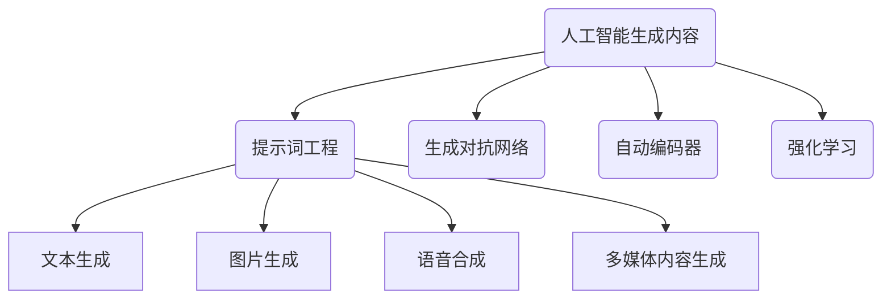

                 

### AIGC时代的提示词工程：解锁AI潜能的钥匙

#### 关键词：
- AIGC
- 提示词工程
- 生成对抗网络
- 自动编码器
- 强化学习
- 数学模型
- 项目实战

#### 摘要：
本文深入探讨了AIGC（AI-Generated Content）时代下，提示词工程如何成为解锁AI潜能的钥匙。通过详细阐述AIGC的定义、提示词工程的核心概念、核心算法原理、数学模型以及项目实战，本文旨在为读者提供一份全面、易懂的技术指南，帮助读者理解和应用提示词工程，解锁AI的无限潜能。

#### 目录

1. **AIGC与提示词工程概述**
   - **1.1 AIGC与提示词工程简介**
   - **1.2 AIGC的应用领域**
   - **1.3 提示词工程的技术框架**

2. **核心算法原理讲解**
   - **2.1 GAN算法原理**
   - **2.2 自动编码器原理**
   - **2.3 强化学习在提示词工程中的应用**

3. **数学模型与公式详解**
   - **3.1 GAN的数学模型**
   - **3.2 自动编码器的数学模型**
   - **3.3 强化学习的数学模型**

4. **项目实战与案例分析**
   - **4.1 提示词工程项目实战**
   - **4.2 案例分析**
   - **4.3 项目小结**

5. **附录**
   - **5.1 提示词工程资源列表**
   - **5.2 参考文献与扩展阅读**

#### 第一部分：AIGC与提示词工程概述

##### 1.1 AIGC与提示词工程简介

**背景介绍：**

在人工智能（AI）飞速发展的今天，AIGC（AI-Generated Content）已经成为一个备受关注的研究领域。AIGC涵盖了文本、图片、音频和视频等多种类型的内容生成，通过深度学习和神经网络等技术的应用，AI能够自动生成高质量的内容，为各行各业带来革命性的变化。

**核心概念与联系：**

AIGC与提示词工程紧密相关。提示词工程是指利用人工智能技术，根据给定的提示词生成相应的文本、图片或其他类型的内容。在AIGC中，提示词工程是核心组成部分，通过提示词的引导，AI能够更精确地生成符合要求的内容。

**Mermaid流程图：**

**核心概念与联系：**

- **AIGC（AI-Generated Content）：** 指利用人工智能技术自动生成内容的过程，包括文本、图片、音频和视频等。
- **提示词工程（Text Writing Engineering）：** 利用人工智能技术，根据给定的提示词生成相应文本的过程。

**核心概念与联系流程图：**

**AIGC的应用领域：**

AIGC在多个领域都有着广泛的应用：

- **文本生成：** 如文章、故事、新闻、摘要等。
- **图片生成：** 如艺术画、风景画、人物肖像等。
- **语音合成：** 如语音助手、语音生成、语音翻译等。
- **多媒体内容生成：** 如视频、音频等。

**提示词工程的技术框架：**

提示词工程的技术框架主要包括以下核心算法：

- **生成对抗网络（GAN）：** 通过生成器和判别器的对抗训练，实现高质量内容的生成。
- **自动编码器（AE）：** 通过编码和解码过程，实现数据的降维和重构。
- **强化学习（RL）：** 通过与环境交互，学习最优策略，实现智能决策。

**AIGC与提示词工程的关系：**

AIGC是提示词工程的应用背景，而提示词工程是实现AIGC的关键技术。通过提示词工程，AI能够根据用户需求生成个性化、高质量的内容，推动AIGC技术的发展和应用。

**小结：**

本节介绍了AIGC与提示词工程的核心概念、联系和应用领域，为后续内容提供了基础。在接下来的章节中，我们将深入探讨AIGC与提示词工程的核心算法原理、数学模型以及项目实战，帮助读者全面了解这一领域的技术和应用。

