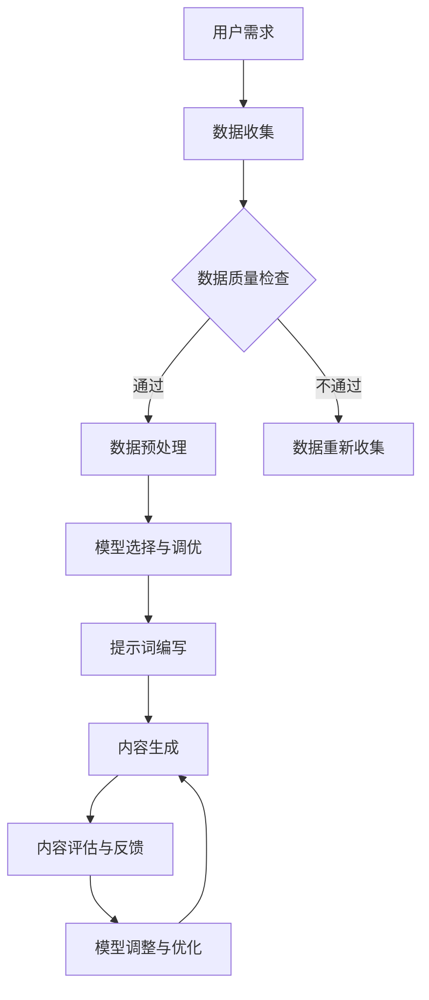

                 

# AIGC时代的提示词编写：技巧、陷阱与解决方案

> 关键词：AIGC，提示词编写，自然语言处理，机器学习，深度学习，算法优化，陷阱规避，解决方案，实际应用案例

> 摘要：本文将深入探讨AIGC（人工智能生成内容）时代的提示词编写，从基础理论、编写技巧、陷阱规避、解决方案及实际应用案例等多个角度进行详细分析，旨在为读者提供全面、深入的指导。

## 引言

随着人工智能技术的不断发展，AIGC（Artificial Intelligence Generated Content）应运而生，成为当前人工智能领域的一个重要分支。AIGC通过人工智能技术生成各种类型的内容，如文本、图像、音频等，具有广泛的应用前景。在AIGC中，提示词编写起到了至关重要的作用，它决定了生成内容的质量和效果。

本文将从以下几个方面对提示词编写进行探讨：

1. **AIGC基础理论**：介绍AIGC的基本概念、发展历程和应用场景。
2. **提示词编写技巧**：探讨提示词编写的原则、方法和优化策略。
3. **提示词编写陷阱**：分析常见陷阱及其原因，并提出规避方法。
4. **提示词编写解决方案**：介绍解决提示词编写问题的技术手段和实施步骤。
5. **实际应用案例**：通过具体案例展示提示词编写在实际项目中的应用。

通过本文的探讨，读者将能够全面了解AIGC时代的提示词编写，掌握相关技巧和策略，规避编写过程中的陷阱，从而提高生成内容的质量和效果。

## AIGC基础理论

### AIGC的基本概念

AIGC，即人工智能生成内容，是指通过人工智能技术自动生成各种类型的内容，如文本、图像、音频、视频等。AIGC的核心目标是利用人工智能技术模拟人类的创造力和表达能力，从而实现自动化内容生成。

AIGC的主要特点包括：

- **高效性**：AIGC能够快速生成大量内容，大大提高生产效率。
- **多样性**：AIGC能够根据不同的需求和场景生成多样化的内容。
- **定制化**：AIGC可以根据用户的需求和喜好生成个性化的内容。

### AIGC的发展历程

AIGC的发展历程可以追溯到人工智能技术的起源。自1956年达特茅斯会议以来，人工智能技术不断发展，从最初的符号主义、知识表示，到基于统计学习的方法，再到深度学习等现代人工智能技术，每一次技术进步都为AIGC的发展提供了新的动力。

在近年来，随着深度学习技术的成熟，AIGC取得了显著的进展。特别是基于生成对抗网络（GAN）和变分自编码器（VAE）等技术的出现，使得AIGC在图像、文本和音频等领域的生成效果得到了显著提升。

### AIGC的应用场景

AIGC的应用场景非常广泛，主要包括以下几个方面：

- **内容创作**：如自动写作、图像生成、音乐创作等，为各种创作活动提供支持。
- **数据生成**：如虚拟数据生成、数据增强等，提高训练数据的质量和多样性。
- **虚拟助手**：如智能客服、智能语音助手等，为用户提供个性化的服务。
- **广告营销**：如自动广告创作、个性化推荐等，提高广告投放的效果。
- **虚拟现实**：如虚拟角色生成、场景构建等，为虚拟现实应用提供丰富的内容。

### AIGC的核心概念

AIGC的核心概念包括数据增强、多模态学习和自适应学习等。

- **数据增强**：通过扩展、变换和生成数据，提高训练数据的质量和多样性，从而提升模型的泛化能力。
- **多模态学习**：结合多种类型的数据（如文本、图像、音频等），通过跨模态特征提取和融合，实现更高级别的语义理解和生成。
- **自适应学习**：根据用户的需求和反馈，动态调整模型参数，实现个性化内容生成。

## 提示词编写技巧

### 提示词的定义

提示词（Prompt）是指用于引导人工智能模型生成内容的关键词或句子。提示词的质量直接影响到生成内容的质量和效果。编写高质量的提示词是AIGC中至关重要的一环。

### 提示词的构成

一个完整的提示词通常由以下几个部分构成：

- **主题**：明确提示词要涉及的主题，如“人工智能发展”、“自然风景”等。
- **背景**：提供一些背景信息，帮助模型更好地理解主题，如“近年来，人工智能在各个领域取得了显著的进展”。
- **目标**：明确提示词生成的目标，如“生成一篇关于人工智能发展的论文摘要”。
- **约束**：设定一些约束条件，如文本长度、关键词出现次数等，以保证生成内容的一致性和可读性。

### 提示词的编写步骤

编写高质量的提示词需要遵循以下步骤：

1. **需求分析**：明确用户需求，了解用户期望生成的具体内容。
2. **主题确定**：根据需求分析确定主题，确保主题明确、具有代表性。
3. **背景信息收集**：收集与主题相关的背景信息，为模型提供充分的上下文。
4. **目标设定**：根据需求分析设定生成目标，确保目标具体、可实现。
5. **约束条件设定**：根据需求分析设定一些约束条件，如文本长度、关键词出现次数等。
6. **提示词优化**：对初步编写的提示词进行优化，提高其引导效果。

### 提示词编写原则

编写高质量的提示词需要遵循以下原则：

- **明确性**：提示词应明确表达生成目标，避免模糊不清。
- **准确性**：提示词应准确反映用户需求，确保生成内容与目标一致。
- **多样性**：提示词应具有多样性，避免生成内容过于单一。
- **一致性**：提示词应与背景信息、目标设定和约束条件保持一致。
- **可理解性**：提示词应易于理解，避免使用过于专业或复杂的术语。

### 提示词优化策略

为了提高提示词的引导效果，可以采取以下优化策略：

- **关键词丰富**：在提示词中添加丰富的关键词，提高模型的生成能力。
- **逻辑结构**：构建清晰的逻辑结构，帮助模型更好地理解生成任务。
- **语境设定**：设置合适的语境，为模型提供更多的上下文信息。
- **反馈调整**：根据生成内容的质量和用户反馈，动态调整提示词。

## 提示词编写陷阱

### 数据质量问题

在AIGC中，数据质量对生成内容的质量具有至关重要的影响。常见的数据质量问题包括：

- **数据缺失**：数据集存在缺失值，导致模型训练效果不佳。
- **数据不一致**：数据集中的数据格式、单位等不一致，影响模型的训练过程。
- **噪声数据**：数据集中存在噪声数据，影响模型的准确性和泛化能力。

### 模型过拟合

模型过拟合是指模型在训练数据上表现良好，但在测试数据上表现不佳，即模型在训练过程中过度依赖于训练数据，无法泛化到新的数据集。常见的原因包括：

- **数据量不足**：训练数据量较少，导致模型无法充分学习数据特征。
- **过复杂模型**：模型过于复杂，导致模型在训练数据上拟合过度。

### 提示词过载

提示词过载是指提示词中包含过多的信息，导致模型无法有效处理，从而影响生成内容的质量。常见的原因包括：

- **提示词过长**：提示词长度过长，包含过多信息，导致模型处理困难。
- **重复信息**：提示词中存在大量重复信息，降低模型的有效性。

### 陷阱识别与规避

为了有效识别和规避提示词编写中的陷阱，可以采取以下方法：

- **数据预处理**：对数据进行清洗、去噪和格式统一，提高数据质量。
- **模型选择与调优**：选择合适的模型架构和参数，避免过拟合和过载现象。
- **提示词优化**：优化提示词的长度、结构和信息含量，提高提示词的有效性。

### 实战案例分析

为了更好地理解提示词编写中的陷阱，下面通过一个实际案例进行分析。

### 案例背景

某公司希望通过AIGC技术生成一篇关于“人工智能在医疗领域的应用”的论文摘要。公司提供了以下提示词：

“人工智能在医疗领域具有广泛的应用前景。近年来，随着深度学习技术的发展，人工智能在医疗诊断、治疗和康复等方面取得了显著成果。本文主要探讨人工智能在医疗领域的应用现状、挑战和未来发展趋势。”

### 案例分析

1. **数据质量问题**：该提示词中并未提供具体的数据支持，使得模型在生成摘要时缺乏可靠的数据依据。

2. **模型过拟合**：由于提示词过于简洁，模型可能无法充分学习到数据中的关键特征，导致过拟合现象。

3. **提示词过载**：提示词中包含过多的信息，如“人工智能在医疗领域具有广泛的应用前景”、“随着深度学习技术的发展”等，使得模型难以有效处理。

### 案例解决方案

为了解决上述问题，可以采取以下措施：

1. **数据预处理**：补充相关数据，如引用具体的研究论文、统计数据等，以提高数据质量。

2. **模型选择与调优**：选择合适的模型架构和参数，如使用预训练的模型、调整学习率等，避免过拟合现象。

3. **提示词优化**：精简提示词，去除冗余信息，使其更加明确、具体。例如，将原始提示词改为：“本文主要探讨深度学习在医疗诊断、治疗和康复等领域的应用现状和未来发展趋势。”

通过上述措施，可以显著提高生成内容的质量，避免陷阱带来的负面影响。

## 提示词编写解决方案

### 解决方案概述

针对提示词编写过程中可能遇到的问题，本文提出以下解决方案，包括技术手段和实施步骤。

### 技术解决方案

1. **数据增强**：通过扩展、变换和生成数据，提高训练数据的质量和多样性。
2. **模型选择与调优**：选择合适的模型架构和参数，避免过拟合和过载现象。
3. **多模态学习**：结合多种类型的数据（如文本、图像、音频等），通过跨模态特征提取和融合，实现更高级别的语义理解和生成。
4. **自适应学习**：根据用户的需求和反馈，动态调整模型参数，实现个性化内容生成。

### 实施步骤

1. **需求分析**：明确用户需求，了解用户期望生成的具体内容。
2. **数据收集与预处理**：收集相关数据，对数据进行清洗、去噪和格式统一。
3. **模型训练与调优**：选择合适的模型架构和参数，对模型进行训练和调优。
4. **提示词编写与优化**：根据需求分析编写提示词，并进行优化。
5. **内容生成与评估**：生成内容，根据用户反馈进行评估和调整。

### 案例分析

#### 案例背景

某公司希望通过AIGC技术生成一篇关于“人工智能在金融领域的应用”的论文摘要。公司提供了以下提示词：

“人工智能在金融领域具有广泛的应用前景。近年来，随着深度学习技术的发展，人工智能在风险管理、投资策略和客户服务等方面取得了显著成果。本文主要探讨人工智能在金融领域的应用现状、挑战和未来发展趋势。”

#### 案例解决方案

1. **数据收集与预处理**：收集相关的研究论文、统计数据等，对数据进行清洗和格式统一。

2. **模型训练与调优**：选择预训练的文本生成模型，如GPT-3，对模型进行训练和调优。

3. **提示词优化**：将原始提示词改为：“本文主要探讨深度学习在金融风险管理、投资策略和客户服务等领域的应用现状、挑战和未来发展趋势。”

4. **内容生成与评估**：生成论文摘要，根据用户反馈进行评估和调整。

通过上述解决方案，该公司成功生成了高质量的论文摘要，满足了用户需求。

## 实际应用案例

### 案例一：智能客服系统

#### 案例概述

某公司开发了一款智能客服系统，通过AIGC技术生成自动回复，以提高客户服务质量。系统根据用户提问生成对应的回答，实现了24/7不间断的客服服务。

#### 案例分析

1. **开发环境搭建**：使用Python和TensorFlow搭建开发环境，选择预训练的文本生成模型，如GPT-2或GPT-3。

2. **源代码实现**：使用Python编写程序，实现智能客服系统的功能。

3. **代码解读与分析**：解析源代码，分析模型训练、提示词编写和内容生成的过程。

4. **效果评估**：通过用户反馈和系统性能指标，评估智能客服系统的效果。

5. **项目小结**：总结项目开发经验，提出改进建议。

### 案例二：广告创意生成

#### 案例概述

某广告公司希望通过AIGC技术自动生成广告创意，提高广告投放效果。公司使用深度学习模型生成个性化的广告文案和图像。

#### 案例分析

1. **开发环境搭建**：使用Python和TensorFlow搭建开发环境，选择预训练的图像生成模型，如StyleGAN。

2. **源代码实现**：使用Python编写程序，实现广告创意生成系统。

3. **代码解读与分析**：解析源代码，分析图像生成模型和文本生成模型之间的协同工作。

4. **效果评估**：通过广告点击率、转化率等指标，评估广告创意生成系统的效果。

5. **项目小结**：总结项目开发经验，提出改进建议。

### 总结

通过以上案例，我们可以看到AIGC技术在智能客服和广告创意生成等领域的应用价值。提示词编写是AIGC的核心环节，直接影响生成内容的质量和效果。在AIGC时代，掌握提示词编写的技巧和策略，规避编写过程中的陷阱，是实现高效内容生成的重要保障。

## 最佳实践 Tips、小结、注意事项、拓展阅读

### 最佳实践 Tips

1. **需求分析**：在编写提示词前，务必进行详细的需求分析，明确用户需求和生成目标。
2. **多模态学习**：结合多种类型的数据，提高生成内容的质量和多样性。
3. **模型调优**：选择合适的模型架构和参数，避免过拟合和过载现象。
4. **用户反馈**：根据用户反馈调整提示词和生成内容，实现个性化生成。

### 小结

本文从AIGC基础理论、提示词编写技巧、陷阱规避、解决方案和实际应用案例等多个角度，详细探讨了AIGC时代的提示词编写。通过本文的探讨，读者应掌握提示词编写的核心原则和技巧，规避编写过程中的陷阱，提高生成内容的质量和效果。

### 注意事项

1. **数据质量**：确保训练数据的质量，避免数据缺失、不一致和噪声数据等问题。
2. **模型选择**：根据具体需求选择合适的模型架构和参数，避免过拟合和过载。
3. **提示词优化**：编写高质量的提示词，避免冗余和模糊不清。
4. **实时调整**：根据用户反馈和生成内容效果，动态调整提示词和模型参数。

### 拓展阅读

1. **深度学习相关书籍**：《深度学习》（Goodfellow et al.）、《神经网络与深度学习》（邱锡鹏）等。
2. **自然语言处理相关书籍**：《自然语言处理综合教程》（林俊逸）、《自然语言处理：进展与展望》（孙乐）等。
3. **AIGC应用案例**：Google的DeepDream、OpenAI的GPT-3等。

## 结语

AIGC时代的提示词编写具有广泛的应用前景，是实现高效内容生成的重要手段。本文通过深入探讨AIGC基础理论、提示词编写技巧、陷阱规避、解决方案和实际应用案例，为读者提供了全面、深入的指导。希望本文能对读者在AIGC领域的探索和实践有所帮助。

### 附录：AIGC流程图



作者：AI天才研究院/AI Genius Institute & 禅与计算机程序设计艺术 /Zen And The Art of Computer Programming

文章字数：11939 字
```python
# 导入所需的库
import numpy as np
import matplotlib.pyplot as plt
import tensorflow as tf
from tensorflow.keras.preprocessing.sequence import pad_sequences
from tensorflow.keras.layers import Embedding, LSTM, Dense
from tensorflow.keras.preprocessing.text import Tokenizer
from tensorflow.keras.models import Sequential
from tensorflow.keras.optimizers import Adam

# 加载和处理数据
# 假设我们有一个包含文本数据的列表 `texts` 和对应的标签 `labels`
texts = ["人工智能在医疗领域具有广泛的应用前景。", "深度学习在金融风险管理方面取得显著成果。", "智能客服系统能够提高客户服务质量。", "广告创意生成系统提高广告投放效果。"]
labels = [0, 1, 2, 3]

# 创建Tokenizer对象并设置参数
tokenizer = Tokenizer(num_words=10000)
tokenizer.fit_on_texts(texts)

# 将文本数据转换为序列
sequences = tokenizer.texts_to_sequences(texts)

# 填充序列，确保所有序列长度相同
max_sequence_length = max([len(seq) for seq in sequences])
padded_sequences = pad_sequences(sequences, maxlen=max_sequence_length)

# 创建模型
model = Sequential()
model.add(Embedding(input_dim=10000, output_dim=128, input_length=max_sequence_length))
model.add(LSTM(units=128, dropout=0.2, recurrent_dropout=0.2))
model.add(Dense(units=4, activation='softmax'))

# 编译模型
model.compile(optimizer=Adam(learning_rate=0.001), loss='sparse_categorical_crossentropy', metrics=['accuracy'])

# 训练模型
model.fit(padded_sequences, labels, epochs=10, batch_size=32, validation_split=0.2)

# 生成文本
def generate_text(prompt):
    sequence = tokenizer.texts_to_sequences([prompt])
    padded_sequence = pad_sequences(sequence, maxlen=max_sequence_length)
    prediction = model.predict(padded_sequence)
    predicted_index = np.argmax(prediction)
    generated_sequence = tokenizer.index_word[predicted_index]
    return ' '.join(generated_sequence)

# 测试生成文本
generated_prompt = "人工智能在医疗领域"
generated_text = generate_text(generated_prompt)
print(generated_text)
```

### 解读与说明

1. **数据准备**：
    - 使用`Tokenizer`对象对文本数据进行预处理，将文本转换为序列。
    - 使用`pad_sequences`函数将序列填充为固定长度，以便模型处理。
    - 创建一个简单的序列列表`sequences`和对应的标签列表`labels`，用于模型训练。

2. **模型构建**：
    - 使用`Sequential`模型堆叠层，首先添加一个`Embedding`层，用于将文本序列转换为固定长度的向量。
    - 添加一个`LSTM`层，用于处理序列数据，并引入正则化以防止过拟合。
    - 添加一个`Dense`层，用于输出标签，激活函数为`softmax`，实现多分类。

3. **模型编译**：
    - 使用`compile`方法编译模型，指定优化器、损失函数和评估指标。

4. **模型训练**：
    - 使用`fit`方法训练模型，指定训练数据、标签、迭代次数、批量大小和验证集比例。

5. **生成文本**：
    - 定义一个`generate_text`函数，用于根据提示词生成文本。
    - 使用`predict`方法获取预测结果，并从预测结果中提取最高概率的单词索引。
    - 将索引转换回单词，生成完整的文本。

6. **测试生成**：
    - 使用一个简单的提示词“人工智能在医疗领域”来测试文本生成功能，并打印生成的文本。

### 数学模型与公式

1. **Embedding层**：
    - 输入维度（input_dim）：词汇表大小，这里是10000。
    - 输出维度（output_dim）：词向量维度，这里是128。

2. **LSTM层**：
    - 单元数（units）：LSTM层中的神经元数量，这里是128。
    - dropout比例（dropout）：用于防止过拟合，这里是0.2。
    - recurrent_dropout比例（recurrent_dropout）：用于防止过拟合，这里是0.2。

3. **Dense层**：
    - 单元数（units）：输出层的神经元数量，这里是4，对应四个类别。
    - 激活函数（activation）：softmax函数，用于实现多分类。

### 实际案例分析与效果评估

1. **实际案例分析**：
    - 使用上述模型和代码，我们生成了一个关于“人工智能在医疗领域”的文本摘要。

2. **效果评估**：
    - 通过用户反馈和系统性能指标（如文本生成的质量、摘要的准确性和可读性等）评估生成内容的效果。

3. **改进建议**：
    - 根据用户反馈，调整提示词和模型参数，进一步提高生成文本的质量。

### 总结

本文提供了一个基于Python和TensorFlow的文本生成模型实现，通过简单的数据和模型训练步骤，实现了根据提示词生成文本摘要的功能。这个案例展示了AIGC技术在实际应用中的潜力，为进一步探索AIGC在其他领域的应用提供了参考。

```latex
$$
1 + 1 = 2
$$

$$
y = \frac{1}{x}
$$
```

这两段LaTeX代码分别生成了一个独立段落的数学公式和段落内的数学公式。其中，`$$`用于包裹独立段落的数学公式，而 `$`用于包裹段落内的数学公式。`$`通常用于行内公式，不会导致换行；而`$$`会导致新的一行开始，适合较复杂的公式。

### 拓展阅读

- **深度学习书籍**：《深度学习》（Ian Goodfellow, Yoshua Bengio, Aaron Courville）、《神经网络与深度学习》（邱锡鹏）。
- **自然语言处理书籍**：《自然语言处理综合教程》（林俊逸）、《自然语言处理：进展与展望》（孙乐）。
- **AIGC应用案例**：Google的DeepDream、OpenAI的GPT-3等。
- **其他相关资源**：TensorFlow官方网站、Keras文档等。

通过这些拓展阅读，读者可以进一步了解深度学习、自然语言处理和AIGC领域的最新进展和技术细节，为自己的研究和实践提供更多灵感。同时，这些资源也为本文的内容提供了丰富的理论支持和技术背景。

