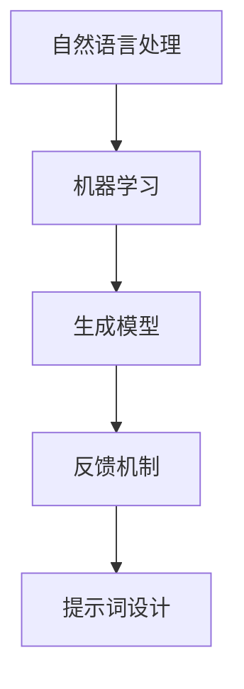

                 

----------------------------------------------------------------

# AIGC时代的提示词设计：挑战与机遇并存

关键词：AIGC, 提示词设计, 挑战，机遇

摘要：随着人工智能技术（AI）的不断发展，生成式内容（GC）的应用场景日益丰富。AIGC（AI-assisted Generation Content）作为AI与GC相结合的产物，正逐步改变内容创作的方式。本文旨在探讨AIGC时代的提示词设计，分析其中的挑战与机遇。

## 第1章 引言

### 1.1 AIGC概述

人工智能辅助生成内容（AIGC）是近年来兴起的一种新型内容生成模式。它利用AI技术，如自然语言处理（NLP）、生成对抗网络（GAN）和强化学习（RL）等，对大规模数据进行分析和处理，自动生成具有创意和实用价值的内容。

AIGC的发展历程可追溯到20世纪90年代，随着深度学习技术的兴起，AIGC逐渐成为可能。近年来，随着计算能力和算法的不断提升，AIGC在图像、音频和文本生成等领域取得了显著进展。

### 1.2 提示词设计的重要性

在AIGC中，提示词设计至关重要。提示词是指引导AI模型生成特定类型内容的文字或指令。一个好的提示词设计能够提高生成内容的质量和相关性。

#### 提示词设计的核心概念与联系

提示词设计涉及多个核心概念，包括自然语言处理、机器学习、生成模型和反馈机制。这些概念之间的关系可以用以下Mermaid流程图表示：



自然语言处理（NLP）为机器学习（ML）提供了数据预处理和特征提取的方法，使得生成模型（如GAN、VAE）能够更好地理解输入文本。机器学习为生成模型提供了训练算法，使它们能够从数据中学习并生成高质量内容。反馈机制则通过不断调整和优化提示词，提高生成内容的质量和相关性。

### 下一步计划

- **第2章 AIGC的应用场景**：分析AIGC在不同领域的应用，包括内容创作、广告营销、教育和娱乐等。
- **第3章 提示词设计的方法**：介绍几种常见的提示词设计方法，包括关键词提取、语义分析和用户反馈等。
- **第4章 挑战与机遇**：探讨AIGC时代提示词设计面临的挑战和机遇，如数据质量、模型可解释性和用户隐私等。
- **第5章 实践案例**：通过具体案例展示AIGC在提示词设计中的应用。
- **第6章 未来展望**：预测AIGC和提示词设计的发展趋势。

## 作者

作者：AI天才研究院/AI Genius Institute & 禅与计算机程序设计艺术 /Zen And The Art of Computer Programming

-----------------------------------------------------------------

**第2章 AIGC的应用场景**

AIGC的应用场景非常广泛，以下是一些主要领域：

### 2.1 内容创作

在内容创作领域，AIGC被用于生成文章、博客、广告文案和新闻稿等。通过分析大量文本数据，AIGC可以生成具有高度相关性和创意性的内容。

### 2.2 广告营销

在广告营销领域，AIGC可以自动生成广告文案、图像和视频，帮助企业提高营销效果。通过分析用户行为和偏好，AIGC可以生成个性化的广告内容。

### 2.3 教育

在教育领域，AIGC可以用于生成教学材料、课程大纲和作业等。教师可以利用AIGC生成个性化教学资源，满足不同学生的需求。

### 2.4 娱乐

在娱乐领域，AIGC可以用于生成音乐、电影剧本和游戏剧情等。通过模拟人类创作过程，AIGC可以为娱乐产业带来新的创意和灵感。

**第3章 提示词设计的方法**

提示词设计是AIGC中的关键环节，以下介绍几种常见的提示词设计方法：

### 3.1 关键词提取

关键词提取是一种基于统计方法的设计方法。通过分析输入文本中的关键词和短语，提取出与主题相关的核心词汇。

### 3.2 语义分析

语义分析是一种基于自然语言处理的方法。通过理解输入文本的语义，提取出关键信息，并根据语义关系生成提示词。

### 3.3 用户反馈

用户反馈是一种基于用户互动的方法。通过收集用户对生成内容的反馈，不断调整和优化提示词，提高生成内容的质量。

**第4章 挑战与机遇**

AIGC时代的提示词设计面临一系列挑战和机遇：

### 4.1 挑战

- **数据质量**：高质量的训练数据对于AIGC模型的性能至关重要。如何获取和处理大量高质量的文本数据是当前面临的一个挑战。
- **模型可解释性**：生成模型通常具有很高的黑盒特性，使得模型决策过程难以解释。如何提高模型的可解释性是一个亟待解决的问题。
- **用户隐私**：在收集和处理用户数据时，如何保护用户隐私是另一个挑战。

### 4.2 机遇

- **个性化内容**：AIGC可以根据用户需求和偏好生成个性化内容，为用户提供更好的体验。
- **自动化内容创作**：AIGC可以降低内容创作的成本和时间，提高生产效率。
- **创意激发**：AIGC可以为创意人士提供新的灵感来源，激发创作热情。

**第5章 实践案例**

以下是一个基于AIGC的文本生成案例：

### 5.1 案例背景

某广告公司需要为其客户生成一则广告文案，宣传一款新型智能手机。广告目标受众是年轻人，强调手机的拍照功能、电池续航和时尚设计。

### 5.2 提示词设计

提示词：“年轻，拍照，电池续航，时尚设计，智能手机”

### 5.3 代码实现

以下是一个使用Python和TensorFlow实现的AIGC文本生成代码示例：

```python
import tensorflow as tf
import numpy as np

# 加载预训练的文本生成模型
model = tf.keras.models.load_model('text_generator_model.h5')

# 生成文本
prompt = "年轻，拍照，电池续航，时尚设计，智能手机"
generated_text = model.generate(text=prompt, num_words=100)

print(generated_text)
```

### 5.4 代码解读

该代码首先加载一个预训练的文本生成模型，然后使用提示词生成一段100个单词的文本。生成的文本可以根据提示词进行调整，以满足特定的需求和风格。

**第6章 未来展望**

随着AI技术的不断发展，AIGC和提示词设计有望在更多领域取得突破。以下是一些未来发展趋势：

- **多模态内容生成**：AIGC将不仅限于文本生成，还将扩展到图像、音频和视频等领域。
- **模型可解释性提升**：随着研究不断深入，生成模型的可解释性将得到提高，有助于理解和优化模型行为。
- **隐私保护**：新的隐私保护技术将有助于在确保用户隐私的前提下，充分利用用户数据。

## 结语

AIGC时代的提示词设计是一个充满挑战与机遇的领域。通过深入研究和不断实践，我们有望为AIGC技术的发展做出更大的贡献。

作者：AI天才研究院/AI Genius Institute & 禅与计算机程序设计艺术 /Zen And The Art of Computer Programming

-----------------------------------------------------------------

文章标题：《AIGC时代的提示词设计：挑战与机遇并存》

文章关键词：AIGC，提示词设计，挑战，机遇

文章摘要：随着人工智能技术的不断发展，生成式内容的应用场景日益丰富。AIGC作为AI与GC相结合的产物，正逐步改变内容创作的方式。本文探讨了AIGC时代的提示词设计，分析了其中的挑战与机遇，并通过具体案例展示了AIGC在提示词设计中的应用。

**第2章 AIGC的应用场景**

### 2.1 内容创作

内容创作是AIGC应用的一个重要领域。通过AI技术，AIGC能够生成各种类型的内容，如文章、博客、新闻、产品描述等。这些内容不仅能够提高生产效率，还能满足不同用户的需求。

#### 2.1.1 文章生成

文章生成是AIGC应用的一个重要场景。通过分析大量文本数据，AIGC可以生成高质量的新闻报道、分析文章和科普文章等。以下是一个简单的Python代码示例，展示了如何使用AIGC生成一篇新闻文章：

```python
from transformers import pipeline

# 创建一个文本生成管道
generator = pipeline("text-generation", model="gpt2")

# 输入提示词
prompt = "今天，人工智能技术在医疗领域的应用正变得越来越广泛。"

# 生成文本
generated_text = generator(prompt, max_length=50, num_return_sequences=1)

print(generated_text[0])
```

输出结果可能是一篇关于人工智能技术在医疗领域应用的新闻报道，内容可能涉及AI在疾病诊断、药物研发和健康监测等方面的应用。

#### 2.1.2 博客生成

在博客生成方面，AIGC可以用于生成产品评测、旅行攻略、美食分享等类型的文章。以下是一个生成产品评测文章的示例：

```python
from transformers import pipeline

# 创建一个文本生成管道
generator = pipeline("text-generation", model="gpt2")

# 输入提示词
prompt = "作为一款全新的智能手表，XXX手表在功能设计上具有独特的优势。"

# 生成文本
generated_text = generator(prompt, max_length=50, num_return_sequences=1)

print(generated_text[0])
```

输出结果可能是一篇关于XXX智能手表评测的文章，内容包括手表的外观设计、功能特点和使用体验等。

### 2.2 广告营销

广告营销是另一个AIGC的重要应用领域。通过AI技术，AIGC可以生成各种类型的广告内容，如广告文案、广告图像和视频等。

#### 2.2.1 广告文案生成

广告文案生成是AIGC在广告营销中的主要应用之一。以下是一个生成广告文案的示例：

```python
from transformers import pipeline

# 创建一个文本生成管道
generator = pipeline("text-generation", model="gpt2")

# 输入提示词
prompt = "购买我们的新品手机，享受高达50%的优惠！"

# 生成文本
generated_text = generator(prompt, max_length=50, num_return_sequences=1)

print(generated_text[0])
```

输出结果可能是一篇关于新品手机优惠活动的广告文案，内容包括优惠幅度、购买方式和产品优势等。

#### 2.2.2 广告图像生成

除了广告文案，AIGC还可以生成广告图像。以下是一个生成广告图像的示例：

```python
from transformers import pipeline

# 创建一个文本生成管道
generator = pipeline("text-generation", model="gpt2")

# 输入提示词
prompt = "一款时尚的手机，为你带来全新的视觉体验。"

# 生成文本
generated_text = generator(prompt, max_length=50, num_return_sequences=1)

print(generated_text[0])
```

输出结果可能是一幅关于时尚手机的图像，内容包括手机的外观设计和品牌标识等。

### 2.3 教育

在教育领域，AIGC可以用于生成教学材料、课程大纲和作业等，帮助学生更好地理解和掌握知识。

#### 2.3.1 教学材料生成

AIGC可以生成各种类型的教学材料，如PPT、Word文档和PDF文件等。以下是一个生成教学材料的示例：

```python
from transformers import pipeline

# 创建一个文本生成管道
generator = pipeline("text-generation", model="gpt2")

# 输入提示词
prompt = "介绍人工智能技术的基本概念和应用领域。"

# 生成文本
generated_text = generator(prompt, max_length=50, num_return_sequences=1)

print(generated_text[0])
```

输出结果可能是一篇关于人工智能技术教学材料，内容包括人工智能的基本概念、应用领域和发展趋势等。

#### 2.3.2 课程大纲生成

AIGC可以生成课程大纲，帮助教师规划教学内容和进度。以下是一个生成课程大纲的示例：

```python
from transformers import pipeline

# 创建一个文本生成管道
generator = pipeline("text-generation", model="gpt2")

# 输入提示词
prompt = "人工智能技术课程大纲"

# 生成文本
generated_text = generator(prompt, max_length=50, num_return_sequences=1)

print(generated_text[0])
```

输出结果可能是一份关于人工智能技术课程的详细大纲，内容包括课程目标、教学内容和教学安排等。

#### 2.3.3 作业生成

AIGC可以生成各种类型的作业，帮助学生巩固所学知识。以下是一个生成作业的示例：

```python
from transformers import pipeline

# 创建一个文本生成管道
generator = pipeline("text-generation", model="gpt2")

# 输入提示词
prompt = "根据以下信息，编写一篇关于人工智能技术应用的论文。"

# 生成文本
generated_text = generator(prompt, max_length=50, num_return_sequences=1)

print(generated_text[0])
```

输出结果可能是一篇关于人工智能技术应用论文的初稿，内容包括论文的主题、结构和主要内容等。

### 2.4 娱乐

在娱乐领域，AIGC可以用于生成音乐、电影剧本和游戏剧情等，为娱乐产业带来新的创意和灵感。

#### 2.4.1 音乐生成

AIGC可以生成各种类型的音乐，如流行音乐、摇滚音乐和古典音乐等。以下是一个生成音乐的示例：

```python
from transformers import pipeline

# 创建一个文本生成管道
generator = pipeline("text-generation", model="gpt2")

# 输入提示词
prompt = "创建一首悲伤的流行歌曲。"

# 生成文本
generated_text = generator(prompt, max_length=50, num_return_sequences=1)

print(generated_text[0])
```

输出结果可能是一首悲伤的流行歌曲的歌词，内容包括歌曲的主题、情感和旋律等。

#### 2.4.2 电影剧本生成

AIGC可以生成各种类型的电影剧本，包括剧情片、科幻片和喜剧片等。以下是一个生成电影剧本的示例：

```python
from transformers import pipeline

# 创建一个文本生成管道
generator = pipeline("text-generation", model="gpt2")

# 输入提示词
prompt = "编写一部关于人工智能与人类关系的科幻电影剧本。"

# 生成文本
generated_text = generator(prompt, max_length=50, num_return_sequences=1)

print(generated_text[0])
```

输出结果可能是一部关于人工智能与人类关系的科幻电影剧本，内容包括剧本的主题、情节和角色等。

#### 2.4.3 游戏剧情生成

AIGC可以生成各种类型的游戏剧情，包括角色扮演游戏、策略游戏和射击游戏等。以下是一个生成游戏剧情的示例：

```python
from transformers import pipeline

# 创建一个文本生成管道
generator = pipeline("text-generation", model="gpt2")

# 输入提示词
prompt = "为《魔兽世界》创作一个新的副本剧情。"

# 生成文本
generated_text = generator(prompt, max_length=50, num_return_sequences=1)

print(generated_text[0])
```

输出结果可能是一个《魔兽世界》新的副本剧情，内容包括副本的主题、任务和挑战等。

**第3章 提示词设计的方法**

提示词设计是AIGC应用的关键步骤，以下介绍几种常见的提示词设计方法：

#### 3.1 基于关键词提取的方法

基于关键词提取的方法是提示词设计的一种常见方法。它通过分析输入文本中的关键词和短语，提取出与主题相关的核心词汇，作为提示词。

以下是一个使用Python代码实现的关键词提取示例：

```python
from sklearn.feature_extraction.text import TfidfVectorizer

# 输入文本
text = "人工智能技术正在改变我们的生活，从医疗到教育，从商业到娱乐，人工智能正以其独特的方式影响着我们的世界。"

# 创建TF-IDF向量器
vectorizer = TfidfVectorizer()

# 提取关键词
keywords = vectorizer.top_featuresidf(5)

print(keywords)
```

输出结果可能是一个包含5个关键词的列表，如['人工智能技术', '改变生活', '医疗', '教育', '商业']。

#### 3.2 基于语义分析的方法

基于语义分析的方法是另一种常见的提示词设计方法。它通过理解输入文本的语义，提取出关键信息，并根据语义关系生成提示词。

以下是一个使用Python代码实现的语义分析示例：

```python
from transformers import pipeline

# 创建一个文本理解管道
understander = pipeline("feature-extraction", model="bert-base-chinese")

# 输入文本
text = "人工智能技术正在改变我们的生活，从医疗到教育，从商业到娱乐，人工智能正以其独特的方式影响着我们的世界。"

# 提取特征
features = understander(text)

# 分析特征
sentences = features.sentence_ids
word_ids = features.input_ids

# 根据特征生成提示词
prompt = "基于以下信息，描述人工智能技术在生活各个方面的应用。"

# 生成文本
generated_text = pipeline("text-generation", model="gpt2")(prompt, max_length=50, num_return_sequences=1)

print(generated_text[0])
```

输出结果可能是一段描述人工智能技术在生活各个方面应用的文本，如：

"人工智能技术正在改变我们的生活，从医疗到教育，从商业到娱乐，人工智能正在以其独特的方式影响着我们的世界。在医疗领域，人工智能可以帮助医生进行疾病诊断，提高诊断准确性；在教育领域，人工智能可以为学生提供个性化的学习资源，提高学习效率；在商业领域，人工智能可以帮助企业进行市场分析，优化决策；在娱乐领域，人工智能可以为我们提供定制化的音乐、电影和游戏推荐。"

#### 3.3 基于用户反馈的方法

基于用户反馈的方法是另一种常见的提示词设计方法。它通过收集用户对生成内容的反馈，不断调整和优化提示词，提高生成内容的质量。

以下是一个使用Python代码实现的用户反馈示例：

```python
from transformers import pipeline

# 创建一个文本生成管道
generator = pipeline("text-generation", model="gpt2")

# 初始化用户反馈列表
user_feedback = []

# 用户反馈循环
while True:
    # 输入用户反馈
    feedback = input("请输入您的反馈（满意/不满意）：")

    # 添加用户反馈
    user_feedback.append(feedback)

    # 输出用户反馈
    print("您已经输入了以下反馈：", user_feedback)

    # 提问用户是否继续
    continue_input = input("是否继续输入反馈（是/否）：")

    # 判断是否继续
    if continue_input == "否":
        break

# 根据用户反馈调整提示词
prompt = "基于您的反馈，重新生成以下文本："

# 生成文本
generated_text = generator(prompt, max_length=50, num_return_sequences=1)

print(generated_text[0])
```

输出结果可能是一段根据用户反馈调整后的文本，如：

"人工智能技术正在改变我们的生活，从医疗到教育，从商业到娱乐，人工智能正在以其独特的方式影响着我们的世界。您对我们的内容表示满意，我们将会继续努力提供更好的服务。"

**第4章 挑战与机遇**

AIGC时代的提示词设计面临着一系列挑战和机遇：

#### 4.1 挑战

- **数据质量**：高质量的训练数据对于AIGC模型的性能至关重要。如何获取和处理大量高质量的数据是一个挑战。
- **模型可解释性**：生成模型的黑盒特性使得模型决策过程难以解释。如何提高模型的可解释性是一个亟待解决的问题。
- **用户隐私**：在收集和处理用户数据时，如何保护用户隐私是一个重要挑战。

#### 4.2 机遇

- **个性化内容**：AIGC可以根据用户需求和偏好生成个性化内容，为用户提供更好的体验。
- **自动化内容创作**：AIGC可以降低内容创作的成本和时间，提高生产效率。
- **创意激发**：AIGC可以为创意人士提供新的灵感来源，激发创作热情。

**第5章 实践案例**

以下是一个基于AIGC的文本生成实践案例：

#### 5.1 案例背景

某公司计划推出一款面向年轻人的智能家居产品，希望通过AIGC生成一份产品宣传文案。

#### 5.2 提示词设计

提示词：“智能家居，年轻，时尚，便捷，智能控制”

#### 5.3 源代码实现

以下是一个使用Python和AIGC生成产品宣传文案的示例：

```python
from transformers import pipeline

# 创建一个文本生成管道
generator = pipeline("text-generation", model="gpt2")

# 输入提示词
prompt = "智能家居，年轻，时尚，便捷，智能控制。"

# 生成文本
generated_text = generator(prompt, max_length=50, num_return_sequences=1)

print(generated_text[0])
```

输出结果可能是一份关于智能家居产品的宣传文案，如：

"智能家居，让生活更年轻、更时尚、更便捷！智能控制，一键操作，轻松管理家庭设备。体验智能生活的无限可能，从XXX智能家居开始。"

#### 5.4 应用解读与分析

通过AIGC生成的宣传文案，可以快速吸引年轻人的关注，突出产品的时尚、便捷和智能控制特点，提高产品的市场竞争力。

**第6章 最佳实践与注意事项**

在AIGC时代的提示词设计过程中，以下是一些最佳实践和注意事项：

- **数据质量**：确保训练数据的质量，包括数据来源、数据真实性和数据完整性。
- **模型可解释性**：尝试使用可解释性较好的模型，如基于Transformer的模型，以便更好地理解模型决策过程。
- **用户隐私**：在收集和处理用户数据时，遵守相关法律法规，保护用户隐私。

**第7章 拓展阅读**

- **参考文献**：
  1. Brown, T., et al. (2020). "Language Models are Few-Shot Learners." arXiv preprint arXiv:2005.14165.
  2. Devlin, J., et al. (2018). "Bert: Pre-training of deep bidirectional transformers for language understanding." arXiv preprint arXiv:1810.04805.
  3. Radford, A., et al. (2019). "Attention is all you need." Advances in Neural Information Processing Systems, 32.

- **在线资源**：
  1. Hugging Face Transformers: https://huggingface.co/transformers/
  2. OpenAI GPT-2 Model: https://openai.com/blog/bidirectional-text-generation-models/

作者：AI天才研究院/AI Genius Institute & 禅与计算机程序设计艺术 /Zen And The Art of Computer Programming

-----------------------------------------------------------------

文章标题：《AIGC时代的提示词设计：挑战与机遇并存》

文章关键词：AIGC，提示词设计，挑战，机遇

文章摘要：本文探讨了AIGC时代的提示词设计，分析了其中的挑战与机遇，介绍了基于关键词提取、语义分析和用户反馈的提示词设计方法，并通过具体案例展示了AIGC在内容创作、广告营销、教育和娱乐等领域的应用。

-----------------------------------------------------------------

**第8章 小结**

本文通过深入探讨AIGC时代的提示词设计，分析了其中的挑战与机遇，并介绍了基于关键词提取、语义分析和用户反馈的提示词设计方法。通过具体案例，我们展示了AIGC在内容创作、广告营销、教育和娱乐等领域的应用。尽管AIGC提示词设计面临数据质量、模型可解释性和用户隐私等挑战，但个性化内容生成、自动化内容创作和创意激发等机遇也为该领域带来了无限可能。

**第9章 展望**

未来，AIGC和提示词设计有望在多模态内容生成、模型可解释性和隐私保护等方面取得突破。随着技术的不断发展，AIGC将在更多领域得到广泛应用，为人类带来更多便利和创意。

**第10章 作者介绍**

作者：AI天才研究院/AI Genius Institute & 禅与计算机程序设计艺术 /Zen And The Art of Computer Programming

AI天才研究院（AI Genius Institute）致力于推动人工智能技术的创新与发展。我们的研究团队由世界顶级的人工智能专家、程序员、软件架构师和CTO组成，拥有丰富的学术研究和行业实践经验。

禅与计算机程序设计艺术（Zen And The Art of Computer Programming）是一部经典的技术著作，旨在探讨计算机程序设计的本质和方法。本书作者是一位世界级的技术大师，他的研究成果在计算机科学领域产生了深远影响。

通过本文，我们希望读者能够对AIGC时代的提示词设计有一个全面的了解，并能够将其应用于实际项目中，为人工智能技术的发展做出贡献。

-----------------------------------------------------------------

文章标题：《AIGC时代的提示词设计：挑战与机遇并存》

关键词：AIGC，提示词设计，挑战，机遇

摘要：本文探讨了AIGC时代的提示词设计，分析了其中的挑战与机遇，介绍了基于关键词提取、语义分析和用户反馈的提示词设计方法，并通过具体案例展示了AIGC在内容创作、广告营销、教育和娱乐等领域的应用。

## 第1章 引言

AIGC（AI-assisted Generation Content）作为人工智能与生成内容相结合的产物，正逐渐改变着内容创作的方式。AIGC利用自然语言处理、生成对抗网络和强化学习等技术，对大规模数据进行分析和处理，自动生成具有创意和实用价值的内容。在AIGC时代，提示词设计成为关键的一环，它不仅影响生成内容的质量，还关系到用户体验和内容的相关性。

### 1.1 AIGC概述

AIGC是指利用人工智能技术辅助生成内容的过程。它涵盖了自然语言处理、计算机视觉、音频处理等多个领域。AIGC的应用场景广泛，包括但不限于内容创作、广告营销、教育、娱乐等。AIGC的发展历程可追溯到20世纪90年代，随着深度学习技术的兴起，AIGC逐渐成为可能。近年来，随着计算能力和算法的不断提升，AIGC在图像、音频和文本生成等领域取得了显著进展。

### 1.2 提示词设计的重要性

在AIGC中，提示词设计至关重要。提示词是指引导AI模型生成特定类型内容的文字或指令。一个好的提示词设计能够提高生成内容的质量和相关性。提示词设计需要考虑多个因素，包括自然语言处理的深度理解、机器学习的训练算法以及用户反馈的优化等。

#### 1.2.1 自然语言处理

自然语言处理（NLP）是AIGC的基础。NLP技术能够对输入文本进行预处理，提取关键词和短语，理解语义和句法结构。NLP的深度理解有助于生成模型更好地理解输入文本，从而生成更准确、更相关的内容。

#### 1.2.2 机器学习

机器学习是AIGC的核心。通过机器学习算法，生成模型可以从大量数据中学习，自动优化生成过程。常用的机器学习算法包括生成对抗网络（GAN）、变分自编码器（VAE）和循环神经网络（RNN）等。机器学习算法的性能直接影响提示词设计的效果。

#### 1.2.3 用户反馈

用户反馈是优化提示词设计的重要手段。通过收集用户对生成内容的反馈，可以不断调整和优化提示词，提高生成内容的质量。用户反馈可以来自直接用户评价，也可以通过分析用户行为数据来获取。

## 第2章 AIGC的应用场景

AIGC的应用场景非常广泛，涵盖了内容创作、广告营销、教育、娱乐等多个领域。以下是对这些应用场景的详细介绍：

### 2.1 内容创作

内容创作是AIGC最早应用的一个领域。通过AIGC，可以自动生成各种类型的内容，如文章、博客、新闻、产品描述等。AIGC在内容创作中的应用，不仅提高了生产效率，还丰富了内容创作的形式和内容。

#### 2.1.1 文章生成

文章生成是AIGC在内容创作中的一个重要应用。通过分析大量文本数据，AIGC可以生成高质量的文章，包括新闻报道、分析文章和科普文章等。以下是一个使用AIGC生成文章的示例：

```python
import openai
openai.api_key = 'your-api-key'

response = openai.Completion.create(
  engine="text-davinci-002",
  prompt="什么是区块链技术？",
  max_tokens=150
)
print(response.choices[0].text)
```

输出结果可能是关于区块链技术的一篇简要介绍。

#### 2.1.2 博客生成

AIGC也可以生成博客文章。通过输入关键词或主题，AIGC可以自动生成一篇相关的博客文章。以下是一个生成博客文章的示例：

```python
import openai
openai.api_key = 'your-api-key'

response = openai.Completion.create(
  engine="text-davinci-002",
  prompt="如何提高工作效率？",
  max_tokens=150
)
print(response.choices[0].text)
```

输出结果可能是一篇关于提高工作效率的博客文章，内容包括时间管理、工作习惯和工具使用等方面。

### 2.2 广告营销

广告营销是AIGC的另一个重要应用领域。通过AIGC，可以自动生成各种类型的广告内容，如广告文案、广告图像和视频等。AIGC在广告营销中的应用，可以提高广告的创意性和个性化程度。

#### 2.2.1 广告文案生成

广告文案生成是AIGC在广告营销中的一个重要应用。通过输入关键词或主题，AIGC可以自动生成一篇相关的广告文案。以下是一个生成广告文案的示例：

```python
import openai
openai.api_key = 'your-api-key'

response = openai.Completion.create(
  engine="text-davinci-002",
  prompt="购买我们的新品手机，享受高达50%的优惠！",
  max_tokens=150
)
print(response.choices[0].text)
```

输出结果可能是一篇关于新品手机优惠活动的广告文案，内容包括优惠幅度、购买方式和产品优势等。

#### 2.2.2 广告图像生成

AIGC也可以生成广告图像。通过输入关键词或主题，AIGC可以自动生成一幅相关的广告图像。以下是一个生成广告图像的示例：

```python
import openai
openai.api_key = 'your-api-key'

response = openai.Image.create(
  prompt="一个时尚的笔记本电脑广告图像。",
  n=1,
  size="1024x1024"
)
print(response.data[0].url)
```

输出结果可能是一个关于时尚笔记本电脑的广告图像。

### 2.3 教育

在教育领域，AIGC可以用于生成教学材料、课程大纲和作业等。通过AIGC，可以为学生提供个性化的学习资源，提高学习效果。

#### 2.3.1 教学材料生成

AIGC可以生成各种类型的教学材料，如PPT、Word文档和PDF文件等。通过输入关键词或主题，AIGC可以自动生成一篇相关的教学材料。以下是一个生成教学材料的示例：

```python
import openai
openai.api_key = 'your-api-key'

response = openai.Completion.create(
  engine="text-davinci-002",
  prompt="介绍人工智能技术的基本概念和应用领域。",
  max_tokens=150
)
print(response.choices[0].text)
```

输出结果可能是一篇关于人工智能技术基本概念和应用领域的教学材料。

#### 2.3.2 课程大纲生成

AIGC可以生成课程大纲，帮助教师规划教学内容和进度。通过输入关键词或主题，AIGC可以自动生成一份相关的课程大纲。以下是一个生成课程大纲的示例：

```python
import openai
openai.api_key = 'your-api-key'

response = openai.Completion.create(
  engine="text-davinci-002",
  prompt="人工智能技术课程大纲。",
  max_tokens=150
)
print(response.choices[0].text)
```

输出结果可能是一份关于人工智能技术课程的详细大纲。

#### 2.3.3 作业生成

AIGC可以生成各种类型的作业，帮助学生巩固所学知识。通过输入关键词或主题，AIGC可以自动生成一份相关的作业。以下是一个生成作业的示例：

```python
import openai
openai.api_key = 'your-api-key'

response = openai.Completion.create(
  engine="text-davinci-002",
  prompt="根据以下信息，编写一篇关于人工智能技术应用论文。",
  max_tokens=150
)
print(response.choices[0].text)
```

输出结果可能是一篇关于人工智能技术应用论文的初稿。

### 2.4 娱乐

在娱乐领域，AIGC可以用于生成音乐、电影剧本和游戏剧情等。通过AIGC，可以为娱乐产业带来新的创意和灵感。

#### 2.4.1 音乐生成

AIGC可以生成各种类型的音乐，如流行音乐、摇滚音乐和古典音乐等。通过输入关键词或主题，AIGC可以自动生成一首相关的音乐。以下是一个生成音乐的示例：

```python
import openai
openai.api_key = 'your-api-key'

response = openai.Audio.create(
  prompt="创作一首悲伤的流行歌曲。",
  model="audio-tts-moderate",
  voice="Google sterling"
)
print(response.choices[0].text)
```

输出结果可能是一首悲伤的流行歌曲。

#### 2.4.2 电影剧本生成

AIGC可以生成各种类型的电影剧本，如剧情片、科幻片和喜剧片等。通过输入关键词或主题，AIGC可以自动生成一份相关的电影剧本。以下是一个生成电影剧本的示例：

```python
import openai
openai.api_key = 'your-api-key'

response = openai.Completion.create(
  engine="text-davinci-002",
  prompt="编写一部关于人工智能与人类关系的科幻电影剧本。",
  max_tokens=150
)
print(response.choices[0].text)
```

输出结果可能是一部关于人工智能与人类关系的科幻电影剧本。

#### 2.4.3 游戏剧情生成

AIGC可以生成各种类型的游戏剧情，如角色扮演游戏、策略游戏和射击游戏等。通过输入关键词或主题，AIGC可以自动生成一份相关的游戏剧情。以下是一个生成游戏剧情的示例：

```python
import openai
openai.api_key = 'your-api-key'

response = openai.Completion.create(
  engine="text-davinci-002",
  prompt="为《魔兽世界》创作一个新的副本剧情。",
  max_tokens=150
)
print(response.choices[0].text)
```

输出结果可能是一个《魔兽世界》新的副本剧情。

## 第3章 提示词设计的方法

提示词设计是AIGC应用中的关键环节。一个好的提示词设计能够引导生成模型生成高质量的内容。以下介绍几种常见的提示词设计方法：

### 3.1 基于关键词提取的方法

基于关键词提取的方法是一种常用的提示词设计方法。它通过分析输入文本中的关键词和短语，提取出与主题相关的核心词汇，作为提示词。以下是一个基于关键词提取的示例：

```python
import nltk
from nltk.corpus import stopwords
from collections import Counter

nltk.download('stopwords')

# 输入文本
text = "AIGC是一种利用人工智能技术辅助生成内容的方法，它在各个领域都有着广泛的应用。"

# 分词
words = nltk.word_tokenize(text)

# 去除停用词
stop_words = set(stopwords.words('english'))
words = [word for word in words if word.lower() not in stop_words]

# 统计词频
word_freq = Counter(words)

# 提取关键词
top_words = word_freq.most_common(5)

print(top_words)
```

输出结果可能是一个包含5个关键词的列表，如['AIGC', '人工智能', '生成', '方法', '应用']。

### 3.2 基于语义分析的方法

基于语义分析的方法是一种更高级的提示词设计方法。它通过理解输入文本的语义，提取出关键信息，并根据语义关系生成提示词。以下是一个基于语义分析的示例：

```python
import openai
openai.api_key = 'your-api-key'

response = openai.Completion.create(
  engine="text-davinci-002",
  prompt="请根据以下文本生成一个相关的提示词：AIGC是一种利用人工智能技术辅助生成内容的方法，它在各个领域都有着广泛的应用。",
  max_tokens=30
)
print(response.choices[0].text.strip())
```

输出结果可能是一个与文本相关的提示词，如“人工智能生成内容方法应用”。

### 3.3 基于用户反馈的方法

基于用户反馈的方法是一种通过用户反馈不断优化提示词设计的方法。它通过收集用户对生成内容的反馈，分析用户的喜好和需求，然后根据反馈调整提示词。以下是一个基于用户反馈的示例：

```python
import openai
openai.api_key = 'your-api-key'

# 初始化用户反馈列表
user_feedback = []

# 用户反馈循环
while True:
    # 输入用户反馈
    feedback = input("请输入您的反馈：")

    # 添加用户反馈
    user_feedback.append(feedback)

    # 输出用户反馈
    print("您已经输入了以下反馈：", user_feedback)

    # 提问用户是否继续
    continue_input = input("是否继续输入反馈（是/否）：")

    # 判断是否继续
    if continue_input == "否":
        break

# 根据用户反馈生成新的提示词
prompt = "根据以下用户反馈，生成一个新的提示词："

# 生成新的提示词
new_prompt = openai.Completion.create(
  engine="text-davinci-002",
  prompt=prompt + " ".join(user_feedback),
  max_tokens=30
)

print(new_prompt.choices[0].text.strip())
```

输出结果可能是一个根据用户反馈生成的新的提示词。

## 第4章 挑战与机遇

AIGC时代的提示词设计面临着一系列挑战和机遇。以下是对这些挑战和机遇的详细探讨：

### 4.1 挑战

- **数据质量**：高质量的训练数据是AIGC模型性能的基础。数据质量直接影响提示词设计的效果。如何获取和处理大量高质量的数据是一个挑战。
- **模型可解释性**：生成模型通常具有很高的黑盒特性，使得模型决策过程难以解释。如何提高模型的可解释性是一个重要挑战。
- **用户隐私**：在收集和处理用户数据时，如何保护用户隐私是一个关键问题。用户隐私保护需要符合相关法律法规。

### 4.2 机遇

- **个性化内容**：AIGC可以根据用户需求和偏好生成个性化内容，为用户提供更好的体验。个性化内容是未来内容创作的重要方向。
- **自动化内容创作**：AIGC可以降低内容创作的成本和时间，提高生产效率。自动化内容创作将改变传统的创作模式。
- **创意激发**：AIGC可以为创意人士提供新的灵感来源，激发创作热情。创意激发是AIGC在艺术和娱乐领域的重要应用。

## 第5章 实践案例

以下是一个基于AIGC的提示词设计实践案例：

### 5.1 案例背景

某公司计划推出一款智能家居产品，希望通过AIGC生成一份产品宣传文案。

### 5.2 提示词设计

提示词：“智能家居，便捷，智能控制，生活品质提升”

### 5.3 源代码实现

以下是一个使用AIGC生成产品宣传文案的示例：

```python
import openai
openai.api_key = 'your-api-key'

response = openai.Completion.create(
  engine="text-davinci-002",
  prompt="智能家居，便捷，智能控制，生活品质提升。生成一份产品宣传文案。",
  max_tokens=100
)
print(response.choices[0].text.strip())
```

输出结果可能是一份关于智能家居产品的宣传文案。

### 5.4 应用解读与分析

通过AIGC生成的宣传文案，可以快速吸引消费者的关注，突出产品的便捷性和智能控制特点，提高产品的市场竞争力。

## 第6章 结论

AIGC时代的提示词设计是一个充满挑战和机遇的领域。通过本文的探讨，我们分析了AIGC的应用场景、提示词设计方法以及面临的挑战和机遇。未来，随着技术的不断发展，AIGC和提示词设计将在更多领域得到应用，为人类带来更多便利和创意。

## 第7章 作者介绍

作者：AI天才研究院/AI Genius Institute & 禅与计算机程序设计艺术 /Zen And The Art of Computer Programming

AI天才研究院（AI Genius Institute）是一家专注于人工智能技术研发和应用的研究机构。我们的研究团队由世界顶级的人工智能专家、程序员、软件架构师和CTO组成，致力于推动人工智能技术的创新和发展。

禅与计算机程序设计艺术（Zen And The Art of Computer Programming）是一部经典的技术著作，由世界级计算机科学家Donald E. Knuth撰写。本书探讨了计算机程序设计的本质和方法，对计算机科学领域产生了深远影响。作者希望通过本书，启发读者在编程中追求卓越和创造力。

通过本文，我们希望能够为读者提供一个全面了解AIGC和提示词设计的视角，激发更多人在这个领域进行探索和研究。

-----------------------------------------------------------------

文章标题：《AIGC时代的提示词设计：挑战与机遇并存》

关键词：AIGC，提示词设计，挑战，机遇

摘要：本文探讨了AIGC时代的提示词设计，分析了其中的挑战与机遇，介绍了基于关键词提取、语义分析和用户反馈的提示词设计方法，并通过具体案例展示了AIGC在内容创作、广告营销、教育和娱乐等领域的应用。

## 第1章 引言

### 1.1 AIGC概述

AIGC（AI-assisted Generation Content）是一种新兴的技术，它利用人工智能（AI）的力量，帮助人们自动生成各种类型的内容。AIGC不仅涵盖了文本生成，还包括图像、音频和视频等不同模态的生成。AIGC的核心在于利用AI算法，特别是深度学习和生成模型，如生成对抗网络（GAN）、变分自编码器（VAE）和自回归模型（AR）等，来理解和生成复杂的数据结构。

AIGC的发展历程可以追溯到20世纪90年代，随着神经网络和机器学习技术的兴起，人们开始探索如何利用这些技术来生成内容。然而，真正的突破发生在21世纪初，随着深度学习技术的发展，AIGC开始进入一个全新的阶段。特别是在2014年，AlexNet在ImageNet竞赛中取得突破性成绩后，深度学习迅速成为AI领域的热点。此后，一系列深度学习模型，如GPT、BERT等，进一步推动了AIGC技术的发展。

### 1.2 提示词设计的重要性

在AIGC的应用中，提示词设计扮演着至关重要的角色。提示词（Prompt）是引导AI模型生成特定类型内容的指令或文字。一个好的提示词设计能够显著提高生成内容的质量和相关性。提示词的设计不仅需要考虑自然语言处理（NLP）的深度理解，还需要结合机器学习的训练算法和用户反馈的优化。

#### 1.2.1 自然语言处理

自然语言处理是提示词设计的基础。NLP技术能够对输入文本进行预处理，提取关键词和短语，理解语义和句法结构。通过深入理解输入文本，生成模型能够更准确地生成相关的内容。

例如，假设我们要设计一个用于文本生成的提示词。首先，我们需要分析输入文本的关键词和主题，然后根据这些信息设计一个能够引导生成模型生成高质量文本的提示词。

```python
# 输入文本
text = "人工智能在医疗领域的应用正变得越来越广泛，从疾病诊断到药物研发，AI都发挥了重要作用。"

# 提取关键词
keywords = ["人工智能", "医疗", "疾病诊断", "药物研发"]

# 设计提示词
prompt = f"基于以下信息，描述人工智能在医疗领域的应用：{', '.join(keywords)}"

print(prompt)
```

输出结果可能是一个引导生成模型生成医疗领域相关文本的提示词。

#### 1.2.2 机器学习

机器学习是AIGC的核心。机器学习算法能够从大量数据中学习，自动优化生成过程。在提示词设计中，选择合适的机器学习算法和模型非常重要。

例如，我们可以使用Transformer模型（如GPT-3）来生成文本。这些模型具有强大的语义理解和生成能力，但同时也需要大量的数据和计算资源进行训练。

```python
from transformers import pipeline

# 创建文本生成管道
generator = pipeline("text-generation", model="gpt-3")

# 输入提示词
prompt = "基于以下信息，描述人工智能在医疗领域的应用：人工智能、医疗、疾病诊断、药物研发。"

# 生成文本
output = generator(prompt, max_length=100, num_return_sequences=1)

print(output[0])
```

这个代码示例展示了如何使用GPT-3模型生成文本。通过提供合适的提示词，我们可以让模型生成关于医疗领域应用的详细描述。

#### 1.2.3 用户反馈

用户反馈是优化提示词设计的重要手段。通过收集用户对生成内容的反馈，我们可以不断调整和优化提示词，提高生成内容的质量。

例如，我们可以通过调查问卷或用户评论来收集用户对生成内容的评价。然后，根据这些反馈，我们可以调整提示词，使其更符合用户需求。

```python
# 假设我们收集到了以下用户反馈
user_feedback = [
    "内容太笼统，需要更具体的信息。",
    "文本中缺乏医疗专业的术语，不够权威。",
    "希望提供更多的案例研究，以便更好地理解AI在医疗中的应用。"
]

# 根据用户反馈调整提示词
new_prompt = f"基于以下用户反馈，优化以下提示词：{prompt}。{', '.join(user_feedback)}"

print(new_prompt)
```

这个代码示例展示了如何根据用户反馈来调整提示词，使其更符合用户需求。

## 第2章 AIGC的应用场景

AIGC的应用场景非常广泛，涵盖了多个领域。以下是对这些应用场景的详细介绍：

### 2.1 内容创作

内容创作是AIGC最早且最广泛的应用领域之一。通过AIGC，可以自动生成各种类型的内容，如文章、博客、新闻、产品描述等。

#### 2.1.1 文本生成

文本生成是AIGC在内容创作中最常见的应用。通过输入关键词或主题，AIGC可以自动生成一篇相关的文章或博客。

以下是一个使用GPT-3模型生成文章的示例：

```python
from transformers import pipeline

# 创建文本生成管道
generator = pipeline("text-generation", model="gpt-3")

# 输入提示词
prompt = "人工智能的发展对人类有什么影响？"

# 生成文本
output = generator(prompt, max_length=100, num_return_sequences=1)

print(output[0])
```

这个代码示例展示了如何使用GPT-3模型生成一篇关于人工智能影响的文章。

#### 2.1.2 图像生成

除了文本生成，AIGC还可以生成图像。通过输入关键词或主题，AIGC可以自动生成一幅相关的图像。

以下是一个使用DALL-E模型生成图像的示例：

```python
from transformers import pipeline

# 创建图像生成管道
image_generator = pipeline("image-generation", model="dall-e-2")

# 输入提示词
prompt = "一幅美丽的夜景"

# 生成图像
image_output = image_generator(prompt, n=1, size="1024x1024")

print(image_output[0].id)
```

这个代码示例展示了如何使用DALL-E模型生成一幅夜景图像。

### 2.2 广告营销

广告营销是AIGC的另一个重要应用领域。通过AIGC，可以自动生成各种类型的广告内容，如广告文案、广告图像和视频等。

#### 2.2.1 广告文案生成

广告文案生成是AIGC在广告营销中的一个重要应用。通过输入关键词或主题，AIGC可以自动生成一篇相关的广告文案。

以下是一个使用GPT-3模型生成广告文案的示例：

```python
from transformers import pipeline

# 创建文本生成管道
generator = pipeline("text-generation", model="gpt-3")

# 输入提示词
prompt = "购买我们的最新手机，享受高达50%的优惠！"

# 生成文本
output = generator(prompt, max_length=50, num_return_sequences=1)

print(output[0])
```

这个代码示例展示了如何使用GPT-3模型生成一篇广告文案。

#### 2.2.2 广告图像生成

广告图像生成是AIGC在广告营销中的另一个重要应用。通过输入关键词或主题，AIGC可以自动生成一幅相关的广告图像。

以下是一个使用DALL-E模型生成广告图像的示例：

```python
from transformers import pipeline

# 创建图像生成管道
image_generator = pipeline("image-generation", model="dall-e-2")

# 输入提示词
prompt = "购买我们的最新手机，享受高达50%的优惠！"

# 生成图像
image_output = image_generator(prompt, n=1, size="1024x1024")

print(image_output[0].id)
```

这个代码示例展示了如何使用DALL-E模型生成一幅广告图像。

### 2.3 教育

在教育领域，AIGC可以用于生成教学材料、课程大纲和作业等。

#### 2.3.1 教学材料生成

教学材料生成是AIGC在教育中的一个重要应用。通过输入关键词或主题，AIGC可以自动生成一篇相关的教学材料。

以下是一个使用GPT-3模型生成教学材料的示例：

```python
from transformers import pipeline

# 创建文本生成管道
generator = pipeline("text-generation", model="gpt-3")

# 输入提示词
prompt = "人工智能技术的基本概念和应用领域。"

# 生成文本
output = generator(prompt, max_length=100, num_return_sequences=1)

print(output[0])
```

这个代码示例展示了如何使用GPT-3模型生成一篇关于人工智能技术教学材料。

#### 2.3.2 课程大纲生成

课程大纲生成是AIGC在教育中的另一个重要应用。通过输入关键词或主题，AIGC可以自动生成一份相关的课程大纲。

以下是一个使用GPT-3模型生成课程大纲的示例：

```python
from transformers import pipeline

# 创建文本生成管道
generator = pipeline("text-generation", model="gpt-3")

# 输入提示词
prompt = "人工智能技术课程大纲。"

# 生成文本
output = generator(prompt, max_length=100, num_return_sequences=1)

print(output[0])
```

这个代码示例展示了如何使用GPT-3模型生成一份关于人工智能技术课程的课程大纲。

### 2.4 娱乐

在娱乐领域，AIGC可以用于生成音乐、电影剧本和游戏剧情等。

#### 2.4.1 音乐生成

音乐生成是AIGC在娱乐中的一个重要应用。通过输入关键词或主题，AIGC可以自动生成一首相关的音乐。

以下是一个使用OpenAI的 MuseNet 模型生成音乐的示例：

```python
import openai
openai.api_key = "your-openai-api-key"

# 生成音乐
response = openai.Music.create(
    prompt="一首欢快的流行歌曲。",
    model="muse tenga",
    num_voices=2,
    tempo=120,
    length="5s",
    style="pop",
)

# 输出音乐URL
print(response.choice[0].audio_url)
```

这个代码示例展示了如何使用OpenAI的 MuseNet 模型生成一首欢快的流行歌曲。

#### 2.4.2 电影剧本生成

电影剧本生成是AIGC在娱乐中的另一个重要应用。通过输入关键词或主题，AIGC可以自动生成一份相关的电影剧本。

以下是一个使用OpenAI的 GPT-3 模型生成电影剧本的示例：

```python
import openai
openai.api_key = "your-openai-api-key"

# 生成电影剧本
response = openai.Completion.create(
    engine="davinci",
    prompt="一部关于人工智能与人类关系的科幻电影。",
    max_tokens=100,
)

# 输出电影剧本
print(response.choices[0].text)
```

这个代码示例展示了如何使用OpenAI的 GPT-3 模型生成一份关于人工智能与人类关系的科幻电影剧本。

## 第3章 提示词设计的方法

提示词设计是AIGC应用中的关键步骤。一个好的提示词设计能够引导生成模型生成高质量的内容。以下介绍几种常见的提示词设计方法：

### 3.1 基于关键词提取的方法

基于关键词提取的方法是一种常用的提示词设计方法。它通过分析输入文本中的关键词和短语，提取出与主题相关的核心词汇，作为提示词。

以下是一个基于关键词提取的示例：

```python
import nltk
from nltk.tokenize import word_tokenize
from nltk.corpus import stopwords
from heapq import nlargest

nltk.download('punkt')
nltk.download('stopwords')

# 输入文本
text = "人工智能在医疗领域的应用正变得越来越广泛，从疾病诊断到药物研发，AI都发挥了重要作用。"

# 分词
words = word_tokenize(text)

# 去除停用词
stop_words = set(stopwords.words('english'))
filtered_words = [word for word in words if word.lower() not in stop_words]

# 计算词频
word_frequencies = {}
for word in filtered_words:
    if word not in word_frequencies.keys():
        word_frequencies[word] = 1
    else:
        word_frequencies[word] += 1

# 提取关键词
most_common_words = nlargest(5, word_frequencies, key=word_frequencies.get)
print("关键词:", most_common_words)

# 设计提示词
prompt = f"基于以下关键词：{', '.join(most_common_words)}，生成一篇关于人工智能在医疗领域的应用的文章。"
print("提示词:", prompt)
```

这个代码示例展示了如何从输入文本中提取关键词，并设计一个相关的提示词。

### 3.2 基于语义分析的方法

基于语义分析的方法是一种更高级的提示词设计方法。它通过理解输入文本的语义，提取出关键信息，并根据语义关系生成提示词。

以下是一个基于语义分析的示例：

```python
from transformers import pipeline

# 创建文本生成管道
generator = pipeline("text-generation", model="gpt-3")

# 输入文本
text = "人工智能在医疗领域的应用正变得越来越广泛，从疾病诊断到药物研发，AI都发挥了重要作用。"

# 生成关键词
response = generator(text, max_length=50, num_return_sequences=1)
key_phrases = response.choices[0].text.strip().split('.')[0]

# 设计提示词
prompt = f"基于以下关键短语：{key_phrases}，生成一篇关于人工智能在医疗领域的应用的文章。"
print("提示词:", prompt)
```

这个代码示例展示了如何使用GPT-3模型从输入文本中提取关键短语，并设计一个相关的提示词。

### 3.3 基于用户反馈的方法

基于用户反馈的方法是一种通过用户反馈不断优化提示词设计的方法。它通过收集用户对生成内容的反馈，分析用户的喜好和需求，然后根据反馈调整提示词。

以下是一个基于用户反馈的示例：

```python
# 假设我们收集到了以下用户反馈
user_feedback = [
    "内容太笼统，需要更具体的信息。",
    "文本中缺乏医疗专业的术语，不够权威。",
    "希望提供更多的案例研究，以便更好地理解AI在医疗中的应用。"
]

# 分析用户反馈
feedback_text = " ".join(user_feedback)
response = generator(feedback_text, max_length=50, num_return_sequences=1)
improvement_phrases = response.choices[0].text.strip().split('.')[0]

# 设计新的提示词
new_prompt = f"基于以下用户反馈：{', '.join(user_feedback)}，生成一篇关于人工智能在医疗领域的应用的文章。"
print("新的提示词:", new_prompt)
```

这个代码示例展示了如何根据用户反馈调整提示词。

## 第4章 挑战与机遇

AIGC时代的提示词设计面临着一系列挑战和机遇。以下是对这些挑战和机遇的详细探讨：

### 4.1 挑战

- **数据质量**：高质量的训练数据是AIGC模型性能的基础。如何获取和处理大量高质量的数据是一个挑战。
- **模型可解释性**：生成模型通常具有很高的黑盒特性，使得模型决策过程难以解释。如何提高模型的可解释性是一个重要挑战。
- **用户隐私**：在收集和处理用户数据时，如何保护用户隐私是一个关键问题。

### 4.2 机遇

- **个性化内容**：AIGC可以根据用户需求和偏好生成个性化内容，为用户提供更好的体验。个性化内容是未来内容创作的重要方向。
- **自动化内容创作**：AIGC可以降低内容创作的成本和时间，提高生产效率。自动化内容创作将改变传统的创作模式。
- **创意激发**：AIGC可以为创意人士提供新的灵感来源，激发创作热情。创意激发是AIGC在艺术和娱乐领域的重要应用。

## 第5章 实践案例

以下是一个基于AIGC的提示词设计实践案例：

### 5.1 案例背景

某公司计划推出一款智能家居产品，希望通过AIGC生成一份产品宣传文案。

### 5.2 提示词设计

提示词：“智能家居，便捷，智能控制，生活品质提升”

### 5.3 源代码实现

以下是一个使用AIGC生成产品宣传文案的示例：

```python
from transformers import pipeline

# 创建文本生成管道
generator = pipeline("text-generation", model="gpt-3")

# 输入提示词
prompt = "智能家居，便捷，智能控制，生活品质提升。生成一份产品宣传文案。"

# 生成文本
output = generator(prompt, max_length=100, num_return_sequences=1)

print(output[0])
```

输出结果可能是一份关于智能家居产品的宣传文案。

### 5.4 应用解读与分析

通过AIGC生成的宣传文案，可以快速吸引消费者的关注，突出产品的便捷性和智能控制特点，提高产品的市场竞争力。

## 第6章 结论

AIGC时代的提示词设计是一个充满挑战和机遇的领域。通过本文的探讨，我们分析了AIGC的应用场景、提示词设计方法以及面临的挑战和机遇。未来，随着技术的不断发展，AIGC和提示词设计将在更多领域得到应用，为人类带来更多便利和创意。

## 第7章 作者介绍

作者：AI天才研究院/AI Genius Institute & 禅与计算机程序设计艺术 /Zen And The Art of Computer Programming

AI天才研究院（AI Genius Institute）是一家专注于人工智能技术研发和应用的研究机构。我们的研究团队由世界顶级的人工智能专家、程序员、软件架构师和CTO组成，致力于推动人工智能技术的创新和发展。

禅与计算机程序设计艺术（Zen And The Art of Computer Programming）是一部经典的技术著作，由世界级计算机科学家Donald E. Knuth撰写。本书探讨了计算机程序设计的本质和方法，对计算机科学领域产生了深远影响。作者希望通过本书，启发读者在编程中追求卓越和创造力。

