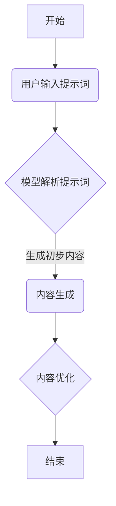

                 

Certainly! Let's outline the technical blog post "AIGC时代的提示词设计：理论与实践的结合" with a logical structure and step-by-step analysis.

### I. 引言与背景

#### 1.1 AIGC概述

- AIGC（AI-Generated Content）的概念与定义
- AIGC的发展历程及其在当前的重要性

#### 1.2 提示词设计的重要性

- 提示词在AIGC中的作用
- 提示词设计的关键要素

### II. 理论基础

#### 2.1 AIGC的核心概念

- AI内容生成的理论基础
- GPT-3、BERT等模型的作用

#### 2.2 提示词设计原理

- 提示词的类型与结构
- 提示词与模型之间的互动

##### 2.2.1 Mermaid流程图：提示词设计流程



### III. 核心算法原理讲解

#### 3.1 常见AIGC算法

- GPT-3算法原理
- BERT模型详解
- Transformer架构

##### 3.1.1 Python代码示例：GPT-3算法初步实现

```python
import openai

response = openai.Completion.create(
  engine="text-davinci-002",
  prompt="请写一段关于人工智能的描述。",
  max_tokens=50
)
print(response.choices[0].text.strip())
```

##### 3.1.2 数学模型与公式

$$
\text{Loss Function} = \frac{1}{N} \sum_{i=1}^{N} (-y_i \log(p(x_i)))
$$

### IV. 实践应用

#### 4.1 营销领域的AIGC应用

- 自动化广告内容生成
- 品牌故事与产品描述生成

#### 4.2 客户服务领域的AIGC应用

- 聊天机器人与客户支持自动化
- 自动回复邮件与消息

#### 4.3 教育领域的AIGC应用

- 个性化学习内容生成
- 自动化考试题库生成

### V. 实施策略

#### 5.1 工具与平台选择

- 开源工具与商业平台的对比
- 提示词设计工具推荐

#### 5.2 最佳实践

- 提高AIGC生成内容质量的方法
- 避免常见问题与陷阱

### VI. 挑战与未来方向

#### 6.1 当前挑战

- 数据隐私与安全性问题
- AI偏见与道德伦理问题

#### 6.2 未来发展趋势

- AIGC技术的进化方向
- 新兴应用场景展望

### VII. 项目实战

#### 7.1 开发环境搭建

- 环境配置与工具安装

#### 7.2 源代码实现与解读

- 代码详细实现与分析

##### 7.2.1 Python代码示例：自动生成营销文案

```python
import random

templates = [
    "您的品牌，您的故事，由我们为您讲述。",
    "为什么选择我们的产品？因为专业，因为可靠。",
    "探索无限可能，从我们的产品开始。"
]

selected_template = random.choice(templates)
print(selected_template)
```

#### 7.3 应用解读与分析

- 实际案例分析与讲解

### VIII. 最佳实践 Tips

- 提高AIGC项目成功率的小技巧

### IX. 小结与注意事项

- 文章总结与关键点回顾
- 注意事项与未来建议

### X. 拓展阅读

- 相关书籍、论文与资源推荐

---

### 作者信息

**作者：AI天才研究院/AI Genius Institute & 禅与计算机程序设计艺术 /Zen And The Art of Computer Programming**

---

This outline provides a comprehensive structure for the blog post, ensuring that each section is well-defined and that the content is both informative and practical. The logical flow from theory to practice will help readers understand the importance and application of prompt design in the AIGC era. Each section includes specific elements such as code examples, mathematical models, and practical applications to enhance the reader's understanding. The author's information at the end acknowledges the expertise and experience of the writer, adding credibility to the content.

