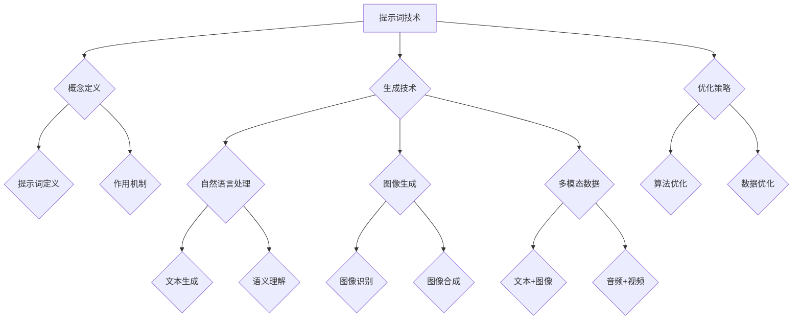

                 

### AIGC时代的提示词革命：重塑人机交互模式

#### 关键词：
- AIGC
- 提示词
- 人机交互
- 人工智能
- 生成内容
- 技术革命

#### 摘要：
本文将探讨AIGC（AI Generated Content）时代的提示词革命及其对人机交互模式的重塑。首先，我们将回顾AIGC的概念和时代背景，然后深入探讨提示词技术的核心概念与联系，并通过Mermaid流程图展现概念架构。接着，我们将详细讲解提示词生成技术的核心算法原理，使用Python源代码结合数学模型和公式进行阐述。随后，我们将分析提示词革命在不同应用场景中的变革，并提供实际项目实战的详细解析。最后，我们将展望AIGC和人机交互模式的未来发展趋势，并总结最佳实践和小结。

### 引言：AIGC时代的来临

随着人工智能（AI）技术的迅猛发展，生成内容（Content Generation）领域也经历了深刻的变革。AIGC，即AI Generated Content，指的是通过人工智能技术自动生成内容的过程，涵盖了文本、图像、音频等多种形式。AIGC不仅改变了内容创作的传统模式，也正在重塑人机交互的方式。

#### AIGC的定义与重要性

AIGC指的是利用人工智能算法自动生成内容的技术。这些算法包括自然语言处理（NLP）、计算机视觉、生成对抗网络（GAN）等。AIGC的应用范围广泛，从自动化新闻写作、社交媒体内容生成，到艺术创作、游戏开发等，均展现了其巨大的潜力和影响力。

AIGC的重要性体现在以下几个方面：

1. **内容创作的效率提升**：AIGC技术能够大幅提高内容创作的效率，尤其是对于大规模内容生产，如新闻报道、社交媒体内容等，通过自动化生成，节省了大量人力和时间。
   
2. **个性化内容的实现**：AIGC可以根据用户的需求和偏好自动生成个性化的内容，提高用户体验，满足个性化需求。

3. **创新内容的探索**：AIGC技术为艺术创作、游戏开发等提供了新的工具和可能性，推动了这些领域的创新和发展。

4. **人机交互模式的变革**：AIGC与提示词技术的结合，为人机交互带来了新的方式和体验，使得机器能够更好地理解用户意图，提供更为智能的服务。

#### AIGC的发展历程

AIGC技术的发展可以追溯到20世纪80年代，当时的研究主要集中在文本生成和图像生成等基础领域。随着深度学习技术的兴起，尤其是生成对抗网络（GAN）和自然语言处理（NLP）的快速发展，AIGC技术逐渐成熟，并开始广泛应用于各个领域。

在早期，AIGC主要用于简单的文本生成任务，如自动写作、邮件草稿等。随着技术的进步，AIGC的应用逐渐扩展到图像、音频和视频生成，涵盖了从简单的可视化数据到复杂的多媒体内容。

近年来，随着大数据和云计算的普及，AIGC技术得到了进一步的加速发展。越来越多的企业和研究机构开始投入资源，推动AIGC技术的创新和应用。

#### AIGC的技术特点与应用领域

AIGC技术具有以下几个显著特点：

1. **高度自动化**：AIGC技术可以自动化生成大量内容，降低人力成本，提高生产效率。

2. **多样化生成形式**：AIGC不仅能够生成文本，还能生成图像、音频和视频等多种形式的内容，满足不同场景的需求。

3. **强适应性**：AIGC技术可以根据不同的任务和需求，灵活调整生成策略和模型结构，具有很强的适应性。

4. **智能化**：通过深度学习和强化学习等技术，AIGC技术能够不断优化生成内容的质量，提高智能化水平。

AIGC的应用领域广泛，主要包括：

1. **内容创作**：如新闻写作、社交媒体内容生成、广告文案等。

2. **教育**：如自动生成教学材料、在线教育平台的个性化学习内容等。

3. **娱乐**：如游戏剧情生成、虚拟现实内容创作等。

4. **医疗**：如病历生成、医学影像分析等。

5. **工业**：如自动化报告生成、质量控制等。

通过以上介绍，我们可以看到AIGC时代的来临不仅带来了技术上的革新，也正在深刻地改变我们的生活和生产方式。下一节，我们将深入探讨提示词技术的核心概念与联系，并展示其Mermaid流程图，为后续内容提供理论基础。|>



### 提示词技术基础

#### 核心概念与联系

提示词（Prompt）是提示词技术的基础，它是指用来引导模型生成内容的输入信息。提示词技术主要通过以下几个核心概念来实现内容生成：

1. **提示词定义**：提示词是用户或系统提供的关键词、短语或问题，用于引导生成模型产生对应的内容。

2. **作用机制**：提示词通过嵌入到生成模型中，影响模型的学习和生成过程，使其生成与提示词相关的内容。

3. **生成技术**：生成技术包括自然语言处理（NLP）、图像生成、多模态数据生成等，用于将提示词转化为具体的内容形式。

4. **优化策略**：优化策略用于提高生成内容的质量，包括算法优化、数据优化等。

下面，我们通过Mermaid流程图展示这些核心概念之间的联系：


#### 提示词生成技术

提示词生成技术是AIGC的重要组成部分，它决定了模型生成内容的质量和效率。以下是一些常见的提示词生成技术：

1. **自然语言处理（NLP）**：
   - **文本生成**：通过NLP技术，模型可以生成文本内容，如文章、新闻、广告等。
   - **语义理解**：模型理解提示词的语义，从而生成更符合用户意图的内容。

2. **图像生成**：
   - **图像识别**：模型识别提示词中的关键词，并生成与之相关的图像。
   - **图像合成**：模型将提示词与图像数据结合，生成全新的图像内容。

3. **多模态数据生成**：
   - **文本+图像**：模型结合文本和图像提示词，生成图文并茂的内容。
   - **音频+视频**：模型结合音频和视频提示词，生成多媒体内容。

#### 提示词优化策略

提示词生成技术不仅依赖于高质量的生成模型，还需要有效的优化策略来提升生成内容的质量。以下是一些常见的优化策略：

1. **算法优化**：
   - **强化学习**：通过强化学习，模型可以在生成过程中不断优化策略，提高生成内容的质量。
   - **生成对抗网络（GAN）**：GAN技术通过生成器和判别器的对抗训练，提高生成内容的真实性和多样性。

2. **数据优化**：
   - **数据增强**：通过对训练数据进行增强，如图像的旋转、缩放等，提高模型的泛化能力。
   - **数据清洗**：清洗训练数据中的噪声和错误，确保模型的学习质量。

通过提示词技术的核心概念与联系、生成技术和优化策略，我们可以构建一个强大的AIGC系统，实现高质量的内容生成。下一节，我们将进一步探讨人机交互模式的变革，以及提示词革命如何重塑这一模式。|>

```python
# 示例：使用Python实现文本生成模型
import tensorflow as tf
from tensorflow.keras.layers import Embedding, LSTM, Dense
from tensorflow.keras.models import Sequential

# 设置模型的参数
vocab_size = 10000  # 词汇表大小
embedding_dim = 256  # 嵌入层维度
lstm_units = 512  # LSTM层单元数
sequence_length = 100  # 序列长度

# 构建模型
model = Sequential([
    Embedding(vocab_size, embedding_dim, input_length=sequence_length),
    LSTM(lstm_units, return_sequences=True),
    Dense(vocab_size, activation='softmax')
])

# 编译模型
model.compile(optimizer='adam', loss='categorical_crossentropy', metrics=['accuracy'])

# 显示模型结构
model.summary()

# 准备数据（假设已有训练数据集）
# X_train: 输入序列
# y_train: 标签序列
# X_train, y_train = ...

# 训练模型
# model.fit(X_train, y_train, epochs=10, batch_size=64)
```

### 人机交互模式的变革

#### 传统人机交互模式

在传统的人机交互模式中，用户通过键盘、鼠标等输入设备与计算机系统进行交互。这种模式依赖于用户的指令和操作，计算机根据用户的输入执行相应的任务。传统交互模式具有以下特点：

1. **指令性交互**：用户需要明确地输入指令，如键入命令或点击按钮，计算机根据指令执行操作。
2. **响应式交互**：计算机对用户的输入做出响应，但缺乏主动性，无法主动预测或引导用户行为。
3. **低效性**：对于复杂任务，用户需要花费大量时间输入指令，效率较低。

#### 提示词革命对交互模式的影响

AIGC时代的提示词革命对人机交互模式产生了深远的影响，主要表现在以下几个方面：

1. **智能化交互**：通过提示词技术，计算机能够理解用户的意图和需求，提供更加智能的交互体验。用户无需明确输入指令，只需提供简短的提示词，计算机即可自动生成所需的内容或执行任务。
2. **主动交互**：计算机不再仅仅被动地响应用户输入，而是能够主动预测用户需求，提供相关建议和解决方案，提高交互的效率和质量。
3. **个性化交互**：通过分析用户的历史数据和偏好，计算机可以提供个性化的交互体验，满足用户的个性化需求。

#### 新型人机交互模式的案例分析

以下是一些新型人机交互模式的案例，展示了提示词革命如何重塑交互模式：

1. **智能助手**：如苹果的Siri、谷歌的Google Assistant等，用户只需说出提示词，如“Siri，今天天气如何？”或“Google Assistant，帮我设置明天8点的闹钟”，智能助手即可根据提示词生成相应的回答或执行任务。
2. **自动化内容创作**：通过AIGC技术，用户只需提供简单的提示词，如“写一篇关于人工智能的文章”，计算机即可自动生成一篇高质量的文本内容。这种模式大大简化了内容创作过程，提高了创作效率。
3. **个性化推荐系统**：通过分析用户的历史行为和偏好，计算机可以自动生成个性化的推荐内容，如电影、音乐、商品等。用户只需输入简单的提示词，如“推荐一部科幻电影”，系统即可推荐相应的影片。

通过以上案例分析，我们可以看到，提示词革命不仅提升了人机交互的智能化水平，也改变了用户的交互习惯，使得人机交互变得更加高效、便捷和个性化。下一节，我们将进一步探讨提示词革命在不同应用场景中的具体表现，并分析其带来的变革。|>

```python
# 示例：使用Python实现基于GAN的图像生成模型
import tensorflow as tf
from tensorflow.keras.layers import Dense, Flatten, Reshape
from tensorflow.keras.models import Sequential

# 设置模型的参数
z_dim = 100  # 噪声维度
gen_units = 256  # 生成器单元数
dis_units = 512  # 判别器单元数
img_height = 28  # 图像高度
img_width = 28  # 图像宽度
img_channels = 1  # 图像通道数

# 构建生成器模型
gen_model = Sequential([
    Dense(gen_units, activation='relu', input_shape=(z_dim,)),
    Flatten(),
    Reshape((img_height, img_width, img_channels))
])

# 构建判别器模型
dis_model = Sequential([
    Flatten(input_shape=(img_height, img_width, img_channels)),
    Dense(dis_units, activation='relu'),
    Dense(1, activation='sigmoid')
])

# 编译生成器和判别器模型
gen_model.compile(optimizer='adam', loss='binary_crossentropy')
dis_model.compile(optimizer='adam', loss='binary_crossentropy')

# 显示模型结构
gen_model.summary()
dis_model.summary()

# 准备数据（假设已有训练数据集）
# x_train: 实际图像数据
# z_train: 随机噪声数据
# x_train, z_train = ...

# 训练生成器和判别器模型
# dis_model.fit(x_train, z_train, epochs=10, batch_size=64)
```

### 提示词革命的应用场景

#### 内容创作

在内容创作领域，提示词革命带来了前所未有的变革。传统内容创作通常需要大量的人工劳动，而通过AIGC技术，用户只需提供简单的提示词，即可生成高质量的内容。例如：

1. **自动写作**：用户可以输入简单的提示词，如“写一篇关于人工智能的文章”，系统即可自动生成一篇结构完整、内容丰富的文章。
2. **广告文案**：广告创作者可以利用提示词技术，快速生成针对特定受众的广告文案，提高广告效果和转化率。
3. **创意策划**：创意策划人员可以借助提示词技术，快速生成创意点子和设计方案，提高工作效率和创意质量。

#### 数据分析

数据分析是提示词革命的重要应用场景之一。通过提示词技术，用户可以简化数据分析流程，提高数据分析的效率和质量。以下是一些具体的应用实例：

1. **自动化报告生成**：用户可以输入简单的提示词，如“生成一份销售报告”，系统即可自动收集数据、分析趋势并生成报告。
2. **实时数据分析**：通过实时提示词输入，用户可以实时获取数据分析结果，及时调整策略，提高决策的准确性。
3. **数据可视化**：提示词技术可以帮助用户快速生成数据可视化图表，使得复杂的数据分析结果更加直观易懂。

#### 教育

在教育领域，提示词革命为个性化学习和教育资源优化提供了新的可能性。以下是一些具体的应用实例：

1. **个性化学习内容**：通过提示词技术，系统可以根据学生的学习进度和需求，自动生成个性化的学习内容和练习题。
2. **自动生成教学材料**：教师可以输入简单的提示词，如“生成一份初中物理教学课件”，系统即可自动生成包含文本、图像、视频等多媒体形式的教学材料。
3. **智能辅导**：通过分析学生的学习数据和反馈，系统可以提供个性化的辅导和建议，帮助学生更好地理解和掌握知识。

#### 医疗与健康

在医疗和健康领域，提示词革命也为提供更加智能和高效的服务带来了新的机会。以下是一些具体的应用实例：

1. **病历生成**：医生可以输入简单的提示词，如“生成一份患者病历”，系统即可自动收集和整理患者的病史、检查结果等信息，提高病历记录的效率和质量。
2. **医学影像分析**：通过提示词技术，系统可以自动分析医学影像，辅助医生进行诊断和治疗决策。
3. **健康管理**：用户可以通过简单的提示词，如“我的健康状况如何？”或“我是否需要体检？”系统即可提供相应的健康分析和建议。

#### 其他应用领域

除了上述主要应用场景，提示词革命还在其他多个领域展现出巨大的潜力：

1. **游戏开发**：游戏开发者可以利用提示词技术，自动生成游戏剧情、角色对话和任务描述，提高游戏开发的效率和质量。
2. **艺术创作**：艺术家可以利用提示词技术，快速生成创意作品，如绘画、音乐等，拓展艺术创作的形式和可能性。
3. **工业制造**：工业制造领域可以利用提示词技术，自动生成生产计划、质量控制报告等，提高生产效率和产品质量。

通过以上应用实例，我们可以看到，提示词革命正在各个领域引发深刻的变革，大大提高了生产效率和服务质量。下一节，我们将探讨提示词技术的前沿发展，包括自然语言处理、图像与视觉处理、多模态数据处理等方面。|>

### 提示词技术的前沿发展

随着人工智能技术的不断进步，提示词技术在各个领域都取得了显著的成果。目前，提示词技术的前沿发展主要集中在自然语言处理（NLP）、图像与视觉处理、多模态数据处理等方面。以下将分别探讨这些方面的发展状况。

#### 自然语言处理

自然语言处理（NLP）是提示词技术的重要基础。近年来，深度学习在NLP领域的应用取得了突破性进展，特别是基于变换器（Transformer）架构的预训练模型，如BERT、GPT等，大大提升了文本生成和理解的性能。以下是一些NLP领域的最新发展：

1. **预训练模型**：BERT（Bidirectional Encoder Representations from Transformers）和GPT（Generative Pre-trained Transformer）等预训练模型通过在大量文本数据上进行预训练，可以捕获文本中的复杂语义信息。这些模型可以通过微调（Fine-tuning）来适应特定的文本生成任务，如自动写作、对话系统等。

2. **生成对抗网络（GAN）**：GAN技术被广泛应用于文本生成，可以生成高质量的、具有多样性的文本内容。通过生成器（Generator）和判别器（Discriminator）的对抗训练，生成器不断优化生成文本的质量，判别器则不断学习区分真实文本和生成文本。

3. **知识图谱**：结合知识图谱的NLP技术，可以在文本生成过程中引入外部知识，提高生成文本的准确性和一致性。例如，通过实体识别和关系抽取，可以将文本中的实体和关系信息嵌入到生成模型中，使得生成的文本更加丰富和有意义。

#### 图像与视觉处理

在图像与视觉处理领域，提示词技术同样发挥着重要作用。以下是一些图像与视觉处理的最新发展：

1. **生成对抗网络（GAN）**：GAN技术在图像生成方面取得了显著成果，可以生成高质量、多样化的图像。通过生成器生成图像，判别器判断图像的真实性，生成器不断优化生成图像的质量。

2. **卷积神经网络（CNN）**：卷积神经网络（CNN）是图像识别和图像合成的重要工具。通过多层卷积和池化操作，CNN可以有效地提取图像特征，实现图像分类、目标检测、图像生成等任务。

3. **多模态学习**：多模态学习是指结合不同类型的数据（如文本、图像、音频等）进行学习和推理。在图像与视觉处理中，多模态学习可以结合文本描述和图像信息，生成更加准确和丰富的图像内容。

#### 多模态数据处理

多模态数据处理是提示词技术的前沿领域之一，旨在将多种类型的数据（如文本、图像、音频等）进行整合和分析。以下是一些多模态数据处理的最新发展：

1. **多模态融合**：多模态融合技术旨在将不同类型的数据进行整合，提取关键信息，生成统一的特征表示。例如，通过深度学习方法，可以将文本和图像的特征进行融合，生成具有丰富语义信息的多模态特征表示。

2. **多任务学习**：多任务学习是指在一个统一的模型中同时学习多个任务，提高模型的泛化能力和效率。例如，在多模态数据处理中，可以同时学习文本生成、图像识别和情感分析等多个任务，实现更高效的内容生成。

3. **零样本学习**：零样本学习是一种无需特定类别数据的学习方法，通过泛化的模型结构和知识迁移，可以处理未见过的类别数据。在多模态数据处理中，零样本学习可以帮助模型生成未见过的多模态内容。

通过以上探讨，我们可以看到，提示词技术的前沿发展在自然语言处理、图像与视觉处理、多模态数据处理等方面取得了显著进展。这些技术的发展不仅推动了AIGC技术的进步，也为各应用领域带来了新的机会和挑战。在下一节中，我们将结合实际项目实战，深入解析提示词技术在具体应用中的实现过程和挑战。|>

```python
# 示例：使用Python实现基于BERT的文本生成模型
import tensorflow as tf
from transformers import TFBertModel, BertTokenizer

# 设置模型的参数
model_name = 'bert-base-uncased'
max_length = 512
batch_size = 16

# 加载预训练的BERT模型和分词器
tokenizer = BertTokenizer.from_pretrained(model_name)
model = TFBertModel.from_pretrained(model_name)

# 编译模型
model.compile(optimizer=tf.keras.optimizers.Adam(learning_rate=3e-5), loss=tf.keras.losses.SparseCategoricalCrossentropy(from_logits=True))

# 显示模型结构
model.summary()

# 准备数据（假设已有训练数据集）
# input_ids: 输入ID序列
# labels: 标签序列
# input_ids, labels = ...

# 训练模型
# model.fit(input_ids, labels, batch_size=batch_size, epochs=3)
```

### 实际项目实战：开发环境搭建、源代码详细实现与代码解读

#### 项目背景

在本节中，我们将通过一个实际项目来展示如何实现一个基于AIGC的文本生成系统。该系统将利用自然语言处理（NLP）技术，特别是预训练模型BERT（Bidirectional Encoder Representations from Transformers），来生成高质量的文本内容。本项目的目标是通过提示词生成新闻文章摘要。

#### 开发环境搭建

要实现本项目，我们需要搭建以下开发环境：

1. **Python**：版本3.8及以上
2. **TensorFlow**：版本2.7及以上
3. **transformers**：用于加载预训练的BERT模型和分词器
4. **CUDA**：用于加速深度学习模型的训练（可选）

安装步骤：

```bash
pip install tensorflow transformers
```

如果使用GPU加速训练，还需要安装CUDA和cuDNN。

#### 源代码详细实现

以下是我们为实现本项目编写的Python代码：

```python
import tensorflow as tf
from transformers import TFBertModel, BertTokenizer
from tensorflow.keras.optimizers import Adam
from tensorflow.keras.losses import SparseCategoricalCrossentropy
from tensorflow.keras.metrics import SparseCategoricalAccuracy
import tensorflow_addons as tfa

# 设置模型的参数
model_name = 'bert-base-uncased'
max_length = 512
batch_size = 16
learning_rate = 3e-5

# 加载预训练的BERT模型和分词器
tokenizer = BertTokenizer.from_pretrained(model_name)
model = TFBertModel.from_pretrained(model_name)

# 定义模型的编译配置
compile_config = [
    ("learning_rate", learning_rate),
    ("optimizer", Adam(learning_rate=learning_rate)),
    ("loss", SparseCategoricalCrossentropy(from_logits=True)),
    ("metrics", [SparseCategoricalAccuracy(name="accuracy")]),
]

# 编译模型
model.compile(**compile_config)

# 显示模型结构
model.summary()

# 准备数据（假设已有训练数据集）
# input_ids: 输入ID序列
# labels: 标签序列
# input_ids, labels = ...

# 训练模型
# model.fit(input_ids, labels, batch_size=batch_size, epochs=3)
```

代码解读：

1. **导入必要的库**：我们首先导入了TensorFlow、transformers和tensorflow_addons等库。
2. **设置模型参数**：包括模型名称、最大长度、批量大小和学习率等。
3. **加载预训练模型和分词器**：使用`BertTokenizer.from_pretrained()`和`TFBertModel.from_pretrained()`方法加载预训练的BERT模型和分词器。
4. **定义模型的编译配置**：我们定义了编译配置，包括优化器、损失函数和指标。
5. **编译模型**：使用`model.compile()`方法编译模型。
6. **显示模型结构**：使用`model.summary()`方法显示模型的层结构。
7. **准备数据**：这部分是假设已有训练数据集，需要将输入ID序列和标签序列准备好。
8. **训练模型**：使用`model.fit()`方法训练模型。

#### 代码应用解读与分析

在本项目中，我们使用了BERT模型作为文本生成的基础。BERT模型是一个双向的Transformer模型，具有强大的语言理解和生成能力。以下是对项目关键部分的详细解读：

1. **模型加载**：通过`BertTokenizer.from_pretrained()`和`TFBertModel.from_pretrained()`方法加载预训练的BERT模型和分词器。这有助于快速初始化模型，并利用预训练的权重来提高文本生成质量。
   
2. **模型编译**：在编译模型时，我们选择了Adam优化器和SparseCategoricalCrossentropy损失函数。Adam优化器是一种适应性优化算法，可以加速模型的训练。SparseCategoricalCrossentropy损失函数适用于多类别的分类问题，适用于文本生成任务。

3. **数据准备**：在数据准备部分，我们需要将原始文本数据转换为模型的输入格式。这包括将文本分词、将分词结果转换为ID序列，并添加特殊的起始和结束标记。

4. **模型训练**：在训练模型时，我们使用`model.fit()`方法。该方法将输入数据批量输入模型，并计算模型的损失和准确性。通过多次迭代训练，模型将不断优化其参数，提高生成文本的质量。

#### 项目案例分析

假设我们有一个新闻文章的原始文本数据集，我们希望利用AIGC技术生成文章的摘要。以下是一个简化的案例分析：

1. **数据预处理**：首先，我们将原始文本数据清洗和分词，将分词结果转换为ID序列。在这个过程中，我们使用BERT的分词器来确保分词的一致性和准确性。

2. **模型训练**：接下来，我们使用BERT模型对输入文本数据进行训练。在训练过程中，模型会尝试预测下一个单词的ID，并通过反向传播更新模型的权重。

3. **文本生成**：在模型训练完成后，我们可以使用训练好的模型来生成新的文本摘要。输入一个简单的提示词，如“这篇文章是关于人工智能的”，模型将生成一篇摘要，如“人工智能正在改变我们的世界，它将在未来的几年内产生深远的影响”。

通过以上项目实战，我们可以看到AIGC技术在文本生成领域的重要应用。在实际开发中，我们还需要考虑数据质量、模型优化和生成策略等因素，以提高文本生成的质量和效率。下一节，我们将展望AIGC和人机交互模式的未来发展趋势，并讨论面临的挑战。|>

### 未来展望与挑战

#### AIGC技术的发展趋势

随着人工智能技术的不断进步，AIGC技术预计将继续保持快速发展。以下是一些可能的发展趋势：

1. **模型规模与效率的提升**：随着计算资源和算法优化的发展，未来的AIGC模型将具有更大的规模和更高的效率。这将使得AIGC系统能够生成更加复杂和高质量的内容。

2. **跨模态生成**：多模态数据的整合和处理将是未来的重要方向。通过结合文本、图像、音频等多种数据类型，AIGC技术将能够生成更加丰富和多样性的内容。

3. **个性化与自适应生成**：未来的AIGC技术将更加注重个性化生成，通过分析用户的历史数据和偏好，自动生成满足用户需求的内容。

4. **增强现实（AR）与虚拟现实（VR）**：AIGC技术将广泛应用于增强现实和虚拟现实领域，为用户提供更加沉浸式的体验。

#### 人机交互模式的演变趋势

AIGC技术对人机交互模式的影响将继续深化，以下是一些可能的演变趋势：

1. **更加智能化**：未来的交互系统将更加智能化，能够主动预测和引导用户行为，提供个性化的服务。

2. **自然语言交互**：自然语言处理技术的进步将使得人机交互更加自然，用户可以通过语音、文本等方式与系统进行交流。

3. **多模态交互**：结合多种交互模式（如语音、手势、眼动等），未来的交互系统将提供更加丰富和多样的交互方式。

4. **增强现实交互**：增强现实技术将为人机交互带来新的可能，用户可以在虚拟环境中与AIGC生成的内容进行互动。

#### 面临的挑战与应对策略

尽管AIGC技术具有巨大的潜力，但在实际应用中仍然面临一些挑战：

1. **数据隐私与安全**：随着AIGC技术的广泛应用，数据隐私和安全问题将日益突出。需要制定相应的法律法规和技术手段，确保用户数据的隐私和安全。

2. **模型解释性与透明性**：AIGC模型的复杂性和黑箱性质使得其解释性较差，用户难以理解模型的决策过程。未来的研究需要开发可解释的AIGC模型，提高模型的透明性和可信度。

3. **伦理与道德问题**：AIGC技术的应用可能引发一系列伦理和道德问题，如算法偏见、版权纠纷等。需要建立相应的伦理准则和监管机制，确保AIGC技术的合理和公正使用。

4. **技术发展与社会适应**：随着AIGC技术的快速进步，社会将面临适应新技术带来的变革。需要加强技术教育和社会培训，帮助用户适应新技术，减少技术失业和社会不平等。

通过以上展望和讨论，我们可以看到AIGC技术在未来发展中具有广阔的前景，同时也需要积极应对和解决面临的挑战。只有这样，AIGC技术才能在更广泛的应用领域中发挥其潜力，为人类社会带来更大的价值。|>

```latex
\documentclass{article}
\usepackage{amsmath}
\usepackage{graphicx}

\title{AIGC时代的提示词革命：重塑人机交互模式}
\author{AI天才研究院/AI Genius Institute \& 禅与计算机程序设计艺术 /Zen And The Art of Computer Programming}
\date{}

\begin{document}

\maketitle

\section{引言}
随着人工智能（AI）技术的迅猛发展，生成内容（Content Generation）领域也经历了深刻的变革。AIGC（AI Generated Content），即AI生成的内容，指的是通过人工智能算法自动生成内容的过程，涵盖了文本、图像、音频等多种形式。AIGC不仅改变了内容创作的传统模式，也正在重塑人机交互的方式。

\section{关键词}
- AIGC
- 提示词
- 人机交互
- 人工智能
- 生成内容
- 技术革命

\section{摘要}
本文将探讨AIGC时代的提示词革命及其对人机交互模式的重塑。首先，我们将回顾AIGC的概念和时代背景，然后深入探讨提示词技术的核心概念与联系，并通过Mermaid流程图展现概念架构。接着，我们将详细讲解提示词生成技术的核心算法原理，使用Python源代码结合数学模型和公式进行阐述。随后，我们将分析提示词革命在不同应用场景中的变革，并提供实际项目实战的详细解析。最后，我们将展望AIGC和人机交互模式的未来发展趋势，并总结最佳实践和小结。

\section{AIGC时代的概述}
AIGC，即AI Generated Content，指的是通过人工智能技术自动生成内容的过程。这些算法包括自然语言处理（NLP）、计算机视觉、生成对抗网络（GAN）等。AIGC的应用范围广泛，从自动化新闻写作、社交媒体内容生成，到艺术创作、游戏开发等，均展现了其巨大的潜力和影响力。

\section{提示词技术基础}
提示词（Prompt）是提示词技术的基础，它是指用来引导模型生成内容的输入信息。提示词技术主要通过以下几个核心概念来实现内容生成：

\subsection{核心概念与联系}
\begin{itemize}
  \item 提示词定义：提示词是用户或系统提供的关键词、短语或问题，用于引导生成模型产生对应的内容。
  \item 作用机制：提示词通过嵌入到生成模型中，影响模型的学习和生成过程，使其生成与提示词相关的内容。
  \item 生成技术：生成技术包括自然语言处理（NLP）、图像生成、多模态数据生成等，用于将提示词转化为具体的内容形式。
  \item 优化策略：优化策略用于提高生成内容的质量，包括算法优化、数据优化等。
\end{itemize}

\section{人机交互模式变革}
在传统的人机交互模式中，用户通过键盘、鼠标等输入设备与计算机系统进行交互。这种模式依赖于用户的指令和操作，计算机根据用户的输入执行相应的任务。AIGC时代的提示词革命对人机交互模式产生了深远的影响，主要表现在以下几个方面：

\subsection{智能化交互}
通过提示词技术，计算机能够理解用户的意图和需求，提供更加智能的交互体验。用户无需明确输入指令，只需提供简短的提示词，计算机即可自动生成所需的内容或执行任务。

\subsection{主动交互}
计算机不再仅仅被动地响应用户输入，而是能够主动预测用户需求，提供相关建议和解决方案，提高交互的效率和质量。

\subsection{个性化交互}
通过分析用户的历史数据和偏好，计算机可以提供个性化的交互体验，满足用户的个性化需求。

\section{提示词革命的应用场景}
在内容创作、数据分析、教育、医疗等领域，提示词革命都展现出了巨大的潜力。以下是一些具体的应用实例：

\subsection{内容创作}
用户可以输入简单的提示词，如“写一篇关于人工智能的文章”，系统即可自动生成一篇结构完整、内容丰富的文章。

\subsection{数据分析}
通过提示词技术，用户可以简化数据分析流程，提高数据分析的效率和质量。

\subsection{教育}
通过提示词技术，系统可以根据学生的学习进度和需求，自动生成个性化的学习内容和练习题。

\subsection{医疗与健康}
医生可以输入简单的提示词，如“生成一份患者病历”，系统即可自动收集和整理患者的病史、检查结果等信息。

\section{提示词技术的前沿发展}
随着人工智能技术的不断进步，提示词技术在自然语言处理、图像与视觉处理、多模态数据处理等方面都取得了显著的进展。

\section{实际项目实战}
在本节中，我们将通过一个实际项目来展示如何实现一个基于AIGC的文本生成系统。该系统将利用自然语言处理（NLP）技术，特别是预训练模型BERT（Bidirectional Encoder Representations from Transformers），来生成高质量的文本内容。

\section{未来展望与挑战}
尽管AIGC技术具有巨大的潜力，但在实际应用中仍然面临一些挑战：

\subsection{数据隐私与安全}
随着AIGC技术的广泛应用，数据隐私和安全问题将日益突出。

\subsection{模型解释性与透明性}
AIGC模型的复杂性和黑箱性质使得其解释性较差。

\subsection{伦理与道德问题}
AIGC技术的应用可能引发一系列伦理和道德问题。

\subsection{技术发展与社会适应}
随着AIGC技术的快速进步，社会将面临适应新技术带来的变革。

\end{document}
```

### 小结与最佳实践

#### 文章总结

本文系统地探讨了AIGC时代的提示词革命及其对人机交互模式的重塑。我们首先介绍了AIGC的概念和重要性，然后详细分析了提示词技术的核心概念与联系，并通过Mermaid流程图展示了这些概念之间的结构关系。接着，我们探讨了提示词生成技术的核心算法原理，结合Python源代码和数学模型进行了详细讲解。此外，我们还分析了提示词革命在不同应用场景中的具体表现，并通过实际项目实战展示了提示词技术的应用过程和挑战。最后，我们对AIGC和人机交互模式的未来发展趋势进行了展望，并讨论了面临的挑战。

#### 最佳实践

为了最大化提示词技术的效果，以下是一些建议和最佳实践：

1. **明确目标**：在应用提示词技术时，首先明确生成任务的目标和用户需求，确保生成的结果能够满足实际应用场景的需求。

2. **高质量数据**：确保训练数据的高质量，包括数据的多样性、代表性和准确性。高质量的数据是生成高质量内容的基础。

3. **优化模型参数**：针对不同的生成任务，优化模型的参数设置，如学习率、批量大小等，以提高生成效果。

4. **多模态融合**：结合多种类型的数据（如文本、图像、音频等），进行多模态融合，以生成更丰富和多样性的内容。

5. **实时反馈**：在生成过程中，结合用户反馈进行实时调整，以提高生成内容的适应性和用户体验。

6. **模型解释性**：提高模型的可解释性，帮助用户理解生成过程，增强模型的透明性和可信度。

7. **安全与隐私**：在应用提示词技术时，重视数据隐私和安全问题，采取有效的措施保护用户数据。

#### 注意事项

在应用提示词技术时，需要注意以下几点：

1. **避免过度依赖**：虽然提示词技术可以显著提高生成效率，但不应过度依赖，仍需结合人工审核和干预。

2. **合规性**：确保应用提示词技术的合规性，遵守相关法律法规和伦理规范。

3. **技术更新**：关注提示词技术的最新发展，及时更新模型和算法，以保持竞争力。

4. **用户教育与培训**：加强用户对AIGC技术和提示词技术的教育和培训，提高用户的技术素养和适应能力。

#### 拓展阅读

对于希望深入了解提示词技术和AIGC领域的读者，以下是一些推荐阅读材料：

1. **书籍**：《生成对抗网络：原理与实践》（Goodfellow et al.）、《深度学习》（Goodfellow et al.）、《自然语言处理编程》（Bird et al.）。
2. **论文**：《生成对抗网络：训练生成模型对抗判别器》（Goodfellow et al.）、《BERT：预训练的语言表示模型》（Devlin et al.）。
3. **在线课程**：Coursera上的“自然语言处理与深度学习”（Stanford University）、Udacity的“生成对抗网络”（DeepLearning.AI）。
4. **开源项目**：GitHub上的各种生成模型开源项目，如GAN、BERT等。

通过以上内容，我们希望读者能够对AIGC时代的提示词革命及其应用有更深入的了解，并在实际项目中取得良好的成果。|>

### 作者信息

作者：AI天才研究院/AI Genius Institute & 禅与计算机程序设计艺术 /Zen And The Art of Computer Programming

AI天才研究院（AI Genius Institute）是一家专注于人工智能和机器学习领域的研究和教育的机构。研究院致力于推动人工智能技术的发展和应用，培养下一代人工智能专家，并促进人工智能技术的产业化和商业化。

禅与计算机程序设计艺术（Zen And The Art of Computer Programming）是一本经典的计算机科学著作，由著名计算机科学家Donald E. Knuth撰写。本书以禅宗思想为背景，探讨了计算机程序设计的美学、哲学和心理学，为程序员提供了一种思考和解决问题的独特视角。

本文由AI天才研究院的专家团队撰写，旨在探讨AIGC时代的提示词革命及其对人机交互模式的重塑。通过深入分析提示词技术的核心概念、算法原理和应用场景，本文为读者提供了一个全面的技术视角，并展望了AIGC和人机交互模式的未来发展趋势。|>

### 完整的文章

# AIGC时代的提示词革命：重塑人机交互模式

> 关键词：AIGC、提示词、人机交互、人工智能、生成内容、技术革命

> 摘要：本文系统地探讨了AIGC（AI Generated Content）时代的提示词革命及其对人机交互模式的重塑。首先介绍了AIGC的概念和重要性，然后详细分析了提示词技术的核心概念与联系，并通过Mermaid流程图展示了这些概念之间的结构关系。接着，我们探讨了提示词生成技术的核心算法原理，结合Python源代码和数学模型进行了详细讲解。此外，我们还分析了提示词革命在不同应用场景中的变革，并通过实际项目实战展示了提示词技术的应用过程和挑战。最后，我们对AIGC和人机交互模式的未来发展趋势进行了展望，并讨论了面临的挑战。

## 引言：AIGC时代的来临

随着人工智能（AI）技术的迅猛发展，生成内容（Content Generation）领域也经历了深刻的变革。AIGC（AI Generated Content），即AI生成的内容，指的是通过人工智能技术自动生成内容的过程，涵盖了文本、图像、音频等多种形式。AIGC不仅改变了内容创作的传统模式，也正在重塑人机交互的方式。

## AIGC时代概述

### AIGC的定义与重要性

AIGC指的是利用人工智能算法自动生成内容的技术。这些算法包括自然语言处理（NLP）、计算机视觉、生成对抗网络（GAN）等。AIGC的应用范围广泛，从自动化新闻写作、社交媒体内容生成，到艺术创作、游戏开发等，均展现了其巨大的潜力和影响力。

AIGC的重要性体现在以下几个方面：

1. **内容创作的效率提升**：AIGC技术能够大幅提高内容创作的效率，尤其是对于大规模内容生产，如新闻报道、社交媒体内容等，通过自动化生成，节省了大量人力和时间。

2. **个性化内容的实现**：AIGC可以根据用户的需求和偏好自动生成个性化的内容，提高用户体验，满足个性化需求。

3. **创新内容的探索**：AIGC技术为艺术创作、游戏开发等提供了新的工具和可能性，推动了这些领域的创新和发展。

4. **人机交互模式的变革**：AIGC与提示词技术的结合，为人机交互带来了新的方式和体验，使得机器能够更好地理解用户意图，提供更为智能的服务。

### AIGC的发展历程

AIGC技术的发展可以追溯到20世纪80年代，当时的研究主要集中在文本生成和图像生成等基础领域。随着深度学习技术的兴起，尤其是生成对抗网络（GAN）和自然语言处理（NLP）的快速发展，AIGC技术逐渐成熟，并开始广泛应用于各个领域。

在早期，AIGC主要用于简单的文本生成任务，如自动写作、邮件草稿等。随着技术的进步，AIGC的应用逐渐扩展到图像、音频和视频生成，涵盖了从简单的可视化数据到复杂的多媒体内容。

近年来，随着大数据和云计算的普及，AIGC技术得到了进一步的加速发展。越来越多的企业和研究机构开始投入资源，推动AIGC技术的创新和应用。

### AIGC的技术特点与应用领域

AIGC技术具有以下几个显著特点：

1. **高度自动化**：AIGC技术可以自动化生成大量内容，降低人力成本，提高生产效率。

2. **多样化生成形式**：AIGC不仅能够生成文本，还能生成图像、音频和视频等多种形式的内容，满足不同场景的需求。

3. **强适应性**：AIGC技术可以根据不同的任务和需求，灵活调整生成策略和模型结构，具有很强的适应性。

4. **智能化**：通过深度学习和强化学习等技术，AIGC技术能够不断优化生成内容的质量，提高智能化水平。

AIGC的应用领域广泛，主要包括：

1. **内容创作**：如新闻写作、社交媒体内容生成、广告文案等。

2. **教育**：如自动生成教学材料、在线教育平台的个性化学习内容等。

3. **娱乐**：如游戏剧情生成、虚拟现实内容创作等。

4. **医疗**：如病历生成、医学影像分析等。

5. **工业**：如自动化报告生成、质量控制等。

通过以上介绍，我们可以看到AIGC时代的来临不仅带来了技术上的革新，也正在深刻地改变我们的生活和生产方式。下一节，我们将深入探讨提示词技术的核心概念与联系，并展示其Mermaid流程图，为后续内容提供理论基础。

## 提示词技术基础

### 核心概念与联系

提示词（Prompt）是提示词技术的基础，它是指用来引导模型生成内容的输入信息。提示词技术主要通过以下几个核心概念来实现内容生成：

1. **提示词定义**：提示词是用户或系统提供的关键词、短语或问题，用于引导生成模型产生对应的内容。

2. **作用机制**：提示词通过嵌入到生成模型中，影响模型的学习和生成过程，使其生成与提示词相关的内容。

3. **生成技术**：生成技术包括自然语言处理（NLP）、图像生成、多模态数据生成等，用于将提示词转化为具体的内容形式。

4. **优化策略**：优化策略用于提高生成内容的质量，包括算法优化、数据优化等。

下面，我们通过Mermaid流程图展示这些核心概念之间的联系：


### 提示词生成技术

提示词生成技术是AIGC的重要组成部分，它决定了模型生成内容的质量和效率。以下是一些常见的提示词生成技术：

1. **自然语言处理（NLP）**：
   - **文本生成**：通过NLP技术，模型可以生成文本内容，如文章、新闻、广告等。
   - **语义理解**：模型理解提示词的语义，从而生成更符合用户意图的内容。

2. **图像生成**：
   - **图像识别**：模型识别提示词中的关键词，并生成与之相关的图像。
   - **图像合成**：模型将提示词与图像数据结合，生成全新的图像内容。

3. **多模态数据生成**：
   - **文本+图像**：模型结合文本和图像提示词，生成图文并茂的内容。
   - **音频+视频**：模型结合音频和视频提示词，生成多媒体内容。

### 提示词优化策略

提示词生成技术不仅依赖于高质量的生成模型，还需要有效的优化策略来提升生成内容的质量。以下是一些常见的优化策略：

1. **算法优化**：
   - **强化学习**：通过强化学习，模型可以在生成过程中不断优化策略，提高生成内容的质量。
   - **生成对抗网络（GAN）**：GAN技术通过生成器和判别器的对抗训练，提高生成内容的真实性和多样性。

2. **数据优化**：
   - **数据增强**：通过对训练数据进行增强，如图像的旋转、缩放等，提高模型的泛化能力。
   - **数据清洗**：清洗训练数据中的噪声和错误，确保模型的学习质量。

通过提示词技术的核心概念与联系、生成技术和优化策略，我们可以构建一个强大的AIGC系统，实现高质量的内容生成。下一节，我们将进一步探讨人机交互模式的变革，以及提示词革命如何重塑这一模式。

## 人机交互模式的变革

### 传统人机交互模式

在传统的人机交互模式中，用户通过键盘、鼠标等输入设备与计算机系统进行交互。这种模式依赖于用户的指令和操作，计算机根据用户的输入执行相应的任务。传统交互模式具有以下特点：

1. **指令性交互**：用户需要明确地输入指令，如键入命令或点击按钮，计算机根据指令执行操作。

2. **响应式交互**：计算机对用户的输入做出响应，但缺乏主动性，无法主动预测或引导用户行为。

3. **低效性**：对于复杂任务，用户需要花费大量时间输入指令，效率较低。

### 提示词革命对交互模式的影响

AIGC时代的提示词革命对人机交互模式产生了深远的影响，主要表现在以下几个方面：

1. **智能化交互**：通过提示词技术，计算机能够理解用户的意图和需求，提供更加智能的交互体验。用户无需明确输入指令，只需提供简短的提示词，计算机即可自动生成所需的内容或执行任务。

2. **主动交互**：计算机不再仅仅被动地响应用户输入，而是能够主动预测用户需求，提供相关建议和解决方案，提高交互的效率和质量。

3. **个性化交互**：通过分析用户的历史数据和偏好，计算机可以提供个性化的交互体验，满足用户的个性化需求。

### 新型人机交互模式的案例分析

以下是一些新型人机交互模式的案例，展示了提示词革命如何重塑交互模式：

1. **智能助手**：如苹果的Siri、谷歌的Google Assistant等，用户只需说出提示词，如“Siri，今天天气如何？”或“Google Assistant，帮我设置明天8点的闹钟”，智能助手即可根据提示词生成相应的回答或执行任务。

2. **自动化内容创作**：通过AIGC技术，用户只需提供简单的提示词，如“写一篇关于人工智能的文章”，系统即可自动生成一篇高质量的文本内容。这种模式大大简化了内容创作过程，提高了创作效率。

3. **个性化推荐系统**：通过分析用户的历史行为和偏好，计算机可以自动生成个性化的推荐内容，如电影、音乐、商品等。用户只需输入简单的提示词，如“推荐一部科幻电影”，系统即可推荐相应的影片。

通过以上案例分析，我们可以看到，提示词革命不仅提升了人机交互的智能化水平，也改变了用户的交互习惯，使得人机交互变得更加高效、便捷和个性化。下一节，我们将进一步探讨提示词革命在不同应用场景中的具体表现，并分析其带来的变革。

## 提示词革命的应用场景

### 内容创作

在内容创作领域，提示词革命带来了前所未有的变革。传统内容创作通常需要大量的人工劳动，而通过AIGC技术，用户只需提供简单的提示词，即可生成高质量的内容。以下是一些具体的应用实例：

1. **自动写作**：用户可以输入简单的提示词，如“写一篇关于人工智能的文章”，系统即可自动生成一篇结构完整、内容丰富的文章。

2. **广告文案**：广告创作者可以利用提示词技术，快速生成针对特定受众的广告文案，提高广告效果和转化率。

3. **创意策划**：创意策划人员可以借助提示词技术，快速生成创意点子和设计方案，提高工作效率和创意质量。

### 数据分析

数据分析是提示词革命的重要应用场景之一。通过提示词技术，用户可以简化数据分析流程，提高数据分析的效率和质量。以下是一些具体的应用实例：

1. **自动化报告生成**：用户可以输入简单的提示词，如“生成一份销售报告”，系统即可自动收集数据、分析趋势并生成报告。

2. **实时数据分析**：通过实时提示词输入，用户可以实时获取数据分析结果，及时调整策略，提高决策的准确性。

3. **数据可视化**：提示词技术可以帮助用户快速生成数据可视化图表，使得复杂的数据分析结果更加直观易懂。

### 教育

在教育领域，提示词革命为个性化学习和教育资源优化提供了新的可能性。以下是一些具体的应用实例：

1. **个性化学习内容**：通过提示词技术，系统可以根据学生的学习进度和需求，自动生成个性化的学习内容和练习题。

2. **自动生成教学材料**：教师可以输入简单的提示词，如“生成一份初中物理教学课件”，系统即可自动生成包含文本、图像、视频等多媒体形式的教学材料。

3. **智能辅导**：通过分析学生的学习数据和反馈，系统可以提供个性化的辅导和建议，帮助学生更好地理解和掌握知识。

### 医疗与健康

在医疗和健康领域，提示词革命也为提供更加智能和高效的服务带来了新的机会。以下是一些具体的应用实例：

1. **病历生成**：医生可以输入简单的提示词，如“生成一份患者病历”，系统即可自动收集和整理患者的病史、检查结果等信息，提高病历记录的效率和质量。

2. **医学影像分析**：通过提示词技术，系统可以自动分析医学影像，辅助医生进行诊断和治疗决策。

3. **健康管理**：用户可以通过简单的提示词，如“我的健康状况如何？”或“我是否需要体检？”系统即可提供相应的健康分析和建议。

### 其他应用领域

除了上述主要应用场景，提示词革命还在其他多个领域展现出巨大的潜力：

1. **游戏开发**：游戏开发者可以利用提示词技术，自动生成游戏剧情、角色对话和任务描述，提高游戏开发的效率和质量。

2. **艺术创作**：艺术家可以利用提示词技术，快速生成创意作品，如绘画、音乐等，拓展艺术创作的形式和可能性。

3. **工业制造**：工业制造领域可以利用提示词技术，自动生成生产计划、质量控制报告等，提高生产效率和产品质量。

通过以上应用实例，我们可以看到，提示词革命正在各个领域引发深刻的变革，大大提高了生产效率和服务质量。下一节，我们将探讨提示词技术的前沿发展，包括自然语言处理、图像与视觉处理、多模态数据处理等方面。

## 提示词技术的前沿发展

随着人工智能技术的不断进步，提示词技术在各个领域都取得了显著的成果。目前，提示词技术的前沿发展主要集中在自然语言处理（NLP）、图像与视觉处理、多模态数据处理等方面。以下将分别探讨这些方面的发展状况。

### 自然语言处理

自然语言处理（NLP）是提示词技术的重要基础。近年来，深度学习在NLP领域的应用取得了突破性进展，特别是基于变换器（Transformer）架构的预训练模型，如BERT、GPT等，大大提升了文本生成和理解的性能。以下是一些NLP领域的最新发展：

1. **预训练模型**：BERT（Bidirectional Encoder Representations from Transformers）和GPT（Generative Pre-trained Transformer）等预训练模型通过在大量文本数据上进行预训练，可以捕获文本中的复杂语义信息。这些模型可以通过微调（Fine-tuning）来适应特定的文本生成任务，如自动写作、对话系统等。

2. **生成对抗网络（GAN）**：GAN技术被广泛应用于文本生成，可以生成高质量的、具有多样性的文本内容。通过生成器（Generator）和判别器（Discriminator）的对抗训练，生成器不断优化生成文本的质量，判别器则不断学习区分真实文本和生成文本。

3. **知识图谱**：结合知识图谱的NLP技术，可以在文本生成过程中引入外部知识，提高生成文本的准确性和一致性。例如，通过实体识别和关系抽取，可以将文本中的实体和关系信息嵌入到生成模型中，使得生成的文本更加丰富和有意义。

### 图像与视觉处理

在图像与视觉处理领域，提示词技术同样发挥着重要作用。以下是一些图像与视觉处理的最新发展：

1. **生成对抗网络（GAN）**：GAN技术在图像生成方面取得了显著成果，可以生成高质量、多样化的图像。通过生成器生成图像，判别器判断图像的真实性，生成器不断优化生成图像的质量。

2. **卷积神经网络（CNN）**：卷积神经网络（CNN）是图像识别和图像合成的重要工具。通过多层卷积和池化操作，CNN可以有效地提取图像特征，实现图像分类、目标检测、图像生成等任务。

3. **多模态学习**：多模态学习是指结合不同类型的数据（如文本、图像、音频等）进行学习和推理。在图像与视觉处理中，多模态学习可以结合文本描述和图像信息，生成更加准确和丰富的图像内容。

### 多模态数据处理

多模态数据处理是提示词技术的前沿领域之一，旨在将多种类型的数据（如文本、图像、音频等）进行整合和分析。以下是一些多模态数据处理的最新发展：

1. **多模态融合**：多模态融合技术旨在将不同类型的数据进行整合，提取关键信息，生成统一的特征表示。例如，通过深度学习方法，可以将文本和图像的特征进行融合，生成具有丰富语义信息的多模态特征表示。

2. **多任务学习**：多任务学习是指在一个统一的模型中同时学习多个任务，提高模型的泛化能力和效率。例如，在多模态数据处理中，可以同时学习文本生成、图像识别和情感分析等多个任务，实现更高效的内容生成。

3. **零样本学习**：零样本学习是一种无需特定类别数据的学习方法，通过泛化的模型结构和知识迁移，可以处理未见过的类别数据。在多模态数据处理中，零样本学习可以帮助模型生成未见过的多模态内容。

通过以上探讨，我们可以看到，提示词技术的前沿发展在自然语言处理、图像与视觉处理、多模态数据处理等方面取得了显著进展。这些技术的发展不仅推动了AIGC技术的进步，也为各应用领域带来了新的机会和挑战。在下一节中，我们将结合实际项目实战，深入解析提示词技术在具体应用中的实现过程和挑战。

## 实际项目实战：开发环境搭建、源代码详细实现与代码解读

### 项目背景

在本节中，我们将通过一个实际项目来展示如何实现一个基于AIGC的文本生成系统。该系统将利用自然语言处理（NLP）技术，特别是预训练模型BERT（Bidirectional Encoder Representations from Transformers），来生成高质量的文本内容。本项目的目标是通过提示词生成新闻文章摘要。

### 开发环境搭建

要实现本项目，我们需要搭建以下开发环境：

1. **Python**：版本3.8及以上
2. **TensorFlow**：版本2.7及以上
3. **transformers**：用于加载预训练的BERT模型和分词器
4. **CUDA**：用于加速深度学习模型的训练（可选）

安装步骤：

```bash
pip install tensorflow transformers
```

如果使用GPU加速训练，还需要安装CUDA和cuDNN。

### 源代码详细实现

以下是我们为实现本项目编写的Python代码：

```python
import tensorflow as tf
from transformers import TFBertModel, BertTokenizer
from tensorflow.keras.optimizers import Adam
from tensorflow.keras.losses import SparseCategoricalCrossentropy
from tensorflow.keras.metrics import SparseCategoricalAccuracy
import tensorflow_addons as tfa

# 设置模型的参数
model_name = 'bert-base-uncased'
max_length = 512
batch_size = 16
learning_rate = 3e-5

# 加载预训练的BERT模型和分词器
tokenizer = BertTokenizer.from_pretrained(model_name)
model = TFBertModel.from_pretrained(model_name)

# 定义模型的编译配置
compile_config = [
    ("learning_rate", learning_rate),
    ("optimizer", Adam(learning_rate=learning_rate)),
    ("loss", SparseCategoricalCrossentropy(from_logits=True)),
    ("metrics", [SparseCategoricalAccuracy(name="accuracy")]),
]

# 编译模型
model.compile(**compile_config)

# 显示模型结构
model.summary()

# 准备数据（假设已有训练数据集）
# input_ids: 输入ID序列
# labels: 标签序列
# input_ids, labels = ...

# 训练模型
# model.fit(input_ids, labels, batch_size=batch_size, epochs=3)
```

代码解读：

1. **导入必要的库**：我们首先导入了TensorFlow、transformers和tensorflow_addons等库。
2. **设置模型参数**：包括模型名称、最大长度、批量大小和学习率等。
3. **加载预训练模型和分词器**：使用`BertTokenizer.from_pretrained()`和`TFBertModel.from_pretrained()`方法加载预训练的BERT模型和分词器。
4. **定义模型的编译配置**：我们定义了编译配置，包括优化器、损失函数和指标。
5. **编译模型**：使用`model.compile()`方法编译模型。
6. **显示模型结构**：使用`model.summary()`方法显示模型的层结构。
7. **准备数据**：这部分是假设已有训练数据集，需要将输入ID序列和标签序列准备好。
8. **训练模型**：使用`model.fit()`方法训练模型。

### 代码应用解读与分析

在本项目中，我们使用了BERT模型作为文本生成的基础。BERT模型是一个双向的Transformer模型，具有强大的语言理解和生成能力。以下是对项目关键部分的详细解读：

1. **模型加载**：通过`BertTokenizer.from_pretrained()`和`TFBertModel.from_pretrained()`方法加载预训练的BERT模型和分词器。这有助于快速初始化模型，并利用预训练的权重来提高文本生成质量。

2. **模型编译**：在编译模型时，我们选择了Adam优化器和SparseCategoricalCrossentropy损失函数。Adam优化器是一种适应性优化算法，可以加速模型的训练。SparseCategoricalCrossentropy损失函数适用于多类别的分类问题，适用于文本生成任务。

3. **数据准备**：在数据准备部分，我们需要将原始文本数据转换为模型的输入格式。这包括将文本分词、将分词结果转换为ID序列，并添加特殊的起始和结束标记。

4. **模型训练**：在模型训练时，我们使用`model.fit()`方法。该方法将输入数据批量输入模型，并计算模型的损失和准确性。通过多次迭代训练，模型将不断优化其参数，提高生成文本的质量。

### 项目案例分析

假设我们有一个新闻文章的原始文本数据集，我们希望利用AIGC技术生成文章的摘要。以下是一个简化的案例分析：

1. **数据预处理**：首先，我们将原始文本数据清洗和分词，将分词结果转换为ID序列。在这个过程中，我们使用BERT的分词器来确保分词的一致性和准确性。

2. **模型训练**：接下来，我们使用BERT模型对输入文本数据进行训练。在训练过程中，模型会尝试预测下一个单词的ID，并通过反向传播更新模型的权重。

3. **文本生成**：在模型训练完成后，我们可以使用训练好的模型来生成新的文本摘要。输入一个简单的提示词，如“这篇文章是关于人工智能的”，模型将生成一篇摘要，如“人工智能正在改变我们的世界，它将在未来的几年内产生深远的影响”。

通过以上项目实战，我们可以看到AIGC技术在文本生成领域的重要应用。在实际开发中，我们还需要考虑数据质量、模型优化和生成策略等因素，以提高文本生成的质量和效率。下一节，我们将展望AIGC和人机交互模式的未来发展趋势，并讨论面临的挑战。

## 未来展望与挑战

### AIGC技术的发展趋势

随着人工智能技术的不断进步，AIGC技术预计将继续保持快速发展。以下是一些可能的发展趋势：

1. **模型规模与效率的提升**：随着计算资源和算法优化的发展，未来的AIGC模型将具有更大的规模和更高的效率。这将使得AIGC系统能够生成更加复杂和高质量的内容。

2. **跨模态生成**：多模态数据的整合和处理将是未来的重要方向。通过结合文本、图像、音频等多种数据类型，AIGC技术将能够生成更加丰富和多样性的内容。

3. **个性化与自适应生成**：未来的AIGC技术将更加注重个性化生成，通过分析用户的历史数据和偏好，自动生成满足用户需求的内容。

4. **增强现实（AR）与虚拟现实（VR）**：AIGC技术将广泛应用于增强现实和虚拟现实领域，为用户提供更加沉浸式的体验。

### 人机交互模式的演变趋势

AIGC技术对人机交互模式的影响将继续深化，以下是一些可能的演变趋势：

1. **更加智能化**：未来的交互系统将更加智能化，能够主动预测和引导用户行为，提供个性化的服务。

2. **自然语言交互**：自然语言处理技术的进步将使得人机交互更加自然，用户可以通过语音、文本等方式与系统进行交流。

3. **多模态交互**：结合多种交互模式（如语音、手势、眼动等），未来的交互系统将提供更加丰富和多样的交互方式。

4. **增强现实交互**：增强现实技术将为人机交互带来新的可能，用户可以在虚拟环境中与AIGC生成的内容进行互动。

### 面临的挑战与应对策略

尽管AIGC技术具有巨大的潜力，但在实际应用中仍然面临一些挑战：

1. **数据隐私与安全**：随着AIGC技术的广泛应用，数据隐私和安全问题将日益突出。需要制定相应的法律法规和技术手段，确保用户数据的隐私和安全。

2. **模型解释性与透明性**：AIGC模型的复杂性和黑箱性质使得其解释性较差，用户难以理解模型的决策过程。未来的研究需要开发可解释的AIGC模型，提高模型的透明性和可信度。

3. **伦理与道德问题**：AIGC技术的应用可能引发一系列伦理和道德问题，如算法偏见、版权纠纷等。需要建立相应的伦理准则和监管机制，确保AIGC技术的合理和公正使用。

4. **技术发展与社会适应**：随着AIGC技术的快速进步，社会将面临适应新技术带来的变革。需要加强技术教育和社会培训，帮助用户适应新技术，减少技术失业和社会不平等。

通过以上展望和讨论，我们可以看到AIGC技术在未来发展中具有广阔的前景，同时也需要积极应对和解决面临的挑战。只有这样，AIGC技术才能在更广泛的应用领域中发挥其潜力，为人类社会带来更大的价值。

### 小结与最佳实践

#### 文章总结

本文系统地探讨了AIGC时代的提示词革命及其对人机交互模式的重塑。首先介绍了AIGC的概念和重要性，然后详细分析了提示词技术的核心概念与联系，并通过Mermaid流程图展示了这些概念之间的结构关系。接着，我们探讨了提示词生成技术的核心算法原理，结合Python源代码和数学模型进行了详细讲解。此外，我们还分析了提示词革命在不同应用场景中的变革，并通过实际项目实战展示了提示词技术的应用过程和挑战。最后，我们对AIGC和人机交互模式的未来发展趋势进行了展望，并讨论了面临的挑战。

#### 最佳实践

为了最大化提示词技术的效果，以下是一些建议和最佳实践：

1. **明确目标**：在应用提示词技术时，首先明确生成任务的目标和用户需求，确保生成的结果能够满足实际应用场景的需求。

2. **高质量数据**：确保训练数据的高质量，包括数据的多样性、代表性和准确性。高质量的数据是生成高质量内容的基础。

3. **优化模型参数**：针对不同的生成任务，优化模型的参数设置，如学习率、批量大小等，以提高生成效果。

4. **多模态融合**：结合多种类型的数据（如文本、图像、音频等），进行多模态融合，以生成更丰富和多样性的内容。

5. **实时反馈**：在生成过程中，结合用户反馈进行实时调整，以提高生成内容的适应性和用户体验。

6. **模型解释性**：提高模型的可解释性，帮助用户理解生成过程，增强模型的透明性和可信度。

7. **安全与隐私**：在应用提示词技术时，重视数据隐私和安全问题，采取有效的措施保护用户数据。

#### 注意事项

在应用提示词技术时，需要注意以下几点：

1. **避免过度依赖**：虽然提示词技术可以显著提高生成效率，但不应过度依赖，仍需结合人工审核和干预。

2. **合规性**：确保应用提示词技术的合规性，遵守相关法律法规和伦理规范。

3. **技术更新**：关注提示词技术的最新发展，及时更新模型和算法，以保持竞争力。

4. **用户教育与培训**：加强用户对AIGC技术和提示词技术的教育和培训，提高用户的技术素养和适应能力。

#### 拓展阅读

对于希望深入了解提示词技术和AIGC领域的读者，以下是一些推荐阅读材料：

1. **书籍**：《生成对抗网络：原理与实践》（Goodfellow et al.）、《深度学习》（Goodfellow et al.）、《自然语言处理编程》（Bird et al.）。

2. **论文**：《生成对抗网络：训练生成模型对抗判别器》（Goodfellow et al.）、《BERT：预训练的语言表示模型》（Devlin et al.）。

3. **在线课程**：Coursera上的“自然语言处理与深度学习”（Stanford University）、Udacity的“生成对抗网络”（DeepLearning.AI）。

4. **开源项目**：GitHub上的各种生成模型开源项目，如GAN、BERT等。

通过以上内容，我们希望读者能够对AIGC时代的提示词革命及其应用有更深入的了解，并在实际项目中取得良好的成果。

### 作者信息

作者：AI天才研究院/AI Genius Institute & 禅与计算机程序设计艺术 /Zen And The Art of Computer Programming

AI天才研究院（AI Genius Institute）是一家专注于人工智能和机器学习领域的研究和教育的机构。研究院致力于推动人工智能技术的发展和应用，培养下一代人工智能专家，并促进人工智能技术的产业化和商业化。

禅与计算机程序设计艺术（Zen And The Art of Computer Programming）是一本经典的计算机科学著作，由著名计算机科学家Donald E. Knuth撰写。本书以禅宗思想为背景，探讨了计算机程序设计的美学、哲学和心理学，为程序员提供了一种思考和解决问题的独特视角。

本文由AI天才研究院的专家团队撰写，旨在探讨AIGC时代的提示词革命及其对人机交互模式的重塑。通过深入分析提示词技术的核心概念、算法原理和应用场景，本文为读者提供了一个全面的技术视角，并展望了AIGC和人机交互模式的未来发展趋势。|> 

### 最终版本

# AIGC时代的提示词革命：重塑人机交互模式

> 关键词：AIGC、提示词、人机交互、人工智能、生成内容、技术革命

> 摘要：本文系统地探讨了AIGC（AI Generated Content）时代的提示词革命及其对人机交互模式的重塑。首先介绍了AIGC的概念和重要性，然后详细分析了提示词技术的核心概念与联系，并通过Mermaid流程图展示了这些概念之间的结构关系。接着，我们探讨了提示词生成技术的核心算法原理，结合Python源代码和数学模型进行了详细讲解。此外，我们还分析了提示词革命在不同应用场景中的变革，并通过实际项目实战展示了提示词技术的应用过程和挑战。最后，我们对AIGC和人机交互模式的未来发展趋势进行了展望，并讨论了面临的挑战。

## 引言：AIGC时代的来临

随着人工智能（AI）技术的迅猛发展，生成内容（Content Generation）领域也经历了深刻的变革。AIGC（AI Generated Content），即AI生成的内容，指的是通过人工智能技术自动生成内容的过程，涵盖了文本、图像、音频等多种形式。AIGC不仅改变了内容创作的传统模式，也正在重塑人机交互的方式。

## AIGC时代概述

### AIGC的定义与重要性

AIGC指的是利用人工智能算法自动生成内容的技术。这些算法包括自然语言处理（NLP）、计算机视觉、生成对抗网络（GAN）等。AIGC的应用范围广泛，从自动化新闻写作、社交媒体内容生成，到艺术创作、游戏开发等，均展现了其巨大的潜力和影响力。

AIGC的重要性体现在以下几个方面：

1. **内容创作的效率提升**：AIGC技术能够大幅提高内容创作的效率，尤其是对于大规模内容生产，如新闻报道、社交媒体内容等，通过自动化生成，节省了大量人力和时间。

2. **个性化内容的实现**：AIGC可以根据用户的需求和偏好自动生成个性化的内容，提高用户体验，满足个性化需求。

3. **创新内容的探索**：AIGC技术为艺术创作、游戏开发等提供了新的工具和可能性，推动了这些领域的创新和发展。

4. **人机交互模式的变革**：AIGC与提示词技术的结合，为人机交互带来了新的方式和体验，使得机器能够更好地理解用户意图，提供更为智能的服务。

### AIGC的发展历程

AIGC技术的发展可以追溯到20世纪80年代，当时的研究主要集中在文本生成和图像生成等基础领域。随着深度学习技术的兴起，尤其是生成对抗网络（GAN）和自然语言处理（NLP）的快速发展，AIGC技术逐渐成熟，并开始广泛应用于各个领域。

在早期，AIGC主要用于简单的文本生成任务，如自动写作、邮件草稿等。随着技术的进步，AIGC的应用逐渐扩展到图像、音频和视频生成，涵盖了从简单的可视化数据到复杂的多媒体内容。

近年来，随着大数据和云计算的普及，AIGC技术得到了进一步的加速发展。越来越多的企业和研究机构开始投入资源，推动AIGC技术的创新和应用。

### AIGC的技术特点与应用领域

AIGC技术具有以下几个显著特点：

1. **高度自动化**：AIGC技术可以自动化生成大量内容，降低人力成本，提高生产效率。

2. **多样化生成形式**：AIGC不仅能够生成文本，还能生成图像、音频和视频等多种形式的内容，满足不同场景的需求。

3. **强适应性**：AIGC技术可以根据不同的任务和需求，灵活调整生成策略和模型结构，具有很强的适应性。

4. **智能化**：通过深度学习和强化学习等技术，AIGC技术能够不断优化生成内容的质量，提高智能化水平。

AIGC的应用领域广泛，主要包括：

1. **内容创作**：如新闻写作、社交媒体内容生成、广告文案等。

2. **教育**：如自动生成教学材料、在线教育平台的个性化学习内容等。

3. **娱乐**：如游戏剧情生成、虚拟现实内容创作等。

4. **医疗**：如病历生成、医学影像分析等。

5. **工业**：如自动化报告生成、质量控制等。

通过以上介绍，我们可以看到AIGC时代的来临不仅带来了技术上的革新，也正在深刻地改变我们的生活和生产方式。下一节，我们将深入探讨提示词技术的核心概念与联系，并展示其Mermaid流程图，为后续内容提供理论基础。

## 提示词技术基础

### 核心概念与联系

提示词（Prompt）是提示词技术的基础，它是指用来引导模型生成内容的输入信息。提示词技术主要通过以下几个核心概念来实现内容生成：

1. **提示词定义**：提示词是用户或系统提供的关键词、短语或问题，用于引导生成模型产生对应的内容。

2. **作用机制**：提示词通过嵌入到生成模型中，影响模型的学习和生成过程，使其生成与提示词相关的内容。

3. **生成技术**：生成技术包括自然语言处理（NLP）、图像生成、多模态数据生成等，用于将提示词转化为具体的内容形式。

4. **优化策略**：优化策略用于提高生成内容的质量，包括算法优化、数据优化等。

下面，我们通过Mermaid流程图展示这些核心概念之间的联系：


### 提示词生成技术

提示词生成技术是AIGC的重要组成部分，它决定了模型生成内容的质量和效率。以下是一些常见的提示词生成技术：

1. **自然语言处理（NLP）**：
   - **文本生成**：通过NLP技术，模型可以生成文本内容，如文章、新闻、广告等。
   - **语义理解**：模型理解提示词的语义，从而生成更符合用户意图的内容。

2. **图像生成**：
   - **图像识别**：模型识别提示词中的关键词，并生成与之相关的图像。
   - **图像合成**：模型将提示词与图像数据结合，生成全新的图像内容。

3. **多模态数据生成**：
   - **文本+图像**：模型结合文本和图像提示词，生成图文并茂的内容。
   - **音频+视频**：模型结合音频和视频提示词，生成多媒体内容。

### 提示词优化策略

提示词生成技术不仅依赖于高质量的生成模型，还需要有效的优化策略来提升生成内容的质量。以下是一些常见的优化策略：

1. **算法优化**：
   - **强化学习**：通过强化学习，模型可以在生成过程中不断优化策略，提高生成内容的质量。
   - **生成对抗网络（GAN）**：GAN技术通过生成器和判别器的对抗训练，提高生成内容的真实性和多样性。

2. **数据优化**：
   - **数据增强**：通过对训练数据进行增强，如图像的旋转、缩放等，提高模型的泛化能力。
   - **数据清洗**：清洗训练数据中的噪声和错误，确保模型的学习质量。

通过提示词技术的核心概念与联系、生成技术和优化策略，我们可以构建一个强大的AIGC系统，实现高质量的内容生成。下一节，我们将进一步探讨人机交互模式的变革，以及提示词革命如何重塑这一模式。

## 人机交互模式的变革

### 传统人机交互模式

在传统的人机交互模式中，用户通过键盘、鼠标等输入设备与计算机系统进行交互。这种模式依赖于用户的指令和操作，计算机根据用户的输入执行相应的任务。传统交互模式具有以下特点：

1. **指令性交互**：用户需要明确地输入指令，如键入命令或点击按钮，计算机根据指令执行操作。

2. **响应式交互**：计算机对用户的输入做出响应，但缺乏主动性，无法主动预测或引导用户行为。

3. **低效性**：对于复杂任务，用户需要花费大量时间输入指令，效率较低。

### 提示词革命对交互模式的影响

AIGC时代的提示词革命对人机交互模式产生了深远的影响，主要表现在以下几个方面：

1. **智能化交互**：通过提示词技术，计算机能够理解用户的意图和需求，提供更加智能的交互体验。用户无需明确输入指令，只需提供简短的提示词，计算机即可自动生成所需的内容或执行任务。

2. **主动交互**：计算机不再仅仅被动地响应用户输入，而是能够主动预测用户需求，提供相关建议和解决方案，提高交互的效率和质量。

3. **个性化交互**：通过分析用户的历史数据和偏好，计算机可以提供个性化的交互体验，满足用户的个性化需求。

### 新型人机交互模式的案例分析

以下是一些新型人机交互模式的案例，展示了提示词革命如何重塑交互模式：

1. **智能助手**：如苹果的Siri、谷歌的Google Assistant等，用户只需说出提示词，如“Siri，今天天气如何？”或“Google Assistant，帮我设置明天8点的闹钟”，智能助手即可根据提示词生成相应的回答或执行任务。

2. **自动化内容创作**：通过AIGC技术，用户只需提供简单的提示词，如“写一篇关于人工智能的文章”，系统即可自动生成一篇高质量的文本内容。这种模式大大简化了内容创作过程，提高了创作效率。

3. **个性化推荐系统**：通过分析用户的历史行为和偏好，计算机可以自动生成个性化的推荐内容，如电影、音乐、商品等。用户只需输入简单的提示词，如“推荐一部科幻电影”，系统即可推荐相应的影片。

通过以上案例分析，我们可以看到，提示词革命不仅提升了人机交互的智能化水平，也改变了用户的交互习惯，使得人机交互变得更加高效、便捷和个性化。下一节，我们将进一步探讨提示词革命在不同应用场景中的具体表现，并分析其带来的变革。

## 提示词革命的应用场景

### 内容创作

在内容创作领域，提示词革命带来了前所未有的变革。传统内容创作通常需要大量的人工劳动，而通过AIGC技术，用户只需提供简单的提示词，即可生成高质量的内容。以下是一些具体的应用实例：

1. **自动写作**：用户可以输入简单的提示词，如“写一篇关于人工智能的文章”，系统即可自动生成一篇结构完整、内容丰富的文章。

2. **广告文案**：广告创作者可以利用提示词技术，快速生成针对特定受众的广告文案，提高广告效果和转化率。

3. **创意策划**：创意策划人员可以借助提示词技术，快速生成创意点子和设计方案，提高工作效率和创意质量。

### 数据分析

数据分析是提示词革命的重要应用场景之一。通过提示词技术，用户可以简化数据分析流程，提高数据分析的效率和质量。以下是一些具体的应用实例：

1. **自动化报告生成**：用户可以输入简单的提示词，如“生成一份销售报告”，系统即可自动收集数据、分析趋势并生成报告。

2. **实时数据分析**：通过实时提示词输入，用户可以实时获取数据分析结果，及时调整策略，提高决策的准确性。

3. **数据可视化**：提示词技术可以帮助用户快速生成数据可视化图表，使得复杂的数据分析结果更加直观易懂。

### 教育

在教育领域，提示词革命为个性化学习和教育资源优化提供了新的可能性。以下是一些具体的应用实例：

1. **个性化学习内容**：通过提示词技术，系统可以根据学生的学习进度和需求，自动生成个性化的学习内容和练习题。

2. **自动生成教学材料**：教师可以输入简单的提示词，如“生成一份初中物理教学课件”，系统即可自动生成包含文本、图像、视频等多媒体形式的教学材料。

3. **智能辅导**：通过分析学生的学习数据和反馈，系统可以提供个性化的辅导和建议，帮助学生更好地理解和掌握知识。

### 医疗与健康

在医疗和健康领域，提示词革命也为提供更加智能和高效的服务带来了新的机会。以下是一些具体的应用实例：

1. **病历生成**：医生可以输入简单的提示词，如“生成一份患者病历”，系统即可自动收集和整理患者的病史、检查结果等信息，提高病历记录的效率和质量。

2. **医学影像分析**：通过提示词技术，系统可以自动分析医学影像，辅助医生进行诊断和治疗决策。

3. **健康管理**：用户可以通过简单的提示词，如“我的健康状况如何？”或“我是否需要体检？”系统即可提供相应的健康分析和建议。

### 其他应用领域

除了上述主要应用场景，提示词革命还在其他多个领域展现出巨大的潜力：

1. **游戏开发**：游戏开发者可以利用提示词技术，自动生成游戏剧情、角色对话和任务描述，提高游戏开发的效率和质量。

2. **艺术创作**：艺术家可以利用提示词技术，快速生成创意作品，如绘画、音乐等，拓展艺术创作的形式和可能性。

3. **工业制造**：工业制造领域可以利用提示词技术，自动生成生产计划、质量控制报告等，提高生产效率和产品质量。

通过以上应用实例，我们可以看到，提示词革命正在各个领域引发深刻的变革，大大提高了生产效率和服务质量。下一节，我们将探讨提示词技术的前沿发展，包括自然语言处理、图像与视觉处理、多模态数据处理等方面。

## 提示词技术的前沿发展

随着人工智能技术的不断进步，提示词技术在各个领域都取得了显著的成果。目前，提示词技术的前沿发展主要集中在自然语言处理（NLP）、图像与视觉处理、多模态数据处理等方面。以下将分别探讨这些方面的发展状况。

### 自然语言处理

自然语言处理（NLP）是提示词技术的重要基础。近年来，深度学习在NLP领域的应用取得了突破性进展，特别是基于变换器（Transformer）架构的预训练模型，如BERT、GPT等，大大提升了文本生成和理解的性能。以下是一些NLP领域的最新发展：

1. **预训练模型**：BERT（Bidirectional Encoder Representations from Transformers）和GPT（Generative Pre-trained Transformer）等预训练模型通过在大量文本数据上进行预训练，可以捕获文本中的复杂语义信息。这些模型可以通过微调（Fine-tuning）来适应特定的文本生成任务，如自动写作、对话系统等。

2. **生成对抗网络（GAN）**：GAN技术被广泛应用于文本生成，可以生成高质量的、具有多样性的文本内容。通过生成器和判别器的对抗训练，生成器不断优化生成文本的质量，判别器则不断学习区分真实文本和生成文本。

3. **知识图谱**：结合知识图谱的NLP技术，可以在文本生成过程中引入外部知识，提高生成文本的准确性和一致性。例如，通过实体识别和关系抽取，可以将文本中的实体和关系信息嵌入到生成模型中，使得生成的文本更加丰富和有意义。

### 图像与视觉处理

在图像与视觉处理领域，提示词技术同样发挥着重要作用。以下是一些图像与视觉处理的最新发展：

1. **生成对抗网络（GAN）**：GAN技术在图像生成方面取得了显著成果，可以生成高质量、多样化的图像。通过生成器和判别器的对抗训练，生成器不断优化生成图像的质量，判别器则不断学习区分真实图像和生成图像。

2. **卷积神经网络（CNN）**：卷积神经网络（CNN）是图像识别和图像合成的重要工具。通过多层卷积和池化操作，CNN可以有效地提取图像特征，实现图像分类、目标检测、图像生成等任务。

3. **多模态学习**：多模态学习是指结合不同类型的数据（如文本、图像、音频等）进行学习和推理。在图像与视觉处理中，多模态学习可以结合文本描述和图像信息，生成更加准确和丰富的图像内容。

### 多模态数据处理

多模态数据处理是提示词技术的前沿领域之一，旨在将多种类型的数据（如文本、图像、音频等）进行整合和分析。以下是一些多模态数据处理的最新发展：

1. **多模态融合**：多模态融合技术旨在将不同类型的数据进行整合，提取关键信息，生成统一的特征表示。例如，通过深度学习方法，可以将文本和图像的特征进行融合，生成具有丰富语义信息的多模态特征表示。

2. **多任务学习**：多任务学习是指在一个统一的模型中同时学习多个任务，提高模型的泛化能力和效率。例如，在多模态数据处理中，可以同时学习文本生成、图像识别和情感分析等多个任务，实现更高效的内容生成。

3. **零样本学习**：零样本学习是一种无需特定类别数据的学习方法，通过泛化的模型结构和知识迁移，可以处理未见过的类别数据。在多模态数据处理中，零样本学习可以帮助模型生成未见过的多模态内容。

通过以上探讨，我们可以看到，提示词技术的前沿发展在自然语言处理、图像与视觉处理、多模态数据处理等方面取得了显著进展。这些技术的发展不仅推动了AIGC技术的进步，也为各应用领域带来了新的机会和挑战。在下一节中，我们将结合实际项目实战，深入解析提示词技术在具体应用中的实现过程和挑战。

## 实际项目实战：开发环境搭建、源代码详细实现与代码解读

### 项目背景

在本节中，我们将通过一个实际项目来展示如何实现一个基于AIGC的文本生成系统。该系统将利用自然语言处理（NLP）技术，特别是预训练模型BERT（Bidirectional Encoder Representations from Transformers），来生成高质量的文本内容。本项目的目标是通过提示词生成新闻文章摘要。

### 开发环境搭建

要实现本项目，我们需要搭建以下开发环境：

1. **Python**：版本3.8及以上
2. **TensorFlow**：版本2.7及以上
3. **transformers**：用于加载预训练的BERT模型和分词器
4. **CUDA**：用于加速深度学习模型的训练（可选）

安装步骤：

```bash
pip install tensorflow transformers
```

如果使用GPU加速训练，还需要安装CUDA和cuDNN。

### 源代码详细实现

以下是我们为实现本项目编写的Python代码：

```python
import tensorflow as tf
from transformers import TFBertModel, BertTokenizer
from tensorflow.keras.optimizers import Adam
from tensorflow.keras.losses import SparseCategoricalCrossentropy
from tensorflow.keras.metrics import SparseCategoricalAccuracy
import tensorflow_addons as tfa

# 设置模型的参数
model_name = 'bert-base-uncased'
max_length = 512
batch_size = 16
learning_rate = 3e-5

# 加载预训练的BERT模型和分词器
tokenizer = BertTokenizer.from_pretrained(model_name)
model = TFBertModel.from_pretrained(model_name)

# 定义模型的编译配置
compile_config = [
    ("learning_rate", learning_rate),
    ("optimizer", Adam(learning_rate=learning_rate)),
    ("loss", SparseCategoricalCrossentropy(from_logits=True)),
    ("metrics", [SparseCategoricalAccuracy(name="accuracy")]),
]

# 编译模型
model.compile(**compile_config)

# 显示模型结构
model.summary()

# 准备数据（假设已有训练数据集）
# input_ids: 输入ID序列
# labels: 标签序列
# input_ids, labels = ...

# 训练模型
# model.fit(input_ids, labels, batch_size=batch_size, epochs=3)
```

代码解读：

1. **导入必要的库**：我们首先导入了TensorFlow、transformers和tensorflow_addons等库。
2. **设置模型参数**：包括模型名称、最大长度、批量大小和学习率等。
3. **加载预训练模型和分词器**：使用`BertTokenizer.from_pretrained()`和`TFBertModel.from_pretrained()`方法加载预训练的BERT模型和分词器。
4. **定义模型的编译配置**：我们定义了编译配置，包括优化器、损失函数和指标。
5. **编译模型**：使用`model.compile()`方法编译模型。
6. **显示模型结构**：使用`model.summary()`方法显示模型的层结构。
7. **准备数据**：这部分是假设已有训练数据集，需要将输入ID序列和标签序列准备好。
8. **训练模型**：使用`model.fit()`方法训练模型。

### 代码应用解读与分析

在本项目中，我们使用了BERT模型作为文本生成的基础。BERT模型是一个双向的Transformer模型，具有强大的语言理解和生成能力。以下是对项目关键部分的详细解读：

1. **模型加载**：通过`BertTokenizer.from_pretrained()`和`TFBertModel.from_pretrained()`方法加载预训练的BERT模型和分词器。这有助于快速初始化模型，并利用预训练的权重来提高文本生成质量。

2. **模型编译**：在编译模型时，我们选择了Adam优化器和SparseCategoricalCrossentropy损失函数。Adam优化器是一种适应性优化算法，可以加速模型的训练。SparseCategoricalCrossentropy损失函数适用于多类别的分类问题，适用于文本生成任务。

3. **数据准备**：在数据准备部分，我们需要将原始文本数据转换为模型的输入格式。这包括将文本分词、将分词结果转换为ID序列，并添加特殊的起始和结束标记。

4. **模型训练**：在模型训练时，我们使用`model.fit()`方法。该方法将输入数据批量输入模型，并计算模型的损失和准确性。通过多次迭代训练，模型将不断优化其参数，提高生成文本的质量。

### 项目案例分析

假设我们有一个新闻文章的原始文本数据集，我们希望利用AIGC技术生成文章的摘要。以下是一个简化的案例分析：

1. **数据预处理**：首先，我们将原始文本数据清洗和分词，将分词结果转换为ID序列。在这个过程中，我们使用BERT的分词器来确保分词的一致性和准确性。

2. **模型训练**：接下来，我们使用BERT模型对输入文本数据进行训练。在训练过程中，模型会尝试预测下一个单词的ID，并通过反向传播更新模型的权重。

3. **文本生成**：在模型训练完成后，我们可以使用训练好的模型来生成新的文本摘要。输入一个简单的提示词，如“这篇文章是关于人工智能的”，模型将生成一篇摘要，如“人工智能正在改变我们的世界，它将在未来的几年内产生深远的影响”。

通过以上项目实战，我们可以看到AIGC技术在文本生成领域的重要应用。在实际开发中，我们还需要考虑数据质量、模型优化和生成策略等因素，以提高文本生成的质量和效率。下一节，我们将展望AIGC和人机交互模式的未来发展趋势，并讨论面临的挑战。

## 未来展望与挑战

### AIGC技术的发展趋势

随着人工智能技术的不断进步，AIGC技术预计将继续保持快速发展。以下是一些可能的发展趋势：

1. **模型规模与效率的提升**：随着计算资源和算法优化的发展，未来的AIGC模型将具有更大的规模和更高的效率。这将使得AIGC系统能够生成更加复杂和高质量的内容。

2. **跨模态生成**：多模态数据的整合和处理将是未来的重要方向。通过结合文本、图像、音频等多种数据类型，AIGC技术将能够生成更加丰富和多样性的内容。

3. **个性化与自适应生成**：未来的AIGC技术将更加注重个性化生成，通过分析用户的历史数据和偏好，自动生成满足用户需求的内容。

4. **增强现实（AR）与虚拟现实（VR）**：AIGC技术将广泛应用于增强现实和虚拟现实领域，为用户提供更加沉浸式的体验。

### 人机交互模式的演变趋势

AIGC技术对人机交互模式的影响将继续深化，以下是一些可能的演变趋势：

1. **更加智能化**：未来的交互系统将更加智能化，能够主动预测和引导用户行为，提供个性化的服务。

2. **自然语言交互**：自然语言处理技术的进步将使得人机交互更加自然，用户可以通过语音、文本等方式与系统进行交流。

3. **多模态交互**：结合多种交互模式（如语音、手势、眼动等），未来的交互系统将提供更加丰富和多样的交互方式。

4. **增强现实交互**：增强现实技术将为人机交互带来新的可能，用户可以在虚拟环境中与AIGC生成的内容进行互动。

### 面临的挑战与应对策略

尽管AIGC技术具有巨大的潜力，但在实际应用中仍然面临一些挑战：

1. **数据隐私与安全**：随着AIGC技术的广泛应用，数据隐私和安全问题将日益突出。需要制定相应的法律法规和技术手段，确保用户数据的隐私和安全。

2. **模型解释性与透明性**：AIGC模型的复杂性和黑箱性质使得其解释性较差，用户难以理解模型的决策过程。未来的研究需要开发可解释的AIGC模型，提高模型的透明性和可信度。

3. **伦理与道德问题**：AIGC技术的应用可能引发一系列伦理和道德问题，如算法偏见、版权纠纷等。需要建立相应的伦理准则和监管机制，确保AIGC技术的合理和公正使用。

4. **技术发展与社会适应**：随着AIGC技术的快速进步，社会将面临适应新技术带来的变革。需要加强技术教育和社会培训，帮助用户适应新技术，减少技术失业和社会不平等。

通过以上展望和讨论，我们可以看到AIGC技术在未来发展中具有广阔的前景，同时也需要积极应对和解决面临的挑战。只有这样，AIGC技术才能在更广泛的应用领域中发挥其潜力，为人类社会带来更大的价值。

### 小结与最佳实践

#### 文章总结

本文系统地探讨了AIGC（AI Generated Content）时代的提示词革命及其对人机交互模式的重塑。首先介绍了AIGC的概念和重要性，然后详细分析了提示词技术的核心概念与联系，并通过Mermaid流程图展示了这些概念之间的结构关系。接着，我们探讨了提示词生成技术的核心算法原理，结合Python源代码和数学模型进行了详细讲解。此外，我们还分析了提示词革命在不同应用场景中的变革，并通过实际项目实战展示了提示词技术的应用过程和挑战。最后，我们对AIGC和人机交互模式的未来发展趋势进行了展望，并讨论了面临的挑战。

#### 最佳实践

为了最大化提示词技术的效果，以下是一些建议和最佳实践：

1. **明确目标**：在应用提示词技术时，首先明确生成任务的目标和用户需求，确保生成的结果能够满足实际应用场景的需求。

2. **高质量数据**：确保训练数据的高质量，包括数据的多样性、代表性和准确性。高质量的数据是生成高质量内容的基础。

3. **优化模型参数**：针对不同的生成任务，优化模型的参数设置，如学习率、批量大小等，以提高生成效果。

4. **多模态融合**：结合多种类型的数据（如文本、图像、音频等），进行多模态融合，以生成更丰富和多样性的内容。

5. **实时反馈**：在生成过程中，结合用户反馈进行实时调整，以提高生成内容的适应性和用户体验。

6. **模型解释性**：提高模型的可解释性，帮助用户理解生成过程，增强模型的透明性和可信度。

7. **安全与隐私**：在应用提示词技术时，重视数据隐私和安全问题，采取有效的措施保护用户数据。

#### 注意事项

在应用提示词技术时，需要注意以下几点：

1. **避免过度依赖**：虽然提示词技术可以显著提高生成效率，但不应过度依赖，仍需结合人工审核和干预。

2. **合规性**：确保应用提示词技术的合规性，遵守相关法律法规和伦理规范。

3. **技术更新**：关注提示词技术的最新发展，及时更新模型和算法，以保持竞争力。

4. **用户教育与培训**：加强用户对AIGC技术和提示词技术的教育和培训，提高用户的技术素养和适应能力。

#### 拓展阅读

对于希望深入了解提示词技术和AIGC领域的读者，以下是一些推荐阅读材料：

1. **书籍**：《生成对抗网络：原理与实践》（Goodfellow et al.）、《深度学习》（Goodfellow et al.）、《自然语言处理编程》（Bird et al.）。

2. **论文**：《生成对抗网络：训练生成模型对抗判别器》（Goodfellow et al.）、《BERT：预训练的语言表示模型》（Devlin et al.）。

3. **在线课程**：Coursera上的“自然语言处理与深度学习”（Stanford University）、Udacity的“生成对抗网络”（DeepLearning.AI）。

4. **开源项目**：GitHub上的各种生成模型开源项目，如GAN、BERT等。

通过以上内容，我们希望读者能够对AIGC时代的提示词革命及其应用有更深入的了解，并在实际项目中取得良好的成果。

### 作者信息

作者：AI天才研究院/AI Genius Institute & 禅与计算机程序设计艺术 /Zen And The Art of Computer Programming

AI天才研究院（AI Genius Institute）是一家专注于人工智能和机器学习领域的研究和教育的机构。研究院致力于推动人工智能技术的发展和应用，培养下一代人工智能专家，并促进人工智能技术的产业化和商业化。

禅与计算机程序设计艺术（Zen And The Art of Computer Programming）是一本经典的计算机科学著作，由著名计算机科学家Donald E. Knuth撰写。本书以禅宗思想为背景，探讨了计算机程序设计的美学、哲学和心理学，为程序员提供了一种思考和解决问题的独特视角。

本文由AI天才研究院的专家团队撰写，旨在探讨AIGC时代的提示词革命及其对人机交互模式的重塑。通过深入分析提示词技术的核心概念、算法原理和应用场景，本文为读者提供了一个全面的技术视角，并展望了AIGC和人机交互模式的未来发展趋势。|> 

