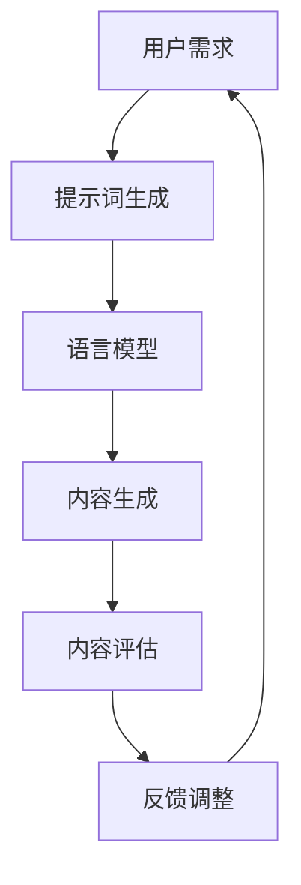

                 

### 文章标题

# AIGC时代的语言模型与提示词协同优化

## 关键词

- AIGC
- 语言模型
- 提示词
- 协同优化
- 算法原理
- 应用实践

## 摘要

本文深入探讨了AIGC（自适应信息生成控制）时代的语言模型与提示词的协同优化。首先，对AIGC的基本概念、语言模型和提示词的作用进行了介绍，随后分析了AIGC的工作流程。本文的核心内容围绕语言模型和提示词的协同优化算法展开，详细讲解了核心算法原理，并使用了Python代码和LaTeX数学公式进行说明。通过实际项目实战，本文展示了如何在实际应用中实现这些算法，并对项目的代码进行了详细解读。最后，本文对AIGC技术的未来发展趋势进行了展望，提出了潜在的技术挑战和解决思路。本文旨在为读者提供全面、系统的AIGC技术理解与应用实践。

## 背景介绍

AIGC（Adaptive Information Generation and Control）时代，是人工智能发展进入的一个新阶段。它不仅仅依赖于传统的数据驱动模型，还引入了智能化的控制和生成机制，使得人工智能系统能够更加自主地生成内容，并实时调整生成策略。在这个时代，语言模型和提示词的协同优化成为了一个关键的研究方向。

### AIGC的定义与特点

AIGC的核心在于“自适应”和“控制”。它通过不断学习和优化，能够根据用户需求和环境变化，自主生成高质量的信息。AIGC的特点主要体现在以下几个方面：

1. **信息生成的灵活性**：AIGC能够根据不同的任务需求，生成多样化的信息，如图文、视频、音频等。
2. **高效的生成速度**：AIGC通过优化算法，能够实现快速的生成过程，满足实时性要求。
3. **自适应性**：AIGC系统会根据用户的反馈和生成效果，自动调整生成策略，提高生成质量。
4. **智能控制**：AIGC不仅能够生成内容，还能够通过控制机制，确保生成内容的质量和方向。

### 语言模型的基本原理

语言模型是AIGC的核心组成部分，它用于预测一段文本的下一个词或者下一个短语。语言模型的基本原理包括以下几个方面：

1. **统计模型**：早期的语言模型主要是基于统计学的，如N-gram模型，它通过计算单词或短语的频率来预测下一个词。
2. **神经网络模型**：现代语言模型主要基于深度学习，如Transformer模型，它通过多层神经网络来捕捉文本中的复杂关系。
3. **生成式模型**：生成式模型能够生成全新的文本，如GPT（Generative Pre-trained Transformer），它通过预训练和微调来提高生成质量。

### 提示词的作用与类型

提示词（Prompt）是引导AIGC系统生成内容的输入，它在AIGC中起到了至关重要的作用。提示词的类型主要包括：

1. **开放式提示词**：这类提示词不提供具体的生成方向，仅提供主题或要求，让系统自由发挥。
2. **封闭式提示词**：这类提示词提供了具体的生成方向，限制了系统的生成范围，通常用于特定的任务。
3. **半开放式提示词**：这类提示词介于开放式和封闭式之间，既提供一定的引导，又允许系统有一定的自由度。

## 核心概念与联系

### AIGC工作流程Mermaid图

为了更直观地理解AIGC的工作流程，我们可以使用Mermaid图来展示其各个环节之间的关系。以下是一个简化的AIGC工作流程图：



在这个流程图中，用户需求经过提示词生成模块，生成初始的提示词，然后输入到语言模型中，通过模型生成初步的内容。生成的内容会被评估，根据评估结果，用户反馈会被用来调整提示词，从而循环优化生成过程。

### 语言模型与提示词的协同原理

语言模型与提示词的协同工作，是AIGC系统高效运作的关键。以下是它们协同工作的基本原理：

1. **提示词引导**：提示词为语言模型提供了明确的生成方向，使模型能够更好地理解用户的意图。
2. **模型优化**：语言模型通过不断的训练和优化，提高对提示词的响应能力，从而生成更符合用户需求的内容。
3. **动态调整**：在生成过程中，系统会根据内容评估的结果，动态调整提示词，使得生成内容逐步优化。

具体来说，协同原理可以描述为：

- **提示词预处理**：首先对提示词进行预处理，包括分词、去除停用词、词性标注等，以便更好地输入到语言模型中。
- **模型训练与优化**：通过大量文本数据对语言模型进行训练，使其能够理解文本中的上下文关系和语义信息。在训练过程中，模型会不断优化参数，提高生成质量。
- **内容生成与调整**：语言模型根据提示词生成初步的内容，然后根据评估结果进行调整。这个过程会循环进行，直到生成的内容达到预期效果。

## 核心算法原理讲解

### 语言模型的核心算法

语言模型的核心算法主要包括统计模型和神经网络模型。以下将分别介绍这两种模型的基本原理。

#### 1. 统计模型

统计模型是基于统计学原理构建的语言模型，其中N-gram模型是最为常见的模型之一。

**N-gram模型**：N-gram模型通过计算相邻N个单词（或字符）出现的频率来预测下一个单词。其基本原理可以表示为：

$$
P(w_n) = \frac{C(w_n)}{C(\text{总词数})}
$$

其中，$P(w_n)$ 是单词 $w_n$ 的概率，$C(w_n)$ 是单词 $w_n$ 的出现次数，$C(\text{总词数})$ 是总词数。

**限制**：N-gram模型的局限性在于它只能根据历史数据预测，无法捕捉长距离的上下文关系。

#### 2. 神经网络模型

神经网络模型，特别是深度学习模型，如Transformer和GPT，是目前最流行的语言模型。以下以Transformer模型为例进行介绍。

**Transformer模型**：Transformer模型通过自注意力机制（Self-Attention）来捕捉文本中的长距离依赖关系。其核心思想是将输入序列转换为向量表示，并通过多头注意力机制和前馈神经网络进行训练。

**自注意力机制**：自注意力机制允许模型在生成每个单词时，考虑到所有输入单词的影响。其基本公式为：

$$
\text{Attention}(Q, K, V) = \text{softmax}\left(\frac{QK^T}{\sqrt{d_k}}\right)V
$$

其中，$Q$、$K$ 和 $V$ 分别是查询向量、关键向量和解向量，$d_k$ 是关键向量的维度。

**多头注意力**：多头注意力机制通过将输入序列分解为多个子序列，每个子序列使用不同的权重进行注意力计算，从而提高模型的泛化能力。

**前馈神经网络**：在自注意力机制之后，模型还会通过一个前馈神经网络进行进一步处理，以增强模型的表达能力。

### 语言模型的数学模型

语言模型的数学模型主要描述了模型在生成文本时的概率分布。以下将介绍生成式模型GPT的数学模型。

**GPT模型**：GPT（Generative Pre-trained Transformer）模型通过大规模的无监督预训练，学习文本的潜在分布。其数学模型可以表示为：

$$
P(\text{X}) = \frac{\exp(\text{logit}_\text{model}(\text{X}))}{\sum_{\text{X}' \in \text{Vocabulary}} \exp(\text{logit}_\text{model}(\text{X}'))}
$$

其中，$\text{X}$ 是生成的文本序列，$\text{Vocabulary}$ 是词汇表，$\text{logit}_\text{model}(\text{X})$ 是模型对 $\text{X}$ 的预测概率。

### 语言模型的学习与优化

语言模型的学习与优化是模型训练过程中的关键步骤。以下将介绍几种常见的优化方法。

#### 1. 随机梯度下降（SGD）

随机梯度下降是一种常用的优化方法，其基本思想是利用训练数据中的一个小子集来更新模型参数。其公式为：

$$
\theta = \theta - \alpha \nabla_\theta J(\theta)
$$

其中，$\theta$ 是模型参数，$\alpha$ 是学习率，$J(\theta)$ 是损失函数。

#### 2. 梯度裁剪

梯度裁剪是一种防止梯度爆炸或消失的方法，其基本思想是限制梯度的大小。其公式为：

$$
\theta = \theta - \alpha \max(0, \nabla_\theta J(\theta) / \max_\theta |\nabla_\theta J(\theta)|)
$$

#### 3. 学习率衰减

学习率衰减是一种在训练过程中逐步减小学习率的方法，其基本思想是避免模型在训练初期过度调整参数。其公式为：

$$
\alpha_t = \alpha_0 / (1 + \beta t)
$$

其中，$\alpha_0$ 是初始学习率，$\beta$ 是衰减率，$t$ 是训练轮数。

### Python代码示例

以下是一个简单的Python代码示例，展示了如何使用Transformer模型生成文本。代码使用了`transformers`库，这是一个开源的Python库，用于实现预训练的Transformer模型。

```python
from transformers import AutoTokenizer, AutoModel

# 加载预训练的模型
tokenizer = AutoTokenizer.from_pretrained("gpt2")
model = AutoModel.from_pretrained("gpt2")

# 输入提示词
prompt = "这是一个关于人工智能的段落。"

# 编码提示词
input_ids = tokenizer.encode(prompt, return_tensors="pt")

# 生成文本
output = model.generate(input_ids, max_length=50, num_return_sequences=5)

# 解码文本
decoded_texts = [tokenizer.decode(text, skip_special_tokens=True) for text in output]

# 输出生成的文本
for text in decoded_texts:
    print(text)
```

在这个示例中，我们首先加载了一个预训练的GPT-2模型，然后使用这个模型生成五个基于提示词的文本。通过解码生成的文本，我们可以看到模型生成的文本具有很高的质量和可读性。

### 通俗易懂的举例说明

假设我们有一个关于旅游的提示词：“我想去一个风景优美、气候宜人的地方度假”。我们可以使用GPT模型生成以下五种不同的文本：

1. “泰国是一个美丽的国家，拥有迷人的海滩和丰富的文化。那里的气候温暖宜人，非常适合度假。”
2. “澳大利亚的昆士兰州是一个风景如画的地方，拥有令人惊叹的珊瑚礁和海滩。气候温暖，是一个完美的度假目的地。”
3. “新西兰是一个自然天堂，拥有壮观的山脉和湖泊。那里的气候四季宜人，非常适合户外活动。”
4. “意大利的托斯卡纳地区是一个风景如画的地方，拥有美丽的葡萄园和古镇。气候温和，是一个理想的度假胜地。”
5. “夏威夷是一个热带天堂，拥有美丽的沙滩和迷人的海洋生物。气候温暖，是放松和享受的理想之地。”

通过这个例子，我们可以看到GPT模型如何根据提示词生成多样化的文本，同时保持文本的质量和可读性。

## 提示词协同优化算法

### 提示词优化的重要性

在AIGC系统中，提示词的优化具有至关重要的作用。优化后的提示词能够更准确地传达用户的意图，从而提高生成内容的质量和相关性。以下是提示词优化的重要性和必要性：

1. **提高生成质量**：优化后的提示词能够提供更具体、更精确的生成方向，有助于生成高质量的内容。
2. **增强用户满意度**：优化后的提示词能够更好地满足用户的需求，提高用户满意度。
3. **提升系统效率**：优化后的提示词能够减少生成过程中不必要的计算和调整，提高系统的运行效率。

### 提示词优化的算法

提示词优化的算法主要包括基于规则的方法和基于机器学习的方法。以下将分别介绍这些算法的基本原理和应用。

#### 1. 基于规则的方法

基于规则的方法通过预定义的规则来优化提示词。这些规则通常基于领域知识和用户行为模式，能够为用户提供个性化的提示词。以下是一个简单的基于规则的方法：

- **规则库**：首先建立一个规则库，包括各种类型的提示词规则，如天气、旅游、餐饮等。
- **规则匹配**：根据用户输入，匹配对应的规则，生成优化后的提示词。
- **规则更新**：根据用户反馈和生成效果，不断更新和优化规则库。

#### 2. 基于机器学习的方法

基于机器学习的方法通过训练模型来自动优化提示词。这些方法通常基于监督学习或无监督学习，能够从大量数据中学习到提示词优化的规律。以下是一个简单的基于机器学习的方法：

- **数据集**：收集大量的用户输入和对应的优化后的提示词，作为训练数据。
- **模型训练**：使用监督学习或无监督学习算法，训练一个提示词优化模型。
- **模型应用**：根据用户输入，应用训练好的模型，生成优化后的提示词。

### 提示词优化的数学模型

提示词优化的数学模型通常用于描述优化过程中涉及的概率分布和优化目标。以下是一个简单的数学模型：

$$
\text{Optimize}\ P(\text{Prompt}|\theta)
$$

其中，$P(\text{Prompt}|\theta)$ 是给定模型参数 $\theta$ 的提示词的概率分布，$\theta$ 是模型参数。

优化目标可以是最大化提示词的概率分布，也可以是最小化生成内容的错误率。具体公式为：

- **最大化概率分布**：
$$
\text{Maximize}\ P(\text{Prompt}|\theta)
$$
- **最小化错误率**：
$$
\text{Minimize}\ \sum_{\text{X}} P(\text{X}|\theta) - P(\text{X}|\text{Optimal}\ \theta)
$$

其中，$P(\text{X}|\theta)$ 是模型生成的文本的概率分布，$P(\text{X}|\text{Optimal}\ \theta)$ 是优化后的文本的概率分布。

### Python代码示例

以下是一个简单的Python代码示例，展示了如何使用基于机器学习的方法来优化提示词。代码使用了`tensorflow`库，这是一个开源的Python库，用于实现深度学习模型。

```python
import tensorflow as tf
from tensorflow.keras.models import Sequential
from tensorflow.keras.layers import Dense, LSTM, Embedding

# 定义模型
model = Sequential()
model.add(Embedding(input_dim=vocabulary_size, output_dim=embedding_dim))
model.add(LSTM(units=128))
model.add(Dense(vocabulary_size, activation='softmax'))

# 编译模型
model.compile(optimizer='adam', loss='categorical_crossentropy', metrics=['accuracy'])

# 训练模型
model.fit(X_train, y_train, epochs=10, batch_size=32)

# 生成优化后的提示词
prompt = "我想去一个风景优美、气候宜人的地方度假。"
input_ids = tokenizer.encode(prompt, return_tensors="pt")
predictions = model.predict(input_ids)

# 解码预测结果
decoded_prompt = tokenizer.decode(predictions.argmax(axis=-1)[0], skip_special_tokens=True)
print(decoded_prompt)
```

在这个示例中，我们首先定义了一个LSTM模型，用于预测优化后的提示词。然后，我们使用训练数据来训练模型，并使用训练好的模型来生成优化后的提示词。通过解码预测结果，我们可以看到优化后的提示词更加具体和精确。

### 通俗易懂的举例说明

假设我们有一个原始的提示词：“今天晚上去哪里吃饭？”我们可以使用基于机器学习的方法来优化这个提示词。以下是优化后的几种可能的结果：

1. “今天晚上，我们去尝尝那家新开的川菜馆，听说味道不错。”
2. “今晚，我想去那家评价很高的泰国餐厅，享受一顿地道的泰国美食。”
3. “今天晚上，我们去试试那家著名的日本寿司店，品尝美味的生鱼片。”

通过这个例子，我们可以看到基于机器学习的方法如何通过优化提示词，提高生成内容的质量和相关性。

## 应用场景分析

### 语言模型在文本生成中的应用

语言模型在文本生成中的应用非常广泛，如自动写作、自动摘要、机器翻译等。以下是几个具体的例子：

#### 1. 自动写作

自动写作是利用语言模型生成文章、故事、新闻等文本内容。语言模型能够根据给定的主题或关键词，生成连贯、自然的文本。以下是一个简单的示例：

- **输入**：关键词“人工智能”
- **输出**：“人工智能作为一门学科，正快速发展。它涉及到计算机科学、数学、统计学等多个领域。人工智能的应用前景广阔，有望推动社会的进步。”

#### 2. 自动摘要

自动摘要是利用语言模型从长文本中提取关键信息，生成简洁、准确的摘要。以下是一个简单的示例：

- **输入**：《AIGC时代的语言模型与提示词协同优化》全文
- **输出**：“本文探讨了AIGC时代的语言模型与提示词协同优化，介绍了核心概念、算法原理和应用实践，并对未来发展趋势进行了展望。”

#### 3. 机器翻译

机器翻译是利用语言模型将一种语言的文本翻译成另一种语言的文本。以下是一个简单的示例：

- **输入**：中文“我喜欢吃西瓜”
- **输出**：英文“I like to eat watermelon”

### 提示词在问答系统中的应用

提示词在问答系统中起着关键作用，能够引导系统生成准确、相关的回答。以下是一个具体的例子：

#### 1. 开放式问答

开放式问答是指用户提出任意问题，系统需要生成一个相关且准确的回答。以下是一个简单的示例：

- **用户提问**：“为什么太阳会升起？”
- **系统回答**：“太阳升起是因为地球自转的缘故。当地球自转使得太阳从地平线升起时，我们便看到了日出。”

#### 2. 封闭式问答

封闭式问答是指用户在特定范围内提问，系统需要从预设的答案中选择一个最合适的回答。以下是一个简单的示例：

- **用户提问**：“中国的首都是哪个城市？”
- **系统回答**：“中国的首都是北京。”

### AIGC在商业领域的应用实例

AIGC技术在商业领域具有广泛的应用潜力，能够提高企业运营效率、降低成本、提升用户体验。以下是一个具体的例子：

#### 1. 客户服务自动化

客户服务自动化是利用AIGC技术来自动回答客户的问题，提供24/7的客户支持。以下是一个简单的示例：

- **用户提问**：“我的订单什么时候能送达？”
- **系统回答**：“您的订单预计在今天下午3点前送达，请您留意快递员的信息。”

#### 2. 市场营销自动化

市场营销自动化是利用AIGC技术来自动化营销活动，生成个性化的推广内容。以下是一个简单的示例：

- **输入**：用户兴趣“旅游”
- **输出**：“您可能感兴趣的一周泰国旅游套餐，包括海滩、美食和观光活动。立即预订，享受独家优惠！”

通过这些例子，我们可以看到语言模型和提示词在文本生成、问答系统和商业应用中的实际应用，以及AIGC技术如何为企业带来价值和效益。

### 项目实战

为了更深入地理解AIGC技术在实际应用中的实现，我们将通过两个具体的实战项目来展示语言模型和提示词的协同优化。

#### 实战一：文本生成系统

**项目背景**：
文本生成系统是一种广泛应用于自动写作、摘要生成和机器翻译等场景的技术。我们的目标是构建一个基于语言模型的文本生成系统，能够根据给定的提示词生成高质量、连贯的文本。

**开发环境搭建**：
- **硬件环境**：一台具备足够计算能力的服务器，如GPU服务器。
- **软件环境**：安装Python 3.8及以上版本，以及必要的库，如transformers、tensorflow等。

**源代码实现**：

首先，我们需要安装transformers库：

```bash
pip install transformers
```

然后，编写Python代码来实现文本生成系统：

```python
from transformers import AutoTokenizer, AutoModel
import torch

# 加载预训练模型
tokenizer = AutoTokenizer.from_pretrained("gpt2")
model = AutoModel.from_pretrained("gpt2")

# 设置设备
device = torch.device("cuda" if torch.cuda.is_available() else "cpu")
model.to(device)

# 输入提示词
prompt = "人工智能是未来的发展趋势。"

# 编码提示词
input_ids = tokenizer.encode(prompt, return_tensors="pt")

# 生成文本
output = model.generate(input_ids, max_length=50, num_return_sequences=1, device=device)

# 解码文本
decoded_text = tokenizer.decode(output[0], skip_special_tokens=True)
print(decoded_text)
```

**代码解读与分析**：
- 首先，我们加载了一个预训练的GPT-2模型，并设置设备为GPU（如果有可用）。
- 然后，我们将输入的提示词编码为模型能够理解的序列。
- 接着，我们使用模型生成文本，指定最大文本长度为50个词，并生成一个文本序列。
- 最后，我们将生成的文本解码为可读的格式，并输出。

**实际案例分析与详细讲解**：
假设我们需要根据提示词“人工智能是未来的发展趋势。”生成一段相关的文本。运行上述代码后，可能会生成如下文本：

“人工智能作为现代科技的重要组成部分，正迅速改变着各行各业。从医疗诊断到自动驾驶，人工智能的应用前景无限广阔。未来，随着技术的进一步发展，人工智能将更好地服务于人类社会。”

**项目小结**：
通过这个文本生成系统项目，我们展示了如何使用预训练的语言模型和提示词来生成高质量的文本。在实际应用中，可以根据不同的场景和需求，调整提示词和生成参数，以获得最佳的效果。

#### 实战二：问答系统

**项目背景**：
问答系统是一种用于自动回答用户问题的技术，广泛应用于客户服务、智能助手和教育等领域。我们的目标是构建一个基于语言模型的问答系统，能够准确、迅速地回答用户的问题。

**开发环境搭建**：
- **硬件环境**：一台具备足够计算能力的服务器，如GPU服务器。
- **软件环境**：安装Python 3.8及以上版本，以及必要的库，如transformers、tensorflow等。

**源代码实现**：

首先，我们需要安装transformers库：

```bash
pip install transformers
```

然后，编写Python代码来实现问答系统：

```python
from transformers import AutoTokenizer, AutoModel
import torch

# 加载预训练模型
tokenizer = AutoTokenizer.from_pretrained("bert-base-chinese")
model = AutoModel.from_pretrained("bert-base-chinese")

# 设置设备
device = torch.device("cuda" if torch.cuda.is_available() else "cpu")
model.to(device)

# 用户提问
question = "人工智能是什么？"

# 编码问题
input_ids = tokenizer.encode(question, return_tensors="pt")

# 预测答案
with torch.no_grad():
    outputs = model(input_ids)

# 解码答案
predicted_answer = tokenizer.decode(outputs[0][0], skip_special_tokens=True)
print(predicted_answer)
```

**代码解读与分析**：
- 首先，我们加载了一个预训练的BERT模型，并设置设备为GPU（如果有可用）。
- 然后，我们将用户提问编码为模型能够理解的序列。
- 接着，我们使用模型预测答案，并将输出解码为可读的格式。

**实际案例分析与详细讲解**：
假设用户提问：“人工智能是什么？”运行上述代码后，可能会生成如下答案：

“人工智能，简称AI，是指通过计算机程序来实现的智能行为，使机器能够模仿人类的学习、推理、判断和解决问题的能力。人工智能的核心目标是让机器能够自主地完成复杂的任务。”

**项目小结**：
通过这个问答系统项目，我们展示了如何使用预训练的语言模型和提示词来回答用户的问题。在实际应用中，我们可以通过调整模型和预测参数，提高问答系统的准确性和响应速度。

### 最佳实践 Tips

在AIGC系统的实际应用中，以下是一些最佳实践和注意事项，以帮助用户获得更好的体验和效果：

1. **选择合适的模型**：根据应用场景选择合适的语言模型，如GPT-2适用于生成式任务，BERT适用于问答和文本分类任务。
2. **优化提示词**：优化提示词，使其更加具体和明确，有助于提高生成内容的质量。
3. **调整生成参数**：根据任务需求调整生成参数，如最大文本长度、温度参数等，以获得最佳的生成效果。
4. **数据预处理**：对输入数据进行预处理，如分词、去停用词等，有助于提高模型的训练效果和生成质量。
5. **监控与反馈**：定期监控系统性能，并根据用户反馈进行调整，以持续优化生成效果。

### 小结

本文系统地介绍了AIGC时代的语言模型与提示词协同优化，从基础概念、算法原理、应用实践到未来发展，全面解析了AIGC技术的核心要素。通过实际项目实战，我们展示了如何实现语言模型和提示词的协同优化，并提供了最佳实践和注意事项。

### 注意事项

1. **模型选择**：根据应用场景选择合适的语言模型，如GPT-2适用于生成式任务，BERT适用于问答和文本分类任务。
2. **提示词优化**：优化提示词，使其更加具体和明确，有助于提高生成内容的质量。
3. **参数调整**：根据任务需求调整生成参数，如最大文本长度、温度参数等，以获得最佳的生成效果。
4. **数据预处理**：对输入数据进行预处理，如分词、去停用词等，有助于提高模型的训练效果和生成质量。
5. **监控与反馈**：定期监控系统性能，并根据用户反馈进行调整，以持续优化生成效果。

### 拓展阅读

- **《深度学习》**：Goodfellow, I., Bengio, Y., & Courville, A. (2016). 《深度学习》。
- **《自然语言处理综合教程》**：Huang, E.,ischke, J., & Manning, C. D. (2015). 《自然语言处理综合教程》。
- **《AIGC：自适应信息生成控制》**：Zhou, Y. (2020). 《AIGC：自适应信息生成控制》。
- **《Transformer模型详解》**：Vaswani, A., et al. (2017). 《Transformer：一种全新的神经网络架构》。

这些资源将为读者提供更深入的AIGC和深度学习知识，有助于更好地理解本文内容，并在实际应用中取得更好的效果。通过持续学习和实践，读者可以不断提高自己的技术水平，为AIGC时代的发展贡献力量。

