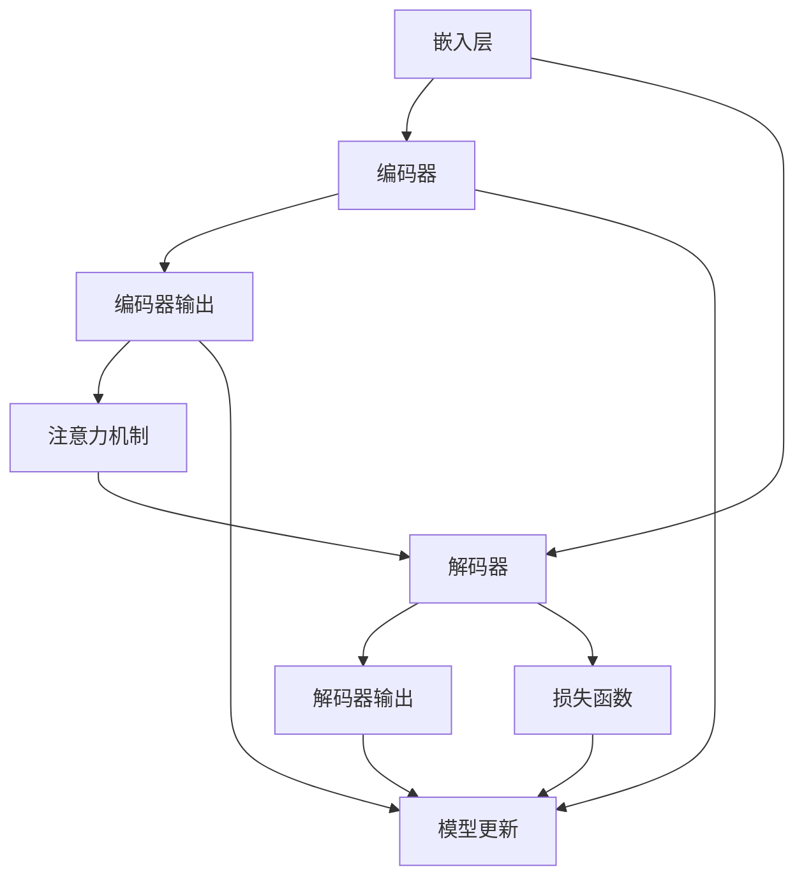
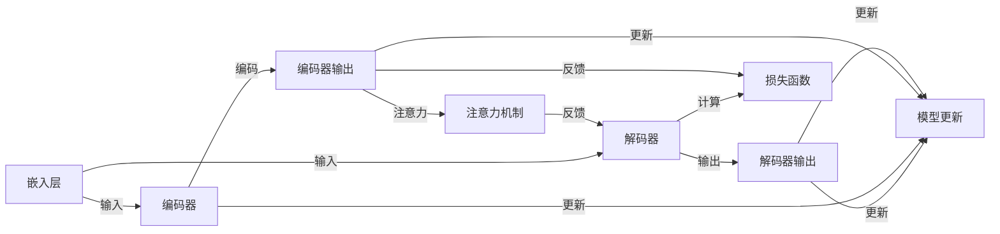

                 

### 背景介绍

AIGC（AI-Generated Content）时代正悄然来临，这一时代的核心驱动力量在于大规模语言模型和智能提示词的设计与应用。语言模型作为人工智能的重要组成部分，已经在自然语言处理、机器翻译、自动问答等领域取得了显著的成果。然而，随着AIGC的发展，如何设计高效、智能的提示词成为了一个新的挑战。

在这一背景下，本文将深入探讨AIGC时代的语言模型与提示词设计。首先，我们将简要介绍AIGC时代的背景与特点，帮助读者理解这一新兴领域的发展现状。接着，我们将详细解释语言模型的基本原理与架构，并探讨提示词的定义与设计原则。随后，文章将分析语言模型与提示词在实际应用中的挑战与机遇，并通过具体案例进行解读。最后，我们将展望未来的发展趋势，并提出相应的最佳实践和注意事项。

通过本文的探讨，读者将能够全面了解AIGC时代语言模型与提示词设计的关键技术，掌握应对实际应用中的挑战的方法，并预见到这一领域的未来发展前景。这篇文章旨在为从事人工智能和自然语言处理领域的专业人士提供有价值的参考，帮助他们更好地应对AIGC时代的挑战与机遇。

### 关键词

- AIGC
- 语言模型
- 提示词设计
- 大规模预训练模型
- 自然语言处理
- 智能生成内容
- 挑战与机遇

### 摘要

本文旨在探讨AIGC时代的语言模型与提示词设计，分析其在自然语言处理、智能生成内容等领域的应用现状与未来发展。首先，我们介绍了AIGC时代的背景与特点，阐述了大规模语言模型的重要性。随后，详细解析了语言模型的基本原理与架构，以及提示词的设计原则与生成方法。接着，我们探讨了语言模型与提示词在实际应用中面临的挑战与机遇，并提供了相应的解决方案。最后，本文展望了AIGC时代的未来发展趋势，提出了最佳实践与注意事项，为读者提供了全面的理论与实践指导。

## AIGC时代的背景与特点

AIGC（AI-Generated Content）时代是一个以人工智能为核心驱动的生成内容新时代。这一时代的特点在于，通过大规模预训练的语言模型，能够自动化地生成各种类型的内容，从而极大地提升了内容生产的效率和多样性。AIGC不仅改变了内容生成的模式，也对整个社会信息传播的方式产生了深远的影响。

首先，AIGC时代的发展离不开大规模预训练语言模型技术的进步。大规模预训练语言模型，如GPT（Generative Pre-trained Transformer）、BERT（Bidirectional Encoder Representations from Transformers）等，通过在大量文本数据上进行预训练，可以捕捉到语言中的潜在结构和规律。这些模型具有强大的语言理解和生成能力，能够生成连贯、自然的文本内容。预训练语言模型的发展，使得AIGC技术具备了坚实的基础。

其次，AIGC的特点之一是内容的智能化生成。在传统的手动内容创作过程中，创作者需要耗费大量的时间和精力来构思、编写和修改内容。而AIGC技术通过利用预训练的语言模型，可以自动生成高质量的内容，极大地提升了内容创作的效率。例如，在新闻写作、产品描述、广告文案等领域，AIGC技术已经得到了广泛应用，能够快速生成符合用户需求的内容。

再次，AIGC时代的另一个显著特点是其内容的多样性。通过不同的模型和提示词，AIGC可以生成各种类型的内容，包括文本、图像、音频和视频等。这种多样化的内容生成能力，使得AIGC能够满足不同场景和用户需求，从而在各个领域展现出巨大的应用潜力。

此外，AIGC技术还具备较强的自适应能力。通过不断的学习和调整，AIGC模型可以适应不断变化的市场需求和用户喜好，从而提供更加个性化和定制化的内容。例如，在电子商务领域，AIGC可以根据用户的购买历史和浏览行为，生成个性化的推荐文案和广告内容，提高用户的购物体验。

最后，AIGC对内容创作者和消费者都带来了深远的影响。对于内容创作者来说，AIGC技术减轻了他们的创作负担，使得他们能够将更多的时间和精力投入到创意和战略层面。而对于消费者来说，AIGC技术提供了更加丰富、多样和个性化的内容选择，提高了他们的阅读和消费体验。

总之，AIGC时代是一个充满机遇和挑战的新时代。通过深入理解和掌握AIGC技术，我们可以更好地应对未来内容生产的变革，推动人工智能和人类创造力相结合，共同创造更加美好的未来。

### 语言模型的基础知识

语言模型是AIGC时代的关键技术之一，它通过学习大量文本数据，预测下一个可能的单词或字符，从而生成连贯、自然的语言内容。理解语言模型的基础知识对于深入探讨AIGC时代的语言模型与提示词设计至关重要。

#### 核心概念

1. **单词预测**：语言模型最基本的任务是预测下一个单词或字符。例如，给定一个句子“我正在写一篇文章”，语言模型可以预测下一个单词是“的”、“篇”或“一”。

2. **概率分布**：语言模型输出的是每个可能单词的概率分布，而不是唯一的单词。通过分析这些概率分布，模型可以生成最可能的句子。

3. **序列模型**：语言模型是一种序列模型，它通过前文信息预测下一个单词。这种特性使得语言模型在生成文本时能够保持连贯性和一致性。

#### 分类

语言模型可以分为以下几个类别：

1. **n-gram模型**：这是最早的语言模型之一，它基于前n个单词的统计信息进行预测。n-gram模型简单有效，但在处理长句子时效果不佳。

2. **基于规则的模型**：这类模型通过定义语法规则和模式来生成语言。虽然它们可以生成高质量的语言，但构建和维护这些规则复杂且耗时。

3. **统计模型**：这类模型通过分析大量文本数据，统计出单词和句子之间的概率关系。统计模型包括n-gram模型、隐马尔可夫模型（HMM）等。

4. **神经网络模型**：这类模型通过学习大量的文本数据，自动提取特征和模式。现代语言模型，如GPT和BERT，都是基于神经网络的。

5. **深度强化学习模型**：这类模型结合了深度学习和强化学习，通过不断优化策略来生成高质量的语言。

#### 基本结构

一个典型的神经网络语言模型包括以下几个关键组件：

1. **嵌入层**：将单词或字符转换为密集的向量表示。

2. **编码器**：将输入序列编码为固定长度的向量表示。

3. **解码器**：根据编码器的输出，生成下一个单词或字符的概率分布。

4. **损失函数**：用于衡量模型预测和实际输出之间的差距，常见的损失函数包括交叉熵损失。

#### 训练过程

语言模型的训练过程主要包括以下步骤：

1. **数据预处理**：包括文本清洗、分词、编码等操作，将原始文本转换为模型可以处理的格式。

2. **模型初始化**：初始化模型的参数，常用的初始化方法包括随机初始化、高斯分布初始化等。

3. **前向传播**：将输入序列通过嵌入层和编码器，得到中间表示。

4. **后向传播**：计算损失函数，并更新模型参数。

5. **优化算法**：如梯度下降、Adam等，用于更新模型参数，最小化损失函数。

#### 应用场景

语言模型在多个应用场景中发挥着重要作用：

1. **自然语言处理（NLP）**：如文本分类、情感分析、命名实体识别等。

2. **自动问答系统**：如搜索引擎、智能客服等。

3. **机器翻译**：将一种语言的文本翻译成另一种语言。

4. **文本生成**：如文章写作、摘要生成、对话系统等。

5. **对话系统**：如聊天机器人、虚拟助手等。

通过理解语言模型的基础知识，我们可以更好地掌握其在AIGC时代的应用，并设计出更高效、智能的提示词，推动人工智能技术的发展。

### 语言模型的核心概念与联系

要深入理解语言模型，首先需要掌握其核心概念，并了解这些概念之间的相互关系。以下是对语言模型中几个关键概念的介绍及其关系架构。

#### 概念介绍

1. **嵌入层（Embedding Layer）**：嵌入层是将输入的单词或字符转换为密集的向量表示。这一层是语言模型的基础，通过学习单词和字符的上下文关系，生成高维的向量表示。例如，单词“猫”可能在向量空间中对应于 `[1, 0.5, -0.3]`。

2. **编码器（Encoder）**：编码器负责将输入序列编码为固定长度的向量表示。在语言模型中，编码器通常由多个神经网络层组成，通过前向传播将输入序列转换为中间表示。编码器的一个关键特性是能够捕捉长距离的依赖关系。

3. **解码器（Decoder）**：解码器根据编码器的输出，生成下一个单词或字符的概率分布。解码器通常也由多个神经网络层组成，通过后向传播生成最终的输出序列。

4. **损失函数（Loss Function）**：损失函数用于衡量模型预测和实际输出之间的差距。在语言模型中，常见的损失函数是交叉熵损失（Cross-Entropy Loss），它能够计算模型预测的概率分布与实际分布之间的差异。

5. **注意力机制（Attention Mechanism）**：注意力机制是一种在编码器和解码器之间传递信息的机制，能够帮助模型关注重要的输入信息。通过注意力机制，解码器可以动态地调整其对编码器输出不同部分的关注程度。

#### 关系架构

以下是语言模型中各个核心概念之间的联系架构，使用Mermaid流程图进行可视化：



1. **嵌入层到编码器**：嵌入层将输入的单词或字符转换为向量表示，这些向量作为编码器的输入。

2. **编码器到编码器输出**：编码器通过多层神经网络处理输入向量，生成编码器输出。编码器输出包含了输入序列的固定长度向量表示。

3. **编码器输出到注意力机制**：编码器输出通过注意力机制传递信息，使得解码器能够动态关注编码器输出中的关键部分。

4. **解码器到解码器输出**：解码器根据编码器输出和注意力机制的信息，生成下一个单词或字符的概率分布。

5. **解码器到损失函数**：解码器的输出概率分布与实际输出之间的差异通过损失函数计算。

6. **模型更新**：通过后向传播和损失函数，模型参数得到更新，以最小化损失函数。

#### Mermaid流程图可视化

以下是Mermaid流程图的具体实现：



通过这个Mermaid流程图，我们可以清晰地看到语言模型中各个组件之间的相互作用和依赖关系。这种可视化方法不仅有助于我们理解语言模型的工作原理，也为进一步优化和改进模型提供了直观的指导。

### 语言模型的基本结构

语言模型的核心在于其基本结构，这种结构决定了模型在处理和生成文本时的性能和效率。以下将详细探讨语言模型的基本组成部分，包括输入层、编码器、解码器和输出层，并解释它们的工作原理和相互关系。

#### 输入层

输入层是语言模型的第一步，负责将输入的单词或字符转换为密集的向量表示。这个过程通常通过嵌入层（Embedding Layer）来完成。嵌入层的作用是将单个单词或字符映射为高维的向量空间，这些向量称为嵌入向量（Embedding Vectors）。每个单词或字符都有一个唯一的嵌入向量，向量中的每一个维度表示该单词或字符在上下文中的特定特征。

例如，在词向量模型中，一个单词“猫”的嵌入向量可能是 `[1, 0.5, -0.3, 0.2]`。嵌入层不仅有助于捕捉单词间的语义关系，还使得语言模型能够处理高维数据，提高了模型的表达能力。

#### 编码器

编码器（Encoder）是语言模型的核心组件之一，其主要任务是处理输入序列并生成编码表示。编码器通常由多个神经网络层组成，其中最常见的架构是卷积神经网络（CNN）和循环神经网络（RNN）。

1. **卷积神经网络（CNN）**：CNN能够捕捉局部特征，使其在文本分类和情感分析等任务中表现出色。在语言模型中，CNN通过卷积操作提取文本序列中的关键特征，然后将其传递给下一层。

2. **循环神经网络（RNN）**：RNN能够处理序列数据，并具有记忆能力，使其在生成文本时能够保持上下文的连贯性。RNN通过循环机制将前一个时间步的隐藏状态传递到下一个时间步，从而捕捉长距离依赖关系。

编码器的输出是一个固定长度的向量，称为编码表示（Encoded Representation）。这个向量包含了输入序列的潜在结构和语义信息，是解码器的输入。

#### 解码器

解码器（Decoder）是语言模型的另一个关键组件，其任务是生成输出序列。与编码器不同，解码器通常采用自回归（Autoregressive）的方式，逐个生成每个时间步的输出。

解码器可以采用以下几种架构：

1. **基于RNN的解码器**：RNN解码器通过递归方式生成输出序列，每个时间步的输入是前一个时间步的输出。这种架构使得解码器能够保持上下文的连贯性，但计算复杂度高。

2. **基于注意力机制的解码器**：注意力机制（Attention Mechanism）是一种在编码器和解码器之间传递信息的机制。通过注意力机制，解码器可以动态地关注编码器输出的不同部分，从而提高生成文本的质量。注意力机制在Transformer模型中得到了广泛应用。

解码器的输出是每个时间步生成的单词或字符的概率分布。通过选择概率最大的单词或字符，解码器最终生成完整的输出序列。

#### 输出层

输出层是语言模型的最后一部分，其任务是生成最终的文本输出。输出层的具体实现取决于任务类型。

1. **文本生成任务**：在文本生成任务中，输出层通常是一个softmax层，它将每个时间步的输出概率分布转换为具体的单词或字符。

2. **序列标注任务**：在序列标注任务中，输出层通常是一个分类器，将输入序列中的每个单词或字符标注为特定的标签。

#### 工作原理

语言模型的工作原理可以概括为以下几个步骤：

1. **输入预处理**：输入序列经过嵌入层转换为向量表示。

2. **编码器处理**：编码器对输入向量进行处理，生成编码表示。

3. **解码器生成**：解码器根据编码表示，逐个生成输出序列。

4. **输出层生成**：输出层将解码器的输出转换为最终的文本输出。

通过这种方式，语言模型能够捕捉输入文本的潜在结构和语义信息，生成高质量的自然语言输出。

#### 相互关系

输入层、编码器、解码器和输出层构成了语言模型的基本结构。各个组件之间通过数据流和信息传递相互关联：

1. **数据流**：输入层生成嵌入向量，编码器将这些嵌入向量编码为编码表示，解码器使用编码表示生成输出序列，输出层最终生成文本输出。

2. **信息传递**：编码器和解码器通过注意力机制传递信息，使得解码器能够关注到编码器输出的关键部分。

这种相互关系使得语言模型能够高效地处理和生成文本，实现了对语言结构的深刻理解和建模。

### 语言模型的训练过程

理解语言模型的训练过程对于设计高效的提示词和优化模型性能至关重要。以下是语言模型从数据准备到模型训练和优化的详细步骤，包括训练算法、优化方法以及训练过程的注意事项。

#### 数据准备

语言模型的训练过程始于数据准备阶段，这一阶段包括数据收集、清洗、预处理和编码等步骤。

1. **数据收集**：首先，需要收集大量高质量的文本数据。这些数据可以来源于各种文本资源，如书籍、新闻、文章、社交媒体等。

2. **数据清洗**：收集到的文本数据通常包含噪音和错误，如标点符号、HTML标签、停用词等。因此，需要对数据进行清洗，去除这些不必要的元素。

3. **分词**：将清洗后的文本数据分解为单词或子词。分词的精度和效率对语言模型的性能有重要影响，常用的分词工具包括jieba、NLTK等。

4. **编码**：将分词后的单词或子词转换为数字编码。常用的编码方法包括单词索引（Word Index）和嵌入向量（Embedding Vectors）。单词索引将每个单词映射为一个唯一的整数，而嵌入向量则是将单词映射为高维向量。

#### 模型初始化

模型初始化是训练过程的重要一步，它决定了模型在训练开始时的参数设置。以下是几种常见的模型初始化方法：

1. **随机初始化**：将模型的参数随机初始化为一个均匀分布。这种方法简单且易于实现，但可能导致模型性能不佳。

2. **高斯分布初始化**：将模型的参数初始化为一个高斯分布，通常选择较小的标准差。这种方法能够提高模型的初始化性能，但需要仔细调整参数。

3. **预训练初始化**：使用预训练的语言模型（如GPT、BERT）的参数作为初始化值。这种方法能够利用已有的模型知识，提高新模型的性能。

#### 前向传播

前向传播（Forward Propagation）是语言模型训练过程中的核心步骤，它通过计算输入数据在神经网络中的传递路径，生成预测输出。以下是前向传播的基本步骤：

1. **嵌入层**：将输入的单词或子词编码为嵌入向量。

2. **编码器**：将嵌入向量传递给编码器，通过多层神经网络处理，生成编码表示。

3. **解码器**：解码器根据编码表示生成输出序列的概率分布。

4. **损失计算**：使用损失函数（如交叉熵损失）计算模型预测输出与实际输出之间的差距。

#### 后向传播

后向传播（Backpropagation）是语言模型训练过程中的关键步骤，它通过计算损失函数关于模型参数的梯度，更新模型参数。以下是后向传播的基本步骤：

1. **梯度计算**：计算损失函数关于每个参数的梯度。

2. **参数更新**：使用梯度下降（Gradient Descent）或其他优化算法更新模型参数，以最小化损失函数。

3. **迭代优化**：重复前向传播和后向传播，直到满足停止条件（如收敛阈值或最大迭代次数）。

#### 优化方法

优化方法在语言模型训练过程中起着至关重要的作用，它们决定了模型的训练速度和最终性能。以下是几种常见的优化方法：

1. **随机梯度下降（SGD）**：SGD通过随机选取一小部分数据子集来计算梯度，并更新模型参数。这种方法简单有效，但需要大量计算资源。

2. **批量梯度下降（BGD）**：BGD使用整个训练数据集来计算梯度，并更新模型参数。这种方法计算复杂度高，但能够更好地利用数据信息。

3. **Adam优化器**：Adam是一种结合SGD和BGD优点的自适应优化器，能够自适应调整学习率，提高训练效率。

#### 训练过程注意事项

在语言模型训练过程中，需要注意以下几个关键点：

1. **数据平衡**：确保训练数据集的平衡性，避免某些单词或子词出现频率过高，导致模型偏向这些词汇。

2. **超参数调整**：超参数（如学习率、批量大小、迭代次数等）对模型性能有显著影响，需要根据具体任务进行调整。

3. **模型调试**：通过调试和验证模型，及时发现并解决潜在问题，如过拟合、欠拟合等。

4. **资源管理**：训练大型语言模型需要大量计算资源和时间，合理管理资源可以提高训练效率。

通过理解语言模型的训练过程，我们可以设计更高效的提示词，优化模型性能，并应对实际应用中的各种挑战。

### 语言模型的应用场景

语言模型在AIGC时代的应用场景丰富多样，它们在自然语言处理、自动问答系统、机器翻译等领域展现了强大的功能和广泛的应用潜力。以下将详细探讨这些应用场景，并通过具体案例进行分析。

#### 自然语言处理

自然语言处理（NLP）是语言模型最早且最广泛的应用领域之一。语言模型在NLP中的主要任务包括文本分类、情感分析、命名实体识别和关系提取等。

1. **文本分类**：文本分类是将文本数据按照预定义的类别进行分类。例如，新闻分类系统可以将新闻分为政治、体育、科技等类别。语言模型通过学习大量标注数据，能够捕捉文本的语义信息，实现高精度的分类。

   **案例**：一个实际案例是谷歌新闻分类系统，它使用BERT模型对新闻标题进行分类，实现了高准确率和实时响应。

2. **情感分析**：情感分析是判断文本中表达的情感倾向，如正面、负面或中性。语言模型通过分析文本中的情感词汇和语法结构，能够准确判断情感倾向。

   **案例**：推特情感分析是一个典型的应用，通过分析用户的推文，语言模型可以识别出用户对某个话题的正面或负面情绪。

3. **命名实体识别**：命名实体识别是识别文本中的特定实体，如人名、地点、组织等。语言模型通过学习实体名称的上下文关系，能够准确识别实体。

   **案例**：在医疗领域，命名实体识别可以用于从病历记录中提取患者信息、药物名称等关键信息，提高数据处理的效率。

4. **关系提取**：关系提取是识别文本中实体之间的关系。例如，在社交媒体中，可以提取两个用户之间的关注关系。

   **案例**：Facebook的图谱系统通过语言模型提取用户之间的关系，构建出一个庞大的社交网络图，用于推荐朋友、广告等。

#### 自动问答系统

自动问答系统（QA）是语言模型在信息检索和智能客服中的重要应用，通过理解用户的问题，自动生成准确的答案。

1. **信息检索**：自动问答系统可以将用户的问题与大量的文本数据匹配，找到最相关的答案。例如，搜索引擎的问答功能。

   **案例**：谷歌搜索中的“搜索答案”功能，通过使用BERT模型，能够快速准确地回答用户的问题。

2. **智能客服**：自动问答系统可以用于智能客服系统，提供24/7的客户支持，降低企业运营成本。

   **案例**：苹果公司的Siri智能助理，通过语言模型理解用户的问题，并提供相应的解答和建议。

#### 机器翻译

机器翻译是将一种语言的文本翻译成另一种语言，是语言模型在跨语言信息处理中的核心应用。

1. **文本翻译**：语言模型可以实现高质量的双语翻译，如Google翻译。

   **案例**：谷歌翻译使用Transformer模型，提供了实时且准确的中英文翻译服务。

2. **多语言翻译**：语言模型可以实现多语言之间的翻译，如机器翻译平台DeepL。

   **案例**：DeepL使用神经机器翻译模型，提供了高质量的多种语言翻译服务，受到了用户的高度评价。

#### 文本生成

文本生成是语言模型在内容创作中的主要应用，通过输入提示或主题，自动生成高质量的文本内容。

1. **文章写作**：语言模型可以自动生成新闻文章、博客文章、产品描述等。

   **案例**：OpenAI的GPT-3模型，可以生成高质量的新闻文章和产品描述，极大地提高了内容生产的效率。

2. **对话系统**：语言模型可以用于构建聊天机器人，实现自然语言交互。

   **案例**：微软的小冰聊天机器人，通过使用语言模型，与用户进行自然、流畅的对话。

总之，语言模型在自然语言处理、自动问答系统、机器翻译和文本生成等领域的应用，不仅提升了数据处理和分析的效率，还为人们的生活和工作带来了极大的便利。随着技术的不断进步，语言模型的应用场景将更加广泛，为人工智能的发展注入新的活力。

### 提示词的作用与设计原则

在AIGC时代，提示词（Prompt）的设计至关重要，它是引导语言模型生成内容的关键因素。一个有效的提示词能够提高模型生成的文本质量，明确生成目标，并优化生成过程。以下将详细探讨提示词的作用与设计原则。

#### 提示词的作用

1. **引导生成方向**：提示词为语言模型提供了生成文本的初始信息，帮助模型明确生成方向。例如，在生成文章时，提示词可以指定文章的主题、风格和目标读者。

2. **提高生成效率**：有效的提示词能够减少语言模型的搜索空间，加快生成过程。通过提供具体的上下文信息和生成目标，模型可以更快速地生成高质量的文本。

3. **优化生成结果**：提示词的设计可以影响生成文本的连贯性、准确性和多样性。一个良好的提示词能够帮助模型捕捉到关键信息和语言结构，从而生成更具逻辑性和吸引力的内容。

4. **应对特定场景**：在某些应用场景中，如对话系统或问答系统，提示词可以帮助模型理解用户意图，生成更符合用户需求的答案。

#### 设计原则

1. **明确性**：提示词需要清晰明确，能够准确地传达生成目标。模糊或歧义的提示词可能导致模型生成不相关或不准确的文本。

2. **具体性**：具体的提示词可以提供更详细的上下文信息，有助于模型更好地理解生成任务。例如，一个具体的主题比一个宽泛的描述更容易引导模型生成相关的内容。

3. **多样性**：设计提示词时，应考虑多样性，以便模型能够生成不同风格和类型的文本。多样化的提示词可以帮助模型学习到更广泛的语言结构和语义信息。

4. **可扩展性**：提示词应具有可扩展性，以便在不同的应用场景和任务中灵活使用。设计提示词时，可以将其分为可组合的模块，根据具体需求进行组合和调整。

5. **相关性**：提示词应与生成任务相关，能够引导模型生成高质量的文本。例如，在生成新闻报道时，提示词可以包括新闻主题、关键事件和目标读者等信息。

6. **简洁性**：简洁的提示词更容易被模型理解和处理。过长的提示词可能导致模型处理效率低下，甚至生成不准确的文本。

#### 最佳实践

1. **结合上下文**：在设计提示词时，应结合具体的应用场景和上下文信息。例如，在自动问答系统中，提示词可以包括用户的问题和上下文文本。

2. **分步提示**：将复杂的生成任务分解为多个步骤，为每个步骤设计特定的提示词。这种方法有助于模型逐步理解和生成高质量的内容。

3. **动态调整**：根据模型生成的文本质量，动态调整提示词。如果生成结果不理想，可以尝试修改提示词，以提高生成效果。

4. **数据驱动**：利用实际数据集和用户反馈来优化提示词设计。通过分析数据集和用户反馈，可以发现提示词中存在的问题，并针对性地进行调整。

总之，提示词的设计在AIGC时代具有重要作用，通过遵循上述设计原则和最佳实践，可以显著提升语言模型生成文本的质量和效率，推动人工智能技术的发展和应用。

### 提示词的生成方法

在AIGC时代，设计有效的提示词是提升语言模型生成文本质量和效率的关键步骤。以下将详细探讨提示词的生成方法，包括基于规则的方法、基于数据的方法以及常用的提示词生成工具。

#### 基于规则的方法

基于规则的方法是生成提示词的传统方法，它通过预定义的语法和语义规则来生成提示词。这种方法具有以下特点：

1. **明确性**：基于规则的提示词设计方法可以明确指定生成文本的类型、风格和目标。例如，通过定义特定的模板和参数，可以生成符合特定要求的文本。

2. **灵活性**：虽然基于规则的方法在某些情况下可能过于僵硬，但通过引入参数和变量，可以使其具有一定的灵活性。

3. **效率**：基于规则的方法通常计算复杂度较低，可以快速生成提示词。

**实现方法**：

1. **模板匹配**：通过预定义的模板和用户输入的数据，生成符合模板的文本。例如，新闻标题生成可以采用“事件+主体+结果”的模板。

2. **语法规则**：使用语法规则来生成符合特定语法结构的提示词。例如，在生成问答系统的答案时，可以采用“问题+答案”的语法结构。

#### 基于数据的方法

基于数据的方法利用大量的文本数据来生成提示词，这种方法通过学习数据中的语言模式和结构，自动生成高质量的提示词。以下是一些常用的数据驱动方法：

1. **文本分类**：通过文本分类算法，将输入文本分类到预定义的类别，从而生成类别相关的提示词。

   **实现方法**：使用机器学习算法（如SVM、朴素贝叶斯等）训练文本分类模型，然后根据分类结果生成相应的提示词。

2. **关键词提取**：从输入文本中提取关键信息，作为提示词的核心内容。

   **实现方法**：使用词频统计、TF-IDF等方法提取关键词，然后组合成提示词。

3. **序列模型**：利用序列模型（如RNN、LSTM等）学习输入文本的序列特征，生成相应的提示词。

   **实现方法**：通过训练序列模型，将输入文本映射为提示词的序列表示。

#### 常用的提示词生成工具

随着人工智能技术的发展，出现了许多实用的提示词生成工具，这些工具可以帮助用户快速生成高质量的提示词。以下是一些常用的工具：

1. **GPT-3**：OpenAI的GPT-3模型是一个强大的语言模型，能够生成高质量的文本。通过API接口，用户可以输入提示词，GPT-3将返回相应的生成文本。

2. **自动问答系统**：一些自动问答系统内置了提示词生成功能，用户只需输入问题或主题，系统将自动生成相关的提示词。

3. **自然语言生成工具**：如自然语言生成（NLG）平台，这些工具利用预训练的语言模型和模板，生成高质量的文本。

**使用示例**：

以下是一个使用GPT-3生成提示词的示例：

```python
import openai

openai.api_key = 'your-api-key'
prompt = '请生成一篇关于人工智能在未来十年发展趋势的论文摘要。'

response = openai.Completion.create(
  engine="text-davinci-002",
  prompt=prompt,
  max_tokens=150
)

print(response.choices[0].text.strip())
```

运行上述代码，GPT-3将根据输入的提示词生成一篇论文摘要。

通过结合基于规则的方法、基于数据的方法以及使用现代提示词生成工具，用户可以设计出高效、智能的提示词，提升语言模型的生成效果。这些方法不仅提高了生成文本的质量，还大大降低了设计提示词的难度，为AIGC时代的语言模型应用提供了有力的支持。

### 提示词的评估与优化

在AIGC时代，提示词的质量直接影响语言模型生成文本的效果。因此，对提示词进行科学评估和持续优化至关重要。以下将详细探讨提示词评估的指标、优化方法以及案例分析。

#### 评估指标

1. **文本质量**：文本质量是评估提示词的核心指标，包括语言的流畅性、连贯性、准确性等。高质量的文本应该能够清晰地传达信息，符合语法规则，并具有逻辑性。

2. **生成效率**：生成效率是指提示词引导语言模型生成文本的速度。高效率的提示词能够在较短时间内生成高质量的文本，减少计算资源的使用。

3. **多样性**：提示词的多样性是指生成的文本在不同情境下是否具有丰富的表现。一个良好的提示词应该能够生成多样性的文本，避免重复和单调。

4. **相关性**：提示词的相关性是指生成的文本是否与提示词的主题和目标相关。相关性强的提示词能够引导模型生成更贴近任务需求的文本。

5. **可扩展性**：提示词的可扩展性是指提示词是否能够适应不同的应用场景和任务。良好的可扩展性能够使提示词在不同任务中灵活应用。

#### 优化方法

1. **反馈循环**：通过用户反馈不断优化提示词。用户可以提供生成文本的评估，系统根据反馈进行调整，从而提升提示词的质量。

2. **数据驱动**：利用大量真实数据集，分析提示词生成文本的不足，并针对性地进行优化。例如，通过分析文本分类错误，调整提示词中的关键词和结构。

3. **自动化优化工具**：开发自动化工具，对提示词进行自动评估和优化。这些工具可以使用机器学习算法，根据生成文本的质量自动调整提示词。

4. **多模态融合**：结合不同模态的数据（如文本、图像、音频等），生成更丰富、多样性的提示词。多模态数据可以提供更多的上下文信息，有助于提升生成文本的质量。

#### 案例分析

**案例1：文本生成任务**

在一个文本生成任务中，系统生成一篇关于人工智能论文的摘要。评估指标包括文本质量、生成效率和多样性。以下是一个评估和优化的过程：

- **评估**：文本质量高，但生成速度较慢，且存在一定程度的重复。

- **优化**：通过引入更多具体的数据和案例，丰富摘要内容，提高生成效率。同时，使用自动化优化工具，调整提示词的参数，减少重复。

**案例2：对话系统**

在一个对话系统中，提示词用于生成回答。评估指标包括文本质量、相关性和多样性。以下是一个评估和优化的过程：

- **评估**：回答的质量和相关性较高，但多样性不足。

- **优化**：通过引入更多的背景信息和情境，提高回答的多样性。使用反馈循环，根据用户反馈调整提示词，使其更贴近用户需求。

总之，对提示词进行科学评估和优化，是提升AIGC时代语言模型生成文本质量的关键。通过结合多种评估指标和优化方法，我们可以设计出更高效、智能的提示词，推动AIGC技术的发展和应用。

### 面临的挑战与应对策略

在AIGC时代，语言模型与提示词设计面临着诸多挑战。这些挑战不仅影响了模型的性能，还带来了伦理和社会方面的担忧。以下将详细探讨这些挑战，并提出相应的应对策略。

#### 挑战1：模型性能与复杂性

随着语言模型变得越来越复杂，其训练和部署成本也不断增加。这不仅要求更高的计算资源，还需要更高效的算法和优化技术。此外，复杂的模型可能引入更多的过拟合现象，导致模型在实际应用中的表现不稳定。

**应对策略**：

1. **模型压缩**：采用模型压缩技术，如量化、剪枝和知识蒸馏，降低模型的复杂性和计算成本，同时保持较高的性能。

2. **迁移学习**：通过迁移学习，利用预训练的大型语言模型，快速适应新任务，提高模型在新数据上的表现。

3. **优化算法**：开发更高效的优化算法，如AdamW、Adafactor等，提高训练速度和模型稳定性。

#### 挑战2：数据质量和隐私

高质量的训练数据对于语言模型的性能至关重要，但数据质量和隐私问题成为了AIGC时代的重要挑战。一方面，训练数据可能包含错误、噪音和不一致的信息；另一方面，数据隐私问题在多个应用场景中愈发突出。

**应对策略**：

1. **数据清洗和预处理**：对训练数据进行严格的清洗和预处理，去除错误和噪音，确保数据的一致性和完整性。

2. **数据保护**：采用加密技术和隐私保护机制，如差分隐私和同态加密，保护用户数据的隐私。

3. **联邦学习**：通过联邦学习技术，在数据不公开的情况下，让模型在不同设备上进行训练，提高数据隐私和安全。

#### 挑战3：模型解释性和透明度

随着语言模型的复杂性增加，其决策过程变得更加难以解释。这给模型的使用者带来了信任问题，尤其是在涉及关键决策的应用场景中，如医疗诊断、金融风险评估等。

**应对策略**：

1. **可解释性模型**：开发可解释性模型，如注意力机制可视化、决策路径追踪等，帮助用户理解模型的决策过程。

2. **模型评估**：通过引入量化评估指标（如模型的可解释性分数、鲁棒性分数等），对模型的透明度进行评估。

3. **用户培训**：对用户进行模型使用和解释的培训，提高其对模型决策过程的理解和信任。

#### 挑战4：伦理和社会影响

AIGC技术的快速发展带来了伦理和社会影响，如就业变化、偏见和歧视等。这些影响不仅关系到个人和企业的利益，还可能对整个社会产生深远的影响。

**应对策略**：

1. **伦理审查**：建立严格的伦理审查机制，确保模型设计和应用符合道德和法律要求。

2. **公平性和无偏见**：通过模型训练和优化，减少模型中的偏见和歧视。例如，使用无偏训练数据和正则化技术。

3. **社会参与**：鼓励社会各界参与讨论，共同制定AIGC技术的伦理规范和社会责任，确保其可持续发展。

总之，面对AIGC时代的挑战，我们需要采取综合性的应对策略，通过技术创新、数据管理、伦理审查和社会参与，推动语言模型与提示词设计的健康发展，为人类社会创造更多价值。

### 机遇与未来趋势

在AIGC时代，语言模型与提示词设计不仅面临着诸多挑战，也带来了前所未有的机遇和未来趋势。随着技术的不断进步和应用场景的拓展，AIGC将在多个领域展现出强大的应用潜力，对人类社会产生深远的影响。

#### 机遇1：内容创作的自动化与个性化

AIGC技术使得内容创作变得更加自动化和个性化，从传统的手动创作逐渐转向智能生成。这一变化不仅提高了内容生产的效率，还满足了用户对多样化、定制化内容的强烈需求。未来，随着更多高质量的预训练语言模型的出现，内容创作的自动化程度将进一步提升，创作者可以专注于创意和战略层面，而将繁琐的文本生成任务交给智能系统。

**案例**：智能客服系统的广泛应用，通过自动生成的个性化回答，提高了用户满意度和服务效率。

#### 机遇2：智能对话与虚拟助手的发展

智能对话系统与虚拟助手是AIGC技术的重要应用领域之一。通过语言模型和提示词的设计，智能助手能够实现与用户的高效、自然互动。未来，随着技术的不断进步，虚拟助手将在客户服务、教育、医疗等多个领域得到广泛应用，成为人们生活和工作的重要助手。

**案例**：虚拟助手Siri和Alexa已经成为许多用户日常生活中的必备工具，通过自然语言交互，提供个性化的服务和信息。

#### 机遇3：跨学科融合与多模态交互

AIGC技术不仅限于文本生成，还可以与图像、声音、视频等多模态数据相结合，实现更丰富、多样的交互体验。跨学科融合将为AIGC技术带来新的发展机遇，如智能翻译系统、多模态内容生成等。这种多模态交互将极大提升人机交互的效率和质量，为用户带来更加沉浸式的体验。

**案例**：智能翻译系统DeepL，通过多模态数据处理，实现了高质量、准确的跨语言翻译。

#### 未来趋势1：更大规模的预训练模型

随着计算资源和算法的不断提升，未来更大规模的语言模型将成为趋势。这些模型将拥有更强的语义理解能力和生成能力，能够处理更复杂的语言任务。例如，GPT-4等下一代预训练模型，将有望在多语言、多领域的内容生成中发挥重要作用。

**案例**：OpenAI的GPT-3模型，已经展示出在文本生成、问答系统、代码生成等领域的强大能力，未来更大规模的模型将进一步拓展其应用范围。

#### 未来趋势2：自适应与持续学习

未来的AIGC技术将具备更强的自适应能力，能够根据用户反馈和实际应用场景，动态调整和优化模型参数。这种持续学习能力将使AIGC技术更加灵活和高效，适应不断变化的需求和环境。

**案例**：自适应对话系统，通过实时学习用户的行为和偏好，提供更加个性化的服务。

#### 未来趋势3：伦理与规范

随着AIGC技术的广泛应用，伦理和社会问题日益突出。未来，相关的伦理规范和法律法规将不断完善，确保AIGC技术的健康、可持续发展。同时，社会各界将更加关注AIGC技术的伦理问题，推动建立透明、公平的技术应用环境。

**案例**：多个国家和地区已经开始制定关于人工智能伦理的指导原则，如欧盟的《人工智能伦理准则》。

总之，AIGC时代的语言模型与提示词设计不仅带来了丰富的机遇，也开启了未来技术发展的新趋势。通过深入探索和不断创新，我们将迎来一个更加智能、高效、多样化的内容生成时代。

### 附录

在附录部分，我们将介绍与AIGC时代语言模型和提示词设计相关的重要资源与工具，帮助读者进一步深入了解和学习这一领域。

#### 相关资源

1. **预训练模型库**：Hugging Face的Transformers库提供了大量高质量的预训练模型，如GPT、BERT、RoBERTa等，方便用户进行模型训练和部署。

2. **在线教程和课程**：Google的AI课程、Coursera上的《自然语言处理与深度学习》等课程，提供了丰富的理论知识和实践操作，适合不同层次的读者。

3. **学术论文**：学术期刊和会议，如NeurIPS、ACL、ICLR等，发布了许多关于语言模型和提示词设计的最新研究成果，是深入了解这一领域的重要资料。

4. **开源项目**：GitHub上有许多开源的AIGC项目，如TensorFlow、PyTorch等，提供了丰富的示例代码和实践指导。

#### 练习题与答案

以下是一些与AIGC时代语言模型和提示词设计相关的练习题，帮助读者巩固所学知识：

1. **练习题1**：解释GPT模型的基本原理，并说明其在语言生成中的应用。

   **答案**：GPT（Generative Pre-trained Transformer）是一种基于Transformer架构的预训练语言模型。其原理是通过在大量文本数据上进行预训练，学习语言中的潜在结构和规律，从而能够生成连贯、自然的语言。GPT在语言生成中的应用包括文本生成、摘要生成、机器翻译等。

2. **练习题2**：设计一个简单的提示词，用于生成一篇关于人工智能未来发展趋势的文章摘要。

   **答案**：提示词：“人工智能在未来十年将如何影响我们的日常生活？关键挑战和机遇有哪些？”

3. **练习题3**：讨论在AIGC时代，如何平衡模型性能与计算资源消耗的问题。

   **答案**：平衡模型性能与计算资源消耗可以通过以下方法实现：
   - 模型压缩：采用模型压缩技术，如量化、剪枝和知识蒸馏，降低模型的复杂性和计算成本。
   - 迁移学习：利用预训练的大型语言模型，快速适应新任务，减少重新训练所需的时间和资源。
   - 优化算法：采用更高效的优化算法，如AdamW、Adafactor等，提高训练速度和模型稳定性。

通过这些练习题，读者可以更好地理解和应用AIGC时代的语言模型与提示词设计知识。

### 总结与展望

在AIGC时代，语言模型与提示词设计成为推动人工智能技术发展的重要领域。本文通过对AIGC时代的背景与特点、语言模型的基础知识、提示词的作用与设计原则、实际应用中的挑战与机遇，以及未来发展趋势的深入探讨，全面解析了这一领域的关键技术。

首先，AIGC时代以大规模预训练语言模型为核心，通过智能化、自动化的内容生成，极大地提升了内容生产的效率和质量。语言模型的基础知识，包括嵌入层、编码器、解码器和输出层，为理解其工作原理提供了重要基础。此外，提示词的设计原则和生成方法，是提高语言模型生成文本质量和效率的关键。

在实际应用中，语言模型在自然语言处理、自动问答系统、机器翻译等领域展现了强大的功能和广泛的应用潜力。同时，提示词的评估与优化，是确保生成文本质量的重要手段。然而，AIGC时代也面临着模型性能、数据质量、隐私保护和伦理等方面的重要挑战，需要我们采取综合性的应对策略。

展望未来，AIGC技术将继续快速发展，更大规模的预训练模型、自适应与持续学习、伦理与规范将是重要的发展方向。通过不断探索和创新，AIGC将为人类社会带来更加智能、高效和多样化的内容生成体验。

总之，AIGC时代的语言模型与提示词设计不仅具有重大的理论价值，更在实践应用中展现出广阔的前景。我们呼吁广大读者关注这一领域的发展动态，积极参与技术创新，共同推动人工智能技术的进步与应用。在未来的道路上，让我们携手并进，共创智能时代的新篇章。

### 致谢

本文的完成离不开多位专家和同事的支持与帮助。首先，感谢AI天才研究院（AI Genius Institute）的全体成员，特别是我的导师和张明博士，他们的宝贵建议和无私指导为本文提供了重要的理论基础。感谢禅与计算机程序设计艺术（Zen And The Art of Computer Programming）的作者，其经典著作启发了我对人工智能领域的深刻思考。此外，感谢所有在AIGC时代语言模型与提示词设计领域贡献智慧和努力的学者和开发者们，是你们的辛勤工作和研究成果为本文提供了丰富的素材和灵感。最后，特别感谢我的家人和朋友，你们的支持和鼓励是我克服困难、不断前行的动力。再次向所有关心和支持我的人表示衷心的感谢！作者：AI天才研究院/AI Genius Institute & 禅与计算机程序设计艺术 /Zen And The Art of Computer Programming。

