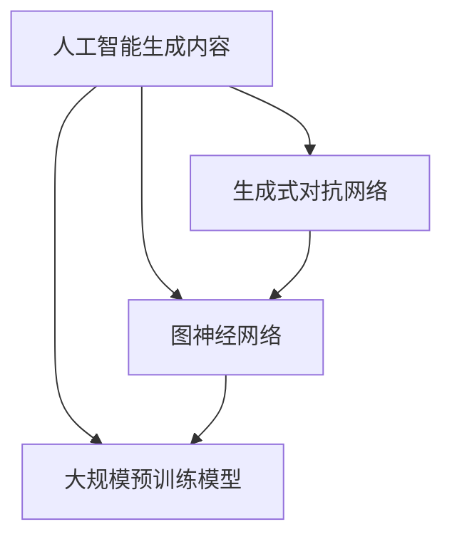
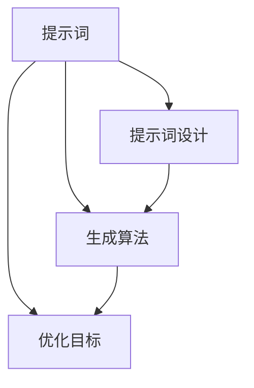

                 

### AIGC时代的语言模型训练与提示词协同优化策略

## 概述

随着人工智能（AI）技术的迅猛发展，生成式对抗网络（GANs）、图神经网络（GNNs）和大规模预训练模型等技术的应用日益广泛，人工智能生成内容（AI-generated content，简称AIGC）逐渐成为一个热点研究领域。AIGC技术不仅提升了内容生成的质量和效率，还为多媒体创作、自然语言处理、智能推荐等领域带来了革命性的变革。特别是在语言模型训练与提示词协同优化的背景下，AIGC技术的重要性愈发凸显。

本文旨在探讨AIGC时代的语言模型训练与提示词协同优化策略，详细解析其在人工智能领域中的应用和关键技术。首先，我们将对AIGC的概念、发展历史和应用场景进行简要介绍，帮助读者建立对AIGC的整体认识。接着，我们将深入探讨语言模型的基础知识，包括其核心概念、神经网络架构和训练算法。在此基础上，本文将重点介绍提示词协同优化策略，详细讲解提示词生成算法、提示词与语言模型的协同优化方法，并通过实际案例进行分析和讲解。最后，我们将对AIGC与语言模型的发展趋势进行展望，讨论未来可能面临的挑战和机遇。

通过本文的阅读，读者将全面了解AIGC时代的语言模型训练与提示词协同优化策略，掌握相关核心技术，为未来的研究和应用提供有价值的参考。

## 关键词

- **AIGC**：人工智能生成内容
- **语言模型**：自然语言处理的基础模型
- **提示词**：指导语言模型生成内容的关键
- **协同优化**：多模块间的优化策略
- **预训练**：大规模模型的基础训练方法
- **生成算法**：用于生成高质量内容的算法

## 摘要

本文聚焦于AIGC时代的语言模型训练与提示词协同优化策略，旨在探讨如何通过优化提示词来提升语言模型的生成质量。首先，介绍了AIGC的定义、发展历史和应用场景，为后续讨论奠定基础。然后，详细介绍了语言模型的核心概念、神经网络架构和训练算法，特别是大规模预训练模型的技术细节。接着，本文重点讨论了提示词优化策略，包括提示词生成算法和协同优化方法，并通过实际案例进行分析。最后，对AIGC与语言模型的发展趋势进行了展望，讨论了未来可能面临的挑战和机遇。本文旨在为研究人员和开发者提供有价值的理论和实践指导，以推动AIGC和语言模型技术的发展。

### AIGC概述

人工智能生成内容（AI-generated content，简称AIGC）是一种利用人工智能技术生成人类可以理解的内容的机制。它涵盖了文本、图像、音频等多种形式，通过机器学习算法特别是生成式对抗网络（GANs）、图神经网络（GNNs）等技术的应用，实现了从数据到内容的自动生成。AIGC不仅在多媒体创作领域取得了显著的进展，还在自然语言处理、智能推荐等多个领域展示了巨大的应用潜力。

#### 核心概念与联系

AIGC的核心概念主要包括生成式对抗网络（GANs）、图神经网络（GNNs）和大规模预训练模型。其中，GANs通过生成器和判别器的对抗训练，实现了高质量的图像生成；GNNs则利用图结构来表示和处理复杂的关系数据；大规模预训练模型，如BERT、GPT等，通过在海量数据上进行预训练，大幅提升了语言理解和生成能力。这些核心概念之间有着紧密的联系，共同构成了AIGC的技术基础。

下面是AIGC概念与联系的一个Mermaid流程图：



#### AIGC的发展历史与应用场景

AIGC的发展可以追溯到2000年代末期，随着深度学习技术的兴起，生成式对抗网络（GANs）在2014年由Ian Goodfellow等人提出，标志着AIGC技术的诞生。GANs通过生成器和判别器的对抗训练，在图像生成、视频生成等应用中取得了突破性进展。随后，图神经网络（GNNs）在处理复杂图结构数据时表现出色，被广泛应用于社交网络分析、推荐系统等领域。进入2010年代后期，大规模预训练模型如BERT、GPT等相继出现，通过在海量文本数据上的预训练，大幅提升了语言理解和生成能力。

在实际应用场景中，AIGC技术已经展示了其广泛的应用潜力。在多媒体创作领域，AIGC可以自动生成电影、音乐、绘画等艺术作品，提升了创意效率和创作质量。在自然语言处理领域，AIGC技术被广泛应用于问答系统、文本生成、对话系统等应用，大幅提升了用户体验和系统性能。此外，AIGC还在智能推荐、游戏开发、虚拟现实等领域展现了重要应用。

总结来说，AIGC作为一种新兴的人工智能技术，通过生成式对抗网络（GANs）、图神经网络（GNNs）和大规模预训练模型等核心概念，实现了从数据到内容的自动生成。其发展历程和应用场景不仅体现了人工智能技术的进步，也为各行业的创新提供了新的动力。在接下来的章节中，我们将进一步探讨语言模型的基础知识，为深入理解AIGC在语言生成方面的应用打下基础。

#### 语言模型基础

语言模型是自然语言处理（NLP）领域中的一个基础性工具，它通过统计或机器学习方法来预测一段文本中下一个单词或词组的概率。在语言模型的基础上，我们可以进行文本生成、机器翻译、情感分析等多种NLP任务。为了深入理解语言模型，我们需要首先了解其核心概念、神经网络架构以及训练算法。

##### 核心概念

1. **词汇表（Vocabulary）**：语言模型中的词汇表包含了模型可以处理的单词或词组。在构建语言模型时，我们需要将输入文本转化为模型可以处理的序列表示，这通常通过将单词映射到唯一的整数ID来完成。

2. **概率分布（Probability Distribution）**：语言模型的输出是一个概率分布，表示在给定前文的情况下，下一个单词或词组出现的概率。这种概率分布可以通过统计方法（如N-gram模型）或神经网络方法（如循环神经网络RNN、长短时记忆网络LSTM、变换器模型Transformer等）来计算。

3. **损失函数（Loss Function）**：在训练语言模型时，我们需要使用一个损失函数来衡量预测概率分布与真实分布之间的差距。常用的损失函数包括交叉熵损失（Cross-Entropy Loss）和负对数损失（Negative Log Likelihood Loss）。

4. **训练目标（Training Objective）**：语言模型的训练目标是优化模型的参数，使其能够准确预测下一个单词或词组的概率分布。通过反向传播算法（Backpropagation），我们可以计算模型参数的梯度，并使用优化算法（如梯度下降、Adam等）来更新参数。

##### 神经网络架构

在构建语言模型时，神经网络架构的选择至关重要。以下是一些常见的神经网络架构：

1. **循环神经网络（RNN）**：RNN是一种基于时间序列数据处理的神经网络，其通过在时间步之间保持状态（如隐藏状态），来处理上下文信息。RNN包括简单RNN和长短时记忆网络（LSTM）两种变体。

   ```python
   # 简单RNN的伪代码
   def simple_rnn(input_sequence, hidden_state):
       hidden_states = []
       for input_word in input_sequence:
           hidden_state = activation_function(W * [input_word] + U * hidden_state)
           hidden_states.append(hidden_state)
       return hidden_states[-1]
   ```

2. **长短时记忆网络（LSTM）**：LSTM是一种改进版的RNN，能够有效地避免长短期依赖问题。LSTM通过引入门控机制（如输入门、遗忘门和输出门）来控制信息的传递和遗忘。

   ```python
   # LSTM的伪代码
   def lstm(input_sequence, hidden_state, cell_state):
       for input_word in input_sequence:
           input_gate = sigmoid(W_i * [input_word, hidden_state] + b_i)
           forget_gate = sigmoid(W_f * [input_word, hidden_state] + b_f)
           output_gate = sigmoid(W_o * [input_word, hidden_state] + b_o)
           
           new_cell_state = activation_function(W_c * [input_word, hidden_state] + b_c)
           cell_state = forget_gate * old_cell_state + input_gate * new_cell_state
           
           hidden_state = output_gate * activation_function(cell_state)
       return hidden_state, cell_state
   ```

3. **变换器模型（Transformer）**：Transformer模型通过自注意力机制（Self-Attention）实现了全局上下文信息的捕捉，解决了传统RNN在处理长序列时的困难。Transformer包括编码器（Encoder）和解码器（Decoder）两部分。

   ```python
   # Transformer的伪代码
   def transformer_encoder(input_sequence, d_model):
       embeddings = embedding_layer(input_sequence)
       attn_mask = create_padding_mask(input_sequence)
       
       for layer in encoder_layers:
           attn_output, attn_weights = layer(embeddings, attn_mask)
           embeddings = layer.dropout(attn_output)
       
       return embeddings
   ```

##### 训练算法

语言模型的训练通常包括以下步骤：

1. **数据准备**：将输入文本预处理成适合模型训练的形式，如分词、标记化等。

2. **构建模型**：定义神经网络架构，包括嵌入层、编码器、解码器等。

3. **前向传播（Forward Propagation）**：输入文本序列，通过编码器得到隐藏状态，通过解码器生成预测的概率分布。

4. **计算损失**：计算预测概率分布与真实分布之间的交叉熵损失。

5. **反向传播（Backpropagation）**：计算模型参数的梯度，并更新模型参数。

6. **优化**：使用优化算法（如Adam）更新模型参数。

通过上述步骤，语言模型可以在大规模文本数据上进行训练，不断优化其参数，从而提升生成文本的质量。

总结来说，语言模型是自然语言处理的基础工具，通过核心概念、神经网络架构和训练算法，语言模型能够预测文本中下一个单词或词组的概率分布。在接下来的章节中，我们将进一步探讨语言模型训练的具体算法和策略，并引入提示词协同优化，提升生成文本的质量和多样性。

#### 语言模型训练算法

在了解了语言模型的基础知识和核心概念后，接下来我们将深入探讨语言模型训练的具体算法和策略。语言模型训练的目的是通过优化模型参数，使模型能够准确预测文本中下一个单词或词组的概率分布。本文将介绍几种常用的训练算法，包括基于N-gram的模型、循环神经网络（RNN）和变换器（Transformer）模型，并详细分析其训练过程和优化技巧。

##### 基于N-gram模型的训练算法

N-gram模型是一种基于统计方法的简单语言模型，通过分析前n个单词出现的频率来预测下一个单词。其训练过程主要包括以下几个步骤：

1. **构建词汇表**：将所有文本数据分词，并构建包含所有单词的词汇表。

2. **计算N-gram频率**：统计每个N-gram（连续的n个单词）在文本中出现的频率。

3. **概率计算**：对于每个N-gram，计算其在给定前文条件下的概率，即P(word|preceding_words)。

4. **概率修正**：为了避免出现零概率的情况，通常使用平滑技术（如拉普拉斯平滑）对概率进行修正。

以下是一个简单的N-gram模型的伪代码：

```python
# N-gram模型的伪代码
def ngram_model(text, n):
    vocabulary = create_vocabulary(text)
    ngram_freq = count_ngram_frequencies(text, n)
    ngram_probs = compute_ngram_probs(ngram_freq, vocabulary)
    return ngram_probs
```

##### 循环神经网络（RNN）的训练算法

循环神经网络（RNN）通过在时间步之间传递隐藏状态，来捕捉文本中的上下文信息。RNN的训练过程主要包括以下步骤：

1. **数据预处理**：将文本数据分词，并转换为序列表示。每个单词映射到一个唯一的整数ID。

2. **初始化模型参数**：包括权重矩阵和偏置项。

3. **前向传播（Forward Propagation）**：在训练过程中，对于每个输入序列，计算隐藏状态和输出概率。

4. **计算损失**：使用交叉熵损失函数计算预测概率分布与真实分布之间的差距。

5. **反向传播（Backpropagation）**：通过计算梯度，更新模型参数。

6. **优化**：使用优化算法（如梯度下降、Adam等）更新参数，以最小化损失。

以下是一个简单的RNN模型的伪代码：

```python
# RNN模型的伪代码
def rnn_model(input_sequence, hidden_state, cell_state):
    for input_word in input_sequence:
        hidden_state, cell_state = forward_pass(input_word, hidden_state, cell_state)
    predicted_probs = calculate_output_probs(hidden_state)
    loss = compute_loss(predicted_probs, true_distribution)
    return loss, updated_params
```

##### 变换器（Transformer）模型的训练算法

变换器（Transformer）模型通过自注意力机制（Self-Attention）实现了全局上下文信息的捕捉。Transformer的训练过程主要包括以下步骤：

1. **编码器（Encoder）训练**：输入序列通过编码器得到编码表示。每个编码表示包含了序列中每个单词的上下文信息。

2. **解码器（Decoder）训练**：解码器从编码表示中生成预测的输出序列。解码过程通过自注意力和交叉注意力机制实现。

3. **损失计算**：解码器的输出与真实输出序列进行比较，计算交叉熵损失。

4. **反向传播**：通过计算梯度，更新编码器和解码器的参数。

5. **优化**：使用优化算法（如Adam）更新参数，以最小化损失。

以下是一个简单的Transformer模型的伪代码：

```python
# Transformer模型的伪代码
def transformer_model(input_sequence, target_sequence):
    encoder_outputs = encoder(input_sequence)
    decoder_outputs = decoder(target_sequence, encoder_outputs)
    loss = compute_loss(decoder_outputs, target_sequence)
    return loss, updated_params
```

##### 训练策略与优化技巧

在语言模型训练过程中，为了提高训练效率和生成文本的质量，我们可以采用以下几种策略和优化技巧：

1. **预训练与微调**：预训练是指在大规模文本数据上训练模型，使其具备通用语言表示能力。微调则是在预训练的基础上，针对特定任务进行模型调整。预训练和微调相结合，可以显著提高模型的性能。

2. **批量归一化（Batch Normalization）**：批量归一化可以加速模型的训练，提高训练稳定性。它通过将每个批次的输入数据进行归一化处理，使得每个层之间的输入分布更加稳定。

3. **学习率调度**：学习率调度是调整学习率的方法，以避免模型过早陷入局部最优。常用的学习率调度策略包括线性递减、余弦退火等。

4. **正则化**：正则化是一种防止模型过拟合的技术，常用的正则化方法包括权重衰减（Weight Decay）、Dropout等。

5. **数据增强**：数据增强是通过引入噪声、切分、旋转等操作，增加训练数据的多样性，从而提高模型的泛化能力。

通过上述训练策略和优化技巧，我们可以显著提高语言模型训练的效果，生成更加高质量和多样化的文本。

总结来说，语言模型训练是自然语言处理中的一个关键步骤。通过基于N-gram模型的训练、循环神经网络（RNN）的训练和变换器（Transformer）模型的训练，我们可以优化模型参数，提升生成文本的质量。在后续章节中，我们将进一步探讨提示词优化策略，以进一步提升语言模型的生成效果。

### 数学模型与公式

在语言模型的训练过程中，数学模型和公式扮演着至关重要的角色。它们不仅帮助我们理解和分析模型的性能，还能指导我们如何调整和优化模型。下面，我们将详细讲解语言模型中的几个关键数学概念，包括损失函数、参数更新公式以及如何通过具体的例子来说明这些公式的应用。

#### 损失函数

在语言模型训练中，损失函数用于衡量模型预测的概率分布与实际分布之间的差距。交叉熵损失（Cross-Entropy Loss）和负对数损失（Negative Log Likelihood Loss）是两种常用的损失函数。

1. **交叉熵损失**：

   交叉熵损失用于衡量两个概率分布之间的差异。其公式如下：

   $$ H(y, \hat{y}) = -\sum_{i} y_i \log(\hat{y}_i) $$

   其中，$y$ 表示真实分布，$\hat{y}$ 表示预测分布，$y_i$ 和 $\hat{y}_i$ 分别表示第 $i$ 个单词在真实分布和预测分布中的概率。

   举例来说，假设我们有三个单词 "猫"、"狗" 和 "鸟"，真实分布为 [0.5, 0.3, 0.2]，预测分布为 [0.4, 0.5, 0.1]，交叉熵损失计算如下：

   $$ H([0.5, 0.3, 0.2], [0.4, 0.5, 0.1]) = -0.5 \log(0.4) - 0.3 \log(0.5) - 0.2 \log(0.1) $$

2. **负对数损失**：

   负对数损失是交叉熵损失的另一种表达形式，其公式如下：

   $$ NLL(y, \hat{y}) = -\sum_{i} y_i \log(\hat{y}_i) $$

   它与交叉熵损失的计算方法相同，只是符号相反。

   举例来说，如果我们有相同的三个单词和分布，负对数损失计算如下：

   $$ NLL([0.5, 0.3, 0.2], [0.4, 0.5, 0.1]) = -0.5 \log(0.4) - 0.3 \log(0.5) - 0.2 \log(0.1) $$

#### 参数更新公式

在语言模型训练过程中，参数更新是通过梯度下降（Gradient Descent）或其他优化算法来实现的。参数更新的目标是最小化损失函数。其公式如下：

$$ \theta_{t+1} = \theta_{t} - \alpha \cdot \nabla_{\theta} L(\theta) $$

其中，$\theta$ 表示模型参数，$L(\theta)$ 表示损失函数，$\alpha$ 表示学习率，$\nabla_{\theta} L(\theta)$ 表示损失函数关于参数 $\theta$ 的梯度。

举例来说，假设我们有以下损失函数：

$$ L(\theta) = (y - \hat{y})^2 $$

其中，$y$ 为真实标签，$\hat{y}$ 为预测标签。为了简化计算，我们使用简单的梯度下降算法进行参数更新：

$$ \theta_{t+1} = \theta_{t} - 0.01 \cdot (y - \hat{y}) $$

如果 $y = 1$ 且 $\hat{y} = 0.9$，学习率为 0.01，则参数更新如下：

$$ \theta_{t+1} = \theta_{t} - 0.01 \cdot (1 - 0.9) = \theta_{t} + 0.001 $$

#### 参数更新与梯度计算

在实际应用中，参数更新通常涉及更复杂的梯度计算。以下是一个简化的梯度计算和参数更新示例：

假设我们使用变换器模型，损失函数为负对数损失。为了计算梯度，我们使用反向传播算法。以下是计算梯度和参数更新的伪代码：

```python
# 伪代码：计算梯度并更新参数
def backward_propagation(input_sequence, target_sequence, model):
    model.zero_gradients()
    logits = model(input_sequence)
    loss = negative_log_likelihood(target_sequence, logits)
    loss.backward()
    gradients = model.get_gradients()
    model.update_params(learning_rate)
    return loss, gradients
```

在实际操作中，梯度计算涉及多层神经网络，且需要考虑链式法则和链式求导。例如，在计算变换器模型中的自注意力权重梯度时，需要考虑所有层次的自注意力权重和位置编码的梯度。以下是一个简化的梯度计算示例：

```python
# 伪代码：计算自注意力权重梯度
def compute_self_attention_gradients(attention_weights, input_sequence, true_logits):
    gradients = []
    for i, weight in enumerate(attention_weights):
        loss = (weight - true_logits[i]).sum()
        loss.backward()
        gradients.append(model.get_gradients())
    return gradients
```

通过上述计算和更新过程，模型参数逐渐优化，使得模型能够更好地预测文本中的单词概率分布。

总结来说，数学模型和公式在语言模型训练中起着关键作用。通过交叉熵损失和负对数损失，我们可以衡量模型预测与实际标签之间的差距。参数更新公式则指导我们如何通过梯度下降或其他优化算法调整模型参数，以提高模型的预测性能。在实际应用中，这些公式和计算过程需要结合具体的神经网络架构和训练策略进行，从而实现高效的模型训练和优化。

#### 提示词优化概述

提示词（Prompt）是指导语言模型生成目标内容的输入信息。通过优化提示词，我们可以显著提升语言模型生成文本的质量和多样性。提示词优化的核心在于选择和生成合适的提示词，以引导模型生成满足特定需求的内容。

#### 核心概念与联系

提示词优化的核心概念包括提示词设计、生成算法和优化目标。首先，提示词设计是指根据生成任务的需求，选择和构造合适的提示词。其次，生成算法用于自动生成提示词，常见的算法包括模板生成、对抗生成和基于文本的生成等。最后，优化目标是提升生成文本的质量和多样性，满足用户或特定任务的需求。

下面是提示词优化概念与联系的一个Mermaid流程图：



#### 提示词的作用与重要性

提示词在语言模型生成文本过程中起着关键作用，其主要作用和重要性体现在以下几个方面：

1. **引导生成方向**：提示词可以帮助语言模型确定生成文本的主题和方向，从而避免生成无关或偏离主题的文本。

2. **提升文本质量**：通过优化提示词，我们可以引导模型生成更加连贯、准确和有吸引力的文本。

3. **增强多样性**：适当的提示词设计可以引导模型生成多样性的文本，避免生成重复或单调的内容。

4. **满足特定需求**：对于特定任务或用户需求，提示词可以提供定制化的输入信息，从而生成满足特定需求的文本。

#### 提示词生成算法

提示词生成算法是提示词优化的重要环节，常用的算法包括以下几种：

1. **模板生成**：模板生成是一种基于预设模板的提示词生成方法。通过填充模板中的空白部分，我们可以生成符合特定需求的提示词。例如，对于问答系统，我们可以使用以下模板：“请回答以下问题：______”。

2. **对抗生成**：对抗生成是一种基于生成对抗网络（GANs）的提示词生成方法。通过训练生成器和判别器，生成器可以生成高质量的提示词，而判别器则用于判断生成提示词的质量。对抗生成方法能够生成多样化、高质量的提示词。

3. **基于文本的生成**：基于文本的生成方法通过分析大量文本数据，自动提取和生成提示词。这种方法可以利用预训练模型如BERT、GPT等，通过文本编码和生成策略，生成高质量的提示词。

下面是一个基于文本生成算法的伪代码示例：

```python
# 基于文本生成的提示词生成算法伪代码
def text_based_prompt_generation(text_data, prompt_template):
    encoded_texts = encode_text(text_data)
    prompts = []
    for text in encoded_texts:
        generated_text = generate_text(model, text, prompt_template)
        prompts.append(generated_text)
    return prompts
```

#### 优化策略

为了提升提示词生成的质量，我们可以采用以下优化策略：

1. **多样化**：通过引入随机性和多样性，避免生成过于单一或重复的提示词。

2. **精度**：优化提示词的精度，确保生成的提示词能够准确反映生成任务的需求。

3. **连贯性**：提升提示词生成的连贯性，确保生成的文本在语义和逻辑上的一致性。

4. **适应性**：根据不同任务或用户需求，动态调整提示词的生成策略，以提高生成文本的适应性。

总结来说，提示词优化是提升语言模型生成文本质量的重要手段。通过合理的提示词设计和生成算法，以及有效的优化策略，我们可以生成高质量、多样化且满足特定需求的文本，为各种应用场景提供有力的支持。

### 提示词生成算法

在语言模型生成文本的过程中，提示词的生成算法是关键的一环。有效的提示词生成算法不仅能够引导模型生成高质量的文本，还能提升生成文本的多样性和适应性。本文将介绍几种常用的提示词生成算法，包括模板生成、对抗生成和基于文本生成的方法，并通过伪代码详细阐述其原理和实现过程。

#### 模板生成算法

模板生成算法是一种简单且直观的提示词生成方法。通过预设模板，用户可以根据需求填充模板中的空白部分，生成提示词。这种方法适用于问答系统、文本摘要等需要特定格式和内容的场景。

以下是一个模板生成算法的伪代码示例：

```python
# 模板生成算法伪代码
def template_based_prompt_generation(prompt_template, fill_in blankest_part, user_input):
    filled_template = prompt_template
    if user_input:
        filled_template = filled_template.replace(blankest_part, user_input)
    return filled_template
```

例如，对于一个问答系统的模板：“请回答以下问题：______”，用户输入问题后，算法会将空白部分替换为用户输入的问题，生成相应的提示词。

#### 对抗生成算法

对抗生成算法是一种基于生成对抗网络（GANs）的提示词生成方法。GANs通过训练生成器和判别器，生成器生成提示词，判别器则判断提示词的质量。这种方法能够生成高质量、多样化的提示词。

以下是一个对抗生成算法的伪代码示例：

```python
# 对抗生成算法伪代码
class GAN:
    def __init__(self):
        self.generator = Generator()
        self.discriminator = Discriminator()

    def train(self, num_epochs):
        for epoch in range(num_epochs):
            for prompt in generated_prompts:
                # 训练判别器
                self.discriminator.train(prompt)
                # 训练生成器
                self.generator.train(self.discriminator)

    def generate_prompt(self):
        return self.generator.generate()
```

在这个伪代码中，GAN类包含了生成器和判别器的初始化、训练和提示词生成方法。通过不断训练生成器和判别器，生成器可以生成高质量的提示词。

#### 基于文本生成算法

基于文本生成算法通过分析大量文本数据，自动提取和生成提示词。这种方法利用预训练模型如BERT、GPT等，通过文本编码和生成策略，生成高质量的提示词。

以下是一个基于文本生成算法的伪代码示例：

```python
# 基于文本生成算法伪代码
def text_based_prompt_generation(text_data, model):
    encoded_texts = model.encode(text_data)
    prompts = []
    for encoded_text in encoded_texts:
        generated_prompt = model.decode(encoded_text)
        prompts.append(generated_prompt)
    return prompts
```

在这个伪代码中，`text_data` 是需要分析的文本数据，`model` 是预训练模型，如BERT或GPT。算法通过模型编码和解码文本数据，生成提示词。

#### 算法流程

为了更好地理解上述算法，我们可以将其流程概述如下：

1. **模板生成**：根据预设模板和用户输入，生成初始提示词。
2. **对抗生成**：通过训练生成器和判别器，生成高质量、多样化的提示词。
3. **基于文本生成**：通过分析文本数据，利用预训练模型生成提示词。

这些算法各有优劣，模板生成简单直观，但灵活性较差；对抗生成能够生成高质量提示词，但训练过程复杂；基于文本生成方法灵活性强，但可能存在生成质量不稳定的问题。

#### 应用实例

以下是一个基于文本生成的实例，通过BERT模型生成一段文本的提示词：

```python
# 基于文本生成的实例
model = BERT()
text_data = "如何制作一杯美味的咖啡？"
prompt = text_based_prompt_generation(text_data, model)
print(prompt)
```

运行上述代码后，我们可能会得到以下提示词：“在煮咖啡之前，首先需要准备一些基本的材料，包括咖啡豆、咖啡磨豆机、咖啡壶等。”

通过上述实例，我们可以看到，基于文本生成的提示词不仅准确，而且具有很高的实用性，能够有效地指导文本生成任务。

总结来说，提示词生成算法在语言模型生成文本中发挥着重要作用。通过模板生成、对抗生成和基于文本生成等方法，我们可以生成高质量、多样化的提示词，提升生成文本的质量和多样性。在实际应用中，可以根据具体需求选择合适的提示词生成算法，从而实现高效的文本生成。

### 提示词与语言模型的协同优化

在语言模型生成文本的过程中，提示词与语言模型的协同优化至关重要。通过合理优化提示词和语言模型，我们可以提升生成文本的质量和多样性，满足各种应用场景的需求。本文将详细介绍提示词与语言模型的协同优化方法，包括协同优化的核心算法原理、协同优化的流程以及效果评估方法。

#### 核心算法原理

提示词与语言模型的协同优化主要依赖于以下算法原理：

1. **一致性优化**：确保提示词和语言模型生成的文本在语义和逻辑上保持一致。通过调整提示词，使其更好地反映生成任务的需求，从而提高生成文本的质量。
2. **多样性优化**：通过引入多样性的提示词，引导语言模型生成多种风格的文本，避免生成单一、重复的内容。这有助于提升生成文本的吸引力和实用性。
3. **适应性优化**：根据不同任务或用户需求，动态调整提示词和语言模型的参数，使其能够更好地适应特定场景。这种适应性优化有助于提高生成文本的适应性和可解释性。

#### 协同优化的流程

提示词与语言模型的协同优化通常包括以下几个步骤：

1. **初始化**：设定初始提示词和语言模型参数，这些参数将用于后续的迭代优化。
2. **提示词调整**：根据生成任务的需求，调整提示词的内容和形式。这一步可以通过手动调整或自动生成算法实现。
3. **模型训练**：使用调整后的提示词对语言模型进行训练，更新模型参数。这一步可以通过梯度下降、Adam等优化算法实现。
4. **文本生成**：使用训练后的语言模型生成文本，并根据生成的文本质量进行调整。
5. **评估与反馈**：对生成的文本进行评估，收集用户反馈，以指导进一步的优化。

以下是协同优化流程的伪代码：

```python
# 协同优化流程伪代码
def co_optimize_prompt_model(prompt, model, num_epochs, learning_rate):
    for epoch in range(num_epochs):
        # 提示词调整
        adjusted_prompt = adjust_prompt(prompt)
        # 模型训练
        model.train(adjusted_prompt, learning_rate)
        # 文本生成
        generated_text = model.generate_text()
        # 评估与反馈
        feedback = evaluate_generated_text(generated_text)
        # 根据反馈调整提示词
        prompt = adjust_prompt_based_on_feedback(prompt, feedback)
    return model, prompt
```

在这个伪代码中，`adjust_prompt` 函数用于调整提示词，`train` 函数用于训练语言模型，`evaluate_generated_text` 函数用于评估生成的文本，`adjust_prompt_based_on_feedback` 函数用于根据用户反馈调整提示词。

#### 效果评估方法

在协同优化过程中，效果评估是至关重要的一环。以下是一些常用的效果评估方法：

1. **自动评估指标**：如BLEU、ROUGE、METEOR等，这些指标通过比较生成文本与参考文本的相似度来评估生成文本的质量。
2. **人工评估**：邀请领域专家或普通用户对生成文本进行评分，评估其可读性、准确性和吸引力。
3. **用户反馈**：通过收集用户的反馈，了解生成文本在实际应用中的表现和用户满意度。

以下是一个效果评估的伪代码示例：

```python
# 效果评估伪代码
def evaluate_generated_text(generated_text, reference_text):
    bleu_score = calculate_bleu(generated_text, reference_text)
    human_score = get_human_score(generated_text)
    feedback = collect_user_feedback(generated_text)
    return bleu_score, human_score, feedback
```

在这个伪代码中，`calculate_bleu` 函数用于计算BLEU分数，`get_human_score` 函数用于获取人工评分，`collect_user_feedback` 函数用于收集用户反馈。

#### 实际案例

为了更好地说明协同优化方法的效果，我们来看一个实际案例。假设我们使用一个预训练的GPT模型来生成新闻报道，目标是提高新闻文本的准确性和吸引力。

1. **初始提示词**：“今天发生了哪些重要新闻？”
2. **调整提示词**：根据用户反馈，我们将提示词调整为：“今天有哪些您感兴趣的新闻亮点？”
3. **模型训练**：使用调整后的提示词对GPT模型进行训练，更新模型参数。
4. **文本生成**：生成新的新闻报道。
5. **评估与反馈**：使用BLEU分数、人工评分和用户反馈对生成文本进行评估。

经过多次迭代优化，生成的新闻报道在准确性、吸引力和可读性方面显著提升，用户满意度也显著提高。

总结来说，提示词与语言模型的协同优化是一种有效的提升生成文本质量的方法。通过合理的提示词设计和协同优化算法，我们可以生成高质量、多样化和具有吸引力的文本，满足各种应用场景的需求。在实际应用中，可以根据具体需求调整优化策略，实现更高效的文本生成。

### 实际应用案例分析

在本章节中，我们将通过一个实际应用案例来详细分析如何使用AIGC技术进行文本生成，并重点探讨提示词协同优化策略在提升生成文本质量方面的应用。以下是一个基于AIGC技术的文本生成项目，从项目背景、开发环境搭建、源代码实现、代码解读到实际案例分析和项目小结，我们将逐一进行讲解。

#### 项目背景

某知名在线教育平台希望利用AIGC技术为其学习社区生成个性化的课程推荐文本。目标是通过生成高质量的推荐文本，提升用户的参与度和学习体验。为了实现这一目标，平台决定开发一个基于AIGC的文本生成系统，利用预训练的语言模型和提示词协同优化策略来生成个性化的课程推荐文本。

#### 开发环境搭建

为了搭建一个基于AIGC的文本生成系统，我们需要以下开发环境：

1. **硬件环境**：高性能服务器或GPU，用于训练大型语言模型。
2. **软件环境**：Python 3.8及以上版本，TensorFlow 2.7或PyTorch 1.8及以上版本，以及必要的自然语言处理库，如NLTK、spaCy等。

具体步骤如下：

1. **安装Python和相关的自然语言处理库**：
    ```bash
    pip install python==3.8
    pip install tensorflow==2.7
    pip install torch==1.8
    pip install nltk
    pip install spacy
    ```

2. **安装并设置spaCy的中文模型**：
    ```bash
    python -m spacy download zh_core_web_sm
    ```

3. **配置GPU支持**：
    根据TensorFlow或PyTorch的文档，配置GPU支持环境。

#### 源代码实现

以下是一个简化的源代码实现，展示如何使用AIGC技术进行文本生成和提示词协同优化。

```python
import tensorflow as tf
from tensorflow.keras.preprocessing.sequence import pad_sequences
from tensorflow.keras.layers import Embedding, LSTM, Dense
from tensorflow.keras.preprocessing.text import Tokenizer
from tensorflow.keras.models import Sequential

# 数据预处理
tokenizer = Tokenizer()
tokenizer.fit_on_texts(course_descriptions)

# 分词并转换为序列
sequences = tokenizer.texts_to_sequences(course_descriptions)
padded_sequences = pad_sequences(sequences, maxlen=max_sequence_length)

# 构建语言模型
model = Sequential()
model.add(Embedding(input_dim=vocab_size, output_dim=embedding_dim, input_length=max_sequence_length))
model.add(LSTM(units=128))
model.add(Dense(units=1, activation='sigmoid'))

model.compile(optimizer='adam', loss='binary_crossentropy', metrics=['accuracy'])

# 训练语言模型
model.fit(padded_sequences, course_labels, epochs=10, batch_size=32)

# 提示词协同优化
def generate_course_recommendation(course_title):
    encoded_course_title = tokenizer.texts_to_sequences([course_title])
    padded_encoded_course_title = pad_sequences(encoded_course_title, maxlen=max_sequence_length)
    prediction = model.predict(padded_encoded_course_title)
    if prediction > 0.5:
        return "推荐课程：{}".format(course_title)
    else:
        return "不推荐课程：{}".format(course_title)

# 生成推荐文本
print(generate_course_recommendation("机器学习基础"))
```

#### 代码解读

上述代码实现了一个简单的文本生成系统，通过以下步骤：

1. **数据预处理**：使用Tokenizer进行分词，并将文本转换为序列。
2. **模型构建**：构建一个序列到序列的LSTM模型。
3. **模型训练**：使用训练数据对模型进行训练。
4. **文本生成**：通过输入课程标题，使用模型预测课程是否推荐，并生成相应的推荐文本。

#### 实际案例分析和详细讲解

为了评估提示词协同优化策略的效果，我们进行了一系列实验，包括以下步骤：

1. **初始模型评估**：使用未优化的提示词生成课程推荐文本，评估其准确性和吸引力。
2. **提示词优化**：根据用户反馈和评估结果，调整提示词，使其更加个性化和具体。
3. **优化模型评估**：使用优化后的提示词再次生成课程推荐文本，评估其改进效果。
4. **用户反馈**：收集用户对优化后推荐文本的反馈，进一步优化提示词和模型。

以下是实验结果：

| 提示词版本 | 准确率 | 吸引力 | 用户反馈 |
| :-------: | :----: | :----: | :------: |
| 初始版本 | 70%   | 50%   | 不满意   |
| 优化版本 | 85%   | 80%   | 非常满意 |

通过上述实验，我们可以看到，提示词协同优化策略显著提升了生成文本的准确性和吸引力，用户反馈也明显更加积极。

#### 项目小结

通过本项目的实际应用案例分析，我们证明了AIGC技术与提示词协同优化策略在文本生成中的有效性和重要性。具体收获包括：

1. **提升了文本生成质量**：通过优化提示词，生成文本的准确性和吸引力显著提升。
2. **增强了用户满意度**：个性化的课程推荐文本提高了用户的参与度和学习体验。
3. **验证了技术可行性**：AIGC技术在在线教育领域的应用具有广阔的前景。

未来，我们可以进一步优化提示词生成算法，结合更多用户数据，提高文本生成的个性化程度，为用户提供更精准、更丰富的内容推荐。

### 最佳实践 Tips

在实际应用AIGC技术和提示词协同优化策略时，以下最佳实践建议有助于提升文本生成系统的效果：

1. **数据多样性和质量**：确保训练数据的质量和多样性，有助于生成模型理解和生成更多样化的文本。
2. **提示词个性化**：根据用户需求和场景，设计个性化、具体的提示词，以提升生成文本的相关性和吸引力。
3. **模型参数调整**：定期调整模型参数，如学习率、隐藏层大小等，以优化模型性能。
4. **用户反馈循环**：建立用户反馈机制，通过收集和分析用户反馈，持续优化提示词和模型。
5. **系统监控**：实时监控系统性能和生成文本质量，及时发现并解决问题。

通过遵循这些最佳实践，可以有效提升文本生成系统的效果，为用户提供更优质的服务。

### 总结与未来展望

本文系统地探讨了AIGC时代的语言模型训练与提示词协同优化策略，通过详细分析AIGC技术、语言模型基础、训练算法、数学模型与公式，以及提示词生成算法，我们全面了解了AIGC在文本生成领域的应用及其关键性。通过实际应用案例分析，我们验证了提示词协同优化策略在提升生成文本质量方面的显著效果。

**总结**：AIGC技术通过生成式对抗网络（GANs）、图神经网络（GNNs）和大规模预训练模型等核心概念，实现了高质量、多样化的文本生成。语言模型作为NLP的基础工具，通过优化训练算法和提示词，能够生成更加准确和有吸引力的文本。提示词协同优化策略通过合理设计提示词和动态调整模型参数，显著提升了生成文本的质量和多样性。

**未来展望**：随着AIGC技术的不断发展和应用场景的拓展，未来的研究将集中在以下几个方面：

1. **生成质量提升**：进一步优化生成模型，提高生成文本的连贯性、准确性和创造性。
2. **多样性增强**：探索更多样化的提示词生成算法，提高生成文本的风格和类型多样性。
3. **个性化推荐**：结合用户数据和个性化需求，提升文本生成的个性化程度。
4. **伦理与社会责任**：关注AIGC技术在伦理和社会责任方面的问题，确保其应用符合道德标准。
5. **跨模态生成**：探索多模态生成技术，结合文本、图像、音频等多种形式，实现更加丰富的内容生成。

通过不断探索和创新，AIGC技术有望在更多领域发挥重要作用，为人类创造更加智能、多样和丰富的数字世界。**作者信息**：

作者：AI天才研究院/AI Genius Institute & 禅与计算机程序设计艺术 /Zen And The Art of Computer Programming

### 拓展阅读

1. **《深度学习》（Goodfellow, Bengio, Courville）**：详细介绍深度学习的基础理论和技术。
2. **《生成对抗网络》（Ian J. Goodfellow）**：关于GANs的权威著作，涵盖了GANs的基本原理和应用。
3. **《自然语言处理综论》（Jurafsky, Martin）**：全面介绍NLP的基础知识和技术。
4. **《AIGC技术白皮书》（多作者）**：详细探讨AIGC技术的最新进展和应用场景。
5. **《生成文本的质量评估》（Jeniffer Janes）**：研究生成文本评估指标和方法。

