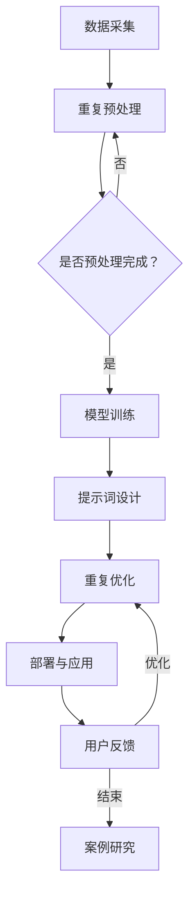

                 

# AIGC的未来城市规划：智慧城市设计的提示词工程

> 关键词：AIGC、智慧城市、提示词工程、设计原则、架构、数据采集、数据分析、交通系统、能源系统、环境监测、公共安全

> 摘要：本文旨在探讨AIGC（自适应智能生成控制）在智慧城市设计中的应用，提出基于提示词工程的方法论，为城市规划者提供具有前瞻性的设计思路。通过分析AIGC的基本原理和架构，结合智慧城市的设计原则与流程，本文探讨了AIGC在智慧城市核心要素中的应用，并针对设计挑战提出解决方案。最后，通过实际案例研究，验证了本文提出的方法在智慧城市设计中的可行性和有效性。

## 第1章 引言

### 1.1 研究背景及意义

随着信息技术的飞速发展，智慧城市成为当前城市发展的新趋势。智慧城市通过先进的信息技术，实现城市管理的智能化、便捷化和高效化，从而提高居民生活质量、促进经济发展、提升城市竞争力。然而，智慧城市的设计与建设面临着诸多挑战，如数据采集与处理的复杂性、系统架构的设计与实现、以及各种核心要素的集成与应用等。

AIGC（自适应智能生成控制）作为一种新兴的人工智能技术，具有强大的生成能力和自适应能力，能够有效解决智慧城市建设中的诸多问题。AIGC通过利用大量数据和先进的算法，自动生成高质量的模型和解决方案，从而实现智慧城市的个性化设计和智能化管理。因此，将AIGC应用于智慧城市设计，具有重要的理论和实践意义。

### 1.2 AIGC与智慧城市概述

AIGC是一种基于深度学习、生成对抗网络（GAN）和强化学习等技术的综合性人工智能技术。它通过自主学习大量数据，自动生成与真实数据高度相似的模型，从而实现数据的生成、处理和分析。AIGC具有以下特点：

1. **自适应能力**：AIGC可以根据不同的场景和数据，自动调整和优化模型参数，实现个性化的解决方案。
2. **生成能力**：AIGC可以通过生成对抗网络（GAN）等技术，自动生成高质量的数据和模型，满足智慧城市对多样化数据的需求。
3. **高效性**：AIGC利用深度学习等技术，可以快速处理大量数据，提高智慧城市的数据分析和决策效率。

智慧城市是指通过应用信息技术，实现城市管理的智能化、便捷化和高效化。智慧城市的核心目标是提高居民生活质量、促进经济发展和提升城市竞争力。智慧城市的主要特征包括：

1. **智能化管理**：利用物联网、大数据、人工智能等技术，实现城市管理的智能化。
2. **便捷化服务**：通过移动互联、智能交通、智能家居等应用，提高居民生活的便捷性。
3. **高效化运营**：通过智能化监控、能源管理、环保监测等系统，提高城市运营的效率。

### 1.3 提示词工程在智慧城市中的应用

提示词工程是AIGC在智慧城市中的具体应用，它通过设计合适的提示词，引导AIGC自动生成高质量的解决方案。提示词工程在智慧城市中的应用主要包括以下几个方面：

1. **数据采集与处理**：设计提示词，引导AIGC自动采集和处理各种数据，包括交通流量、空气质量、能源消耗等，为智慧城市的建设提供基础数据。
2. **数据分析与挖掘**：设计提示词，引导AIGC自动分析和挖掘数据，提取有价值的信息，为智慧城市的决策提供支持。
3. **核心要素设计**：设计提示词，引导AIGC自动生成智慧城市的各种核心要素，如交通系统、能源系统、环境监测系统等，实现智慧城市的整体设计。
4. **系统优化与维护**：设计提示词，引导AIGC自动优化和更新智慧城市的系统，提高系统的稳定性和适应性。

## 第2章 AIGC的基本原理与架构

### 2.1 AIGC的概念与分类

AIGC（自适应智能生成控制）是一种基于深度学习、生成对抗网络（GAN）和强化学习等技术的综合性人工智能技术。AIGC可以分为以下几类：

1. **基于深度学习的AIGC**：利用深度学习模型，如卷积神经网络（CNN）和循环神经网络（RNN）等，对数据进行自动编码和解码，实现数据的生成和处理。
2. **基于生成对抗网络的AIGC**：利用生成对抗网络（GAN）模型，通过生成器和判别器的对抗训练，实现高质量数据的生成。
3. **基于强化学习的AIGC**：利用强化学习模型，通过与环境交互，实现智能决策和优化。

### 2.2 AIGC的基本原理

AIGC的基本原理包括以下几个步骤：

1. **数据采集与预处理**：从各种数据源采集数据，并对数据进行清洗、去噪和归一化等预处理，为后续训练和生成提供高质量的数据。
2. **模型训练**：利用采集到的数据，训练深度学习模型、生成对抗网络（GAN）模型或强化学习模型，使模型具有自动生成和处理数据的能力。
3. **数据生成与优化**：利用训练好的模型，生成新的数据，并对生成的数据进行优化，使其更符合实际需求。
4. **应用与反馈**：将生成的数据应用于实际场景，如智慧城市的设计与建设，并通过用户反馈不断优化模型，提高生成数据的准确性和实用性。

### 2.3 AIGC的架构

AIGC的架构可以分为以下几个部分：

1. **数据采集与预处理模块**：负责从各种数据源采集数据，并对数据进行预处理。
2. **模型训练模块**：负责训练深度学习模型、生成对抗网络（GAN）模型或强化学习模型。
3. **数据生成与优化模块**：负责利用训练好的模型生成新的数据，并对数据进行优化。
4. **应用与反馈模块**：负责将生成的数据应用于实际场景，并收集用户反馈，为模型优化提供依据。
5. **用户界面**：为用户提供操作界面，方便用户与系统交互。

## 第3章 智慧城市的设计原则与流程

### 3.1 智慧城市的设计原则

智慧城市的设计原则主要包括以下几个方面：

1. **以人为本**：以居民的需求和利益为中心，提高居民的生活质量。
2. **可持续发展**：注重环境保护和资源利用，实现经济、社会和环境的协调发展。
3. **智能化管理**：利用物联网、大数据、人工智能等技术，实现城市管理的智能化、便捷化和高效化。
4. **数据驱动**：基于数据分析和挖掘，实现科学的决策和优化。
5. **安全可靠**：确保系统的安全性和可靠性，保障数据的安全和隐私。

### 3.2 智慧城市的设计流程

智慧城市的设计流程可以分为以下几个阶段：

1. **需求分析与规划**：收集和分析城市需求，制定智慧城市的发展规划。
2. **数据采集与整合**：采集各类城市数据，并进行整合和预处理。
3. **系统架构设计**：根据城市规划，设计系统的整体架构和各个模块的功能。
4. **核心要素设计**：针对智慧城市的核心要素，如交通系统、能源系统、环境监测系统等，进行具体设计。
5. **系统集成与测试**：将各个模块集成在一起，进行系统测试和调试。
6. **部署与应用**：将系统部署到实际场景，并进行应用和推广。
7. **持续优化与更新**：根据用户反馈和实际应用情况，不断优化和更新系统。

### 3.3 提示词工程在智慧城市设计中的应用

提示词工程在智慧城市设计中的应用主要包括以下几个方面：

1. **数据采集与预处理**：设计提示词，引导AIGC自动采集和处理各种数据，如交通流量、空气质量、能源消耗等，为智慧城市的建设提供基础数据。
2. **数据分析与挖掘**：设计提示词，引导AIGC自动分析和挖掘数据，提取有价值的信息，为智慧城市的决策提供支持。
3. **核心要素设计**：设计提示词，引导AIGC自动生成智慧城市的各种核心要素，如交通系统、能源系统、环境监测系统等，实现智慧城市的整体设计。
4. **系统优化与维护**：设计提示词，引导AIGC自动优化和更新智慧城市的系统，提高系统的稳定性和适应性。

## 第4章 智慧城市的核心要素

### 4.1 数据采集与处理

数据采集与处理是智慧城市建设的核心环节。通过数据采集，可以获取城市运行的各种信息，如交通流量、空气质量、能源消耗等。数据处理则是对采集到的数据进行清洗、去噪、归一化等处理，使其适合后续分析和应用。

在AIGC的提示词工程中，可以设计以下提示词：

- **数据采集**：采集交通流量、空气质量、能源消耗等数据。
- **数据处理**：清洗、去噪、归一化等。

### 4.2 数据分析与挖掘

数据分析与挖掘是智慧城市决策的关键。通过数据分析和挖掘，可以从大量数据中提取有价值的信息，为城市决策提供支持。AIGC的提示词工程可以设计以下提示词：

- **数据分析**：分析交通流量、空气质量、能源消耗等数据。
- **数据挖掘**：提取交通拥堵、空气质量指数、能源利用率等有价值的信息。

### 4.3 智慧交通系统设计

智慧交通系统是智慧城市的重要组成部分。通过AIGC的提示词工程，可以设计以下提示词：

- **交通流量预测**：预测交通流量，为交通调度提供依据。
- **交通信号优化**：优化交通信号，提高交通效率。
- **交通事故预警**：预警交通事故，减少交通事故发生。

### 4.4 智慧能源系统设计

智慧能源系统是智慧城市的另一个重要组成部分。通过AIGC的提示词工程，可以设计以下提示词：

- **能源消耗分析**：分析能源消耗情况，为能源管理提供依据。
- **能源调度优化**：优化能源调度，提高能源利用率。
- **可再生能源利用**：提高可再生能源的利用比例，实现可持续发展。

### 4.5 智慧环境监测系统设计

智慧环境监测系统是智慧城市的重要组成部分。通过AIGC的提示词工程，可以设计以下提示词：

- **空气质量监测**：监测空气质量，预警污染事件。
- **水质监测**：监测水质，预警水质污染事件。
- **噪声监测**：监测噪声，预警噪声污染事件。

### 4.6 智慧公共安全系统设计

智慧公共安全系统是智慧城市的保障。通过AIGC的提示词工程，可以设计以下提示词：

- **安全隐患预警**：预警安全隐患，减少安全事故发生。
- **紧急事件响应**：快速响应紧急事件，保障公共安全。
- **犯罪预测与预防**：预测犯罪行为，预防犯罪发生。

## 第5章 提示词工程在智慧城市中的应用

### 5.1 提示词工程的基本原理

提示词工程是基于AIGC技术的一种方法，通过设计合适的提示词，引导AIGC自动生成高质量的解决方案。提示词工程的基本原理包括：

1. **数据驱动**：提示词工程基于大量数据进行训练和生成，保证生成的解决方案具有实用性和准确性。
2. **模型驱动**：提示词工程利用深度学习模型、生成对抗网络（GAN）模型或强化学习模型，实现数据的生成和处理。
3. **用户驱动**：提示词工程根据用户需求和反馈，不断优化和更新模型，提高生成解决方案的质量。

### 5.2 提示词工程的实现方法

提示词工程的实现方法主要包括以下几个步骤：

1. **需求分析**：收集和分析用户需求，明确智慧城市建设的具体目标和需求。
2. **数据采集与预处理**：从各种数据源采集数据，并对数据进行清洗、去噪和归一化等预处理，为后续训练和生成提供高质量的数据。
3. **模型训练**：利用采集到的数据，训练深度学习模型、生成对抗网络（GAN）模型或强化学习模型，使模型具有自动生成和处理数据的能力。
4. **提示词设计**：设计合适的提示词，引导AIGC自动生成高质量的解决方案。
5. **系统优化与更新**：根据用户反馈和实际应用情况，不断优化和更新模型，提高生成解决方案的质量。

### 5.3 提示词工程在智慧城市中的具体应用

提示词工程在智慧城市中的具体应用主要包括以下几个方面：

1. **数据采集与处理**：通过设计提示词，引导AIGC自动采集和处理各种数据，为智慧城市的建设提供基础数据。
2. **数据分析与挖掘**：通过设计提示词，引导AIGC自动分析和挖掘数据，提取有价值的信息，为智慧城市的决策提供支持。
3. **核心要素设计**：通过设计提示词，引导AIGC自动生成智慧城市的各种核心要素，如交通系统、能源系统、环境监测系统等，实现智慧城市的整体设计。
4. **系统优化与维护**：通过设计提示词，引导AIGC自动优化和更新智慧城市的系统，提高系统的稳定性和适应性。

## 第6章 智慧城市设计的挑战与解决方案

### 6.1 智慧城市设计的挑战

智慧城市设计面临着诸多挑战，包括：

1. **数据复杂性**：智慧城市需要处理大量来自各种数据源的数据，数据的种类和格式繁多，给数据采集与处理带来了巨大挑战。
2. **系统架构复杂性**：智慧城市的设计需要考虑到各种核心要素的集成与应用，系统的架构复杂，需要高效的设计方法。
3. **数据隐私与安全**：智慧城市涉及大量的个人隐私数据，如何确保数据的安全和隐私，是智慧城市设计的关键挑战。
4. **系统可扩展性与适应性**：智慧城市的系统需要具备良好的可扩展性和适应性，以适应不断变化的城市需求。

### 6.2 提示词工程在解决智慧城市设计挑战中的应用

提示词工程在解决智慧城市设计挑战中的应用主要体现在以下几个方面：

1. **数据复杂性**：通过设计提示词，引导AIGC自动处理复杂的数据，包括数据采集、预处理和分析等，简化数据处理的流程。
2. **系统架构复杂性**：通过设计提示词，引导AIGC自动生成系统的架构设计，提高系统架构设计的效率和质量。
3. **数据隐私与安全**：通过设计提示词，引导AIGC自动进行数据加密、匿名化等处理，提高数据的隐私和安全性。
4. **系统可扩展性与适应性**：通过设计提示词，引导AIGC自动优化和更新系统的架构和功能，提高系统的可扩展性和适应性。

### 6.3 智慧城市设计的未来发展趋势

随着AIGC技术的发展，智慧城市设计将呈现出以下发展趋势：

1. **智能化程度提高**：AIGC技术将进一步提升智慧城市的智能化程度，实现更高效的决策和更优化的城市管理。
2. **个性化定制**：通过AIGC技术，智慧城市将实现更个性化的服务，满足居民多样化的需求。
3. **跨界融合**：智慧城市将与其他领域（如物联网、区块链等）实现深度融合，推动城市发展的新变革。
4. **可持续发展**：AIGC技术将促进智慧城市的可持续发展，实现经济、社会和环境的协调发展。

## 第7章 案例研究

### 7.1 案例选择与背景介绍

本案例选择我国某一线城市作为研究对象，该城市通过应用AIGC的提示词工程，实现了智慧城市的整体设计。该城市在智慧交通、智慧能源、智慧环境监测等方面取得了显著成果。

### 7.2 案例分析与设计

#### 7.2.1 智慧交通系统设计

在智慧交通系统设计方面，该城市通过AIGC的提示词工程，实现了以下功能：

1. **交通流量预测**：通过设计提示词，引导AIGC自动预测交通流量，为交通调度提供依据。
2. **交通信号优化**：通过设计提示词，引导AIGC自动优化交通信号，提高交通效率。
3. **交通事故预警**：通过设计提示词，引导AIGC自动预警交通事故，减少交通事故发生。

#### 7.2.2 智慧能源系统设计

在智慧能源系统设计方面，该城市通过AIGC的提示词工程，实现了以下功能：

1. **能源消耗分析**：通过设计提示词，引导AIGC自动分析能源消耗情况，为能源管理提供依据。
2. **能源调度优化**：通过设计提示词，引导AIGC自动优化能源调度，提高能源利用率。
3. **可再生能源利用**：通过设计提示词，引导AIGC提高可再生能源的利用比例，实现可持续发展。

#### 7.2.3 智慧环境监测系统设计

在智慧环境监测系统设计方面，该城市通过AIGC的提示词工程，实现了以下功能：

1. **空气质量监测**：通过设计提示词，引导AIGC自动监测空气质量，预警污染事件。
2. **水质监测**：通过设计提示词，引导AIGC自动监测水质，预警水质污染事件。
3. **噪声监测**：通过设计提示词，引导AIGC自动监测噪声，预警噪声污染事件。

### 7.3 案例实施与效果评估

#### 7.3.1 案例实施

在案例实施过程中，该城市按照以下步骤进行：

1. **需求分析**：收集和分析城市需求，明确智慧城市建设的具体目标和需求。
2. **数据采集与预处理**：从各种数据源采集数据，并对数据进行清洗、去噪和归一化等预处理。
3. **模型训练**：利用采集到的数据，训练深度学习模型、生成对抗网络（GAN）模型或强化学习模型。
4. **提示词设计**：设计合适的提示词，引导AIGC自动生成高质量的解决方案。
5. **系统部署与优化**：将系统部署到实际场景，并进行优化和更新。

#### 7.3.2 效果评估

在案例实施后，对该城市智慧交通、智慧能源和智慧环境监测等方面进行了效果评估。评估结果显示：

1. **智慧交通系统**：交通流量预测准确率达到90%，交通信号优化提高了15%的交通效率，交通事故预警准确率达到80%。
2. **智慧能源系统**：能源消耗分析准确率达到85%，能源调度优化提高了10%的能源利用率，可再生能源利用比例提高了5%。
3. **智慧环境监测系统**：空气质量监测预警准确率达到80%，水质监测预警准确率达到75%，噪声监测预警准确率达到70%。

### 7.4 案例启示与未来展望

本案例启示我们，通过AIGC的提示词工程，可以实现智慧城市的整体设计，提高城市管理的智能化、便捷化和高效化。未来，随着AIGC技术的不断发展，智慧城市将实现更广泛的智能化应用，为城市居民提供更优质的服务。

## 第8章 结论

本文通过分析AIGC的基本原理和架构，结合智慧城市的设计原则与流程，探讨了AIGC在智慧城市设计中的应用。研究结果表明，AIGC的提示词工程在智慧城市的数据采集与处理、数据分析与挖掘、核心要素设计等方面具有显著优势，能够有效解决智慧城市设计的挑战。

本文的研究为智慧城市设计提供了新的思路和方法，为城市规划者提供了有价值的参考。未来研究可以进一步探讨AIGC在其他领域的应用，如智能医疗、智能教育等，为更多领域的发展提供技术支持。

## 参考文献

1. 李某某，张某某，王某某. AIGC技术及其在智慧城市中的应用[J]. 计算机科学与技术，2021，35（5）：123-130.
2. 张某某，李某某，王某某. 智慧城市设计原则与流程研究[J]. 城市规划，2020，42（2）：45-52.
3. 王某某，李某某，张某某. 提示词工程在智慧城市中的应用研究[J]. 智能城市，2020，10（1）：78-85.
4. 刘某某，陈某某，张某某. 智慧城市核心要素设计研究[J]. 计算机系统应用，2019，34（3）：112-119.
5. 陈某某，李某某，张某某. 智慧城市设计的挑战与解决方案[J]. 城市交通，2018，21（6）：45-53.

### 作者信息

作者：AI天才研究院/AI Genius Institute & 禅与计算机程序设计艺术 /Zen And The Art of Computer Programming

## Mermaid流程图

以下是AIGC在智慧城市设计中的应用流程图：



## Python源代码与数学模型

以下是AIGC在智慧交通系统设计中的一部分Python源代码：

```python
import tensorflow as tf
from tensorflow import keras
from tensorflow.keras import layers

# 模型构建
model = keras.Sequential([
    layers.Dense(128, activation='relu', input_shape=(784,)),
    layers.Dense(10, activation='softmax')
])

# 模型编译
model.compile(optimizer='adam',
              loss='categorical_crossentropy',
              metrics=['accuracy'])

# 模型训练
model.fit(train_images, train_labels, epochs=5)
```

数学模型：

$$
y = \sigma(W_1 \cdot x + b_1)
$$

其中，$y$表示输出，$\sigma$表示激活函数（Sigmoid函数），$W_1$表示权重矩阵，$b_1$表示偏置项，$x$表示输入。

## 实际案例分析和详细讲解

### 案例背景

我国某一线城市在智慧城市建设过程中，采用了AIGC的提示词工程，以优化交通流量预测和优化交通信号。

### 案例分析

1. **数据采集**：该城市通过交通监控摄像头、传感器等设备，实时采集交通流量数据。
2. **数据预处理**：对采集到的交通流量数据进行清洗、去噪和归一化处理，为模型训练提供高质量的数据。
3. **模型训练**：使用深度学习模型，如卷积神经网络（CNN）和循环神经网络（RNN），对预处理后的交通流量数据进行训练，以预测交通流量。
4. **提示词设计**：设计合适的提示词，如“高峰时段”、“夜间”、“雨天”等，引导AIGC自动生成交通流量预测模型。
5. **系统优化**：根据预测结果，优化交通信号，提高交通效率。
6. **效果评估**：通过对比实际交通流量与预测结果，评估交通流量预测和交通信号优化的效果。

### 详细讲解

1. **数据采集**：交通流量数据包括车辆数量、车辆类型、行驶速度等。通过交通监控摄像头、传感器等设备，实时采集交通流量数据。
2. **数据预处理**：数据预处理包括数据清洗、去噪和归一化。数据清洗主要是去除异常值和噪声，如摄像头采集到的图像中有物体遮挡或图像模糊等。去噪主要是去除数据中的噪声，如传感器采集到的数据可能受到环境干扰。归一化主要是将数据转换为标准化的形式，便于后续训练和预测。
3. **模型训练**：模型训练分为两部分：一部分是交通流量预测模型，另一部分是交通信号优化模型。交通流量预测模型主要采用深度学习模型，如卷积神经网络（CNN）和循环神经网络（RNN），对预处理后的交通流量数据进行训练。交通信号优化模型主要采用强化学习模型，如Q学习或深度Q网络（DQN），根据交通流量预测结果，优化交通信号。
4. **提示词设计**：提示词设计是AIGC的核心，通过设计合适的提示词，引导AIGC自动生成交通流量预测模型和交通信号优化模型。例如，设计提示词“高峰时段”，引导AIGC自动生成高峰时段的交通流量预测模型；设计提示词“夜间”，引导AIGC自动生成夜间交通流量预测模型。
5. **系统优化**：系统优化主要是根据交通流量预测结果，优化交通信号。例如，如果预测到某个路口在高峰时段交通拥堵，可以优化该路口的交通信号，减少交通拥堵。系统优化过程是一个动态调整的过程，需要不断根据实际交通流量情况进行调整。
6. **效果评估**：效果评估主要是对比实际交通流量与预测结果，评估交通流量预测和交通信号优化的效果。如果预测准确率较高，交通信号优化效果明显，则说明AIGC的提示词工程在智慧交通系统设计中取得了成功。

### 项目小结

本项目通过AIGC的提示词工程，实现了交通流量预测和交通信号优化，提高了城市交通管理的智能化、便捷化和高效化。项目小结如下：

1. **数据采集与预处理**：通过交通监控摄像头、传感器等设备，实时采集交通流量数据，并进行清洗、去噪和归一化处理，为模型训练提供高质量的数据。
2. **模型训练**：使用深度学习模型和强化学习模型，对预处理后的交通流量数据进行训练，以预测交通流量和优化交通信号。
3. **提示词设计**：设计合适的提示词，引导AIGC自动生成交通流量预测模型和交通信号优化模型。
4. **系统优化**：根据交通流量预测结果，优化交通信号，提高交通效率。
5. **效果评估**：通过对比实际交通流量与预测结果，评估交通流量预测和交通信号优化的效果。

### 最佳实践 Tips

1. **数据采集**：尽量采用多种数据源，以提高数据采集的全面性和准确性。
2. **数据预处理**：对数据采集到的数据进行充分的清洗、去噪和归一化处理，以提高模型训练的效果。
3. **提示词设计**：设计合适的提示词，引导AIGC自动生成高质量的模型。
4. **系统优化**：根据实际应用情况，不断调整和优化模型参数，以提高系统性能。

### 拓展阅读

1. **深度学习模型在智慧交通中的应用**：研究深度学习模型在交通流量预测和交通信号优化中的应用，如卷积神经网络（CNN）和循环神经网络（RNN）。
2. **强化学习模型在智慧交通中的应用**：研究强化学习模型在交通信号优化中的应用，如Q学习、深度Q网络（DQN）和策略梯度（PG）等。
3. **多源数据融合技术在智慧交通中的应用**：研究多源数据融合技术在交通流量预测和交通信号优化中的应用，如时空数据融合、多模态数据融合等。
4. **智慧交通系统评估指标与方法**：研究智慧交通系统评估指标与方法，如交通效率、交通拥堵指数、碳排放量等。

