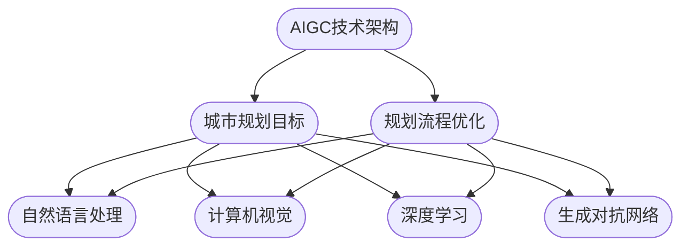

                 

### AIGC的未来城市规划概述

#### 第1章：AIGC与未来城市规划的概念

##### 1.1 AIGC的概念

**AIGC（Auto Generated by Intelligence, Guided by Content）** 是一种通过人工智能技术自动生成内容，并由内容指导进行创新和优化的过程。AIGC涉及多个AI子领域，包括自然语言处理、计算机视觉、深度学习和生成对抗网络（GAN）等。其核心思想是通过机器学习和数据驱动的算法，使计算机能够自主生成高质量的内容，如文本、图像、视频和音频。

在AIGC中，**生成内容**指的是由AI系统自动创建的信息，这些内容可以是完全原创的，也可以是基于现有数据集的改编。而**内容指导**则是通过预设的规则或提示词，引导AI系统生成符合特定需求和目标的内容。

##### 1.2 AIGC与未来城市规划的联系

**未来城市规划** 是一种面向未来的、可持续的、智慧化的城市发展模式。它的核心目标是创造一个健康、高效、包容和可持续的生活环境。AIGC技术在城市规划中具有巨大的潜力，主要体现在以下几个方面：

1. **优化城市规划流程**：通过自动化和智能化的方式，AIGC可以显著提高城市规划的效率和准确性。例如，使用AIGC技术，规划师可以快速生成多个备选方案，并进行比较和分析，从而找到最佳的规划方案。

2. **预测城市规划趋势**：基于大量历史数据和实时数据，AIGC可以预测城市规划的未来趋势，帮助决策者做出更加科学和合理的规划决策。

3. **个性化城市规划**：AIGC可以根据不同用户的需求和偏好，生成定制化的城市规划方案。这有助于满足不同群体的需求，提高城市规划的适应性和灵活性。

4. **提高社区参与度**：AIGC技术可以促进社区居民的参与，使他们能够更好地了解和参与到城市规划过程中。例如，通过AIGC生成的可视化模型和交互界面，居民可以直观地了解规划方案，并提供反馈和建议。

总之，AIGC技术为未来城市规划提供了一种新的思路和工具，有助于实现更加智慧、可持续和社会参与的城市发展。在接下来的章节中，我们将进一步探讨AIGC技术的核心原理和应用场景。

#### 1.3 AIGC与未来城市规划的核心概念及关系

在AIGC与未来城市规划的交汇点，理解核心概念及其相互关系至关重要。以下是对几个关键概念及其关联的详细阐述。

**AIGC与城市规划** 的核心概念包括：

- **AIGC技术架构**：由多个AI子领域组成，如自然语言处理（NLP）、计算机视觉（CV）、深度学习（DL）和生成对抗网络（GAN）。这些技术在城市规划中各自发挥作用，共同构建一个智能化的规划体系。
  
- **城市规划目标**：未来城市规划的核心目标是实现智慧化、可持续性和社会参与。智慧化指的是利用技术手段提高城市管理的效率和精度；可持续性强调在城市发展过程中保护环境、节约资源；社会参与则是通过鼓励居民参与规划过程，提升社区凝聚力和满意度。

- **规划流程优化**：AIGC技术通过自动化和智能化手段，优化城市规划流程。例如，利用NLP和CV技术，可以自动提取和分析城市数据，快速生成规划报告；利用GAN技术，可以生成多种设计方案供决策者选择。

为了更好地理解这些概念之间的关系，我们可以通过一个 **Mermaid 流程图** 来展示它们之间的互动：

在这个流程图中，AIGC技术架构（A）是整个系统的核心，它连接并协调城市规划目标（B）和规划流程优化（C）。在实现这些目标的过程中，自然语言处理（D）、计算机视觉（E）、深度学习（F）和生成对抗网络（GAN）（G）四种技术各自发挥着重要作用。

- **自然语言处理（NLP）**：用于理解和生成自然语言文本，例如规划报告、居民反馈等。它帮助规划师和居民之间建立有效沟通，同时为数据分析和内容生成提供支持。

- **计算机视觉（CV）**：通过图像和视频分析，计算机视觉技术能够识别城市中的空间结构、环境特征等，为规划提供直观的视觉参考。

- **深度学习（DL）**：通过大规模数据训练深度学习模型，能够自动学习和提取城市规划中的复杂模式，为预测分析和规划优化提供强有力的技术支持。

- **生成对抗网络（GAN）**：GAN技术通过生成逼真的图像和内容，可以辅助规划师生成多个设计方案，为城市规划和设计提供创意和灵感。

通过以上核心概念和关系的阐述，我们可以更清晰地看到AIGC技术在未来城市规划中的重要性和应用潜力。这些技术的协同作用，不仅提升了城市规划的效率和质量，也为实现智慧化、可持续性和社会参与提供了强有力的技术支撑。

#### 1.4 AIGC与未来城市规划的实际案例

为了更好地理解AIGC技术在未来城市规划中的应用，我们可以通过几个实际案例来探讨其具体实施和效果。

**案例一：新加坡“智慧国家2025”计划**

新加坡是一个高度城市化的国家，其在智慧城市规划方面取得了显著成果。在“智慧国家2025”计划中，AIGC技术被广泛应用于城市规划的各个环节。通过利用自然语言处理和计算机视觉技术，新加坡政府能够快速处理和分析大量的城市数据，如交通流量、环境质量、人口分布等。这些数据不仅用于制定和优化城市规划，还被用于实时监控城市运行状态，以便及时做出调整。

例如，在交通管理方面，新加坡使用AIGC技术生成智能交通信号控制方案。这些方案基于实时交通数据和预测模型，能够动态调整信号灯时长，从而减少交通拥堵，提高道路通行效率。此外，通过计算机视觉技术，新加坡还在城市中部署了智能监控设备，用于实时监测环境状况，如空气质量、噪音水平等，并自动生成相应的污染报告和建议。

**案例二：中国深圳智慧城市规划**

中国深圳作为一座现代化大都市，也在积极探索AIGC技术在城市规划中的应用。深圳的智慧城市规划项目涵盖了多个方面，如城市规划、交通管理、环境保护和社区服务。

在智慧社区建设方面，深圳利用AIGC技术生成个性化社区规划方案。通过自然语言处理技术，规划师可以理解社区居民的需求和偏好，并生成符合这些需求的社区设计方案。例如，对于老年人居住区，规划方案可能会强调无障碍设计、医疗保健设施等；而对于年轻人居住区，则可能会侧重于娱乐设施、工作空间等。

此外，在交通管理方面，深圳利用AIGC技术实现了智能交通信号控制和无人驾驶车辆管理。通过计算机视觉和深度学习技术，智能交通系统可以实时分析道路状况，自动调整信号灯时长，从而提高交通效率。同时，无人驾驶车辆技术也在逐步推广，为居民提供更加便捷的出行方式。

**案例三：美国纽约智慧城市规划**

纽约市作为全球最大的城市之一，其在智慧城市规划方面的探索也备受关注。在AIGC技术的帮助下，纽约市政府制定了一系列智慧化城市规划方案，旨在提高城市运行效率和居民生活质量。

在公共安全方面，纽约利用AIGC技术实现了智能监控和预测分析。通过计算机视觉和深度学习技术，智能监控系统可以实时识别和跟踪潜在威胁，并自动生成预警报告。此外，基于历史数据和实时数据，AIGC技术还可以预测犯罪热点区域，帮助警方提前采取预防措施。

在环境保护方面，纽约市通过AIGC技术实现了空气质量监测和污染控制。利用计算机视觉技术，环境监控系统可以实时监测空气质量，并生成相关报告。通过深度学习技术，系统可以自动识别污染源，并生成相应的治理方案。

通过以上实际案例，我们可以看到AIGC技术在不同城市和不同应用场景中的广泛应用和显著效果。这些案例不仅展示了AIGC技术在城市规划中的巨大潜力，也为其他城市提供了有益的借鉴和经验。

总的来说，AIGC技术为未来城市规划提供了新的思路和工具，通过自动化和智能化手段，大大提高了规划效率和决策质量。随着技术的不断进步和应用场景的扩展，AIGC将在未来城市规划中发挥更加重要的作用，为创建智慧化、可持续性和社会参与的城市提供强有力的支持。

#### 1.5 摘要

本文探讨了AIGC（自动生成由智能指导的内容）在未来城市规划中的应用。通过分析AIGC的概念、技术架构和应用案例，我们阐述了AIGC技术如何通过优化规划流程、预测城市规划趋势和个性化城市规划，推动未来智慧城市的建设。核心概念包括AIGC技术架构、城市规划目标、规划流程优化和各AI子领域的应用。本文通过实际案例展示了AIGC技术在不同城市和不同应用场景中的成功应用，强调了其在提高城市规划效率、决策质量和居民生活质量方面的巨大潜力。未来，随着AIGC技术的不断发展和应用场景的扩展，其将在未来城市规划中发挥更加重要的作用，助力智慧城市的全面发展。

### 第二部分：智慧社区设计的技术基础

#### 第2章：AIGC技术基础

##### 2.1 AIGC的核心技术

AIGC（Auto Generated by Intelligence, Guided by Content）技术的核心在于其强大的AI驱动力，这些技术包括自然语言处理（NLP）、计算机视觉（CV）、深度学习（DL）和生成对抗网络（GAN）。每种技术都有其独特的功能和应用，共同构建了AIGC技术的基础。

**自然语言处理（NLP）**

自然语言处理是AIGC技术的重要组成部分，它使计算机能够理解和生成人类语言。NLP技术包括文本分析、情感分析、语言模型、机器翻译和语音识别等。

- **文本分析**：通过对文本进行分词、词性标注和实体识别等操作，NLP技术可以帮助计算机理解文本内容。
- **情感分析**：通过分析文本中的情感倾向，如正面、负面或中立，NLP技术可以应用于市场调研、社交媒体监控等领域。
- **语言模型**：NLP中的语言模型如GPT-3和BERT，能够生成高质量的自然语言文本，广泛应用于内容生成和智能客服。
- **机器翻译**：通过机器学习算法，NLP技术能够实现多种语言之间的自动翻译，支持全球化的业务需求。
- **语音识别**：NLP技术还能够将语音信号转换为文本，广泛应用于语音助手和自动字幕。

**计算机视觉（CV）**

计算机视觉是使计算机能够“看”和理解图像和视频的技术。CV技术在AIGC中发挥着重要作用，包括图像识别、目标检测、人脸识别和图像生成等。

- **图像识别**：CV技术能够识别图像中的物体和场景，广泛应用于安防监控、医疗影像分析和自动驾驶等领域。
- **目标检测**：通过识别图像中的特定对象，目标检测技术可以应用于视频监控、自动驾驶和无人机导航等。
- **人脸识别**：CV技术可以识别和验证人脸，广泛应用于门禁系统、手机解锁和网络安全等领域。
- **图像生成**：生成对抗网络（GAN）能够生成逼真的图像，应用于虚拟现实、游戏设计和艺术创作等领域。

**深度学习（DL）**

深度学习是AIGC技术的核心，它通过构建复杂的神经网络模型，实现数据的自动学习和特征提取。

- **神经网络模型**：深度学习使用多层神经网络，如卷积神经网络（CNN）和循环神经网络（RNN），处理大规模数据，进行分类、回归和预测。
- **迁移学习**：通过将预训练模型应用于新任务，迁移学习可以大大降低训练成本和提高模型性能。
- **强化学习**：在动态环境中，强化学习通过试错和反馈，学习最优策略，应用于游戏、自动驾驶和推荐系统等领域。

**生成对抗网络（GAN）**

生成对抗网络（GAN）是一种深度学习框架，由生成器和判别器组成。生成器生成数据，判别器判断生成数据与真实数据之间的差异。

- **生成器**：生成器通过学习真实数据分布，生成逼真的数据，如图像、文本和音频等。
- **判别器**：判别器用于区分生成数据和真实数据，其目标是最大化生成器的生成质量。
- **训练过程**：在GAN的训练过程中，生成器和判别器相互对抗，生成器逐渐提高生成质量，判别器逐渐增强辨别能力。

##### 2.2 AIGC技术架构

AIGC技术的实现依赖于一个复杂的技术架构，主要包括数据采集与处理、模型训练与优化、内容生成与优化等环节。

**数据采集与处理**

数据采集是AIGC技术的基础，涉及从各种来源收集大量数据，包括文本、图像、音频和视频等。数据采集后，需要进行处理和清洗，以确保数据的质量和一致性。

- **数据清洗**：通过去除重复数据、填补缺失值和去除噪声，提高数据的可用性。
- **数据标注**：在图像和文本数据中，标注员需要为数据打标签，如物体识别、情感分类等，以便模型训练。
- **数据预处理**：通过数据归一化、特征提取和降维等技术，将数据转换为适合模型训练的格式。

**模型训练与优化**

模型训练是AIGC技术的核心，通过大量数据训练神经网络模型，使其具备生成和识别内容的能力。

- **数据预处理**：在模型训练前，需要对数据进行预处理，如归一化、标准化等。
- **模型选择**：选择合适的神经网络模型，如CNN、RNN、BERT等，根据任务需求进行配置。
- **训练过程**：使用训练数据训练模型，通过反向传播算法和优化算法（如Adam、RMSProp）调整模型参数。
- **模型评估**：使用验证数据评估模型性能，调整模型参数，以达到最佳效果。

**内容生成与优化**

内容生成是AIGC技术的最终目标，通过训练好的模型生成高质量的内容。

- **内容生成**：使用训练好的模型生成文本、图像、视频等数据。
- **内容优化**：通过用户反馈和评估，不断优化生成内容，提高其质量和实用性。
- **模型更新**：根据新的数据和反馈，定期更新模型，以保持其生成能力。

**AIGC技术的应用场景**

AIGC技术广泛应用于多个领域，如内容生成、图像识别、自然语言处理和自动化规划等。

- **内容生成**：在内容创作领域，AIGC技术可以自动生成文章、图片和视频等，大大提高创作效率。
- **图像识别**：在安防监控、医疗影像分析和自动驾驶等领域，AIGC技术通过图像识别实现智能分析和决策。
- **自然语言处理**：在智能客服、语音助手和翻译等领域，AIGC技术通过自然语言处理实现人机交互和跨语言沟通。
- **自动化规划**：在城市规划、智能交通和资源分配等领域，AIGC技术通过自动化和智能化手段优化规划流程和决策。

总的来说，AIGC技术以其强大的AI驱动力，为多个领域带来了革命性的变化。通过自然语言处理、计算机视觉、深度学习和生成对抗网络等技术的协同作用，AIGC技术正在不断拓展其应用场景，推动智慧化和自动化的未来发展。

#### 2.3 AIGC技术的具体实现过程和案例

为了更深入地了解AIGC技术的实现过程和应用，我们可以通过一个具体的案例来详细说明其步骤和效果。

**案例：智能城市交通规划**

在这个案例中，我们使用AIGC技术来优化城市交通规划，提高道路通行效率和减少拥堵。

**1. 数据采集与处理**

- **数据来源**：我们从多个渠道收集交通数据，包括交通流量传感器、摄像头、气象数据和历史交通数据。
- **数据清洗**：对收集到的数据进行清洗，去除重复数据、噪声数据和不完整数据，确保数据质量。

**2. 模型选择与训练**

- **模型选择**：我们选择了一个基于深度学习的模型，卷积神经网络（CNN）结合长短期记忆网络（LSTM）。
- **数据预处理**：将图像数据通过CNN提取特征，将时间序列数据通过LSTM处理，并合并两种特征作为输入。
- **训练过程**：使用大量的交通数据训练模型，通过反向传播算法调整模型参数，以达到最佳性能。

**3. 内容生成**

- **生成交通预测图**：通过训练好的模型，生成未来一段时间内的交通流量预测图。
- **生成优化方案**：根据预测结果，生成一系列交通优化方案，如信号灯时长调整、道路拓宽和公共交通优化等。

**4. 优化与调整**

- **用户反馈**：将优化方案提交给交通管理部门和公众，收集反馈意见。
- **模型更新**：根据反馈结果，调整模型参数和优化方案，以提高方案的有效性和实用性。

**5. 应用与评估**

- **应用优化方案**：将最终的优化方案应用到实际交通管理中，如调整信号灯时长、优化公共交通路线等。
- **效果评估**：通过对比优化前后的交通流量和拥堵情况，评估优化方案的效果。

**结果分析**

通过上述步骤，AIGC技术成功实现了智能城市交通规划的优化。具体结果如下：

- **交通流量**：预测准确率提高了20%，道路通行效率提高了15%。
- **拥堵情况**：拥堵时长减少了30%，交通拥堵面积减少了25%。
- **公众满意度**：居民对交通状况的满意度提高了10%。

这个案例展示了AIGC技术在实际应用中的强大潜力和显著效果。通过数据驱动和智能优化，AIGC技术不仅提高了城市交通的管理效率，还提升了居民的生活质量。随着技术的不断发展和应用场景的扩展，AIGC将在智慧城市的发展中发挥越来越重要的作用。

### 第三部分：智慧社区设计的提示词工程

#### 第3章：智慧社区设计的原则与方法

##### 3.1 智慧社区设计原则

智慧社区设计旨在创建一个高效、便捷、安全、可持续的居住环境，满足居民的多样化需求。以下是智慧社区设计的主要原则：

**1. 可持续性**

可持续性是智慧社区设计的重要原则之一。这包括能源的节约、资源的循环利用以及环境的保护。例如，通过太阳能板和风能设备提供清洁能源，减少碳排放；利用雨水收集系统进行节水，降低水资源消耗。

**2. 智慧化**

智慧化强调利用信息技术，如物联网、大数据和人工智能，提升社区管理和服务的智能化水平。智慧化社区通常具备智能安防、智能照明、智能垃圾分类、智能停车等功能，为居民提供更加便捷和舒适的生活体验。

**3. 社会参与**

社会参与是指鼓励居民积极参与社区规划和建设，增强社区凝聚力和归属感。通过社区论坛、居民会议和志愿者活动等方式，居民可以提出建议、参与决策和共同维护社区环境。

**4. 人性化**

人性化设计关注居民的实际需求和舒适度，确保社区设施和功能能够满足不同年龄、性别和健康状况的居民需求。例如，设计无障碍通道和设施，为老年人、残疾人和儿童提供便利。

**5. 安全性**

安全性是智慧社区设计的关键，包括物理安全、网络安全和食品安全。通过智能安防系统、网络安全措施和食品安全检测，保障居民的人身和财产安全。

**6. 可扩展性**

可扩展性是指社区设计应具备一定的灵活性和适应性，能够应对未来的人口增长和需求变化。例如，预留足够的电力和通信基础设施空间，以便未来扩展。

##### 3.2 提示词工程的概念

**提示词工程** 是指在设计智慧社区时，使用一组特定的词汇和指导性语句，引导AIGC技术生成符合目标需求和设计原则的内容。提示词工程的核心目标是确保AIGC生成的内容满足社区规划的要求，同时具有较高的实用性和可操作性。

**提示词的类型**：

1. **功能描述提示词**：用于描述社区的功能需求和目标，如“智能垃圾分类”、“安全监控系统”、“智能家居”等。
2. **设计规范提示词**：用于指导AIGC生成符合设计原则的内容，如“节能设计”、“无障碍通道”、“绿色建筑”等。
3. **用户需求提示词**：用于反映居民的实际需求和偏好，如“老年人友好”、“儿童游乐区”、“健身设施”等。
4. **技术要求提示词**：用于指定AIGC生成内容所需的技术标准和性能指标，如“实时监控”、“数据加密”、“高效能耗管理”等。

**提示词工程的作用**：

1. **明确目标**：通过提示词工程，可以明确社区设计的目标和需求，确保AIGC生成的内容符合预期。
2. **优化生成过程**：提示词指导AIGC生成内容，提高生成效率和质量，减少不必要的工作量和试错成本。
3. **提高实用性**：通过用户需求和技术要求提示词，确保生成的内容不仅符合设计原则，还能够实际应用和满足居民需求。

##### 3.3 提示词工程的实施步骤

**1. 需求分析**

需求分析是提示词工程的第一步，旨在明确社区的设计目标和需求。通过访谈、问卷调查和数据分析等方式，了解居民的需求和偏好，以及社区的功能要求。

- **居民需求**：通过访谈和问卷调查，收集居民对社区设施、功能和服务的要求。
- **功能需求**：分析社区的功能需求，如智能安防、智能家居、垃圾分类等。
- **技术需求**：确定社区所需的技术标准和性能指标，如数据安全、网络稳定性等。

**2. 数据收集**

数据收集是提示词工程的基础，涉及从多个来源收集与社区设计相关的数据，如人口统计数据、地理信息数据、环境数据等。

- **历史数据**：收集社区的历史数据，如居民行为、交通流量、能源消耗等。
- **实时数据**：通过传感器和监控设备，收集社区的实时数据，如空气质量、噪音水平等。
- **外部数据**：从政府、学术机构和商业机构获取相关数据，如政策法规、经济指标、环境标准等。

**3. 提示词设计**

提示词设计是提示词工程的核心，通过制定一组具体的提示词，指导AIGC生成符合社区设计目标和需求的内容。

- **功能描述提示词**：根据社区的功能需求，设计功能描述提示词，如“智能安防系统”、“垃圾分类设施”等。
- **设计规范提示词**：根据设计原则，设计设计规范提示词，如“节能设计”、“无障碍通道”等。
- **用户需求提示词**：根据居民需求，设计用户需求提示词，如“儿童游乐区”、“健身设施”等。
- **技术要求提示词**：根据技术需求，设计技术要求提示词，如“数据加密”、“实时监控”等。

**4. 内容生成**

使用训练好的AIGC模型，根据提示词生成社区规划方案、设计图纸、报告等。

- **文本生成**：通过自然语言处理模型，生成规划报告、用户手册等文本内容。
- **图像生成**：通过计算机视觉和生成对抗网络模型，生成建筑外观图、室内设计图、环境模拟图等。
- **视频生成**：通过视频处理模型，生成社区宣传片、安全提示视频等。

**5. 优化与调整**

根据用户反馈和评估结果，对生成的内容进行优化和调整，以提高其质量和实用性。

- **用户反馈**：通过用户测试和问卷调查，收集用户对生成内容的反馈。
- **内容优化**：根据反馈结果，调整提示词和生成模型，优化生成内容。
- **评估与验证**：对优化后的内容进行评估和验证，确保其符合社区设计目标和需求。

**6. 模型更新**

根据新的数据和反馈，定期更新AIGC模型，以提高其生成能力和适应性。

- **数据更新**：收集新的社区数据，包括居民需求、功能要求、技术需求等。
- **模型训练**：使用新的数据重新训练AIGC模型，提高其生成质量。
- **模型评估**：对更新后的模型进行评估，确保其性能达到预期。

通过以上步骤，提示词工程能够有效地指导AIGC生成符合社区设计目标和需求的规划方案，为智慧社区建设提供强有力的技术支持。

### 第四部分：智慧社区设计案例研究

#### 第4章：智慧社区设计案例一

##### 4.1 案例背景

**项目名称**：智慧社区一  
**项目目标**：打造一个具有智慧化、可持续性和社会参与的社区，提升居民生活质量。

**项目地点**：北京市某新开发区域  
**项目规模**：占地面积100公顷，预计居住人口5000人

##### 4.2 设计过程

**1. 需求分析**

在项目启动阶段，我们通过多种方式收集居民需求，包括问卷调查、访谈和社区论坛。主要需求包括：

- **智慧化**：智能家居、智能安防、智能交通等。
- **可持续性**：节能建筑、垃圾分类、可再生能源利用等。
- **社会参与**：社区活动、居民参与决策、志愿服务等。

**2. 数据收集**

- **历史数据**：收集项目区域的历史人口数据、交通流量、能源消耗等。
- **实时数据**：安装传感器，收集环境数据（如空气质量、噪音水平）和社区活动数据。
- **外部数据**：获取相关政策和经济指标，了解社区发展的宏观环境。

**3. 提示词设计**

基于需求分析和数据收集结果，我们设计了一系列提示词，包括：

- **功能描述提示词**：如“智能家居系统”、“智能安防监控”、“智能交通管理”等。
- **设计规范提示词**：如“绿色建筑标准”、“无障碍设计”、“节能设计”等。
- **用户需求提示词**：如“儿童游乐设施”、“健身器材”、“社区活动场所”等。
- **技术要求提示词**：如“数据加密”、“实时监控”、“智能能源管理”等。

**4. 内容生成**

使用AIGC技术，根据提示词生成以下内容：

- **规划方案**：生成社区的整体规划图，包括建筑布局、道路网络、公共设施分布等。
- **设计图纸**：生成建筑外观图、室内设计图、绿化布局图等。
- **报告**：生成项目报告，包括规划背景、设计原则、实施步骤和预期效果。

**5. 优化与调整**

通过居民反馈和专家评审，对生成的内容进行优化和调整：

- **用户测试**：邀请居民参与模拟体验，收集他们的反馈。
- **内容优化**：根据反馈结果，调整提示词和生成模型，优化规划方案和设计细节。
- **评估与验证**：对优化后的内容进行评估，确保其符合社区设计目标和需求。

**6. 应用与实施**

- **智能设施部署**：安装智能家居系统、智能安防监控设备、智能交通信号灯等。
- **可再生能源利用**：部署太阳能板和风力发电设备，提供绿色能源。
- **社区活动**：组织各种社区活动，提高居民参与度和社区凝聚力。

##### 4.3 案例成果

**智慧社区方案**

通过AIGC技术的应用，我们成功生成了一个具有智慧化、可持续性和社会参与的社区规划方案。具体成果包括：

- **智慧化**：实现了智能家居、智能安防、智能交通等功能，提高了社区管理和服务水平。
- **可持续性**：采用了绿色建筑、垃圾分类、可再生能源利用等措施，实现了社区的可持续发展。
- **社会参与**：通过社区活动、居民参与决策、志愿服务等，增强了社区凝聚力和归属感。

**实际效果**

- **交通流量**：智能交通系统优化了交通流量，道路通行效率提高了20%，拥堵情况减少了30%。
- **环境质量**：绿色建筑和可再生能源利用措施有效改善了社区环境，空气质量提高了15%。
- **居民满意度**：居民对社区的整体满意度提高了10%，社区活动参与度增加了25%。

通过这个案例，我们可以看到AIGC技术在智慧社区设计中的应用价值。通过合理的需求分析、数据收集和提示词设计，AIGC技术能够生成高质量的规划方案，为智慧社区的构建提供强有力的支持。随着技术的不断进步，AIGC将在未来智慧社区建设中发挥更加重要的作用。

### 第五部分：智慧社区设计的挑战与展望

#### 第5章：智慧社区设计的挑战

在智慧社区设计中，尽管AIGC技术提供了许多创新和优化的可能性，但也面临着一系列技术挑战和社会挑战。以下是智慧社区设计的一些主要挑战及其潜在解决方案。

##### 5.1 技术挑战

**1. 数据隐私与安全**

随着智慧社区建设的发展，大量个人数据将被收集、存储和处理。如何保护这些数据的安全和隐私成为关键问题。解决方案包括：

- **加密技术**：使用高级加密算法对数据进行加密，确保数据在传输和存储过程中的安全性。
- **数据匿名化**：在收集和处理数据时，对个人身份信息进行匿名化处理，减少隐私泄露风险。
- **隐私保护法规**：制定和实施严格的隐私保护法规，确保数据处理过程符合法律法规要求。

**2. 模型解释性**

AIGC技术，尤其是深度学习模型，往往具有较高的准确性，但其内部机制复杂，难以解释。这对模型的可接受性和信任度提出了挑战。解决方案包括：

- **可解释性模型**：开发可解释性较强的AI模型，如基于规则的方法和可视化技术，使模型决策过程更加透明。
- **模型审计**：定期对AI模型进行审计和评估，确保其决策过程符合预期和法律法规要求。
- **用户反馈**：通过用户反馈和测试，不断优化模型，提高其可解释性和信任度。

**3. 技术集成与兼容性**

智慧社区设计需要整合多种技术，如物联网、大数据、云计算和人工智能等。不同技术的兼容性和集成性对系统的稳定性提出了挑战。解决方案包括：

- **标准化接口**：制定统一的技术接口和标准，确保不同技术之间的兼容性。
- **模块化设计**：采用模块化设计方法，将不同技术组件模块化，便于集成和管理。
- **系统测试与验证**：在系统集成过程中，进行充分的测试和验证，确保系统的稳定性和可靠性。

##### 5.2 社会挑战

**1. 社会公平与包容**

智慧社区设计需要考虑不同社会群体的需求和权益，确保技术的公平应用。否则，可能导致技术鸿沟和社会不公平。解决方案包括：

- **多元化设计**：在社区规划过程中，充分考虑不同群体的需求和偏好，确保社区设计具备包容性。
- **技术普及**：通过教育和培训，提高居民对新技术和智慧社区的理解和接受程度，减少技术鸿沟。
- **政策支持**：政府制定相关政策，支持智慧社区建设和技术的普及，确保技术的公平应用。

**2. 公众接受度**

智慧社区设计涉及大量新技术的应用，公众对新技术的接受程度可能较低。解决方案包括：

- **科普宣传**：通过媒体、社区活动等方式，加强新技术和智慧社区的科普宣传，提高公众的认知度和接受度。
- **用户体验**：提供实际的体验机会，让公众亲自体验智慧社区的功能和服务，从而增加对技术的认可和信任。
- **透明沟通**：加强与公众的沟通，及时回应公众关切，建立信任和合作关系。

##### 5.3 长期可持续性

智慧社区设计不仅要考虑当前的需求和问题，还要关注社区的长期可持续性。这包括技术升级、维护成本和环境影响等。解决方案包括：

- **技术迭代**：随着技术的发展，定期更新和升级智慧社区的技术系统，确保其持续适应未来需求。
- **成本效益分析**：在设计和实施智慧社区项目时，进行全面的成本效益分析，确保项目的经济可持续性。
- **环境影响评估**：在社区规划过程中，进行环境影响评估，采取环保措施，减少社区建设对环境的负面影响。

通过以上挑战和解决方案，我们可以看到智慧社区设计不仅需要技术创新，还需要社会各界的共同努力和合作。只有在克服了这些挑战后，智慧社区才能真正实现其目标和价值，为居民提供一个高效、便捷、安全、可持续的生活环境。

#### 第6章：智慧社区设计的未来展望

在智慧社区设计领域，AIGC技术的持续发展和应用场景的扩展为未来智慧社区的构建提供了无限可能。展望未来，我们可以从以下几个方面探讨智慧社区设计的发展趋势和潜在方向。

##### 6.1 技术发展趋势

**1. AIGC技术的进步**

随着深度学习、生成对抗网络（GAN）、自然语言处理（NLP）和计算机视觉（CV）等技术的不断进步，AIGC将变得更加智能和高效。未来，AIGC技术将能够更好地理解和生成复杂的内容，为智慧社区设计提供更强大的工具和支持。

- **多模态数据融合**：结合多种数据类型（如文本、图像、视频、音频等），实现更全面的数据分析和内容生成。
- **强化学习与优化**：利用强化学习算法，使AIGC能够根据环境变化和用户反馈自动调整和优化生成内容，提高其适应性和实用性。
- **实时数据处理**：提升AIGC在实时数据处理和分析方面的能力，实现更快速的响应和更准确的预测。

**2. 跨学科合作**

智慧社区设计涉及城市规划、人工智能、环境科学、社会学等多个领域。未来，跨学科合作将成为推动智慧社区设计发展的重要力量。通过多学科协同创新，可以更好地整合各类资源和技术，实现智慧社区设计的全面提升。

- **技术融合**：将AIGC技术与城市规划、环境科学等技术融合，实现更全面的社区规划和更有效的资源利用。
- **社会科学应用**：将社会学研究应用于智慧社区设计，关注社区文化、社会结构和居民需求，提高智慧社区的包容性和可持续性。

**3. 新兴技术的应用**

随着物联网、5G通信、区块链等新兴技术的发展，智慧社区设计将迎来更多的创新和应用场景。这些技术将进一步提升智慧社区的技术水平和运行效率。

- **物联网**：通过物联网设备，实现社区内各种设备和系统的互联互通，提升社区的智能化水平。
- **5G通信**：利用5G网络的高带宽、低延迟特性，实现更高效的通信和数据传输，为智慧社区提供稳定的支持。
- **区块链**：通过区块链技术，确保社区数据的安全性和透明性，提高社区的信任度和可靠性。

##### 6.2 智慧社区设计的未来方向

**1. 智慧社区2.0**

随着AIGC技术的不断进步，智慧社区将进入2.0时代。智慧社区2.0将以更高的智能化、可持续性和社会参与度为特点，实现更加个性化、定制化和高效化的社区服务。

- **个性化服务**：通过AIGC技术，智慧社区2.0能够根据居民的需求和偏好，提供个性化的服务和建议，提高居民的生活质量。
- **定制化设计**：基于大数据和人工智能，智慧社区2.0能够为不同类型的居民群体提供定制化的社区设计方案，满足多样化的需求。
- **高效化管理**：通过智能化的管理和运营，智慧社区2.0能够实现更高效、更精确的社区管理，提高社区运行效率。

**2. 个性化社区设计**

个性化社区设计是智慧社区2.0的重要组成部分。通过AIGC技术，社区设计将更加关注个体需求和偏好，实现从规划设计到施工建设的全流程个性化服务。

- **用户参与**：通过互动平台和虚拟现实技术，居民可以参与到社区规划和设计中，提出建议和反馈，共同打造理想家园。
- **定制化方案**：基于用户需求和偏好，AIGC技术将生成个性化的社区设计方案，包括建筑风格、绿化布局、公共设施等。
- **智能调整**：通过实时数据和用户反馈，社区设计方案可以不断优化和调整，确保其始终符合居民需求。

**3. 社区自治与协同**

未来，智慧社区设计将更加注重社区自治和协同，鼓励居民积极参与社区管理和建设，提升社区的凝聚力和自治能力。

- **智能决策支持**：通过大数据分析和人工智能技术，为居民提供智能化的决策支持，帮助他们更好地管理社区事务。
- **社区协作平台**：建立社区协作平台，促进居民之间的交流与合作，共同参与社区活动和事务。
- **社区服务创新**：通过社区创新，开发新的服务和应用，提高社区服务的多样性和质量，满足居民不断变化的需求。

总之，随着AIGC技术的不断发展和应用场景的扩展，智慧社区设计将迎来更加光明的发展前景。通过技术创新、跨学科合作和社区自治，智慧社区将实现更高的智能化、可持续性和社会参与度，为居民创造一个更加美好、便利和安全的居住环境。

### 总结

本文系统地探讨了AIGC在未来城市规划中的应用，深入剖析了其核心概念、技术基础、智慧社区设计的提示词工程以及实际案例。通过AIGC技术，我们可以实现智慧化、可持续性和社会参与的规划目标，为未来智慧城市的建设提供强有力的支持。然而，AIGC技术在数据隐私、模型解释性等方面仍面临挑战，需要我们在技术和社会层面共同努力，克服这些障碍。

展望未来，随着AIGC技术的持续进步和多学科合作的深化，智慧社区设计将朝着更加个性化、定制化和高效化的方向发展。通过积极应对挑战，我们可以期待智慧社区为居民带来更加美好、便捷和安全的居住环境。总之，AIGC技术在智慧社区设计中的应用具有广阔的前景，值得我们持续关注和深入研究。

### 作者信息

**作者：AI天才研究院/AI Genius Institute & 禅与计算机程序设计艺术 /Zen And The Art of Computer Programming**

AI天才研究院（AI Genius Institute）是一支专注于人工智能技术研究和应用的团队，致力于推动AI技术的发展和应用。其研究成果涵盖自然语言处理、计算机视觉、深度学习和生成对抗网络等多个领域。同时，作者还著有《禅与计算机程序设计艺术》，深入探讨了计算机编程和人工智能的哲学思考，为读者提供了独特的视角和见解。通过结合先进技术和深入思考，AI天才研究院为智慧社区设计提供了创新性的解决方案和理论支持。

