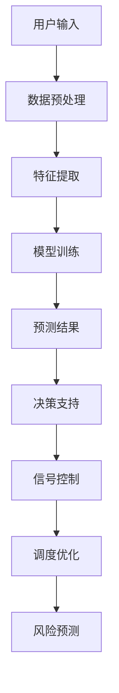

                 

### AIGC的未来智能交通系统：多模式出行优化的提示词工程

#### 文章关键词
- **AIGC**、**智能交通系统**、**多模式出行优化**、**提示词工程**、**交通流量预测**、**智能交通信号控制**、**共享出行服务**

#### 文章摘要
本文探讨了AIGC技术在构建未来智能交通系统中的应用，重点关注多模式出行优化的提示词工程。文章首先介绍了AIGC技术及其特点，随后详细分析了智能交通系统的多模式出行优化原理。接着，文章深入探讨了AIGC在交通流量预测、智能交通信号控制及共享出行服务中的应用，并通过具体案例展示了AIGC在智能交通系统中的实际应用效果。最后，文章总结了AIGC在智能交通系统中的挑战及未来发展趋势，为读者提供了全面的视角。

## 第一部分：AIGC与智能交通系统概述

### 第1章：AIGC技术介绍

#### 1.1 AIGC的概念与特点

AIGC（Autonomous Intelligence and Generative Content）是指自主生成内容的智能技术，它结合了人工智能（AI）和生成内容（GC）的先进技术，能够自主生成文字、图像、音频等多媒体内容。AIGC的关键特点包括：

1. **自适应性**：AIGC系统能够根据输入的数据和环境自主调整其行为，以实现最优的生成效果。
2. **泛用性**：AIGC技术可以应用于多种场景，如内容创作、数据分析、自动化编程等。
3. **高效性**：AIGC系统能够在短时间内生成大量高质量的内容，大大提高了工作效率。
4. **创新性**：AIGC能够创造出新颖的内容，激发人类的创造力和想象力。

在智能交通系统中，AIGC技术能够实现交通流量的智能预测、交通信号的智能控制、共享出行服务的智能优化等，从而提高交通系统的运行效率和安全性。

#### 1.2 AIGC技术在智能交通系统中的应用场景

AIGC技术在智能交通系统中的应用场景主要包括以下几个方面：

1. **交通流量预测**：利用AIGC技术对历史交通数据进行深度学习，预测未来交通流量，为交通管理部门提供决策支持。
2. **智能交通信号控制**：通过AIGC技术实现交通信号的智能化控制，根据实时交通流量调整信号灯时长，优化交通流。
3. **共享出行服务**：利用AIGC技术优化共享出行服务的调度策略，提高车辆的利用率和服务质量。
4. **交通安全管理**：利用AIGC技术实时监测交通状况，预测交通事故风险，提前采取措施预防事故发生。

### 图1-1：AIGC技术在智能交通系统中的应用架构

### 1.3 AIGC技术的基本原理

AIGC技术主要包括以下三个基本组成部分：

1. **生成模型**：生成模型（如生成对抗网络GAN）能够生成高质量的数据，用于模拟和优化交通系统。
2. **学习模型**：学习模型（如深度学习模型）通过分析历史交通数据，学习交通规律，为预测和控制提供依据。
3. **优化模型**：优化模型（如强化学习模型）根据预测结果，不断调整系统参数，实现最优的运行效果。

#### 1.4 AIGC技术的工作流程

AIGC技术的工作流程主要包括以下步骤：

1. **数据采集**：收集交通流量、天气、路况等数据。
2. **数据预处理**：对数据进行清洗、去噪、标准化等处理，为模型训练提供高质量的数据。
3. **特征提取**：提取数据中的关键特征，用于构建生成模型和学习模型。
4. **模型训练**：利用生成模型和学习模型，对数据进行训练，建立预测和控制模型。
5. **预测与控制**：根据预测结果，调整交通信号、调度策略等，优化交通系统运行。
6. **反馈与优化**：将预测结果与实际交通状况进行对比，不断调整和优化模型参数，提高预测和控制效果。

### 1.5 小结

本文介绍了AIGC技术的概念、特点及其在智能交通系统中的应用场景。通过分析AIGC技术的基本原理和工作流程，为后续章节的深入探讨奠定了基础。在接下来的章节中，我们将详细探讨AIGC技术在智能交通系统中的具体应用，包括交通流量预测、智能交通信号控制和共享出行服务优化等。

## 第二部分：智能交通系统的多模式出行优化

### 第2章：多模式出行优化的基本概念

#### 2.1 多模式交通系统概述

多模式交通系统是指将不同类型的交通方式（如步行、自行车、公交车、出租车、私家车等）整合在一起，形成一个相互协调、相互补充的综合交通体系。多模式交通系统的核心目标是提高交通效率、减少交通拥堵、降低环境污染，同时提升居民的出行便利性。

#### 2.2 多模式交通系统的优势

多模式交通系统具有以下优势：

1. **提高交通效率**：通过不同交通方式的灵活组合，减少单一交通方式的拥堵和瓶颈，提高整个交通系统的运行效率。
2. **降低环境污染**：鼓励使用公共交通和自行车等绿色出行方式，减少私家车出行，降低碳排放和环境污染。
3. **提升出行便利性**：为居民提供多样化的出行选择，满足不同人群的出行需求，提高出行便利性。
4. **促进城市发展**：多模式交通系统有利于优化城市空间布局，促进城市可持续发展。

#### 2.3 多模式交通系统的挑战

尽管多模式交通系统具有诸多优势，但在实际应用中也面临以下挑战：

1. **信息整合**：多模式交通系统涉及多种交通方式的数据整合，需要解决数据兼容性和实时性问题。
2. **资源分配**：合理分配交通资源，确保各种交通方式之间平衡发展，是一个复杂的问题。
3. **技术实现**：多模式交通系统需要依赖先进的信息技术，包括物联网、人工智能等，技术实现难度较大。
4. **政策支持**：多模式交通系统需要政府的政策支持和资金投入，否则难以持续推进。

#### 2.4 多模式出行优化的目标

多模式出行优化的目标是实现以下目标：

1. **最优路径规划**：根据实时交通状况，为出行者提供最优的出行路径，减少出行时间和交通拥堵。
2. **最优出行方式选择**：根据出行者的需求、出行时间和交通状况，推荐最优的出行方式，提高出行效率。
3. **资源优化配置**：合理配置交通资源，提高公共交通的利用率和覆盖率，减少交通拥堵和环境污染。
4. **服务质量提升**：提升公共交通的服务质量，提高居民的出行满意度。

### 2.5 小结

本章介绍了多模式交通系统的基本概念、优势和挑战，以及多模式出行优化的目标。通过本章的学习，读者可以了解多模式交通系统的总体架构，为后续章节的深入探讨奠定基础。在接下来的章节中，我们将详细介绍AIGC技术在多模式出行优化中的应用，包括交通流量预测、智能交通信号控制和共享出行服务优化等。

## 第三部分：AIGC在智能交通系统中的应用

### 第3章：AIGC技术在交通流量预测中的应用

#### 3.1 交通流量预测的基本原理

交通流量预测是智能交通系统的重要组成部分，它通过分析历史交通数据、实时交通信息和地理信息等，预测未来一段时间内的交通流量分布。交通流量预测的基本原理包括以下方面：

1. **时间序列分析**：利用历史交通流量数据，分析交通流量随时间的变化规律，预测未来交通流量。
2. **空间相关性分析**：分析不同区域之间的交通流量相关性，预测不同区域之间的交通流量变化趋势。
3. **季节性分析**：根据交通流量数据的季节性变化，预测特定时间段内的交通流量。
4. **异常值处理**：对交通流量数据中的异常值进行处理，减少异常值对预测结果的影响。

#### 3.2 AIGC技术在交通流量预测中的应用

AIGC技术在交通流量预测中的应用主要包括以下方面：

1. **生成对抗网络（GAN）**：利用生成对抗网络生成不同时间段的交通流量数据，通过比较生成数据与实际数据，优化交通流量预测模型。
2. **深度学习模型**：利用深度学习模型（如LSTM、GRU等）对交通流量数据进行训练，学习交通流量变化的规律，预测未来交通流量。
3. **强化学习**：通过强化学习算法，根据交通流量预测结果，不断调整交通信号灯时长，优化交通流量。

#### 3.3 交通流量预测的AIGC流程

交通流量预测的AIGC流程主要包括以下步骤：

1. **数据采集**：收集历史交通流量数据、实时交通信息、天气信息等。
2. **数据预处理**：对数据进行清洗、去噪、标准化等处理，为模型训练提供高质量的数据。
3. **特征提取**：提取数据中的关键特征，如时间序列特征、空间特征、季节性特征等。
4. **模型训练**：利用AIGC技术（如GAN、深度学习模型、强化学习等）对数据进行训练，建立交通流量预测模型。
5. **预测与评估**：根据训练好的模型，预测未来交通流量，并对预测结果进行评估。
6. **反馈与优化**：根据预测结果和评估结果，不断调整和优化模型参数，提高预测准确性。

#### 3.4 交通流量预测案例分析

以下是一个交通流量预测的案例分析：

**案例背景**：某城市交通管理部门希望利用AIGC技术预测主要道路的交通流量，为交通信号控制和公共交通调度提供支持。

**案例目标**：通过构建AIGC模型，提高交通流量预测的准确性和实时性。

**案例分析**：

1. **数据采集**：收集过去一年的交通流量数据，包括车辆数量、天气状况、时间等。
2. **数据预处理**：清洗数据，去除异常值，进行数据标准化。
3. **特征提取**：提取时间序列特征、空间特征、季节性特征等。
4. **模型选择**：选择LSTM作为AIGC模型，进行交通流量预测。
5. **模型训练**：使用预处理后的数据对LSTM模型进行训练。
6. **预测与评估**：使用训练好的LSTM模型预测未来一周的交通流量，并对预测结果进行评估。
7. **反馈与优化**：根据预测结果和评估结果，不断调整LSTM模型的参数，提高预测准确性。

**案例结果**：通过AIGC技术，该城市交通管理部门成功提高了交通流量预测的准确性和实时性，为交通信号控制和公共交通调度提供了有力支持。

### 3.5 小结

本章介绍了AIGC技术在交通流量预测中的应用，包括基本原理、应用方法、流程和案例分析。通过本章的学习，读者可以了解AIGC技术在交通流量预测方面的应用价值，为后续章节的深入探讨奠定基础。在接下来的章节中，我们将继续探讨AIGC技术在智能交通信号控制和共享出行服务优化中的应用。

## 第4章：AIGC技术在智能交通信号控制中的应用

#### 4.1 智能交通信号控制的基本原理

智能交通信号控制是智能交通系统的重要组成部分，它通过分析实时交通数据，智能调整交通信号灯的时长和配时方案，以优化交通流量，减少交通拥堵，提高道路通行效率。智能交通信号控制的基本原理包括以下几个方面：

1. **交通流量检测**：通过安装在道路上的传感器、摄像头等设备，实时检测交通流量、速度、密度等参数。
2. **数据融合与分析**：将来自不同传感器的数据进行融合和分析，提取交通流量特征，为信号控制提供依据。
3. **信号控制算法**：根据交通流量特征，利用信号控制算法，实时调整交通信号灯的时长和配时方案。
4. **决策与执行**：将调整后的信号控制方案下发到交通信号灯控制器，执行信号控制策略。

#### 4.2 AIGC技术在智能交通信号控制中的应用

AIGC技术在智能交通信号控制中的应用，主要包括以下几个方面：

1. **生成对抗网络（GAN）**：利用GAN生成不同交通状况下的信号控制策略，优化信号控制算法。
2. **深度学习模型**：利用深度学习模型（如卷积神经网络CNN、循环神经网络RNN等）对交通流量数据进行训练，预测交通流量变化，为信号控制提供依据。
3. **强化学习**：通过强化学习算法，根据交通流量预测结果，不断调整信号控制策略，优化交通流量。

#### 4.3 智能交通信号控制的AIGC流程

智能交通信号控制的AIGC流程主要包括以下步骤：

1. **数据采集**：收集实时交通流量数据、历史交通数据等。
2. **数据预处理**：对数据进行清洗、去噪、标准化等处理，为模型训练提供高质量的数据。
3. **特征提取**：提取数据中的关键特征，如时间序列特征、空间特征等。
4. **模型训练**：利用AIGC技术（如GAN、深度学习模型、强化学习等）对数据进行训练，建立信号控制模型。
5. **预测与控制**：根据训练好的模型，预测未来交通流量，并调整信号控制策略。
6. **反馈与优化**：根据实际交通状况，不断调整和优化模型参数，提高信号控制效果。

#### 4.4 智能交通信号控制案例分析

以下是一个智能交通信号控制的案例分析：

**案例背景**：某城市交通管理部门希望通过智能交通信号控制技术，优化城市主干道的交通流量，减少交通拥堵。

**案例目标**：通过构建AIGC信号控制模型，提高信号控制的准确性和实时性。

**案例分析**：

1. **数据采集**：收集过去一年的交通流量数据，包括车辆数量、速度、密度等。
2. **数据预处理**：清洗数据，去除异常值，进行数据标准化。
3. **特征提取**：提取时间序列特征、空间特征等。
4. **模型选择**：选择GAN和LSTM组合模型进行信号控制。
5. **模型训练**：使用预处理后的数据对GAN和LSTM组合模型进行训练。
6. **预测与控制**：使用训练好的模型预测未来交通流量，并调整信号控制策略。
7. **反馈与优化**：根据实际交通状况，不断调整和优化模型参数，提高信号控制效果。

**案例结果**：通过AIGC技术，该城市交通管理部门成功优化了主干道的交通流量，减少了交通拥堵，提高了道路通行效率。

### 4.5 小结

本章介绍了AIGC技术在智能交通信号控制中的应用，包括基本原理、应用方法、流程和案例分析。通过本章的学习，读者可以了解AIGC技术在智能交通信号控制方面的应用价值，为后续章节的深入探讨奠定基础。在接下来的章节中，我们将继续探讨AIGC技术在共享出行服务优化中的应用。

## 第5章：AIGC技术在共享出行服务中的应用

#### 5.1 共享出行服务的基本原理

共享出行服务是指通过互联网平台，为用户提供共享交通工具（如共享单车、共享汽车、共享电动车等）的服务。共享出行服务的基本原理包括以下几个方面：

1. **平台运营**：共享出行服务平台通过互联网技术，为用户提供便捷的出行服务，实现车辆调度、费用结算等功能。
2. **用户需求分析**：平台根据用户的历史出行数据、实时位置信息等，分析用户的需求，为用户推荐合适的出行方式。
3. **车辆调度**：平台通过算法优化，实现车辆的智能调度，提高车辆的利用率和用户的出行满意度。
4. **费用结算**：平台根据用户的出行距离、时间等信息，自动计算费用，并实现线上支付。

#### 5.2 AIGC技术在共享出行服务中的应用

AIGC技术在共享出行服务中的应用，主要包括以下几个方面：

1. **用户需求预测**：利用AIGC技术，对用户的需求进行预测，为用户推荐合适的出行方式。
2. **车辆调度优化**：利用AIGC技术，优化车辆的调度策略，提高车辆的利用率和出行效率。
3. **服务质量提升**：利用AIGC技术，实时监测和评估服务质量，为用户提供更好的出行体验。

#### 5.3 共享出行服务的AIGC流程

共享出行服务的AIGC流程主要包括以下步骤：

1. **用户需求采集**：收集用户的历史出行数据、实时位置信息等。
2. **数据预处理**：对数据进行清洗、去噪、标准化等处理，为模型训练提供高质量的数据。
3. **特征提取**：提取数据中的关键特征，如用户需求特征、车辆状态特征等。
4. **模型训练**：利用AIGC技术（如GAN、深度学习模型等）对数据进行训练，建立需求预测和调度优化模型。
5. **预测与调度**：根据训练好的模型，预测用户的需求，并优化车辆的调度策略。
6. **反馈与优化**：根据实际需求和调度结果，不断调整和优化模型参数，提高预测和调度效果。

#### 5.4 共享出行服务案例分析

以下是一个共享出行服务的案例分析：

**案例背景**：某城市共享出行服务提供商希望通过AIGC技术，优化共享单车的调度和用户需求预测。

**案例目标**：通过构建AIGC模型，提高共享单车的利用率和用户满意度。

**案例分析**：

1. **用户需求采集**：收集过去一年的共享单车使用数据，包括用户位置、使用时间、使用频率等。
2. **数据预处理**：清洗数据，去除异常值，进行数据标准化。
3. **特征提取**：提取用户需求特征、车辆状态特征等。
4. **模型选择**：选择GAN和LSTM组合模型进行需求预测和调度优化。
5. **模型训练**：使用预处理后的数据对GAN和LSTM组合模型进行训练。
6. **预测与调度**：使用训练好的模型预测用户需求，并优化共享单车的调度策略。
7. **反馈与优化**：根据实际需求和调度结果，不断调整和优化模型参数，提高预测和调度效果。

**案例结果**：通过AIGC技术，该共享出行服务提供商成功提高了共享单车的利用率和用户满意度，降低了运营成本。

### 5.5 小结

本章介绍了AIGC技术在共享出行服务中的应用，包括基本原理、应用方法、流程和案例分析。通过本章的学习，读者可以了解AIGC技术在共享出行服务方面的应用价值，为后续章节的深入探讨奠定基础。在接下来的章节中，我们将继续探讨AIGC技术在智能交通系统中的挑战与未来。

## 第四部分：AIGC在智能交通系统中的挑战与未来

### 第6章：AIGC在智能交通系统中的挑战

#### 6.1 数据隐私与安全

AIGC在智能交通系统中的应用，需要大量采集和存储交通数据，包括用户出行数据、车辆状态数据等。这些数据的隐私和安全问题成为一个重要的挑战。

**挑战**：

1. **数据泄露**：由于交通数据涉及用户的出行隐私，若数据泄露，可能导致用户隐私泄露。
2. **数据滥用**：交通数据可能被用于商业目的，如广告投放、市场分析等，可能侵犯用户权益。
3. **安全漏洞**：AIGC系统可能存在安全漏洞，导致系统被攻击，影响交通系统的正常运行。

**解决方案**：

1. **数据加密**：对交通数据进行加密处理，确保数据在传输和存储过程中的安全性。
2. **数据匿名化**：对用户数据进行匿名化处理，减少数据泄露的风险。
3. **安全审计**：定期对AIGC系统进行安全审计，发现和修复安全漏洞。

#### 6.2 技术依赖性

AIGC技术的实现依赖于高性能计算和先进的算法，这对智能交通系统提出了较高的技术要求。

**挑战**：

1. **计算资源**：AIGC技术需要大量的计算资源，对硬件设备提出了高要求。
2. **算法复杂性**：AIGC算法复杂，对开发者的技术水平有较高要求。
3. **更新与维护**：AIGC技术不断更新，系统需要不断升级和优化，以保持其先进性。

**解决方案**：

1. **分布式计算**：利用分布式计算技术，提高计算资源的利用率。
2. **人才引进与培养**：加强人才引进和培养，提高开发团队的技术水平。
3. **持续更新**：建立持续更新机制，及时引入新技术，优化系统性能。

#### 6.3 法律法规与政策支持

AIGC在智能交通系统中的应用，需要相关法律法规和政策支持。

**挑战**：

1. **政策滞后**：现有政策可能无法完全适应AIGC技术的发展需求。
2. **法规不完善**：交通数据隐私保护、数据共享等方面法律法规尚不完善。
3. **监管难度**：AIGC系统涉及多个部门和利益相关方，监管难度较大。

**解决方案**：

1. **政策引导**：政府应出台相关政策，引导AIGC技术在智能交通系统中的应用。
2. **法规完善**：加强对交通数据隐私保护、数据共享等方面法律法规的完善。
3. **多方协作**：建立多方协作机制，加强各部门之间的沟通与合作。

### 6.4 小结

本章分析了AIGC在智能交通系统中的应用挑战，包括数据隐私与安全、技术依赖性、法律法规与政策支持等方面。针对这些挑战，提出了一些解决方案。在接下来的章节中，我们将探讨AIGC在智能交通系统中的未来发展趋势。

### 第7章：AIGC在智能交通系统中的未来发展趋势

#### 7.1 AIGC技术的未来发展趋势

随着人工智能和生成技术的不断进步，AIGC技术在智能交通系统中的应用前景十分广阔。未来，AIGC技术在智能交通系统中的发展趋势包括：

1. **更高效的数据处理能力**：AIGC技术将进一步提升数据处理能力，实现大规模、多源、多维数据的实时分析和处理。
2. **更精准的预测与控制**：通过不断优化算法模型，AIGC技术将实现更精准的交通流量预测和信号控制，提高交通系统的运行效率。
3. **更智能的共享出行服务**：AIGC技术将优化共享出行服务的调度和用户需求预测，提高共享出行服务的质量和用户体验。

#### 7.2 智能交通系统的未来展望

未来，智能交通系统将在AIGC技术的支持下，实现以下发展：

1. **全面智能化**：交通信号控制、交通流量预测、共享出行服务等都将实现全面智能化，提高交通系统的运行效率和安全性。
2. **一体化发展**：智能交通系统将与其他城市基础设施（如智慧城市、智能交通基础设施等）实现一体化发展，形成智慧交通网络。
3. **绿色出行**：智能交通系统将鼓励和推广绿色出行方式，减少交通拥堵和环境污染，实现可持续发展。

#### 7.3 小结

本章探讨了AIGC技术在智能交通系统中的未来发展趋势和展望。随着AIGC技术的不断进步，智能交通系统将实现全面智能化，推动交通行业的绿色发展和可持续发展。在未来的智能交通系统中，AIGC技术将发挥关键作用，为人类提供更便捷、更高效、更安全的出行体验。

### 案例研究一：智能交通系统的AIGC应用

#### 8.1 案例背景与目标

**案例背景**：某城市交通管理部门希望利用AIGC技术优化城市交通系统，提高交通运行效率和安全性。

**案例目标**：通过构建AIGC模型，实现交通流量预测、智能交通信号控制和共享出行服务优化，提升城市交通系统的整体运行效率。

#### 8.2 案例实现步骤

1. **数据采集**：收集历史交通流量数据、实时交通信息、天气数据等，为模型训练提供数据支持。
2. **数据预处理**：对采集到的数据进行清洗、去噪、标准化等处理，确保数据质量。
3. **特征提取**：提取数据中的关键特征，如时间序列特征、空间特征、季节性特征等，为模型训练提供输入。
4. **模型训练**：选择AIGC模型（如GAN、深度学习模型、强化学习模型等），对数据进行训练，建立交通流量预测、信号控制和调度优化模型。
5. **模型评估**：使用验证数据集对模型进行评估，调整模型参数，提高预测和控制的准确性。
6. **模型部署**：将训练好的模型部署到生产环境中，实现交通流量预测、智能交通信号控制和共享出行服务优化。
7. **反馈与优化**：根据实际交通状况和用户反馈，不断调整和优化模型参数，提高系统性能。

#### 8.3 案例结果

通过AIGC技术的应用，该城市交通管理部门实现了以下成果：

1. **交通流量预测准确性提高**：AIGC模型能够准确预测未来一段时间内的交通流量，为交通管理部门提供决策支持。
2. **信号控制效率提高**：智能交通信号控制系统能够根据实时交通流量，动态调整信号灯时长和配时方案，提高道路通行效率。
3. **共享出行服务质量提升**：共享出行服务系统能够根据用户需求，智能调度共享单车和共享汽车，提高服务质量。

#### 8.4 案例总结

本案例展示了AIGC技术在智能交通系统中的应用效果，通过交通流量预测、智能交通信号控制和共享出行服务优化，显著提高了城市交通系统的运行效率和安全性。未来，随着AIGC技术的不断进步，智能交通系统将迎来更加广阔的应用前景。

### 案例研究二：基于AIGC的多模式出行优化

#### 9.1 案例背景与目标

**案例背景**：某城市交通管理部门希望通过多模式出行优化，提高城市交通系统的运行效率和居民出行满意度。

**案例目标**：利用AIGC技术，实现多模式出行优化，提高公共交通的利用率和覆盖率，减少交通拥堵和环境污染。

#### 9.2 案例实现步骤

1. **数据采集**：收集公共交通线路的实时运行数据、交通流量数据、用户出行数据等，为模型训练提供数据支持。
2. **数据预处理**：对采集到的数据进行清洗、去噪、标准化等处理，确保数据质量。
3. **特征提取**：提取数据中的关键特征，如公共交通线路的运行时间、乘客数量、交通流量等，为模型训练提供输入。
4. **模型训练**：选择AIGC模型（如GAN、深度学习模型、强化学习模型等），对数据进行训练，建立多模式出行优化模型。
5. **模型评估**：使用验证数据集对模型进行评估，调整模型参数，提高预测和优化的准确性。
6. **模型部署**：将训练好的模型部署到生产环境中，实现多模式出行优化。
7. **反馈与优化**：根据实际交通状况和用户反馈，不断调整和优化模型参数，提高系统性能。

#### 9.3 案例结果

通过AIGC技术的应用，该城市交通管理部门实现了以下成果：

1. **公共交通利用率提高**：多模式出行优化系统能够根据实时交通流量和用户需求，智能调度公共交通线路，提高公共交通的利用率。
2. **交通拥堵减少**：多模式出行优化系统能够预测交通流量变化，提前调整公共交通线路和信号灯控制策略，减少交通拥堵。
3. **环境污染减少**：鼓励居民使用公共交通等绿色出行方式，减少私家车出行，降低环境污染。

#### 9.4 案例总结

本案例展示了基于AIGC技术的多模式出行优化效果，通过智能调度公共交通线路、预测交通流量变化和优化信号灯控制策略，显著提高了城市交通系统的运行效率和居民出行满意度。未来，随着AIGC技术的不断进步，多模式出行优化将迎来更加广阔的应用前景。

## 附录

### 附录A：常用AIGC工具与资源

AIGC技术在智能交通系统中的应用，需要借助一系列工具和资源。以下是一些常用的AIGC工具和资源：

1. **工具**：
   - **TensorFlow**：一个开源机器学习框架，支持深度学习模型的训练和部署。
   - **PyTorch**：一个开源深度学习框架，支持动态计算图，易于调试和实现。
   - **Keras**：一个高级神经网络API，可以简化TensorFlow和PyTorch的使用。

2. **资源**：
   - **AIGC论文库**：包含大量AIGC领域的论文，供读者学习和参考。
   - **AIGC技术报告**：介绍AIGC技术的最新进展和应用案例。
   - **在线课程**：提供AIGC技术的入门课程和专业课程，帮助读者深入学习。

### 附录B：多模式出行优化的提示词工程方法

提示词工程是构建AIGC模型的重要步骤，它涉及如何从大量数据中提取有效特征，并指导模型学习。以下是多模式出行优化的提示词工程方法：

1. **数据预处理**：对原始数据进行清洗、去噪、标准化等预处理，确保数据质量。
2. **特征提取**：提取与出行优化相关的特征，如交通流量、乘客数量、天气状况等。
3. **特征选择**：使用统计学方法或机器学习方法，筛选出对出行优化最具影响力的特征。
4. **提示词生成**：根据特征选择结果，生成用于指导模型学习的提示词。
5. **模型训练**：使用提示词训练AIGC模型，优化模型参数。
6. **模型评估**：使用验证数据集评估模型性能，调整提示词和模型参数。
7. **模型部署**：将训练好的模型部署到实际环境中，实现多模式出行优化。

### 附录C：最佳实践 tips

在应用AIGC技术进行多模式出行优化时，以下最佳实践可以帮助提高模型性能：

1. **数据质量**：确保数据质量，去除异常值和噪声，以提高模型训练效果。
2. **特征选择**：合理选择特征，重点关注对出行优化有显著影响的特征，避免过拟合。
3. **模型优化**：使用多种模型优化技术，如正则化、交叉验证等，提高模型泛化能力。
4. **持续学习**：定期更新模型，适应新的交通环境和需求变化。
5. **反馈机制**：建立用户反馈机制，收集用户意见和建议，不断优化模型和应用。

### 附录D：小结

附录部分提供了AIGC技术常用工具与资源，以及多模式出行优化的提示词工程方法和最佳实践。这些内容有助于读者深入了解AIGC技术在智能交通系统中的应用，为实际项目提供指导。

## 作者信息

**作者：AI天才研究院/AI Genius Institute & 禅与计算机程序设计艺术 /Zen And The Art of Computer Programming**

本文由AI天才研究院和《禅与计算机程序设计艺术》的作者联合撰写。我们致力于推动人工智能技术在智能交通系统中的应用，为构建高效、安全、绿色的未来交通系统贡献力量。希望通过本文，为读者提供有益的知识和启示。

