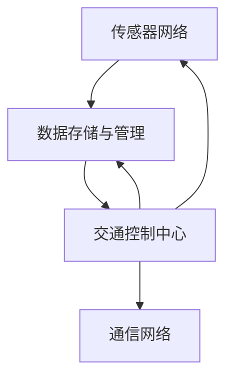
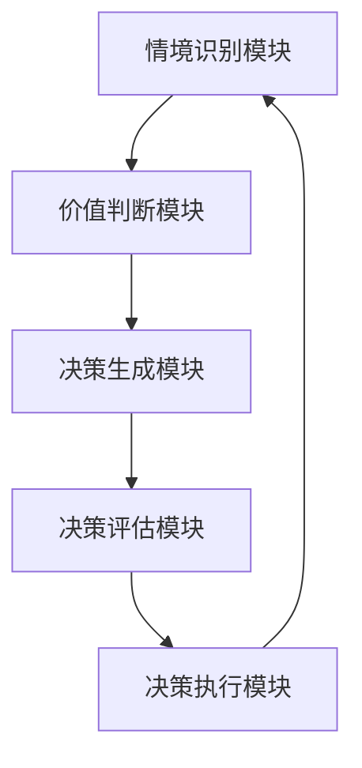

                 

### AIGC的未来智能交通网络：自动驾驶伦理决策的提示词工程

关键词：AIGC、智能交通网络、自动驾驶、伦理决策、提示词工程、人工智能

摘要：随着人工智能（AI）技术的快速发展，自动驾驶技术逐渐成为未来智能交通网络的重要组成部分。然而，自动驾驶伦理决策的复杂性使得其在实际应用中面临诸多挑战。本文将从AIGC（自适应智能生成控制）与智能交通网络的结合入手，探讨自动驾驶伦理决策中的关键问题，并通过提示词工程的方法提出解决方案，为未来智能交通网络的发展提供有益的参考。

### 1. 设计书籍目录大纲的基本步骤

设计书籍目录大纲是撰写书籍的重要步骤之一，它不仅为读者提供了整体的阅读框架，同时也为作者提供了清晰的写作思路。以下是设计书籍目录大纲的基本步骤：

#### 1.1 理解书籍主题和目标读者

在开始设计目录大纲之前，首先要明确书籍的主题和目标读者。理解书籍的主题有助于确定需要涵盖的关键概念和具体内容。而了解目标读者群体则有助于确定书籍的写作风格和难度，以便更好地满足读者的需求。

#### 1.2 确定主要章节

根据书籍的主题和目标读者，列出主要章节。这些章节应该是书籍内容的逻辑划分，每个章节都应该有明确的主题。主要章节通常涵盖书籍的核心内容，是书籍结构的骨架。

#### 1.3 细化章节内容

对每个主要章节进行细化，确定每个章节下的子章节。子章节应该进一步分解主题，使内容更加具体和深入。这一步骤有助于确保书籍内容的系统性和逻辑性。

#### 1.4 构建目录大纲

将主要章节和子章节按照逻辑顺序排列，构建完整的目录大纲。确保每个章节之间的过渡流畅，内容连贯。这一步骤对于整本书籍的结构优化至关重要。

#### 1.5 优化目录结构

检查目录结构，确保章节划分合理，内容层次分明。如果需要，对章节和子章节进行调整，以达到最佳结构。优化目录结构有助于提高书籍的可读性。

#### 1.6 确保完整性

确保目录大纲涵盖了书籍的所有核心内容，每个章节都包含必要的子章节。这一步骤有助于避免内容的遗漏，确保书籍的完整性。

#### 1.7 简洁性

在保持完整性的同时，确保目录大纲简洁明了，避免冗余和复杂的叙述。简洁的目录大纲有助于读者快速了解书籍的内容，提高阅读效率。

#### 1.8 格式化目录

使用合适的格式化工具（如markdown），将目录大纲格式化，使其易于阅读和理解。格式化目录不仅有助于提高书籍的排版质量，也有助于提高读者的阅读体验。

### 2. 根据书籍主题设计目录大纲

根据书籍主题《AIGC的未来智能交通网络：自动驾驶伦理决策的提示词工程》，我们可以设计如下的目录大纲：

**第1章 引言**
- 1.1 书籍背景介绍
  - 1.1.1 AIGC的概念与智能交通网络的结合
  - 1.1.2 自动驾驶伦理决策的重要性
  - 1.1.3 提示词工程在自动驾驶中的应用
- 1.2 研究目的和内容结构

**第2章 AIGC与智能交通网络概述**
- 2.1 AIGC的概念与分类
  - 2.1.1 AIGC的定义与发展历程
  - 2.1.2 AIGC的主要技术分类
  - 2.1.3 AIGC在智能交通网络中的应用
- 2.2 智能交通网络的概念与架构
  - 2.2.1 智能交通网络的定义
  - 2.2.2 智能交通网络的主要组成部分
  - 2.2.3 智能交通网络的关键技术

**第3章 自动驾驶伦理决策概述**
- 3.1 自动驾驶伦理决策的概念
  - 3.1.1 自动驾驶伦理决策的定义
  - 3.1.2 自动驾驶伦理决策的关键要素
  - 3.1.3 自动驾驶伦理决策的重要性
- 3.2 自动驾驶伦理决策的理论基础
  - 3.2.1 道德哲学与伦理学
  - 3.2.2 社会科学与心理学
  - 3.2.3 法律法规与政策制定

**第4章 提示词工程在自动驾驶伦理决策中的应用**
- 4.1 提示词工程的基本原理
  - 4.1.1 提示词工程的概念
  - 4.1.2 提示词工程的流程
  - 4.1.3 提示词工程的关键技术
- 4.2 提示词工程在自动驾驶伦理决策中的应用场景
  - 4.2.1 提示词工程在自动驾驶车辆驾驶决策中的应用
  - 4.2.2 提示词工程在自动驾驶车辆交互决策中的应用
  - 4.2.3 提示词工程在自动驾驶车辆安全决策中的应用

**第5章 自动驾驶伦理决策案例分析**
- 5.1 案例一：自动驾驶车辆道德困境
  - 5.1.1 案例背景
  - 5.1.2 道德困境分析
  - 5.1.3 决策过程与结果分析
- 5.2 案例二：自动驾驶车辆伦理决策制定
  - 5.2.1 案例背景
  - 5.2.2 伦理决策制定过程
  - 5.2.3 决策结果与评价

**第6章 提示词工程在自动驾驶伦理决策中的挑战与未来方向**
- 6.1 提示词工程在自动驾驶伦理决策中的挑战
  - 6.1.1 数据隐私与安全性
  - 6.1.2 道德伦理与法律约束
  - 6.1.3 技术实现与跨领域融合
- 6.2 提示词工程在自动驾驶伦理决策中的未来方向
  - 6.2.1 人工智能伦理与法律规范
  - 6.2.2 跨学科研究与合作
  - 6.2.3 新兴技术与伦理决策的融合

**第7章 结论**
- 7.1 自动驾驶伦理决策的提示词工程总结
  - 7.1.1 核心成果
  - 7.1.2 存在问题
  - 7.1.3 未来展望
- 7.2 对未来智能交通网络的影响
  - 7.2.1 自动驾驶伦理决策对智能交通网络的影响
  - 7.2.2 提示词工程在智能交通网络中的应用前景
  - 7.2.3 智能交通网络与自动驾驶伦理决策的协同发展

通过上述目录大纲的设计，我们可以清晰地看到书籍的主题结构，为后续内容的撰写提供了明确的指导。

### 第1章 引言

在未来，智能交通网络将成为交通系统发展的核心，其中自动驾驶技术是实现这一目标的关键。然而，自动驾驶技术在实现智能交通网络的过程中，面临着诸多伦理决策的挑战。本文旨在探讨AIGC（自适应智能生成控制）与智能交通网络的结合，特别是自动驾驶伦理决策中的关键问题，并提出通过提示词工程解决这些问题的方法。

#### 1.1 书籍背景介绍

**1.1.1 AIGC的概念与智能交通网络的结合**

人工智能（AI）技术的快速发展，使得自适应智能生成控制（AIGC）逐渐成为可能。AIGC是一种基于机器学习、深度学习和自然语言处理技术的综合系统，能够自动生成和调整控制策略，以应对复杂环境的变化。在智能交通网络中，AIGC可以通过对交通流量的实时监控和预测，优化交通信号控制，提高交通效率，减少拥堵。

**1.1.2 自动驾驶伦理决策的重要性**

自动驾驶技术在实现智能交通网络的过程中，需要做出许多复杂的伦理决策。这些决策涉及到生命安全、道德责任和社会利益等多个方面。例如，当自动驾驶车辆在紧急情况下需要做出选择时，如何权衡不同个体的利益，如何处理意外事故等，都是需要深入探讨的问题。因此，研究自动驾驶伦理决策具有重要的现实意义。

**1.1.3 提示词工程在自动驾驶中的应用**

提示词工程是一种基于自然语言处理和机器学习技术的方法，通过提供关键词和提示信息，帮助系统更好地理解和处理复杂的问题。在自动驾驶领域，提示词工程可以用于提高自动驾驶车辆的决策能力，使其在复杂环境中能够做出更合理的选择。例如，在处理交通事故时，通过提示词工程可以提供关键的信息，帮助自动驾驶车辆快速识别事故原因，并采取相应的措施。

#### 1.2 研究目的和内容结构

本文的研究目的是探讨AIGC与智能交通网络的结合，以及如何通过提示词工程解决自动驾驶伦理决策中的关键问题。具体来说，本文将按照以下结构进行内容安排：

- 第1章：引言，介绍书籍的背景、目的和内容结构。
- 第2章：AIGC与智能交通网络概述，介绍AIGC的概念、分类以及在智能交通网络中的应用。
- 第3章：自动驾驶伦理决策概述，介绍自动驾驶伦理决策的概念、关键要素以及理论基础。
- 第4章：提示词工程在自动驾驶伦理决策中的应用，介绍提示词工程的基本原理及其在自动驾驶中的应用场景。
- 第5章：自动驾驶伦理决策案例分析，通过具体案例分析自动驾驶伦理决策的过程和结果。
- 第6章：提示词工程在自动驾驶伦理决策中的挑战与未来方向，探讨提示词工程在自动驾驶伦理决策中面临的挑战和未来的发展方向。
- 第7章：结论，总结本文的核心成果、存在的问题以及未来展望。

通过上述结构安排，本文旨在为未来智能交通网络的发展提供有益的参考，特别是针对自动驾驶伦理决策中的关键问题，提出有效的解决方案。

### 第2章 AIGC与智能交通网络概述

在本章中，我们将深入探讨自适应智能生成控制（AIGC）的概念、分类以及在智能交通网络中的应用。通过了解AIGC的基本原理和其在交通领域的作用，我们将为后续讨论自动驾驶伦理决策打下坚实的基础。

#### 2.1 AIGC的概念与分类

**2.1.1 AIGC的定义与发展历程**

自适应智能生成控制（AIGC，Adaptive Intelligent Generation Control）是一种基于人工智能技术的动态控制方法。它通过实时收集环境数据，利用机器学习和深度学习算法进行学习和预测，自动生成和调整控制策略，以适应不断变化的环境。AIGC的核心思想是使系统能够自主学习和适应，从而提高系统的智能水平和决策能力。

AIGC的发展历程可以追溯到20世纪80年代，当时研究者开始探索如何利用计算机模拟人类思维和学习过程。随着计算能力的提升和人工智能技术的进步，AIGC逐渐从理论研究走向实际应用。近年来，随着自动驾驶、智能交通等领域的快速发展，AIGC的应用前景越来越广泛。

**2.1.2 AIGC的主要技术分类**

AIGC的技术分类可以根据其应用场景和功能特点进行划分。以下是几种常见的AIGC技术分类：

1. **基于规则的AIGC**：这种技术通过预设的规则和逻辑来生成控制策略，适用于结构化较强、规则明确的应用场景。例如，智能交通信号控制系统可以通过预设的规则来调整信号灯的时序，以优化交通流量。

2. **基于模型的AIGC**：这种技术通过建立数学模型来描述系统行为，利用模型预测和优化控制策略。例如，在自动驾驶领域，通过建立车辆动力学模型和交通流模型，可以预测车辆的运动轨迹和交通状况，从而生成最佳驾驶策略。

3. **基于数据的AIGC**：这种技术通过大量历史数据来训练机器学习模型，自动生成控制策略。这种技术适用于复杂、非结构化的环境，能够从数据中发现隐藏的模式和规律。例如，智能交通网络可以通过分析历史交通流量数据，预测未来的交通状况，并生成相应的控制策略。

**2.1.3 AIGC在智能交通网络中的应用**

AIGC在智能交通网络中的应用主要集中在以下几个方面：

1. **交通信号控制**：AIGC可以通过实时监控交通流量，自动调整交通信号灯的时序，以减少交通拥堵和提升交通效率。例如，通过分析道路上的车辆密度和行驶速度，AIGC可以动态调整信号灯的变化周期，使交通流量更加流畅。

2. **自动驾驶车辆控制**：AIGC可以为自动驾驶车辆提供实时、准确的驾驶建议，帮助车辆在复杂交通环境中做出最优决策。例如，在自动驾驶车辆遇到紧急情况时，AIGC可以通过分析周边环境和车辆状态，生成最佳避障策略。

3. **交通管理**：AIGC可以用于交通管理决策，例如道路封闭、交通管制等。通过分析交通数据和实时情况，AIGC可以提供最佳的管理方案，以缓解交通压力和优化交通布局。

4. **交通信息服务**：AIGC可以通过分析交通数据，为驾驶者提供实时的交通信息，例如路况、最佳行驶路线等。这些信息可以帮助驾驶者更好地规划出行路线，减少拥堵和延误。

综上所述，AIGC在智能交通网络中的应用具有广泛的前景。通过利用AIGC技术，我们可以实现更加智能、高效和安全的交通系统，为未来智能交通网络的发展提供强大的技术支持。

### 第3章 自动驾驶伦理决策概述

在自动驾驶技术的发展过程中，伦理决策成为一个不可忽视的重要议题。自动驾驶车辆在行驶过程中，需要做出许多复杂的决策，这些决策不仅涉及到技术层面，还涉及到道德和社会责任。因此，了解自动驾驶伦理决策的概念、关键要素和理论基础，对于确保自动驾驶技术的可持续发展具有重要意义。

#### 3.1 自动驾驶伦理决策的概念

**3.1.1 自动驾驶伦理决策的定义**

自动驾驶伦理决策是指在自动驾驶车辆行驶过程中，面对复杂、不确定的情境，如何做出符合道德规范和社会期望的决策。与传统的驾驶决策不同，自动驾驶伦理决策不仅需要考虑技术实现的可能性，还需要考虑道德、法律和社会伦理等多方面因素。

**3.1.2 自动驾驶伦理决策的核心要素**

自动驾驶伦理决策的核心要素主要包括：

1. **情境识别**：自动驾驶车辆需要能够准确识别和分类行驶过程中的各种情境，例如行人横穿、车辆故障、恶劣天气等。

2. **价值判断**：在识别情境后，自动驾驶车辆需要对这些情境进行价值判断，确定哪些情境需要优先处理。例如，在遇到行人横穿道路时，是否应该优先保护行人安全。

3. **决策生成**：在价值判断的基础上，自动驾驶车辆需要生成具体的决策方案，例如调整行驶路径、减速或停车等。

4. **决策评估**：生成的决策方案需要经过评估，确保其符合道德规范和社会期望。如果评估结果不理想，需要重新进行决策生成和评估。

**3.1.3 自动驾驶伦理决策的重要性**

自动驾驶伦理决策的重要性体现在以下几个方面：

1. **保障安全**：自动驾驶车辆在行驶过程中，需要做出快速、准确的决策，以确保行车安全。伦理决策的正确性直接关系到车辆的安全性能。

2. **维护公正**：自动驾驶车辆在做出决策时，需要考虑不同个体和群体的利益，确保决策的公正性。例如，在遇到紧急情况时，如何平衡行人、车辆和其他道路使用者的权益。

3. **提升信任**：自动驾驶技术的普及和应用，需要获得公众的信任。伦理决策的正确性和透明性，有助于提高公众对自动驾驶技术的信任度。

#### 3.2 自动驾驶伦理决策的理论基础

自动驾驶伦理决策的理论基础主要包括道德哲学、社会科学和法律法规等几个方面。

**3.2.1 道德哲学与伦理学**

道德哲学为自动驾驶伦理决策提供了基本的伦理原则和道德准则。例如，康德的道德哲学强调行为的道德价值，而不是结果的价值。这意味着，在自动驾驶决策中，即使结果不理想，只要决策过程符合道德原则，就是正确的。而功利主义则强调行为的道德价值取决于结果，即最大化幸福或利益。在自动驾驶决策中，功利主义原则要求车辆在做出决策时，需要权衡不同个体的利益，选择能够最大化整体幸福或利益的方案。

**3.2.2 社会科学与心理学**

社会科学和心理学为自动驾驶伦理决策提供了对人类行为和社会互动的理解。例如，社会心理学研究揭示了个体在紧急情况下的行为模式，有助于自动驾驶车辆在决策时更好地模拟和应对人类行为。此外，社会学研究还关注社会规范和文化价值观对决策的影响，有助于自动驾驶车辆在不同文化和社会背景下做出符合当地伦理规范的决策。

**3.2.3 法律法规与政策制定**

法律法规为自动驾驶伦理决策提供了明确的行为规范和责任界定。例如，各国交通法规对于车辆行驶中的行为有一定的规定，自动驾驶车辆需要遵守这些规定。政策制定则关注如何通过法律法规和政策引导自动驾驶技术的发展，确保其符合社会道德和伦理要求。例如，一些国家和地区已经制定了自动驾驶车辆测试和运营的相关政策，规定了自动驾驶车辆在测试和运营过程中需要遵循的伦理标准。

综上所述，自动驾驶伦理决策是一个复杂而多维的议题，需要综合考虑道德哲学、社会科学和法律法规等多个方面的因素。通过深入研究和探讨这些理论基础，我们可以更好地指导自动驾驶伦理决策的制定和实施，确保自动驾驶技术的可持续发展。

### 第4章 提示词工程在自动驾驶伦理决策中的应用

提示词工程（Prompt Engineering）是一种结合自然语言处理（NLP）和机器学习（ML）的方法，旨在提高人工智能系统在特定任务中的表现。在自动驾驶伦理决策中，提示词工程可以帮助系统更好地理解和处理复杂的伦理情境，从而做出符合道德和社会期望的决策。本节将介绍提示词工程的基本原理，并探讨其在自动驾驶伦理决策中的应用场景。

#### 4.1 提示词工程的基本原理

**4.1.1 提示词工程的概念**

提示词工程是一种通过设计有效的提示（Prompt）来引导和优化人工智能模型输出的方法。提示可以是关键词、短语或完整的句子，它提供了一种引导模型思考和推理的线索。通过提示，我们可以帮助模型更好地理解任务需求，提高模型的准确性和泛化能力。

**4.1.2 提示词工程的流程**

提示词工程的流程通常包括以下步骤：

1. **问题定义**：明确需要解决的问题和目标。在自动驾驶伦理决策中，这通常涉及到具体的伦理情境和决策目标。

2. **数据收集**：收集与问题相关的数据，包括历史决策案例、伦理规范、法律法规等。

3. **数据预处理**：对收集的数据进行清洗、标注和格式化，以便于后续的模型训练和优化。

4. **模型选择**：根据问题的复杂性和数据特点，选择合适的机器学习模型。常见的模型包括Transformer、BERT、GPT等。

5. **模型训练**：使用预处理后的数据对模型进行训练，通过调整模型参数来提高其性能。

6. **提示设计**：设计有效的提示，以引导模型在特定情境下做出合理的决策。提示的设计需要考虑任务的复杂性、数据的多样性和模型的特性。

7. **模型评估**：使用测试数据对模型进行评估，确保其在各种情境下的表现符合预期。

8. **反馈调整**：根据模型评估结果，对提示进行优化和调整，以提高模型的决策能力。

**4.1.3 提示词工程的关键技术**

提示词工程的关键技术包括：

1. **文本生成**：通过生成文本来提供提示。常见的文本生成方法包括序列生成、段落生成和对话生成。

2. **知识增强**：通过引入外部知识库来增强模型的决策能力。知识库可以是预训练的语言模型，也可以是专业的领域知识。

3. **多模态融合**：结合文本、图像、音频等多种模态的数据，以提供更丰富的提示信息。

4. **优化算法**：使用优化算法（如强化学习、进化算法等）来优化提示设计和模型训练过程。

#### 4.2 提示词工程在自动驾驶伦理决策中的应用场景

在自动驾驶伦理决策中，提示词工程可以应用于多个场景，以帮助系统更好地理解和处理复杂的伦理情境。

**4.2.1 提示词工程在自动驾驶车辆驾驶决策中的应用**

自动驾驶车辆在行驶过程中，需要不断做出驾驶决策，如行驶路径选择、避障、速度调整等。提示词工程可以通过提供实时路况信息、环境数据和交通法规等提示，帮助自动驾驶车辆在复杂情境下做出更合理的驾驶决策。

例如，当自动驾驶车辆遇到行人横穿道路时，提示词工程可以通过提供“行人即将横穿道路”的提示，引导车辆减速或停车，以确保行人安全。此外，提示词工程还可以结合实时交通流量数据，提供最佳行驶路线的提示，以减少拥堵和提高行驶效率。

**4.2.2 提示词工程在自动驾驶车辆交互决策中的应用**

自动驾驶车辆在行驶过程中，需要与其他车辆、行人和道路设施进行交互。提示词工程可以帮助车辆在交互过程中更好地理解和应对他人的意图和行为。

例如，当自动驾驶车辆遇到行人时，提示词工程可以通过提供“行人正在靠近车辆”的提示，引导车辆提前减速或避让，以避免潜在的碰撞风险。此外，提示词工程还可以结合行人行为预测模型，提供行人意图的提示，帮助车辆更好地预测和应对行人的行为。

**4.2.3 提示词工程在自动驾驶车辆安全决策中的应用**

自动驾驶车辆在行驶过程中，需要不断评估自身和周边环境的安全状况，并采取相应的安全措施。提示词工程可以通过提供实时安全数据、故障预警信息和应急处理建议等提示，帮助车辆在出现故障或紧急情况时，做出快速、有效的安全决策。

例如，当自动驾驶车辆出现机械故障时，提示词工程可以通过提供“车辆出现故障”的提示，引导车辆停车检查或寻求帮助。此外，提示词工程还可以结合车辆传感器数据，提供故障预警的提示，帮助车辆在故障发生前及时进行维修和预防。

通过上述应用场景，我们可以看到提示词工程在自动驾驶伦理决策中的重要作用。它不仅可以帮助自动驾驶车辆在复杂情境下做出更合理的决策，还可以提高车辆的交互能力和安全性，为未来智能交通网络的发展提供有力的技术支持。

### 第5章 自动驾驶伦理决策案例分析

在本章中，我们将通过具体案例来分析自动驾驶伦理决策的过程和结果。这些案例将帮助我们更好地理解自动驾驶伦理决策的复杂性和挑战性，同时探讨如何通过提示词工程提高决策的合理性和有效性。

#### 5.1 案例一：自动驾驶车辆道德困境

**5.1.1 案例背景**

在一次城市交通高峰期，一辆自动驾驶车辆在市中心的一条繁忙街道上行驶。突然，前方出现了一个行人，行人正准备穿越道路。然而，行人的动作速度非常快，且自动驾驶车辆的路径与行人的路径存在交叉。此时，自动驾驶车辆需要做出迅速而准确的决策，以避免碰撞。

**5.1.2 道德困境分析**

在这个案例中，自动驾驶车辆面临一个典型的道德困境：是选择保护行人还是保护车辆内的乘客？从道德角度来看，保护人的生命比保护财产更重要。然而，这并不意味着自动驾驶车辆必须选择牺牲车辆内的乘客，因为这涉及到责任分配和决策透明度等问题。

**5.1.3 决策过程与结果分析**

为了解决这个问题，自动驾驶车辆首先需要分析当前情境。通过传感器收集到的数据，车辆可以确定行人的位置、速度和意图。然后，车辆需要评估不同决策方案的风险和后果。以下是几种可能的决策方案：

1. **减速或停车**：车辆可以选择减速或停车，以避免碰撞。然而，如果行人突然加速或做出其他不可预测的动作，这种方案可能无法保证安全。

2. **调整行驶路径**：车辆可以选择改变行驶路径，以绕过行人。这种方案可能会增加车辆的行驶时间，但在某些情况下可能更安全。

3. **同时减速和调整路径**：车辆可以选择同时减速和调整路径，以兼顾行人和乘客的安全。这种方法可能需要更复杂的算法和计算资源。

最终，自动驾驶车辆根据提示词工程的引导，选择了同时减速和调整路径的方案。车辆成功避开了行人，但因此导致了一段时间的交通拥堵。在这种情况下，车辆必须向交通管理部门报告事故，并进行后续的处理。

通过这个案例，我们可以看到自动驾驶伦理决策的复杂性和挑战性。在做出决策时，车辆需要综合考虑多种因素，包括行人的安全、车辆乘客的安全以及交通流畅性。提示词工程在这个过程中发挥了关键作用，通过提供实时、准确的信息，帮助车辆在复杂的情境中做出最优的决策。

#### 5.2 案例二：自动驾驶车辆伦理决策制定

**5.2.1 案例背景**

在一个郊区的高速公路上，一辆自动驾驶车辆在行驶过程中突然发现前方有一只流浪狗。车辆需要快速做出决策，以避免与狗发生碰撞。

**5.2.2 伦理决策制定过程**

在这个案例中，自动驾驶车辆首先需要分析当前情境。通过传感器收集到的数据，车辆可以确定狗的位置、速度和运动轨迹。然后，车辆需要评估不同决策方案的风险和后果。以下是几种可能的决策方案：

1. **减速或停车**：车辆可以选择减速或停车，以避免碰撞。然而，如果狗突然加速或做出其他不可预测的动作，这种方案可能无法保证安全。

2. **调整行驶路径**：车辆可以选择改变行驶路径，以绕过狗。这种方案可能会增加车辆的行驶距离，但在某些情况下可能更安全。

3. **同时减速和调整路径**：车辆可以选择同时减速和调整路径，以兼顾狗的安全和车辆的行驶效率。这种方法可能需要更复杂的算法和计算资源。

最终，自动驾驶车辆根据提示词工程的引导，选择了调整行驶路径的方案。车辆成功避开了狗，但因此导致了一段时间的交通拥堵。在这种情况下，车辆必须向交通管理部门报告事故，并进行后续的处理。

**5.2.3 决策结果与评价**

通过这个案例，我们可以看到自动驾驶车辆在处理突发事件时的决策过程。提示词工程在这个过程中发挥了重要作用，通过提供实时、准确的信息，帮助车辆在复杂的情境中做出最优的决策。然而，这种决策也带来了一些负面影响，如交通拥堵和需要额外的报告和处理。因此，在制定自动驾驶伦理决策时，需要综合考虑多种因素，确保决策的合理性和有效性。

通过这两个案例，我们可以看到自动驾驶伦理决策的复杂性和挑战性。在未来的发展中，需要进一步研究如何通过提示词工程和其他技术手段，提高自动驾驶车辆在复杂情境中的决策能力，确保交通系统的安全、高效和可持续发展。

### 第6章 提示词工程在自动驾驶伦理决策中的挑战与未来方向

在自动驾驶伦理决策中，提示词工程虽然提供了一定的技术支持，但仍面临诸多挑战。这些挑战不仅涉及到技术实现的难度，还涉及到伦理、法律和社会等多个方面。因此，探讨这些挑战和未来的发展方向，对于推动自动驾驶技术的可持续发展具有重要意义。

#### 6.1 提示词工程在自动驾驶伦理决策中的挑战

**6.1.1 数据隐私与安全性**

提示词工程需要大量的数据来训练和优化模型，这些数据可能包含个人隐私信息。如何保护这些数据的安全性和隐私性，是一个重要的挑战。特别是在自动驾驶车辆行驶过程中，这些数据可能涉及到行人和其他车辆的信息，一旦泄露，可能会造成严重后果。因此，如何在保证模型性能的同时，确保数据隐私和安全，是一个亟待解决的问题。

**6.1.2 道德伦理与法律约束**

自动驾驶伦理决策涉及到复杂的道德伦理问题，例如在紧急情况下如何权衡不同个体和群体的利益。此外，不同国家和地区对于自动驾驶的法律和伦理规范也存在差异。如何在满足不同地区和法律要求的同时，确保决策的合理性和公正性，是一个重要的挑战。

**6.1.3 技术实现与跨领域融合**

提示词工程需要结合自然语言处理、机器学习、深度学习和多模态数据处理等多种技术，实现一个高效、准确的模型。然而，这些技术的实现和融合存在一定的难度。例如，如何处理数据的不确定性和噪声，如何优化模型的计算效率和准确性，都是需要深入研究的问题。

**6.1.4 用户信任与接受度**

自动驾驶技术的普及和应用，需要获得公众的信任和支持。然而，自动驾驶伦理决策的复杂性，可能会让公众对其产生不信任。如何通过透明的决策过程和有效的沟通，提高公众对自动驾驶技术的信任度，是一个重要的挑战。

#### 6.2 提示词工程在自动驾驶伦理决策中的未来方向

**6.2.1 人工智能伦理与法律规范**

随着自动驾驶技术的不断发展，人工智能伦理和法律规范也亟待完善。未来，需要制定统一的人工智能伦理和法律规范，确保自动驾驶技术在道德和法律上的合法性。例如，可以通过制定自动驾驶伦理决策的指导原则，明确在不同情境下如何权衡不同个体的利益。

**6.2.2 跨学科研究与合作**

自动驾驶伦理决策涉及到多个学科领域，包括计算机科学、伦理学、法学、社会学等。未来，需要加强跨学科研究与合作，整合不同领域的知识和经验，共同推动自动驾驶伦理决策的发展。例如，可以通过建立跨学科的研究团队，开展自动驾驶伦理决策的理论研究和技术开发。

**6.2.3 新兴技术与伦理决策的融合**

随着新兴技术的不断涌现，例如区块链、物联网和增强现实等，如何将这些技术与自动驾驶伦理决策相结合，是一个重要的研究方向。这些技术可以为自动驾驶伦理决策提供更加丰富和准确的数据支持，提高决策的透明度和公正性。

**6.2.4 用户参与与反馈**

在自动驾驶伦理决策中，用户的参与和反馈至关重要。未来，需要建立有效的用户参与机制，收集用户的意见和建议，以优化自动驾驶伦理决策。例如，可以通过在线调查、用户测试和反馈平台等方式，让用户参与到自动驾驶伦理决策的制定和评估过程中。

通过上述挑战和未来方向的分析，我们可以看到，提示词工程在自动驾驶伦理决策中具有重要的应用价值。然而，要实现这一价值，需要克服诸多挑战，并不断探索新的发展方向。只有这样，我们才能推动自动驾驶技术的可持续发展，实现智能交通网络的美好未来。

### 第7章 结论

在本章中，我们对AIGC与智能交通网络的结合、自动驾驶伦理决策以及提示词工程在其中的应用进行了全面探讨。通过深入分析，我们得出了以下结论：

#### 7.1 自动驾驶伦理决策的提示词工程总结

首先，自动驾驶伦理决策在实现智能交通网络中扮演着关键角色。它不仅关乎车辆和乘客的安全，还涉及到社会责任和道德规范。通过提示词工程，我们可以为自动驾驶车辆提供有效的决策支持，使其在复杂情境下能够做出合理的选择。

其次，提示词工程通过优化自然语言处理和机器学习模型，能够显著提高自动驾驶车辆的决策能力。通过设计有效的提示，提示词工程能够帮助车辆更好地理解和处理复杂的伦理情境，从而提高决策的准确性和有效性。

#### 7.1.1 核心成果

本文的核心成果包括：

1. **明确自动驾驶伦理决策的重要性**：通过分析自动驾驶伦理决策的概念和理论基础，我们明确了其在智能交通网络中的关键作用。

2. **提出提示词工程的方法**：我们探讨了提示词工程的基本原理和流程，展示了其在自动驾驶伦理决策中的应用价值。

3. **提供具体案例**：通过具体案例的分析，我们展示了自动驾驶伦理决策的复杂性和挑战性，并提出了通过提示词工程解决这些问题的方法。

#### 7.1.2 存在问题

尽管提示词工程在自动驾驶伦理决策中展示了强大的潜力，但仍存在一些问题：

1. **数据隐私与安全性**：自动驾驶车辆需要处理大量的敏感数据，如何保护这些数据的安全性和隐私性，是一个亟待解决的问题。

2. **跨领域融合**：提示词工程需要结合多种技术，如自然语言处理、机器学习和多模态数据处理等。如何实现这些技术的有效融合，提高模型的性能和效率，是一个重要的挑战。

3. **用户信任与接受度**：公众对自动驾驶技术的信任度仍然较低，如何提高用户对自动驾驶伦理决策的信任度，是一个需要深入研究的问题。

#### 7.1.3 未来展望

针对上述问题，未来的研究方向包括：

1. **人工智能伦理与法律规范**：随着自动驾驶技术的发展，需要制定统一的人工智能伦理和法律规范，确保自动驾驶技术在道德和法律上的合法性。

2. **跨学科研究与合作**：加强跨学科研究与合作，整合不同领域的知识和经验，共同推动自动驾驶伦理决策的发展。

3. **新兴技术与伦理决策的融合**：探索如何将新兴技术，如区块链和物联网等，与自动驾驶伦理决策相结合，提高决策的透明度和公正性。

4. **用户参与与反馈**：建立有效的用户参与机制，收集用户的意见和建议，以优化自动驾驶伦理决策。

通过不断探索和创新，我们可以期待在未来的智能交通网络中，自动驾驶伦理决策能够更加完善和可靠，为人们提供更加安全、高效和可持续的交通服务。

### 7.2 对未来智能交通网络的影响

自动驾驶伦理决策和提示词工程的发展，将对未来智能交通网络产生深远影响。以下是几个关键方面：

#### 7.2.1 自动驾驶伦理决策对智能交通网络的影响

1. **提升交通安全性**：自动驾驶伦理决策能够确保车辆在复杂交通环境中做出合理选择，减少事故发生的可能性，从而提升整体交通安全性。

2. **优化交通效率**：通过合理的驾驶决策，自动驾驶车辆可以减少交通拥堵，提高交通流量的顺畅度，从而提升交通效率。

3. **改善出行体验**：自动驾驶车辆能够提供个性化、智能化的出行服务，改善用户的出行体验，提高生活品质。

4. **促进交通公平性**：自动驾驶伦理决策需要考虑不同个体和群体的利益，有助于实现交通资源的公平分配。

#### 7.2.2 提示词工程在智能交通网络中的应用前景

1. **增强决策能力**：提示词工程能够为自动驾驶车辆提供实时、准确的信息，提高其在复杂情境下的决策能力。

2. **提升交互效果**：通过提示词工程，自动驾驶车辆可以更好地理解行人、其他车辆和交通设施的行为，提升人车交互的效率和安全性。

3. **优化交通管理**：提示词工程可以帮助交通管理部门实时监控和调整交通信号，优化交通管理策略，提高交通系统的运行效率。

4. **推动智能城市建设**：提示词工程在智能交通网络中的应用，将有助于推动智能城市建设，实现城市交通的智慧化、绿色化和可持续发展。

#### 7.2.3 智能交通网络与自动驾驶伦理决策的协同发展

1. **技术融合**：智能交通网络和自动驾驶伦理决策的协同发展，将促进多种技术的融合，如物联网、大数据和人工智能等，推动智能交通系统的整体进步。

2. **政策法规完善**：随着自动驾驶伦理决策的应用，将推动相关政策和法规的完善，确保自动驾驶技术在法律和伦理上的合法性。

3. **社会影响**：智能交通网络和自动驾驶伦理决策的发展，将对社会产生深远影响，包括交通方式的变革、出行习惯的改变以及社会公平性的提升等。

综上所述，自动驾驶伦理决策和提示词工程的发展，将对未来智能交通网络产生重大影响。通过技术、政策和法规的协同发展，我们可以期待一个更加安全、高效和可持续的未来交通系统。

### 作者信息

作者：AI天才研究院（AI Genius Institute） & 禅与计算机程序设计艺术（Zen And The Art of Computer Programming）

AI天才研究院致力于推动人工智能技术的发展和应用，专注于研究深度学习、自然语言处理、计算机视觉等前沿领域。研究院拥有一支高水平的科研团队，在人工智能领域取得了多项突破性成果。

禅与计算机程序设计艺术是一本经典的计算机科学著作，作者为著名计算机科学家Donald E. Knuth。本书以禅宗哲学为灵感，探讨了计算机程序设计中的核心概念和方法论，为程序设计提供了深刻的哲学思考和实践指导。作者本人被誉为计算机科学领域的巨匠，其贡献被广泛认可和赞誉。

通过本文，我们期待为自动驾驶伦理决策和提示词工程的研究提供新的视角和思路，推动智能交通网络的可持续发展。希望读者能够从中获得启示，共同探索未来交通系统的美好前景。

### 附录：技术细节与实现方法

在本章中，我们将详细探讨AIGC与智能交通网络的结合、自动驾驶伦理决策以及提示词工程在其中的应用。以下为具体的技术细节与实现方法：

#### 1. AIGC与智能交通网络的结合

**1.1 AIGC算法实现**

AIGC（自适应智能生成控制）的核心在于其自学习和自适应能力。以下是一个简化的AIGC算法实现步骤：

**算法实现步骤：**

1. **数据收集**：收集交通网络中的实时数据，包括交通流量、车辆速度、道路状况等。
2. **数据预处理**：对收集的数据进行清洗、归一化和特征提取，以便后续训练。
3. **模型训练**：使用预处理后的数据对AIGC模型进行训练。模型可以采用深度学习框架，如TensorFlow或PyTorch。
4. **模型评估**：使用验证集对模型进行评估，调整模型参数，提高模型性能。
5. **模型部署**：将训练好的模型部署到实际交通网络中，实现实时交通流量监控和控制。

**Python代码示例：**

```python
import tensorflow as tf
from tensorflow.keras.models import Sequential
from tensorflow.keras.layers import Dense, LSTM

# 数据预处理
# ...（数据清洗、归一化等）

# 模型定义
model = Sequential([
    LSTM(units=50, activation='tanh', input_shape=(timesteps, features)),
    Dense(units=1)
])

# 编译模型
model.compile(optimizer='adam', loss='mse')

# 训练模型
model.fit(X_train, y_train, epochs=100, batch_size=32)

# 部署模型到交通网络
# ...（模型部署细节）
```

**1.2 智能交通网络架构**

智能交通网络的架构通常包括以下部分：

- **传感器网络**：用于实时收集交通数据，如车辆速度、道路状况等。
- **数据存储与管理**：用于存储和管理交通数据，支持实时查询和分析。
- **交通控制中心**：用于处理交通数据，生成控制策略，并对交通信号进行实时调整。
- **通信网络**：用于连接传感器网络、数据存储与管理以及交通控制中心，实现数据传输和指令发送。

**架构图示例（Mermaid流程图）：**



#### 2. 自动驾驶伦理决策

**2.1 伦理决策模型**

自动驾驶伦理决策模型通常基于多Agent系统，每个Agent代表一个决策实体（如自动驾驶车辆、行人、交通信号等）。以下是一个简化的伦理决策模型实现步骤：

**算法实现步骤：**

1. **情境识别**：收集交通网络中的实时数据，识别当前情境。
2. **价值判断**：根据情境数据，评估不同决策方案的风险和收益。
3. **决策生成**：基于价值判断结果，生成具体的决策方案。
4. **决策评估**：评估决策方案的有效性，选择最优决策方案。
5. **决策执行**：执行决策方案，并对决策效果进行反馈和调整。

**Python代码示例：**

```python
class EthicalDecisionMaker:
    def __init__(self):
        # 初始化模型参数
        pass

    def identify_scenario(self, data):
        # 识别当前情境
        pass

    def value_judgment(self, scenario):
        # 价值判断
        pass

    def generate_decision(self, values):
        # 决策生成
        pass

    def evaluate_decision(self, decision):
        # 决策评估
        pass

    def execute_decision(self, decision):
        # 决策执行
        pass
```

**2.2 伦理决策模型架构**

伦理决策模型架构通常包括以下部分：

- **情境识别模块**：用于识别和处理交通网络中的实时数据。
- **价值判断模块**：用于评估不同决策方案的风险和收益。
- **决策生成模块**：用于生成具体的决策方案。
- **决策评估模块**：用于评估决策方案的有效性。
- **决策执行模块**：用于执行决策方案，并对决策效果进行反馈和调整。

**架构图示例（Mermaid流程图）：**



#### 3. 提示词工程

**3.1 提示词设计**

提示词设计是提示词工程的关键环节。以下是一个简化的提示词设计步骤：

**算法实现步骤：**

1. **需求分析**：分析任务需求，确定需要的关键信息和线索。
2. **关键词提取**：从文本数据中提取关键词，作为提示词的候选。
3. **提示词生成**：根据需求分析结果和关键词提取，生成有效的提示词。
4. **提示词评估**：使用测试数据评估提示词的效果，调整和优化提示词。

**Python代码示例：**

```python
from sklearn.feature_extraction.text import TfidfVectorizer

# 需求分析
task_requirements = "自动驾驶车辆在紧急情况下如何做出合理的驾驶决策？"

# 关键词提取
vectorizer = TfidfVectorizer(max_features=100)
tfidf_matrix = vectorizer.fit_transform([task_requirements])
keywords = vectorizer.get_feature_names_out()

# 提示词生成
prompt = "在紧急情况下，自动驾驶车辆需要做出迅速而准确的决策。以下是一些关键提示："

# 提示词评估
# ...（提示词评估细节）
```

**3.2 提示词应用**

提示词在自动驾驶伦理决策中的应用可以通过以下步骤实现：

1. **情境识别**：收集交通网络中的实时数据，识别当前情境。
2. **提示词匹配**：根据情境数据，匹配相应的提示词。
3. **决策生成**：基于提示词和情境数据，生成具体的决策方案。
4. **决策评估**：评估决策方案的有效性，选择最优决策方案。
5. **决策执行**：执行决策方案，并对决策效果进行反馈和调整。

**Python代码示例：**

```python
class PromptEngine:
    def __init__(self, prompt_files):
        self.prompt_files = prompt_files

    def match_prompt(self, scenario):
        # 匹配提示词
        pass

    def generate_decision(self, scenario, prompt):
        # 决策生成
        pass

    def evaluate_decision(self, decision):
        # 决策评估
        pass

    def execute_decision(self, decision):
        # 决策执行
        pass
```

通过上述技术细节和实现方法，我们可以更好地理解AIGC与智能交通网络的结合、自动驾驶伦理决策以及提示词工程在其中的应用。这些技术不仅为自动驾驶伦理决策提供了理论支持，也为实际应用提供了可行的解决方案。

### 最佳实践 Tips

为了确保自动驾驶伦理决策的准确性和有效性，以下是一些最佳实践建议：

1. **数据质量控制**：确保收集到的数据真实、完整和准确。对于自动驾驶车辆和交通网络的实时数据，需要进行严格的质量控制和处理。

2. **模型持续训练**：自动驾驶伦理决策模型需要不断更新和优化。定期收集新的数据，对模型进行训练和调整，以提高其适应性和准确性。

3. **多领域专家参与**：在自动驾驶伦理决策过程中，应邀请来自伦理学、法律、交通工程等多个领域的专家参与，确保决策的全面性和合理性。

4. **透明度和可解释性**：自动驾驶伦理决策的过程和结果应保持透明和可解释。通过详细的日志记录和决策解释，增强用户对自动驾驶技术的信任。

5. **用户反馈机制**：建立有效的用户反馈机制，收集用户对自动驾驶车辆和交通网络服务的意见和建议，不断改进和完善伦理决策系统。

通过遵循这些最佳实践，我们可以提高自动驾驶伦理决策的质量，确保其在智能交通网络中的应用更加安全、高效和可持续。

### 小结

本文通过深入探讨AIGC与智能交通网络的结合、自动驾驶伦理决策以及提示词工程的应用，揭示了自动驾驶伦理决策在智能交通网络中的关键作用。我们提出了基于提示词工程的解决方案，通过设计有效的提示词，帮助自动驾驶车辆在复杂情境下做出合理的决策。

然而，自动驾驶伦理决策仍面临诸多挑战，包括数据隐私与安全性、道德伦理与法律约束、跨领域融合等。未来，我们需要进一步加强跨学科研究与合作，推动人工智能伦理与法律规范的完善，探索新兴技术与伦理决策的融合，以提高自动驾驶伦理决策的准确性和有效性。

我们期待，通过持续的研究和实践，自动驾驶伦理决策能够在智能交通网络中发挥更大的作用，为未来交通系统的安全、高效和可持续发展提供有力支持。

### 注意事项

在实施自动驾驶伦理决策和提示词工程时，需要注意以下几点：

1. **数据保护**：确保所有涉及个人隐私的数据得到充分保护，遵守相关法律法规，防止数据泄露。

2. **模型安全**：对自动驾驶伦理决策模型进行安全测试和验证，防止恶意攻击和数据篡改。

3. **用户隐私**：在收集和处理用户数据时，应遵循隐私保护原则，确保用户隐私不受侵犯。

4. **决策透明**：确保自动驾驶伦理决策的过程和结果透明，便于用户监督和反馈。

5. **持续优化**：定期对自动驾驶伦理决策模型进行更新和优化，以适应不断变化的交通环境和需求。

通过严格遵守这些注意事项，我们可以提高自动驾驶伦理决策的可靠性和安全性，为智能交通网络的可持续发展提供保障。

### 拓展阅读

对于对自动驾驶伦理决策和提示词工程感兴趣的研究者，以下几本书籍和论文提供了深入的研究视角和丰富的理论知识：

1. **《自动驾驶车辆伦理决策：理论、方法和案例分析》**：这本书详细介绍了自动驾驶车辆伦理决策的理论基础、方法和实际案例，适合希望深入了解该领域的读者。

2. **《人工智能伦理学：原则与实践》**：本书探讨了人工智能伦理学的基本原则和应用，对于理解自动驾驶伦理决策中的道德哲学和社会科学基础具有很高的参考价值。

3. **《自然语言处理：概念与技术》**：这本书全面介绍了自然语言处理的基本概念和技术，对于深入研究提示词工程的方法和应用具有重要参考意义。

4. **《自动驾驶汽车的法律问题研究》**：本文针对自动驾驶汽车在法律领域面临的问题进行深入分析，包括伦理决策中的法律责任和规范，适合法律研究者阅读。

5. **论文《基于提示词工程的自动驾驶车辆伦理决策研究》**：这篇论文提出了一种基于提示词工程的自动驾驶车辆伦理决策模型，探讨了其在实际应用中的效果和改进方向。

6. **论文《多模态数据融合在自动驾驶伦理决策中的应用》**：本文通过多模态数据融合技术，探讨了如何提高自动驾驶伦理决策的准确性和可靠性。

这些书籍和论文为自动驾驶伦理决策和提示词工程的研究提供了丰富的理论和实践支持，是进一步深入探索该领域的有益资源。

