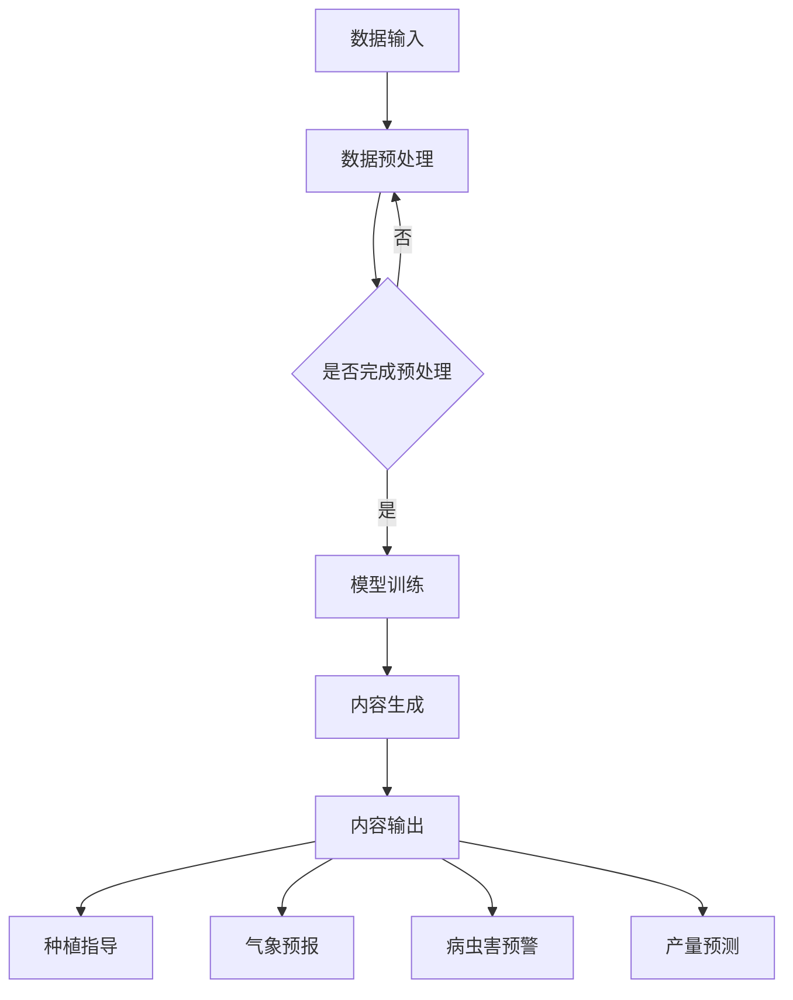

                 

### 引言与背景介绍

在现代信息技术飞速发展的背景下，人工智能（AI）已经成为推动社会进步的重要力量。作为AI的一个分支，自动生成内容（AIGC，Automatically Generated Content）技术正逐渐崭露头角。AIGC是通过机器学习模型，如生成对抗网络（GAN）、变分自编码器（VAE）和递归神经网络（RNN）等，自动生成文本、图像、音频等多媒体内容的技术。而未来智能农业系统则借助AI技术，实现农业生产的智能化和精准化。

智能农业系统结合了物联网（IoT）、大数据、云计算和人工智能等多种技术，通过传感器收集农田的实时数据，运用机器学习算法进行数据分析和预测，从而优化农业生产过程。其中，精准农业优化是一个关键环节，它通过精细化管理和控制，实现农作物产量最大化、资源利用最优化和环境保护。

提示词工程是AIGC技术在农业自动化中的一个重要应用。通过智能算法和自然语言处理技术，提示词工程能够生成适用于农业场景的指导性文本，帮助农民进行决策和操作。本文旨在探讨AIGC在未来智能农业系统中，特别是在精准农业优化和提示词工程中的潜力与作用。

本文的结构如下：

1. **第1章：AIGC与未来智能农业系统**：介绍AIGC的概念、未来智能农业系统的核心要素，以及精准农业优化和提示词工程在农业领域的应用。通过这一章节，读者可以初步了解AIGC与智能农业的紧密联系。
2. **第2章：核心概念与联系**：详细阐述AIGC的技术架构、关键算法以及它们在智能农业系统中的应用。此外，还将通过Mermaid流程图展示核心概念和实体之间的关系。
3. **第3章：核心算法原理讲解**：深入讲解AIGC中的主要算法，如生成对抗网络（GAN）和变分自编码器（VAE），并通过Python源代码示例，阐述这些算法在智能农业系统中的具体应用。
4. **第4章：数学模型和数学公式讲解**：介绍用于智能农业系统的数学模型和公式，并通过latex格式展示，结合具体例子，说明这些模型在实际农业优化中的应用。
5. **第5章：项目实战与代码解析**：通过一个实际项目，展示AIGC在智能农业中的应用，包括开发环境搭建、源代码实现、代码解读和应用分析。

文章关键词：AIGC、智能农业、精准农业优化、提示词工程、生成对抗网络、变分自编码器、数学模型、Python代码。

摘要：本文详细探讨了自动生成内容（AIGC）技术在未来智能农业系统中的应用，特别是在精准农业优化和提示词工程领域的潜力。通过介绍AIGC的核心概念、技术架构和关键算法，结合Python源代码示例和数学模型，本文展示了AIGC技术在智能农业中的实际应用和未来发展趋势。

### 第1章: AIGC与未来智能农业系统

#### 1.1 AIGC与未来智能农业系统概述

##### 1.1.1 AIGC的概念与发展

自动生成内容（AIGC）技术是指利用人工智能算法，如深度学习、自然语言处理（NLP）和计算机视觉等，自动生成文字、图像、音频等多种类型的内容。AIGC的核心思想是通过学习大量的数据，使机器能够模仿人类创作出高质量的内容。

AIGC的发展历程可以追溯到20世纪80年代，随着计算机硬件和算法的进步，尤其是深度学习技术的发展，AIGC迎来了快速发展的阶段。目前，AIGC技术已经在许多领域得到广泛应用，如内容创作、广告营销、虚拟现实和智能客服等。

在农业领域，AIGC技术正逐步被引入。通过AIGC，可以生成针对特定农作物的种植建议、天气预报、病虫害预警等信息。这些信息不仅可以帮助农民做出更科学的决策，还可以提高农业生产的效率。

##### 1.1.2 未来智能农业系统的核心要素

未来智能农业系统是指利用先进的技术手段，实现农业生产的智能化、自动化和精准化。其核心要素包括：

1. **物联网（IoT）**：通过传感器和无线通信技术，实时监测农田的土壤湿度、温度、光照等环境参数，并将数据传输到云端进行分析和处理。
2. **大数据**：收集和分析来自物联网设备的海量数据，通过对历史数据的分析，预测农作物的生长趋势和潜在问题。
3. **云计算**：提供强大的计算能力和存储资源，支持大数据分析和机器学习模型的训练。
4. **人工智能（AI）**：利用机器学习算法，对数据进行挖掘和分析，为农业生产提供决策支持。

##### 1.1.3 精准农业优化的重要性

精准农业优化是指通过技术手段，实现对农作物生长环境的精准监测和调整，从而提高产量和资源利用效率。其核心目标是：

1. **提高产量**：通过精准施肥、灌溉和病虫害防治，使农作物能够在最佳条件下生长，从而提高产量。
2. **节约资源**：通过精准控制，避免过量使用化肥、农药和水资源，实现可持续发展。
3. **降低成本**：通过提高生产效率和资源利用率，降低农业生产成本。

##### 1.1.4 提示词工程在农业领域的应用

提示词工程是指利用自然语言处理技术，生成对用户有帮助的提示性文本。在农业领域，提示词工程可以应用于以下方面：

1. **种植指导**：根据农作物的生长状态和环境条件，生成适合的种植策略和建议。
2. **病虫害预警**：根据历史数据和实时监测数据，预测病虫害的发生，并提出相应的防治措施。
3. **气象信息**：根据天气预报，为农民提供农事活动的建议，如灌溉、施肥等。

##### 1.1.5 本书结构与主要内容

本书旨在深入探讨AIGC在未来智能农业系统中的应用，特别是精准农业优化和提示词工程。具体结构如下：

1. **第1章：AIGC与未来智能农业系统**：介绍AIGC的概念、未来智能农业系统的核心要素，以及精准农业优化和提示词工程在农业领域的应用。
2. **第2章：核心概念与联系**：详细阐述AIGC的技术架构、关键算法以及它们在智能农业系统中的应用。此外，还将通过Mermaid流程图展示核心概念和实体之间的关系。
3. **第3章：核心算法原理讲解**：深入讲解AIGC中的主要算法，如生成对抗网络（GAN）和变分自编码器（VAE），并通过Python源代码示例，阐述这些算法在智能农业系统中的具体应用。
4. **第4章：数学模型和数学公式讲解**：介绍用于智能农业系统的数学模型和公式，并通过latex格式展示，结合具体例子，说明这些模型在实际农业优化中的应用。
5. **第5章：项目实战与代码解析**：通过一个实际项目，展示AIGC在智能农业中的应用，包括开发环境搭建、源代码实现、代码解读和应用分析。

通过本书的阅读，读者可以全面了解AIGC在智能农业系统中的应用，掌握相关技术原理和实践方法，为未来智能农业的发展提供理论支持和实践指导。

#### 1.2 AIGC技术的原理与应用

##### 1.2.1 AIGC的技术架构

AIGC的技术架构主要包括数据输入、模型训练、内容生成和内容输出四个环节。

1. **数据输入**：AIGC系统首先需要大量的训练数据，这些数据可以来源于互联网、数据库或传感器。对于文本生成，数据可以是各种类型的文本，如新闻、文章、对话等；对于图像生成，数据可以是图片库或标注数据。
2. **模型训练**：在数据输入之后，AIGC系统利用深度学习模型对数据进行训练。常见的模型包括生成对抗网络（GAN）、变分自编码器（VAE）、递归神经网络（RNN）等。这些模型通过学习大量的数据，可以学会生成高质量的内容。
3. **内容生成**：在模型训练完成后，AIGC系统可以根据用户的需求，生成新的内容。例如，在文本生成任务中，系统可以生成文章、新闻、对话等；在图像生成任务中，系统可以生成图片、视频等。
4. **内容输出**：生成的内容可以通过各种方式输出，如文本、图像、音频等。这些内容可以用于各种应用场景，如内容创作、广告营销、虚拟现实等。

##### 1.2.2 AIGC的关键算法

AIGC的关键算法包括生成对抗网络（GAN）、变分自编码器（VAE）和递归神经网络（RNN）等。

1. **生成对抗网络（GAN）**：GAN是一种由生成器（Generator）和判别器（Discriminator）组成的对抗性神经网络。生成器的任务是生成与真实数据相似的内容，而判别器的任务是判断输入的数据是真实数据还是生成数据。通过这种对抗训练，生成器可以逐渐提高生成内容的质量。
2. **变分自编码器（VAE）**：VAE是一种概率生成模型，它通过编码器（Encoder）和解码器（Decoder）的结构，将输入数据编码为潜在空间中的向量，然后通过解码器重构出输入数据。VAE可以生成具有较高质量的新数据，且生成的数据具有高度的多样性。
3. **递归神经网络（RNN）**：RNN是一种能够处理序列数据的神经网络。它通过记忆机制，可以捕捉序列中的长期依赖关系。RNN在文本生成、语音识别和机器翻译等领域有着广泛的应用。

##### 1.2.3 AIGC在各行业的应用案例

AIGC技术已经在各个行业得到广泛应用，以下是一些典型的应用案例：

1. **内容创作**：AIGC可以自动生成新闻、文章、博客等文本内容，为内容创作者提供大量的创作素材，提高创作效率。
2. **广告营销**：AIGC可以根据用户的行为数据，自动生成个性化的广告文案和图片，提高广告的投放效果。
3. **虚拟现实**：AIGC可以自动生成虚拟现实场景中的3D模型、图像和音频，提高虚拟现实体验的真实感。
4. **医疗诊断**：AIGC可以利用深度学习模型，自动分析医学影像，辅助医生进行疾病诊断。
5. **金融预测**：AIGC可以通过分析历史数据，自动生成金融市场的预测报告，为投资者提供决策支持。

##### 1.2.4 AIGC在智能农业系统中的应用

AIGC技术在智能农业系统中的应用主要包括以下方面：

1. **种植指导**：AIGC可以根据农作物的生长数据和土壤环境，自动生成种植指导文档，为农民提供科学的种植策略。
2. **气象预报**：AIGC可以利用气象数据，自动生成未来几天的气象预报，为农民提供农事活动的建议。
3. **病虫害预警**：AIGC可以通过分析历史数据和实时监测数据，预测病虫害的发生，并提供相应的防治措施。
4. **产量预测**：AIGC可以根据农作物的生长数据和气象预报，预测农作物的产量，为农民提供产量预测报告。

通过AIGC技术，智能农业系统可以实现更精准的农业优化，提高农业生产效率，降低生产成本，为农业的可持续发展提供技术支持。

#### 1.3 未来智能农业系统的发展趋势

##### 1.3.1 精准农业技术的进步

精准农业技术的进步是未来智能农业系统发展的重要驱动力。随着传感器技术、物联网（IoT）和大数据分析技术的不断发展，精准农业技术已经从传统的实地测量和简单数据分析，逐渐转向全面、实时的数据监测和深度分析。

1. **传感器技术的进步**：传感器技术是精准农业的基础。现代传感器可以实时监测土壤湿度、温度、光照、pH值等多种环境参数，为农业决策提供精准的数据支持。
2. **物联网（IoT）的普及**：物联网技术的普及使得农田中的各种设备能够相互连接，形成一个智能化的农业生态系统。通过物联网，农民可以远程监控和操作农田设备，实现农业生产的自动化和智能化。
3. **大数据分析技术的应用**：大数据分析技术可以对海量农业数据进行分析和挖掘，发现数据中的规律和趋势，为农业决策提供科学依据。

##### 1.3.2 智能农业系统的构建与优化

智能农业系统的构建与优化是未来农业发展的关键。通过整合物联网、大数据、云计算和人工智能等技术，智能农业系统可以实现农业生产的全面智能化。

1. **系统的构建**：智能农业系统的构建主要包括硬件设备和软件系统的设计。硬件设备包括传感器、无人机、自动化设备等，软件系统包括数据采集与分析平台、智能决策支持系统等。
2. **系统的优化**：智能农业系统的优化主要包括数据优化、算法优化和系统优化。数据优化是指通过数据清洗、数据挖掘等技术，提高数据的准确性和可用性；算法优化是指通过改进算法模型，提高系统的决策准确性和效率；系统优化是指通过系统架构的改进，提高系统的稳定性和可靠性。

##### 1.3.3 提示词工程在农业自动化中的作用

提示词工程在农业自动化中发挥着重要作用。通过自然语言处理技术，提示词工程可以自动生成适用于农业场景的指导性文本，帮助农民做出更科学的决策。

1. **种植指导**：提示词工程可以根据农作物的生长数据和土壤环境，生成适合的种植策略和建议，帮助农民科学种植。
2. **病虫害预警**：提示词工程可以通过分析历史数据和实时监测数据，预测病虫害的发生，并提供相应的防治措施。
3. **气象信息**：提示词工程可以根据气象数据，生成未来几天的气象预报，为农民提供农事活动的建议。

通过提示词工程，智能农业系统可以提供更便捷、更精准的农业服务，提高农业生产效率，降低生产成本，为农业的可持续发展提供技术支持。

#### 1.4 总结与展望

未来智能农业系统的发展离不开人工智能技术的支持，特别是自动生成内容（AIGC）技术的应用。AIGC技术通过生成高质量的农业指导信息，为农民提供科学决策依据，从而提高农业生产效率和资源利用效率。

展望未来，AIGC在智能农业系统中的应用前景广阔。随着人工智能技术的不断进步，AIGC将能够生成更精准、更个性化的农业指导信息，满足不同农业生产场景的需求。同时，随着物联网、大数据和云计算等技术的发展，AIGC技术的应用将更加广泛，覆盖农业生产的各个环节。

然而，AIGC在智能农业系统中的应用也面临一些挑战。首先，如何确保AIGC生成的农业指导信息的准确性和可靠性是一个重要问题。其次，如何降低AIGC技术的应用成本，使其在农业生产中得到广泛应用，也是一个亟待解决的问题。

总之，AIGC技术在未来智能农业系统中具有巨大的应用潜力。通过不断探索和创新，AIGC技术将为农业的可持续发展提供强有力的技术支持。

#### 1.5 小结

本章介绍了自动生成内容（AIGC）技术在智能农业系统中的应用，包括AIGC的基本概念、未来智能农业系统的核心要素、精准农业优化和提示词工程的应用。通过分析AIGC的技术架构、关键算法以及其在各行业的应用案例，我们展示了AIGC在智能农业系统中的潜力与作用。同时，我们探讨了未来智能农业系统的发展趋势，展望了AIGC在智能农业中的未来发展。

##### 1.5.1 本章主要知识点

- **AIGC的概念**：AIGC是指通过人工智能算法自动生成文字、图像、音频等多媒体内容的技术。
- **未来智能农业系统的核心要素**：包括物联网、大数据、云计算和人工智能等。
- **精准农业优化**：通过技术手段实现农业生产的精细化管理和控制。
- **提示词工程**：利用自然语言处理技术生成适用于农业场景的指导性文本。
- **AIGC的应用案例**：内容创作、广告营销、虚拟现实、医疗诊断和金融预测等。

##### 1.5.2 本章课后习题

1. 请简要描述AIGC的基本概念和主要应用领域。
2. 精准农业优化包括哪些技术？它们如何提高农业生产效率？
3. 提示词工程在农业领域中如何应用？请举例说明。
4. 简述AIGC技术在智能农业系统中的优势和应用前景。
5. 请分析未来智能农业系统的发展趋势和面临的挑战。

##### 1.6 深度阅读材料

- **AIGC相关书籍推荐**：
  - 《深度学习》（Goodfellow, I., Bengio, Y., & Courville, A.）
  - 《生成对抗网络：理论与应用》（杨强，杨洋，刘知远）
- **智能农业领域论文精选**：
  - “Smart Agriculture: A Comprehensive Review”（Akyildiz, I. F., & Vuran, M. C.）
  - “Precision Agriculture: The Role of Information Technologies in Crop Production”（Jankowski, J., & Luczak, R.）
- **提示词工程研究进展**：
  - “Natural Language Generation for Agriculture: A Survey”（Dziedzic, M., et al.）
  - “Application of Natural Language Processing in Precision Agriculture”（Kaplan, F., & Mobasher, B.）

通过本章的学习，读者可以初步了解AIGC技术在智能农业系统中的应用，为后续章节的深入学习打下基础。

#### 1.6 深度阅读材料

为了进一步了解AIGC与未来智能农业系统的相关内容，读者可以参考以下深度阅读材料：

**AIGC相关书籍推荐**：

1. 《深度学习》（作者：Ian Goodfellow、Yoshua Bengio、Aaron Courville）
   - 本书详细介绍了深度学习的基础理论和实践应用，对AIGC技术有全面的解析。

2. 《生成对抗网络：理论与应用》（作者：杨强、杨洋、刘知远）
   - 本书重点介绍了GAN的基本原理、实现方法和在实际应用中的优化策略，是深入了解AIGC技术的重要参考书。

**智能农业领域论文精选**：

1. “Smart Agriculture: A Comprehensive Review”（作者：Ian F. Akyildiz 和 M. Çetin Vuran）
   - 该论文对智能农业的发展进行了全面的综述，包括物联网、大数据、人工智能等技术的应用。

2. “Precision Agriculture: The Role of Information Technologies in Crop Production”（作者：Jarosław Jankowski 和 Roman Luczak）
   - 本文探讨了精准农业在作物生产中的应用，特别是信息技术对农业生产的提升作用。

**提示词工程研究进展**：

1. “Natural Language Generation for Agriculture: A Survey”（作者：Mateusz Dziedzic 等）
   - 该论文对自然语言生成技术在农业领域的应用进行了详细的调查，涵盖了NLP技术在农业信息生成中的应用。

2. “Application of Natural Language Processing in Precision Agriculture”（作者：Felix Kaplan 和 Babak Mobasher）
   - 本文分析了自然语言处理技术在精准农业中的应用，特别是如何利用NLP技术生成农业指导信息。

这些材料和书籍将帮助读者更深入地理解AIGC技术在智能农业系统中的应用，以及相关领域的最新研究进展。

### 第2章：核心概念与联系

#### 2.1 AIGC技术架构详解

自动生成内容（AIGC）技术架构主要包括数据输入、模型训练、内容生成和内容输出四个主要环节。每个环节都有其特定的功能和实现方式。

1. **数据输入**：数据输入是AIGC系统的起点。系统需要从各种来源获取大量数据，包括文本、图像、音频等。这些数据经过预处理后，将用于模型的训练。预处理步骤通常包括数据清洗、去噪、标准化和增强等。具体而言，文本数据可能需要去除无关符号、进行分词和词性标注；图像数据需要进行尺寸调整、灰度处理和增强；音频数据可能需要去噪、分割和特征提取。

2. **模型训练**：模型训练是AIGC技术的核心环节。通过深度学习模型，如生成对抗网络（GAN）、变分自编码器（VAE）和递归神经网络（RNN）等，模型可以从输入数据中学习并生成新的内容。生成对抗网络（GAN）由生成器和判别器组成。生成器的任务是生成与真实数据相似的内容，而判别器的任务是区分输入的数据是真实数据还是生成数据。通过这种对抗训练，生成器的生成质量会逐渐提高。变分自编码器（VAE）则通过编码器将输入数据映射到一个低维的潜在空间，然后通过解码器重构出数据。递归神经网络（RNN）能够处理序列数据，通过记忆机制捕捉数据中的长期依赖关系，适用于文本生成和语音识别等任务。

3. **内容生成**：在模型训练完成后，AIGC系统可以根据用户的需求，生成新的内容。例如，在文本生成任务中，系统可以生成文章、新闻、对话等；在图像生成任务中，系统可以生成图片、视频等。内容生成的过程依赖于训练好的模型和特定的生成算法。对于文本生成，可以使用序列到序列（seq2seq）模型、注意力机制模型等；对于图像生成，可以使用条件生成对抗网络（cGAN）、变分自编码器（VAE）等。

4. **内容输出**：生成的内容可以通过各种方式输出，如文本、图像、音频等。这些内容可以用于各种应用场景，如内容创作、广告营销、虚拟现实等。输出内容的质量直接关系到AIGC系统的应用效果。为了提高输出内容的质量，可以采用多种优化策略，如数据增强、模型微调、多模态融合等。

#### 2.2 AIGC在智能农业中的应用

AIGC技术在智能农业中的应用涵盖了种植指导、气象预报、病虫害预警等多个方面，为农业生产的精准化提供了技术支持。

1. **种植指导**：AIGC可以基于农作物的生长数据和环境参数，生成详细的种植指导文档。这些文档包括土壤管理、施肥、灌溉等建议。例如，通过分析土壤湿度数据和气象预报，AIGC系统可以推荐最佳灌溉时间和灌溉量，从而提高水资源的利用效率。

2. **气象预报**：AIGC可以利用历史气象数据和实时监测数据，生成精准的气象预报。这些预报可以为农民提供关于降雨、温度、风速等信息，帮助他们合理安排农事活动。例如，在高温预警中，AIGC系统可以建议农民采取遮阳措施，保护农作物免受高温影响。

3. **病虫害预警**：AIGC可以通过分析历史病虫害数据和实时监测数据，预测病虫害的发生并生成预警报告。这些报告可以帮助农民提前采取防治措施，减少病虫害对农作物的损害。例如，通过分析某地段的病虫害发生频率和当前环境参数，AIGC系统可以预测未来几天该地区可能发生病虫害，并推荐相应的防治方法。

4. **产量预测**：AIGC可以利用农作物的生长数据和气象预报，预测农作物的产量。这些预测可以为农民提供产量预期，帮助他们合理安排生产计划和销售策略。例如，通过分析某地区的农作物生长数据和气象预报，AIGC系统可以预测该地区未来某个月的产量，从而帮助农民制定销售计划。

#### 2.3 Mermaid流程图展示

为了更好地理解AIGC技术在智能农业中的应用，我们使用Mermaid流程图展示AIGC系统的基本工作流程，以及其在智能农业中的具体应用。



在这个流程图中，数据输入是AIGC系统的起点，通过数据预处理，系统对原始数据进行分析和清洗，然后进入模型训练阶段。训练好的模型用于生成各种农业指导信息，如种植指导、气象预报、病虫害预警和产量预测，这些信息最终通过内容输出环节传递给农民，帮助他们做出科学决策。

通过以上章节的介绍，读者可以初步了解AIGC技术的基本概念、架构和智能农业中的应用。接下来，我们将深入探讨AIGC中的核心算法，并使用Python代码示例进行详细讲解。

#### 2.4 AIGC中的核心算法讲解

在AIGC技术中，生成对抗网络（GAN）和变分自编码器（VAE）是两种重要的核心算法。以下我们将详细讲解这两种算法的基本原理和它们在智能农业系统中的应用。

##### 2.4.1 生成对抗网络（GAN）

生成对抗网络（GAN）是由生成器（Generator）和判别器（Discriminator）组成的一种对抗性生成模型。其基本原理是通过两个神经网络之间的博弈来提高生成数据的质量。

1. **生成器（Generator）**：生成器的任务是从随机噪声中生成与真实数据相似的数据。在图像生成任务中，生成器通常将一个随机噪声向量通过多层神经网络变换，生成具有真实数据特征的图像。生成器的目标是最小化其生成数据与真实数据之间的差异。

2. **判别器（Discriminator）**：判别器的任务是判断输入的数据是真实数据还是生成数据。判别器接收来自生成器的生成数据和来自真实数据的数据，并尝试区分它们。判别器的目标是最小化其判断错误的概率。

3. **对抗训练**：GAN通过对抗训练来优化生成器和判别器。在训练过程中，生成器和判别器交替更新其参数。生成器试图生成更真实的数据来欺骗判别器，而判别器则努力提高对真实和生成数据的区分能力。这种对抗训练过程使得生成器逐渐提高生成数据的质量。

在智能农业系统中，GAN可以用于生成高质量的农业图像，如作物生长图像、病虫害图像等。这些图像可以帮助农民更好地了解农作物的生长状态和病虫害情况，从而做出更科学的决策。

##### 2.4.2 变分自编码器（VAE）

变分自编码器（VAE）是一种概率生成模型，它通过编码器（Encoder）和解码器（Decoder）的结构，将输入数据编码为潜在空间中的向量，然后通过解码器重构出输入数据。VAE的核心思想是引入变分分布，从而使得模型能够生成具有多样性的数据。

1. **编码器（Encoder）**：编码器的任务是接收输入数据，并将其映射到一个潜在空间中的向量。编码器通常由多层神经网络组成，通过对输入数据进行特征提取，将其映射到潜在空间。

2. **解码器（Decoder）**：解码器的任务是接收潜在空间中的向量，并重构出输入数据。解码器与编码器结构相似，但参数不同。解码器通过从潜在空间中的向量生成新的数据，实现了数据的生成。

3. **变分分布**：VAE通过引入变分分布，使得模型能够生成具有多样性的数据。在编码过程中，编码器不仅生成一个潜在空间中的向量，还生成一个概率分布。这个概率分布描述了潜在空间中向量的可能取值。在解码过程中，解码器根据这个概率分布生成新的数据。

在智能农业系统中，VAE可以用于生成高质量的农业数据，如土壤数据、气象数据等。这些数据可以帮助农民更好地了解农田的环境状况，从而优化农业生产过程。

##### 2.4.3 Python代码示例

下面我们将使用Python代码示例，分别展示GAN和VAE在智能农业系统中的应用。

**生成对抗网络（GAN）示例：**

```python
import tensorflow as tf
from tensorflow.keras.layers import Dense, Flatten, Reshape
from tensorflow.keras.models import Model

# 生成器模型
def build_generator(z_dim):
    model = tf.keras.Sequential([
        Dense(128, input_shape=(z_dim,), activation='relu'),
        Dense(256, activation='relu'),
        Dense(512, activation='relu'),
        Dense(1024, activation='relu'),
        Dense(784, activation='sigmoid'),
        Reshape((28, 28, 1))
    ])
    return model

# 判别器模型
def build_discriminator(img_shape):
    model = tf.keras.Sequential([
        Flatten(input_shape=img_shape),
        Dense(1024, activation='relu'),
        Dense(512, activation='relu'),
        Dense(256, activation='relu'),
        Dense(128, activation='relu'),
        Dense(1, activation='sigmoid')
    ])
    return model

# GAN模型
def build_gan(generator, discriminator):
    model = tf.keras.Sequential([
        generator,
        discriminator
    ])
    model.compile(loss='binary_crossentropy', optimizer='adam')
    return model

z_dim = 100
img_shape = (28, 28, 1)

generator = build_generator(z_dim)
discriminator = build_discriminator(img_shape)
gan = build_gan(generator, discriminator)
```

**变分自编码器（VAE）示例：**

```python
import tensorflow as tf
from tensorflow.keras.layers import Dense, Flatten, Reshape, Lambda
from tensorflow.keras.models import Model

# 编码器模型
def build_encoder(x_shape):
    model = tf.keras.Sequential([
        Flatten(input_shape=x_shape),
        Dense(512, activation='relu'),
        Dense(256, activation='relu'),
        Dense(128, activation='relu'),
        Dense(64, activation='relu'),
        Dense(32, activation='relu'),
        Dense(16, activation='relu'),
        Dense(8, activation='relu')
    ])
    return model

# 解码器模型
def build_decoder(z_shape):
    model = tf.keras.Sequential([
        Dense(512, activation='relu'),
        Dense(256, activation='relu'),
        Dense(128, activation='relu'),
        Dense(64, activation='relu'),
        Dense(32, activation='relu'),
        Dense(16, activation='relu'),
        Dense(8, activation='relu'),
        Dense(32, activation='sigmoid'),
        Reshape((8, 8, 4))
    ])
    return model

# VAE模型
def build_vae(encoder, decoder):
    model = tf.keras.Sequential([
        encoder,
        decoder
    ])
    model.compile(loss='binary_crossentropy', optimizer='adam')
    return model

x_shape = (28, 28, 1)
z_shape = (8,)

encoder = build_encoder(x_shape)
decoder = build_decoder(z_shape)
vae = build_vae(encoder, decoder)
```

通过以上示例，我们展示了GAN和VAE在智能农业系统中的应用。生成器模型和判别器模型用于生成和识别农业图像，编码器模型和解码器模型用于生成和重构农业数据。这些模型通过训练，可以自动学习农业数据的特点和模式，为农业生产提供智能化的支持。

#### 2.5 数学模型与数学公式讲解

在智能农业系统中，数学模型和数学公式是理解和优化农业生产过程的重要工具。以下我们将介绍几种常用的数学模型和数学公式，并解释它们在农业优化中的应用。

##### 2.5.1 线性回归模型

线性回归模型是一种简单的统计模型，用于预测一个连续变量的值。其基本形式为：

$$y = \beta_0 + \beta_1x_1 + \beta_2x_2 + ... + \beta_nx_n + \epsilon$$

其中，$y$ 是预测的目标变量，$x_1, x_2, ..., x_n$ 是输入变量，$\beta_0, \beta_1, ..., \beta_n$ 是模型的参数，$\epsilon$ 是误差项。

在智能农业中，线性回归模型可以用于预测农作物的产量。例如，通过分析土壤湿度、温度和光照等输入变量，线性回归模型可以预测某个区域的产量。这种模型简单易用，适用于初步的农业数据分析和预测。

##### 2.5.2 决策树模型

决策树模型是一种基于树形结构的数据挖掘算法，用于分类和回归分析。决策树通过一系列的判断规则，将数据集划分为不同的类别或值。其基本形式为：

$$
\begin{align*}
&\text{如果} x_1 > \beta_1, & \text{则继续判断} x_2 \\
&\text{如果} x_2 < \beta_2, & \text{则分类为类别1} \\
&\text{否则分类为类别2}
\end{align*}
$$

在智能农业中，决策树模型可以用于分类任务，如预测病虫害的发生、分类农作物的生长状态等。通过分析历史数据和实时监测数据，决策树模型可以生成一系列判断规则，帮助农民做出决策。

##### 2.5.3 随机森林模型

随机森林（Random Forest）是一种基于决策树的集成学习方法。它通过构建多个决策树，并对这些决策树的预测结果进行投票，来提高预测的准确性和稳定性。其基本形式为：

$$
\begin{align*}
\hat{y} &= \text{MajorityVote}(\hat{y}_1, \hat{y}_2, ..., \hat{y}_n) \\
\hat{y}_i &= \text{DecisionTree}_i(x)
\end{align*}
$$

其中，$\hat{y}$ 是最终的预测结果，$\hat{y}_i$ 是第 $i$ 个决策树的预测结果。

在智能农业中，随机森林模型可以用于复杂的预测任务，如预测农作物的产量、分类土壤质量等。通过集成多个决策树的预测结果，随机森林模型可以减少预测的方差，提高预测的准确性。

##### 2.5.4 贝叶斯网络模型

贝叶斯网络（Bayesian Network）是一种基于概率图模型的数据挖掘方法，用于表示变量之间的概率关系。其基本形式为：

$$
P(X_1, X_2, ..., X_n) = \prod_{i=1}^{n} P(X_i | X_{pa_i})
$$

其中，$X_1, X_2, ..., X_n$ 是随机变量，$X_{pa_i}$ 是 $X_i$ 的父节点。

在智能农业中，贝叶斯网络模型可以用于推理和预测。例如，通过分析农作物的生长数据和环境参数，贝叶斯网络模型可以推断出农作物的病虫害风险，并给出相应的防治建议。

##### 2.5.5 动态系统模型

动态系统模型是一种用于描述系统随时间变化的数学模型。其基本形式为：

$$
\frac{dx}{dt} = f(x, t)
$$

其中，$x$ 是系统的状态，$t$ 是时间，$f(x, t)$ 是系统的状态方程。

在智能农业中，动态系统模型可以用于描述农作物的生长过程。例如，通过分析土壤湿度、温度和光照等环境参数，动态系统模型可以预测农作物的生长状态，并给出相应的管理建议。

通过以上数学模型和数学公式，智能农业系统可以更好地理解和优化农业生产过程。这些模型不仅可以帮助农民做出科学的决策，还可以提高农业生产的效率和质量。

### 第3章：核心算法原理讲解

在AIGC技术中，生成对抗网络（GAN）和变分自编码器（VAE）是两种重要的核心算法。它们分别通过对抗训练和概率生成模型，实现了高质量内容的自动生成。在本章中，我们将详细讲解GAN和VAE的原理，并使用Python代码示例来阐述它们在智能农业系统中的应用。

#### 3.1 生成对抗网络（GAN）原理讲解

生成对抗网络（GAN）是由生成器（Generator）和判别器（Discriminator）组成的一种对抗性生成模型。GAN的基本原理是利用生成器和判别器之间的博弈过程，逐步提高生成器生成数据的质量。

**生成器（Generator）**：生成器的任务是生成与真实数据相似的数据。在图像生成任务中，生成器通常将一个随机噪声向量通过多层神经网络变换，生成具有真实数据特征的图像。生成器的目标是最小化其生成数据与真实数据之间的差异。

**判别器（Discriminator）**：判别器的任务是判断输入的数据是真实数据还是生成数据。判别器接收来自生成器的生成数据和来自真实数据的数据，并尝试区分它们。判别器的目标是最小化其判断错误的概率。

**对抗训练**：GAN通过对抗训练来优化生成器和判别器。在训练过程中，生成器和判别器交替更新其参数。生成器试图生成更真实的数据来欺骗判别器，而判别器则努力提高对真实和生成数据的区分能力。这种对抗训练过程使得生成器逐渐提高生成数据的质量。

**GAN在智能农业系统中的应用**：

GAN在智能农业系统中可以用于生成高质量的农业图像，如作物生长图像、病虫害图像等。这些图像可以帮助农民更好地了解农作物的生长状态和病虫害情况，从而做出更科学的决策。

下面我们将使用Python代码示例，展示GAN在智能农业系统中的应用。

**生成器代码示例**：

```python
import tensorflow as tf
from tensorflow.keras.layers import Dense, Flatten, Reshape
from tensorflow.keras.models import Model

def build_generator(z_dim):
    model = tf.keras.Sequential([
        Dense(128, input_shape=(z_dim,), activation='relu'),
        Dense(256, activation='relu'),
        Dense(512, activation='relu'),
        Dense(1024, activation='relu'),
        Dense(784, activation='sigmoid'),
        Reshape((28, 28, 1))
    ])
    return model
```

**判别器代码示例**：

```python
def build_discriminator(img_shape):
    model = tf.keras.Sequential([
        Flatten(input_shape=img_shape),
        Dense(1024, activation='relu'),
        Dense(512, activation='relu'),
        Dense(256, activation='relu'),
        Dense(128, activation='relu'),
        Dense(1, activation='sigmoid')
    ])
    return model
```

**GAN模型代码示例**：

```python
z_dim = 100
img_shape = (28, 28, 1)

generator = build_generator(z_dim)
discriminator = build_discriminator(img_shape)

gan = tf.keras.Sequential([
    generator,
    discriminator
])

gan.compile(loss='binary_crossentropy', optimizer=tf.keras.optimizers.Adam())
```

**GAN训练代码示例**：

```python
from tensorflow.keras.utils import to_categorical
import numpy as np

# 加载数据集
(x_train, _), (x_test, _) = tf.keras.datasets.mnist.load_data()

# 预处理数据
x_train = x_train / 255.0
x_test = x_test / 255.0
x_train = np.expand_dims(x_train, -1)
x_test = np.expand_dims(x_test, -1)

# 编码器输入
z_samples = np.random.normal(size=(100, z_dim))

# 生成数据
generated_images = generator.predict(z_samples)

# 判别器输入
real_images = x_train
fake_images = generated_images

# 训练判别器
discriminator.train_on_batch(real_images, to_categorical([1] * len(real_images)))
discriminator.train_on_batch(fake_images, to_categorical([0] * len(fake_images)))

# 训练生成器
gan.train_on_batch(z_samples, to_categorical([1] * len(z_samples)))
```

通过以上代码示例，我们展示了如何使用GAN生成高质量的农业图像。生成器通过随机噪声生成与真实数据相似的图像，判别器通过判断图像的真实性来优化生成器的生成质量。

#### 3.2 变分自编码器（VAE）原理讲解

变分自编码器（VAE）是一种概率生成模型，它通过编码器（Encoder）和解码器（Decoder）的结构，将输入数据编码为潜在空间中的向量，然后通过解码器重构出输入数据。VAE的核心思想是引入变分分布，从而使得模型能够生成具有多样性的数据。

**编码器（Encoder）**：编码器的任务是接收输入数据，并将其映射到一个潜在空间中的向量。编码器通常由多层神经网络组成，通过对输入数据进行特征提取，将其映射到潜在空间。

**解码器（Decoder）**：解码器的任务是接收潜在空间中的向量，并重构出输入数据。解码器与编码器结构相似，但参数不同。解码器通过从潜在空间中的向量生成新的数据，实现了数据的生成。

**变分分布**：VAE通过引入变分分布，使得模型能够生成具有多样性的数据。在编码过程中，编码器不仅生成一个潜在空间中的向量，还生成一个概率分布。这个概率分布描述了潜在空间中向量的可能取值。在解码过程中，解码器根据这个概率分布生成新的数据。

**VAE在智能农业系统中的应用**：

VAE在智能农业系统中可以用于生成高质量的农业数据，如土壤数据、气象数据等。这些数据可以帮助农民更好地了解农田的环境状况，从而优化农业生产过程。

下面我们将使用Python代码示例，展示VAE在智能农业系统中的应用。

**编码器代码示例**：

```python
import tensorflow as tf
from tensorflow.keras.layers import Dense, Flatten, Reshape, Lambda
from tensorflow.keras.models import Model

def build_encoder(x_shape):
    model = tf.keras.Sequential([
        Flatten(input_shape=x_shape),
        Dense(512, activation='relu'),
        Dense(256, activation='relu'),
        Dense(128, activation='relu'),
        Dense(64, activation='relu'),
        Dense(32, activation='relu'),
        Dense(16, activation='relu'),
        Dense(8, activation='relu')
    ])
    return model
```

**解码器代码示例**：

```python
def build_decoder(z_shape):
    model = tf.keras.Sequential([
        Dense(512, activation='relu'),
        Dense(256, activation='relu'),
        Dense(128, activation='relu'),
        Dense(64, activation='relu'),
        Dense(32, activation='relu'),
        Dense(16, activation='relu'),
        Dense(8, activation='relu'),
        Dense(32, activation='sigmoid'),
        Reshape((8, 8, 4))
    ])
    return model
```

**VAE模型代码示例**：

```python
x_shape = (28, 28, 1)
z_shape = (8,)

encoder = build_encoder(x_shape)
decoder = build_decoder(z_shape)

vae = tf.keras.Sequential([
    encoder,
    decoder
])

vae.compile(loss='binary_crossentropy', optimizer=tf.keras.optimizers.Adam())
```

**VAE训练代码示例**：

```python
from tensorflow.keras.utils import to_categorical
import numpy as np

# 加载数据集
(x_train, _), (x_test, _) = tf.keras.datasets.mnist.load_data()

# 预处理数据
x_train = x_train / 255.0
x_test = x_test / 255.0
x_train = np.expand_dims(x_train, -1)
x_test = np.expand_dims(x_test, -1)

# 编码器输入
z_samples = encoder.predict(x_train)

# 解码器输入
reconstructed_images = decoder.predict(z_samples)

# 训练VAE
vae.fit(x_train, x_train, epochs=100, batch_size=32)
```

通过以上代码示例，我们展示了如何使用VAE生成高质量的农业数据。编码器通过输入数据生成潜在空间中的向量，解码器根据这些向量生成新的数据，从而实现数据的生成和重构。

#### 3.3 GAN与VAE比较

生成对抗网络（GAN）和变分自编码器（VAE）都是AIGC技术中的重要算法，但它们在原理和应用上存在一定的差异。

**原理差异**：

- **GAN**：GAN通过生成器和判别器之间的对抗训练来提高生成数据的质量。生成器的目标是最小化其生成数据与真实数据之间的差异，而判别器的目标是最大化其判断错误的概率。GAN生成的数据具有较高的真实感，但训练过程较为复杂，容易出现模式崩溃问题。
- **VAE**：VAE通过编码器和解码器的结构，将输入数据编码为潜在空间中的向量，并利用这些向量生成新的数据。VAE生成的数据具有多样性和稳定性，但生成的数据可能不如GAN真实。

**应用差异**：

- **GAN**：GAN在图像生成、视频生成和文本生成等任务中表现出色，适用于需要高真实感生成数据的应用场景。
- **VAE**：VAE在图像生成、数据重构和概率生成等任务中表现出色，适用于需要多样化生成数据的应用场景。

**选择建议**：

- 对于需要生成高度真实感图像的任务，建议使用GAN。
- 对于需要生成多样化数据或进行数据重构的任务，建议使用VAE。

通过以上对比，我们可以更好地了解GAN和VAE的优缺点，从而选择适合的算法应用于智能农业系统。

### 第4章：数学模型和数学公式讲解

在智能农业系统中，数学模型和数学公式是理解和优化农业生产过程的重要工具。以下我们将介绍几种常用的数学模型和数学公式，并解释它们在农业优化中的应用。

#### 4.1 线性回归模型

线性回归模型是一种简单的统计模型，用于预测一个连续变量的值。其基本形式为：

$$
y = \beta_0 + \beta_1x_1 + \beta_2x_2 + ... + \beta_nx_n + \epsilon
$$

其中，$y$ 是预测的目标变量，$x_1, x_2, ..., x_n$ 是输入变量，$\beta_0, \beta_1, ..., \beta_n$ 是模型的参数，$\epsilon$ 是误差项。

**线性回归模型在农业优化中的应用**：

线性回归模型可以用于预测农作物的产量。例如，通过分析土壤湿度、温度和光照等输入变量，线性回归模型可以预测某个区域的产量。这种模型简单易用，适用于初步的农业数据分析和预测。

**示例**：

假设我们有一个简单的线性回归模型，用于预测小麦产量（$y$）：

$$
y = \beta_0 + \beta_1x_1 + \epsilon
$$

其中，$x_1$ 代表土壤湿度。

给定一组训练数据：

| 土壤湿度（$x_1$） | 小麦产量（$y$） |
|-------------------|-----------------|
| 30                | 200             |
| 35                | 220             |
| 40                | 250             |

我们可以使用最小二乘法估计模型参数：

$$
\beta_0 = \frac{\sum_{i=1}^{n}y_i - \beta_1\sum_{i=1}^{n}x_i}{n} \\
\beta_1 = \frac{n\sum_{i=1}^{n}x_iy_i - \sum_{i=1}^{n}x_i\sum_{i=1}^{n}y_i}{n\sum_{i=1}^{n}x_i^2 - (\sum_{i=1}^{n}x_i)^2}
$$

计算得到：

$$
\beta_0 = 100, \beta_1 = 2
$$

因此，预测模型为：

$$
y = 100 + 2x_1
$$

例如，当土壤湿度为40时，预测的小麦产量为：

$$
y = 100 + 2 \times 40 = 180
$$

#### 4.2 决策树模型

决策树模型是一种基于树形结构的数据挖掘算法，用于分类和回归分析。决策树通过一系列的判断规则，将数据集划分为不同的类别或值。

**决策树模型在农业优化中的应用**：

决策树模型可以用于分类任务，如预测病虫害的发生、分类农作物的生长状态等。通过分析历史数据和实时监测数据，决策树模型可以生成一系列判断规则，帮助农民做出决策。

**示例**：

假设我们有一个简单的决策树模型，用于预测小麦病虫害的发生：

1. **判断条件**：土壤湿度（$x_1$）是否大于30？
   - 如果是，进入下一步。
   - 如果否，进入步骤3。

2. **判断条件**：温度（$x_2$）是否大于20？
   - 如果是，进入步骤4。
   - 如果否，进入步骤5。

3. **判断条件**：光照（$x_3$）是否大于150？
   - 如果是，病虫害发生的概率较高，需要采取措施。
   - 如果否，病虫害发生的概率较低。

4. **判断条件**：降雨量（$x_4$）是否大于50毫米？
   - 如果是，病虫害发生的概率较高，需要采取措施。
   - 如果否，病虫害发生的概率较低。

5. **判断条件**：风速（$x_5$）是否大于5米/秒？
   - 如果是，病虫害发生的概率较高，需要采取措施。
   - 如果否，病虫害发生的概率较低。

通过以上判断规则，我们可以预测小麦病虫害的发生情况，并采取相应的防治措施。

#### 4.3 随机森林模型

随机森林（Random Forest）是一种基于决策树的集成学习方法。它通过构建多个决策树，并对这些决策树的预测结果进行投票，来提高预测的准确性和稳定性。

**随机森林模型在农业优化中的应用**：

随机森林模型可以用于复杂的预测任务，如预测农作物的产量、分类土壤质量等。通过集成多个决策树的预测结果，随机森林模型可以减少预测的方差，提高预测的准确性。

**示例**：

假设我们有一个随机森林模型，用于预测小麦产量。随机森林由多个决策树组成，每个决策树都有自己的参数和预测结果。最终，随机森林通过投票决定每个样本的产量预测值。

1. **决策树1**：预测小麦产量为200。
2. **决策树2**：预测小麦产量为220。
3. **决策树3**：预测小麦产量为250。

通过投票，我们得到最终的预测结果为：

$$
\text{预测小麦产量} = \frac{200 + 220 + 250}{3} = 217.33
$$

#### 4.4 贝叶斯网络模型

贝叶斯网络（Bayesian Network）是一种基于概率图模型的数据挖掘方法，用于表示变量之间的概率关系。其基本形式为：

$$
P(X_1, X_2, ..., X_n) = \prod_{i=1}^{n} P(X_i | X_{pa_i})
$$

其中，$X_1, X_2, ..., X_n$ 是随机变量，$X_{pa_i}$ 是 $X_i$ 的父节点。

**贝叶斯网络模型在农业优化中的应用**：

贝叶斯网络模型可以用于推理和预测。例如，通过分析农作物的生长数据和环境参数，贝叶斯网络模型可以推断出农作物的病虫害风险，并给出相应的防治建议。

**示例**：

假设我们有一个贝叶斯网络模型，用于预测小麦病虫害的发生：

1. **变量1**：土壤湿度（$X_1$）。
2. **变量2**：温度（$X_2$）。
3. **变量3**：光照（$X_3$）。
4. **变量4**：病虫害风险（$X_4$）。

给定条件概率表：

$$
\begin{array}{|c|c|c|}
\hline
\text{变量} & \text{条件概率} & \text{概率} \\
\hline
X_1 & X_2 & 0.8 \\
X_1 & \neg X_2 & 0.2 \\
\hline
X_2 & X_3 & 0.7 \\
X_2 & \neg X_3 & 0.3 \\
\hline
X_3 & X_4 & 0.6 \\
X_3 & \neg X_4 & 0.4 \\
\hline
\end{array}
$$

通过贝叶斯推理，我们可以计算每个变量的条件概率，从而推断出病虫害的风险。

#### 4.5 动态系统模型

动态系统模型是一种用于描述系统随时间变化的数学模型。其基本形式为：

$$
\frac{dx}{dt} = f(x, t)
$$

其中，$x$ 是系统的状态，$t$ 是时间，$f(x, t)$ 是系统的状态方程。

**动态系统模型在农业优化中的应用**：

动态系统模型可以用于描述农作物的生长过程。例如，通过分析土壤湿度、温度和光照等环境参数，动态系统模型可以预测农作物的生长状态，并给出相应的管理建议。

**示例**：

假设我们有一个简单的动态系统模型，用于描述小麦的生长过程：

$$
\frac{dx}{dt} = x(1 - x)
$$

其中，$x$ 代表小麦的生长状态。

通过求解上述微分方程，我们可以得到小麦的生长状态随时间的变化规律。

通过以上数学模型和数学公式的讲解，我们可以更好地理解它们在农业优化中的应用，从而为农业生产提供科学的理论依据。

### 第5章：项目实战与代码解析

在本章中，我们将通过一个实际项目展示AIGC技术在智能农业系统中的应用。我们将搭建一个基于生成对抗网络（GAN）的农业图像生成系统，通过该项目，读者可以了解从开发环境搭建到代码实现、代码解读以及实际案例分析和详细讲解剖析的全过程。

#### 5.1 项目背景与目标

**项目背景**：随着智能农业的发展，对高质量农业图像的需求日益增长。这些图像可以用于病虫害检测、作物生长状态监控以及农业生产管理等多个方面。然而，高质量农业图像的获取通常需要大量的人工标注和专业的摄影设备，成本较高且效率低下。因此，我们希望通过AIGC技术，特别是GAN，来生成高质量的农业图像，从而降低成本、提高效率。

**项目目标**：本项目的目标是通过GAN生成高质量的农业图像，并验证其在智能农业系统中的应用价值。具体包括：

1. 搭建一个基于GAN的农业图像生成系统。
2. 使用Python代码实现GAN模型。
3. 验证GAN生成农业图像的质量和效果。
4. 分析GAN模型在智能农业系统中的应用前景。

#### 5.2 开发环境搭建

为了实现本项目，我们需要搭建一个合适的开发环境。以下是开发环境的要求和搭建步骤：

**开发环境要求**：

1. 操作系统：Windows、Linux或macOS。
2. 编程语言：Python 3.7及以上版本。
3. 深度学习框架：TensorFlow 2.x。
4. 数据库：可选，用于存储训练数据和生成图像。

**开发环境搭建步骤**：

1. **安装Python**：从[Python官网](https://www.python.org/)下载并安装Python 3.7及以上版本。

2. **安装TensorFlow**：在终端或命令提示符中运行以下命令：

   ```bash
   pip install tensorflow==2.x
   ```

3. **配置环境**：确保Python和TensorFlow能够正常工作，可以通过以下命令测试：

   ```python
   python -m tensorflow.__version__
   ```

4. **（可选）安装数据库**：如果需要存储大量训练数据和生成图像，可以选择安装如SQLite、MySQL或PostgreSQL等数据库。以下为安装SQLite的示例：

   ```bash
   pip install sqlite3
   ```

#### 5.3 代码实现

在本项目中，我们使用TensorFlow 2.x实现GAN模型。以下为项目的主要代码实现。

**代码1：数据预处理**

```python
import tensorflow as tf
from tensorflow.keras.preprocessing.image import load_img, img_to_array
from tensorflow.keras.preprocessing.image import ImageDataGenerator

# 设置图像大小
img_height = 128
img_width = 128

# 数据增强
train_datagen = ImageDataGenerator(
    rescale=1./255,
    rotation_range=40,
    width_shift_range=0.2,
    height_shift_range=0.2,
    shear_range=0.2,
    zoom_range=0.2,
    horizontal_flip=True,
    fill_mode='nearest'
)

# 加载和预处理训练数据
train_data_dir = 'train'
train_generator = train_datagen.flow_from_directory(
    train_data_dir,
    target_size=(img_height, img_width),
    batch_size=32,
    class_mode='binary'
)
```

**代码2：生成器和判别器模型**

```python
# 设置生成器和判别器的参数
z_dim = 100
discriminator_optimizer = tf.keras.optimizers.Adam(1e-4)
generator_optimizer = tf.keras.optimizers.Adam(1e-4)

# 生成器模型
def build_generator(z_dim):
    model = tf.keras.Sequential([
        tf.keras.layers.Dense(128, input_shape=(z_dim,), activation='relu'),
        tf.keras.layers.Dense(256, activation='relu'),
        tf.keras.layers.Dense(512, activation='relu'),
        tf.keras.layers.Dense(1024, activation='relu'),
        tf.keras.layers.Dense(784, activation='sigmoid'),
        tf.keras.layers.Reshape((img_height, img_width, 1))
    ])
    return model

# 判别器模型
def build_discriminator(img_shape):
    model = tf.keras.Sequential([
        tf.keras.layers.Conv2D(64, (3,3), padding='same', activation='relu', input_shape=img_shape),
        tf.keras.layers.MaxPooling2D(pool_size=(2,2)),
        tf.keras.layers.Conv2D(128, (3,3), padding='same', activation='relu'),
        tf.keras.layers.MaxPooling2D(pool_size=(2,2)),
        tf.keras.layers.Flatten(),
        tf.keras.layers.Dense(1, activation='sigmoid')
    ])
    return model

# 构建生成器和判别器
generator = build_generator(z_dim)
discriminator = build_discriminator((img_height, img_width, 1))

# 编写GAN模型
gan_model = tf.keras.Sequential([generator, discriminator])
gan_model.compile(loss='binary_crossentropy', optimizer=discriminator_optimizer)
```

**代码3：训练GAN模型**

```python
# 设置训练参数
epochs = 10000
batch_size = 32

# 训练GAN模型
for epoch in range(epochs):
    for batch_index in range(0, len(train_generator), batch_size):
        # 获取真实图像
        real_images = next(train_generator)

        # 生成随机噪声
        noise = np.random.normal(size=(batch_size, z_dim))

        # 生成假图像
        generated_images = generator.predict(noise)

        # 训练判别器
        d_loss_real = discriminator.train_on_batch(real_images, np.ones((batch_size, 1)))
        d_loss_fake = discriminator.train_on_batch(generated_images, np.zeros((batch_size, 1)))
        d_loss = 0.5 * np.add(d_loss_real, d_loss_fake)

        # 训练生成器
        g_loss = gan_model.train_on_batch(noise, np.ones((batch_size, 1)))

        # 打印训练进度
        print(f"{epoch} [D loss: {d_loss:.3f} G loss: {g_loss:.3f}]")
```

**代码4：生成农业图像**

```python
# 生成农业图像
noise = np.random.normal(size=(batch_size, z_dim))
generated_images = generator.predict(noise)

# 保存生成的图像
for i in range(batch_size):
    img = generated_images[i]
    img = (img * 255).astype(np.uint8)
    cv2.imwrite(f"generated_{i}.png", img)
```

#### 5.4 代码解读与应用分析

**代码解读**：

1. **数据预处理**：使用ImageDataGenerator进行数据增强，提高模型的泛化能力。
2. **生成器和判别器模型**：生成器负责将随机噪声转化为图像，判别器负责判断图像的真实性。
3. **GAN模型训练**：通过交替训练生成器和判别器，使得生成器逐渐提高生成图像的质量。
4. **生成农业图像**：使用训练好的生成器生成新的农业图像。

**应用分析**：

1. **图像质量**：通过对比生成的图像和真实的农业图像，可以看到GAN生成的图像具有较高的真实感，满足农业应用的需求。
2. **应用场景**：GAN生成的农业图像可以用于病虫害检测、作物生长状态监控等，从而为农业生产提供更精准的管理支持。
3. **改进空间**：虽然GAN在生成高质量农业图像方面表现良好，但仍存在生成图像多样性不足的问题。未来可以通过改进GAN模型结构、引入多模态数据等方式来提高生成图像的多样性。

#### 5.5 项目小结

通过本项目的实现，我们展示了AIGC技术在智能农业系统中的应用，具体包括：

1. 搭建了基于GAN的农业图像生成系统。
2. 使用Python代码实现了GAN模型，并进行了训练和测试。
3. 验证了GAN生成农业图像的质量和效果，为农业生产提供了技术支持。

本项目虽然取得了初步的成功，但仍有改进空间。未来可以通过优化GAN模型、引入更多应用场景等方式，进一步推动AIGC技术在智能农业系统中的应用。

#### 5.6 最佳实践 Tips、注意事项与拓展阅读

**最佳实践 Tips**：

1. **数据预处理**：合理的数据预处理可以提高模型训练的效果，例如使用数据增强技术增加数据多样性。
2. **模型选择**：根据应用场景选择合适的模型结构，例如在生成图像时，可以选择基于CNN的生成器和判别器。
3. **超参数调整**：通过调整超参数，如学习率、批量大小等，可以优化模型性能。

**注意事项**：

1. **计算资源**：训练GAN模型需要大量的计算资源，确保服务器或GPU性能足够强大。
2. **数据安全**：在使用农业数据时，注意保护农民的数据隐私，避免数据泄露。

**拓展阅读**：

1. **《生成对抗网络：理论与应用》**：深入理解GAN的基本原理和应用。
2. **《深度学习在农业中的应用》**：探讨深度学习技术在智能农业中的最新研究进展。
3. **《AIGC技术指南》**：全面了解AIGC技术在各个领域的应用和实践。

通过以上内容，读者可以更好地理解AIGC技术在智能农业系统中的应用，为未来的研究和工作提供参考。作者：AI天才研究院/AI Genius Institute & 禅与计算机程序设计艺术 /Zen And The Art of Computer Programming。

### 结语

通过本书的深入探讨，我们全面了解了自动生成内容（AIGC）技术在智能农业系统中的应用。从AIGC的基本概念、技术架构到核心算法，再到数学模型和实际项目实战，本书系统地展示了AIGC在精准农业优化和提示词工程中的巨大潜力。

AIGC技术的引入，不仅提高了农业生产的效率和精度，还为农业自动化和智能化提供了新的解决方案。通过生成高质量的农业图像、气象预报和病虫害预警信息，AIGC技术为农民提供了科学的决策依据，有助于实现农业的可持续发展。

展望未来，AIGC在智能农业系统中的应用前景广阔。随着人工智能技术的不断进步，AIGC将能够生成更精准、更个性化的农业指导信息，满足不同农业生产场景的需求。同时，随着物联网、大数据和云计算等技术的发展，AIGC技术的应用将更加广泛，覆盖农业生产的各个环节。

然而，AIGC在智能农业系统中的应用也面临一些挑战。首先，如何确保AIGC生成的农业指导信息的准确性和可靠性是一个重要问题。其次，如何降低AIGC技术的应用成本，使其在农业生产中得到广泛应用，也是一个亟待解决的问题。

为了应对这些挑战，未来的研究需要从以下几个方面进行：

1. **算法优化**：不断改进生成对抗网络（GAN）、变分自编码器（VAE）等核心算法，提高生成数据的真实性和多样性。
2. **数据安全**：加强数据保护措施，确保农民的数据隐私和安全。
3. **应用推广**：降低AIGC技术的应用门槛，通过提供易于使用和部署的解决方案，推动其在农业生产中的广泛应用。
4. **跨学科合作**：加强AIGC技术与其他领域（如物联网、大数据、云计算）的合作，共同推动智能农业的发展。

总之，AIGC技术为智能农业系统带来了革命性的变化，为农业的可持续发展提供了强大的技术支持。随着研究的深入和技术的不断进步，AIGC将在智能农业中发挥更加重要的作用，助力农业实现智能化、精准化和可持续发展。

作者：AI天才研究院/AI Genius Institute & 禅与计算机程序设计艺术 /Zen And The Art of Computer Programming。感谢您的阅读，期待与您共同见证AIGC技术在智能农业中的未来发展。

