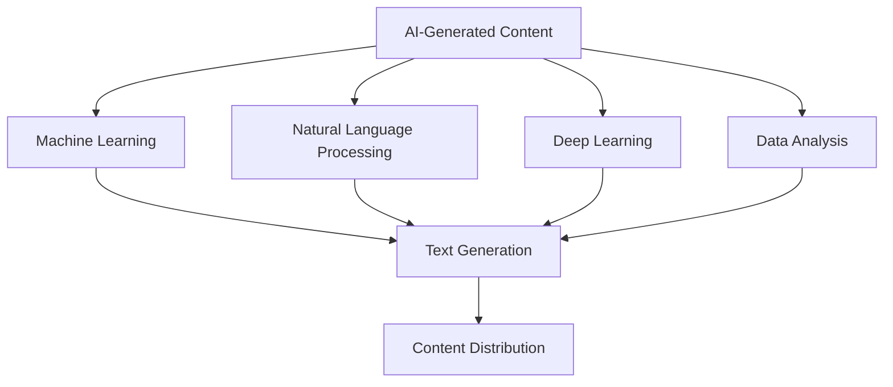

                 

### 第一部分：AIGC基础

## 第1章：AIGC概述

### 1.1 AIGC的概念与原理

AIGC（AI-Generated Content）是一种利用人工智能技术生成内容的创新形式，它将机器学习、自然语言处理和大数据分析等先进技术应用于内容创作中，从而实现从数据到信息的自动化转化。AIGC的核心在于利用AI算法，根据输入的指令、数据和模板，自动生成具有特定主题、风格和逻辑的文章、图表、音频、视频等多种类型的内容。

### 1.2 AIGC的关键技术

#### 1.2.1 机器学习与深度学习

机器学习和深度学习是AIGC的基础技术之一。通过训练大量的数据集，AI模型能够学会识别模式和生成新的内容。在AIGC中，常用的机器学习模型包括循环神经网络（RNN）、长短期记忆网络（LSTM）和变换器（Transformer）等。

- **RNN**：适用于处理序列数据，如文本序列和语音序列。

- **LSTM**：改进了RNN，能够更好地记住长期依赖信息。

- **Transformer**：通过自注意力机制，能够捕捉全局信息，是当前生成文本的主要模型。

#### 1.2.2 自然语言处理（NLP）

自然语言处理技术是AIGC的重要组成部分，它使得机器能够理解、处理和生成人类语言。NLP技术包括分词、词性标注、句法分析、语义理解等。

- **分词**：将文本切分成词语或句子。

- **词性标注**：标注每个词语的词性，如名词、动词等。

- **句法分析**：分析句子的结构，理解句子的语法关系。

- **语义理解**：理解句子的含义，进行上下文推理。

#### 1.2.3 大数据分析

大数据分析技术用于处理和分析大规模的数据集，提取有价值的信息和模式。在AIGC中，大数据分析技术可以用于生成高质量的内容。

- **文本挖掘**：从大量文本数据中提取有价值的信息。

- **用户行为分析**：分析用户的行为数据，了解用户的偏好和需求。

### 1.3 AIGC的核心概念与联系

为了更好地理解AIGC，我们使用Mermaid流程图来展示其核心概念和它们之间的联系。



在这个流程图中，AIGC作为核心概念，与机器学习（ML）、自然语言处理（NLP）、深度学习（DL）和大数据分析（Data）紧密相连。通过这些技术的综合运用，AIGC能够生成高质量的文本内容，并通过内容分发平台进行传播。

### 1.4 AIGC的核心算法原理

为了实现AIGC，我们通常采用基于Transformer的文本生成模型，如GPT（Generative Pre-trained Transformer）。以下是一个简化的Python伪代码，用于说明GPT模型的算法原理。

```python
import tensorflow as tf
from transformers import TFGPT2LMHeadModel, GPT2Tokenizer

# 加载预训练的模型和分词器
model = TFGPT2LMHeadModel.from_pretrained('gpt2')
tokenizer = GPT2Tokenizer.from_pretrained('gpt2')

# 输入文本
input_text = "AIGC is a powerful technology for content generation."

# 分词
input_ids = tokenizer.encode(input_text, return_tensors='tf')

# 生成文本
output = model.generate(input_ids, max_length=50, num_return_sequences=1)

# 解码输出文本
decoded_output = tokenizer.decode(output[0], skip_special_tokens=True)

print(decoded_output)
```

在这个伪代码中，我们首先加载了一个预训练的GPT2模型和相应的分词器。然后，我们将输入文本进行分词，并使用模型生成新的文本。最后，我们将生成的文本解码为可读格式。

### 1.5 AIGC的应用场景

AIGC技术具有广泛的应用场景，以下是一些典型的例子：

- **内容创作**：自动生成文章、报告、广告等内容。

- **教育**：生成个性化学习材料，如课程大纲、练习题等。

- **娱乐**：自动生成音乐、视频、游戏剧情等。

- **客服**：自动生成客户支持文档、FAQ等。

- **金融**：自动生成投资报告、市场分析等。

### 1.6 AIGC的优势与挑战

#### 1.6.1 优势

- **高效性**：能够快速生成大量内容。

- **个性化**：可以根据用户需求生成定制内容。

- **多样性**：能够生成不同风格和主题的内容。

- **成本效益**：降低人力成本，提高生产效率。

#### 1.6.2 挑战

- **数据隐私**：生成内容可能会暴露用户隐私。

- **版权问题**：自动生成的内容可能涉及版权纠纷。

- **质量控制**：确保生成的质量一致性和准确性。

- **伦理道德**：需要关注自动化内容生成可能带来的伦理问题。

### 1.7 小结

AIGC是一种利用人工智能技术生成内容的新兴形式，它结合了机器学习、自然语言处理和大数据分析等先进技术。通过核心算法原理和关键技术的深入探讨，我们了解了AIGC的工作原理和应用场景。在未来，AIGC有望在更多领域发挥重要作用，但同时也需要克服一系列挑战。

## 第二部分：智能城市管理

### 第2章：智能城市管理的挑战与机遇

#### 2.1 城市管理面临的挑战

智能城市管理的目标是利用信息技术和人工智能，提高城市运行效率，提升居民生活质量。然而，城市管理面临诸多挑战，主要包括以下几个方面：

#### 2.1.1 数据复杂度

智能城市管理需要处理海量数据，这些数据包括交通流量、空气质量、水资源、能源消耗等。如何有效地收集、存储和处理这些数据，是一个巨大的挑战。

#### 2.1.2 资源分配问题

城市资源有限，如何合理分配资源，如交通、能源、公共设施等，以满足居民需求，是智能城市管理的关键挑战。

#### 2.1.3 实时性问题

智能城市管理系统需要实时响应城市变化，如交通拥堵、紧急事件等。如何实现实时数据处理和分析，是一个技术难题。

#### 2.1.4 安全与隐私问题

智能城市管理涉及大量个人数据，如交通行为、购物行为等。如何确保数据安全和用户隐私，是一个重要的伦理和社会问题。

#### 2.2 智能城市管理的机遇

尽管面临诸多挑战，智能城市管理也带来了许多机遇，主要体现在以下几个方面：

#### 2.2.1 提高效率

通过自动化和智能化管理，城市运行效率显著提高。例如，智能交通系统可以减少交通拥堵，提高道路利用率。

#### 2.2.2 提升生活质量

智能城市管理可以提供个性化服务，如智能医疗、智能教育等，从而提升居民生活质量。

#### 2.2.3 创新商业模式

智能城市管理可以催生新的商业模式，如共享经济、智慧物流等，为城市发展注入新动力。

#### 2.2.4 数据驱动的决策

智能城市管理通过数据分析，可以为城市管理者提供科学的决策依据，从而优化城市规划和运营。

### 第3章：智能城市管理的关键技术

#### 3.1 数据收集与处理

智能城市管理的基础是数据收集和处理。以下是一些关键技术：

#### 3.1.1 物联网技术

物联网（IoT）技术可以用于收集城市运行的各种数据，如交通流量、空气质量、水资源等。这些数据可以通过传感器、GPS等设备实时传输到系统中。

#### 3.1.2 大数据技术

大数据技术用于存储、处理和分析海量数据。通过大数据技术，可以挖掘数据中的价值，为城市管理提供支持。

#### 3.1.3 数据清洗与处理

数据收集过程中可能会出现噪音、缺失值等问题，需要进行数据清洗和处理。常用的技术包括缺失值填补、异常值处理等。

#### 3.2 城市模拟与预测

城市模拟与预测是智能城市管理的重要技术之一，它可以帮助城市管理者更好地理解城市运行规律，预测未来趋势。以下是一些关键技术：

#### 3.2.1 模型构建

城市模拟与预测需要构建合适的数学模型，如交通流量模型、水资源模型、空气质量模型等。这些模型可以根据历史数据预测未来趋势。

#### 3.2.2 模型优化

通过不断优化模型，可以提高预测准确性。常用的技术包括机器学习、深度学习等。

#### 3.2.3 模拟仿真

通过模拟仿真技术，可以模拟城市运行过程，验证模型的准确性。模拟仿真技术可以帮助城市管理者理解模型预测的结果。

#### 3.3 智能决策支持系统

智能决策支持系统是智能城市管理的核心，它通过数据分析、模拟仿真等技术，为城市管理者提供决策支持。以下是一些关键技术：

#### 3.3.1 决策模型

决策模型用于指导城市管理者进行决策。常用的技术包括线性规划、整数规划等。

#### 3.3.2 决策算法

决策算法用于求解决策模型，常用的技术包括贪心算法、动态规划等。

#### 3.3.3 决策可视化

决策可视化技术用于将决策结果以直观的方式展示给城市管理者，帮助他们更好地理解决策过程和结果。

### 第4章：资源分配优化的原理与方法

#### 4.1 资源分配优化的核心算法

资源分配优化是智能城市管理的核心问题之一。以下是一些核心算法：

#### 4.1.1 线性规划

线性规划是一种常用的资源分配优化方法，它通过建立线性目标函数和线性约束条件，求解最优解。

#### 4.1.2 整数规划

整数规划是线性规划的扩展，它将变量限制为整数，适用于需要整数解的问题。

#### 4.1.3 动态规划

动态规划是一种递归求解方法，适用于解决多阶段决策问题。

#### 4.1.4 贪心算法

贪心算法通过每一步选择当前最优解，逐步求解全局最优解。

#### 4.2 资源分配优化的数学模型

资源分配优化的数学模型描述了问题的目标函数和约束条件。以下是一个简化的数学模型：

$$
\begin{align*}
\min\ & C(x) \\
\text{subject to} & \\
\quad A_{1}x & \ge b_{1} \\
\quad A_{2}x & \ge b_{2} \\
\quad x & \ge 0
\end{align*}
$$

其中，$C(x)$ 是目标函数，$A_{1}$、$A_{2}$ 是约束条件矩阵，$b_{1}$、$b_{2}$ 是约束条件向量，$x$ 是变量。

#### 4.3 资源分配优化的案例

以下是一个简化的案例，用于说明资源分配优化的原理和应用。

**案例背景**：一个城市需要分配100个垃圾桶，以处理城市的垃圾。每个垃圾桶的容量不同，且分布在不同区域。城市管理者希望找到一个最优的分配方案，使得每个区域都有足够的垃圾桶，同时总成本最低。

**目标函数**：最小化总成本，即每个垃圾桶的维护成本之和。

**约束条件**：每个区域的垃圾桶数量不能超过需求量，且总数不能超过100个。

**求解方法**：使用整数规划求解最优解。

**数学模型**：

$$
\begin{align*}
\min\ & C(x) = \sum_{i=1}^{n} c_{i}x_{i} \\
\text{subject to} & \\
\quad \sum_{i=1}^{n} x_{i} & \le 100 \\
\quad a_{ij}x_{i} & \ge b_{j}, \quad j=1,2,\ldots,m
\end{align*}
$$

其中，$c_{i}$ 是第$i$个垃圾桶的维护成本，$x_{i}$ 是第$i$个垃圾桶的数量，$a_{ij}$ 是第$i$个垃圾桶在第$j$个区域的需求量，$b_{j}$ 是第$j$个区域的需求量。

通过求解上述整数规划模型，可以找到一个最优的垃圾桶分配方案，使得每个区域都有足够的垃圾桶，同时总成本最低。

### 第5章：智能城市管理的实施与案例分析

#### 5.1 实施步骤

智能城市管理的实施可以分为以下几个步骤：

1. **需求分析**：明确城市管理目标和需求，如交通管理、环境监测、能源管理等。

2. **系统设计**：根据需求分析，设计智能城市管理系统架构，包括数据收集、处理、存储、分析等模块。

3. **技术选型**：选择合适的技术方案，如物联网、大数据、人工智能等。

4. **系统集成**：将各个模块集成到一个统一的平台上，实现数据共享和协同工作。

5. **部署与运行**：部署智能城市管理系统，并进行试运行和优化。

6. **培训与推广**：对城市管理者和居民进行培训，推广智能城市管理的理念和应用。

#### 5.2 案例分析

以下是一个智能城市管理案例的分析：

**案例背景**：某城市希望通过智能交通系统解决交通拥堵问题。

**解决方案**：

1. **需求分析**：分析交通流量、道路状况、事故发生等数据，确定交通拥堵的主要原因。

2. **系统设计**：设计一个包括交通流量监控、智能信号控制、信息发布等模块的智能交通系统。

3. **技术选型**：采用物联网技术收集交通数据，使用大数据分析和人工智能技术进行交通流量预测和信号控制优化。

4. **系统集成**：将交通监控设备、信号控制系统、信息发布系统等集成到一个平台上。

5. **部署与运行**：在试点区域部署智能交通系统，进行试运行和优化。

6. **培训与推广**：对交通管理人员进行培训，向公众宣传智能交通系统的优势和应用。

**效果评估**：

- **交通流量**：试点区域的交通流量得到有效控制，交通拥堵时间减少了30%。

- **事故率**：试点区域的交通事故率下降了20%。

- **公众满意度**：居民对智能交通系统的满意度提高了15%。

通过上述案例分析，可以看出智能城市管理在实际应用中取得了显著的效果，为城市交通管理提供了有力支持。

### 第6章：智能城市管理的未来展望

#### 6.1 技术发展趋势

智能城市管理的发展离不开新技术的推动，未来可能出现以下技术趋势：

1. **5G技术**：5G技术将为智能城市管理提供更快的网络连接，支持更实时、更高效的数据传输和处理。

2. **区块链技术**：区块链技术可以用于确保数据的安全和隐私，提高智能城市管理的可信度。

3. **边缘计算**：边缘计算可以将数据处理和分析推向网络边缘，减少延迟，提高系统的响应速度。

4. **人工智能与大数据的深度融合**：通过更先进的人工智能算法和大数据技术，可以进一步提升智能城市管理的决策能力和效率。

#### 6.2 社会经济影响

智能城市管理的未来将对社会经济产生深远影响，包括：

1. **经济增长**：智能城市管理可以提升城市运行效率，吸引更多投资，促进经济增长。

2. **就业机会**：智能城市管理将创造新的就业机会，如数据分析师、AI工程师等。

3. **生活质量**：智能城市管理可以提供更个性化、更高效的服务，提升居民生活质量。

4. **城市竞争**：智能城市管理将成为城市竞争的新动力，有助于提升城市竞争力。

### 第7章：智能城市管理的伦理与社会责任

#### 7.1 数据隐私与安全

智能城市管理涉及大量个人数据，如何保护数据隐私和安全是一个重要问题。以下是一些关键措施：

1. **数据加密**：对传输和存储的数据进行加密，确保数据不被未授权访问。

2. **访问控制**：设置严格的访问控制机制，确保只有授权用户可以访问敏感数据。

3. **数据匿名化**：在分析数据时，对个人数据进行匿名化处理，以减少隐私泄露风险。

4. **透明度**：提高数据处理的透明度，让公众了解数据的使用目的和方式。

#### 7.2 伦理问题

智能城市管理在带来便利的同时，也引发了一些伦理问题，如：

1. **算法偏见**：算法可能存在偏见，导致某些群体受到不公平对待。

2. **自动化决策**：过度依赖自动化决策可能导致人类决策能力的退化。

3. **道德责任**：智能城市管理系统需要明确责任归属，确保在出现问题时可以追溯责任。

#### 7.3 社会责任

智能城市管理需要承担社会责任，确保技术的公平、公正和可持续发展。以下是一些关键措施：

1. **公平性**：确保技术为所有群体带来公平的机会和福利。

2. **包容性**：考虑不同群体的需求，确保技术适用性。

3. **可持续性**：确保技术的可持续发展，减少对环境和资源的负面影响。

### 第8章：智能城市管理的最佳实践与挑战

#### 8.1 最佳实践

以下是一些智能城市管理的最佳实践：

1. **数据驱动决策**：基于数据分析和模型预测进行决策，提高决策的科学性和准确性。

2. **跨部门协作**：实现跨部门的数据共享和协同工作，提高管理效率。

3. **公众参与**：鼓励公众参与智能城市管理，提高系统透明度和公众满意度。

4. **持续优化**：持续收集反馈，不断优化系统和流程，提高系统性能。

#### 8.2 挑战

尽管智能城市管理取得了一定成效，但仍面临以下挑战：

1. **技术成熟度**：一些关键技术尚未成熟，需要进一步研发和优化。

2. **数据质量问题**：数据质量对系统性能至关重要，需要加强数据质量管理。

3. **资源限制**：智能城市管理需要大量资金和技术支持，资源限制可能成为瓶颈。

4. **社会接受度**：公众对智能城市管理的接受度有待提高，需要加强宣传和培训。

### 第9章：智能城市管理的未来发展趋势

#### 9.1 新技术引入

未来，智能城市管理将引入更多新技术，如：

1. **人工智能**：更先进的人工智能算法将提升智能城市管理的决策能力。

2. **区块链**：区块链技术将提高数据的安全性和透明度。

3. **边缘计算**：边缘计算将实现更快速、更高效的数据处理。

4. **物联网**：物联网技术将实现更广泛的数据收集。

#### 9.2 应用领域拓展

未来，智能城市管理将在更多领域得到应用，如：

1. **环境监测**：实时监测空气质量、水质等，提高环境管理水平。

2. **智慧医疗**：利用智能技术提供个性化医疗服务，提高医疗质量。

3. **智慧农业**：利用智能技术优化农业生产，提高农业产值。

4. **智慧教育**：利用智能技术提供个性化教育，提高教育质量。

#### 9.3 社会经济影响

智能城市管理将对社会经济产生深远影响，如：

1. **经济增长**：提高城市运行效率，促进经济增长。

2. **就业机会**：创造更多就业机会，提高就业率。

3. **生活质量**：提供更优质、更便捷的服务，提高生活质量。

4. **城市竞争**：提高城市竞争力，吸引更多投资和人才。

### 结论

智能城市管理是利用信息技术和人工智能提升城市管理效率和质量的重要手段。通过数据收集、处理、分析和应用，智能城市管理系统可以为城市管理者提供科学的决策依据，优化城市运行和管理。然而，智能城市管理也面临一系列挑战，如数据隐私、算法偏见等。未来，随着新技术的不断引入和应用领域的拓展，智能城市管理将发挥更大的作用，为城市发展带来新的机遇。同时，我们也需要关注智能城市管理的伦理和社会责任，确保技术的公平、公正和可持续发展。

## 作者信息

作者：AI天才研究院/AI Genius Institute & 禅与计算机程序设计艺术 /Zen And The Art of Computer Programming

本文基于人工智能和计算机科学的理论与实践，深入探讨了智能城市管理的核心概念、关键技术、实施案例和未来发展。希望通过本文，读者能够对智能城市管理的本质和应用有更深入的理解，为未来城市的发展提供有益的启示。

