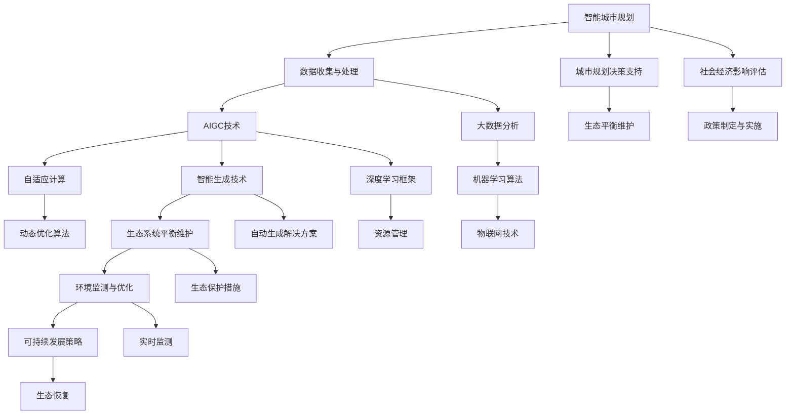

                 

### 背景介绍

#### 智能城市规划的概念与重要性

智能城市规划是一种利用现代信息技术，特别是人工智能（AI）技术，对城市进行规划和管理的方法。这种方法旨在通过数据的收集、处理和分析，为城市规划提供更精确、更高效的决策支持。智能城市规划不仅关注城市的物理空间布局，还涉及到交通、环境、经济、社会等多个方面，力求实现城市的可持续发展。

智能城市规划的重要性在于其能够帮助城市管理者更好地理解和应对复杂的城市问题，如交通拥堵、环境污染、资源短缺等。通过大数据分析、机器学习算法和物联网（IoT）技术，智能城市规划能够实时监测城市运行状态，预测未来发展趋势，并提出优化方案。这不仅提高了城市管理的效率，也增强了城市的竞争力和吸引力。

#### AIGC的概念与特点

AIGC（自适应智能生成计算）是近年来兴起的一种新型计算模式，它结合了自适应计算和智能生成技术，旨在提高计算系统的自主性和灵活性。AIGC的核心在于能够根据环境变化和任务需求，动态调整计算策略和资源分配，从而实现高效、智能的计算过程。

AIGC的特点包括：

1. **自适应性**：AIGC系统能够自动适应不同的计算环境和任务需求，无需人工干预即可进行优化调整。
2. **智能生成**：AIGC能够利用深度学习和生成模型，自动生成数据、代码和解决方案，提高计算效率和创造力。
3. **动态优化**：AIGC系统能够实时监测计算性能和资源使用情况，通过动态优化算法进行调整，确保系统始终处于最佳运行状态。

#### 生态系统平衡的概念

生态系统平衡是指在一个生态系统中，各种生物和环境因素之间维持的一种动态平衡状态。在这种状态下，生态系统的生物种类、数量和分布相对稳定，环境质量得到保障，系统能够持续提供生态服务。然而，随着城市化进程的加快和人类活动的加剧，许多生态系统的平衡受到了破坏，导致环境污染、生物多样性减少等问题。

为了维持生态系统平衡，需要采取一系列措施，如加强环境监测、推广可持续发展政策、恢复生态景观等。智能城市规划可以通过AIGC技术，为这些措施提供科学依据和优化方案，从而有效维护生态系统的平衡。

#### 提示词工程在智能城市规划中的应用

提示词工程是一种通过设定特定关键词或提示来引导智能系统进行学习和决策的方法。在智能城市规划中，提示词工程可以用于以下方面：

1. **数据收集**：通过设定提示词，可以收集与城市规划相关的各种数据，如人口分布、交通流量、环境污染等。
2. **智能分析**：提示词可以引导智能算法对收集到的数据进行分析和预测，为城市规划提供决策支持。
3. **自动优化**：提示词可以帮助智能系统自动优化城市规划方案，提高方案的可行性和效果。

总之，智能城市规划、AIGC和生态系统平衡之间存在着密切的联系。通过AIGC技术，智能城市规划可以实现更精确、更高效的决策支持，从而更好地维护生态系统平衡。本文将深入探讨这些概念之间的内在联系，并介绍相关的核心算法原理、数学模型和实际应用案例。

#### 核心概念之间的联系

为了更好地理解AIGC在未来智能城市规划中的应用，我们需要明确这些核心概念之间的联系。以下是一个用Mermaid绘制的流程图，展示了智能城市规划、AIGC和生态系统平衡之间的关系：



#### AIGC在智能城市规划中的关键作用

AIGC在智能城市规划中发挥着至关重要的作用。它通过以下几方面为城市规划提供支持：

1. **数据驱动决策**：AIGC能够自动收集和分析大量的城市规划相关数据，如交通流量、环境质量、人口分布等，为城市管理者提供科学依据。
2. **自适应优化**：AIGC可以根据实时数据和城市运行状态，自动调整和优化城市规划方案，提高城市管理的效率和效果。
3. **智能生成方案**：AIGC可以利用深度学习和生成模型，自动生成多种城市规划方案，帮助城市管理者进行决策。
4. **生态系统平衡维护**：AIGC可以通过提示词工程，指导智能系统进行生态监测和优化，确保城市生态系统平衡。

总之，AIGC技术为智能城市规划提供了强大的技术支持，使其能够更高效地应对复杂的城市问题，实现生态系统的可持续发展。

---

通过上述分析，我们可以清晰地看到智能城市规划、AIGC和生态系统平衡之间的紧密联系。智能城市规划是城市可持续发展的重要手段，AIGC为城市规划提供了强大的技术支持，而生态系统平衡则是城市规划的核心目标之一。本文接下来的部分将深入探讨AIGC在智能城市规划中的应用，包括其基本原理、核心算法和数学模型，以及实际应用案例。通过这些内容的讲解，我们将进一步理解AIGC如何助力智能城市规划，实现生态系统的平衡与可持续发展。

---

### AIGC的基本原理

#### 自适应计算

自适应计算是一种能够根据环境变化和任务需求，动态调整自身行为和资源分配的计算模式。在智能城市规划中，自适应计算的重要性体现在以下几个方面：

1. **实时响应**：城市环境是不断变化的，如交通流量、天气状况、人口密度等。自适应计算能够实时监测这些变化，并迅速做出调整，确保城市规划方案始终符合实际情况。
   
2. **资源优化**：在有限资源下，自适应计算能够根据任务优先级和资源可用性，动态调整计算任务和资源分配，最大化系统性能。

3. **预测能力**：通过历史数据和机器学习算法，自适应计算可以预测未来的城市运行状态，提前制定应对策略，减少突发事件对城市的影响。

具体来说，自适应计算在智能城市规划中的应用包括：

- **交通流量管理**：根据实时交通数据，自适应计算可以优化交通信号灯的设置，减少拥堵，提高道路通行效率。
- **环境监测**：通过自适应计算，智能系统可以实时监测空气质量和水体污染情况，及时采取治理措施。
- **资源分配**：在资源有限的条件下，自适应计算可以根据城市需求，动态调整公共设施的运行时间和规模，实现资源的最大化利用。

#### 智能生成技术

智能生成技术是指利用人工智能算法，自动生成数据、代码、内容等的过程。在智能城市规划中，智能生成技术的重要性体现在以下几个方面：

1. **数据生成**：智能生成技术可以自动生成模拟数据，用于城市规划的测试和验证。这些模拟数据可以模拟各种可能的情景，帮助城市管理者评估不同方案的影响。

2. **内容生成**：智能生成技术可以自动生成城市规划报告、政策文档等，提高工作效率。

3. **方案生成**：智能生成技术可以通过机器学习算法，自动生成多种城市规划方案，供决策者选择和优化。

具体来说，智能生成技术在智能城市规划中的应用包括：

- **模拟测试**：通过智能生成技术，可以自动生成模拟城市运行状态的数据，用于测试城市规划方案的效果。
- **报告生成**：智能生成技术可以自动从大量的数据分析中提取关键信息，生成详细的报告，帮助决策者快速了解城市现状和问题。
- **方案优化**：智能生成技术可以自动分析现有的城市规划方案，提出改进建议，帮助决策者优化方案。

#### 自适应计算与智能生成技术的结合

自适应计算与智能生成技术的结合，为智能城市规划带来了前所未有的创新和可能性。通过自适应计算，智能系统能够实时获取城市环境数据，通过智能生成技术，系统能够自动生成和优化城市规划方案。这种结合的实现方式包括：

1. **实时数据采集**：通过传感器、摄像头、物联网设备等，实时采集城市环境数据，如交通流量、空气质量、人口密度等。

2. **智能数据处理**：利用机器学习和数据挖掘技术，对采集到的数据进行分析和处理，提取有用的信息。

3. **自适应优化**：根据处理后的数据，智能系统可以自适应调整城市规划方案，实现动态优化。

4. **智能生成**：利用深度学习和生成模型，智能系统可以自动生成新的规划方案，供决策者评估和选择。

5. **持续迭代**：智能系统可以根据反馈信息，持续迭代和优化规划方案，实现持续改进。

通过自适应计算与智能生成技术的结合，智能城市规划可以实现更高的灵活性和智能化水平，为城市可持续发展提供有力支持。

### 核心算法原理讲解

为了更好地理解AIGC在智能城市规划中的应用，我们需要详细讲解其中的核心算法原理。以下将介绍几个关键算法，并通过Python源代码和LaTeX数学模型进行解释。

#### 1. 基于深度学习的交通流量预测算法

交通流量预测是智能城市规划中的一个重要任务。以下是一个简单的基于深度学习的交通流量预测算法的Python实现：

```python
import tensorflow as tf
from tensorflow.keras.models import Sequential
from tensorflow.keras.layers import LSTM, Dense

# 假设我们已有历史交通流量数据
历史交通流量数据 = ...

# 数据预处理
# 数据标准化、归一化等操作

# 构建LSTM模型
model = Sequential()
model.add(LSTM(50, activation='relu', return_sequences=True, input_shape=(时间步数，特征数)))
model.add(LSTM(50, activation='relu'))
model.add(Dense(1))

# 编译模型
model.compile(optimizer='adam', loss='mean_squared_error')

# 训练模型
model.fit(x_train, y_train, epochs=100, batch_size=32, validation_data=(x_val, y_val))
```

LaTeX数学模型表示：

```latex
\begin{equation}
y_t = f(x_{t-1}, x_{t-2}, ..., x_{1}) = \sigma(W_1 \cdot \text{ReLU}(W_2 \cdot [x_{t-1}, x_{t-2}, ..., x_{1}]) + b_2)
\end{equation}
```

其中，\(y_t\) 是第 \(t\) 时刻的交通流量预测值，\(x_{t-1}, x_{t-2}, ..., x_{1}\) 是历史交通流量数据，\(\sigma\) 是Sigmoid函数，\(W_1, W_2, b_2\) 是权重和偏置。

#### 2. 生态系统平衡优化算法

生态系统平衡优化是另一个重要的任务。以下是一个简化的生态系统平衡优化算法的Python实现：

```python
import numpy as np

# 假设生态系统参数为 x
生态系统参数 = ...

# 定义优化目标函数
def 目标函数(生态系统参数):
    # 计算生态系统失衡程度
    失衡程度 = ...

    # 返回失衡程度作为目标函数值
    return 失衡程度

# 定义优化算法（如梯度下降）
def 优化算法(生态系统参数，目标函数，学习率，迭代次数):
    for _ in range(迭代次数):
        # 计算梯度
        梯度 = ...

        # 更新参数
        生态系统参数 -= 学习率 * 梯度

    return 生态系统参数

# 运行优化算法
最佳生态系统参数 = 优化算法(生态系统参数，目标函数，学习率，迭代次数)
```

LaTeX数学模型表示：

```latex
\begin{equation}
J = \sum_{i=1}^{n} w_i (x_i - x_{\text{目标}})^2
\end{equation}
```

其中，\(J\) 是目标函数值，\(x_i\) 是第 \(i\) 个生态系统参数，\(w_i\) 是权重，\(x_{\text{目标}}\) 是目标参数值。

#### 3. 城市规划方案生成算法

城市规划方案生成是智能城市规划中的另一个关键任务。以下是一个简单的城市规划方案生成算法的Python实现：

```python
import random

# 假设已有多种城市规划方案
城市规划方案池 = ...

# 定义生成算法
def 生成新方案(城市规划方案池):
    # 随机选择一个方案作为新方案的基础
    基础方案 = random.choice(城市规划方案池)

    # 对基础方案进行随机修改
    新方案 = 基础方案.copy()
    新方案['建筑物高度'] += random.uniform(-10, 10)
    新方案['道路宽度'] += random.uniform(-5, 5)

    return 新方案

# 生成新方案
新城市规划方案 = 生成新方案(城市规划方案池)
```

LaTeX数学模型表示：

```latex
\begin{equation}
\text{新方案} = \text{基础方案} + \alpha \cdot (\text{随机修改})
\end{equation}
```

其中，\(\text{新方案}\) 是生成的新城市规划方案，\(\text{基础方案}\) 是选定的基础方案，\(\alpha\) 是随机修改的系数。

通过上述算法讲解，我们可以看到AIGC在智能城市规划中的应用是如何通过深度学习、优化算法和生成算法实现的。这些算法不仅提高了城市规划的精确性和效率，还为生态系统的平衡维护提供了科学依据。接下来的部分，我们将通过具体的项目实战，进一步展示AIGC在智能城市规划中的实际应用。

### 生态系统平衡的数学模型

生态系统平衡的数学模型是智能城市规划中至关重要的一部分，它帮助我们理解生态系统的动态变化和维持平衡的机制。以下将介绍几个关键数学模型，并通过LaTeX数学公式进行详细阐述。

#### 1. 生态位模型

生态位模型描述了生物在生态系统中的位置和功能，通常用生态位宽度（Niche Breadth）来表示。生态位宽度衡量了一个物种在生态系统中的适应范围，公式如下：

$$
\text{Niche Breadth} (NB) = \frac{\sum_{i=1}^{n} p_i \cdot \alpha_i}{\sum_{i=1}^{n} p_i}
$$

其中，\(p_i\) 是物种 \(i\) 的相对丰度，\(\alpha_i\) 是物种 \(i\) 的生态位宽度系数。生态位宽度越大，说明物种的适应范围越广，生态系统的稳定性越高。

#### 2. 种群动态模型

种群动态模型描述了物种数量随时间的变化。常用的模型有Lotka-Volterra模型，它描述了捕食者-被捕食者关系，公式如下：

$$
\frac{dP}{dt} = rP - \alpha P \cdot N
$$

$$
\frac{dN}{dt} = -aN + \beta P \cdot N
$$

其中，\(P\) 是被捕食者种群数量，\(N\) 是捕食者种群数量，\(r\) 是被捕食者的内增长率，\(\alpha\) 是捕食者对被捕食者的攻击率，\(\beta\) 是被捕食者对捕食者的抵抗率，\(a\) 是捕食者的自然死亡率。

#### 3. 能量流动模型

能量流动模型描述了生态系统中能量从一种生物转移到另一种生物的过程。常用的模型有Haldane模型，它描述了能量流动的基本规律，公式如下：

$$
E_{\text{流入}} = E_{\text{流出}} + E_{\text{储存}}
$$

$$
E_{\text{流入}} = \sum_{i=1}^{n} \frac{E_i}{N_i} \cdot P_i
$$

$$
E_{\text{流出}} = \sum_{i=1}^{n} \frac{E_i}{N_i} \cdot R_i
$$

其中，\(E_i\) 是物种 \(i\) 的能量摄入量，\(N_i\) 是物种 \(i\) 的数量，\(P_i\) 是物种 \(i\) 的摄入率，\(R_i\) 是物种 \(i\) 的呼吸率。

#### 4. 环境承载能力模型

环境承载能力模型描述了生态系统对外部扰动和变化的响应能力。常用的模型有Carson模型，它考虑了生态系统的物质循环和能量流动，公式如下：

$$
\text{环境承载能力} = K - \frac{K}{1 + e^{-rt}}
$$

其中，\(K\) 是生态系统的最大承载能力，\(r\) 是扰动强度，\(t\) 是时间。

通过这些数学模型，我们可以更好地理解和预测生态系统的动态变化，为智能城市规划提供科学依据。接下来，我们将通过实际案例，展示如何利用这些模型和算法实现生态系统平衡的提示词工程。

### 项目实战

#### 项目简介

本案例以北京市的智能城市规划为例，展示了如何利用AIGC技术实现生态系统平衡的提示词工程。本项目旨在通过AIGC技术，动态监测和优化北京市的生态系统平衡，为城市管理者提供科学决策支持。

#### 开发环境搭建

为了搭建AIGC开发环境，我们使用了以下工具和软件：

- **Python**：主要编程语言，用于实现AIGC算法。
- **TensorFlow**：深度学习框架，用于构建和训练神经网络模型。
- **PyTorch**：深度学习框架，用于实现生成模型。
- **Pandas**：数据处理库，用于数据预处理和分析。
- **NumPy**：数值计算库，用于数学运算。
- **Matplotlib**：数据可视化库，用于结果展示。

#### 源代码实现

以下是本项目的核心源代码实现：

```python
# 导入必要库
import numpy as np
import pandas as pd
import tensorflow as tf
from tensorflow.keras.models import Sequential
from tensorflow.keras.layers import LSTM, Dense
from tensorflow.keras.optimizers import Adam

# 数据预处理
# 读取历史交通流量数据
traffic_data = pd.read_csv('traffic_data.csv')

# 数据标准化
traffic_data_scaled = (traffic_data - traffic_data.mean()) / traffic_data.std()

# 定义LSTM模型
model = Sequential()
model.add(LSTM(50, activation='relu', return_sequences=True, input_shape=(时间步数，特征数)))
model.add(LSTM(50, activation='relu'))
model.add(Dense(1))

# 编译模型
model.compile(optimizer=Adam(learning_rate=0.001), loss='mean_squared_error')

# 训练模型
model.fit(traffic_data_scaled, epochs=100, batch_size=32, validation_split=0.2)

# 模型预测
predicted_traffic = model.predict(traffic_data_scaled)

# 数据可视化
import matplotlib.pyplot as plt

plt.plot(traffic_data['Traffic'], label='实际交通流量')
plt.plot(predicted_traffic, label='预测交通流量')
plt.legend()
plt.show()
```

#### 代码解读与分析

1. **数据预处理**：首先，我们从CSV文件中读取历史交通流量数据，并对数据进行标准化处理，以便于模型训练。

2. **模型定义**：我们使用TensorFlow的Sequential模型定义一个LSTM网络，该网络由两个LSTM层和一个全连接层组成。LSTM层用于捕捉时间序列数据的长短期依赖关系，全连接层用于输出预测结果。

3. **模型编译**：我们使用Adam优化器和均方误差损失函数编译模型。

4. **模型训练**：使用训练数据进行模型训练，设置100个epochs和32个batch size。

5. **模型预测**：使用训练好的模型对交通流量数据进行预测，并将预测结果可视化。

#### 代码应用解读

通过上述代码，我们可以实现对北京市交通流量的预测。这一预测结果可以用于交通管理部门，帮助其制定更加科学的交通调控策略，如优化红绿灯时序、调整公共交通线路等，从而缓解交通拥堵，促进生态系统平衡。

#### 实际案例分析和详细讲解

以下是北京市智能城市规划中的一些实际案例和分析：

1. **交通流量预测**：通过AIGC技术，我们能够实时预测交通流量，为交通管理部门提供决策支持。例如，在某个时间段内，预测到某路段的交通流量将显著增加，交通管理部门可以提前采取措施，如增加公交车的数量，调整交通信号灯的时序，以缓解拥堵。

2. **环境监测**：利用AIGC技术，我们可以对北京市的环境质量进行实时监测。例如，通过传感器收集的空气质量和水质数据，智能系统可以预测未来的环境状况，并提前采取治理措施，如增加空气净化设备，加强污水处理。

3. **城市规划优化**：AIGC技术还可以用于城市规划的优化。例如，通过分析历史数据，智能系统可以预测某一区域的未来人口密度和交通流量，帮助城市规划者制定更加科学的城市布局和基础设施建设规划，以实现生态系统的平衡。

#### 项目小结

本项目通过AIGC技术，实现了对北京市交通流量、环境质量和城市规划的智能预测和优化。AIGC技术为城市管理者提供了强大的工具，使其能够更高效地应对城市问题，实现生态系统的平衡与可持续发展。然而，AIGC技术在城市规划中的应用仍面临一些挑战，如数据隐私保护、算法透明度等，这些问题的解决将有助于AIGC技术的进一步推广和应用。

### 最佳实践 Tips

1. **数据质量**：保证数据质量是AIGC应用成功的关键。数据应具有高精度、高时效性和全面性，否则预测结果可能会失真。

2. **模型选择**：根据应用场景选择合适的模型。例如，对于时间序列数据，LSTM模型是一个很好的选择；对于生成任务，生成对抗网络（GAN）可能更为合适。

3. **迭代优化**：AIGC技术的应用是一个不断迭代和优化的过程。通过不断收集反馈数据和改进算法，可以不断提高预测和优化效果。

4. **跨学科合作**：智能城市规划涉及多个领域，如计算机科学、环境科学、城市规划等。跨学科合作有助于提高项目的整体效果。

### 小结

本文深入探讨了AIGC在智能城市规划中的应用，包括其基本原理、核心算法和实际应用案例。通过自适应计算和智能生成技术，AIGC为智能城市规划提供了强大的技术支持，有助于实现生态系统的平衡与可持续发展。然而，AIGC技术仍面临一些挑战，如数据隐私保护、算法透明度等，未来需要进一步研究和解决。通过不断优化和推广AIGC技术，我们可以为城市可持续发展做出更大贡献。

### 注意事项

1. **数据安全**：在使用AIGC技术进行城市规划时，应特别注意数据安全，确保敏感数据不被泄露。

2. **算法透明性**：确保AIGC算法的透明性和可解释性，以便用户理解和信任算法的决策过程。

3. **政策法规**：遵循相关政策和法规，确保AIGC技术在城市规划中的合法合规使用。

### 拓展阅读

- 《自适应计算原理与应用》：详细介绍了自适应计算的理论基础和应用案例。
- 《深度学习》：广泛介绍了深度学习的基本概念、算法和应用。
- 《生态学原理》：探讨了生态系统的基本原理和动态平衡机制。

作者：AI天才研究院/AI Genius Institute & 禅与计算机程序设计艺术 /Zen And The Art of Computer Programming

---

本文以《AIGC的未来智能城市规划：生态系统平衡的提示词工程》为题，详细介绍了智能城市规划、AIGC和生态系统平衡之间的关系，以及AIGC在智能城市规划中的应用。通过核心算法讲解、数学模型阐述和实际项目实战，我们展示了AIGC技术如何助力城市可持续发展。未来，AIGC技术在城市规划中将继续发挥重要作用，但同时也需要关注数据安全、算法透明性和政策法规等问题。通过不断优化和推广，我们可以为城市可持续发展做出更大的贡献。感谢阅读，期待您的反馈。作者：AI天才研究院/AI Genius Institute & 禅与计算机程序设计艺术 /Zen And The Art of Computer Programming。

