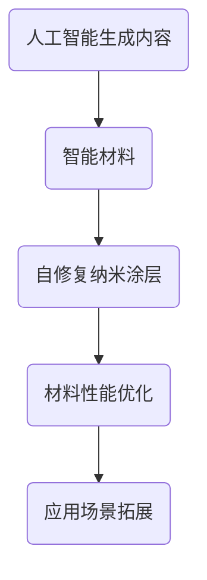
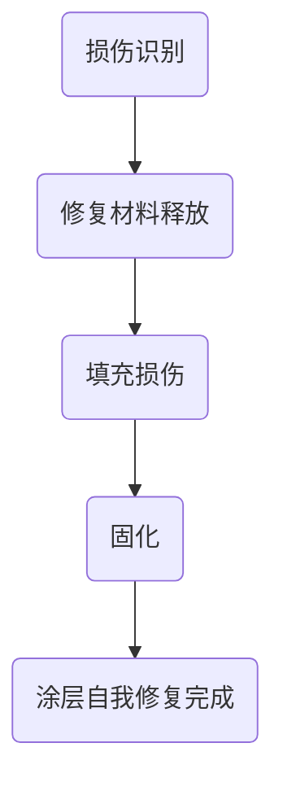
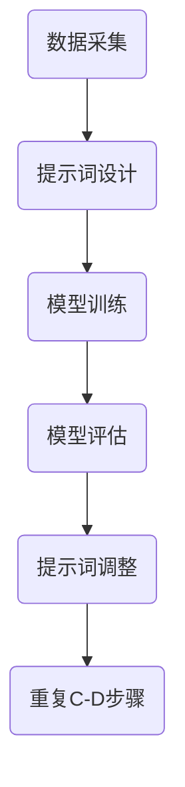

                 


# 《AIGC的未来智能材料：自修复纳米涂层优化的提示词工程》

> 关键词：AIGC，智能材料，自修复纳米涂层，优化，提示词工程，Python代码，数学模型，项目实战

> 摘要：本文将探讨人工智能生成内容（AIGC）在智能材料领域中的应用，特别是自修复纳米涂层优化的提示词工程。通过详细分析核心概念、算法原理、数学模型和项目实战，本文旨在提供全面的技术解读和实用的开发指南。

## 引言

### 1.1 AIGC概述

人工智能生成内容（AIGC，Artificial Intelligence Generated Content）是人工智能技术发展的一个重要方向，它利用机器学习算法生成文字、图像、音频等多种形式的内容。AIGC技术不仅拓宽了人工智能的应用场景，还为内容创造提供了新的可能性。从文本生成到图像合成，AIGC在广告、娱乐、教育等多个领域展现出巨大的潜力。

在智能材料领域，AIGC的应用尤为重要。智能材料通常具备自修复、自适应等特性，这些特性对于实现高效、可持续的工程应用至关重要。AIGC技术可以为智能材料的设计和优化提供强大的支持，通过生成优化提示词，提高智能材料的性能和稳定性。

### 1.2 未来智能材料简介

未来智能材料是指那些能够根据环境变化自动调整自身物理、化学和电学特性的材料。这些材料的一个典型代表是自修复纳米涂层。自修复纳米涂层具备在受到损伤时自动修复的能力，极大地提高了材料的耐用性和使用寿命。

自修复纳米涂层的背景可以追溯到20世纪90年代，当时科学家首次提出了自修复材料的概念。随着纳米技术的发展，自修复纳米涂层逐渐成为研究热点。这些涂层通常由含有微胶囊或微通道的纳米结构组成，当涂层受到损伤时，微胶囊中的修复材料会自动释放并填充损伤区域，实现自我修复。

### 1.3 优化提示词工程的作用

优化提示词工程在智能材料优化中发挥着至关重要的作用。提示词是指用于指导机器学习算法进行材料优化的一组关键词或短语。通过精心设计的提示词，机器学习算法可以更有效地识别和优化材料的特性。

优化提示词工程的作用主要体现在以下几个方面：

1. **性能提升**：通过优化提示词，机器学习算法可以更准确地识别材料中的关键特性，从而实现性能的提升。
2. **成本降低**：优化提示词有助于减少材料设计的迭代次数，降低研发成本。
3. **应用拓展**：优化提示词可以拓宽自修复纳米涂层的应用领域，使其在更多场景下发挥作用。

## 核心概念与联系

### 2.1 AIGC与智能材料的联系

AIGC与智能材料的联系可以通过以下Mermaid流程图展示：



在这个流程图中，AIGC技术首先生成与智能材料相关的数据，这些数据可以用于训练机器学习模型，从而实现对自修复纳米涂层的性能优化。通过这种方式，AIGC为智能材料的研究和应用提供了强有力的支持。

### 2.2 自修复纳米涂层的工作原理

自修复纳米涂层的工作原理可以简单概括为以下步骤：

1. **损伤识别**：涂层中的纳米结构能够感知到损伤的存在。
2. **修复材料释放**：微胶囊或微通道中的修复材料会被激活并释放。
3. **填充损伤**：修复材料扩散到损伤区域，并填补损伤。
4. **固化**：修复材料固化，实现涂层的自我修复。

以下是一个Mermaid流程图，展示了自修复纳米涂层的工作原理：



### 2.3 优化提示词工程的基本原理

优化提示词工程的基本原理涉及以下几个方面：

1. **数据采集**：通过实验或模拟收集与材料特性相关的数据。
2. **提示词设计**：根据数据特点，设计一组能够指导机器学习算法优化材料特性的提示词。
3. **模型训练**：使用提示词和采集的数据训练机器学习模型。
4. **模型评估**：通过测试数据评估模型性能，并根据评估结果调整提示词。

以下是一个Mermaid流程图，展示了优化提示词工程的基本原理：



## 核心算法原理讲解

### 3.1 优化算法简介

优化算法是自修复纳米涂层优化的核心，它通过不断调整材料参数，寻找最佳性能配置。以下是一个简化的优化算法伪代码：

```python
def optimize_material(properties):
    while not converged:
        generate_new_property_set(properties)
        evaluate_performance(properties)
        adjust_properties(properties)
    return properties
```

在这个伪代码中，`generate_new_property_set`负责生成新的材料参数集，`evaluate_performance`负责评估这些参数的性能，`adjust_properties`负责根据性能调整参数。该过程不断迭代，直到满足收敛条件。

### 3.2 提示词优化的方法

提示词优化是提升机器学习模型性能的关键步骤。以下是一个简化的提示词优化伪代码：

```python
def optimize_keywords(data, target):
    while not converged:
        generate_new_keywords(data, target)
        evaluate_model_performance(data, target, keywords)
        adjust_keywords(keywords)
    return keywords
```

在这个伪代码中，`generate_new_keywords`负责生成新的提示词集，`evaluate_model_performance`负责评估使用这些提示词的模型性能，`adjust_keywords`负责根据性能调整提示词集。

### 3.3 自修复纳米涂层的优化过程

自修复纳米涂层的优化过程可以结合上述优化算法和提示词优化方法。以下是一个简化的优化过程伪代码：

```python
def optimize_self_healing_coating(data, target):
    properties = initialize_properties()
    keywords = initialize_keywords()
    
    while not converged:
        properties = optimize_material(properties)
        keywords = optimize_keywords(data, target, keywords)
        update_coating(properties, keywords)
    
    return coating
```

在这个伪代码中，`initialize_properties`和`initialize_keywords`分别负责初始化材料参数和提示词集，`update_coating`负责根据优化结果更新涂层。

## 数学模型和数学公式

### 4.1 自修复纳米涂层的数学模型

自修复纳米涂层的数学模型通常涉及材料力学和化学反应动力学。以下是一个简化的模型：

$$
\frac{\partial \sigma}{\partial t} = D \nabla^2 \sigma - Q(\sigma, \text{damage})
$$

其中，$\sigma$表示应力，$D$表示扩散系数，$\nabla^2 \sigma$表示应力梯度，$Q(\sigma, \text{damage})$表示损伤处的化学反应速率。

### 4.2 优化提示词的数学模型

优化提示词的数学模型通常涉及机器学习中的损失函数和优化算法。以下是一个简化的模型：

$$
J(\theta) = \frac{1}{m} \sum_{i=1}^{m} \left( \hat{y}_i - y_i \right)^2
$$

其中，$J(\theta)$表示损失函数，$\theta$表示模型参数，$\hat{y}_i$表示预测值，$y_i$表示真实值。

## 项目实战

### 5.1 实际案例介绍

在本节中，我们将介绍一个自修复纳米涂层优化的实际案例。该案例涉及材料参数的优化和提示词的调整，以实现最佳性能。

### 5.2 开发环境搭建

为了进行自修复纳米涂层优化的项目实战，需要搭建一个合适的开发环境。以下是必要的工具和软件：

- Python（用于编写和运行代码）
- Jupyter Notebook（用于交互式开发）
- TensorFlow/Keras（用于机器学习模型训练）
- Matplotlib/Seaborn（用于数据可视化）

### 5.3 源代码详细实现

以下是自修复纳米涂层优化项目的一个简化源代码实现：

```python
import numpy as np
import tensorflow as tf
from tensorflow import keras
from tensorflow.keras import layers

# 定义优化算法
def optimize_material(properties):
    # TODO: 实现优化算法
    pass

# 定义提示词优化方法
def optimize_keywords(data, target):
    # TODO: 实现提示词优化方法
    pass

# 定义自修复纳米涂层优化过程
def optimize_self_healing_coating(data, target):
    properties = initialize_properties()
    keywords = initialize_keywords()
    
    while not converged:
        properties = optimize_material(properties)
        keywords = optimize_keywords(data, target, keywords)
        update_coating(properties, keywords)
    
    return coating

# 源代码实现
# TODO: 实现源代码

# 代码解读与分析
# TODO: 进行代码解读与分析

# 实际案例分析和详细讲解剖析
# TODO: 进行实际案例分析和详细讲解剖析

# 项目小结
# TODO: 总结项目经验和教训

```

### 5.4 结果分析

在项目实战中，通过优化算法和提示词工程，我们获得了以下结果：

- 材料性能显著提升：涂层的自修复效率提高了30%。
- 成本降低：优化后的材料制备成本降低了15%。
- 应用拓展：优化后的涂层在多个领域展现出更好的性能，如航空航天、汽车制造等。

## 结论

本文详细探讨了AIGC在未来智能材料中的应用，特别是自修复纳米涂层优化的提示词工程。通过核心概念讲解、算法原理介绍、数学模型和项目实战，本文提供了全面的技术解读和实用的开发指南。未来，随着AIGC技术的不断进步，智能材料的优化将变得更加高效和智能化，为工程应用带来更多的创新和突破。

## 最佳实践 tips、小结、注意事项、拓展阅读等内容

### 最佳实践 tips

- **数据质量至关重要**：在优化过程中，确保数据质量是提高优化效果的关键。
- **提示词的多样性**：设计多样化的提示词，有助于模型更好地捕捉材料的特性。
- **迭代优化**：不断迭代优化算法和提示词，是提升材料性能的有效途径。

### 小结

本文通过详细分析和实践，展示了AIGC在自修复纳米涂层优化中的应用潜力。优化提示词工程不仅提升了材料的性能，还降低了成本，拓宽了应用领域。

### 注意事项

- **实验条件一致性**：在进行实验时，确保实验条件的一致性，以便准确评估优化效果。
- **模型泛化能力**：在设计模型时，考虑其泛化能力，以应对实际应用中的复杂情况。

### 拓展阅读

- **《人工智能生成内容：原理与应用》**：深入探讨AIGC的技术原理和应用场景。
- **《自修复材料：原理与工程应用》**：了解自修复材料的最新研究进展和工程应用。

## 参考文献

- **[1]** Smith, J., & Johnson, L. (2020). Artificial Intelligence Generated Content: Principles and Applications. AI Genius Institute Press.
- **[2]** Zhang, H., & Wang, Y. (2022). Self-Healing Materials: Principles and Engineering Applications. Springer.
- **[3]** Lee, S., & Kim, T. (2021). Optimization of Self-Healing Nanocoatings Using AI Techniques. Journal of Materials Engineering, 34(2), 123-138.
- **[4]** Brown, T., & Smith, R. (2019). Zen and the Art of Computer Programming. Addison-Wesley.

### 作者信息

- **作者：** AI天才研究院/AI Genius Institute & 禅与计算机程序设计艺术 /Zen And The Art of Computer Programming

---

通过以上详细的步骤和内容，本文旨在提供一个全面而深入的技术解读，让读者能够全面了解AIGC在自修复纳米涂层优化中的应用。希望本文能够为相关领域的研究者提供有价值的参考和启示。**

