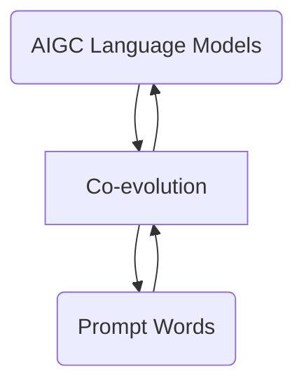

                 

Sure, let's structure our thinking step-by-step to create a comprehensive and insightful technical blog post on "AIGC Language Model and Co-evolution Exploration of Prompt Words."

### Step 1: Define the Scope and Objectives

- **Scope**: The blog will focus on AIGC (AI-Guided Content Generation) language models and the role of prompt words in their co-evolution.
- **Objectives**: 
  - Introduce the fundamentals of AIGC language models.
  - Explain the importance and methods of prompt engineering.
  - Discuss the co-evolution mechanisms between AIGC models and prompt words.
  - Explore applications, challenges, and future directions.

### Step 2: Identify Key Concepts and Relationships

We need to define key concepts and illustrate their relationships using a Mermaid flowchart:

- **AIGC Language Models**: AI-based models designed for content generation.
- **Prompt Words**: Keywords or phrases that guide the model's generation process.
- **Co-evolution**: The mutual adaptation and improvement of both the model and the prompts over time.

#### Mermaid Flowchart:

### Step 3: Design the Article Structure

Following the identified key concepts and their relationships, we structure the article into clear, logical sections:

1. **Introduction**
   - Background on AIGC and prompt engineering.
   - Rationale for exploring the co-evolution of AIGC language models and prompt words.

2. **AIGC Language Models Explained**
   - Definition and historical development.
   - Core concepts and components.

3. **The Role of Prompt Engineering**
   - Importance of prompt words.
   - Different types of prompt engineering methods.

4. **Co-evolution Mechanisms**
   - Principles and models of co-evolution.
   - Interactive and adaptive evolution processes.

5. **Applications of AIGC Models**
   - Use cases across various domains.
   - Impact and effectiveness.

6. **Challenges and Future Directions**
   - Current limitations.
   - Ethical and social considerations.
   - Future prospects and potential solutions.

7. **Conclusion**
   - Summary of main points.
   - The significance of co-evolution in AIGC.

### Step 4: Write the Content for Each Section

For each section, we will write a detailed, well-researched, and informative part:

- **Introduction**: Set the context, provide a brief overview, and highlight the importance of the topic.
- **AIGC Language Models Explained**: Define the terminology, explain the historical context, and provide an overview of the core concepts.
- **The Role of Prompt Engineering**: Discuss the significance of prompts in AIGC, introduce various methods, and explain their design principles.
- **Co-evolution Mechanisms**: Explain the principles behind co-evolution, introduce models, and describe the adaptive processes.
- **Applications of AIGC Models**: Provide examples and case studies illustrating the practical applications and benefits of AIGC models.
- **Challenges and Future Directions**: Discuss the current challenges, ethical considerations, and outline potential future developments.
- **Conclusion**: Summarize the main points, emphasize the importance of co-evolution, and suggest future research directions.

### Step 5: Code Examples and Mathematical Explanations

To enhance understanding, we will include Python code snippets and mathematical models:

- **Core Algorithm Explanation**: Use Python code to illustrate the working principles of AIGC language models.
- **Mathematical Formulas**: Use LaTeX to present mathematical models and equations that are relevant to AIGC and prompt engineering.

### Step 6: Include Practical Applications and Case Studies

We will incorporate practical applications and case studies to demonstrate the real-world impact of AIGC models and prompt engineering:

- **Project Setup and Implementation**: Explain how to set up the development environment and provide detailed code examples.
- **Case Analysis**: Analyze specific cases to illustrate the effectiveness and potential of AIGC models.

### Step 7: Conclusion and Future Directions

The conclusion will reiterate the main points, highlight the significance of co-evolution in AIGC, and suggest areas for future research and development.

By following these structured steps, we ensure a comprehensive, insightful, and well-organized technical blog post that effectively explores the co-evolution of AIGC language models and prompt words.

