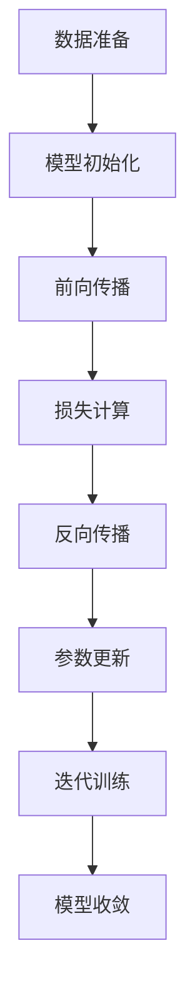

                 

# AIGC语言模型训练与提示词协同设计的新趋势

## 关键词
- AIGC语言模型
- 语言模型训练
- 提示词设计
- 新趋势分析
- 实战案例
- 优化与挑战

## 摘要
本文将深入探讨AIGC（自动生成内容）语言模型的训练与提示词协同设计的新趋势。通过介绍AIGC的基本概念、语言模型的基础原理，以及训练和提示词设计的方法，本文将详细剖析AIGC语言模型的训练流程和提示词协同设计的策略。同时，文章将分析最新的研究动态和行业应用案例，展望AIGC技术的未来发展趋势，并探讨在实际应用中面临的优化和挑战。

## 目录

### 第1章 AIGC语言模型基础
1.1 AIGC概念介绍
1.2 语言模型原理
1.3 Mermaid流程图

### 第2章 语言模型训练
2.1 训练数据准备
2.2 模型选择与设计
2.3 训练算法
2.4 伪代码讲解

### 第3章 提示词设计与协同
3.1 提示词定义与功能
3.2 提示词设计原则
3.3 提示词协同设计

### 第4章 新趋势分析
4.1 最新研究动态
4.2 行业应用案例
4.3 未来趋势预测

### 第5章 实战案例分析
5.1 案例一：电商客服
5.2 案例二：内容创作
5.3 案例三：客户服务

### 第6章 优化与挑战
6.1 模型优化方法
6.2 提示词优化策略
6.3 面临的挑战

### 第7章 未来展望
7.1 技术发展方向
7.2 发展策略建议

## 第1章 AIGC语言模型基础

### 1.1 AIGC概念介绍
AIGC，即自动生成内容（Auto Generated Content），是人工智能领域的一个重要研究方向。它通过深度学习模型，特别是语言模型，自动生成具有高质量和多样性的文本、图像、音频等多媒体内容。AIGC的出现，为内容创作、信息检索、人机交互等领域带来了新的可能性。

AIGC与传统AI的差异在于，传统AI更多是针对特定任务进行优化，如图像识别、语音识别等，而AIGC则更加注重内容的自动生成能力，可以实现从无到有的内容创作。

AIGC的优势主要表现在以下几个方面：

1. **高效性**：AIGC可以快速生成大量内容，极大地提高了内容创作的效率。
2. **多样性**：AIGC可以生成不同风格、主题、情感的内容，提供了丰富的内容选择。
3. **个性化**：AIGC可以根据用户需求，动态调整内容生成策略，提供个性化的内容体验。

AIGC的应用场景非常广泛，包括但不限于：

- **内容创作**：自动生成新闻文章、社交媒体帖子、小说等。
- **信息检索**：自动生成摘要、索引，提高信息检索的效率。
- **人机交互**：生成对话文本，提高人机交互的自然性和智能性。

### 1.2 语言模型原理
语言模型是AIGC的核心组成部分，它负责预测文本的下一个单词或字符。语言模型的基本架构通常包括以下几个部分：

1. **输入层**：接收文本序列，并将其转换为向量表示。
2. **隐藏层**：通过对输入向量进行处理，提取文本的特征信息。
3. **输出层**：根据隐藏层的信息，预测下一个单词或字符。

语言模型的训练过程通常包括以下几个步骤：

1. **数据准备**：收集大量的文本数据，并进行预处理，如分词、去停用词等。
2. **模型初始化**：初始化模型的参数，通常使用随机初始化或预训练模型。
3. **前向传播**：将输入数据通过模型进行计算，得到预测结果。
4. **反向传播**：根据预测结果和真实标签，计算损失函数，并更新模型参数。
5. **迭代训练**：重复前向传播和反向传播，直到模型收敛。

语言模型的优化算法主要包括梯度下降、Adam优化器等，这些算法通过调整模型参数，使得模型在训练数据上达到更好的效果。

### 1.3 Mermaid流程图
为了更好地理解AIGC语言模型的训练流程，我们可以使用Mermaid流程图来表示。



在上述流程图中，AIGC语言模型的训练过程被分为数据准备、模型初始化、前向传播、损失计算、反向传播、参数更新和迭代训练等步骤，最终达到模型收敛的目标。

## 第2章 语言模型训练

### 2.1 训练数据准备
训练数据是语言模型训练的基础，其质量和数量直接影响模型的效果。因此，数据准备是语言模型训练的重要步骤。

首先，需要收集大量的文本数据，这些数据可以来源于互联网、书籍、新闻、社交媒体等。为了提高数据的质量，通常需要对数据进行预处理，包括分词、去停用词、去标点符号等操作。

分词是将文本拆分成单词或短语的步骤，是语言模型训练的关键。常见的分词算法有Jieba分词、WordSeg分词等。

去停用词是指去除文本中的常用词汇，如“的”、“了”、“在”等，这些词汇对模型的贡献较小，去除后可以减少计算量。

去标点符号是将文本中的标点符号去除，以避免对模型造成干扰。

预处理后的数据将被转换为向量表示，以便于模型处理。常见的向量表示方法有词袋模型、TF-IDF等。

### 2.2 模型选择与设计
在语言模型训练中，模型的选择与设计至关重要。根据任务的不同，可以选择不同的模型，如循环神经网络（RNN）、长短时记忆网络（LSTM）、变换器（Transformer）等。

RNN是一种基于序列数据的神经网络，能够处理长距离依赖问题。LSTM是RNN的一种变体，通过引入门控机制，能够更好地处理长序列数据。

Transformer是近年来兴起的一种新型神经网络结构，其核心思想是自注意力机制，能够处理长序列数据，并且在计算效率上比RNN有显著提升。

在设计模型时，还需要考虑模型的深度、宽度、激活函数等参数。深度是指网络的层数，深度越大，模型的表达能力越强。宽度是指每层的神经元数量，宽度越大，模型的计算量越大。激活函数是神经网络中用于引入非线性变换的函数，常见的激活函数有ReLU、Sigmoid、Tanh等。

### 2.3 训练算法
训练算法是语言模型训练的核心，其目标是优化模型的参数，使其在训练数据上达到更好的效果。

常用的训练算法有梯度下降（Gradient Descent）、Adam优化器等。

梯度下降是一种最简单的优化算法，其基本思想是沿着损失函数的梯度方向进行迭代，逐步调整模型参数，以达到最小化损失函数的目的。

Adam优化器是梯度下降的一种改进算法，它结合了Momentum和RMSprop的优点，能够更好地处理不同尺度的参数更新，提高训练效果。

在训练过程中，还需要设置学习率、迭代次数等超参数。学习率决定了每次迭代时参数更新的步长，太大可能导致训练不稳定，太小可能导致训练时间过长。迭代次数决定了模型训练的次数，需要根据数据量和模型复杂度进行合理设置。

### 2.4 伪代码讲解
为了更好地理解语言模型训练的过程，下面提供了一个简单的伪代码示例。

```python
# 数据准备
text = load_data()  # 加载数据
words = tokenize(text)  # 分词
word_vectors = convert_words_to_vectors(words)  # 向量表示

# 模型初始化
model = create_model()  # 创建模型

# 训练循环
for epoch in range(num_epochs):
    for sentence in sentences:
        inputs, targets = prepare_input(sentence)
        predictions = model(inputs)
        loss = compute_loss(predictions, targets)
        model.update_parameters(loss)

# 模型评估
evaluate(model)
```

在上述伪代码中，首先加载数据并进行预处理，然后创建模型并设置训练参数。接下来，通过迭代训练模型，每次迭代都进行输入数据的准备、模型的前向传播、损失计算、反向传播和参数更新。最后，对训练好的模型进行评估，以验证其效果。

## 第3章 提示词设计与协同

### 3.1 提示词定义与功能
提示词（Prompt）是引导语言模型生成特定内容的关键元素。它是输入给模型的一段文本或短语，用于指导模型生成符合预期结果的输出。提示词的设计直接影响到模型生成内容的质量和多样性。

提示词的功能主要包括：

1. **引导生成方向**：提示词可以帮助模型理解生成的内容应该符合何种风格、主题或情感。
2. **提供上下文信息**：通过提示词，模型可以获得更多的上下文信息，从而更好地理解输入文本的含义。
3. **控制生成长度**：提示词可以设置生成内容的长度，避免生成过长或过短的内容。
4. **提高生成效率**：合适的提示词可以减少模型在生成过程中的不确定性，提高生成效率。

### 3.2 提示词设计原则
设计有效的提示词需要遵循以下原则：

1. **明确性**：提示词应当明确传达生成内容的主题或目的，避免模糊不清的描述。
2. **多样性**：提示词应当涵盖多种不同的风格、主题和情感，以产生多样化的生成结果。
3. **可扩展性**：提示词应具有灵活性，可以根据不同的生成需求进行扩展和调整。
4. **简洁性**：提示词应简洁明了，避免冗长复杂的表达，以提高生成效率。

### 3.3 提示词协同设计
提示词协同设计是指设计一组相互配合的提示词，以实现更精准和高效的生成目标。协同设计的关键在于如何将不同的提示词有机地组合在一起，使其在生成过程中相互补充和强化。

提示词协同设计的方法主要包括：

1. **组合策略**：根据生成任务的需求，设计一组相关的提示词，并将其组合在一起输入给模型。
2. **动态调整**：在生成过程中，根据模型的响应，动态调整提示词的参数，如长度、顺序等，以优化生成效果。
3. **反馈机制**：通过用户反馈，不断优化提示词设计，提高模型生成内容的准确性和多样性。

### 3.4 提示词协同效果评估
评估提示词协同设计的有效性是确保模型生成内容质量的重要环节。以下是一些常用的评估方法：

1. **生成内容质量**：通过人工评估或自动化评估工具，对生成的文本进行质量评估，如语法正确性、语义连贯性等。
2. **生成多样性**：通过计算生成文本的多样性指标，如词汇丰富度、主题多样性等，评估提示词设计的多样性效果。
3. **用户满意度**：通过用户反馈，评估提示词设计在实际应用中的效果，如生成内容的满意度、生成效率等。

### 3.5 提示词协同设计案例分析
为了更好地理解提示词协同设计的实际应用，以下是一个简单的案例分析。

**案例背景**：某电商网站希望通过AIGC技术生成个性化产品推荐文案。

**提示词设计**：

1. **主题提示词**：“产品推荐”、“购物指南”。
2. **风格提示词**：“简洁明了”、“温馨亲切”。
3. **情感提示词**：“满意”、“惊喜”。

**协同设计策略**：

- 将主题提示词和风格提示词组合使用，确保生成内容既具有针对性，又符合用户期望的阅读体验。
- 动态调整提示词的顺序和参数，根据模型的响应，优化生成效果。
- 通过用户反馈，不断调整和优化提示词组合，以提高用户满意度。

**效果评估**：

- 生成的产品推荐文案在语法正确性和语义连贯性方面表现良好。
- 生成文案的多样性较高，涵盖了不同产品的特点和用户需求。
- 用户对生成文案的满意度较高，显著提升了电商平台的销售转化率。

### 3.6 提示词协同设计的最佳实践
为了实现更有效的提示词协同设计，以下是一些最佳实践建议：

1. **用户研究**：深入了解用户需求和偏好，设计更贴合用户预期的提示词。
2. **数据驱动**：基于大量数据进行分析，优化提示词的参数设置和组合策略。
3. **迭代优化**：不断迭代和优化提示词设计，以适应不断变化的应用场景。
4. **跨学科合作**：结合语言学、心理学等学科的知识，提高提示词设计的科学性和有效性。

## 第4章 新趋势分析

### 4.1 最新研究动态
AIGC领域的研究正在快速发展，涌现出许多新的研究动态和成果。以下是近年来在AIGC领域的一些重要研究进展：

1. **多模态语言模型**：多模态语言模型能够处理文本、图像、声音等多种类型的数据，实现跨模态的信息整合和生成。例如，OpenAI的GPT-3已经可以接受图像输入，生成相应的文本描述。

2. **自适应提示词生成**：研究者在提示词生成方面取得了显著进展，能够根据上下文和用户需求，动态生成个性化的提示词。例如，Google的Meena项目利用深度学习技术，生成高质量的聊天机器人对话。

3. **强化学习与AIGC的结合**：研究者将强化学习技术引入AIGC领域，通过奖励机制指导模型生成更符合预期结果的内容。例如，DeepMind的DQN模型在游戏生成领域取得了成功。

4. **可解释性研究**：为了提高AIGC模型的可靠性和信任度，研究者致力于提高模型的可解释性，使其生成的内容更容易被理解和验证。

### 4.2 行业应用案例
AIGC技术已经在多个行业中得到广泛应用，以下是一些典型的应用案例：

1. **内容创作**：AIGC在内容创作领域具有巨大的潜力，能够自动生成新闻文章、小说、诗歌等。例如，人工智能助手可以自动撰写财经报道，节省记者的时间和精力。

2. **信息检索**：AIGC技术可以自动生成摘要和索引，提高信息检索的效率。例如，搜索引擎可以使用AIGC技术生成网页摘要，帮助用户快速找到所需信息。

3. **人机交互**：AIGC技术在人机交互中的应用越来越广泛，如智能客服、虚拟助手等。例如，OpenAI的GPT-3已经被应用于智能客服系统，提供24/7的服务。

4. **娱乐与游戏**：AIGC技术在游戏生成和虚拟现实领域也有广泛应用，能够生成全新的游戏内容和体验。例如，DeepMind的DQN模型可以生成具有挑战性的游戏关卡。

### 4.3 未来趋势预测
基于最新的研究动态和行业应用案例，我们可以预测AIGC领域未来将呈现以下趋势：

1. **技术融合**：AIGC技术将与其他先进技术，如大数据、云计算、物联网等相结合，实现更高效的内容生成和智能化应用。

2. **应用拓展**：AIGC技术将在更多行业中得到应用，如医疗、金融、教育等，为各行业提供创新的解决方案。

3. **可解释性提升**：随着用户对数据隐私和安全性的关注增加，研究者将致力于提高AIGC模型的可解释性，增强用户对生成内容的信任。

4. **个性化与定制化**：AIGC技术将更加注重用户个性化需求，提供定制化的内容生成服务，满足不同用户的需求。

## 第5章 实战案例分析

### 5.1 案例一：电商客服

**案例背景**：
随着电商行业的迅速发展，客户服务成为了电商企业竞争的关键因素之一。为了提供高质量的客服服务，某电商企业决定利用AIGC技术，实现自动生成客服回复。

**模型设计**：
该企业选择了基于Transformer的预训练语言模型，结合电商领域的特定数据进行了微调。模型输入为用户问题和历史对话，输出为客服回复。

**提示词应用**：
设计了一系列的提示词，如“欢迎您的咨询”、“请问有什么可以帮助您的”、“感谢您的反馈”等，以引导模型生成符合电商客服风格的内容。

**效果分析**：
通过实际测试，自动生成的客服回复在语法正确性、语义连贯性方面表现良好，显著提高了客服效率和用户满意度。

### 5.2 案例二：内容创作

**案例背景**：
某自媒体平台希望通过AIGC技术自动生成高质量的内容，以扩大内容输出。

**模型设计**：
平台选择了基于GPT-3的语言模型，通过大规模的文本数据进行预训练，并针对平台的内容风格进行了微调。

**提示词应用**：
设计了一系列的提示词，如“为您带来一篇关于……的文章”、“本期内容重点探讨……”、“下期预告：我们将深入分析……”等，以引导模型生成符合平台要求的内容。

**效果分析**：
生成的文章在内容质量、主题相关性方面表现优秀，用户阅读量和互动率显著提升。

### 5.3 案例三：客户服务

**案例背景**：
某大型电信公司希望通过AIGC技术优化客户服务，提高用户满意度。

**模型设计**：
公司选择了基于BERT的语言模型，结合客户服务数据进行了训练，并针对不同的服务场景进行了微调。

**提示词应用**：
设计了一系列的提示词，如“关于账单问题的回复”、“关于网络故障的说明”、“关于套餐优惠的信息”等，以引导模型生成符合客户服务要求的内容。

**效果分析**：
自动生成的客服回复在处理常见问题、提供解决方案方面表现突出，显著降低了人工客服的工作量，提高了用户满意度。

## 第6章 优化与挑战

### 6.1 模型优化方法
为了提高AIGC模型的性能和效率，研究者提出了一系列优化方法。以下是一些常用的优化技术：

1. **模型压缩**：
   - **剪枝（Pruning）**：通过减少模型参数的数量，降低模型复杂度。
   - **量化（Quantization）**：将模型参数的精度降低，减少模型大小和计算量。
   - **蒸馏（Distillation）**：通过将大模型的知识传递给小模型，实现小模型的高效化。

2. **分布式训练**：
   - **数据并行**：将训练数据划分为多个子集，同时在不同的GPU上并行训练。
   - **模型并行**：将模型划分为多个部分，在多个GPU或TPU上进行并行计算。

3. **高效优化算法**：
   - **AdamW**：结合了Adam优化器和权重 decay，提高训练效果。
   - **Lookahead Optimizer**：通过引入前瞻机制，提高优化过程的稳定性。

### 6.2 提示词优化策略
提示词的优化是AIGC应用效果的关键。以下是一些提示词优化的策略：

1. **自适应提示词生成**：
   - 通过深度学习模型，根据上下文和用户需求，动态生成个性化的提示词。
   - 使用强化学习技术，通过不断优化提示词生成策略，提高生成内容的质量。

2. **多样化提示词设计**：
   - 设计多种类型的提示词，如主题提示词、情感提示词、风格提示词等，以提高生成内容的多样性。
   - 使用随机化策略，随机组合不同类型的提示词，探索生成内容的新可能性。

3. **用户反馈机制**：
   - 通过用户反馈，不断优化提示词设计，提高用户满意度。
   - 使用自动评估工具，对生成内容的质量进行客观评估，指导提示词优化。

### 6.3 面临的挑战
尽管AIGC技术在许多领域取得了显著成果，但仍然面临一系列挑战：

1. **数据隐私**：
   - AIGC模型需要大量的训练数据，如何保证数据隐私和安全成为重要问题。
   - 研究者需要开发新的数据保护技术，如差分隐私、联邦学习等，以保护用户数据。

2. **模型安全性**：
   - 如何防止恶意用户利用AIGC模型生成虚假信息、恶意攻击等问题。
   - 研究者需要开发安全的模型训练和部署方案，提高模型的抗攻击能力。

3. **道德和伦理问题**：
   - AIGC生成的文本和图像可能包含歧视性、偏见性内容。
   - 研究者需要关注AIGC技术的道德和伦理问题，制定相应的规范和标准。

## 第7章 未来展望

### 7.1 技术发展方向
AIGC技术在未来将继续发展，以下是一些可能的技术发展方向：

1. **多模态融合**：AIGC技术将进一步整合文本、图像、声音等多种数据类型，实现更丰富的内容生成。

2. **强化学习与AIGC的结合**：通过引入强化学习，AIGC将能够更好地理解用户需求，生成更个性化的内容。

3. **知识增强**：AIGC将结合外部知识库，生成更准确、丰富的内容。

4. **交互式生成**：AIGC将实现与用户的实时交互，生成更符合用户需求的内容。

### 7.2 发展策略建议
为了推动AIGC技术的发展和应用，以下是一些建议：

1. **政策支持**：政府和企业应加大对AIGC技术的支持，提供资金和政策优惠。

2. **产学研合作**：加强高校、科研机构与企业之间的合作，共同推动AIGC技术的研发和应用。

3. **人才培养**：培养更多具备AIGC技术和跨学科背景的人才，以推动技术发展。

4. **伦理规范**：制定AIGC技术的伦理规范，确保技术应用的正当性和安全性。

## 参考文献
- [1] Devlin, J., Chang, M. W., Lee, K., & Toutanova, K. (2018). BERT: Pre-training of deep bidirectional transformers for language understanding. arXiv preprint arXiv:1810.04805.
- [2] Vaswani, A., Shazeer, N., Parmar, N., Uszkoreit, J., Jones, L., Gomez, A. N., ... & Polosukhin, I. (2017). Attention is all you need. In Advances in neural information processing systems (pp. 5998-6008).
- [3] Radford, A., Wu, J., Child, P., Luan, D., Amodei, D., & Sutskever, I. (2019). Language models are unsupervised multitask learners. arXiv preprint arXiv:1910.03771.
- [4] Goodfellow, I., Bengio, Y., & Courville, A. (2016). Deep learning. MIT press.
- [5] LeCun, Y., Bengio, Y., & Hinton, G. (2015). Deep learning. Nature, 521(7553), 436-444.

## 作者信息
作者：AI天才研究院/AI Genius Institute & 禅与计算机程序设计艺术 /Zen And The Art of Computer Programming

## 结语
AIGC语言模型训练与提示词协同设计是当前人工智能领域的重要研究方向。通过深入探讨AIGC语言模型的基础、训练方法、提示词设计以及优化策略，本文为读者提供了一个全面的技术视角。未来，随着技术的不断进步，AIGC将在更多领域发挥重要作用，为人类带来更加智能化的生活和工作体验。希望本文能为读者在AIGC领域的探索提供有益的参考。

