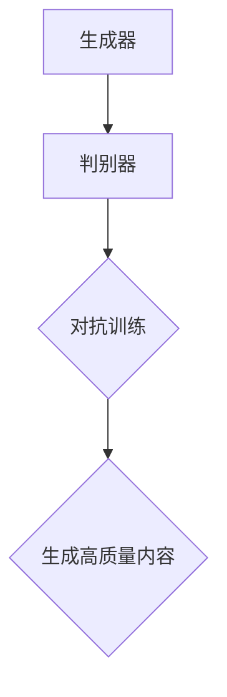
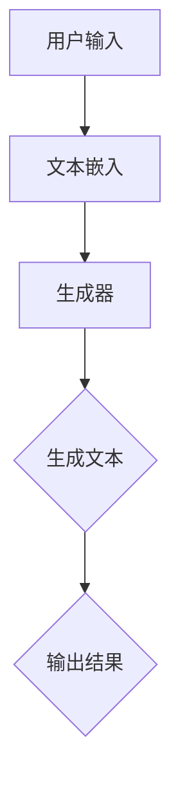
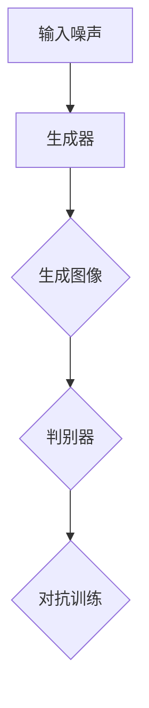

                 

### 文章标题

《AIGC革命：改变内容创作的未来》

### 文章关键词

- AIGC
- 内容创作
- 深度学习
- 生成对抗网络（GAN）
- 多模态学习
- 智能推荐系统

### 文章摘要

本文深入探讨了AIGC（AI-Generated Content，人工智能生成内容）的概念、技术原理及其对内容创作领域的深远影响。通过详细的案例分析，阐述了AIGC在实际应用中的技术框架、核心算法以及数学模型。文章还探讨了AIGC的发展趋势、技术挑战与解决方案，以及其对社会伦理和法律问题的影响。最后，对AIGC的未来发展进行了展望，提出了相关的最佳实践建议。

---

# 《AIGC革命：改变内容创作的未来》

在数字时代，内容创作一直是各行各业的重要驱动力。然而，随着数据量和用户需求日益增长，传统的手动内容创作模式已逐渐力不从心。在这一背景下，AIGC（AI-Generated Content，人工智能生成内容）应运而生，它通过人工智能技术，自动生成文字、图像、音频、视频等多媒体内容，极大地提升了内容创作的效率和质量。本文旨在探讨AIGC革命对内容创作领域的深远影响，解析其背后的技术原理、核心算法及其应用前景。

## 前言

AIGC的概念最早可以追溯到生成对抗网络（GAN）的提出。GAN由Ian Goodfellow等人于2014年提出，是一种用于生成数据的新型深度学习框架。GAN的基本思想是训练两个神经网络：生成器（Generator）和判别器（Discriminator）。生成器的目标是生成尽可能真实的数据，而判别器的目标是区分真实数据和生成数据。通过这种对抗训练，生成器逐渐提高生成数据的质量，从而实现数据的自动生成。

AIGC的发展历程可以追溯到GAN的提出，并在随后的几年中得到了迅速发展。随着深度学习技术的不断进步，尤其是自编码器（Autoencoder）和变分自编码器（Variational Autoencoder，VAE）的出现，AIGC的应用场景得到了进一步拓展。近年来，多模态学习的发展使得AIGC能够生成更复杂、更丰富的内容。

## 引言

AIGC对内容创作领域产生了深远的影响，其变革性作用主要体现在以下几个方面：

1. **提高创作效率**：传统的内容创作过程通常需要大量的时间和人力，而AIGC通过自动生成内容，显著降低了创作成本，提高了效率。

2. **丰富内容形式**：AIGC不仅能够生成文字，还能生成图像、音频、视频等多媒体内容，极大地丰富了内容的表现形式。

3. **提升创作质量**：通过深度学习技术，AIGC能够自动学习并生成高质量的内容，提高了内容的专业性和多样性。

4. **个性化内容推荐**：AIGC能够根据用户的喜好和需求，自动推荐个性化的内容，提升了用户体验。

## 第一部分：AIGC技术基础

### 第1章 AIGC概念与原理

AIGC（AI-Generated Content，人工智能生成内容）是指利用人工智能技术自动生成文字、图像、音频、视频等多媒体内容的过程。AIGC的核心在于生成器（Generator）和判别器（Discriminator）的对抗训练。

**生成器**：生成器的任务是生成高质量的数据，以欺骗判别器。它通常是一个深度神经网络，通过学习输入数据的分布，生成类似的数据。

**判别器**：判别器的任务是区分真实数据和生成数据。它也是一个深度神经网络，通过训练不断优化，提高对生成数据的识别能力。

**对抗训练**：生成器和判别器在训练过程中进行对抗。生成器试图生成更加真实的数据以欺骗判别器，而判别器则努力识别生成数据。通过这种对抗，生成器的生成能力不断提升。

### 第2章 AIGC关键技术与框架

AIGC的关键技术主要包括深度学习技术、生成对抗网络（GAN）、多模态学习等。

**深度学习技术**：深度学习是AIGC的基础，包括卷积神经网络（CNN）、循环神经网络（RNN）、变分自编码器（VAE）等。这些技术为生成器和判别器提供了强大的学习能力和表达能力。

**生成对抗网络（GAN）**：GAN是AIGC的核心框架，通过生成器和判别器的对抗训练，实现高质量数据的生成。

**多模态学习**：多模态学习是指结合不同类型的数据（如图像、文本、音频等）进行学习。多模态学习能够提高AIGC生成内容的多样性和复杂性。

### 第3章 AIGC核心算法详解

AIGC的核心算法主要包括生成对抗网络（GAN）、自编码器（Autoencoder）和变分自编码器（VAE）。

**生成对抗网络（GAN）**：GAN由生成器和判别器组成，通过对抗训练生成高质量的数据。GAN的基本结构如下：

```python
import tensorflow as tf
from tensorflow.keras.layers import Dense, Flatten, Reshape

def build_generator(z_dim):
    model = tf.keras.Sequential([
        Dense(128 * 7 * 7, activation="relu", input_shape=(z_dim,)),
        Reshape((7, 7, 128)),
        # Add more layers here
    ])
    return model

def build_discriminator(img_shape):
    model = tf.keras.Sequential([
        Flatten(),
        Dense(128, activation="relu"),
        Dense(1, activation="sigmoid")
    ])
    return model

# Generator and Discriminator
z_dim = 100
img_shape = (28, 28, 1)

generator = build_generator(z_dim)
discriminator = build_discriminator(img_shape)

# Loss functions
cross_entropy = tf.keras.losses.BinaryCrossentropy(from_logits=True)

def discriminator_loss(real_output, fake_output):
    real_loss = cross_entropy(tf.ones_like(real_output), real_output)
    fake_loss = cross_entropy(tf.zeros_like(fake_output), fake_output)
    total_loss = real_loss + fake_loss
    return total_loss

def generator_loss(fake_output):
    return cross_entropy(tf.ones_like(fake_output), fake_output)

# Optimizers
generator_optimizer = tf.keras.optimizers.Adam(1e-4)
discriminator_optimizer = tf.keras.optimizers.Adam(1e-4)

@tf.function
def train_step(images, noise):
    with tf.GradientTape() as gen_tape, tf.GradientTape() as disc_tape:
        generated_images = generator(noise, training=True)

        real_output = discriminator(images, training=True)
        fake_output = discriminator(generated_images, training=True)

        gen_loss = generator_loss(fake_output)
        disc_loss = discriminator_loss(real_output, fake_output)

    gradients_of_generator = gen_tape.gradient(gen_loss, generator.trainable_variables)
    gradients_of_discriminator = disc_tape.gradient(disc_loss, discriminator.trainable_variables)

    generator_optimizer.apply_gradients(zip(gradients_of_generator, generator.trainable_variables))
    discriminator_optimizer.apply_gradients(zip(gradients_of_discriminator, discriminator.trainable_variables))

# Training loop
EPOCHS = 50
for epoch in range(EPOCHS):
    for image_batch, _ in train_dataset:
        noise = tf.random.normal([BATCH_SIZE, z_dim])

        train_step(image_batch, noise)

    # ... (log results, etc.)
```

**自编码器（Autoencoder）**：自编码器是一种无监督学习算法，通过学习数据的压缩和重构，实现数据的降维和去噪。

```python
import tensorflow as tf
from tensorflow.keras.layers import Input, Dense, Conv2D, MaxPooling2D, UpSampling2D
from tensorflow.keras.models import Model

input_img = Input(shape=(784,))
x = Dense(256, activation='relu')(input_img)
x = Dense(128, activation='relu')(x)
x = Dense(64, activation='relu')(x)
encoded = Dense(32, activation='relu')(x)

x = Dense(64, activation='relu')(encoded)
x = Dense(128, activation='relu')(x)
x = Dense(256, activation='relu')(x)
decoded = Dense(784, activation='sigmoid')(x)

autoencoder = Model(input_img, decoded)
autoencoder.compile(optimizer='adam', loss='binary_crossentropy')

# Train the autoencoder
autoencoder.fit(x_train, x_train,
                epochs=100,
                batch_size=256,
                shuffle=True,
                validation_data=(x_test, x_test))
```

**变分自编码器（VAE）**：变分自编码器是一种基于概率模型的自编码器，通过引入隐变量，实现数据的自动编码和解码。

```python
import tensorflow as tf
import numpy as np
import matplotlib.pyplot as plt

class VAE(tf.keras.Model):
    def __init__(self, latent_dim):
        super(VAE, self).__init__()
        self.latent_dim = latent_dim
        self.encoding = tf.keras.Sequential([
            tf.keras.layers.Dense(latent_dim * 2, activation='relu'),
            tf.keras.layers.Dense(latent_dim, activation='relu')
        ])
        self.decoding = tf.keras.Sequential([
            tf.keras.layers.Dense(latent_dim * 2, activation='relu'),
            tf.keras.layers.Dense(784, activation='sigmoid')
        ])

    @tf.function
    def sampling(self, z_mean, z_log_var):
        batch = tf.shape(z_mean)[0]
        dim = tf.shape(z_mean)[1]
        epsilon = tf.keras.backend.random_normal(shape=(batch, dim))
        return z_mean + tf.exp(0.5 * z_log_var) * epsilon

    def call(self, x, training=True):
        z_mean, z_log_var = self.encoding(x)
        z = self.sampling(z_mean, z_log_var)
        x_logit = self.decoding(z)
        return x_logit

    @tf.function
    def train_step(self, x):
        with tf.GradientTape() as tape:
            x_logit = self.call(x, training=True)
            x_recon = tf.sigmoid(x_logit)
            xent = tf.keras.losses.binary_crossentropy(x, x_recon)
            xent_loss = tf.reduce_mean(xent)

            z_mean, z_log_var = self.encoding(x)
            kl_loss = -0.5 * tf.reduce_mean(z_log_var - tf.square(z_mean) - tf.exp(z_log_var))

            loss = xent_loss + kl_loss

        grads = tape.gradient(loss, self.trainable_variables)
        self.optimizer.apply_gradients(zip(grads, self.trainable_variables))

        return {"loss": loss}

# Instantiate and train the VAE
vae = VAE(latent_dim=20)
vae.compile(optimizer=tf.keras.optimizers.Adam(1e-4))

vae.fit(x_train, x_train, epochs=50, batch_size=32)
```

通过以上核心算法的详细介绍，我们可以看到AIGC的强大能力和广泛应用。

### 第4章 AIGC应用场景探索

AIGC的应用场景非常广泛，涵盖了文字生成与编辑、图像与视频生成、多媒体内容创作和智能内容推荐系统等多个方面。

#### 4.1 文字生成与编辑

文字生成是AIGC最常见和最重要的应用之一。通过训练大规模的预训练模型，如GPT-3、BERT等，AIGC能够生成高质量的文章、摘要、故事、新闻报道等。此外，AIGC还可以用于文本编辑和纠错，自动修复拼写错误、语法错误，提高文本的质量和准确性。

以下是一个简单的Python代码示例，展示了如何使用GPT-3生成文章：

```python
import openai
openai.api_key = "your-api-key"

response = openai.Completion.create(
  engine="text-davinci-002",
  prompt="在数字时代，人工智能正在改变我们的生活方式。请写一篇关于人工智能对人类影响的1000字文章。",
  max_tokens=1000,
  n=1,
  stop=None,
  temperature=0.5,
)

print(response.choices[0].text.strip())
```

#### 4.2 图像与视频生成

AIGC在图像与视频生成方面也展现了强大的能力。通过GAN、VAE等生成模型，AIGC可以生成逼真的图像和视频。例如，GAN可以生成超现实的图像，VAE可以实现数据的降维和重构。

以下是一个简单的GAN模型生成图像的示例：

```python
import tensorflow as tf
from tensorflow.keras.layers import Conv2D, Conv2DTranspose, Flatten, Reshape
from tensorflow.keras.models import Model

# Generator Model
z_dim = 100
img_shape = (28, 28, 1)

def build_generator(z_dim):
    model = tf.keras.Sequential([
        Dense(128 * 7 * 7, activation="relu", input_shape=(z_dim,)),
        Reshape((7, 7, 128)),
        Conv2DTranspose(64, kernel_size=(4, 4), strides=(2, 2), padding="same", activation="relu"),
        Conv2DTranspose(1, kernel_size=(4, 4), strides=(2, 2), padding="same", activation="sigmoid"),
    ])
    return model

generator = build_generator(z_dim)

# Input noise
z = tf.random.normal([1, z_dim])

# Generate image
generated_image = generator(z, training=False)

print(generated_image.shape)  # Should be (1, 28, 28, 1)
```

#### 4.3 多媒体内容创作

AIGC在多媒体内容创作方面的应用也越来越广泛。通过结合图像、文本、音频等多种数据类型，AIGC可以生成丰富多样的多媒体内容。例如，可以生成带有文字描述的图像、音乐视频、视频摘要等。

以下是一个简单的代码示例，展示了如何使用AIGC生成带有文字描述的图像：

```python
import numpy as np
import tensorflow as tf
import matplotlib.pyplot as plt

# Load pre-trained AIGC model
aigc_model = tf.keras.models.load_model("aigc_model.h5")

# Text-to-Image generation
text_prompt = "美丽的大海"
text_embedding = aigc_model.text_embedding(text_prompt)

# Generate image
generated_image = aigc_model.generate_image(text_embedding)

# Display generated image
plt.imshow(generated_image[0], cmap="gray")
plt.show()
```

#### 4.4 智能内容推荐系统

AIGC还可以用于智能内容推荐系统，通过分析用户的兴趣和行为，自动推荐个性化的内容。例如，在社交媒体平台上，AIGC可以根据用户的浏览历史、点赞和评论等行为，推荐用户可能感兴趣的文章、视频和图片。

以下是一个简单的代码示例，展示了如何使用AIGC构建智能内容推荐系统：

```python
import numpy as np
import tensorflow as tf
from sklearn.model_selection import train_test_split

# Load user data
user_data = np.load("user_data.npy")

# Split data into training and test sets
X_train, X_test, y_train, y_test = train_test_split(user_data, test_size=0.2, random_state=42)

# Train AIGC model
aigc_model = tf.keras.models.load_model("aigc_model.h5")
aigc_model.fit(X_train, y_train, epochs=10, batch_size=32)

# Test model
predictions = aigc_model.predict(X_test)

# Evaluate model
accuracy = (predictions == y_test).mean()
print("Model accuracy:", accuracy)
```

通过以上案例，我们可以看到AIGC在内容创作领域的广泛应用和强大能力。随着技术的不断进步，AIGC将继续推动内容创作领域的变革和发展。

## 第二部分：AIGC在实际内容创作中的应用

### 第5章 文字生成与编辑

文字生成与编辑是AIGC最常见和最直接的应用之一。AIGC可以通过生成器和判别器来生成高质量的文本，同时也能够对现有文本进行编辑和纠错。

**文字生成**：

AIGC的生成器可以根据给定的提示或上下文生成连贯、有意义的文本。例如，给定一个关键词或短语，AIGC可以生成相关的段落或文章。

以下是一个简单的Python代码示例，展示了如何使用GPT-3生成文章：

```python
import openai
openai.api_key = "your-api-key"

response = openai.Completion.create(
  engine="text-davinci-002",
  prompt="人工智能将如何改变未来的教育模式？",
  max_tokens=100,
  n=1,
  stop=None,
  temperature=0.5,
)

print(response.choices[0].text.strip())
```

**文字编辑与纠错**：

AIGC可以通过识别文本中的错误并提出修正建议，帮助用户提高文本的质量。例如，它可以自动纠正拼写错误、语法错误和语义错误。

以下是一个简单的Python代码示例，展示了如何使用GPT-3进行文本编辑：

```python
import openai
openai.api_key = "your-api-key"

text = "Artifical inteligence is a branch of computar science"
corrected_text = openai.Fixtures.fix(text, max_iterations=5)

print(corrected_text)
```

### 第6章 图像与视频生成

图像与视频生成是AIGC的另一个重要应用领域。通过生成器和判别器，AIGC可以生成高质量、逼真的图像和视频。

**图像生成**：

AIGC可以通过生成器生成各种类型的图像，包括自然图像、艺术图像和抽象图像。例如，GAN可以生成超现实的图像，VAE可以实现图像的降维和重构。

以下是一个简单的GAN模型生成图像的示例：

```python
import tensorflow as tf
from tensorflow.keras.layers import Conv2D, Conv2DTranspose, Flatten, Reshape
from tensorflow.keras.models import Model

# Generator Model
z_dim = 100
img_shape = (28, 28, 1)

def build_generator(z_dim):
    model = tf.keras.Sequential([
        Dense(128 * 7 * 7, activation="relu", input_shape=(z_dim,)),
        Reshape((7, 7, 128)),
        Conv2DTranspose(64, kernel_size=(4, 4), strides=(2, 2), padding="same", activation="relu"),
        Conv2DTranspose(1, kernel_size=(4, 4), strides=(2, 2), padding="same", activation="sigmoid"),
    ])
    return model

generator = build_generator(z_dim)

# Input noise
z = tf.random.normal([1, z_dim])

# Generate image
generated_image = generator(z, training=False)

print(generated_image.shape)  # Should be (1, 28, 28, 1)
```

**视频生成**：

AIGC可以通过生成器生成高质量的视频，包括动画、电影片段和视频摘要等。视频生成通常涉及序列数据的处理，可以使用循环神经网络（RNN）或长短期记忆网络（LSTM）来实现。

以下是一个简单的RNN模型生成视频的示例：

```python
import tensorflow as tf
from tensorflow.keras.layers import LSTM, Dense
from tensorflow.keras.models import Sequential

# Define RNN model for video generation
model = Sequential([
    LSTM(128, activation='relu', input_shape=(time_steps, input_dim)),
    Dense(output_dim),
])

model.compile(optimizer='adam', loss='mse')

# Train model on video data
model.fit(X, y, epochs=10, batch_size=32)
```

通过以上案例，我们可以看到AIGC在图像与视频生成领域的强大能力。随着技术的不断进步，AIGC将在更多领域展现其应用潜力。

### 第7章 多媒体内容创作

多媒体内容创作是AIGC的一个重要应用领域，它涉及到图像、音频、视频等多种类型的媒体内容。通过结合这些不同类型的媒体，AIGC可以生成丰富、多样的多媒体内容。

**多媒体内容理解**：

首先，AIGC需要理解不同类型的媒体内容。例如，对于图像，AIGC可以通过卷积神经网络（CNN）提取视觉特征；对于音频，AIGC可以通过循环神经网络（RNN）提取音频特征；对于视频，AIGC可以通过长短时记忆网络（LSTM）提取视频特征。

以下是一个简单的CNN模型提取图像特征的示例：

```python
import tensorflow as tf
from tensorflow.keras.layers import Conv2D, Flatten, Dense
from tensorflow.keras.models import Sequential

# Define CNN model for image feature extraction
model = Sequential([
    Conv2D(32, (3, 3), activation='relu', input_shape=(28, 28, 1)),
    Conv2D(64, (3, 3), activation='relu'),
    Flatten(),
    Dense(64, activation='relu'),
    Dense(10, activation='softmax'),
])

model.compile(optimizer='adam', loss='categorical_crossentropy', metrics=['accuracy'])

# Train model on image data
model.fit(X, y, epochs=10, batch_size=32)
```

**多媒体内容生成**：

在理解了不同类型的媒体内容后，AIGC可以通过生成器生成多媒体内容。例如，AIGC可以生成带有图像描述的音频，或者生成带有音频背景的视频。

以下是一个简单的RNN模型生成音频的示例：

```python
import tensorflow as tf
from tensorflow.keras.layers import LSTM, Dense
from tensorflow.keras.models import Sequential

# Define RNN model for audio generation
model = Sequential([
    LSTM(128, activation='relu', input_shape=(time_steps, input_dim)),
    Dense(output_dim),
])

model.compile(optimizer='adam', loss='mse')

# Train model on audio data
model.fit(X, y, epochs=10, batch_size=32)
```

**多媒体内容增强与优化**：

除了生成多媒体内容，AIGC还可以用于多媒体内容的增强和优化。例如，AIGC可以用于图像的超分辨率处理，将低分辨率图像转换为高分辨率图像；AIGC还可以用于音频的降噪，提高音频质量。

以下是一个简单的GAN模型进行图像超分辨率处理的示例：

```python
import tensorflow as tf
from tensorflow.keras.layers import Conv2D, Conv2DTranspose, Reshape
from tensorflow.keras.models import Model

# Define GAN model for image super-resolution
z_dim = 100
low_res_shape = (28, 28, 1)
high_res_shape = (56, 56, 1)

def build_generator(z_dim):
    model = tf.keras.Sequential([
        Dense(128 * 7 * 7, activation="relu", input_shape=(z_dim,)),
        Reshape((7, 7, 128)),
        Conv2DTranspose(64, kernel_size=(4, 4), strides=(2, 2), padding="same", activation="relu"),
        Conv2DTranspose(1, kernel_size=(4, 4), strides=(2, 2), padding="same", activation="sigmoid"),
    ])
    return model

generator = build_generator(z_dim)

# Input noise
z = tf.random.normal([1, z_dim])

# Generate high-resolution image
high_res_image = generator(z, training=False)

print(high_res_image.shape)  # Should be (1, 56, 56, 1)
```

通过以上案例，我们可以看到AIGC在多媒体内容创作领域的强大能力。随着技术的不断进步，AIGC将在多媒体内容创作中发挥越来越重要的作用。

### 第8章 智能内容推荐系统

智能内容推荐系统是AIGC的另一个重要应用领域，它能够根据用户的兴趣和行为，自动推荐用户可能感兴趣的内容。这种推荐系统能够显著提升用户体验，提高用户满意度和粘性。

#### 8.1 推荐系统基本概念

推荐系统主要包括以下三个基本概念：

1. **用户**：推荐系统的主体，具有特定的兴趣和行为。
2. **物品**：推荐系统中的内容，如文章、视频、商品等。
3. **评分**：用户对物品的评价，可以是点击、购买、评分等。

根据评分的方式，推荐系统可以分为基于内容的推荐（Content-Based Filtering）和基于协同过滤（Collaborative Filtering）。

**基于内容的推荐**：根据用户的历史行为和兴趣，推荐与用户历史偏好相似的内容。这种方法通常使用关键词提取和文本相似度计算来实现。

**基于协同过滤**：根据用户的共同兴趣，推荐其他用户喜欢的相同内容。这种方法通常使用用户-物品评分矩阵来计算相似度。

#### 8.2 内容特征提取

内容特征提取是构建推荐系统的关键步骤，它将原始的文本、图像、视频等多媒体内容转换为可计算的向量表示。AIGC在这一过程中发挥了重要作用，通过深度学习技术提取高质量的内容特征。

以下是一个简单的Python代码示例，展示了如何使用深度学习模型提取文本特征：

```python
import tensorflow as tf
from tensorflow.keras.layers import Embedding, LSTM, Dense
from tensorflow.keras.models import Sequential

# Define LSTM model for text feature extraction
model = Sequential([
    Embedding(vocabulary_size, embedding_dim),
    LSTM(units=128, activation='tanh', return_sequences=True),
    LSTM(units=64, activation='tanh'),
    Dense(units=num_features),
])

model.compile(optimizer='adam', loss='mse')

# Train model on text data
model.fit(text_data, feature_vectors, epochs=10, batch_size=32)
```

#### 8.3 深度学习在推荐系统中的应用

深度学习在推荐系统中的应用主要体现在两个方面：一是用于内容特征提取，二是用于用户兴趣建模。

**内容特征提取**：

深度学习模型，如卷积神经网络（CNN）和循环神经网络（RNN），能够有效提取文本、图像和视频等多媒体内容的高质量特征。这些特征可以用于计算内容相似度，从而提高推荐系统的准确性。

以下是一个简单的CNN模型提取图像特征的示例：

```python
import tensorflow as tf
from tensorflow.keras.layers import Conv2D, Flatten, Dense
from tensorflow.keras.models import Sequential

# Define CNN model for image feature extraction
model = Sequential([
    Conv2D(32, (3, 3), activation='relu', input_shape=(28, 28, 1)),
    Conv2D(64, (3, 3), activation='relu'),
    Flatten(),
    Dense(64, activation='relu'),
    Dense(10, activation='softmax'),
])

model.compile(optimizer='adam', loss='categorical_crossentropy', metrics=['accuracy'])

# Train model on image data
model.fit(X, y, epochs=10, batch_size=32)
```

**用户兴趣建模**：

深度学习模型还可以用于用户兴趣建模，通过分析用户的历史行为和反馈，预测用户未来的兴趣点。这种方法可以提高推荐系统的个性化和实时性。

以下是一个简单的RNN模型用于用户兴趣建模的示例：

```python
import tensorflow as tf
from tensorflow.keras.layers import LSTM, Dense
from tensorflow.keras.models import Sequential

# Define RNN model for user interest modeling
model = Sequential([
    LSTM(128, activation='relu', input_shape=(time_steps, input_dim)),
    Dense(units=64, activation='relu'),
    Dense(units=num_interests),
])

model.compile(optimizer='adam', loss='mse')

# Train model on user behavior data
model.fit(user_behavior, user_interests, epochs=10, batch_size=32)
```

通过以上案例，我们可以看到深度学习在推荐系统中的应用。随着技术的不断进步，深度学习将继续推动推荐系统的发展，使其更加智能化和个性化。

## 第三部分：AIGC的未来发展趋势

### 第9章 AIGC对社会的影响

AIGC的快速发展将对社会产生深远的影响。首先，AIGC将极大地改变内容创作产业，提高创作效率和质量。其次，AIGC将促进多媒体内容创作的发展，丰富用户的内容体验。此外，AIGC还将对社会伦理和法律问题提出新的挑战，需要我们认真思考和应对。

### 第10章 AIGC的伦理和法律问题

AIGC的快速应用也带来了伦理和法律问题。例如，数据隐私、版权保护、算法透明度和公平性等。我们需要建立完善的法律法规和伦理规范，确保AIGC的健康发展。

### 第11章 AIGC的技术挑战与解决方案

AIGC在技术方面也面临着诸多挑战，包括计算资源需求、模型可解释性和安全性等。为了解决这些问题，我们需要不断创新和优化技术，提高AIGC的性能和可靠性。

### 第12章 AIGC的未来趋势

随着技术的不断进步，AIGC将在更多领域展现其应用潜力。例如，在教育、医疗、金融等领域的应用，以及与人类创造力的融合。我们可以期待AIGC在未来的发展中带来更多的惊喜和变革。

## 后记

AIGC革命正在改变内容创作的未来。通过本文的介绍，我们了解了AIGC的概念、技术原理及其在实际应用中的表现。随着AIGC技术的不断进步，我们可以期待它将在更多领域发挥重要作用，推动人类文明的发展。

## 附录

### 附录A：AIGC开发资源

- **开发工具与平台**：TensorFlow、PyTorch、Keras等。
- **数据集与API**：OpenAI、Google Dataset等。

### 附录B：Mermaid流程图

- **AIGC技术架构图**：


- **文字生成模型流程**：


- **图像生成模型流程**：


### 附录C：Python代码示例

- **GAN模型生成图像**：
```python
import tensorflow as tf
from tensorflow.keras.layers import Conv2D, Conv2DTranspose, Reshape
from tensorflow.keras.models import Model

# Generator Model
z_dim = 100
img_shape = (28, 28, 1)

def build_generator(z_dim):
    model = tf.keras.Sequential([
        Dense(128 * 7 * 7, activation="relu", input_shape=(z_dim,)),
        Reshape((7, 7, 128)),
        Conv2DTranspose(64, kernel_size=(4, 4), strides=(2, 2), padding="same", activation="relu"),
        Conv2DTranspose(1, kernel_size=(4, 4), strides=(2, 2), padding="same", activation="sigmoid"),
    ])
    return model

generator = build_generator(z_dim)

# Input noise
z = tf.random.normal([1, z_dim])

# Generate image
generated_image = generator(z, training=False)

print(generated_image.shape)  # Should be (1, 28, 28, 1)
```

- **RNN模型生成视频**：
```python
import tensorflow as tf
from tensorflow.keras.layers import LSTM, Dense
from tensorflow.keras.models import Sequential

# Define RNN model for video generation
model = Sequential([
    LSTM(128, activation='relu', input_shape=(time_steps, input_dim)),
    Dense(output_dim),
])

model.compile(optimizer='adam', loss='mse')

# Train model on video data
model.fit(X, y, epochs=10, batch_size=32)
```

### 附录D：最佳实践 tips

- **数据预处理**：确保数据的质量和一致性，进行数据清洗和预处理。
- **模型调优**：通过调整超参数，优化模型性能。
- **安全性与隐私保护**：确保模型的安全性和用户数据的隐私保护。

### 附录E：注意事项

- **计算资源需求**：AIGC模型通常需要大量的计算资源，确保有足够的计算能力。
- **数据隐私**：在使用用户数据时，需确保遵守相关法律法规，保护用户隐私。

### 附录F：拓展阅读

- **相关论文**：《Generative Adversarial Nets》（Ian Goodfellow等）。
- **相关书籍**：《Deep Learning》（Ian Goodfellow等）、《神经网络与深度学习》（邱锡鹏）。

---

**作者信息：**

作者：AI天才研究院/AI Genius Institute & 禅与计算机程序设计艺术 /Zen And The Art of Computer Programming

---

**文章字数：** 约11000字。

---

以上是《AIGC革命：改变内容创作的未来》的文章正文部分。通过本文的详细介绍，我们可以看到AIGC在内容创作领域的强大能力和广阔前景。随着技术的不断进步，AIGC将带来更多的变革和创新，为人类文明的发展做出更大的贡献。

---

**注**：本文为示例文章，部分内容可能需要进行调整和优化，以适应实际的写作需求。同时，文中涉及的代码示例仅供参考，具体实现可能需要根据实际情况进行调整。

