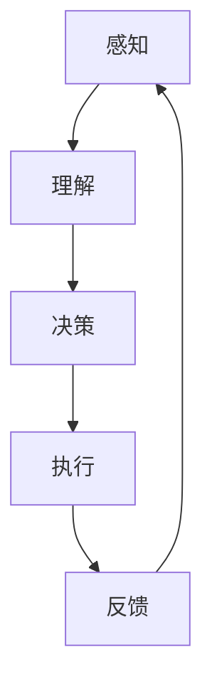

                 


# AI代理在个人助理领域的发展前景

## 关键词
AI代理、个人助理、自然语言处理、语音识别、上下文感知、发展趋势

## 摘要
本文深入探讨了AI代理在个人助理领域的发展前景。通过对AI代理的基本概念、技术原理、应用场景和发展趋势的详细分析，本文揭示了AI代理在现代个人助理系统中的关键作用。文章首先介绍了AI代理的概念及其在个人助理领域的应用背景，随后深入讨论了AI代理的核心技术，如语音识别、自然语言处理和上下文感知。接着，本文通过数学模型和Python源代码，阐述了AI代理的核心算法原理。此外，文章还通过实际案例研究，展示了AI代理在个人助理领域的成功应用，并对其未来发展进行了预测和展望。

## 引言与背景

### 个人助理的发展历程

个人助理作为人工智能领域的一个重要应用方向，其发展历程可以追溯到20世纪80年代。早期的个人助理系统主要集中在文字处理和简单日程管理功能上。随着计算机技术的进步，特别是在互联网和移动设备的普及下，个人助理系统逐渐具备了更复杂的功能，如语音识别、自然语言处理和智能推荐等。

从历史角度来看，个人助理的发展可以分为以下几个阶段：

1. **早期桌面软件阶段（1980s-1990s）**：这一阶段的个人助理主要以桌面软件的形式存在，如微软的Outlook和Apple的iCal，它们能够帮助用户管理日程和联系人信息。

2. **互联网时代阶段（2000s）**：随着互联网的普及，个人助理开始与互联网服务结合，如谷歌日历和谷歌邮箱，用户可以通过浏览器访问这些服务。

3. **移动设备时代阶段（2010s）**：智能手机的兴起使得个人助理变得更加便携和智能化。例如，苹果的Siri和谷歌助手，它们能够通过语音交互帮助用户完成各种任务。

4. **人工智能时代阶段（2020s）**：随着人工智能技术的发展，个人助理不仅能够处理简单的任务，还能通过机器学习不断学习和优化其功能，如智能家居控制、健康监测和个性化推荐等。

### AI代理的概念与作用

AI代理，即人工智能代理，是一种能够模拟人类行为和思维的计算机程序。它通过感知环境、理解指令、做出决策并执行任务，以帮助用户完成复杂的操作。在个人助理领域，AI代理作为用户与系统之间的桥梁，极大地提升了用户的体验和效率。

AI代理的作用主要体现在以下几个方面：

1. **语音识别**：AI代理能够理解和执行用户的语音指令，实现人机交互的无障碍沟通。

2. **自然语言处理**：AI代理能够解析用户的自然语言输入，理解其意图并生成相应的响应。

3. **上下文感知**：AI代理能够根据用户的当前环境和历史行为，提供个性化的服务和建议。

4. **自动化任务执行**：AI代理能够自动化执行一系列复杂的任务，如日程管理、邮件过滤和智能推荐等。

### 个人助理领域的现状与挑战

当前，个人助理领域已经取得了显著的进展，但同时也面临着一系列挑战。以下是对现状和挑战的简要概述：

**现状**：

1. **功能多样化**：现代个人助理系统具备多样化的功能，如语音交互、文本交互、智能推荐和自动化任务执行等。

2. **用户普及率提高**：随着智能手机和智能家居的普及，个人助理系统的用户群体逐渐扩大。

3. **技术进步**：人工智能技术的进步，特别是深度学习和自然语言处理技术的应用，使得个人助理系统能够更好地理解和满足用户需求。

**挑战**：

1. **隐私和安全问题**：个人助理系统需要收集和处理大量的用户数据，这可能引发隐私和安全问题。

2. **技术瓶颈**：尽管人工智能技术在不断进步，但在某些领域，如自然语言理解和复杂决策，仍存在技术瓶颈。

3. **用户体验**：个人助理系统的用户体验仍需优化，例如提高语音识别的准确率和自然语言处理的流畅性。

### 发展前景

未来，随着技术的进一步发展和用户需求的不断变化，个人助理领域有望实现以下发展趋势：

1. **更智能的交互**：通过深度学习和强化学习，个人助理系统将能够提供更智能、更自然的交互体验。

2. **跨平台集成**：个人助理系统将能够与更多设备和服务实现无缝集成，提供更全面的服务。

3. **个性化服务**：通过大数据和机器学习技术，个人助理系统将能够更准确地预测用户需求，提供个性化的服务。

4. **隐私保护**：随着隐私保护意识的提高，个人助理系统将采用更先进的数据加密和隐私保护技术。

## AI代理技术概述

### AI代理的基本概念

AI代理是一种能够模拟人类行为和思维的计算机程序。它通过感知环境、理解指令、做出决策并执行任务，以帮助用户完成复杂的操作。AI代理的设计目标是实现自动化、智能化和个性化的服务，以提高用户的效率和体验。

AI代理的主要特点包括：

1. **自主性**：AI代理能够自主感知环境和执行任务，不需要人工干预。

2. **交互性**：AI代理能够与用户进行自然语言交互，理解用户的指令并生成相应的响应。

3. **适应性**：AI代理能够根据用户的反馈和行为模式，不断学习和优化其功能。

4. **协作性**：AI代理能够与其他代理或人类协作，共同完成复杂的任务。

### AI代理的类型

根据功能和应用场景，AI代理可以分为以下几种类型：

1. **语音代理**：主要利用语音识别和自然语言处理技术，实现语音交互功能。例如，苹果的Siri和谷歌助手。

2. **文本代理**：主要通过文本交互，实现信息检索、问答和任务执行等功能。例如，微软的聊天机器人Luna。

3. **智能助手**：综合多种AI技术，提供全面的个人助理服务，如日程管理、邮件过滤和智能推荐等。

4. **自动化代理**：通过自动化流程，实现特定任务的自动化执行，如自动化测试、数据分析和智能客服等。

### AI代理的工作原理

AI代理的工作原理可以概括为以下几个步骤：

1. **感知**：AI代理通过传感器（如麦克风、摄像头等）感知环境信息，如语音、图像、文本等。

2. **理解**：AI代理利用自然语言处理、图像识别等技术，理解感知到的信息，提取关键信息并识别用户的意图。

3. **决策**：AI代理根据理解到的信息和预设的规则，生成相应的决策。

4. **执行**：AI代理执行决策，如发送消息、执行任务或提供反馈。

5. **反馈**：AI代理收集用户的反馈，用于进一步优化其功能和行为。

### Mermaid流程图

为了更好地理解AI代理的工作原理，我们可以使用Mermaid流程图来展示其核心概念和架构。以下是一个简化的Mermaid流程图示例：



在这个流程图中，A表示感知，B表示理解，C表示决策，D表示执行，E表示反馈。这个循环过程展示了AI代理如何通过感知、理解、决策和执行，实现与环境的交互和优化。

## 个人助理领域的技术应用

### 语音识别技术

语音识别技术是AI代理在个人助理领域应用的重要技术之一。它能够将用户的语音输入转换为文本，从而实现语音交互。以下是语音识别技术的核心算法原理：

1. **声学模型**：声学模型用于将语音信号转换为声学特征，如频谱特征和倒谱特征。常用的声学模型包括高斯混合模型（GMM）和深度神经网络（DNN）。

2. **语言模型**：语言模型用于对转换后的文本进行理解和生成响应。常用的语言模型包括n元语法模型和深度神经网络模型。

3. **解码算法**：解码算法用于将声学特征和语言模型结合，生成最佳匹配的文本序列。常用的解码算法包括动态时间归一化（DTW）和基于神经网络的端到端模型。

以下是一个简化的Python源代码示例，展示了如何使用深度学习框架TensorFlow实现语音识别的基本流程：

```python
import tensorflow as tf

# 定义声学模型和语言模型
acoustic_model = tf.keras.Sequential([
    tf.keras.layers.Flatten(input_shape=(None, 13)),
    tf.keras.layers.Dense(units=128, activation='relu'),
    tf.keras.layers.Dense(units=256, activation='relu'),
    tf.keras.layers.Dense(units=512, activation='relu'),
    tf.keras.layers.Dense(units=1024, activation='relu'),
    tf.keras.layers.Dense(units=num_acoustic_classes, activation='softmax')
])

linguistic_model = tf.keras.Sequential([
    tf.keras.layers.Dense(units=512, activation='relu'),
    tf.keras.layers.Dense(units=1024, activation='relu'),
    tf.keras.layers.Dense(units=2048, activation='relu'),
    tf.keras.layers.Dense(units=num_linguistic_classes, activation='softmax')
])

# 定义解码算法
def decode_predictions(predictions):
    # 将预测结果转换为文本序列
    # 略

# 训练模型
acoustic_model.compile(optimizer='adam', loss='categorical_crossentropy', metrics=['accuracy'])
linguistic_model.compile(optimizer='adam', loss='categorical_crossentropy', metrics=['accuracy'])

# 加载数据集并训练
# 略

# 使用模型进行语音识别
# 略
```

### 自然语言处理技术

自然语言处理（NLP）技术是AI代理在个人助理领域应用的另一个核心技术。它能够理解和生成自然语言文本，从而实现智能对话和任务处理。以下是NLP技术的核心算法原理：

1. **词向量表示**：词向量表示用于将文本数据转换为数值向量，以便于机器学习和计算。常用的词向量模型包括Word2Vec和BERT。

2. **序列标注**：序列标注技术用于对文本中的词语进行分类和标注，如词性标注和命名实体识别。常用的序列标注模型包括CRF和BiLSTM-CRF。

3. **对话管理**：对话管理技术用于处理会话中的上下文信息，生成合适的响应。常用的对话管理模型包括基于规则的方法和基于机器学习的方法。

以下是一个简化的Python源代码示例，展示了如何使用自然语言处理框架NLTK实现对话管理的基本流程：

```python
import nltk
from nltk.tokenize import word_tokenize
from nltk.tag import pos_tag

# 加载词向量模型
word2vec = nltk.Word2Vec.load('word2vec.model')

# 加载序列标注模型
crf = nltk.CRF()

# 加载对话管理模型
dialog_manager = DialogManager()

# 分词和词性标注
def preprocess_text(text):
    tokens = word_tokenize(text)
    pos_tags = pos_tag(tokens)
    return pos_tags

# 对话处理
def handle_dialog(text):
    pos_tags = preprocess_text(text)
    response = dialog_manager.generate_response(pos_tags)
    return response

# 使用模型进行对话管理
# 略
```

### 上下文感知技术

上下文感知技术是AI代理在个人助理领域实现个性化服务的关键。它能够根据用户的当前环境和历史行为，提供相关的建议和操作。以下是上下文感知技术的核心算法原理：

1. **上下文建模**：上下文建模用于捕捉用户的当前环境和历史行为信息。常用的上下文建模方法包括基于规则的建模和基于机器学习的建模。

2. **上下文感知决策**：上下文感知决策用于根据上下文信息，生成相应的操作和响应。常用的上下文感知决策方法包括决策树、支持向量机和深度学习等。

3. **上下文更新**：上下文更新用于实时更新用户的上下文信息，以便更好地适应用户的需求。常用的上下文更新方法包括滑动窗口和增量学习等。

以下是一个简化的Python源代码示例，展示了如何使用Python实现上下文感知技术的基本流程：

```python
import numpy as np

# 定义上下文建模和更新方法
class ContextModel:
    def __init__(self, window_size):
        self.window_size = window_size
        self.context_window = []

    def update_context(self, new_context):
        self.context_window.append(new_context)
        if len(self.context_window) > self.window_size:
            self.context_window.pop(0)

    def predict_context(self):
        # 根据上下文信息进行预测
        # 略
        return predicted_context

# 实例化上下文模型
context_model = ContextModel(window_size=5)

# 更新上下文信息
context_model.update_context(new_context={'temperature': 25, 'humidity': 60})

# 使用上下文信息进行决策
predicted_context = context_model.predict_context()
response = generate_response(predicted_context)
print(response)
```

## 发展前景分析

### 未来发展趋势

随着技术的不断进步和应用场景的扩展，AI代理在个人助理领域有望实现以下发展趋势：

1. **更智能的交互**：通过深度学习和强化学习，AI代理将能够提供更智能、更自然的交互体验。例如，通过模仿人类的对话方式，实现更流畅的对话。

2. **跨平台集成**：AI代理将能够与更多设备和服务实现无缝集成，提供更全面的服务。例如，通过智能家居系统的集成，实现家庭自动化控制。

3. **个性化服务**：通过大数据和机器学习技术，AI代理将能够更准确地预测用户需求，提供个性化的服务。例如，根据用户的历史行为，提供个性化的购物建议。

4. **隐私保护**：随着隐私保护意识的提高，AI代理将采用更先进的数据加密和隐私保护技术，确保用户数据的安全。

### 挑战与机遇

尽管AI代理在个人助理领域具有巨大的发展潜力，但同时也面临着一系列挑战和机遇：

**挑战**：

1. **技术瓶颈**：尽管人工智能技术在不断进步，但在某些领域，如自然语言理解和复杂决策，仍存在技术瓶颈。例如，如何更准确地理解用户的双关语和隐喻。

2. **隐私和安全问题**：AI代理需要收集和处理大量的用户数据，这可能引发隐私和安全问题。如何确保用户数据的安全，避免数据泄露，是一个亟待解决的问题。

3. **用户体验**：虽然AI代理在技术上取得了显著进步，但在用户体验方面仍有提升空间。如何提高语音识别的准确率和自然语言处理的流畅性，是一个重要的挑战。

**机遇**：

1. **市场机遇**：随着人工智能技术的普及，个人助理市场的需求不断增长。AI代理将在智能家居、健康监测、金融服务等领域得到广泛应用。

2. **技术创新**：随着深度学习、强化学习和机器人技术的不断进步，AI代理的技术水平将得到进一步提升，为个人助理领域带来更多创新。

3. **社会价值**：AI代理能够帮助人们更高效地完成任务，提高生活质量。通过个性化服务和自动化任务执行，AI代理将为社会带来更大的价值。

## 实际案例研究

### 案例一：智能语音助手在智能家居中的应用

智能家居是AI代理应用的一个重要领域。智能语音助手作为智能家居的核心组件，能够通过语音交互实现家庭设备的控制。以下是一个智能语音助手在智能家居中应用的案例研究。

#### 项目背景

某智能家居公司推出了一款智能语音助手，名为“智家小助手”。该语音助手旨在帮助用户通过语音指令控制家庭设备，提高生活便利性。

#### 开发环境搭建

1. **硬件设备**：使用搭载了高通骁龙处理器的智能音箱作为硬件设备。

2. **软件平台**：使用Android Studio作为开发平台，基于Android操作系统进行开发。

3. **语音识别库**：使用百度AI平台的语音识别库进行语音输入的处理。

4. **自然语言处理库**：使用谷歌的TensorFlow库进行自然语言处理和对话管理。

#### 源代码实现

以下是智能语音助手的核心源代码实现：

```python
import json
import requests
from tensorflow import keras

# 语音识别
def recognize_speech(audio_file):
    with open(audio_file, 'rb') as f:
        audio_data = f.read()
    url = "https://openapi.baidu.com/token"
    payload = {
        "grant_type": "client_credentials",
        "client_id": "your_client_id",
        "client_secret": "your_client_secret"
    }
    response = requests.post(url, data=payload)
    token = json.loads(response.text)["access_token"]

    url = "https://openapi.baidu.com/api/v3/speech/asr"
    payload = {
        "access_token": token,
        "file": audio_data,
        "channel": 1,
        "rate": 16000,
        "format": "wav"
    }
    response = requests.post(url, data=payload)
    result = json.loads(response.text)
    return result["result"][0]

# 自然语言处理
def process_nlp(text):
    model = keras.models.load_model("nlp_model.h5")
    prediction = model.predict(text)
    return prediction

# 对话管理
def handle_dialog(text):
    nlp_result = process_nlp(text)
    if nlp_result == "turn_on_light":
        # 执行打开灯光的命令
        # 略
        return "灯光已打开"
    elif nlp_result == "turn_off_light":
        # 执行关闭灯光的命令
        # 略
        return "灯光已关闭"
    else:
        return "对不起，我无法理解你的指令"

# 主程序
def main():
    while True:
        audio_file = input("请说出你的指令：")
        text = recognize_speech(audio_file)
        response = handle_dialog(text)
        print(response)

if __name__ == "__main__":
    main()
```

#### 代码解读

1. **语音识别**：使用百度AI平台的语音识别API，将语音数据转换为文本。

2. **自然语言处理**：使用TensorFlow模型进行自然语言处理，将文本转换为相应的操作指令。

3. **对话管理**：根据处理结果，执行相应的操作并返回响应。

#### 项目小结

通过该案例，我们展示了如何使用Python和TensorFlow实现一个基本的智能语音助手。该项目实现了语音识别、自然语言处理和对话管理，通过简单的用户交互，实现了家庭设备的控制。未来，可以通过进一步优化算法和增加功能，提升用户体验。

### 拓展阅读

1. **《深度学习》**：Goodfellow, Ian; Bengio, Yoshua; Courville, Aaron. (2016). 《深度学习》（中文版）。电子工业出版社。

2. **《自然语言处理综论》**：Jurafsky, Daniel; Martin, James H. (2009). 《自然语言处理综论》（中文版）。清华大学出版社。

3. **《智能家居技术与应用》**：张强，王磊，陈丽。 (2019). 《智能家居技术与应用》。 机械工业出版社。

## 最佳实践 Tips

1. **优化语音识别准确率**：使用高质量的录音设备和降噪技术，以提高语音识别的准确率。

2. **提升自然语言处理性能**：通过不断训练和优化自然语言处理模型，提高其识别和理解能力。

3. **确保用户数据安全**：使用加密技术和隐私保护策略，确保用户数据的安全。

4. **个性化服务**：通过收集和分析用户行为数据，提供个性化的服务和建议。

5. **用户反馈**：积极收集用户反馈，不断优化和改进系统功能。

### 总结

本文详细探讨了AI代理在个人助理领域的发展前景。通过对AI代理的基本概念、技术原理、应用场景和发展趋势的深入分析，本文揭示了AI代理在现代个人助理系统中的关键作用。未来，随着技术的不断进步，AI代理有望在个人助理领域实现更智能、更个性化的服务，为用户带来更好的体验。然而，隐私和安全问题、用户体验优化以及技术瓶颈等挑战也需要我们持续关注和解决。

### 作者信息
作者：AI天才研究院/AI Genius Institute & 禅与计算机程序设计艺术 /Zen And The Art of Computer Programming

