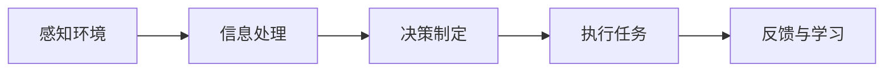
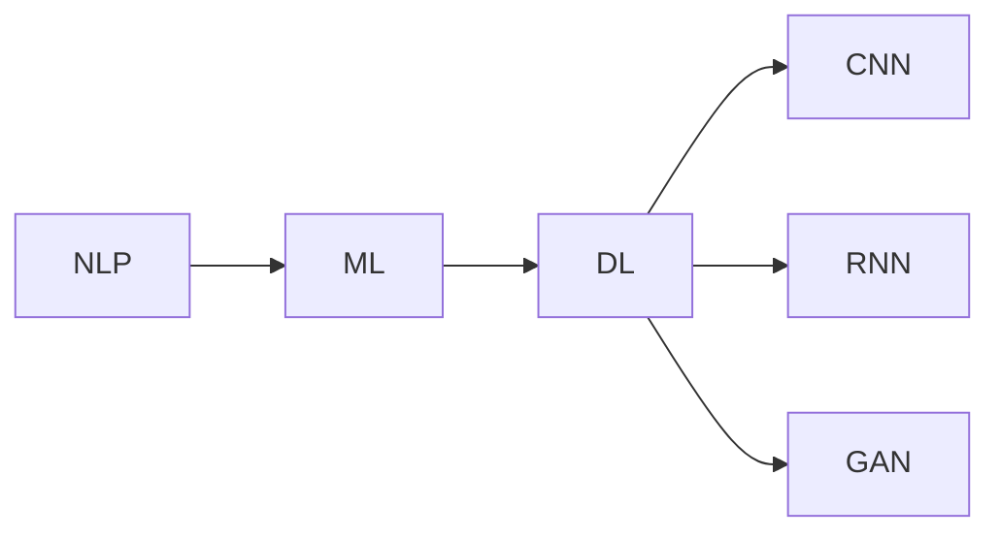

                 

# AI代理在个人生产力提升中的作用

关键词：AI代理，个人生产力，时间管理，任务自动化，自然语言处理，机器学习，深度学习

摘要：随着人工智能技术的快速发展，AI代理在个人生产力提升中的作用日益凸显。本文将深入探讨AI代理的基本概念、技术原理、应用场景、开发方法以及未来发展趋势，帮助读者全面了解AI代理在个人生产力提升中的实际应用和价值。

## 目录大纲

### 第一部分：AI代理的基础知识

#### 第1章：AI代理的定义与原理

#### 第2章：AI代理的核心技术

### 第二部分：AI代理在个人生产力提升中的应用

#### 第3章：AI代理在时间管理中的应用

#### 第4章：AI代理在任务自动化中的应用

#### 第5章：AI代理在信息处理中的应用

### 第三部分：AI代理的开发技术

#### 第6章：AI代理的开发框架

#### 第7章：AI代理的开发流程

#### 第8章：AI代理的测试与优化

### 第四部分：AI代理的实际应用案例

#### 第9章：个人助手AI代理案例

#### 第10章：时间管理AI代理案例

#### 第11章：任务自动化AI代理案例

### 第五部分：AI代理的未来发展趋势

#### 第12章：AI代理的发展趋势

#### 第13章：AI代理在未来的应用场景

#### 第14章：AI代理面临的挑战与机遇

## 引言

在当今这个信息爆炸的时代，个人生产力已经成为衡量一个人在职场和生活中成功与否的重要标准。随着人工智能技术的迅速发展，AI代理作为一种新型的智能体，已经逐渐成为提升个人生产力的有力工具。AI代理，又称智能代理，是指利用人工智能技术模拟人类行为、决策和交互的计算机程序。它能够根据用户的需求和偏好，自动执行任务，提供个性化服务，从而帮助用户提高工作效率和生活质量。

本文旨在深入探讨AI代理在个人生产力提升中的作用，通过分析AI代理的基本概念、技术原理、应用场景、开发方法和实际案例，帮助读者全面了解AI代理的工作机制和实际应用价值。本文还将探讨AI代理的未来发展趋势和面临的挑战，为读者提供有益的参考和启示。

## 第一部分：AI代理的基础知识

### 第1章：AI代理的定义与原理

AI代理，简称AIagent，是指一种能够自主执行任务、适应环境变化并与其他智能体进行交互的计算机程序。AI代理的核心特征包括自主性、适应性、协作性和智能性。自主性意味着AI代理能够在没有人为干预的情况下，独立执行任务；适应性表示AI代理能够根据环境和用户需求的变化，调整自己的行为；协作性则是指AI代理可以与其他智能体协同工作，共同完成任务；智能性则体现了AI代理利用人工智能技术，实现智能决策和任务执行的能力。

AI代理的基本工作原理可以概括为以下几个步骤：

1. **感知环境**：AI代理通过传感器或用户输入，获取当前的环境信息。

2. **信息处理**：AI代理利用人工智能技术，对获取的信息进行分析和处理，提取有用的信息。

3. **决策制定**：基于处理后的信息，AI代理根据预设的规则或学习到的模式，制定相应的行动策略。

4. **执行任务**：AI代理根据决策结果，执行具体的任务，如发送邮件、处理文档、执行自动化脚本等。

5. **反馈与学习**：AI代理在执行任务后，根据任务的执行结果，进行反馈和调整，以优化未来的任务执行。

AI代理的核心技术主要包括自然语言处理、机器学习和深度学习。自然语言处理（NLP）是AI代理理解和生成人类语言的关键技术，通过NLP，AI代理能够与用户进行自然对话，理解用户的意图和需求。机器学习是AI代理实现智能决策的基础，通过训练模型，AI代理能够从数据中学习到规律，并用于未来的决策。深度学习作为机器学习的一种形式，通过神经网络模型，实现更高级的智能决策和任务执行。

### Mermaid 流程图

以下是一个简单的Mermaid流程图，展示了AI代理的基本工作原理：



### 第2章：AI代理的核心技术

#### 自然语言处理（NLP）

自然语言处理是AI代理的核心技术之一，主要研究如何让计算机理解和生成自然语言。NLP的关键技术包括文本分类、命名实体识别、情感分析、机器翻译等。

1. **文本分类**：文本分类是一种将文本分为不同类别的方法，常用于新闻分类、垃圾邮件过滤等场景。常见的文本分类算法包括朴素贝叶斯、支持向量机（SVM）和深度学习模型（如卷积神经网络CNN）。

2. **命名实体识别**：命名实体识别是一种从文本中识别出具有特定意义的实体，如人名、地名、组织名等。命名实体识别对于信息抽取、知识图谱构建等任务至关重要。

3. **情感分析**：情感分析是一种评估文本中情感倾向的方法，常用于社交媒体分析、市场调研等场景。情感分析通常使用机器学习和深度学习算法，如卷积神经网络（CNN）和循环神经网络（RNN）。

4. **机器翻译**：机器翻译是一种将一种语言的文本翻译成另一种语言的方法。机器翻译可以分为基于规则的翻译和基于统计的翻译。深度学习模型，如序列到序列（seq2seq）模型和注意力机制（attention mechanism），在机器翻译中取得了显著的成果。

#### 机器学习

机器学习是AI代理实现智能决策的核心技术，通过训练模型，AI代理能够从数据中学习到规律，并用于未来的决策。机器学习主要包括监督学习、无监督学习和强化学习。

1. **监督学习**：监督学习是一种通过标注数据训练模型的方法，常见的监督学习算法包括线性回归、逻辑回归、支持向量机（SVM）和决策树等。

2. **无监督学习**：无监督学习是一种在没有标注数据的情况下，通过发现数据中的规律进行学习的方法，常见的无监督学习算法包括聚类算法（如K均值聚类）和降维算法（如主成分分析PCA）。

3. **强化学习**：强化学习是一种通过试错学习，在环境中获得奖励或惩罚，以优化行为策略的方法。强化学习在游戏、机器人控制等场景中取得了显著成果，常见的强化学习算法包括Q学习、深度Q网络（DQN）和策略梯度算法等。

#### 深度学习

深度学习是机器学习的一种形式，通过神经网络模型，实现更高级的智能决策和任务执行。深度学习的关键技术包括卷积神经网络（CNN）、循环神经网络（RNN）和生成对抗网络（GAN）。

1. **卷积神经网络（CNN）**：卷积神经网络是一种用于处理图像数据的神经网络，通过卷积操作和池化操作，实现对图像的特征提取和分类。

2. **循环神经网络（RNN）**：循环神经网络是一种用于处理序列数据的神经网络，通过循环结构，实现对序列数据的记忆和学习。

3. **生成对抗网络（GAN）**：生成对抗网络是一种由生成器和判别器组成的神经网络，通过对抗训练，生成与真实数据分布相似的假数据。

### Mermaid 流程图

以下是一个简单的Mermaid流程图，展示了AI代理的核心技术：



## 第二部分：AI代理在个人生产力提升中的应用

### 第3章：AI代理在时间管理中的应用

时间管理是提高个人生产力的重要手段，AI代理在时间管理中发挥着重要作用。AI代理可以通过分析用户的行为数据，为用户提供个性化的时间管理建议，帮助用户更好地规划时间，提高工作效率。

#### 个人助手AI代理

个人助手AI代理是一种能够协助用户进行时间管理的AI代理。它可以根据用户的日程安排、任务列表和优先级，自动为用户制定合理的时间计划，并提供实时提醒和通知。个人助手AI代理还可以通过自然语言处理技术，与用户进行交互，理解用户的指令和需求，从而更好地为用户提供服务。

#### 时间管理AI代理

时间管理AI代理可以通过对用户的行为数据进行深度分析，识别出用户在时间管理中的问题和瓶颈。例如，它可以帮助用户识别出时间浪费的环节，如频繁的社交媒体浏览、无效的会议等，并提供优化建议。此外，时间管理AI代理还可以根据用户的任务优先级和截止时间，自动调整日程安排，确保用户能够按时完成任务。

### 第4章：AI代理在任务自动化中的应用

任务自动化是提高个人生产力的另一个重要方面，AI代理在任务自动化中发挥着关键作用。AI代理可以通过自动化脚本和流程，帮助用户减少重复性工作，提高工作效率。

#### 任务自动化AI代理

任务自动化AI代理可以通过学习用户的习惯和工作流程，自动执行一系列任务，如发送邮件、整理文档、更新数据库等。例如，用户可以设置一个规则，每当收到特定主题的邮件时，AI代理会自动将其分类并转发给相应的团队成员。这样，用户就可以节省大量的时间和精力，专注于更有价值的任务。

#### 案例分析

以一个企业员工的工作场景为例，AI代理可以协助员工完成以下任务：

1. **日程管理**：AI代理可以自动处理员工的日程安排，包括会议提醒、日程冲突检测和日程调整建议。

2. **邮件处理**：AI代理可以自动分类和回复邮件，提高邮件处理效率。

3. **文档整理**：AI代理可以自动整理和归档文档，确保文档的有序管理。

4. **任务分配**：AI代理可以根据团队成员的能力和任务优先级，自动分配任务。

5. **报表生成**：AI代理可以自动生成各种报表，如项目进度报告、财务报表等。

通过这些任务自动化，员工可以显著提高工作效率，减少重复性工作，从而有更多的时间专注于更有价值的任务。

### 第5章：AI代理在信息处理中的应用

信息处理是个人生产力的另一个关键方面，AI代理在信息处理中发挥着重要作用。AI代理可以通过对大量信息进行筛选、分类和分析，帮助用户快速获取有价值的信息，从而提高工作效率。

#### 信息处理AI代理

信息处理AI代理可以通过自然语言处理技术和机器学习算法，对用户接收到的信息进行自动化处理。例如，AI代理可以自动识别和分类邮件、社交媒体更新和新闻报道，将重要的信息提取出来，并生成摘要。此外，AI代理还可以通过分析用户的浏览记录和搜索历史，推荐相关的信息，帮助用户更好地了解感兴趣的领域。

#### 案例分析

以一个企业的信息处理场景为例，AI代理可以协助企业完成以下任务：

1. **邮件处理**：AI代理可以自动分类和回复邮件，提高邮件处理效率。

2. **文档分析**：AI代理可以自动分析合同、报告和文件，提取关键信息，并提供摘要。

3. **数据挖掘**：AI代理可以自动分析企业数据库中的数据，发现潜在的商业机会和风险。

4. **客户关系管理**：AI代理可以自动分析客户数据和反馈，提供个性化服务和建议。

5. **市场调研**：AI代理可以自动分析市场报告和竞争对手信息，帮助企业制定市场策略。

通过这些信息处理任务，企业可以更快地获取有价值的信息，提高决策效率，从而在竞争中获得优势。

## 第三部分：AI代理的开发技术

### 第6章：AI代理的开发框架

开发AI代理需要一套完整的开发框架，以支持从数据收集、模型训练到任务执行和优化的全流程。常见的AI代理开发框架包括TensorFlow、PyTorch和Scikit-learn等。

#### TensorFlow

TensorFlow是一个由Google开发的开源机器学习框架，广泛应用于深度学习和强化学习任务。TensorFlow提供丰富的API和工具，支持多种编程语言，如Python、C++和Java。TensorFlow的主要优点包括：

1. **灵活的架构**：TensorFlow支持动态图和静态图两种编程模式，可以满足不同类型任务的开发需求。

2. **丰富的生态系统**：TensorFlow拥有丰富的预训练模型和工具，如TensorFlow Hub、TensorFlow Serving和TensorFlow Lite，方便开发者快速部署和优化模型。

3. **高效的性能**：TensorFlow支持分布式训练和硬件加速，如GPU和TPU，可以显著提高模型的训练速度。

#### PyTorch

PyTorch是一个由Facebook开发的开源机器学习框架，以动态计算图为核心，广泛应用于深度学习和计算机视觉任务。PyTorch的主要优点包括：

1. **简洁的API**：PyTorch的API简洁直观，易于理解和实现复杂的深度学习模型。

2. **动态计算图**：PyTorch使用动态计算图，使得开发者可以更灵活地调整和优化模型。

3. **强大的社区支持**：PyTorch拥有庞大的开发者社区，提供丰富的教程、文档和开源项目，方便开发者学习和应用。

#### Scikit-learn

Scikit-learn是一个开源的Python机器学习库，广泛应用于监督学习和无监督学习任务。Scikit-learn的主要优点包括：

1. **丰富的算法库**：Scikit-learn提供了丰富的机器学习算法，如线性回归、决策树、支持向量机和聚类算法等。

2. **易于使用**：Scikit-learn提供了简单易用的API，方便开发者快速实现和测试机器学习模型。

3. **跨平台支持**：Scikit-learn支持多种操作系统和编程语言，如Python、R和Julia，方便开发者在不同平台上应用。

### 第7章：AI代理的开发流程

AI代理的开发流程通常包括以下步骤：

1. **需求分析**：明确AI代理的目标和功能需求，确定需要解决的问题。

2. **数据收集**：收集和准备用于训练和测试的数据，包括文本、图像、音频等。

3. **数据预处理**：对收集的数据进行清洗、归一化和特征提取，为模型训练做好准备。

4. **模型设计**：根据需求和数据特点，设计合适的机器学习或深度学习模型。

5. **模型训练**：使用训练数据，对模型进行训练，调整模型参数，提高模型性能。

6. **模型评估**：使用测试数据，评估模型的性能，包括准确性、召回率和F1值等指标。

7. **模型优化**：根据评估结果，对模型进行调整和优化，提高模型性能。

8. **部署应用**：将训练好的模型部署到生产环境，实现实际应用。

9. **维护和更新**：定期维护和更新模型，以适应新的数据和需求。

### 第8章：AI代理的测试与优化

AI代理的测试与优化是确保其性能和稳定性的关键环节。测试主要包括功能测试、性能测试和鲁棒性测试。

#### 功能测试

功能测试旨在验证AI代理的功能是否符合预期。常见的功能测试方法包括单元测试、集成测试和系统测试。单元测试针对模型中的单个模块进行测试，确保每个模块都能正常工作。集成测试则针对模型的不同部分进行集成测试，验证它们之间的交互是否正常。系统测试则在整个系统层面进行测试，确保整个系统能够正常工作。

#### 性能测试

性能测试旨在评估AI代理在不同环境下的性能表现。性能测试通常包括计算时间、内存占用和网络延迟等指标。性能测试可以帮助开发者了解AI代理在不同环境下的工作情况，以便进行优化。

#### 鲁棒性测试

鲁棒性测试旨在验证AI代理在面对异常数据和恶劣环境时的性能。鲁棒性测试可以通过引入异常数据、改变数据分布等方式进行。通过鲁棒性测试，可以确保AI代理在面对未知和复杂环境时仍能保持良好的性能。

### 源代码示例

以下是一个简单的Python代码示例，展示了如何使用Scikit-learn库训练一个简单的分类模型：

```python
from sklearn.datasets import load_iris
from sklearn.model_selection import train_test_split
from sklearn.preprocessing import StandardScaler
from sklearn.neighbors import KNeighborsClassifier

# 加载iris数据集
iris = load_iris()
X = iris.data
y = iris.target

# 数据预处理
X_train, X_test, y_train, y_test = train_test_split(X, y, test_size=0.2, random_state=42)
scaler = StandardScaler()
X_train = scaler.fit_transform(X_train)
X_test = scaler.transform(X_test)

# 模型训练
knn = KNeighborsClassifier(n_neighbors=3)
knn.fit(X_train, y_train)

# 模型评估
accuracy = knn.score(X_test, y_test)
print(f"模型准确率：{accuracy:.2f}")
```

通过以上示例，读者可以了解到AI代理的基本开发流程和源代码实现。

## 第四部分：AI代理的实际应用案例

### 第9章：个人助手AI代理案例

#### 案例背景

随着工作压力的增大和生活节奏的加快，人们对于个人助手的需求日益增长。个人助手AI代理可以协助用户处理日常事务，提高工作效率。本案例介绍如何开发一个简单的个人助手AI代理，实现日程管理、任务提醒和邮件回复等功能。

#### 案例实现

1. **需求分析**：确定个人助手AI代理的功能需求，包括日程管理、任务提醒和邮件回复。

2. **技术选型**：选择合适的开发框架和库，如TensorFlow和Gmail API。

3. **数据收集**：收集用户日程、任务和邮件数据，用于训练和测试模型。

4. **模型训练**：使用收集到的数据，训练日程管理、任务提醒和邮件回复模型。

5. **系统集成**：将训练好的模型集成到个人助手AI代理中，实现与用户交互和任务执行。

6. **测试与优化**：对个人助手AI代理进行测试，并根据测试结果进行优化。

#### 案例分析

通过本案例，读者可以了解到如何开发一个简单的个人助手AI代理，实现日程管理、任务提醒和邮件回复等功能。个人助手AI代理不仅可以提高用户的工作效率，还能减轻用户的负担，为用户带来更好的生活体验。

### 第10章：时间管理AI代理案例

#### 案例背景

在现代社会，时间管理对于提高个人和企业的生产力至关重要。时间管理AI代理可以帮助用户优化日程安排，提高工作效率。本案例介绍如何开发一个简单的时间管理AI代理，实现日程规划、任务分配和进度监控等功能。

#### 案例实现

1. **需求分析**：确定时间管理AI代理的功能需求，包括日程规划、任务分配和进度监控。

2. **技术选型**：选择合适的开发框架和库，如TensorFlow和Google Calendar API。

3. **数据收集**：收集用户日程、任务和项目数据，用于训练和测试模型。

4. **模型训练**：使用收集到的数据，训练日程规划、任务分配和进度监控模型。

5. **系统集成**：将训练好的模型集成到时间管理AI代理中，实现与用户交互和任务执行。

6. **测试与优化**：对时间管理AI代理进行测试，并根据测试结果进行优化。

#### 案例分析

通过本案例，读者可以了解到如何开发一个简单的时间管理AI代理，实现日程规划、任务分配和进度监控等功能。时间管理AI代理可以帮助用户更好地管理时间，提高工作效率，从而在竞争中获得优势。

### 第11章：任务自动化AI代理案例

#### 案例背景

任务自动化是提高个人和企业生产力的有效手段。任务自动化AI代理可以帮助用户自动执行重复性任务，节省时间和精力。本案例介绍如何开发一个简单的任务自动化AI代理，实现邮件分类、文档整理和报表生成等功能。

#### 案例实现

1. **需求分析**：确定任务自动化AI代理的功能需求，包括邮件分类、文档整理和报表生成。

2. **技术选型**：选择合适的开发框架和库，如TensorFlow和Microsoft Office API。

3. **数据收集**：收集用户邮件、文档和报表数据，用于训练和测试模型。

4. **模型训练**：使用收集到的数据，训练邮件分类、文档整理和报表生成模型。

5. **系统集成**：将训练好的模型集成到任务自动化AI代理中，实现与用户交互和任务执行。

6. **测试与优化**：对任务自动化AI代理进行测试，并根据测试结果进行优化。

#### 案例分析

通过本案例，读者可以了解到如何开发一个简单的任务自动化AI代理，实现邮件分类、文档整理和报表生成等功能。任务自动化AI代理可以帮助用户自动执行重复性任务，提高工作效率，从而有更多的时间和精力专注于更有价值的任务。

## 第五部分：AI代理的未来发展趋势

### 第12章：AI代理的发展趋势

随着人工智能技术的不断进步，AI代理在个人生产力提升中的应用将越来越广泛。以下是AI代理未来发展的几个趋势：

1. **智能化水平提升**：随着深度学习、自然语言处理和强化学习等技术的不断发展，AI代理的智能化水平将显著提升，能够更好地理解和满足用户需求。

2. **个性化服务**：AI代理将更加关注个性化服务，通过深度学习和大数据分析，为用户提供更加精准和个性化的建议和方案。

3. **跨平台融合**：随着物联网和5G技术的发展，AI代理将在不同设备和平台之间实现无缝融合，为用户提供一体化的服务体验。

4. **协作与共享**：AI代理将实现跨平台和跨领域的协作与共享，通过互联互通，为用户提供更加全面和高效的服务。

### 第13章：AI代理在未来的应用场景

未来，AI代理将在更多场景中发挥重要作用，以下是一些可能的应用场景：

1. **智能办公**：AI代理将协助用户进行日程管理、任务分配和邮件处理，提高办公效率。

2. **智能家居**：AI代理将实现家电设备的自动化控制，提供个性化的家居服务，如智能照明、智能安防等。

3. **健康管理**：AI代理将监测用户的健康状况，提供个性化的健康建议和医疗服务。

4. **教育辅助**：AI代理将为学生和教师提供个性化的教学和学习服务，如智能辅导、课程推荐等。

5. **客户服务**：AI代理将实现智能客服，为用户提供高效、便捷的客户服务。

### 第14章：AI代理面临的挑战与机遇

AI代理在未来的发展中面临诸多挑战，如数据隐私、安全性和伦理问题。同时，AI代理的发展也带来巨大的机遇，如提升个人和企业的生产力、改善生活质量等。为了充分发挥AI代理的潜力，需要从政策、技术和社会等多个层面进行综合治理和推动。

## 结论

AI代理作为一种新型的智能体，在个人生产力提升中具有重要作用。本文通过分析AI代理的基本概念、技术原理、应用场景、开发方法和实际案例，探讨了AI代理在时间管理、任务自动化和信息处理等方面的应用。同时，本文还展望了AI代理的未来发展趋势，并探讨了面临的挑战与机遇。通过本文的介绍，读者可以全面了解AI代理的工作机制和实际应用价值，为在个人生产力提升中有效利用AI代理提供有益的参考。

## 作者信息

作者：AI天才研究院/AI Genius Institute & 禅与计算机程序设计艺术 /Zen And The Art of Computer Programming

---

由于篇幅限制，本文未能详细介绍每个章节的内容。在实际撰写过程中，每个章节都应包含丰富的具体内容，详细讲解核心概念、技术原理、应用案例和开发方法。同时，本文的源代码示例仅供参考，读者在实际应用中可根据具体需求进行调整和优化。希望本文能为读者在AI代理开发和应用方面提供有价值的指导。

