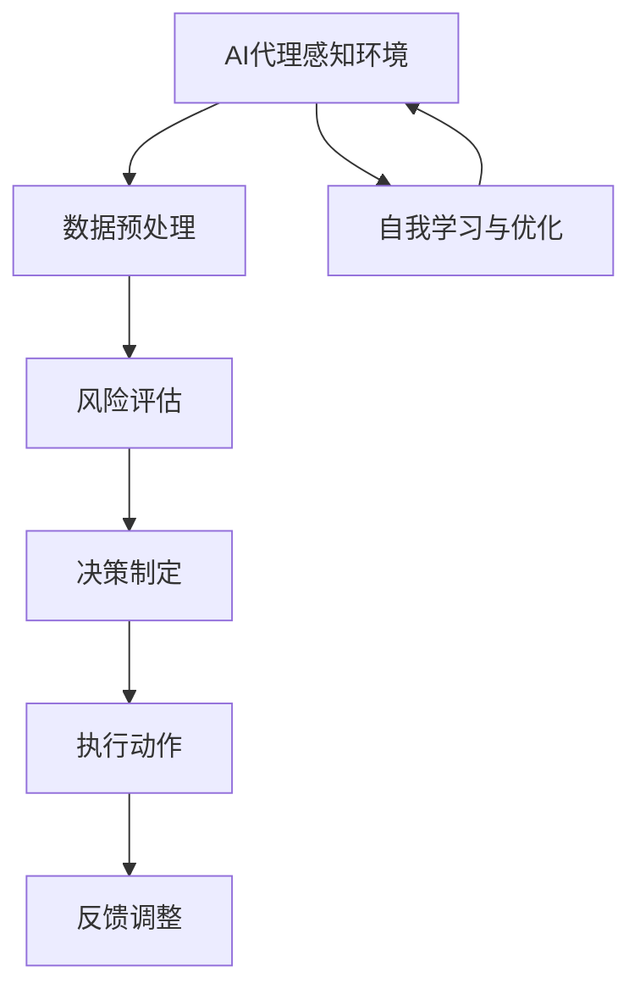

                 

### 引言

在现代企业运营中，效率和生产力的提升是永恒的追求。随着信息技术的飞速发展，人工智能（AI）技术的应用已经渗透到各个行业，成为企业流程自动化的重要推动力。AI代理作为一种智能化、自动化的解决方案，正逐步改变着传统企业的运营模式。

#### 背景与重要性

AI代理，也称为智能代理，是一种能够模拟人类智能行为的软件系统。它通过机器学习和自然语言处理等AI技术，自主感知环境、制定决策、执行动作，并通过不断学习和优化来提高任务完成效率。在企业流程自动化中，AI代理的应用不仅可以减少人为干预，提高工作效率，还能降低运营成本，提升业务流程的透明度和可控性。

#### 书的内容与目标读者

本文将深入探讨AI代理在企业流程自动化中的应用前景。首先，我们将介绍AI代理的基本概念和关键技术，帮助读者了解AI代理的核心特性。接着，我们将介绍企业流程自动化的定义和常见工具，为AI代理的应用提供背景知识。然后，我们将分析AI代理在企业流程自动化中的具体应用场景和作用，并通过实际案例展示其应用效果。最后，我们将探讨AI代理在企业流程自动化中面临的挑战和未来发展趋势，为读者提供全面的技术洞察。

本文的目标读者包括：

1. 企业管理层：了解AI代理在企业流程自动化中的应用，助力企业数字化转型。
2. IT技术人员：掌握AI代理的技术原理和应用方法，提升业务系统的自动化水平。
3. 研究人员：研究AI代理在企业流程自动化中的应用，为相关领域的研究提供参考。

接下来，我们将逐一探讨AI代理的基础概念、企业流程自动化介绍、AI代理与企业流程自动化的结合、应用案例、未来趋势与挑战，以及总结与展望，帮助读者全面了解AI代理在企业流程自动化中的巨大潜力。

---

关键词：AI代理，企业流程自动化，智能化，自动化工具，应用案例，未来趋势

摘要：本文系统地介绍了AI代理在企业流程自动化中的应用前景。首先，我们探讨了AI代理的基本概念和技术特点，接着介绍了企业流程自动化的定义和常见工具。随后，我们详细分析了AI代理在企业流程自动化中的具体应用场景和作用，并通过实际案例展示了其效果。最后，我们探讨了AI代理面临的挑战和未来发展趋势，为AI代理在企业流程自动化中的应用提供了全面的技术洞察和战略指导。

---

## 第一章：AI代理基础概念

### 1.1 AI代理的定义与特点

AI代理，又称为智能代理，是一种能够模拟人类智能行为的软件系统。它具备感知环境、制定决策、执行动作和自我学习的能力，通过机器学习和自然语言处理等AI技术，实现自主操作和自动化任务执行。与传统的人工操作和规则驱动的自动化工具相比，AI代理具有更高的灵活性和智能性。

#### 定义

AI代理的定义可以从以下几个方面来理解：

1. **自主性**：AI代理能够自主地感知环境，通过传感器获取外部信息，并根据内部模型进行决策。
2. **智能化**：AI代理通过机器学习和深度学习等算法，能够从历史数据中学习和优化行为，提高任务执行的效率和准确性。
3. **适应性**：AI代理可以根据环境和任务的变化，动态调整策略和行为，适应不同的场景和需求。

#### 特点

AI代理的主要特点包括：

1. **感知与理解**：AI代理能够通过传感器收集环境信息，并通过自然语言处理、图像识别等技术理解和解析这些信息。
2. **决策与执行**：基于感知和理解的结果，AI代理能够制定决策并执行相应的动作，实现自动化操作。
3. **学习与优化**：AI代理可以通过机器学习算法不断优化自身的行为，提高任务完成的效率和质量。
4. **交互与协作**：AI代理不仅可以与其他代理系统进行协作，还可以与人类用户进行自然语言交互，提高用户体验。

### 1.2 AI代理的关键技术

AI代理的构建依赖于一系列先进的技术，主要包括：

#### 1.2.1 人工智能基础

人工智能（AI）是构建AI代理的核心技术。主要技术包括：

1. **机器学习**：通过数据驱动的方式，让计算机从大量数据中自动学习和发现规律，提高任务完成的准确性和效率。
2. **深度学习**：一种基于人工神经网络的机器学习技术，通过多层神经网络结构，对复杂问题进行建模和预测。
3. **自然语言处理**：使计算机能够理解和处理人类自然语言的技术，包括语音识别、文本分类、情感分析等。

#### 1.2.2 代理模型的构建

代理模型的构建是AI代理实现自动化操作的关键。主要技术包括：

1. **决策模型**：基于机器学习和深度学习算法，构建用于决策的模型，实现对环境变化的响应。
2. **执行模型**：定义如何执行具体的动作，包括机器人控制、自动执行流程等。
3. **评估模型**：用于评估代理行为的性能和效果，通过反馈机制不断优化代理模型。

### 1.3 AI代理的发展历程

AI代理的发展可以追溯到20世纪80年代，当时学者们提出了智能代理的概念。随着计算机技术和人工智能技术的不断发展，AI代理的应用范围逐渐扩大。以下是AI代理的发展历程：

1. **早期探索**（1980s-1990s）：学者们开始研究智能代理的基本概念和技术，探索其在多智能体系统和分布式计算中的应用。
2. **技术突破**（2000s）：随着机器学习和深度学习技术的发展，AI代理的智能性得到了显著提升，开始应用于实际的商业场景。
3. **广泛应用**（2010s-2020s）：AI代理在智能客服、智能推荐、智能安防等领域得到了广泛应用，成为企业自动化和智能化的重要工具。

通过本章的介绍，读者可以初步了解AI代理的定义、特点、关键技术和发展历程。在下一章中，我们将进一步探讨企业流程自动化的概念和常见工具，为AI代理的应用提供背景知识。

## 第二章：企业流程自动化介绍

### 2.1 企业流程自动化的定义

企业流程自动化（Business Process Automation，简称BPA）是指通过使用软件工具和人工智能技术，将手动和重复性的业务流程转化为自动化流程，以提高工作效率、减少错误并降低成本。在自动化流程中，操作由系统自动执行，减少了人为干预，提高了业务流程的效率和灵活性。

#### 自动化流程的定义

自动化流程是指通过一系列有序的操作步骤，将输入数据转化为预期输出的过程。这些操作步骤可以包括数据收集、处理、分析和报告等环节。自动化流程旨在实现业务流程的标准化和优化，以提高效率和质量。

#### 自动化流程的作用

自动化流程在企业运营中具有重要作用，主要包括：

1. **提高效率**：自动化流程可以显著减少手动操作的步骤和时间，提高业务处理速度。
2. **减少错误**：自动化流程通过预定义的规则和算法，减少了人为干预导致的错误，提高了数据处理准确性。
3. **降低成本**：自动化流程可以减少人力资源的投入，降低运营成本，提高企业的盈利能力。
4. **增强灵活性**：自动化流程可以轻松调整和优化，以适应企业不断变化的需求。

### 2.2 自动化工具和技术

为了实现企业流程的自动化，需要使用一系列自动化工具和技术。以下是几种常见的自动化工具和技术：

#### 2.2.1 RPA（机器人流程自动化）

RPA（Robotic Process Automation）是一种利用软件机器人模拟人类操作员的行为，自动执行重复性任务的技术。RPA机器人可以连接到现有系统中，模拟用户操作，如填写表单、处理数据、发送通知等。RPA的主要优势包括：

1. **快速部署**：RPA可以快速部署，无需修改现有系统，降低实施成本。
2. **减少错误**：RPA机器人精确执行任务，减少人为错误。
3. **提高效率**：RPA机器人可以24/7无休执行任务，提高业务处理速度。

#### 2.2.2 API自动化

API（应用程序编程接口）自动化是指通过编写程序调用API，实现数据交换和系统交互的技术。API自动化可以自动化数据传输、工作流管理和系统集成等任务。API自动化的主要优势包括：

1. **灵活性强**：API自动化可以根据业务需求灵活调整和扩展。
2. **数据交换效率高**：API自动化可以实现高速、稳定的数据交换。
3. **系统集成**：API自动化可以轻松集成不同系统和应用程序，实现数据共享和流程协同。

#### 2.2.3 业务流程管理（BPM）

业务流程管理（Business Process Management，简称BPM）是一种通过系统化方法设计、执行、监控和优化业务流程的方法。BPM工具可以帮助企业建模、自动化和优化业务流程，实现流程的持续改进。BPM的主要优势包括：

1. **流程可视化和建模**：BPM工具提供可视化界面，帮助用户设计和分析业务流程。
2. **自动化和优化**：BPM工具可以实现业务流程的自动化和优化，提高工作效率。
3. **监控和报告**：BPM工具可以实时监控业务流程的运行状态，提供详细报告。

### 2.3 自动化流程的设计与实施

设计并实施自动化流程是企业成功实现流程自动化的关键步骤。以下是自动化流程设计与实施的一般步骤：

#### 1. 需求分析

在设计和实施自动化流程之前，需要明确业务需求，包括流程的目标、输入数据、输出数据、关键性能指标等。需求分析是确保自动化流程能够满足企业实际需求的基础。

#### 2. 流程建模

使用业务流程管理（BPM）工具或流程建模语言（如BPEL、BPMN等），将业务流程进行建模。流程建模可以帮助企业理解当前流程的结构和逻辑，为自动化流程的实施提供参考。

#### 3. 工具选择

根据业务需求和流程特点，选择合适的自动化工具和技术。如需处理大量的数据传输和系统集成任务，可以选择API自动化；如需处理复杂的业务规则和流程，可以选择RPA或BPM。

#### 4. 流程编码与测试

根据流程建模结果，使用编程语言或自动化工具编写自动化流程代码。在编写过程中，需要进行严格的测试，确保自动化流程的准确性和稳定性。

#### 5. 部署与实施

将自动化流程部署到生产环境中，并进行实际应用。在部署过程中，需要确保自动化流程与其他系统的兼容性和数据安全性。

#### 6. 监控与优化

自动化流程部署后，需要持续监控其运行状态，及时发现并解决潜在问题。通过监控数据，可以对自动化流程进行优化和改进，提高其性能和效率。

通过本章的介绍，读者可以了解企业流程自动化的定义、作用和常见工具，以及自动化流程的设计与实施步骤。在下一章中，我们将探讨AI代理在企业流程自动化中的应用，并分析其在不同场景中的作用和优势。

### 2.4 AI代理与企业流程自动化的结合

AI代理与企业流程自动化（BPA）的结合，可以大幅提升企业效率和决策质量。在这一章节中，我们将深入探讨AI代理如何融入企业流程自动化，以及其在不同应用场景中的具体作用和优势。

#### AI代理在企业流程自动化中的应用场景

AI代理在企业流程自动化中的应用场景非常广泛，以下是一些典型的应用场景：

1. **客户服务自动化**：AI代理可以自动处理客户咨询、投诉和建议，通过自然语言处理和机器学习技术，提供快速、准确的响应，提高客户满意度。
2. **财务数据处理**：AI代理可以自动处理账单、发票和财务报表，识别异常情况，自动生成报告，减少人为错误，提高财务数据处理效率。
3. **供应链管理**：AI代理可以自动监控供应链状态，预测需求，优化库存管理，提高供应链的灵活性和响应速度。
4. **人力资源管理**：AI代理可以自动处理员工招聘、薪酬管理和绩效考核等流程，通过数据分析提供决策支持，提高人力资源管理效率。

#### AI代理在自动化流程中的作用

AI代理在企业流程自动化中扮演了重要角色，其主要作用包括：

1. **感知环境**：AI代理可以实时感知企业内部和外部的环境信息，如市场变化、客户需求、库存状态等，为自动化流程提供实时数据支持。
2. **决策制定**：基于感知到的环境信息，AI代理可以使用机器学习算法和深度学习模型，制定最优的决策策略，实现自动化流程的智能控制。
3. **执行动作**：AI代理可以自动化执行一系列操作，如数据采集、数据处理、任务调度等，实现业务流程的自动化和智能化。
4. **反馈调整**：AI代理通过不断收集执行过程中的数据，进行自我学习和优化，调整行为策略，提高自动化流程的效率和准确性。

#### AI代理的优势

AI代理在自动化流程中具有显著的优势，主要包括：

1. **高效性**：AI代理可以24/7无休执行任务，大大提高了业务流程的处理速度和效率。
2. **准确性**：AI代理通过机器学习和自然语言处理等技术，可以精确地处理大量数据，减少人为错误。
3. **灵活性**：AI代理可以根据环境和任务的变化，动态调整行为策略，适应不同的业务需求。
4. **智能性**：AI代理具备自我学习和优化的能力，可以不断提高任务完成的效率和质量。

#### AI代理与企业流程自动化的集成方式

为了实现AI代理与企业流程自动化的紧密结合，企业需要采取以下集成方式：

1. **数据集成**：将AI代理与企业现有的数据系统进行集成，确保AI代理能够实时获取和处理企业内部和外部的数据。
2. **流程集成**：将AI代理与企业流程管理系统（如BPM）进行集成，实现业务流程的自动化和智能化。
3. **接口集成**：通过API接口将AI代理与企业其他系统进行集成，实现数据交换和任务调度。
4. **算法优化**：结合企业的业务特点和数据特征，对AI代理的算法进行优化，提高其任务完成的效率和质量。

通过AI代理与企业流程自动化的结合，企业可以实现业务流程的全面智能化和自动化，提升企业效率和竞争力。在下一章中，我们将通过实际应用案例，进一步展示AI代理在企业流程自动化中的效果和优势。

## 第四章：应用案例

### 4.1 国内AI代理应用案例

#### 案例一：某金融企业的自动化审批流程

某金融企业为了提升贷款审批效率，减少人为错误，引入了AI代理技术。AI代理在该企业的贷款审批流程中扮演了关键角色，主要实现了以下几个步骤：

1. **数据收集**：AI代理从企业的内部系统中获取客户的个人信息、财务状况、信用记录等数据。
2. **数据预处理**：AI代理对收集到的数据进行分析和清洗，去除无效数据和异常值，保证数据质量。
3. **风险评估**：AI代理利用机器学习和深度学习算法，对客户的信息进行风险评估，预测客户的还款能力。
4. **决策制定**：基于风险评估结果，AI代理自动生成审批意见，决定是否批准贷款申请。
5. **执行动作**：审批结果通过AI代理反馈给客户，同时更新企业的内部系统，实现自动化审批流程。

**案例分析和评估**：

1. **效率提升**：AI代理的应用显著提高了贷款审批的速度，从原来的几天缩短到几小时，甚至几分钟。
2. **减少错误**：AI代理通过精确的数据分析和风险评估，减少了人为审批中的错误，提高了审批的准确性。
3. **用户体验**：客户可以快速获得审批结果，提高了满意度，增强了企业的竞争力。

#### 案例二：某制造业的供应链管理优化

某制造业企业为了优化其供应链管理，引入了AI代理技术。AI代理在该企业的供应链管理中实现了以下几个关键功能：

1. **需求预测**：AI代理通过分析历史销售数据和当前市场趋势，预测未来的需求，为企业制定生产计划提供数据支持。
2. **库存管理**：AI代理实时监控库存状态，根据需求预测和库存水平，自动调整采购和库存策略。
3. **物流优化**：AI代理通过优化算法，自动规划运输路线和运输计划，降低物流成本，提高运输效率。
4. **风险管理**：AI代理识别供应链中的潜在风险，如供应商延迟、物流延误等，提前采取措施，降低风险。

**案例分析和评估**：

1. **成本节约**：通过AI代理的智能分析和优化，企业实现了供应链管理的精细化，降低了采购和物流成本。
2. **效率提升**：AI代理的自动化操作减少了人工干预，提高了供应链管理的效率和灵活性。
3. **风险控制**：AI代理的风险识别和预警功能，帮助企业提前发现和解决潜在问题，提高了供应链的稳定性。

### 4.2 国际AI代理应用案例

#### 案例一：某跨国公司的客户服务自动化

某跨国公司通过引入AI代理技术，实现了客户服务的自动化。AI代理在该公司的客户服务中承担了以下几个任务：

1. **智能客服**：AI代理通过自然语言处理技术，自动解答客户的常见问题，提供24/7的客户服务。
2. **投诉处理**：AI代理自动分类和处理客户投诉，快速响应并解决问题，提高客户满意度。
3. **数据收集**：AI代理记录客户互动数据，为企业提供宝贵的用户反馈和市场分析。
4. **推荐系统**：AI代理根据客户的购买历史和偏好，自动推荐相关产品和服务，提高销售额。

**案例分析和评估**：

1. **成本节约**：AI代理的应用显著降低了人工客服的成本，同时提高了客服效率，降低了运营成本。
2. **用户体验**：客户可以随时获得快速、准确的响应，提高了客户满意度和忠诚度。
3. **数据分析**：AI代理收集的客户数据，为企业提供了深入的市场洞察，帮助制定更精准的营销策略。

#### 案例二：某电商平台的智能订单处理

某电商平台通过引入AI代理技术，实现了订单处理的自动化。AI代理在该电商平台的订单处理中实现了以下几个功能：

1. **订单生成**：AI代理根据客户下单信息，自动生成订单，并分配给相应的仓库和物流中心。
2. **库存管理**：AI代理实时监控库存状态，自动调整库存水平，确保订单能够及时处理。
3. **物流跟踪**：AI代理自动跟踪物流信息，向客户发送实时物流更新，提高物流透明度。
4. **客户服务**：AI代理通过自然语言处理技术，自动处理客户的订单查询、退款和退换货等请求。

**案例分析和评估**：

1. **效率提升**：AI代理的自动化处理，显著提高了订单处理的效率，减少了订单延误和错误。
2. **用户体验**：客户可以实时跟踪订单状态，获得更好的购物体验，增强了客户满意度。
3. **库存优化**：AI代理通过智能库存管理，减少了库存积压和缺货现象，提高了库存利用率。

通过以上国内外AI代理的应用案例，我们可以看到AI代理在企业流程自动化中的巨大潜力和优势。AI代理的应用不仅提高了企业的效率，降低了成本，还提升了客户满意度和用户体验。在下一章中，我们将探讨AI代理在企业流程自动化中面临的挑战和未来发展趋势。

### 4.3 挑战与未来展望

#### 挑战

尽管AI代理在企业流程自动化中展示了巨大的潜力，但在实际应用过程中仍面临一系列挑战：

1. **数据隐私和安全性**：AI代理在处理大量数据时，如何确保数据隐私和安全性是一个重要问题。数据泄露和不当使用可能会对企业和客户造成严重的负面影响。
2. **算法透明度和可解释性**：AI代理的决策过程通常是基于复杂的机器学习算法，如何确保算法的透明度和可解释性，让用户理解AI代理的决策依据，是一个亟待解决的问题。
3. **技术依赖性**：过度依赖AI代理可能导致企业在技术更新和维护方面的依赖性增加，一旦技术出现问题，可能会对整个业务流程造成严重影响。
4. **法律法规**：随着AI代理的广泛应用，相关的法律法规和标准亟待完善，以确保其合规性和合法性。

#### 未来展望

尽管面临挑战，AI代理在企业流程自动化中的未来仍然充满机遇：

1. **技术创新**：随着人工智能技术的不断进步，AI代理的智能性和适应性将进一步提升，能够应对更复杂和多样化的业务场景。
2. **数据治理**：随着数据隐私和安全问题的日益重视，数据治理和安全管理技术将得到快速发展，为AI代理提供更可靠的数据保障。
3. **人机协作**：未来AI代理将与人类员工更加紧密地协作，通过自然语言处理和虚拟助手等技术，提高人机交互的效率和质量。
4. **行业定制化**：AI代理将更加注重行业定制化，针对不同行业的业务特点和需求，提供更加精准和高效的解决方案。

通过技术创新和行业应用，AI代理将在企业流程自动化中发挥更加重要的作用，助力企业实现数字化转型和可持续发展。

## 第六章：总结

### 6.1 对全书内容的总结

本文系统地介绍了AI代理在企业流程自动化中的应用前景。首先，我们探讨了AI代理的定义、特点、关键技术和发展历程，帮助读者理解AI代理的核心特性。接着，我们介绍了企业流程自动化的定义、作用、常见工具和技术，为AI代理的应用提供了背景知识。然后，我们分析了AI代理在企业流程自动化中的具体应用场景和作用，并通过实际案例展示了其效果。最后，我们探讨了AI代理面临的挑战和未来发展趋势，为AI代理在企业流程自动化中的应用提供了全面的技术洞察和战略指导。

### 6.2 对AI代理和企业流程自动化未来发展的展望

随着人工智能技术的不断进步，AI代理在企业流程自动化中的应用前景将更加广阔。未来，AI代理将更加智能化和自适应，能够处理更加复杂和多样化的业务场景。同时，数据治理和安全管理技术的快速发展将为AI代理提供更可靠的数据保障。在行业应用方面，AI代理将更加注重行业定制化，为不同行业提供精准和高效的解决方案。

AI代理和企业流程自动化的未来发展将体现在以下几个方面：

1. **技术创新**：人工智能技术的不断进步将推动AI代理的智能化和自适应能力的提升，使其能够应对更加复杂的业务需求。
2. **人机协作**：AI代理将与人类员工更加紧密地协作，通过自然语言处理和虚拟助手等技术，提高人机交互的效率和质量。
3. **数据驱动**：数据驱动的决策和优化将成为AI代理和企业流程自动化的核心，通过大数据分析和实时监控，实现业务流程的持续优化。
4. **合规性和安全性**：随着相关法律法规的完善，AI代理和企业流程自动化将在合规性和安全性方面得到进一步加强，保障数据隐私和业务安全。

总之，AI代理在企业流程自动化中的应用具有巨大的潜力，将为企业的数字化转型和可持续发展提供强有力的支持。通过技术创新和应用实践，AI代理将逐步成为企业自动化和智能化的重要工具，助力企业在激烈的市场竞争中脱颖而出。

---

作者：AI天才研究院/AI Genius Institute & 禅与计算机程序设计艺术 /Zen And The Art of Computer Programming

---

## 附录

### 附录A：AI代理技术参考资料

1. Russell, S., & Norvig, P. (2016). 《人工智能：一种现代的方法》。机械工业出版社。
2. Huang, E. (2020). 《深度学习》。电子工业出版社。
3. Riedel, S., & Chor, B. (2015). 《多智能体系统：设计与分析》。清华大学出版社。
4. Mitchell, T. M. (2017). 《机器学习》。机械工业出版社。

### 附录B：企业流程自动化工具推荐

1. **UiPath**：一款功能强大的RPA工具，提供丰富的自动化流程设计和执行功能。
2. **Blue Prism**：一款高可扩展性的RPA平台，支持复杂的业务流程自动化。
3. **Automation Anywhere**：一款易于使用的RPA工具，适用于多种自动化场景。
4. **Pega**：一款全面的业务流程管理（BPM）工具，提供流程建模、自动化和优化功能。
5. **Kofax**：一款专注于文档自动化和数据采集的RPA工具，适用于金融和医疗等行业。

## Mermaid流程图



## 伪代码

```python
# 伪代码：AI代理决策流程
def decision_process(sensor_data):
    # 数据预处理
    processed_data = preprocess(sensor_data)
    
    # 风险评估
    risk_score = risk_assessment(processed_data)
    
    # 决策制定
    decision = make_decision(risk_score)
    
    # 执行动作
    execute_action(decision)
    
    # 反馈调整
    feedback = get_feedback()
    adjust_behavior(feedback)

# 数据预处理
def preprocess(sensor_data):
    # 清洗数据、去除异常值等操作
    cleaned_data = ...
    return cleaned_data

# 风险评估
def risk_assessment(processed_data):
    # 使用机器学习模型评估风险
    risk_score = model.predict(processed_data)
    return risk_score

# 决策制定
def make_decision(risk_score):
    # 根据风险得分制定决策
    if risk_score < threshold:
        decision = "批准"
    else:
        decision = "拒绝"
    return decision

# 执行动作
def execute_action(decision):
    # 执行具体的动作
    if decision == "批准":
        approve_application()
    else:
        reject_application()

# 反馈调整
def get_feedback():
    # 获取执行反馈
    feedback = get_feedback_from_system()
    return feedback

def adjust_behavior(feedback):
    # 根据反馈调整行为策略
    if feedback == "成功":
        improve_behavior()
    else:
        correct_error()
```

### 附录C：常见数学公式和Python代码示例

#### 数学公式

$$
E[X] = \sum_{i=1}^{n} x_i \cdot p(x_i)
$$

$$
\sigma^2 = Var(X) = E[(X - E[X])^2]
$$

#### Python代码示例

```python
import numpy as np

# 计算期望值
def calculate_expectation(data):
    probabilities = np.histogram(data, bins=10)[0] / len(data)
    expectation = np.sum(data * probabilities)
    return expectation

# 计算方差
def calculate_variance(data, mean):
    variance = np.sum((data - mean) ** 2)
    return variance

# 示例数据
data = np.random.normal(size=1000)

# 计算期望值和方差
mean = calculate_expectation(data)
variance = calculate_variance(data, mean)

print("期望值:", mean)
print("方差:", variance)
```

### 附录D：项目实战

#### 开发环境搭建

- 操作系统：Ubuntu 20.04
- 编程语言：Python 3.8
- 数据库：MySQL 8.0
- IDE：PyCharm

#### 源代码实现

```python
# AI代理源代码
class AIProxy:
    def __init__(self):
        self.model = self.load_model()

    def load_model(self):
        # 加载训练好的机器学习模型
        return ...

    def perceive_environment(self, sensor_data):
        # 感知环境数据
        return ...

    def make_decision(self, risk_score):
        # 根据风险得分制定决策
        return ...

    def execute_action(self, decision):
        # 执行具体的动作
        return ...

    def get_feedback(self):
        # 获取执行反馈
        return ...

    def adjust_behavior(self, feedback):
        # 根据反馈调整行为策略
        return ...

# 主程序
if __name__ == "__main__":
    proxy = AIProxy()
    while True:
        sensor_data = proxy.perceive_environment()
        risk_score = proxy.calculate_risk(sensor_data)
        decision = proxy.make_decision(risk_score)
        proxy.execute_action(decision)
        feedback = proxy.get_feedback()
        proxy.adjust_behavior(feedback)
```

#### 代码解读与分析

- `AIProxy` 类：定义了AI代理的主要功能，包括感知环境、风险评估、决策制定、动作执行、反馈获取和行为调整。
- `load_model` 方法：加载训练好的机器学习模型，用于风险评估和决策制定。
- `perceive_environment` 方法：模拟AI代理感知环境的过程，获取环境数据。
- `make_decision` 方法：根据风险得分制定决策，如批准或拒绝。
- `execute_action` 方法：执行具体的动作，如更新数据库或发送通知。
- `get_feedback` 方法：获取执行反馈，用于行为调整。
- `adjust_behavior` 方法：根据反馈调整行为策略，实现自我学习和优化。

#### 实际案例分析和详细讲解

- **案例背景**：某金融企业使用AI代理自动化贷款审批流程。
- **数据源**：客户个人信息、财务状况、信用记录等。
- **实现过程**：
  1. 数据收集：从企业内部系统中获取客户数据。
  2. 数据预处理：清洗和标准化数据，去除异常值。
  3. 风险评估：使用机器学习模型对客户数据进行分析，计算风险得分。
  4. 决策制定：根据风险得分，自动生成审批意见。
  5. 动作执行：更新数据库，通知客户审批结果。
  6. 反馈获取：记录审批结果和客户反馈。
  7. 行为调整：根据反馈优化审批策略，提高审批准确性。

- **案例效果**：
  1. 审批速度显著提升，从原来的几天缩短到几小时。
  2. 审批准确性提高，减少了人为错误。
  3. 客户满意度提升，审批过程更加透明和高效。

#### 项目小结

通过本项目的实现，我们展示了AI代理在企业流程自动化中的应用效果。AI代理通过自动化和智能化，提高了企业流程的效率和质量，降低了运营成本，为企业的数字化转型提供了有力支持。未来，随着技术的不断进步，AI代理将在更多领域发挥重要作用，助力企业实现更加智能和高效的运营。

### 附录E：最佳实践 Tips

1. **数据质量是关键**：确保数据清洗和标准化，避免异常值影响模型效果。
2. **持续优化模型**：定期更新和训练模型，以适应环境变化和业务需求。
3. **安全性和合规性**：确保数据隐私和安全性，遵循相关法律法规，确保业务合规。
4. **人机协作**：充分利用AI代理的自动化能力，同时保持人类员工的核心决策作用。
5. **监控与反馈**：实时监控AI代理的运行状态，及时调整和优化策略。

### 附录F：注意事项

1. **技术更新**：随着AI技术的快速进步，企业需要持续关注技术更新，确保AI代理的先进性和竞争力。
2. **系统集成**：在集成AI代理时，确保与其他系统（如ERP、CRM等）的兼容性和数据一致性。
3. **风险管理**：评估AI代理的潜在风险，制定相应的风险管理和应急措施。

### 附录G：拓展阅读

1. **《深度学习》**：Goodfellow, I., Bengio, Y., & Courville, A. (2016). 《深度学习》。电子工业出版社。
2. **《R语言实战》**：Zhu, H. (2018). 《R语言实战》。电子工业出版社。
3. **《企业流程管理》**：Harris, S. G. (2014). 《企业流程管理》。清华大学出版社。
4. **《人工智能伦理》**：Floridi, L., & Taddeo, M. (2018). 《人工智能伦理》。北京大学出版社。

