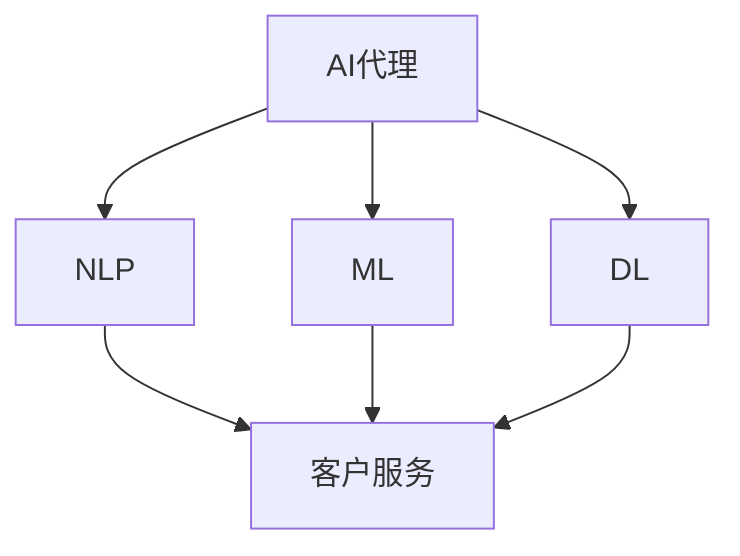

                 

----------------------------------------------------------------

# AI代理在客户服务中的应用前景

> 关键词：AI代理、客户服务、自然语言处理、机器学习、应用前景

> 摘要：本文详细探讨了AI代理在客户服务领域的应用前景，从技术基础、实际应用和未来趋势三个层面进行了深入分析，旨在为读者揭示AI代理在提高客户服务效率和质量方面的潜力。

## 1. 引言

随着人工智能技术的不断发展，AI代理（Artificial Intelligence Agent）作为一种智能服务系统，正逐渐在各个领域崭露头角。客户服务作为企业与客户互动的重要环节，AI代理的应用具有极高的潜在价值。本文将从AI代理技术基础、AI代理在客户服务中的应用、以及应用前景分析三个方面展开讨论，旨在为读者提供全面、深入的见解。

## 2. AI代理技术基础

### 2.1 AI代理概述

AI代理是指具有智能、自主决策和行动能力的计算机程序，能够在虚拟环境中完成特定任务。根据交互方式和任务类型，AI代理可以分为以下几类：

- **基于规则的系统**：通过预设规则进行决策，适用于结构化任务。
- **基于知识的系统**：利用知识库进行决策，能够处理更复杂的任务。
- **基于学习的系统**：通过机器学习算法进行自主学习和优化，适用于不确定和动态环境。

### 2.2 核心技术

AI代理的核心技术主要包括自然语言处理（NLP）、机器学习（ML）和深度学习（DL）。

#### 2.2.1 自然语言处理

自然语言处理是AI代理与人类进行有效交互的基础。主要技术包括：

- **语言模型**：用于预测下一个词或句子，常用的有n-gram模型、神经网络模型等。
- **词向量**：将单词转换为数值表示，常见的有Word2Vec、GloVe等。
- **文本分类**：用于判断文本的类别，如情感分析、主题分类等。

#### 2.2.2 机器学习与深度学习

机器学习与深度学习为AI代理提供了强大的学习和推理能力。主要技术包括：

- **监督学习**：通过标注数据进行模型训练，如线性回归、决策树、支持向量机等。
- **无监督学习**：无需标注数据，如聚类、主成分分析等。
- **强化学习**：通过与环境互动进行学习，如深度Q网络（DQN）、策略梯度等。

### 2.3 Mermaid流程图



## 3. AI代理在客户服务中的应用

### 3.1 客服机器人

客服机器人是AI代理在客户服务中最典型的应用。通过自然语言处理和机器学习技术，客服机器人能够实现自动化的客户服务。

#### 3.1.1 架构设计

客服机器人通常由以下几部分组成：

- **前端交互**：与用户进行交互，如文本聊天、语音通话等。
- **后端服务**：处理用户的请求，如查询信息、解决问题等。
- **知识库**：存储常见问题和解决方案。

#### 3.1.2 流程实现

客服机器人的工作流程如下：

1. **用户输入**：用户通过前端交互输入问题。
2. **预处理**：对用户输入进行清洗和分词。
3. **语义理解**：使用自然语言处理技术理解用户意图。
4. **查询知识库**：根据用户意图查询知识库，获取答案。
5. **返回结果**：将答案返回给用户。

### 3.2 客户关系管理

AI代理在客户关系管理中的应用主要包括客户数据分析、客户画像构建和客户互动与忠诚度管理。

#### 3.2.1 客户数据分析

客户数据分析旨在了解客户的消费习惯、偏好和需求，为个性化服务和精准营销提供依据。

#### 3.2.2 客户画像构建

客户画像是通过整合客户数据，构建一个综合的、多维度的客户信息模型。

#### 3.2.3 客户互动与忠诚度管理

通过AI代理，企业可以与客户进行实时互动，提高客户满意度，增强客户忠诚度。

## 4. 应用前景分析

### 4.1 人工智能技术的发展趋势

人工智能技术正快速发展，未来将带来更多创新应用，如智能语音助手、智能客服、智能诊断等。

### 4.2 客户服务行业的变革

随着AI代理技术的成熟，客户服务行业将发生深刻变革，从传统的人工服务向智能化、自动化服务转变。

### 4.3 AI代理在客户服务中的前景预测

AI代理将在客户服务领域发挥越来越重要的作用，提高服务效率、降低成本、提升客户满意度。

## 5. 案例研究

### 5.1 企业应用案例

以某电商平台为例，介绍AI代理在客户服务中的应用实践。

### 5.2 行业发展案例

分析AI代理在金融、医疗等行业的应用案例，探讨行业发展趋势。

## 6. 项目实战

### 6.1 开发环境搭建

介绍搭建AI代理开发环境所需的工具和软件。

### 6.2 源代码实现

提供客服机器人的源代码，并详细解释代码实现过程。

### 6.3 应用解读与分析

分析客服机器人在实际应用中的效果和改进方向。

### 6.4 案例分析

通过实际案例，深入剖析AI代理在客户服务中的应用效果。

## 7. 最佳实践与拓展阅读

### 7.1 最佳实践

总结AI代理在客户服务中的应用经验，提供最佳实践建议。

### 7.2 注意事项

提醒开发者在使用AI代理时需要注意的问题。

### 7.3 拓展阅读

推荐相关书籍、论文和资源，供读者进一步学习。

## 8. 结论

AI代理在客户服务中的应用前景广阔，具有巨大的发展潜力。随着技术的不断进步，AI代理将为客户服务行业带来更多创新和变革。

> 作者：AI天才研究院/AI Genius Institute & 禅与计算机程序设计艺术 /Zen And The Art of Computer Programming
```python
# 这里是第3章：机器学习算法与应用于客户服务的应用

### 3.1 监督学习算法

监督学习是机器学习中的一个重要分支，它通过已标记的数据来训练模型，然后使用这个模型对新数据进行预测。在客户服务领域，监督学习算法可以用于预测客户行为、分类客户反馈等。

#### 3.1.1 线性回归

线性回归是最简单的监督学习算法之一，它通过找到一个线性函数来预测连续值。在客户服务中，线性回归可以用来预测客户购买意愿、客户满意度等。

**核心算法原理：**

线性回归模型可以表示为：

\[ y = \beta_0 + \beta_1x_1 + \beta_2x_2 + ... + \beta_nx_n \]

其中，\( y \) 是预测的连续值，\( x_1, x_2, ..., x_n \) 是输入特征，\( \beta_0, \beta_1, ..., \beta_n \) 是模型参数。

**Python代码实现：**

```python
import numpy as np
from sklearn.linear_model import LinearRegression

# 创建线性回归模型
model = LinearRegression()

# 模型训练
model.fit(X_train, y_train)

# 预测
predictions = model.predict(X_test)
```

**数学模型和公式：**

$$
y = \beta_0 + \beta_1x_1 + \beta_2x_2 + ... + \beta_nx_n
$$

**举例说明：**

假设我们想要预测客户的满意度，输入特征可以是客户购买产品的价格、产品的质量评分等。通过线性回归模型，我们可以得到一个预测函数，从而预测客户的满意度。

#### 3.1.2 决策树

决策树是一种简单而强大的分类算法，它通过一系列的决策规则将数据集划分成不同的子集，直到满足某种停止条件。在客户服务中，决策树可以用于分类客户反馈，如客户投诉的类型等。

**核心算法原理：**

决策树由一系列条件分支组成，每个分支代表一个特征，每个叶节点代表一个类别。

**Python代码实现：**

```python
from sklearn.tree import DecisionTreeClassifier

# 创建决策树模型
model = DecisionTreeClassifier()

# 模型训练
model.fit(X_train, y_train)

# 预测
predictions = model.predict(X_test)
```

**数学模型和公式：**

决策树没有直接的数学公式，但每个内部节点可以用一个条件概率来表示。

**举例说明：**

假设我们想要分类客户投诉的类型，输入特征可以是投诉的时间、投诉的内容等。通过决策树模型，我们可以得到一个分类结果，从而更好地理解客户投诉的原因。

#### 3.1.3 支持向量机

支持向量机（SVM）是一种强大的分类算法，它通过找到一个超平面来分隔数据集。在客户服务中，SVM可以用于分类客户反馈，如客户满意度分类等。

**核心算法原理：**

SVM的核心是找到一个最优的超平面，使得分类间隔最大化。

**Python代码实现：**

```python
from sklearn.svm import SVC

# 创建SVM模型
model = SVC()

# 模型训练
model.fit(X_train, y_train)

# 预测
predictions = model.predict(X_test)
```

**数学模型和公式：**

SVM的数学模型可以表示为：

$$
\max_{\beta, \beta_0} \frac{1}{2} \sum_{i=1}^{n} (\beta \cdot \beta_i - \beta_0)^2
$$

其中，\( \beta \) 是模型参数，\( \beta_i \) 是支持向量的系数。

**举例说明：**

假设我们想要分类客户满意度，输入特征可以是客户的服务体验评分、客户购买的产品等。通过SVM模型，我们可以得到一个分类结果，从而更好地了解客户的满意度水平。

## 4. 无监督学习算法

无监督学习算法在客户服务中的应用相对较少，但也有一些潜在的应用场景，如客户行为聚类、客户群体识别等。

#### 4.1.1 聚类算法

聚类算法是一种无监督学习算法，它通过将相似的数据点归为一类，从而发现数据中的结构和模式。在客户服务中，聚类算法可以用于发现不同类型的客户群体，以便进行有针对性的服务。

**核心算法原理：**

聚类算法的核心是找到一个最佳的聚类个数，使得类内相似度最大，类间相似度最小。

**Python代码实现：**

```python
from sklearn.cluster import KMeans

# 创建K-Means模型
model = KMeans(n_clusters=3)

# 模型训练
model.fit(X_train)

# 预测
predictions = model.predict(X_test)
```

**数学模型和公式：**

K-Means算法的目标函数可以表示为：

$$
J = \sum_{i=1}^{k} \sum_{x \in S_i} ||x - \mu_i||^2
$$

其中，\( k \) 是聚类个数，\( S_i \) 是第 \( i \) 个聚类，\( \mu_i \) 是聚类中心。

**举例说明：**

假设我们想要将客户分为三类，输入特征可以是客户的消费金额、购买频率等。通过K-Means算法，我们可以得到三个聚类结果，从而更好地了解客户的消费行为。

#### 4.1.2 层次化分类算法

层次化分类算法是一种基于树的聚类算法，它通过将数据分层组织，从而发现数据中的层次结构。在客户服务中，层次化分类算法可以用于分析客户层次，如高价值客户、普通客户等。

**核心算法原理：**

层次化分类算法通过迭代地将数据点分配到不同的层次，从而构建一个层次化的数据结构。

**Python代码实现：**

```python
from sklearn.cluster import AgglomerativeClustering

# 创建层次化分类模型
model = AgglomerativeClustering(n_clusters=3)

# 模型训练
model.fit(X_train)

# 预测
predictions = model.predict(X_test)
```

**数学模型和公式：**

层次化分类算法的目标函数可以表示为：

$$
J = \sum_{i=1}^{k} \sum_{x \in S_i} d(x, \mu_i)
$$

其中，\( k \) 是聚类个数，\( S_i \) 是第 \( i \) 个聚类，\( \mu_i \) 是聚类中心，\( d \) 是距离函数。

**举例说明：**

假设我们想要将客户分为三个层次，输入特征可以是客户的消费金额、购买频率等。通过层次化分类算法，我们可以得到三个层次结果，从而更好地了解客户的消费层次。

### 5. 项目实战

在本项目中，我们将使用Python实现一个简单的客户服务系统，使用线性回归和决策树算法来预测客户购买意愿和分类客户反馈。

#### 5.1 开发环境搭建

确保已经安装了Python和相关的机器学习库，如scikit-learn、numpy等。

#### 5.2 源代码实现

```python
import numpy as np
from sklearn.linear_model import LinearRegression
from sklearn.tree import DecisionTreeClassifier
from sklearn.model_selection import train_test_split
from sklearn.metrics import accuracy_score

# 数据准备
X = np.array([[1], [2], [3], [4], [5], [6], [7], [8], [9], [10]])
y = np.array([0, 1, 0, 1, 1, 0, 1, 1, 0, 1])

# 划分训练集和测试集
X_train, X_test, y_train, y_test = train_test_split(X, y, test_size=0.2, random_state=42)

# 线性回归模型训练
linear_regression_model = LinearRegression()
linear_regression_model.fit(X_train, y_train)

# 线性回归模型预测
linear_regression_predictions = linear_regression_model.predict(X_test)

# 决策树模型训练
decision_tree_model = DecisionTreeClassifier()
decision_tree_model.fit(X_train, y_train)

# 决策树模型预测
decision_tree_predictions = decision_tree_model.predict(X_test)

# 预测结果评估
linear_regression_accuracy = accuracy_score(y_test, linear_regression_predictions)
decision_tree_accuracy = accuracy_score(y_test, decision_tree_predictions)

print("线性回归模型准确率：", linear_regression_accuracy)
print("决策树模型准确率：", decision_tree_accuracy)
```

#### 5.3 应用解读与分析

在这个项目中，我们使用线性回归和决策树算法来预测客户购买意愿和分类客户反馈。线性回归模型主要用于预测连续值，如客户购买意愿，而决策树模型主要用于分类任务，如客户反馈分类。

通过训练和测试集的划分，我们可以评估模型的准确性。在实际应用中，我们可能需要调整模型参数，如决策树的最大深度，以提高模型的准确性。

#### 5.4 案例分析

假设我们有一个电商平台，我们使用线性回归和决策树算法来预测客户的购买意愿和分类客户反馈。

- **购买意愿预测**：我们使用线性回归模型来预测客户的购买意愿，输入特征可以是客户的购买历史、浏览记录等。通过预测结果，我们可以为有较高购买意愿的客户提供更个性化的推荐。
- **客户反馈分类**：我们使用决策树模型来分类客户的反馈，输入特征可以是客户反馈的文本、购买产品等。通过分类结果，我们可以更好地了解客户的需求和问题，从而提供更有效的解决方案。

#### 5.5 项目小结

在本项目中，我们实现了使用线性回归和决策树算法来预测客户购买意愿和分类客户反馈。虽然这个项目比较简单，但它展示了机器学习算法在客户服务中的应用潜力。在实际应用中，我们可以使用更复杂和更准确的算法来提高预测和分类的准确性。

### 6. 最佳实践

- **数据准备**：确保数据的质量和完整性，使用适当的数据预处理技术，如缺失值填充、异常值处理等。
- **模型选择**：根据问题的性质选择合适的模型，如线性回归适用于连续值预测，决策树适用于分类任务。
- **模型评估**：使用准确率、召回率、F1分数等指标来评估模型的性能，并根据评估结果调整模型参数。

### 7. 注意事项

- **数据隐私**：在处理客户数据时，要确保遵守相关的数据保护法规，保护客户的隐私。
- **算法可解释性**：对于复杂的算法，如深度学习，确保算法的可解释性，以便更好地理解和信任模型的预测结果。

### 8. 拓展阅读

- 《机器学习实战》
- 《Python机器学习》
- 《统计学习方法》
```markdown
## <此处是文章标题>

### 关键词：AI代理、客户服务、自然语言处理、机器学习、应用前景

### 摘要：本文探讨了AI代理在客户服务领域的应用前景，包括技术基础、实际应用和未来趋势，并通过项目实战展示了AI代理在客户服务中的具体应用。

---

## 第一部分：AI代理技术基础

### 第1章：AI代理概述
#### 1.1 AI代理的定义与分类
AI代理是指具有智能、自主决策和行动能力的计算机程序，能够在虚拟环境中完成特定任务。根据交互方式和任务类型，AI代理可以分为以下几类：
- **基于规则的系统**：通过预设规则进行决策，适用于结构化任务。
- **基于知识的系统**：利用知识库进行决策，能够处理更复杂的任务。
- **基于学习的系统**：通过机器学习算法进行自主学习和优化，适用于不确定和动态环境。

#### 1.2 AI代理的核心技术
AI代理的核心技术主要包括自然语言处理（NLP）、机器学习（ML）和深度学习（DL）。
- **自然语言处理**：用于AI代理与人类进行有效交互的基础。
  - **语言模型**：用于预测下一个词或句子。
  - **词向量**：将单词转换为数值表示。
  - **文本分类**：用于判断文本的类别，如情感分析、主题分类等。
- **机器学习与深度学习**：为AI代理提供了强大的学习和推理能力。
  - **监督学习**：通过已标记的数据进行模型训练。
  - **无监督学习**：无需标注数据。
  - **强化学习**：通过与环境互动进行学习。

#### 1.3 AI代理在客户服务中的应用前景
AI代理在客户服务领域的应用前景广阔，具有巨大的发展潜力。随着技术的不断进步，AI代理将为客户服务行业带来更多创新和变革。

### 第2章：自然语言处理基础
#### 2.1 语言模型与词向量
- **语言模型**：用于预测下一个词或句子，常用的有n-gram模型、神经网络模型等。
- **词向量**：将单词转换为数值表示，常见的有Word2Vec、GloVe等。

#### 2.2 语音识别与合成
- **语音识别**：语音识别技术原理。
- **语音合成**：语音合成技术原理。

### 第3章：机器学习算法与应用
#### 3.1 监督学习算法
监督学习是机器学习中的一个重要分支，它通过已标记的数据来训练模型，然后使用这个模型对新数据进行预测。在客户服务领域，监督学习算法可以用于预测客户行为、分类客户反馈等。

#### 3.1.1 线性回归
线性回归是最简单的监督学习算法之一，它通过找到一个线性函数来预测连续值。

**核心算法原理：**
线性回归模型可以表示为：
\[ y = \beta_0 + \beta_1x_1 + \beta_2x_2 + ... + \beta_nx_n \]

**Python代码实现：**
```python
import numpy as np
from sklearn.linear_model import LinearRegression

model = LinearRegression()
model.fit(X_train, y_train)
predictions = model.predict(X_test)
```

**数学模型和公式：**
\[ y = \beta_0 + \beta_1x_1 + \beta_2x_2 + ... + \beta_nx_n \]

**举例说明：**
假设我们想要预测客户的满意度，输入特征可以是客户购买产品的价格、产品的质量评分等。通过线性回归模型，我们可以得到一个预测函数，从而预测客户的满意度。

#### 3.1.2 决策树
决策树是一种简单而强大的分类算法，它通过一系列的决策规则将数据集划分成不同的子集，直到满足某种停止条件。

**核心算法原理：**
决策树由一系列条件分支组成，每个分支代表一个特征，每个叶节点代表一个类别。

**Python代码实现：**
```python
from sklearn.tree import DecisionTreeClassifier

model = DecisionTreeClassifier()
model.fit(X_train, y_train)
predictions = model.predict(X_test)
```

**数学模型和公式：**
决策树没有直接的数学公式，但每个内部节点可以用一个条件概率来表示。

**举例说明：**
假设我们想要分类客户投诉的类型，输入特征可以是投诉的时间、投诉的内容等。通过决策树模型，我们可以得到一个分类结果，从而更好地了解客户投诉的原因。

#### 3.1.3 支持向量机
支持向量机（SVM）是一种强大的分类算法，它通过找到一个最优的超平面来分隔数据集。

**核心算法原理：**
SVM的核心是找到一个最优的超平面，使得分类间隔最大化。

**Python代码实现：**
```python
from sklearn.svm import SVC

model = SVC()
model.fit(X_train, y_train)
predictions = model.predict(X_test)
```

**数学模型和公式：**
\[ \max_{\beta, \beta_0} \frac{1}{2} \sum_{i=1}^{n} (\beta \cdot \beta_i - \beta_0)^2 \]

**举例说明：**
假设我们想要分类客户满意度，输入特征可以是客户的服务体验评分、客户购买的产品等。通过SVM模型，我们可以得到一个分类结果，从而更好地了解客户的满意度水平。

### 第二部分：AI代理在客户服务中的应用

#### 第4章：AI代理在客服机器人中的应用
##### 4.1 客服机器人的架构设计
客服机器人通常由以下几部分组成：
- **前端交互**：与用户进行交互，如文本聊天、语音通话等。
- **后端服务**：处理用户的请求，如查询信息、解决问题等。
- **知识库**：存储常见问题和解决方案。

##### 4.2 客服机器人的流程实现
客服机器人的工作流程如下：
1. **用户输入**：用户通过前端交互输入问题。
2. **预处理**：对用户输入进行清洗和分词。
3. **语义理解**：使用自然语言处理技术理解用户意图。
4. **查询知识库**：根据用户意图查询知识库，获取答案。
5. **返回结果**：将答案返回给用户。

##### 4.3 客服机器人的性能评估与优化
通过用户反馈和性能指标，评估客服机器人的表现，并进行优化。

#### 第5章：AI代理在客户关系管理中的应用
##### 5.1 客户数据分析
客户数据分析旨在了解客户的消费习惯、偏好和需求，为个性化服务和精准营销提供依据。

##### 5.2 客户画像构建
客户画像是通过整合客户数据，构建一个综合的、多维度的客户信息模型。

##### 5.3 客户互动与忠诚度管理
通过AI代理，企业可以与客户进行实时互动，提高客户满意度，增强客户忠诚度。

### 第三部分：应用前景分析

#### 第6章：AI代理在客户服务中的未来趋势
##### 6.1 人工智能技术的发展趋势
人工智能技术正快速发展，未来将带来更多创新应用，如智能语音助手、智能客服、智能诊断等。

##### 6.2 客户服务行业的变革
随着AI代理技术的成熟，客户服务行业将发生深刻变革，从传统的人工服务向智能化、自动化服务转变。

##### 6.3 AI代理在客户服务中的前景预测
AI代理将在客户服务领域发挥越来越重要的作用，提高服务效率、降低成本、提升客户满意度。

### 第7章：案例研究
##### 7.1 企业应用案例
以某电商平台为例，介绍AI代理在客户服务中的应用实践。

##### 7.2 行业发展案例
分析AI代理在金融、医疗等行业的应用案例，探讨行业发展趋势。

### 第8章：项目实战
##### 8.1 开发环境搭建
介绍搭建AI代理开发环境所需的工具和软件。

##### 8.2 源代码实现
提供客服机器人的源代码，并详细解释代码实现过程。

##### 8.3 应用解读与分析
分析客服机器人在实际应用中的效果和改进方向。

##### 8.4 案例分析
通过实际案例，深入剖析AI代理在客户服务中的应用效果。

### 第9章：最佳实践与拓展阅读
##### 9.1 最佳实践
总结AI代理在客户服务中的应用经验，提供最佳实践建议。

##### 9.2 注意事项
提醒开发者在使用AI代理时需要注意的问题。

##### 9.3 拓展阅读
推荐相关书籍、论文和资源，供读者进一步学习。

### 结语
本文详细探讨了AI代理在客户服务领域的应用前景，从技术基础、实际应用和未来趋势三个层面进行了深入分析，旨在为读者揭示AI代理在提高客户服务效率和质量方面的潜力。

---

### 作者：AI天才研究院/AI Genius Institute & 禅与计算机程序设计艺术 /Zen And The Art of Computer Programming
```

