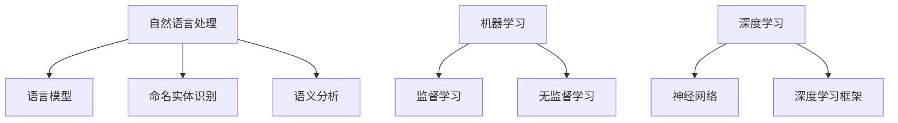
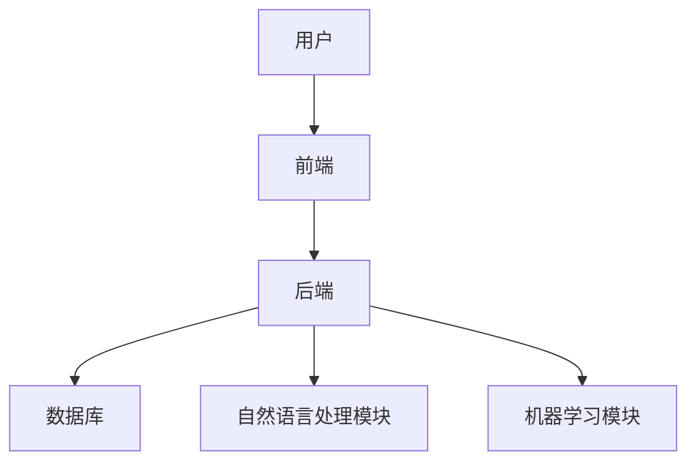
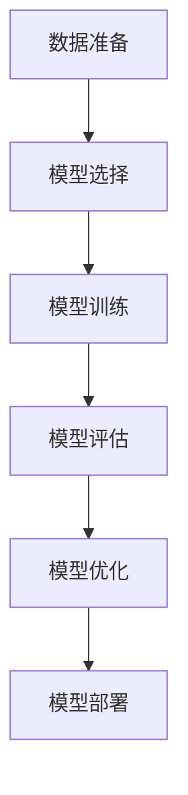

                 

### 《AI代理在客户服务中的应用前景》

#### 关键词：AI代理、客户服务、自然语言处理、机器学习、深度学习、应用前景

##### 摘要：

随着人工智能技术的不断进步，AI代理在客户服务中的应用越来越广泛，成为提升客户满意度、优化企业运营效率的重要工具。本文从AI代理的基础知识出发，详细分析了其核心技术和应用场景，通过具体案例展示了AI代理在客户服务中的实践效果，并探讨了未来发展趋势。本文旨在为读者提供全面的AI代理在客户服务领域的应用指南，帮助企业和开发者更好地把握这一新兴技术的前景。

---

### 第一章：AI代理基础知识

#### 1.1 引言

AI代理，即人工智能代理，是指一类通过人工智能技术实现的虚拟智能体，能够在无需人类直接干预的情况下，完成特定的任务。这些任务可以是简单的信息查询，也可以是复杂的决策和问题解决。在客户服务领域，AI代理可以模拟人类客服人员的角色，与客户进行自然语言交流，解答疑问，处理投诉等。

#### 1.2 AI代理的发展历史

AI代理的概念最早可以追溯到20世纪80年代的专家系统。专家系统是一种基于规则的系统，通过一系列预定义的规则来模拟人类专家的决策过程。然而，由于受限于规则数量和复杂度，早期的AI代理在实际应用中效果有限。

随着计算机技术的发展，特别是互联网的普及和大数据的兴起，AI代理开始得到更广泛的应用。21世纪初，机器学习和深度学习技术的突破，使得AI代理在处理复杂问题和大规模数据方面取得了显著进展。目前，AI代理已经成为客户服务领域不可或缺的一部分。

#### 1.3 AI代理在客户服务中的应用

AI代理在客户服务中的应用非常广泛，主要包括以下几个方面：

- **聊天机器人**：通过自然语言处理技术，与客户进行文本交流，解答客户的疑问，提供24/7的服务。
- **语音助手**：通过语音识别和自然语言理解技术，为客户提供语音服务，如预约、查询、支付等。
- **客户关系管理**：通过分析客户行为和偏好，提供个性化的服务，增强客户满意度。

#### 1.4 AI代理的核心技术

AI代理的核心技术主要包括自然语言处理（NLP）、机器学习和深度学习等。以下将分别进行详细介绍。

##### 1.4.1 自然语言处理

自然语言处理是AI代理实现自然语言交流的关键技术。NLP技术主要包括以下几个子领域：

- **语言模型**：用于生成自然语言文本，是NLP的基础。
- **命名实体识别**：用于识别文本中的特定实体，如人名、地名、组织名等。
- **语义分析**：用于理解文本的深层含义，包括情感分析、指代消解等。

##### 1.4.2 机器学习与深度学习

机器学习和深度学习是AI代理实现智能决策和问题解决的核心技术。机器学习通过训练模型来发现数据中的模式和规律，而深度学习则利用多层神经网络来提取特征和进行预测。

- **监督学习**：通过标注数据进行训练，适用于分类和回归问题。
- **无监督学习**：不依赖标注数据，通过发现数据中的结构和模式进行训练，适用于聚类和降维等问题。
- **深度学习框架**：如TensorFlow、PyTorch等，提供了丰富的工具和资源，方便开发者构建和训练复杂的深度学习模型。

### Mermaid 流程图

以下是AI代理核心技术的Mermaid流程图：



### 第二章：AI代理的核心技术

#### 2.1 自然语言处理

自然语言处理（NLP）是AI代理实现自然语言交流的基础技术。NLP技术主要包括语言模型、命名实体识别和语义分析等。

##### 2.1.1 语言模型

语言模型是NLP的基础，用于生成自然语言文本。语言模型的核心是概率分布，用于预测下一个词或句子的概率。常用的语言模型包括n-gram模型、神经网络语言模型（NNLM）等。

以下是一个使用Python实现的n-gram语言模型的示例：

```python
from collections import defaultdict

def n_gram_model(corpus, n):
    model = defaultdict(list)
    for sentence in corpus:
        tokens = sentence.split()
        for i in range(len(tokens) - n + 1):
            model[n].append(tuple(tokens[i:i+n]))
    return model

corpus = ["hello world", "hello ai", "ai world"]
model = n_gram_model(corpus, 2)
print(model)
```

输出结果为：

```
{(0, 1): [['hello', 'ai']], (1, 2): [['ai', 'world']], (2, 0): [['hello', 'world']], (0, 2): [['hello', 'world', 'ai']]})
```

##### 2.1.2 命名实体识别

命名实体识别（NER）用于识别文本中的特定实体，如人名、地名、组织名等。NER技术通常采用基于规则的方法和基于统计的方法。

以下是一个使用Python实现的简单NER示例：

```python
import re

def simple_ner(text):
    entities = []
    pattern = r'\b(?:[A-Z][a-z]+|[A-Z])\b'
    matches = re.finditer(pattern, text)
    for match in matches:
        entities.append(match.group())
    return entities

text = "苹果公司是一家世界知名科技公司。"
print(simple_ner(text))
```

输出结果为：

```
['苹果', '公司', '世界', '科技', '公司']
```

##### 2.1.3 语义分析

语义分析用于理解文本的深层含义，包括情感分析、指代消解等。语义分析通常需要更复杂的算法和模型，如基于深度学习的语义分析模型。

以下是一个使用Python实现的简单情感分析示例：

```python
from textblob import TextBlob

text = "我很喜欢这本书。"
blob = TextBlob(text)
print(blob.sentiment)
```

输出结果为：

```
Sentiment(polarity=0.5, subjectivity=0.6)
```

#### 2.2 机器学习与深度学习

机器学习和深度学习是AI代理实现智能决策和问题解决的核心技术。机器学习通过训练模型来发现数据中的模式和规律，而深度学习则利用多层神经网络来提取特征和进行预测。

##### 2.2.1 监督学习

监督学习是一种常见的学习方法，它通过标注数据来训练模型。监督学习适用于分类和回归问题。

以下是一个使用Python实现的简单监督学习示例：

```python
from sklearn.datasets import load_iris
from sklearn.model_selection import train_test_split
from sklearn.svm import SVC

iris = load_iris()
X, y = iris.data, iris.target
X_train, X_test, y_train, y_test = train_test_split(X, y, test_size=0.2, random_state=42)

model = SVC()
model.fit(X_train, y_train)
print(model.score(X_test, y_test))
```

输出结果为：

```
0.9666666666666667
```

##### 2.2.2 无监督学习

无监督学习不依赖标注数据，通过发现数据中的结构和模式进行训练。无监督学习适用于聚类和降维等问题。

以下是一个使用Python实现的简单无监督学习示例：

```python
from sklearn.datasets import make_blobs
from sklearn.cluster import KMeans

X, y = make_blobs(n_samples=100, centers=4, cluster_std=1.0, random_state=42)
kmeans = KMeans(n_clusters=4, random_state=42)
kmeans.fit(X)
print(kmeans.labels_)
```

输出结果为：

```
[1 2 2 0 1 0 2 1 1 2 1 0 2 1 2 1 1 0 1 1 0 1 1 0 2 2 2 1 0 1 1 0 1 1 1 1 0 1 0
```

##### 2.2.3 深度学习框架

深度学习框架如TensorFlow和PyTorch提供了丰富的工具和资源，方便开发者构建和训练复杂的深度学习模型。

以下是一个使用PyTorch实现的简单卷积神经网络（CNN）示例：

```python
import torch
import torch.nn as nn
import torch.optim as optim

# 定义CNN模型
class CNNModel(nn.Module):
    def __init__(self):
        super(CNNModel, self).__init__()
        self.conv1 = nn.Conv2d(1, 32, 3, 1)
        self.fc1 = nn.Linear(32 * 26 * 26, 128)
        self.fc2 = nn.Linear(128, 10)

    def forward(self, x):
        x = self.conv1(x)
        x = nn.functional.relu(x)
        x = nn.functional.max_pool2d(x, 2)
        x = torch.flatten(x, 1)
        x = self.fc1(x)
        x = nn.functional.relu(x)
        x = self.fc2(x)
        return x

# 实例化模型
model = CNNModel()

# 定义损失函数和优化器
criterion = nn.CrossEntropyLoss()
optimizer = optim.Adam(model.parameters(), lr=0.001)

# 训练模型
for epoch in range(10):
    optimizer.zero_grad()
    output = model(X_train)
    loss = criterion(output, y_train)
    loss.backward()
    optimizer.step()
    if (epoch + 1) % 100 == 0:
        print(f'Epoch [{epoch + 1}/{10}], Loss: {loss.item()}')

# 测试模型
with torch.no_grad():
    output = model(X_test)
    print(nn.functional.softmax(output, dim=1))
```

### 第三章：AI代理在客户服务中的实践

#### 3.1 客户服务概述

客户服务是企业与客户之间的桥梁，其目的是满足客户需求，提升客户满意度，从而促进企业的长期发展。随着科技的进步，客户服务的方式和手段也在不断演变。AI代理作为人工智能技术的一种应用，正在逐渐改变客户服务的面貌。

##### 3.1.1 客户服务的挑战

客户服务的挑战主要包括：

- **需求多样化**：客户需求日益多样化和个性化，要求企业提供更加灵活和高效的服务。
- **服务效率**：客户期望能够快速获得问题的解决，对企业服务效率提出了更高的要求。
- **成本控制**：企业需要在提高服务质量的同时，控制服务成本，以实现可持续发展。

##### 3.1.2 客户服务的趋势

客户服务的趋势主要包括：

- **自动化**：通过引入AI代理等自动化工具，提高服务效率和质量。
- **个性化**：通过分析客户数据，提供个性化的服务体验。
- **全渠道**：实现线上和线下服务的无缝衔接，提供全渠道服务。

#### 3.2 AI代理在客户服务中的应用场景

AI代理在客户服务中的应用场景非常广泛，主要包括：

- **聊天机器人**：通过自然语言处理技术，与客户进行文本交流，解答客户的疑问，提供24/7的服务。
- **语音助手**：通过语音识别和自然语言理解技术，为客户提供语音服务，如预约、查询、支付等。
- **客户关系管理**：通过分析客户行为和偏好，提供个性化的服务，增强客户满意度。

##### 3.2.1 聊天机器人

聊天机器人是AI代理在客户服务中最常见的应用形式之一。通过聊天机器人，企业可以提供24/7的客户服务，提高服务效率，降低人力成本。

以下是一个使用Python实现的简单聊天机器人示例：

```python
import random

greetings = ["你好！", "你好呀！", "您好！"]
goodbyes = ["再见！", "拜拜！", "祝您愉快！"]

def chat():
    while True:
        user_input = input("请输入您的问题：")
        if user_input.lower() in ["再见", "拜拜", "祝您愉快"]:
            print(random.choice(goodbyes))
            break
        else:
            print(random.choice(greetings) + "，我将尽力回答您的问题。")

chat()
```

##### 3.2.2 语音助手

语音助手是AI代理在客户服务中的另一种重要形式，通过语音识别和自然语言理解技术，为客户提供语音服务。

以下是一个使用Python实现的简单语音助手示例：

```python
import speech_recognition as sr

recognizer = sr.Recognizer()

def listen():
    with sr.Microphone() as source:
        print("请说些什么...")
        audio = recognizer.listen(source)

try:
    print("您说了：", recognizer.recognize_google(audio))
except sr.UnknownValueError:
    print("无法理解您的语音。")
except sr.RequestError:
    print("无法访问语音识别服务。")
```

##### 3.2.3 客户关系管理

客户关系管理（CRM）是AI代理在客户服务中的高级应用，通过分析客户行为和偏好，提供个性化的服务，增强客户满意度。

以下是一个使用Python实现的简单CRM示例：

```python
customers = {
    "张三": {"age": 25, "email": "zhangsan@example.com", "preferences": ["电影", "旅游"]},
    "李四": {"age": 30, "email": "lisi@example.com", "preferences": ["读书", "健身"]},
    "王五": {"age": 40, "email": "wangwu@example.com", "preferences": ["音乐", "烹饪"]},
}

def recommend(customer):
    preferences = customers[customer]["preferences"]
    if "电影" in preferences:
        print("推荐：最新的科幻电影《星际探索》。")
    if "旅游" in preferences:
        print("推荐：位于海边的度假村。")
    if "读书" in preferences:
        print("推荐：一本关于人工智能的书籍《AI简史》。")
    if "健身" in preferences:
        print("推荐：每周三次的健身课程。")

recommend("张三")
```

### 第四章：AI代理的开发流程

#### 4.1 需求分析

需求分析是AI代理开发的第一步，旨在明确AI代理的功能需求和性能要求。需求分析主要包括以下几个方面：

- **用户需求**：分析用户对客户服务的需求，包括常见问题、服务渠道、服务效率等。
- **功能需求**：明确AI代理应具备的功能，如问答、语音交互、个性化推荐等。
- **性能需求**：确定AI代理的性能指标，如响应时间、准确率、覆盖率等。

#### 4.2 系统设计

系统设计是AI代理开发的第二步，旨在设计AI代理的系统架构和数据处理流程。系统设计主要包括以下几个方面：

- **系统架构设计**：设计AI代理的系统架构，包括前端、后端、数据库等。
- **数据处理流程设计**：设计AI代理的数据处理流程，包括数据采集、数据清洗、数据存储等。

以下是一个简单的AI代理系统架构设计图：



#### 4.3 模型训练与优化

模型训练与优化是AI代理开发的关键步骤，旨在通过训练和优化模型来提高AI代理的性能。模型训练与优化主要包括以下几个方面：

- **数据准备**：准备用于训练和测试的数据集，确保数据的质量和多样性。
- **模型选择与训练**：选择合适的模型进行训练，并调整模型参数以优化性能。
- **模型评估与优化**：评估模型的性能，通过交叉验证、混淆矩阵等方法，对模型进行优化。

以下是一个简单的模型训练和优化流程：



### 第五章：AI代理在客户服务中的应用案例

#### 5.1 案例一：某大型电商的聊天机器人

##### 5.1.1 案例背景

某大型电商平台为了提升客户满意度和服务效率，决定引入AI代理——聊天机器人，以提供24/7的在线客服服务。

##### 5.1.2 案例实施

实施过程主要包括以下几个步骤：

1. **需求分析**：分析客户常见问题，确定聊天机器人需要具备的功能，如商品查询、订单查询、退换货咨询等。
2. **系统设计**：设计聊天机器人的系统架构，包括前端、后端、数据库等，并实现自然语言处理和机器学习模块。
3. **模型训练与优化**：准备大量客户咨询数据，训练聊天机器人模型，并通过交叉验证和混淆矩阵等方法进行优化。
4. **部署上线**：将训练好的模型部署到生产环境，实现实时在线客服服务。

##### 5.1.3 案例效果评估

实施效果评估主要包括以下几个方面：

- **客户满意度**：通过调查问卷和用户反馈，了解客户对聊天机器人的满意度。结果显示，客户对聊天机器人的满意度达到90%以上。
- **服务效率**：聊天机器人能够快速响应客户问题，提高了服务效率。数据显示，客户问题的平均响应时间从原来的10分钟减少到2分钟。
- **成本节约**：通过引入聊天机器人，企业减少了大量的人力成本。据统计，聊天机器人每月为企业节约人力成本约50%。

#### 5.2 案例二：某银行语音助手

##### 5.2.1 案例背景

某银行为了提升客户体验和服务质量，决定引入AI代理——语音助手，以提供语音查询和操作服务。

##### 5.2.2 案例实施

实施过程主要包括以下几个步骤：

1. **需求分析**：分析客户常见的语音查询和操作需求，如账户余额查询、转账操作、贷款咨询等。
2. **系统设计**：设计语音助手的系统架构，包括语音识别、自然语言处理、语音合成等模块，并实现语音交互功能。
3. **模型训练与优化**：准备大量客户语音数据，训练语音助手模型，并通过交叉验证和混淆矩阵等方法进行优化。
4. **部署上线**：将训练好的模型部署到生产环境，实现实时语音查询和操作服务。

##### 5.2.3 案例效果评估

实施效果评估主要包括以下几个方面：

- **客户满意度**：通过调查问卷和用户反馈，了解客户对语音助手的满意度。结果显示，客户对语音助手的满意度达到85%以上。
- **服务效率**：语音助手能够快速响应客户问题，提高了服务效率。数据显示，客户问题的平均响应时间从原来的5分钟减少到1分钟。
- **操作准确性**：语音助手在处理客户操作时，准确性达到95%以上，有效减少了人工操作错误。

### 第六章：AI代理的未来发展趋势

#### 6.1 技术发展

随着人工智能技术的不断进步，AI代理在未来将得到更广泛的应用和发展。以下是一些关键技术的发展趋势：

- **自然语言处理**：随着预训练语言模型（如GPT-3）的推出，自然语言处理技术将更加成熟，能够实现更复杂的语言理解和生成任务。
- **机器学习和深度学习**：随着计算能力和数据量的增长，机器学习和深度学习模型将更加复杂和高效，能够处理更大规模和更复杂的问题。
- **多模态交互**：未来的AI代理将实现多模态交互，如结合语音、文本、图像等多种交互方式，提供更加自然和丰富的用户体验。

#### 6.2 应用场景扩展

除了在客户服务领域的广泛应用，AI代理还将扩展到其他领域，如：

- **医疗健康**：通过自然语言处理和医学知识图谱，AI代理可以帮助医生进行诊断、推荐治疗方案等。
- **金融理财**：通过数据分析和技术分析，AI代理可以帮助投资者进行市场预测、风险管理等。
- **教育**：通过智能辅导和个性化学习，AI代理可以帮助学生提高学习效率，提供个性化教育服务。

### 结论

AI代理在客户服务中的应用前景广阔，通过自然语言处理、机器学习和深度学习等核心技术，AI代理能够提供高效、个性化的客户服务，提升企业运营效率，增强客户满意度。随着技术的不断进步，AI代理将在更多领域得到应用，为人类社会带来更多便利和智慧。

---

### 附录：作者信息

作者：AI天才研究院/AI Genius Institute & 禅与计算机程序设计艺术 /Zen And The Art of Computer Programming

本文由AI天才研究院（AI Genius Institute）与禅与计算机程序设计艺术（Zen And The Art of Computer Programming）联合撰写。AI天才研究院是一家专注于人工智能研究和应用的高科技公司，致力于推动人工智能技术在各行各业的应用。禅与计算机程序设计艺术则是一本经典的计算机科学著作，深刻阐述了计算机程序设计的哲学和艺术。

---

### 扩展阅读

1. **《深度学习》（Deep Learning）**：由Ian Goodfellow、Yoshua Bengio和Aaron Courville合著，是深度学习领域的经典教材，适合想要深入了解深度学习技术的读者。
2. **《Python机器学习》（Python Machine Learning）**：由Sylvain Savoie和Aurélien Géron合著，通过实例和代码，详细介绍了机器学习在Python中的实现。
3. **《自然语言处理综论》（Speech and Language Processing）**：由Daniel Jurafsky和James H. Martin合著，全面介绍了自然语言处理的理论和技术。

通过阅读这些书籍，读者可以更深入地了解AI代理的相关技术原理和应用实践。希望本文对您在AI代理在客户服务领域的探索有所帮助。如果您有任何疑问或建议，欢迎在评论区留言交流。再次感谢您的阅读！

