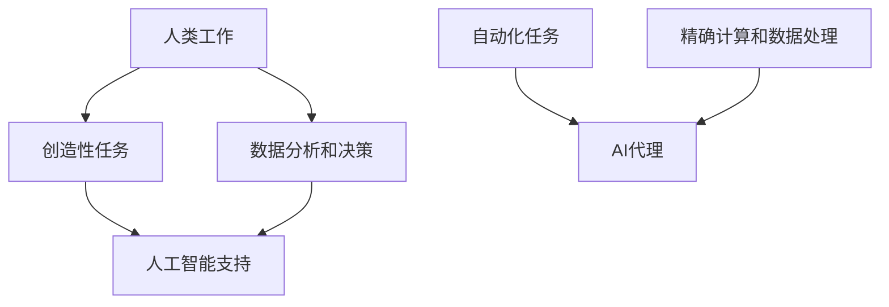

                 

当然可以。接下来，我们将一步步构建文章的各个部分，确保每个部分都满足上述的约束条件和完整性要求。以下是文章的开头部分，包括标题、关键词和摘要。

# AI代理如何补充人类工作

> 关键词：AI代理，人类工作，互补关系，应用领域，实践应用，未来展望

> 摘要：本文深入探讨了AI代理的概念、技术原理、应用领域和实践应用，分析了AI代理如何通过自动化和智能化的方式补充人类工作，提高工作效率和生产力。文章还展望了AI代理未来的发展趋势及其与人类协同工作的前景。

现在，我们将开始构建文章的各个部分。以下是第一章：引言。

## 第一章：引言

### 1.1 AI代理的概念与现状

AI代理（Artificial Intelligence Agent）是一种能够在特定环境下自主感知、决策和执行任务的智能体。它们通常通过机器学习、自然语言处理、计算机视觉等技术来实现智能行为。随着人工智能技术的快速发展，AI代理在各个领域中的应用越来越广泛。

当前，AI代理已经渗透到我们的生活和工作中的方方面面。例如，智能客服通过自然语言处理技术提供24/7的客户服务；自动驾驶汽车通过计算机视觉和传感器数据实现自主驾驶；医疗诊断系统通过深度学习技术辅助医生进行疾病诊断。这些应用展示了AI代理的潜力和优势。

### 1.2 AI代理的重要性

AI代理的重要性体现在以下几个方面：

1. **提高效率**：AI代理能够自动化执行重复性和耗时的任务，从而提高工作效率。
2. **减轻工作负担**：通过分担人类的认知和工作负担，AI代理帮助人们从繁琐的任务中解脱出来，专注于更具创造性的工作。
3. **增强决策能力**：AI代理通过大数据分析和机器学习算法，能够提供更加精确和及时的决策支持。
4. **创新应用**：AI代理的应用推动了新技术的创新，如智能家居、智能医疗、智能制造等。

### 1.3 人类工作与AI代理的互补关系

人类工作和AI代理之间存在天然的互补关系。人类具备创造力、情感理解和复杂决策能力，而AI代理则在处理大量数据、执行重复任务和精确计算方面具有优势。通过将人类与AI代理结合，可以最大化各自的优点，实现协同工作。

以下是一个Mermaid流程图，展示人类工作与AI代理的互补关系：

在接下来的章节中，我们将进一步探讨AI代理的核心技术、工作原理、应用领域、实践应用和未来展望。

### 作者信息：

作者：AI天才研究院/AI Genius Institute & 禅与计算机程序设计艺术 /Zen And The Art of Computer Programming

接下来，我们将继续构建第二章：理论基础。在撰写过程中，我们将确保每个部分都详细、具体，并包含必要的Python源代码、数学公式和案例分析。

---

在构建文章的过程中，我们会逐步按照用户的要求和提供的思路来完善每一个章节。请告诉我，您是否满意第一章的结构和内容，或者是否有任何修改或补充的建议？我们将继续进行下一步的工作。

