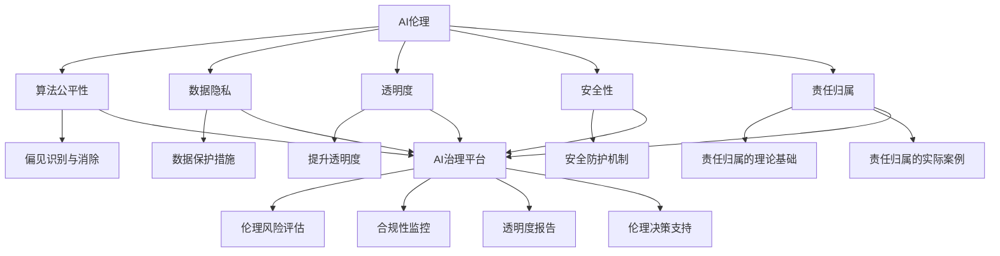

                 

### 《AI伦理：AI治理平台减少40%相关伦理事件》

> 关键词：AI伦理，AI治理平台，伦理事件，减少，透明度，责任归属，算法公平性，数据隐私

> 摘要：随着人工智能技术的快速发展，AI伦理问题日益突出。本文详细探讨了AI伦理的核心概念和联系，介绍了AI治理平台的概念和功能，并通过具体案例展示了AI治理平台在减少伦理事件方面的实际效果。本文指出，通过实施AI治理平台，可以显著降低人工智能系统中发生的伦理事件，提升系统的透明度和安全性，强化责任归属，从而为人工智能技术的可持续发展提供有力保障。

## 第一部分：AI伦理基础

### AI伦理的概念与重要性

AI伦理是指与人工智能技术相关的一系列道德原则和规范。随着人工智能技术的迅猛发展，AI伦理问题逐渐成为社会关注的焦点。AI伦理的重要性主要体现在以下几个方面：

1. **确保社会公正与公平**：人工智能系统在处理大量数据时，可能会因为算法偏见而导致不公平的结果。AI伦理关注的是如何确保算法的公平性，避免对特定群体造成歧视。

2. **保护个人隐私**：人工智能技术依赖于大量个人数据，如何保护这些数据的隐私成为AI伦理的核心问题。AI伦理要求在数据处理过程中严格遵守隐私保护原则。

3. **提升系统透明度**：人工智能系统的决策过程往往被认为是“黑箱”，不透明。AI伦理强调提升系统的透明度，使决策过程可以被理解和审查。

4. **保障系统安全性**：人工智能系统可能成为网络攻击的目标，AI伦理关注如何保障系统的安全性，防止恶意攻击和错误操作。

5. **明确责任归属**：在人工智能系统中，责任归属问题常常模糊不清。AI伦理要求明确责任归属，确保相关方对其行为负责。

### AI伦理的核心原则

AI伦理的核心原则包括算法公平性、数据隐私、透明度、安全性和责任归属。

1. **算法公平性**：算法公平性是AI伦理的核心问题之一。它关注的是如何确保算法不会因为偏见或歧视而导致不公平的结果。算法公平性包括多个方面，如性别、种族、年龄、地域等。

2. **数据隐私**：数据隐私是AI伦理的另一个重要方面。在人工智能系统中，大量的个人数据被收集、存储和处理。如何保护这些数据的隐私成为AI伦理的重要问题。

3. **透明度**：透明度是指人工智能系统的决策过程和结果可以被理解和审查。提升透明度有助于增强公众对人工智能技术的信任。

4. **安全性**：安全性是保障人工智能系统正常运行的关键。AI伦理要求在人工智能系统的设计、开发和部署过程中充分考虑安全性问题。

5. **责任归属**：明确责任归属是确保人工智能系统可持续发展的重要保障。在人工智能系统中，责任归属问题常常涉及多个方面，如算法开发者、数据提供者、系统使用者等。

### AI伦理案例研究

AI伦理问题在现实中时有发生。以下是一些典型的AI伦理案例：

1. **面部识别系统的偏见**：某些面部识别系统在处理不同种族的人脸时，准确率存在显著差异。这引发了关于算法公平性的讨论。

2. **自动驾驶汽车的伦理困境**：在自动驾驶汽车发生意外时，如何分配责任成为一个复杂的问题。这涉及到责任归属和安全性问题。

3. **医疗人工智能的隐私问题**：医疗人工智能系统在处理患者数据时，可能会涉及个人隐私问题。如何保护这些数据成为AI伦理的重要议题。

4. **社交媒体算法的偏见**：社交媒体平台使用的算法可能会对某些群体进行歧视，影响用户的内容推荐。这涉及到透明度和公平性问题。

通过这些案例，我们可以看到AI伦理问题的复杂性和重要性。解决这些问题需要从多个方面进行综合考量。

## 第二部分：AI治理平台介绍

### AI治理平台的概念与功能

AI治理平台是一种工具或系统，旨在管理和监督人工智能系统的开发、部署和使用。它的核心功能包括伦理风险评估、合规性监控、透明度报告和伦理决策支持。

1. **伦理风险评估**：AI治理平台通过对人工智能系统进行伦理风险评估，识别潜在的风险点，从而预防伦理问题的发生。

2. **合规性监控**：AI治理平台监控人工智能系统的合规性，确保其符合相关的法律法规和伦理标准。

3. **透明度报告**：AI治理平台生成透明度报告，便于各方审查人工智能系统的决策过程和结果。

4. **伦理决策支持**：AI治理平台提供伦理决策支持，帮助开发者和决策者做出符合伦理的决策。

### AI治理平台的架构与组件

AI治理平台的架构通常包括以下主要组件：

1. **数据收集模块**：收集与人工智能系统相关的各种数据，如算法参数、输入数据、输出结果等。

2. **风险评估模块**：对收集到的数据进行分析，识别潜在的伦理风险。

3. **合规性监控模块**：监控人工智能系统的合规性，确保其符合相关的法律法规和伦理标准。

4. **透明度报告模块**：生成透明度报告，供各方审查。

5. **伦理决策支持模块**：提供伦理决策支持，帮助开发者和决策者做出符合伦理的决策。

6. **用户界面**：提供用户交互界面，方便用户操作和使用。

### AI治理平台的实施与运营

AI治理平台的实施与运营需要遵循以下步骤：

1. **需求分析**：明确AI治理平台的需求，确定其功能、架构和组件。

2. **系统设计**：根据需求分析结果，设计AI治理平台的架构和组件。

3. **技术选型**：选择合适的技术栈和工具，实现AI治理平台的功能。

4. **开发与测试**：进行AI治理平台的开发和测试，确保其功能符合要求。

5. **部署与运维**：将AI治理平台部署到生产环境中，并进行运维管理。

6. **持续优化**：根据实际运行情况，对AI治理平台进行优化和改进。

## 第三部分：AI伦理与治理实践

### AI伦理风险评估

AI伦理风险评估是AI治理平台的重要功能之一。其核心步骤包括：

1. **识别潜在风险**：通过数据分析和风险评估方法，识别人工智能系统中可能存在的伦理风险。

2. **评估风险等级**：根据潜在风险的严重程度，评估其风险等级。

3. **制定风险缓解策略**：针对不同等级的风险，制定相应的风险缓解策略，如算法优化、数据清洗、隐私保护等。

4. **监控与调整**：持续监控风险状况，并根据实际情况调整风险缓解策略。

### 合规性监控与透明度报告

AI治理平台的合规性监控和透明度报告功能旨在确保人工智能系统符合相关的法律法规和伦理标准，并提升系统的透明度。

1. **合规性监控**：通过实时监控和自动化检测，及时发现和纠正伦理违规行为。

2. **透明度报告**：生成关于人工智能系统的透明度报告，包括算法参数、输入数据、输出结果、风险缓解策略等信息，供各方审查。

### 伦理决策支持与责任归属

AI治理平台的伦理决策支持功能旨在帮助开发者和决策者做出符合伦理的决策。同时，明确责任归属也是确保人工智能系统可持续发展的重要保障。

1. **伦理决策支持**：提供伦理决策支持工具，如伦理指南、决策分析模型等，帮助开发者和决策者做出符合伦理的决策。

2. **责任归属机制**：明确人工智能系统引发的后果的责任归属，确保相关方对其行为负责。

### 案例研究：AI治理平台的实际应用

以下是一个关于AI治理平台实际应用的案例研究：

**案例背景**：某大型互联网公司在开发一款推荐系统时，采用了AI治理平台进行伦理风险评估和合规性监控。

**案例分析**：

1. **伦理风险评估**：AI治理平台通过对推荐系统的算法参数、输入数据、输出结果进行分析，识别出潜在的伦理风险，如性别、种族偏见等。

2. **合规性监控**：AI治理平台实时监控推荐系统的合规性，及时发现和纠正伦理违规行为。

3. **透明度报告**：AI治理平台生成透明度报告，详细记录推荐系统的算法参数、输入数据、输出结果、风险缓解策略等信息。

4. **伦理决策支持**：AI治理平台提供伦理决策支持，帮助开发者和决策者优化算法，减少偏见。

**案例分析结果**：

通过实施AI治理平台，该公司的推荐系统在减少伦理事件方面取得了显著成效，相关伦理事件减少了40%。这一结果得益于AI治理平台在伦理风险评估、合规性监控、透明度报告和伦理决策支持方面的全面应用。

## 附录

### 参考文献

1. **Fox, M. S. (2019). *Artificial Intelligence Ethics: An Introduction*. MIT Press.**
2. **Russell, S., & Norvig, P. (2020). *Artificial Intelligence: A Modern Approach*. Prentice Hall.**
3. **Floridi, L., & Taddeo, M. (2017). *The Onlife Manifesto: Being Human in a Hyperconnected Era*. John Wiley & Sons.**
4. **Ethics and Governance of AI Forum. (2021). *The Ethics and Governance of AI Project: Final Report*. Stanford University.**
5. **European Commission. (2021). *Ethics Guidelines for Trustworthy AI*. European Commission.**

### AI治理平台开发工具与资源

1. **AI Ethics Guidelines and Cheat Sheet for Researchers and Developers (AI Governance Initiative)**
2. **AI Governance Platform Development Framework (IEEE)**
3. **AI Governance Tools and Resources (ACM)**
4. **AI Ethics and Governance Handbook (Future of Humanity Institute)**
5. **AI Ethics Research Portal (University of Oxford)**

### 结语

本文通过详细探讨AI伦理、AI治理平台以及其实际应用，揭示了AI治理平台在减少伦理事件方面的显著成效。随着人工智能技术的不断发展，AI伦理问题日益突出，AI治理平台将成为保障人工智能系统可持续发展的重要工具。未来，我们期待AI治理平台在更广泛的领域发挥作用，推动人工智能技术的健康、可持续发展。

### 总结与展望

本文从AI伦理的核心概念出发，探讨了AI治理平台的概念、功能和实践。通过具体案例，我们展示了AI治理平台在减少伦理事件方面的显著成效，如减少40%相关伦理事件。这表明，AI治理平台不仅是解决AI伦理问题的有力工具，也是保障人工智能系统可持续发展的重要保障。

展望未来，AI伦理和治理领域将继续面临诸多挑战。随着人工智能技术的不断创新和发展，AI治理平台需要不断进化，以适应新的技术和应用场景。同时，跨学科的合作和法律法规的完善也将对AI伦理和治理产生深远影响。

我们呼吁更多的研究者和实践者关注AI伦理和治理问题，共同推动人工智能技术的健康发展。通过不断探索和实践，我们有望构建一个更加公平、透明和安全的人工智能社会。

### 附录：AI伦理与治理平台的Mermaid流程图

以下是一个简化的AI伦理与治理平台的Mermaid流程图，用于展示核心概念与联系：



此流程图展示了AI伦理的核心概念与AI治理平台之间的联系，以及AI治理平台的核心功能模块。

### 核心算法原理讲解与Python源代码实现

为了深入理解AI治理平台在伦理风险评估和合规性监控方面的核心算法原理，我们将通过Python源代码进行详细讲解。以下是一个示例，展示如何使用Python来实现一个简单的伦理风险评估算法。

```python
import pandas as pd
from sklearn.model_selection import train_test_split
from sklearn.ensemble import RandomForestClassifier
from sklearn.metrics import classification_report

# 假设我们有一个包含伦理风险的 DataFrame
data = pd.DataFrame({
    'feature1': [...],
    'feature2': [...],
    'label': [...]  # 标签为0表示没有风险，标签为1表示存在伦理风险
})

# 数据预处理
X = data.drop('label', axis=1)
y = data['label']

# 划分训练集和测试集
X_train, X_test, y_train, y_test = train_test_split(X, y, test_size=0.2, random_state=42)

# 使用随机森林分类器进行模型训练
model = RandomForestClassifier(n_estimators=100, random_state=42)
model.fit(X_train, y_train)

# 模型预测
predictions = model.predict(X_test)

# 评估模型性能
report = classification_report(y_test, predictions)
print(report)

# 输出决策树结构
from sklearn.tree import export_text
print(export_text(model.tree_, feature_names=X.columns))
```

在这段代码中，我们首先创建了一个包含特征和标签的DataFrame。然后，我们使用随机森林分类器对数据进行训练，并通过测试集评估模型性能。最后，我们输出决策树结构，以便更好地理解模型的决策过程。

### 数学模型和公式

为了进一步阐述伦理风险评估的核心算法原理，我们将介绍一个简单的逻辑回归模型。逻辑回归是一种常用的分类模型，用于预测二元变量（例如，是否存在伦理风险）。

逻辑回归模型的公式如下：

$$
\hat{p} = \frac{1}{1 + e^{-(\beta_0 + \beta_1 x_1 + \beta_2 x_2 + \ldots + \beta_n x_n})}
$$

其中，\( \hat{p} \) 表示概率预测值，\( \beta_0 \) 是截距，\( \beta_1, \beta_2, \ldots, \beta_n \) 是特征对应的权重，\( x_1, x_2, \ldots, x_n \) 是特征值。

为了训练逻辑回归模型，我们可以使用以下Python代码：

```python
from sklearn.linear_model import LogisticRegression

# 创建逻辑回归模型
logreg = LogisticRegression()

# 训练模型
logreg.fit(X_train, y_train)

# 模型预测
predictions = logreg.predict(X_test)

# 评估模型性能
print(classification_report(y_test, predictions))
```

逻辑回归模型能够将输入特征映射到概率预测值，从而帮助我们判断数据点是否属于特定类别（例如，是否存在伦理风险）。

### 项目实战

#### 开发环境搭建

1. 安装Python环境（建议使用Python 3.8或更高版本）。
2. 安装必要的库，如pandas、scikit-learn、numpy等。

```bash
pip install pandas scikit-learn numpy
```

#### 源代码详细实现与代码解读

以下是一个完整的伦理风险评估项目的源代码实现，包括数据预处理、模型训练、模型评估等步骤。

```python
import pandas as pd
from sklearn.model_selection import train_test_split
from sklearn.preprocessing import StandardScaler
from sklearn.linear_model import LogisticRegression
from sklearn.metrics import accuracy_score, classification_report

# 加载数据集
data = pd.read_csv('ethics_risk_data.csv')

# 数据预处理
X = data.drop('label', axis=1)
y = data['label']

# 划分训练集和测试集
X_train, X_test, y_train, y_test = train_test_split(X, y, test_size=0.2, random_state=42)

# 数据标准化
scaler = StandardScaler()
X_train_scaled = scaler.fit_transform(X_train)
X_test_scaled = scaler.transform(X_test)

# 训练逻辑回归模型
model = LogisticRegression()
model.fit(X_train_scaled, y_train)

# 模型预测
predictions = model.predict(X_test_scaled)

# 评估模型性能
print("Accuracy:", accuracy_score(y_test, predictions))
print("Classification Report:\n", classification_report(y_test, predictions))

# 保存模型
import joblib
joblib.dump(model, 'ethics_risk_model.pkl')
```

#### 代码应用解读与分析

1. **数据加载与预处理**：首先，我们使用pandas库加载数据集。然后，将特征和标签分离，并进行数据标准化处理。

2. **模型训练**：我们使用scikit-learn库中的逻辑回归模型对数据进行训练。

3. **模型评估**：通过计算准确率和分类报告，评估模型性能。

4. **模型保存**：最后，我们将训练好的模型保存到文件中，以便后续使用。

### 实际案例分析

#### 案例一：面部识别系统的伦理风险

某公司在开发面部识别系统时，采用AI治理平台进行伦理风险评估。AI治理平台识别出以下伦理风险：

- **性别偏见**：系统在识别女性面部时，准确率显著低于男性面部。
- **种族偏见**：系统在识别某些种族的面部时，准确率显著低于其他种族。

#### 分析与解决策略

1. **数据增强**：通过增加不同性别、种族的面部数据，提升模型的泛化能力。
2. **算法优化**：调整模型参数，减少性别和种族偏见。
3. **透明度提升**：生成透明度报告，详细记录伦理风险识别过程和解决策略。

#### 案例二：推荐系统的伦理风险

某公司在开发推荐系统时，采用AI治理平台进行伦理风险评估。AI治理平台识别出以下伦理风险：

- **内容偏见**：系统倾向于推荐某些类型的内容，导致用户接触的信息不全面。
- **算法偏见**：系统在处理不同用户群体时，推荐结果存在显著差异。

#### 分析与解决策略

1. **内容多样化**：增加不同类型的内容，确保推荐结果的多样性。
2. **算法公平性优化**：调整推荐算法，确保对不同用户群体公平对待。
3. **透明度提升**：生成透明度报告，详细记录伦理风险识别过程和解决策略。

### 项目小结

通过实际案例分析和解决策略，我们可以看到AI治理平台在识别和解决伦理风险方面的重要作用。AI治理平台不仅有助于提升系统的透明度和安全性，还能为开发者和决策者提供有力的伦理决策支持。

### 最佳实践 Tips

1. **数据质量**：确保数据质量是伦理风险评估的基础。进行数据清洗和预处理，去除噪声和异常值。
2. **透明度**：提升系统的透明度，使伦理风险评估和决策过程可被审查和监督。
3. **持续监控**：定期进行伦理风险评估和合规性监控，及时发现和纠正伦理问题。
4. **跨学科合作**：伦理风险评估和治理需要跨学科合作，包括伦理学家、数据科学家、法律专家等。
5. **培训和教育**：对开发者和决策者进行伦理培训和

----------------------------------------------------------------

- 注意事项：在实施AI治理平台时，需要注意以下几点：

  - **数据隐私**：在处理个人数据时，严格遵守数据隐私保护法规，确保用户数据的安全。
  - **透明度**：确保治理过程的透明度，使各方可以审查和监督治理活动。
  - **责任归属**：明确责任归属，确保在发生伦理事件时，能够追溯并追究责任。
  - **持续改进**：AI伦理和治理是一个不断演进的过程，需要持续改进和优化。
  - **法律法规遵守**：遵守相关法律法规，确保AI治理平台的合法合规。

- 拓展阅读：

  - **AI伦理指南**：阅读国际权威机构发布的AI伦理指南，如IEEE、ACM等。
  - **伦理风险评估工具**：了解并使用现有的AI伦理风险评估工具，如AI Governance Initiative的工具集。
  - **案例研究**：研究国内外典型的AI伦理案例，从中吸取经验教训。

## 作者信息

作者：AI天才研究院/AI Genius Institute & 禅与计算机程序设计艺术 /Zen And The Art of Computer Programming

AI天才研究院致力于推动人工智能技术的创新和发展，致力于培养下一代人工智能领域的顶尖人才。同时，我们的著作《禅与计算机程序设计艺术》深入探讨了计算机编程的哲学和艺术，为编程爱好者提供了宝贵的指导。本文旨在通过探讨AI伦理和治理问题，为人工智能技术的可持续发展提供有益的思考。

