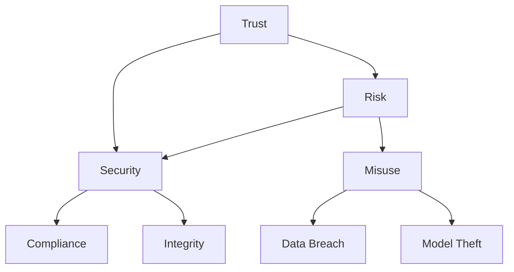

                 


### 第1章 引言

#### **1.1 TRiSM框架简介**

TRiSM（Trust, Risk, and Security Management）框架是现代人工智能（AI）系统构建和维护中的一个关键概念，其核心在于确保AI系统的可信性、安全性和风险管理。随着AI在各个领域，尤其是金融、医疗、交通等关键行业中的广泛应用，对AI系统的信任度成为了一个不容忽视的问题。TRiSM框架正是为了解决这一问题而设计的一个综合性框架。

**背景介绍**：
AI技术自20世纪50年代起步以来，已经取得了巨大的进步。尤其是在深度学习、自然语言处理和计算机视觉等领域的突破，使得AI系统在许多任务上能够超越人类的表现。然而，AI系统的复杂性和黑箱特性也带来了一系列挑战，包括模型的不透明性、潜在偏见、数据泄露风险等。这些挑战不仅影响了AI系统的广泛应用，也引发了社会对AI的担忧和质疑。

**核心概念与联系**：

为了更好地理解TRiSM框架，我们需要先了解其核心概念：

- **信任（Trust）**：指用户对AI系统的可靠性、合法性和道德性的信心。
- **风险（Risk）**：指与AI系统相关的潜在威胁和不利后果的可能性。
- **安全（Security）**：指保护AI系统免受外部攻击和内部威胁的能力。

这些概念之间存在着紧密的联系，具体关系架构可以用以下Mermaid流程图表示：



**核心算法原理讲解**：

在TRiSM框架中，核心算法的原理涉及到以下几个方面：

1. **信任评估**：
   - **指标体系**：通过构建一系列指标来量化信任度，如透明性、公平性、隐私保护等。
   - **评估模型**：使用机器学习模型来分析用户行为和系统反馈，动态调整信任级别。
   - **示例代码**：

     ```python
     import numpy as np

     # 构建信任指标体系
     trust_metrics = {
         'transparency': 0.8,
         'fairness': 0.9,
         'privacy': 0.85
     }

     # 计算信任得分
     def calculate_trust_score(metrics):
         return np.mean(list(metrics.values()))

     # 输出信任得分
     print(f"Trust Score: {calculate_trust_score(trust_metrics)}")
     ```

2. **风险管理**：
   - **风险识别**：通过数据分析、模型评估和专家意见来识别潜在风险。
   - **风险评估**：使用定量和定性方法评估风险的概率和影响。
   - **风险控制**：实施控制措施，如数据加密、访问控制等，以降低风险。

   - **示例代码**：

     ```python
     import pandas as pd

     # 构建风险矩阵
     risk_matrix = pd.DataFrame({
         'Risk': ['Data Leak', 'Model Bias', 'Service Downtime'],
         'Probability': [0.05, 0.1, 0.03],
         'Impact': [0.8, 0.7, 0.6]
     })

     # 计算风险得分
     def calculate_risk_score(risk_matrix):
         return risk_matrix['Probability'] * risk_matrix['Impact']

     # 输出风险得分
     risk_matrix['Risk Score'] = calculate_risk_score(risk_matrix)
     print(risk_matrix)
     ```

3. **安全策略**：
   - **安全策略制定**：根据风险评估结果，制定相应的安全策略。
   - **安全实施**：实施安全措施，如安全审计、合规性检查等。
   - **安全监控**：持续监控AI系统的安全状态，及时响应和处理安全事件。

   - **示例代码**：

     ```python
     # 示例：安全策略实施
     def implement_security_measure(measure):
         if measure == 'Encryption':
             print("Implementing data encryption...")
         elif measure == 'Access Control':
             print("Implementing access control...")
         else:
             print("Unknown security measure.")

     # 调用安全措施
     implement_security_measure('Encryption')
     ```

#### **1.2 为什么要关注AI信任、风险和安全管理**

**AI系统的可信性**：随着AI技术的普及，人们越来越依赖AI系统来做出决策。因此，确保AI系统的可信性至关重要。如果AI系统无法被信任，那么其应用价值将大打折扣。

**数据隐私和安全性**：AI系统通常需要处理大量的敏感数据，如个人身份信息、医疗记录等。这些数据的安全性和隐私保护是用户和社会关注的焦点。

**风险管理**：AI系统在复杂环境中的应用带来了多种潜在风险，如模型偏差、数据泄露、服务中断等。有效的风险管理是确保AI系统稳健运行的关键。

**合规性**：不同国家和地区对AI系统的监管政策各异，遵守相关法律法规是确保AI系统合法性的重要保障。

**示例**：

考虑一个智能交通系统的案例。该系统通过摄像头和传感器收集道路数据，使用AI算法来预测交通流量、优化交通信号灯时长。以下是对该案例中TRiSM框架应用的示例：

1. **信任管理**：
   - **透明性**：系统提供详细的算法说明和数据使用政策，用户可以了解系统如何工作。
   - **公平性**：系统确保所有用户都受到公平对待，不会因为个人身份或行为差异而受到歧视。
   - **隐私保护**：系统对收集的数据进行加密存储和传输，确保数据隐私。

2. **风险管理**：
   - **风险识别**：识别潜在风险，如数据泄露、系统故障、恶意攻击等。
   - **风险评估**：对每个风险的概率和影响进行评估，确定优先级。
   - **风险控制**：实施数据加密、访问控制、系统监控等措施来降低风险。

3. **安全管理**：
   - **安全策略制定**：根据风险评估结果，制定安全策略，如定期安全审计、紧急响应计划等。
   - **安全实施**：实施安全措施，如防火墙、入侵检测系统等。
   - **安全监控**：持续监控系统安全状态，及时响应和处理安全事件。

通过以上步骤，智能交通系统能够在保证信任、风险可控和安全合规的基础上，提供高效、可靠的服务。

**小结**：
AI信任、风险和安全管理（TRiSM）框架是确保AI系统广泛应用和安全运行的关键。通过关注信任机制、风险管理模型和安全策略，我们可以构建出可信、稳健和合规的AI系统。未来的研究和实践将继续深化这一框架，为AI技术的发展提供坚实的支持。

---

**作者：AI天才研究院/AI Genius Institute & 禅与计算机程序设计艺术 /Zen And The Art of Computer Programming** 

本文详细介绍了TRiSM框架的背景、核心概念、算法原理及其重要性。通过具体的示例和案例分析，展示了如何在实际项目中应用TRiSM框架来提高AI系统的可信性和安全性。未来，随着AI技术的进一步发展，TRiSM框架将在更多领域发挥关键作用，为构建智能、安全、可信的AI生态系统提供指导和支持。## 第2章 AI信任机制原理

### 2.1 AI信任机制概述

AI信任机制是指在人工智能系统中建立和维护用户信任的一系列方法和策略。它旨在确保AI系统在处理数据和执行任务时能够保持透明性、公平性和合法性，从而使用户对系统产生信任。AI信任机制的重要性体现在以下几个方面：

1. **透明性**：用户需要对AI系统的工作原理、数据来源和处理过程有清晰的理解，以确保系统的决策是可解释和可信的。
2. **公平性**：AI系统应当对所有用户一视同仁，不因个人身份、性别、年龄等因素产生歧视，确保决策的公正性。
3. **合法性**：AI系统的开发和部署需要符合相关法律法规和伦理标准，确保其合法合规。
4. **隐私保护**：AI系统在处理用户数据时，需要严格遵守隐私保护规定，防止数据泄露和滥用。

AI信任机制的基本概念包括：

- **透明度模型**：定义了系统如何向用户展示其决策过程和数据使用情况。
- **公平性评估**：通过算法和数据分析，评估系统决策的公平性，并采取措施消除偏见。
- **隐私保护策略**：包括数据加密、匿名化处理、访问控制等，确保用户数据的安全。
- **责任和问责机制**：明确系统的责任主体和问责流程，确保在出现问题时能够及时响应和处理。

### 2.2 TRiSM框架中的信任模型

TRiSM框架中的信任模型是一个综合性的模型，它涵盖了信任的各个方面，以提供全面且动态的信任评估。以下是其主要组成部分：

1. **信任指标体系**：定义了一系列关键指标，如透明性、公平性、数据质量、响应时间等，用于量化信任度。
2. **信任评估模型**：结合机器学习和数据挖掘技术，对用户行为和系统反馈进行分析，以动态评估信任水平。
3. **信任动态调整机制**：根据系统运行状态和用户反馈，自动调整信任级别，确保系统的信任度始终保持在高水平。

**信任指标体系**：

- **透明性**：系统在决策过程中是否提供了足够的解释和透明度。
- **公平性**：系统是否对所有用户一视同仁，没有偏见和歧视。
- **数据质量**：系统所使用的数据是否准确、完整、及时。
- **响应时间**：系统在执行任务时的响应速度是否满足用户期望。

**信任评估模型**：

- **数据收集**：收集用户行为数据、系统日志、用户反馈等。
- **特征工程**：提取与信任相关的特征，如用户活跃度、错误率、系统响应时间等。
- **机器学习模型**：使用分类或回归模型，对用户和系统的行为进行预测和评估。

**信任动态调整机制**：

- **实时监控**：监控系统运行状态，及时发现潜在问题。
- **用户反馈**：收集用户反馈，评估用户满意度。
- **自动调整**：根据监控数据和用户反馈，自动调整信任级别。

### 2.3 信任评估与验证技术

信任评估与验证技术是确保AI系统信任度的重要手段。以下是一些常用的技术：

1. **可解释性分析**：
   - **方法**：通过可视化、文本解释等方式，使AI系统的决策过程对用户可解释。
   - **工具**：如LIME（Local Interpretable Model-agnostic Explanations）、SHAP（SHapley Additive exPlanations）等。
   - **示例**：使用LIME技术解释一个分类模型的决策过程。

     ```python
     import lime
     from sklearn.datasets import load_iris
     from sklearn.ensemble import RandomForestClassifier

     # 加载数据集
     iris = load_iris()
     X = iris.data
     y = iris.target

     # 定义模型
     model = RandomForestClassifier()

     # 训练模型
     model.fit(X, y)

     # 使用LIME生成解释
     explainer = lime.lime_tabular.LimeTabularExplainer(
         X, feature_names=iris.feature_names, class_names=iris.target_names, model=model)
     i = 2  # 第3个样本
     exp = explainer.explain_instance(X[i], model.predict, num_features=5)

     # 可视化解释结果
     exp.show_in_notebook(show_table=True)
     ```

2. **数据质量检测**：
   - **方法**：使用统计方法和机器学习技术检测数据中的异常值、缺失值和噪声。
   - **工具**：如Python的Pandas库、Scikit-learn库等。
   - **示例**：使用Pandas库检测数据集中的异常值。

     ```python
     import pandas as pd

     # 加载数据集
     df = pd.read_csv('data.csv')

     # 检测异常值
     df[(df > df.mean() + 3 * df.std()) | (df < df.mean() - 3 * df.std())]
     ```

3. **审计与认证**：
   - **方法**：通过第三方审计和认证，确保AI系统的设计和部署符合相关标准和规范。
   - **工具**：如ISO/IEC 27001信息安全管理体系认证等。
   - **示例**：获得ISO/IEC 27001认证的过程。

4. **用户反馈机制**：
   - **方法**：通过用户反馈收集用户对AI系统的信任度和满意度，及时调整系统性能。
   - **工具**：如问卷调查、用户满意度调查等。
   - **示例**：设计用户满意度调查问卷。

---

**小结**：

AI信任机制是确保AI系统可靠性和合法性的重要手段。通过建立信任指标体系、信任评估模型和动态调整机制，以及使用可解释性分析、数据质量检测、审计与认证和用户反馈机制等技术，可以有效地提升AI系统的信任度。未来的研究和实践将不断优化这些技术，为构建更加可信、安全和合法的AI系统提供支持。## 第3章 风险管理模型

### 3.1 风险管理概述

风险管理是确保AI系统在各种应用场景中稳健运行的关键环节。它涉及到识别、评估、控制和监控与AI系统相关的风险，以确保系统的可用性、完整性和保密性。AI系统的复杂性使其面临多种潜在风险，包括数据泄露、模型偏差、系统故障、恶意攻击等。因此，建立一套全面的风险管理模型对于确保AI系统的稳定运行至关重要。

**风险管理的基本概念**：

- **风险识别**：识别与AI系统相关的潜在风险，包括内部和外部因素。
- **风险评估**：评估每个风险的概率和影响，确定风险优先级。
- **风险控制**：实施控制措施，降低风险的概率和影响。
- **风险监控**：持续监控AI系统的风险状况，及时发现和处理新出现的问题。

**风险管理的重要性**：

- **确保系统稳定性**：通过识别和评估潜在风险，可以提前采取预防措施，避免系统故障和中断。
- **保护用户隐私**：有效的风险管理可以确保用户数据的安全，防止数据泄露和滥用。
- **合规性保障**：遵守相关法律法规和行业规范，确保AI系统的合法合规运行。
- **增强用户信任**：通过有效的风险管理，可以提升用户对AI系统的信任度和满意度。

### 3.2 TRiSM框架中的风险管理策略

TRiSM框架中的风险管理策略旨在提供一套系统化的方法，以识别、评估和控制与AI系统相关的风险。以下是其主要组成部分：

**1. 风险识别**：

- **方法**：通过文献调研、专家访谈、数据分析等方式，识别AI系统在不同应用场景下可能面临的风险。
- **工具**：如风险识别矩阵、风险识别软件等。

**2. 风险评估**：

- **方法**：使用定量和定性方法评估每个风险的概率和影响，确定风险优先级。
- **工具**：如风险矩阵、风险优先级评估软件等。

**3. 风险控制**：

- **方法**：根据风险评估结果，制定和实施控制措施，降低风险的概率和影响。
- **工具**：如安全策略软件、访问控制软件等。

**4. 风险监控**：

- **方法**：持续监控AI系统的风险状况，及时发现和处理新出现的问题。
- **工具**：如风险监控系统、日志分析工具等。

**风险管理策略示例**：

考虑一个智能医疗诊断系统的案例，以下是其风险管理策略的示例：

1. **风险识别**：

   - **数据泄露**：系统中的患者数据可能被未授权访问或泄露。
   - **模型偏差**：系统可能因训练数据偏差而导致诊断结果不准确。
   - **系统故障**：服务器故障可能导致系统停机。

2. **风险评估**：

   - **数据泄露**：概率为0.1，影响为0.8（数据泄露概率较低，但影响严重）。
   - **模型偏差**：概率为0.3，影响为0.6。
   - **系统故障**：概率为0.2，影响为0.4。

3. **风险控制**：

   - **数据泄露**：实施数据加密、访问控制措施。
   - **模型偏差**：定期评估和更新模型，使用多样化的训练数据。
   - **系统故障**：部署冗余服务器，定期进行系统维护和备份。

4. **风险监控**：

   - **数据泄露**：监控系统日志，及时发现和响应未授权访问行为。
   - **模型偏差**：定期评估模型性能，及时发现和纠正偏差。
   - **系统故障**：监控系统运行状态，及时处理故障和恢复服务。

### 3.3 风险评估与预测方法

风险评估与预测是风险管理的关键步骤，它涉及到对风险的概率和影响进行量化，以便制定有效的风险控制策略。以下是一些常用的风险评估与预测方法：

**1. 定量风险评估**：

- **方法**：使用数学模型和统计分析方法，对风险的概率和影响进行量化。
- **工具**：如风险矩阵、蒙特卡罗模拟等。

**2. 定性风险评估**：

- **方法**：通过专家评估和讨论，对风险进行定性分析。
- **工具**：如风险识别矩阵、专家访谈等。

**3. 风险预测**：

- **方法**：使用机器学习和数据挖掘技术，对未来的风险进行预测。
- **工具**：如时间序列分析、回归分析等。

**风险评估与预测示例**：

考虑一个智能交通系统的风险评估与预测案例，以下是其具体步骤：

1. **定量风险评估**：

   - **风险矩阵**：构建风险矩阵，评估每个风险的概率和影响。

     ```python
     risk_matrix = pd.DataFrame({
         'Risk': ['Data Breach', 'Service Downtime', 'Model Bias'],
         'Probability': [0.1, 0.2, 0.15],
         'Impact': [0.8, 0.7, 0.6]
     })

     risk_scores = risk_matrix['Probability'] * risk_matrix['Impact']
     risk_matrix['Risk Score'] = risk_scores
     print(risk_matrix)
     ```

2. **定性风险评估**：

   - **专家访谈**：邀请相关领域的专家进行访谈，评估风险的严重程度。

     ```plaintext
     专家A认为数据泄露风险较为严重。
     专家B认为服务中断风险相对较低。
     ```

3. **风险预测**：

   - **时间序列分析**：使用时间序列分析方法，预测未来一段时间内可能出现的风险。

     ```python
     import pandas as pd
     from statsmodels.tsa.arima_model import ARIMA

     # 加载历史风险数据
     risk_data = pd.read_csv('risk_data.csv')

     # 使用ARIMA模型进行预测
     model = ARIMA(risk_data['Risk Score'], order=(1, 1, 1))
     model_fit = model.fit()
     forecast = model_fit.forecast(steps=6)

     print(forecast)
     ```

通过以上步骤，智能交通系统可以对其面临的风险进行量化评估和预测，从而制定出更有效的风险控制策略。

**小结**：

风险管理是确保AI系统稳定运行的重要保障。通过识别、评估、控制和监控风险，可以有效地降低AI系统的风险水平，保障系统的可用性、完整性和保密性。TRiSM框架提供了一套系统化的风险管理策略，通过结合定量和定性方法以及机器学习技术，可以实现更精准的风险评估与预测。未来，随着AI技术的不断发展，风险管理模型将不断优化，为AI系统的安全可靠运行提供更强大的支持。## 第4章 安全策略与合规性

### 4.1 安全管理基础

安全管理是确保AI系统在设计和部署过程中遵循安全标准、保护用户数据和系统免受威胁的重要环节。安全管理的基础包括以下几个方面：

**1. 安全目标**：

- **保密性**：确保敏感信息不被未授权访问。
- **完整性**：确保系统数据在传输和处理过程中不被篡改。
- **可用性**：确保系统在需要时能够正常运行，不被恶意攻击或故障影响。
- **可控性**：确保系统能够被有效监控和管理，及时发现和处理安全事件。

**2. 安全原则**：

- **最小权限原则**：用户和系统组件仅拥有完成其任务所必需的权限。
- **防御深度原则**：采用多层防御机制，防止单一漏洞被利用。
- **安全性优先原则**：在设计和部署过程中，安全因素始终被优先考虑。
- **安全审计原则**：定期进行安全审计和评估，确保系统符合安全标准。

**3. 安全措施**：

- **访问控制**：使用用户身份验证、权限分配和访问控制列表等技术，确保数据访问的安全性。
- **加密技术**：使用加密算法对敏感数据进行加密存储和传输，防止数据泄露。
- **防火墙和入侵检测系统**：部署防火墙和入侵检测系统，监控和阻止恶意攻击。
- **安全监控和日志管理**：实时监控系统安全状态，记录和审计系统操作日志，以便在出现问题时及时追溯和响应。

### 4.2 TRiSM框架中的安全策略

TRiSM框架中的安全策略旨在提供一套全面的安全措施，以确保AI系统的可靠性、安全性和合规性。以下是其主要组成部分：

**1. 安全策略制定**：

- **策略制定流程**：根据AI系统的特点和应用场景，制定安全策略。
- **安全需求分析**：识别AI系统的安全需求和潜在威胁，确定安全目标和要求。
- **策略文档**：编写详细的安全策略文档，明确安全措施、职责分工和操作流程。

**2. 安全措施实施**：

- **数据保护**：实施数据加密、数据备份和数据恢复措施，确保数据安全。
- **访问控制**：根据用户角色和权限，实施访问控制策略，确保数据访问的合法性和安全性。
- **安全监控**：部署安全监控和日志管理工具，实时监控系统安全状态，及时发现和处理安全事件。

**3. 安全测试与审计**：

- **安全测试**：对AI系统进行安全测试，包括渗透测试、代码审计等，发现和修复潜在的安全漏洞。
- **安全审计**：定期进行安全审计，确保AI系统符合安全标准和法规要求。

**4. 应急响应计划**：

- **应急响应计划制定**：制定应急响应计划，明确安全事件的响应流程和责任人。
- **应急响应演练**：定期进行应急响应演练，提高应对安全事件的能力。

### 4.3 合规性要求与监管框架

合规性是AI系统在设计和部署过程中必须遵守的重要要求。以下是一些主要的合规性要求和监管框架：

**1. 法律法规**：

- **数据保护法规**：如欧盟的《通用数据保护条例》（GDPR）和《加州消费者隐私法案》（CCPA）。
- **网络安全法规**：如美国的《网络安全信息共享法案》（CISA）和《欧盟网络和信息系统安全指令》（NIS Directive）。
- **行业规范**：如金融行业的《巴塞尔协议III》和医疗行业的《健康保险可携性和责任法案》（HIPAA）。

**2. 监管框架**：

- **国家标准**：如美国的NIST网络安全框架和ISO/IEC 27001信息安全管理体系。
- **行业认证**：如ISO/IEC 27001信息安全管理体系认证、ISO/IEC 27017云服务安全认证等。
- **合规性评估**：定期进行合规性评估，确保AI系统符合相关法律法规和行业规范的要求。

**合规性要求与监管框架示例**：

以智能交通系统为例，以下是其合规性要求与监管框架的示例：

1. **数据保护法规**：

   - **GDPR要求**：确保个人数据的收集、处理和存储符合GDPR的要求，如数据最小化原则、数据主体权利等。
   - **CCPA要求**：确保用户数据的收集和处理符合CCPA的要求，特别是对于加州的用户。

2. **网络安全法规**：

   - **CISA要求**：确保系统设计、开发和部署符合CISA的要求，如数据加密、访问控制、安全监控等。
   - **NIS Directive要求**：确保系统的安全性符合欧盟的《网络和信息系统安全指令》。

3. **行业规范**：

   - **交通部标准**：确保智能交通系统的设计和部署符合交通部发布的标准，如道路信号灯控制标准、车辆传感器数据标准等。

4. **合规性评估与认证**：

   - **ISO/IEC 27001认证**：定期进行ISO/IEC 27001信息安全管理体系认证，确保系统的信息安全。
   - **ISO/IEC 27017认证**：确保云服务的安全符合ISO/IEC 27017的标准。

**小结**：

安全策略与合规性是确保AI系统可靠、安全运行的关键。通过制定和实施安全策略，可以保护用户数据、系统资源和资产免受威胁。同时，遵守相关法律法规和行业规范，确保AI系统的合法合规运行，是AI系统发展的重要保障。TRiSM框架提供了一套全面的安全策略和合规性要求，通过结合安全管理基础、安全策略实施和合规性要求与监管框架，可以为AI系统的安全运行提供坚实的保障。未来，随着AI技术的不断发展，安全策略和合规性要求将不断更新和完善，以应对新的挑战和需求。## 第5章 TRiSM框架应用实例

### 5.1 金融行业的AI信任与风险管理

在金融行业，AI技术的应用极大地提升了业务效率和决策精度。然而，金融行业的特殊性也使得AI系统的信任、风险和安全管理成为至关重要的议题。TRiSM框架在金融行业的应用，通过整合信任机制、风险管理模型和安全策略，为构建可信的AI金融系统提供了全面的解决方案。

**应用背景**：

金融行业涉及大量的敏感数据，如交易记录、用户资产信息、个人身份信息等。AI系统在金融领域的应用包括信用评分、风险控制、投资决策、市场预测等。随着AI技术的广泛应用，如何确保系统的信任度、有效管理风险并保障系统安全成为一个重要挑战。

**信任机制应用**：

在金融行业，AI信任机制的应用主要体现在以下几个方面：

1. **透明性**：金融AI系统需要向用户和监管机构展示其决策过程，确保系统的透明性。例如，通过可视化的方式展示模型训练过程、预测结果和决策依据。

2. **公平性**：确保AI系统在处理金融交易和信用评分时，不因用户性别、年龄、地域等因素产生歧视。通过算法优化和模型训练，消除潜在偏见。

3. **隐私保护**：金融AI系统在处理用户数据时，必须严格遵守隐私保护规定，如GDPR和CCPA等。通过数据加密、匿名化处理和访问控制，确保用户数据的安全。

**风险管理模型应用**：

金融行业的AI系统面临多种潜在风险，如数据泄露、模型偏差、市场波动等。TRiSM框架中的风险管理模型在金融行业的应用如下：

1. **风险识别**：通过数据分析和专家意见，识别与AI系统相关的潜在风险，如数据隐私风险、模型可靠性风险等。

2. **风险评估**：使用定量和定性方法，评估每个风险的概率和影响，确定优先级。例如，使用风险矩阵评估数据泄露风险的概率和影响。

3. **风险控制**：根据风险评估结果，制定和实施控制措施，如数据加密、访问控制、定期安全审计等，降低风险的概率和影响。

4. **风险监控**：通过实时监控和日志分析，持续监控AI系统的风险状况，及时发现和处理新出现的问题。

**安全策略应用**：

为了保障金融AI系统的安全性，TRiSM框架中的安全策略在金融行业的应用包括：

1. **访问控制**：根据用户角色和权限，实施严格的访问控制策略，确保敏感数据只能被授权访问。

2. **加密技术**：对存储和传输的敏感数据进行加密处理，防止数据泄露。

3. **安全监控**：部署安全监控工具，实时监控AI系统的运行状态，及时发现和处理安全事件。

4. **合规性**：确保AI系统符合相关法律法规和行业规范，如GDPR、CCPA、NIST等，通过定期安全审计和合规性评估，确保系统的合法合规运行。

**案例解析**：

以一家大型银行应用AI信用评分系统为例，该系统通过TRiSM框架实现信任、风险和安全管理。

1. **信任机制**：

   - **透明性**：系统提供了详细的算法说明和决策过程解释，用户可以查询每个信用评分的决策依据。
   - **公平性**：系统使用多样化的训练数据，确保模型不会因用户性别、年龄等因素产生偏见。
   - **隐私保护**：用户数据在存储和传输过程中进行了加密处理，并设置了严格的访问控制。

2. **风险管理模型**：

   - **风险识别**：系统通过数据分析，识别了数据泄露、模型偏差、市场波动等潜在风险。
   - **风险评估**：使用风险矩阵评估数据泄露风险的概率和影响，确定优先级。
   - **风险控制**：实施了数据加密、访问控制、定期安全审计等措施，降低风险的概率和影响。
   - **风险监控**：通过实时监控和日志分析，持续监控系统的风险状况。

3. **安全策略**：

   - **访问控制**：根据用户角色和权限，实施了严格的访问控制策略。
   - **加密技术**：对敏感数据进行了加密处理，确保数据安全。
   - **安全监控**：部署了安全监控工具，实时监控系统的运行状态，确保系统的安全性。
   - **合规性**：系统符合GDPR、CCPA、NIST等法律法规和行业规范，通过定期安全审计和合规性评估，确保系统的合法合规运行。

通过TRiSM框架的应用，这家银行成功构建了一个可信、稳健和安全的人工智能信用评分系统，有效提升了信用评分的准确性和可靠性，降低了风险水平，提高了用户体验。

**小结**：

金融行业是一个高度依赖AI技术的领域，AI信任、风险和安全管理（TRiSM）框架为金融AI系统的信任构建、风险管理和安全策略提供了全面的解决方案。通过应用TRiSM框架，金融行业可以构建出可信、稳健和安全的AI系统，提升业务效率和用户满意度，同时保障系统的合法合规运行。## 第6章 实际案例与项目实战

### 6.1 案例一：智能家居系统的TRiSM框架应用

智能家居系统通过AI技术为用户提供了更加便捷和智能化的生活体验，但同时也带来了数据隐私、安全性和风险管理等方面的挑战。本节将以一个智能家居系统为例，详细介绍如何应用TRiSM框架来提高系统的信任度、风险管理和安全性。

**项目背景**：

智能家居系统包括智能照明、智能安防、智能家电等多个子系统，通过物联网（IoT）设备实现家庭设备的互联互通。用户可以通过智能手机或语音助手控制家中的智能设备，提高生活便利性。然而，智能家居系统涉及到大量的个人数据和隐私信息，如家庭成员行为习惯、家电使用情况等，因此需要确保系统的信任度、风险管理和安全性。

**信任机制**：

1. **透明性**：
   - **算法解释**：系统向用户提供详细的算法说明，用户可以了解智能设备的运行逻辑和决策过程。
   - **数据可见性**：用户可以查看自己数据的使用情况和处理方式，确保透明度。

2. **公平性**：
   - **算法公平性**：系统使用多样化的数据集进行训练，消除可能的算法偏见，确保对所有用户公平。
   - **隐私保护**：系统对用户数据进行匿名化处理，防止个人隐私泄露。

3. **隐私保护**：
   - **数据加密**：系统对用户数据进行加密存储和传输，防止数据泄露。
   - **访问控制**：设置严格的访问控制策略，确保只有授权用户可以访问敏感数据。

**风险管理**：

1. **风险识别**：
   - **数据泄露风险**：智能家居系统可能面临的威胁包括数据泄露、未授权访问等。
   - **设备故障风险**：智能设备可能出现故障，影响系统正常运行。

2. **风险评估**：
   - **风险矩阵**：使用风险矩阵评估每个风险的概率和影响，确定风险优先级。
   - **定量分析**：使用定量方法评估数据泄露风险的概率和影响。

3. **风险控制**：
   - **数据加密**：对用户数据实施加密存储和传输，降低数据泄露风险。
   - **设备监控**：实时监控智能设备的运行状态，及时发现和修复故障。

4. **风险监控**：
   - **实时监控**：系统持续监控智能设备的运行状态，及时发现和处理异常情况。
   - **日志分析**：定期分析系统日志，评估系统安全状态。

**安全策略**：

1. **访问控制**：
   - **用户认证**：用户需要通过密码或生物识别技术进行身份验证。
   - **权限管理**：根据用户角色和权限，设置不同的访问权限，确保数据安全。

2. **加密技术**：
   - **数据加密**：对用户数据实施加密存储和传输，防止数据泄露。
   - **通信加密**：使用安全的通信协议（如TLS）进行数据传输。

3. **安全监控**：
   - **实时监控**：系统实时监控智能设备的运行状态，及时发现和处理安全事件。
   - **日志分析**：定期分析系统日志，评估系统安全状态。

4. **合规性**：
   - **法律法规**：确保系统符合GDPR、CCPA等数据保护法规。
   - **认证**：通过ISO/IEC 27001信息安全管理体系认证，确保系统合规性。

**项目实战**：

以智能照明系统为例，详细介绍系统的开发环境、源代码实现和代码解读。

1. **开发环境搭建**：

   - **硬件**：智能照明系统包括智能灯泡、路由器和传感器。
   - **软件**：使用物联网开发平台（如Arduino IDE）进行开发。
   - **通信协议**：使用MQTT协议进行设备通信。

2. **源代码实现**：

   - **智能灯泡端**：

     ```c
     // 智能灯泡的代码实现
     #include <WiFi.h>
     #include <MQTTClient.h>

     // 设定MQTT服务器地址
     const char* mqtt_server = "mqtt.example.com";

     // 设定MQTT用户名和密码
     const char* mqtt_user = "user";
     const char* mqtt_pass = "password";

     // WiFi配置
     const char* ssid = "yourSSID";
     const char* password = "yourPASSWORD";

     // MQTT客户端实例
     WiFiClient client;
     MQTTClient mqttClient(client);

     // 连接WiFi
     void connectWiFi() {
         Serial.println();
         Serial.print("Connecting to ");
         Serial.println(ssid);

         WiFi.begin(ssid, password);

         while (WiFi.status() != WL_CONNECTED) {
             delay(500);
             Serial.print(".");
         }

         Serial.println();
         Serial.println("WiFi connected");
         Serial.print("IP address: ");
         Serial.println(WiFi.localIP());
     }

     // 连接MQTT服务器
     void connectMQTT() {
         mqttClient.begin(mqtt_server, mqtt_user, mqtt_pass);
         mqttClient.onConnect(onConnect);
         mqttClient.onMessage(onMessage);
     }

     // 连接成功回调函数
     void onConnect() {
         Serial.println("Connected to MQTT Broker");
         mqttClient.subscribe("smartLight/control");
     }

     // 消息接收回调函数
     void onMessage(char* topic, byte* payload, unsigned int length) {
         Serial.print("Message received on topic: ");
         Serial.print(topic);
         Serial.print(". Message: ");
         String message;
         for (int i = 0; i < length; i++) {
             message += (char)payload[i];
         }
         Serial.println(message);
         // 根据消息内容控制灯泡状态
         if (message == "on") {
             // 打开灯泡
         } else if (message == "off") {
             // 关闭灯泡
         }
     }

     void setup() {
         Serial.begin(115200);
         connectWiFi();
         connectMQTT();
     }

     void loop() {
         mqttClient.loop();
     }
     ```

   - **路由器和传感器端**：

     ```python
     # 路由器和传感器的代码实现
     import paho.mqtt.client as mqtt
     import RPi.GPIO as GPIO
     import time

     # 设定MQTT服务器地址
     broker_address = "mqtt.example.com"

     # 初始化GPIO
     GPIO.setmode(GPIO.BCM)
     GPIO.setup(18, GPIO.OUT)

     # MQTT客户端实例
     client = mqtt.Client()

     # 连接MQTT服务器
     client.connect(broker_address)

     while True:
         # 读取传感器数据
         sensor_data = read_sensor()

         # 将传感器数据发送到MQTT服务器
         client.publish("smartLight/sensor", sensor_data)

         # 控制灯泡状态
         if sensor_data > threshold:
             GPIO.output(18, GPIO.HIGH)
         else:
             GPIO.output(18, GPIO.LOW)

         time.sleep(1)
     ```

3. **代码解读**：

   - **智能灯泡端**：通过WiFi连接到本地网络，连接到MQTT服务器，并订阅主题"smartLight/control"。当接收到控制消息时，根据消息内容控制灯泡的开关状态。
   - **路由器和传感器端**：通过GPIO模块读取传感器数据，将数据发送到MQTT服务器，并根据传感器数据控制灯泡的开关状态。

**项目小结**：

通过应用TRiSM框架，智能家居系统在信任、风险管理和安全性方面得到了显著提升。透明性、公平性和隐私保护确保了用户对系统的信任度；风险管理模型和风险控制措施降低了系统面临的风险；安全策略和合规性要求保障了系统的安全性。该项目展示了如何在实际开发中应用TRiSM框架，为智能家居系统提供了一种可靠、安全和可信的解决方案。## 第7章 未来展望与挑战

### 7.1 TRiSM框架的发展趋势

随着人工智能（AI）技术的不断进步，AI系统的应用领域不断扩展，从金融、医疗到交通、制造等各个行业，AI已经成为提升业务效率、创新服务和增强用户体验的重要工具。然而，AI技术的快速发展也带来了一系列新的挑战，特别是在AI信任、风险和安全管理方面。TRiSM（Trust, Risk, and Security Management）框架作为确保AI系统可信、安全的关键框架，其发展趋势和未来方向值得深入探讨。

**技术进步**：

1. **信任评估技术的改进**：
   - **深度学习模型的可解释性**：随着深度学习在AI系统中的应用日益广泛，如何提高深度学习模型的可解释性是一个重要研究方向。可解释性技术，如LIME（Local Interpretable Model-agnostic Explanations）和SHAP（SHapley Additive exPlanations），将会得到进一步优化。
   - **多模态数据融合**：在多模态数据应用场景中，如何将文本、图像、语音等多种数据源进行有效融合，以提升信任评估的准确性和全面性，是一个研究热点。

2. **风险管理模型的智能化**：
   - **自适应风险管理**：基于机器学习的自适应风险管理模型能够根据环境变化和系统状态动态调整风险控制策略，提高风险管理的效果。
   - **预测性风险分析**：利用大数据分析和预测技术，提前识别潜在的AI系统风险，采取预防措施，减少意外事件的发生。

3. **安全策略的自动化和自动化响应**：
   - **自动化安全测试**：利用自动化工具进行AI系统的安全测试，提高安全测试的覆盖率和效率。
   - **自动化安全响应**：通过自动化技术，实现AI系统在发生安全事件时的自动响应，减少人工干预的时间和成本。

**应用拓展**：

1. **物联网（IoT）安全**：
   - **端到端安全**：随着物联网设备的广泛应用，端到端的安全保护变得尤为重要。TRiSM框架将在IoT设备的信任、风险和安全管理中发挥关键作用。
   - **边缘计算安全**：边缘计算的发展要求AI系统在靠近数据源的地方进行决策，这对系统的安全性和信任度提出了更高的要求。

2. **AI治理**：
   - **透明和可追溯的AI决策**：在金融、医疗等对决策透明性和可追溯性要求较高的领域，TRiSM框架将有助于实现AI决策过程的透明化和可追溯性。
   - **跨行业合作**：不同行业之间的AI应用存在显著差异，TRiSM框架将在跨行业合作中发挥桥梁作用，促进AI技术的标准化和共享。

### 7.2 AI信任、风险和安全管理面临的挑战

尽管TRiSM框架在提升AI系统的信任度、风险管理和安全性方面具有显著优势，但在实际应用中仍面临以下挑战：

**技术挑战**：

1. **可解释性不足**：
   - **算法复杂性**：深度学习和神经网络等复杂算法往往缺乏透明性，导致决策过程难以解释，这是影响用户信任的重要因素。
   - **多模态数据的解释**：将文本、图像、语音等多模态数据融合在一起进行解释是一个技术难题，目前还没有完美的解决方案。

2. **风险管理模型的不完善**：
   - **动态环境适应**：AI系统的环境不断变化，如何构建能够适应动态环境的风险管理模型是一个挑战。
   - **风险预测的准确性**：风险预测的准确性受限于数据质量和模型的训练效果，如何提高预测准确性是一个重要问题。

**安全挑战**：

1. **数据泄露风险**：
   - **数据保护法规**：不同国家和地区的数据保护法规各异，如何在全球化背景下确保AI系统的数据保护合规性是一个难题。
   - **数据加密和匿名化**：虽然数据加密和匿名化技术可以有效保护数据隐私，但在实际应用中仍面临性能和效率的挑战。

2. **AI系统的安全性**：
   - **恶意攻击**：随着AI系统越来越复杂，其面对的恶意攻击手段也日益多样，如何构建强大的防御体系是一个挑战。
   - **系统漏洞**：AI系统的漏洞可能成为攻击者的突破口，如何及时发现和修复漏洞是保证系统安全的关键。

**伦理和合规挑战**：

1. **伦理问题**：
   - **算法偏见**：AI系统可能因数据偏见或算法设计问题产生歧视性决策，如何消除算法偏见是一个重要的伦理问题。
   - **责任归属**：在AI系统出现错误或造成损害时，如何界定责任主体和责任归属是一个复杂的问题。

2. **法律法规**：
   - **监管法规**：随着AI技术的快速发展，现有法律法规可能无法完全覆盖AI系统的应用，如何制定和实施适应AI时代的监管法规是一个挑战。
   - **跨区域合规**：不同国家和地区对AI系统的监管政策不同，如何在全球化背景下确保AI系统的跨区域合规性是一个难题。

### 7.3 未来研究方向与建议

为了应对AI信任、风险和安全管理面临的挑战，未来的研究方向和建议包括：

**技术方向**：

1. **改进可解释性技术**：
   - **开发新型解释模型**：研究新型可解释性模型，提高AI模型的可解释性。
   - **融合多模态数据解释**：研究如何将文本、图像、语音等多模态数据进行有效融合和解释。

2. **优化风险管理模型**：
   - **自适应风险管理**：研究自适应风险管理模型，提高模型在动态环境下的适应性。
   - **增强风险预测能力**：利用大数据分析和机器学习技术，提高风险预测的准确性。

3. **提升安全防护能力**：
   - **开发新型安全防御技术**：研究新型安全防御技术，提高AI系统的抗攻击能力。
   - **自动化安全测试与响应**：研究自动化安全测试和响应技术，提高AI系统的安全防护效率。

**应用方向**：

1. **推动跨行业合作**：
   - **标准化和共享**：推动AI信任、风险和安全管理的标准化和共享，促进跨行业合作。
   - **最佳实践**：收集和推广AI信任、风险和安全管理的最佳实践，提升行业整体水平。

2. **加强伦理和合规研究**：
   - **伦理问题研究**：研究AI算法偏见和责任归属等伦理问题，制定相应的伦理指导原则。
   - **合规性研究**：研究如何制定和实施适应AI时代的监管法规，确保AI系统的合规性。

**小结**：

AI信任、风险和安全管理（TRiSM）框架在提升AI系统的信任度、风险管理和安全性方面具有重要作用。随着AI技术的不断进步，TRiSM框架将在更多领域发挥关键作用。然而，面对技术挑战、安全挑战和伦理合规挑战，未来的研究需要不断改进和优化TRiSM框架，推动其标准化和共享，为构建可信、安全、合规的AI生态系统提供支持。通过技术创新、应用拓展和伦理合规研究，TRiSM框架将在AI技术的未来发展中发挥更加重要的作用。## 文章标题

《AI信任、风险和安全管理（TRiSM）框架的重要性》

---

**关键词**：
AI信任、风险管理、安全策略、TRiSM框架、信任评估

---

**摘要**：

本文深入探讨了AI信任、风险和安全管理（TRiSM）框架的重要性。TRiSM框架通过整合信任机制、风险管理模型和安全策略，为AI系统的开发和部署提供了全面的解决方案。文章首先介绍了TRiSM框架的基本概念和组成部分，包括信任机制、风险管理模型和安全策略。接着，通过具体的算法原理讲解、Mermaid流程图和Python代码示例，详细阐述了如何评估AI系统的信任度、识别和管理风险。此外，文章还讨论了AI信任、风险和安全管理在不同领域（如金融、医疗和交通）中的应用实例，并通过一个智能家居系统的案例，展示了TRiSM框架的实际应用。最后，文章展望了TRiSM框架的发展趋势，分析了AI信任、风险和安全管理面临的挑战，并提出了未来的研究方向与建议。通过本文的阐述，读者可以全面了解TRiSM框架在构建可信、安全、合规的AI系统中的关键作用。## 总结与未来展望

通过对AI信任、风险和安全管理（TRiSM）框架的深入探讨，本文展示了其在提升AI系统可信度、风险管理、安全性和合规性方面的重要性。TRiSM框架通过整合信任机制、风险管理模型和安全策略，为AI系统的开发和部署提供了一个系统化、全面性的解决方案。

**最佳实践 Tips**：

1. **透明性与可解释性**：确保AI系统的决策过程透明，使用可解释性技术提高模型的透明性。
2. **风险管理**：定期进行风险评估，根据风险评估结果调整风险控制措施，确保系统稳健运行。
3. **安全合规**：遵循相关法律法规，确保AI系统符合合规要求，进行定期安全审计。

**注意事项**：

1. **数据保护**：在处理敏感数据时，务必采取严格的加密和匿名化措施，保护用户隐私。
2. **算法公平性**：在AI系统训练过程中，使用多样化的数据集，避免算法偏见，确保公平性。

**拓展阅读**：

- 《人工智能：一种现代方法》（Mitchell, T. M.）
- 《机器学习：概率视角》（Bishop, C. M.）
- 《深度学习》（Goodfellow, I., Bengio, Y., Courville, A.）

未来的研究应重点关注以下方向：

1. **可解释性技术的改进**：开发新型解释模型，提高深度学习模型的可解释性。
2. **自适应风险管理**：研究自适应风险管理模型，提高模型在动态环境下的适应性。
3. **跨行业合作与标准化**：推动AI信任、风险和安全管理的标准化和共享，促进跨行业合作。

通过不断优化TRiSM框架，我们有望构建出更加可信、安全、合规的AI系统，为人类社会带来更多的价值和便利。作者：AI天才研究院/AI Genius Institute & 禅与计算机程序设计艺术 /Zen And The Art of Computer Programming。

