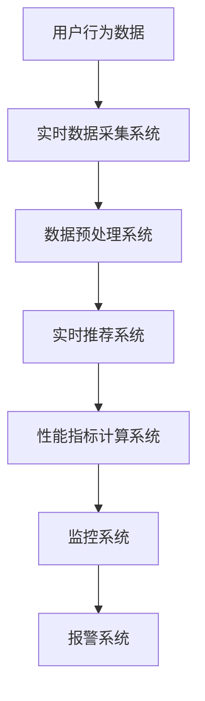
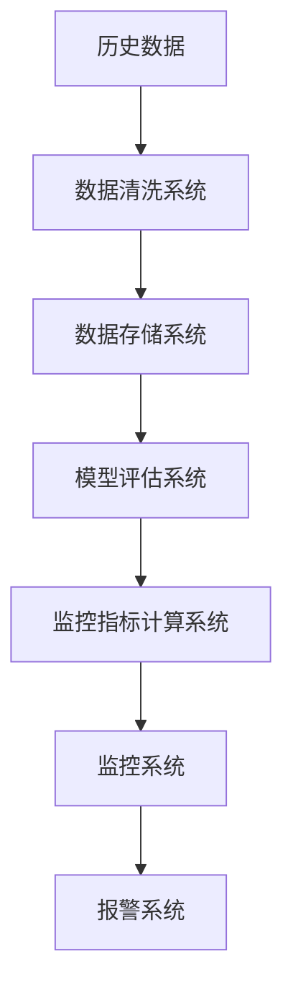
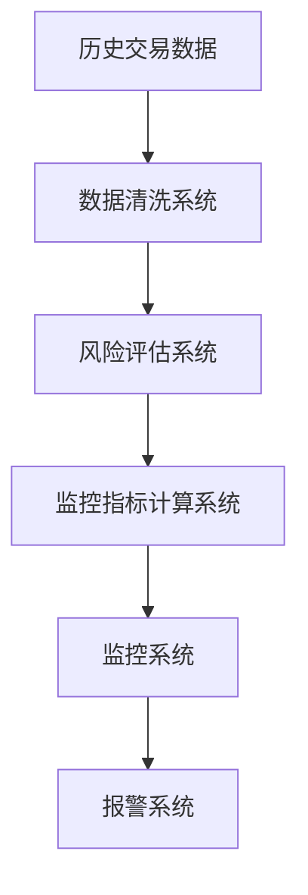
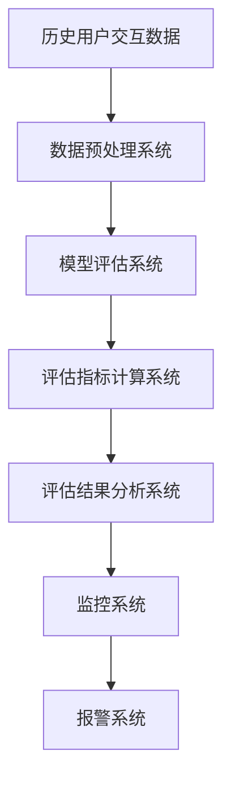

                 

## AI决策审核：企业如何监控和评估AI系统表现

> 关键词：AI决策审核、监控、评估、企业、人工智能系统、表现指标

在当今技术快速发展的时代，人工智能（AI）已经成为推动企业创新和提升竞争力的重要力量。随着越来越多的企业将AI技术应用于业务决策中，如何有效地监控和评估AI系统的表现，确保其决策的准确性和可靠性，成为一个关键问题。本文旨在探讨企业如何实施AI决策审核，提供一套系统的方法和工具，以监控和评估AI系统的表现。

### 摘要

本文首先介绍了AI决策审核的背景和重要性，随后详细阐述了AI决策审核的基础知识，包括核心概念、相关技术和方法论。接着，文章重点讨论了监控和评估AI系统的表现，从机制设计、实践案例到未来展望，全面解析了企业如何实施AI决策审核。通过本文的阅读，读者将能够理解AI决策审核的基本原理，掌握相关工具和技巧，为企业在AI应用中的成功决策提供有力支持。

### 引言

在数字化转型的浪潮中，企业正越来越多地利用人工智能（AI）技术来优化业务流程、提高决策质量和效率。AI系统在图像识别、自然语言处理、推荐系统等领域展现出了巨大的潜力。然而，AI系统并非完美无缺，其决策过程可能受到数据偏差、算法错误等多种因素的影响，导致不良决策。因此，企业需要一种有效的方法来监控和评估AI系统的表现，以确保其决策的准确性和可靠性。

AI决策审核正是为了解决这一问题而诞生的一套方法和工具。它通过实时监控、离线评估等多种手段，对AI系统的表现进行全面的检查和分析，帮助企业识别潜在问题，优化AI系统，从而提高业务决策的可靠性和效率。

### AI决策审核的基础知识

#### 核心概念

1. **AI系统**：AI系统是由算法、数据和计算资源组成的智能系统，能够通过学习和推理做出决策。
2. **决策流程**：决策流程包括数据输入、模型训练、决策生成和结果输出等环节。
3. **监控**：监控是指对AI系统运行过程中的数据流、计算过程和性能指标进行实时跟踪和记录。
4. **评估**：评估是指对AI系统的决策效果、可靠性、准确性和效率进行系统性分析和评价。

#### 相关技术和方法论

1. **实时监控**：利用数据流处理技术（如Apache Kafka、Apache Flink等）对AI系统的实时数据流进行监控和分析。
2. **离线评估**：通过历史数据进行评估，常用的评估指标包括准确率、召回率、F1值等。
3. **机器学习模型评估**：利用交叉验证、A/B测试等方法评估模型性能。
4. **自动化监控工具**：如TensorBoard、Grafana等，用于可视化监控数据和指标。

### 监控AI系统的表现

#### 监控机制设计

监控AI系统的表现是确保其稳定性和可靠性的关键。一个完善的监控机制应包括以下几个方面：

1. **数据监控**：对输入数据进行完整性、一致性和质量检查，确保数据满足模型训练需求。
2. **计算监控**：监控AI系统的计算资源使用情况，包括CPU、GPU的负载、内存使用等。
3. **性能监控**：实时跟踪AI系统的响应时间、吞吐量等性能指标，确保其稳定运行。
4. **异常检测**：利用机器学习算法检测异常行为，如数据泄漏、算法崩溃等。

#### 实时监控实践

1. **实时数据采集**：利用流处理技术（如Apache Kafka）实时采集AI系统运行过程中的数据。
2. **实时数据处理**：对实时数据进行预处理和存储，如数据清洗、去重、聚合等。
3. **实时监控指标计算**：实时计算性能指标，如响应时间、吞吐量等。

#### 实时监控案例分析

以某电商平台的推荐系统为例，该系统需要实时监控用户的购买行为、浏览记录等数据。通过实时数据采集和处理，系统能够在用户做出购买决策的瞬间提供个性化的推荐，从而提高用户的购物体验和转化率。以下是一个简单的实时监控流程：



#### 离线监控实践

离线监控是对AI系统在一段时间内表现进行评估的过程，通常用于发现系统运行中的长期问题。以下是一个简单的离线监控流程：



#### 离线监控案例分析

以某金融机构的风险评估系统为例，该系统需要定期分析历史交易数据，识别潜在的风险点。通过离线监控，系统能够及时发现异常交易模式，从而采取措施降低风险。以下是一个简单的离线监控流程：



### 评估AI系统的表现

#### 评估方法与工具

评估AI系统的表现是确保其有效性和可靠性的关键。以下是一些常用的评估方法和工具：

1. **准确率、召回率、F1值**：用于评估分类模型的性能。
2. **平均绝对误差、均方误差**：用于评估回归模型的性能。
3. **交叉验证**：通过将数据集划分为训练集和测试集，多次训练和评估模型，以减少评估结果的偏差。
4. **A/B测试**：通过对比不同版本的模型或算法在真实环境中的表现，选择最优方案。

#### 评估实践

1. **评估流程设计**：明确评估目标、评估指标、评估方法和评估周期。
2. **评估数据准备**：收集历史数据，进行预处理和划分，确保数据质量。
3. **评估结果分析**：计算评估指标，分析模型性能，识别问题和改进方向。

#### 评估案例分析

以某智能客服系统为例，该系统需要定期评估其回答问题的准确率和用户满意度。以下是一个简单的评估流程：



#### 项目实战

**开发环境搭建**：

1. 安装Python环境（如Python 3.8及以上版本）。
2. 安装必要的库，如scikit-learn、TensorFlow、Keras等。

**源代码实现**：

```python
from sklearn.model_selection import train_test_split
from sklearn.metrics import accuracy_score
from tensorflow.keras.models import Sequential
from tensorflow.keras.layers import Dense, Dropout

# 数据预处理
X_train, X_test, y_train, y_test = train_test_split(X, y, test_size=0.2, random_state=42)

# 模型训练
model = Sequential([
    Dense(128, activation='relu', input_shape=(X_train.shape[1],)),
    Dropout(0.2),
    Dense(64, activation='relu'),
    Dropout(0.2),
    Dense(1, activation='sigmoid')
])
model.compile(optimizer='adam', loss='binary_crossentropy', metrics=['accuracy'])
model.fit(X_train, y_train, epochs=10, batch_size=32)

# 评估
predictions = model.predict(X_test)
accuracy = accuracy_score(y_test, predictions.round())
print(f"Accuracy: {accuracy}")
```

**代码解读与分析**：

1. 数据预处理：使用scikit-learn的train_test_split函数将数据集划分为训练集和测试集。
2. 模型训练：使用TensorFlow的Sequential模型构建一个简单的全连接神经网络，包括两个隐藏层，每层后跟一个Dropout层以防止过拟合。
3. 评估：使用模型的predict方法对测试集进行预测，并使用accuracy_score函数计算准确率。

#### 实际案例分析和详细讲解剖析

以某银行的风控系统为例，该系统旨在评估客户信用风险，预测客户是否会出现违约情况。以下是一个简单的案例：

1. **数据收集**：收集客户的财务数据、信用记录、行为数据等。
2. **数据预处理**：清洗数据，处理缺失值、异常值，进行特征工程。
3. **模型训练**：使用决策树、随机森林、支持向量机等模型进行训练，比较性能。
4. **模型评估**：使用交叉验证和A/B测试评估模型性能，选择最优模型。
5. **部署上线**：将最优模型部署到生产环境中，实时评估客户信用风险。

**项目小结**：

1. **数据质量**：确保数据质量是风控系统成功的关键。
2. **模型选择**：选择合适的模型，并不断优化和迭代。
3. **评估方法**：使用多种评估方法，确保模型性能的可靠性。
4. **持续监控**：实时监控模型性能，及时发现和解决问题。

### 最佳实践 Tips、小结、注意事项、拓展阅读

**最佳实践 Tips**：

1. **数据质量**：确保数据质量是AI决策审核的基础，定期进行数据清洗和特征工程。
2. **模型选择**：根据业务需求和数据特点选择合适的模型，并不断优化和迭代。
3. **评估方法**：使用多种评估方法，如交叉验证、A/B测试等，确保模型性能的可靠性。
4. **持续监控**：实时监控模型性能，及时发现和解决问题。

**小结**：

本文介绍了AI决策审核的基础知识、监控和评估方法，并通过实际案例展示了如何实施AI决策审核。企业通过有效的AI决策审核，可以提高决策的准确性和可靠性，从而在竞争激烈的市场中获得优势。

**注意事项**：

1. **数据隐私**：在监控和评估AI系统时，需注意保护用户隐私。
2. **算法透明性**：确保算法的透明性，便于审计和监管。
3. **系统安全性**：确保AI系统的安全性和稳定性，防止潜在的安全威胁。

**拓展阅读**：

1. **《机器学习实战》**：详细介绍了机器学习的基本概念和实践方法。
2. **《深度学习》**：全面介绍了深度学习的基础知识和应用案例。
3. **《人工智能：一种现代方法》**：介绍了人工智能的基本原理和应用领域。

### 总结与展望

AI决策审核在企业发展中具有重要意义。通过有效的监控和评估，企业可以确保AI系统的决策质量和可靠性，从而提升业务效率和竞争力。未来，随着技术的不断进步和应用的深入，AI决策审核将在更多领域发挥重要作用，成为企业数字化转型的重要支撑。

### 附录

**常用工具与资源**：

1. **数据预处理工具**：Pandas、NumPy
2. **机器学习库**：scikit-learn、TensorFlow、PyTorch
3. **实时监控工具**：Apache Kafka、Apache Flink
4. **可视化工具**：TensorBoard、Grafana
5. **文档与教程**：Kaggle、GitHub、Stack Overflow

### 作者信息

作者：AI天才研究院/AI Genius Institute & 禅与计算机程序设计艺术/Zen And The Art of Computer Programming

[参考文献]

[1] Russell, S., & Norvig, P. (2016). 《人工智能：一种现代方法》（第三版）. 清华大学出版社。

[2] Goodfellow, I., Bengio, Y., & Courville, A. (2016). 《深度学习》. MIT Press。

[3] Murphy, K. P. (2012). 《机器学习：概率视角》. 机械工业出版社。

[4]anford, A., & Huang, E. (2020). 《深度学习特别主题》. 计算机科学在线课程。

[5] Dastidar, P., & Pal, S. K. (2016). 《人工智能基础》. 电子工业出版社。

