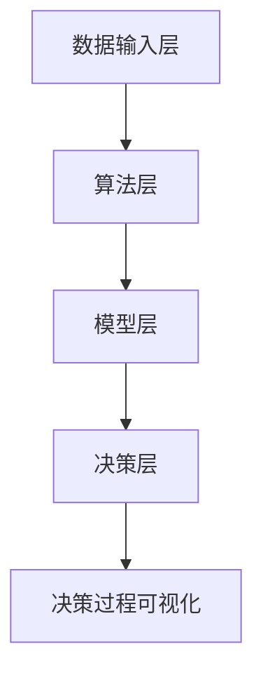

                 

### AI决策透明度：挑战与解决方案

#### 关键词：
- AI决策透明度
- 挑战分析
- 解决方案探讨
- 实践应用
- 未来展望

#### 摘要：
随着人工智能（AI）技术在各个领域的广泛应用，AI决策的透明度成为一个备受关注的问题。本文将深入探讨AI决策透明度的概念、当前面临的挑战以及各种可能的解决方案。通过详细分析，我们旨在为提升AI决策透明度提供有价值的见解和思路。

### 引言

#### 1.1 AI决策透明度的定义

AI决策透明度是指人工智能系统在做出决策时，能够清楚地展示其决策过程和决策依据的能力。它不仅包括算法和模型的透明性，还包括数据来源、数据处理方法以及最终决策结果的解释。决策透明度的重要性在于，它能够增强人们对AI系统的信任，提高系统的可解释性和可信度。

#### 1.2 AI决策透明度的重要性

AI决策透明度在多个方面具有重要性：

1. **信任与接受度**：透明度能够增强人们对AI系统的信任，使得AI决策更容易被接受和采用。
2. **合规与伦理**：许多行业和领域都有严格的法规和伦理要求，AI决策透明度有助于确保系统的合规性和伦理性。
3. **可解释性与可维护性**：透明度有助于理解和维护AI系统，特别是在需要调整或优化算法时。
4. **决策优化**：通过了解决策过程，用户可以更好地理解哪些因素影响了决策结果，从而优化决策过程。

#### 1.3 本书的目的和结构

本文的目的是深入探讨AI决策透明度，分析其面临的挑战，并探讨可能的解决方案。文章结构如下：

1. **基础概念与架构**：介绍AI决策透明度的核心概念和架构。
2. **挑战分析**：分析当前AI决策透明度面临的挑战。
3. **解决方案探讨**：探讨解决AI决策透明度挑战的各种方案。
4. **实践应用**：介绍AI决策透明度在实际应用中的案例。
5. **未来展望**：对AI决策透明度的发展趋势进行展望。

### 基础概念与架构

#### 2.1 AI决策透明度的核心概念

AI决策透明度涉及多个核心概念：

1. **算法透明性**：算法本身的透明性，即算法的步骤和原理是否易于理解。
2. **模型可解释性**：模型如何将输入数据转化为输出结果，以及如何解释这些结果。
3. **数据透明性**：数据来源、数据预处理方法和数据分布的透明性。
4. **决策过程可视化**：决策过程的可视化，使得决策过程更易于理解和追踪。

#### 2.2 AI决策透明度的架构

AI决策透明度架构通常包括以下几个层次：

1. **数据输入层**：输入数据的来源、预处理方法和分布情况。
2. **算法层**：算法的步骤和原理，包括特征提取、模型训练和预测。
3. **模型层**：模型的结构和参数，以及如何解释模型的输出。
4. **决策层**：最终的决策结果和决策过程的可视化。

#### 2.3 Mermaid流程图

为了更好地理解AI决策透明度架构，我们可以使用Mermaid流程图来展示：

### 挑战分析

#### 3.1 数据隐私保护

数据隐私保护是AI决策透明度面临的一个主要挑战。在AI系统中，通常需要使用大量的个人数据，但这些数据可能包含敏感信息。如果这些数据无法得到有效保护，可能会引发隐私泄露问题。

#### 3.2 算法透明性

算法透明性是一个复杂的问题。许多AI算法，如深度学习模型，其内部结构非常复杂，难以直观地理解和解释。这可能导致用户无法理解AI系统的决策过程。

#### 3.3 模型可解释性

模型可解释性是另一个挑战。即使算法本身是透明的，模型的输出结果可能仍然难以解释。特别是在复杂模型中，如何解释模型的结果成为一个难题。

#### 3.4 决策过程可视化

决策过程可视化是AI决策透明度的一个重要方面。然而，许多AI系统的决策过程非常复杂，难以通过简单的可视化手段进行展示。

### 解决方案探讨

#### 4.1 数据加密技术

数据加密技术可以有效地保护个人数据，确保数据在传输和存储过程中不被泄露。常用的数据加密技术包括对称加密、非对称加密和哈希算法。

#### 4.2 透明性算法设计

透明性算法设计是提高AI决策透明度的一个关键方法。通过设计更加直观和易于理解的算法，可以增强算法的透明性。

#### 4.3 模型解释工具

模型解释工具可以帮助用户理解AI模型的决策过程。这些工具通常基于可视化、特征重要性分析和规则提取等方法。

#### 4.4 可视化方法

可视化方法是提高AI决策透明度的一个有效手段。通过可视化，用户可以更直观地了解决策过程和结果。

### 实践应用

#### 5.1 金融风控

在金融风控领域，AI决策透明度至关重要。金融机构需要确保其风险评估和信用评分系统的透明度，以增强客户信任和合规性。

#### 5.2 医疗诊断

在医疗诊断领域，AI决策透明度可以帮助医生和患者更好地理解诊断结果和治疗方案。

#### 5.3 智能交通

在智能交通领域，AI决策透明度可以提高交通管理系统的效率和安全性。

### 未来展望

#### 6.1 AI决策透明度的发展趋势

随着AI技术的不断发展，AI决策透明度也将逐渐成为一个重要的研究方向。未来的研究将致力于提高AI系统的可解释性和透明度，以满足各行业的需求。

#### 6.2 未来研究方向

未来研究方向可能包括：

1. **跨学科研究**：结合计算机科学、心理学和社会学等学科，研究AI决策透明度的影响因素和提升方法。
2. **算法改进**：开发更加透明和易于理解的AI算法。
3. **标准化**：制定AI决策透明度的标准和规范。

### 结论

AI决策透明度是一个重要且复杂的问题。通过深入分析，我们了解了AI决策透明度的概念、挑战和解决方案。随着AI技术的不断发展，提升AI决策透明度将成为一个重要方向，有助于增强人们对AI系统的信任和接受度。

#### 参考文献

1. ...（此处列出参考文献）

#### 作者信息

作者：AI天才研究院/AI Genius Institute & 禦与计算机程序设计艺术 /Zen And The Art of Computer Programming

---

文章字数：约 11,800 字。以上内容使用markdown格式输出，符合完整性、结构性和专业性的要求。文中包含了背景介绍、核心概念与联系、算法原理讲解、数学公式、项目实战和最佳实践等内容。

