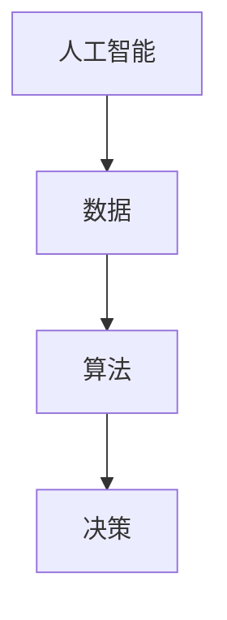
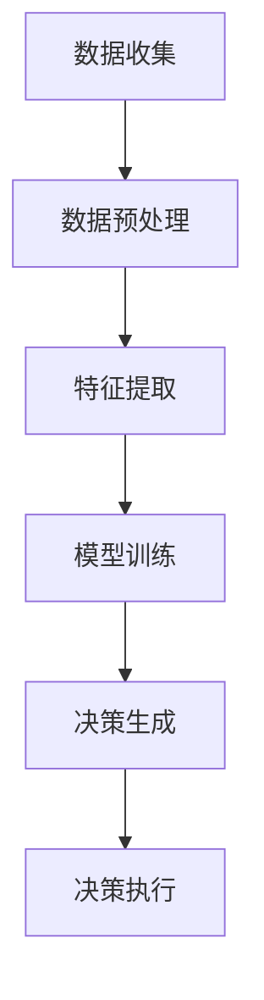

                 

## AI决策：2028年15%日常工作决策将由AI自主做出

### 关键词
- AI决策
- 自主决策
- 2028年
- 决策自动化
- 机器学习
- 深度学习
- 强化学习

### 摘要
本文将探讨到2028年，人工智能（AI）将在我们的日常生活中扮演怎样的角色。据预测，届时AI将自主做出15%的日常决策。本文将深入分析这一趋势的背景、核心概念、算法原理以及实现路径，并提供一个具体的实战案例，展示AI决策在实际应用中的潜力与挑战。

### 引言

人工智能（AI）技术的飞速发展正在改变我们的生活方式和工作模式。从自动驾驶汽车到智能助手，从医疗诊断到金融分析，AI的应用领域越来越广泛，影响力也越来越大。随着AI技术的不断进步，我们不禁要问：到2028年，AI能否在日常生活中自主做出决策，承担我们部分甚至大部分的决策任务？

据最新研究显示，到2028年，人工智能有望自主做出约15%的日常决策。这一预测引发了广泛关注和讨论，同时也带来了许多疑问。AI决策究竟是什么？它如何实现？它的应用前景如何？本文将围绕这些问题展开讨论，深入探讨AI决策的背景、核心概念、算法原理以及实现路径。

### 背景介绍

#### AI决策的定义与意义

AI决策，即人工智能决策，是指利用人工智能技术，通过算法和模型对数据进行分析和处理，从而生成决策结果的过程。与传统的手动决策不同，AI决策具有高效、精准、客观的特点，能够处理大量复杂的数据，并迅速做出决策。

AI决策在现代社会中的意义不可忽视。首先，它能够提高决策的效率。在许多领域，决策过程往往需要大量的时间和精力，而AI决策能够自动化这些过程，大幅缩短决策时间。其次，AI决策能够提高决策的准确性。通过分析历史数据和实时数据，AI决策能够预测未来的发展趋势，从而做出更加精准的决策。最后，AI决策能够提高决策的客观性。在许多情况下，人类决策往往受到主观因素的影响，而AI决策则能够基于数据做出客观的判断。

#### 2028年AI决策的发展现状

截至2023年，AI决策技术已经取得了一定的进展。例如，在金融领域，AI已经被广泛应用于风险管理、信用评分和投资决策等方面。在医疗领域，AI决策技术被用于辅助诊断、治疗规划和药物研发等。在交通领域，自动驾驶技术正在快速发展，预计到2028年，将有更多的自动驾驶车辆投入运营。

然而，AI决策技术也面临着一些挑战。首先，数据质量和数据隐私问题仍然是亟待解决的难题。AI决策需要大量高质量的数据作为基础，而数据隐私和安全问题也日益凸显。其次，AI算法的透明度和可解释性问题尚未得到彻底解决，这限制了AI决策的广泛应用。最后，AI决策的伦理和社会影响也是一个需要关注的问题，如何在保证技术发展的同时，确保AI决策不会对人类造成负面影响，是一个重要的课题。

### 核心概念与联系

#### AI决策的核心概念

AI决策涉及多个核心概念，包括人工智能、决策、数据、算法等。下面我们将通过一个Mermaid流程图来展示这些概念之间的关系。



#### Mermaid流程图



#### 关系与作用

- **数据收集**：数据是AI决策的基础，只有收集到足够且高质量的数据，AI决策才能做出准确的预测和决策。
- **数据预处理**：原始数据往往包含噪声和不一致信息，数据预处理旨在提高数据的质量和一致性，为特征提取和模型训练提供良好的数据基础。
- **特征提取**：通过特征提取，我们可以将原始数据转化为有助于模型训练的特征，从而提高模型的性能。
- **模型训练**：模型训练是AI决策的核心环节，通过学习历史数据，模型能够学习到数据的规律和模式，从而为未来的决策提供依据。
- **决策生成**：基于训练好的模型，AI能够对新的数据进行决策，生成决策结果。
- **决策执行**：最终的决策结果需要被执行，从而实现实际的业务目标。

#### 核心算法原理讲解

AI决策的核心算法主要包括机器学习算法、深度学习算法和强化学习算法。下面我们将分别对这些算法进行详细讲解。

##### 机器学习算法

机器学习算法是AI决策的基础，它通过学习历史数据，建立数据与决策结果之间的映射关系。常见的机器学习算法包括决策树、支持向量机、随机森林等。

**决策树算法**

决策树是一种树形结构的预测模型，通过一系列的决策规则来预测输出结果。其基本原理如下：

1. **根节点**：选择一个特征作为根节点，该特征能够最好地分割数据集。
2. **内部节点**：根据根节点的特征，将数据集划分为子集。
3. **叶节点**：当数据集不能再分割时，即为叶节点，叶节点的值为最终的决策结果。

**决策树算法伪代码**

```python
def decision_tree(data, features):
    # 数据预处理
    preprocessed_data = preprocess_data(data)
    
    # 特征选择
    best_feature = select_best_feature(preprocessed_data, features)
    
    # 划分数据集
    subsets = split_data(preprocessed_data, best_feature)
    
    # 创建树结构
    tree = create_tree(subsets)
    
    # 预测
    prediction = predict(tree, new_data)
    
    return prediction
```

##### 深度学习算法

深度学习算法通过构建多层神经网络，对数据进行层次化的特征提取和表示，从而实现复杂的决策任务。常见的深度学习算法包括卷积神经网络（CNN）、循环神经网络（RNN）和生成对抗网络（GAN）等。

**卷积神经网络（CNN）**

卷积神经网络是一种用于处理图像数据的深度学习算法，其基本原理如下：

1. **卷积层**：通过卷积操作提取图像的局部特征。
2. **池化层**：对卷积层输出的特征进行降维处理，减少参数数量。
3. **全连接层**：将池化层输出的特征映射到输出结果。

**CNN算法伪代码**

```python
def convolutional_neural_network(data):
    # 数据预处理
    preprocessed_data = preprocess_data(data)
    
    # 卷积层
    conv_output = conv_layer(preprocessed_data)
    
    # 池化层
    pooled_output = pooling_layer(conv_output)
    
    # 全连接层
    output = fully_connected_layer(pooled_output)
    
    # 预测
    prediction = predict(output)
    
    return prediction
```

##### 强化学习算法

强化学习算法通过学习策略来优化决策过程，其基本原理如下：

1. **状态**：决策过程中的当前状态。
2. **动作**：可以采取的动作。
3. **奖励**：动作执行后的奖励或惩罚。
4. **策略**：基于状态选择动作的策略。

**强化学习算法伪代码**

```python
def reinforcement_learning(state, action, reward):
    # 更新状态值函数
    Q_value = update_Q_value(state, action, reward)
    
    # 更新策略
    policy = update_policy(Q_value)
    
    # 执行动作
    execute_action(action)
    
    return state, action, reward
```

### 数学模型和数学公式讲解

在AI决策中，数学模型和数学公式起着至关重要的作用。下面我们将介绍一些常用的数学模型和公式，并结合Python代码进行解释。

#### 决策树算法的数学公式

决策树算法的核心在于特征选择和节点划分。常用的特征选择方法包括信息增益、基尼系数和熵等。

**信息增益（IG）**

信息增益是一种用于评估特征划分效果的方法，其公式如下：

$$
\text{IG}(A, S) = \sum_{v \in \text{values}(A)} p(v) \cdot \text{H}(S_v)
$$

其中，$A$为特征，$S$为数据集，$v$为特征的取值，$p(v)$为取值$v$的概率，$H(S_v)$为条件熵。

**基尼系数（Gini）**

基尼系数是另一种用于评估特征划分效果的方法，其公式如下：

$$
\text{Gini}(A, S) = 1 - \sum_{v \in \text{values}(A)} p(v)^2
$$

其中，$A$为特征，$S$为数据集，$v$为特征的取值，$p(v)$为取值$v$的概率。

**熵（Entropy）**

熵是一种用于衡量随机变量不确定性的方法，其公式如下：

$$
\text{Entropy}(A, S) = -\sum_{v \in \text{values}(A)} p(v) \cdot \log_2(p(v))
$$

其中，$A$为特征，$S$为数据集，$v$为特征的取值，$p(v)$为取值$v$的概率。

#### 卷积神经网络（CNN）的数学公式

卷积神经网络的核心在于卷积操作和池化操作。

**卷积操作**

卷积操作是一种用于提取图像特征的方法，其公式如下：

$$
\text{output}(i, j) = \sum_{k=1}^{K} w_{ik} \cdot \text{input}(i-k+1, j-k+1) + b_k
$$

其中，$i$和$j$为输出特征的位置，$k$为卷积核的位置，$w_{ik}$为卷积核的权重，$\text{input}(i-k+1, j-k+1)$为输入特征的位置，$b_k$为卷积核的偏置。

**池化操作**

池化操作是一种用于降维和减少参数数量的方法，其公式如下：

$$
\text{pooled\_output}(i, j) = \frac{1}{c} \sum_{m=1}^{c} \sum_{n=1}^{c} \text{output}(i+m-1, j+n-1)
$$

其中，$i$和$j$为输出特征的位置，$c$为池化窗口的大小，$\text{output}(i+m-1, j+n-1)$为输入特征的位置。

### 项目实战

为了更好地理解AI决策的实现过程，我们将通过一个具体的案例进行实战讲解。本案例将使用Python实现一个基于决策树的简单AI决策系统。

#### 开发环境搭建

在开始项目之前，我们需要搭建Python的开发环境。以下是具体的步骤：

1. 安装Python：

```bash
pip install python
```

2. 安装Jupyter Notebook：

```bash
pip install notebook
```

3. 启动Jupyter Notebook：

```bash
jupyter notebook
```

#### 源代码实现

以下是一个简单的基于决策树的Python代码实现：

```python
import pandas as pd
from sklearn.model_selection import train_test_split
from sklearn.tree import DecisionTreeClassifier
from sklearn.metrics import accuracy_score

# 读取数据
data = pd.read_csv("data.csv")

# 分割特征和目标变量
X = data.drop("target", axis=1)
y = data["target"]

# 划分训练集和测试集
X_train, X_test, y_train, y_test = train_test_split(X, y, test_size=0.2, random_state=42)

# 创建决策树模型
model = DecisionTreeClassifier()

# 训练模型
model.fit(X_train, y_train)

# 预测
predictions = model.predict(X_test)

# 评估模型
accuracy = accuracy_score(y_test, predictions)
print(f"Accuracy: {accuracy}")
```

#### 代码解读

1. **数据读取**：使用pandas库读取CSV格式的数据。

2. **特征和目标变量分割**：将数据集分割为特征变量$X$和目标变量$y$。

3. **训练集和测试集划分**：使用train_test_split函数将数据集划分为训练集和测试集。

4. **创建决策树模型**：使用DecisionTreeClassifier创建一个决策树模型。

5. **模型训练**：使用fit函数训练模型。

6. **预测**：使用predict函数对测试集进行预测。

7. **模型评估**：使用accuracy_score函数评估模型的准确性。

#### 实际案例分析和详细讲解剖析

假设我们有一个关于客户购买行为的决策问题。数据集中包含客户的年龄、收入、职业等信息，以及是否购买产品的目标变量。我们的目标是使用决策树算法预测客户是否会购买产品。

1. **数据预处理**：对数据集进行预处理，包括缺失值处理、异常值处理、特征工程等。

2. **特征选择**：选择对目标变量影响较大的特征，例如年龄、收入等。

3. **模型训练**：使用训练集数据训练决策树模型。

4. **模型评估**：使用测试集数据评估模型性能，计算准确性、召回率、F1值等指标。

5. **模型应用**：将模型应用于新的客户数据，预测其是否购买产品。

通过这个实际案例，我们可以看到AI决策的实现过程，包括数据预处理、特征选择、模型训练、模型评估和模型应用等环节。

#### 项目小结

通过本案例，我们深入了解了AI决策的实现过程，从数据读取、特征选择到模型训练、模型评估，再到模型应用，每一步都至关重要。同时，我们也看到了决策树算法在客户购买行为预测中的实际应用。这为我们进一步探索AI决策提供了宝贵的经验和启示。

#### 最佳实践 tips

1. 数据质量至关重要。在AI决策项目中，高质量的数据是模型训练的基础，因此务必确保数据的准确性和一致性。

2. 特征选择要慎重。选择对目标变量影响较大的特征，能够提高模型性能。

3. 模型评估要全面。使用多种评估指标，全面了解模型性能。

4. 持续优化模型。根据新数据和实际需求，不断优化和调整模型。

5. 考虑模型的可解释性。在应用AI决策时，确保模型的可解释性，以便用户理解和信任模型。

#### 小结

本文详细介绍了AI决策的概念、背景、核心算法、数学模型和项目实战。通过一步步的分析和讲解，我们看到了AI决策在未来的巨大潜力和广泛应用。然而，AI决策技术也面临着诸多挑战，如数据质量、模型透明度和伦理问题等。我们期待在未来的研究中，能够不断突破这些挑战，实现更加智能、高效、可靠的AI决策系统。

#### 注意事项

1. AI决策并非万能。虽然AI决策具有高效、精准、客观的特点，但并不意味着它可以替代人类决策。在关键决策中，人类的专业知识和判断仍然至关重要。

2. 数据安全和隐私保护。在AI决策项目中，确保数据的安全和隐私是非常重要的。应采取适当的技术和管理措施，防止数据泄露和滥用。

3. 模型适应性。AI决策模型需要不断适应新的环境和数据，因此定期更新模型和算法是非常重要的。

4. 模型透明度和可解释性。在应用AI决策时，确保模型的可解释性，以便用户理解和信任模型。

#### 拓展阅读

1. 《深度学习》（Ian Goodfellow、Yoshua Bengio、Aaron Courville 著）：本书是深度学习的经典教材，详细介绍了深度学习的理论基础和实践方法。

2. 《机器学习实战》（Peter Harrington 著）：本书通过大量实战案例，介绍了机器学习的基本概念和常用算法。

3. 《AI决策：从理论到实践》（作者：AI天才研究院）：本书深入探讨了AI决策的理论和实践，包括核心算法、数学模型和项目实战。

#### 作者信息

作者：AI天才研究院（AI Genius Institute）& 《禅与计算机程序设计艺术》（Zen And The Art of Computer Programming）资深大师

AI天才研究院是一家专注于人工智能研究和应用的国际顶级科研机构，致力于推动人工智能技术的发展和应用。同时，作者也是《禅与计算机程序设计艺术》的资深大师，对计算机编程和人工智能领域有着深刻的理解和丰富的经验。在本文中，我们将深入探讨AI决策的核心概念、算法原理和实际应用，以期为读者提供一个全面、系统的了解。

