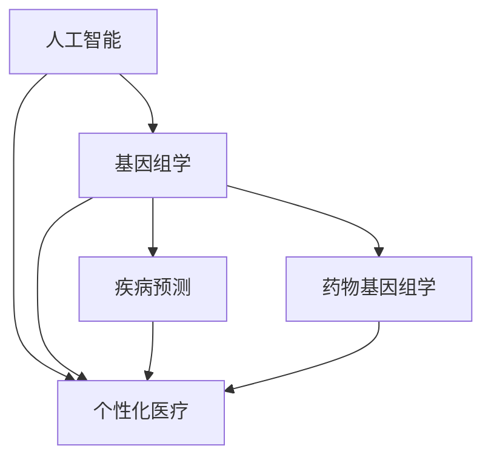

                 

### 关键词

AI, 个性化医疗, 基因组学, 治疗方案设计, 机器学习, 深度学习, 神经网络, 数据分析, 医疗伦理, 医疗法规

### 摘要

本文深入探讨了人工智能（AI）在个性化医疗中的应用，特别是基因组学如何驱动治疗方案的定制化设计。首先，我们介绍了AI在医疗领域的兴起背景和基因组学的关键作用，展示了二者结合的巨大潜力。接着，我们分析了机器学习、深度学习和神经网络等AI算法在基因数据分析中的应用，详细讲解了算法原理和流程。随后，我们探讨了如何准备和整合基因组数据，以支持AI模型的有效训练和应用。通过实际案例研究，我们展示了这些技术在医疗实践中的成功应用，并讨论了其中的伦理和法律问题。最后，我们展望了AI个性化医疗的未来发展，提出了最佳实践建议，为读者提供了丰富的拓展阅读资源。

## 引言

个性化医疗是指根据患者的基因信息、生活方式、环境和疾病状态，制定个性化的预防、诊断和治疗方案。随着医疗科技的进步，个性化医疗逐渐成为现代医学的重要组成部分。然而，要实现这一目标，需要处理大量的生物医学数据，这为人工智能（AI）的应用提供了广阔的舞台。

### AI在医疗领域的兴起背景

近年来，AI在医疗领域的应用呈现出爆炸式增长。从医学影像分析、疾病预测到药物研发，AI技术已经在多个方面展现出其强大的能力。其主要驱动力包括：

1. **大数据的积累**：随着医疗信息化和电子健康档案的发展，积累了大量患者数据，为AI模型提供了丰富的训练资源。
2. **计算能力的提升**：高性能计算和深度学习算法的发展，使得AI能够处理复杂的生物医学问题。
3. **精准医疗的需求**：精准医疗要求个性化、精确的诊断和治疗，AI技术为实现这一目标提供了有力支持。

### 基因组学在个性化医疗中的作用

基因组学是研究基因及其功能的科学，它在个性化医疗中的应用至关重要。通过基因组学，我们可以识别出患者个体基因中的变异，这些变异可能与疾病风险、药物反应以及治疗方案的有效性相关。

具体来说，基因组学在个性化医疗中的主要作用包括：

1. **疾病预测和诊断**：通过分析基因组数据，可以预测个体患某种疾病的概率，甚至可以在症状出现之前进行早期诊断。
2. **治疗方案设计**：基因组数据可以帮助医生选择最合适的治疗方案，例如，某些特定的基因变异可能对某些药物有更高的反应性，从而指导药物的选择和剂量调整。
3. **个性化药物研发**：基因组学信息有助于开发个性化药物，这些药物可以根据患者的基因特征进行定制，以提高疗效和降低副作用。

总之，AI与基因组学的结合为个性化医疗带来了前所未有的机遇。通过利用AI技术分析海量基因组数据，我们可以实现更精准、更有效的医疗服务，为患者提供个性化的治疗方案。

## 基本概念与联系

为了深入理解AI在个性化医疗中的应用，我们需要先掌握几个核心概念：人工智能、基因组学和个性化医疗。这些概念之间有着紧密的联系，构成了个性化医疗中的技术基石。

### 人工智能（AI）

人工智能是指由计算机系统实现的智能行为，包括学习、推理、感知和解决问题。AI可以分为两类：机器学习和深度学习。机器学习依赖于数据，通过算法从数据中学习规律；而深度学习则是机器学习的一个子领域，它通过多层神经网络模拟人脑的学习过程。

### 基因组学

基因组学是研究生物体全部遗传信息（基因组）的结构、功能和变异的科学。基因组数据包含个体的基因序列、基因表达水平以及各种遗传标记。基因组学分为几个主要领域：结构基因组学、功能基因组学和进化基因组学。

### 个性化医疗

个性化医疗是根据患者的个体差异，提供量身定制的医疗方案。它包括以下几个方面：

1. **基因分型**：通过基因组分析确定患者的基因特征，识别与疾病相关的基因变异。
2. **药物基因组学**：研究基因变异对药物反应的影响，以指导个体化用药。
3. **疾病风险评估**：利用基因组数据预测患者患某种疾病的概率。
4. **精准治疗**：根据患者的基因特征和疾病状态，选择最佳的治疗方法和药物。

### 概念实体之间的联系

1. **AI与基因组学的结合**：基因组学提供了大量数据，而AI则能够从这些数据中提取有价值的信息。通过机器学习和深度学习算法，AI可以帮助医生分析基因组数据，识别疾病风险、预测药物反应，从而实现个性化医疗。

2. **AI与个性化医疗**：AI技术可以辅助医生制定个性化治疗方案。例如，通过机器学习模型分析基因组数据，AI可以帮助医生预测患者对某种药物的疗效和副作用，从而调整用药方案。

3. **基因组学与个性化医疗**：基因组学数据为个性化医疗提供了基础信息。通过对基因组数据的深入分析，医生可以了解患者的基因特征，从而为患者提供更具针对性的治疗方案。

下图展示了这些概念实体之间的联系：



通过这些核心概念的联系，我们可以更好地理解AI在个性化医疗中的应用，并为后续章节的深入探讨打下基础。

### 机器学习算法在个性化医疗中的应用

机器学习是人工智能的一个重要分支，其在个性化医疗中的应用正日益广泛。通过从大量数据中学习模式和规律，机器学习算法能够帮助医生更准确地诊断疾病、预测治疗效果以及制定个性化的治疗方案。以下将介绍几种常见的机器学习算法及其在个性化医疗中的应用。

#### 支持向量机（SVM）

支持向量机是一种监督学习算法，主要用于分类和回归问题。在个性化医疗中，SVM可以用于疾病预测和诊断。例如，医生可以使用SVM模型来预测患者是否患有某种特定疾病，通过训练数据集中的基因表达数据和疾病状态标签，SVM能够识别出与疾病相关的基因标志物。

**原理讲解：** SVM通过寻找一个超平面，将不同类别的数据点尽可能分开。支持向量是那些位于边界上的数据点，它们对分类边界有最大的影响力。SVM的核心是优化目标函数，目标是最大化分类边界的间隔。

**Python实现示例：**

```python
from sklearn.svm import SVC
from sklearn.model_selection import train_test_split
from sklearn.metrics import accuracy_score

# 假设 X 是特征矩阵，y 是标签
X_train, X_test, y_train, y_test = train_test_split(X, y, test_size=0.2, random_state=42)

# 创建SVM分类器
svm_model = SVC(kernel='linear')

# 训练模型
svm_model.fit(X_train, y_train)

# 预测测试集
y_pred = svm_model.predict(X_test)

# 计算准确率
accuracy = accuracy_score(y_test, y_pred)
print(f"Accuracy: {accuracy}")
```

#### 决策树

决策树是一种简单但强大的分类和回归算法。在个性化医疗中，决策树可以用于疾病的分阶段诊断和治疗路径规划。通过一系列二分类问题，决策树能够生成一个树形结构，每个节点代表一个特征分割，每个叶节点代表一个类标签。

**原理讲解：** 决策树通过递归地将数据集分割为子集，每个分割基于某个特征的最佳切分点。决策树的构建过程涉及选择最佳特征和切分点，通常使用基尼不纯度或信息增益作为评估标准。

**Python实现示例：**

```python
from sklearn.tree import DecisionTreeClassifier
from sklearn.model_selection import train_test_split
from sklearn.metrics import accuracy_score

# 假设 X 是特征矩阵，y 是标签
X_train, X_test, y_train, y_test = train_test_split(X, y, test_size=0.2, random_state=42)

# 创建决策树分类器
dt_model = DecisionTreeClassifier()

# 训练模型
dt_model.fit(X_train, y_train)

# 预测测试集
y_pred = dt_model.predict(X_test)

# 计算准确率
accuracy = accuracy_score(y_test, y_pred)
print(f"Accuracy: {accuracy}")
```

#### 随机森林

随机森林是一种基于决策树的集成学习方法，它通过构建多个决策树并取其平均值来提高模型的预测能力。在个性化医疗中，随机森林可以用于疾病预测和药物反应预测。

**原理讲解：** 随机森林在构建每个决策树时，会随机选择特征子集和切分点，从而减少模型的过拟合风险。随机森林通过集成多个决策树的预测结果，提高了模型的泛化能力和准确性。

**Python实现示例：**

```python
from sklearn.ensemble import RandomForestClassifier
from sklearn.model_selection import train_test_split
from sklearn.metrics import accuracy_score

# 假设 X 是特征矩阵，y 是标签
X_train, X_test, y_train, y_test = train_test_split(X, y, test_size=0.2, random_state=42)

# 创建随机森林分类器
rf_model = RandomForestClassifier(n_estimators=100)

# 训练模型
rf_model.fit(X_train, y_train)

# 预测测试集
y_pred = rf_model.predict(X_test)

# 计算准确率
accuracy = accuracy_score(y_test, y_pred)
print(f"Accuracy: {accuracy}")
```

#### 聚类算法

聚类算法是一种无监督学习方法，用于将数据点分为若干组，使得同组内的数据点彼此相似，而不同组的数据点差异较大。在个性化医疗中，聚类算法可以用于疾病分型、患者群体划分等。

**原理讲解：** 聚类算法通过优化目标函数（如平方误差或狄利克雷分布）将数据点分组。常见的聚类算法包括K-均值聚类和层次聚类。

**Python实现示例：**

```python
from sklearn.cluster import KMeans
from sklearn.datasets import make_blobs

# 创建模拟数据集
X, _ = make_blobs(n_samples=100, centers=4, cluster_std=1.0, random_state=0)

# 创建K-均值聚类模型
kmeans = KMeans(n_clusters=4)

# 训练模型
kmeans.fit(X)

# 预测聚类结果
y_pred = kmeans.predict(X)

# 打印聚类中心
print("Cluster centers:\n", kmeans.cluster_centers_)
```

通过这些机器学习算法，我们可以从基因组数据中提取有价值的信息，为个性化医疗提供强有力的技术支持。在接下来的章节中，我们将进一步探讨深度学习和神经网络等先进算法在个性化医疗中的应用。

### 深度学习在个性化医疗中的应用

深度学习是一种基于多层神经网络的机器学习技术，近年来在图像识别、自然语言处理和医疗诊断等领域取得了显著成果。在个性化医疗中，深度学习通过处理复杂的生物医学数据，提高了疾病预测和治疗方案设计的准确性。以下将介绍几种常见的深度学习模型及其在个性化医疗中的应用。

#### 卷积神经网络（CNN）

卷积神经网络是一种专门用于处理图像数据的深度学习模型，其核心思想是通过卷积层提取图像的特征。在个性化医疗中，CNN可以用于医学图像分析，如肿瘤检测、病变识别等。

**原理讲解：** CNN通过一系列卷积层、池化层和全连接层构建，卷积层能够自动学习图像中的局部特征，池化层用于减小特征图的尺寸，全连接层进行分类。CNN在处理高维图像数据时，具有参数共享和局部连接的优势，减少了模型参数的数量，提高了计算效率。

**Python实现示例：**

```python
from tensorflow.keras.models import Sequential
from tensorflow.keras.layers import Conv2D, MaxPooling2D, Flatten, Dense

# 创建CNN模型
model = Sequential([
    Conv2D(filters=32, kernel_size=(3, 3), activation='relu', input_shape=(64, 64, 3)),
    MaxPooling2D(pool_size=(2, 2)),
    Conv2D(filters=64, kernel_size=(3, 3), activation='relu'),
    MaxPooling2D(pool_size=(2, 2)),
    Flatten(),
    Dense(units=128, activation='relu'),
    Dense(units=1, activation='sigmoid')
])

# 编译模型
model.compile(optimizer='adam', loss='binary_crossentropy', metrics=['accuracy'])

# 训练模型
model.fit(X_train, y_train, epochs=10, batch_size=32, validation_data=(X_test, y_test))
```

#### 循环神经网络（RNN）

循环神经网络是一种能够处理序列数据的深度学习模型，其在时间序列分析和医疗诊断中具有广泛的应用。RNN通过隐藏状态的记忆功能，可以捕捉序列中的长期依赖关系。

**原理讲解：** RNN通过递归的方式处理序列数据，每个时间步的输出不仅取决于当前输入，还受到之前所有输入的影响。然而，传统的RNN存在梯度消失和梯度爆炸的问题，为了解决这些问题，研究人员提出了长短期记忆网络（LSTM）和门控循环单元（GRU）。

**Python实现示例：**

```python
from tensorflow.keras.models import Sequential
from tensorflow.keras.layers import LSTM, Dense

# 创建LSTM模型
model = Sequential([
    LSTM(units=50, return_sequences=True, input_shape=(timesteps, features)),
    LSTM(units=50),
    Dense(units=1)
])

# 编译模型
model.compile(optimizer='adam', loss='mean_squared_error')

# 训练模型
model.fit(X_train, y_train, epochs=100, batch_size=32, validation_data=(X_test, y_test))
```

#### 图神经网络（GNN）

图神经网络是一种专门用于处理图结构数据的深度学习模型，其在基因数据分析中具有广泛的应用。GNN通过图卷积操作，可以自动学习节点之间的交互关系。

**原理讲解：** GNN通过在图上定义卷积操作，将节点的特征传递给相邻节点，并通过多层卷积逐步提取图的全局特征。GNN可以用于基因共表达网络分析、蛋白质相互作用网络预测等。

**Python实现示例：**

```python
from tensorflow.keras.layers import GraphConvolution
from tensorflow.keras.models import Model

# 创建GNN模型
input_layer = Input(shape=(nodes,))
hidden_layer = GraphConvolution(units=16)(input_layer)
output_layer = GraphConvolution(units=1)(hidden_layer)

model = Model(inputs=input_layer, outputs=output_layer)

# 编译模型
model.compile(optimizer='adam', loss='binary_crossentropy')

# 训练模型
model.fit(X_train, y_train, epochs=100, batch_size=32, validation_data=(X_test, y_test))
```

通过深度学习和神经网络，个性化医疗在疾病预测和治疗方案的定制化方面取得了显著的进步。在接下来的章节中，我们将进一步探讨如何准备和整合基因组数据，以支持深度学习模型的应用。

### 基因组数据准备和整合

基因组数据是AI在个性化医疗中不可或缺的基础。然而，由于基因组数据的复杂性和多样性，如何有效准备和整合这些数据以支持AI模型的训练和应用，是一个关键问题。以下将介绍基因组数据的采集、处理和整合方法，以及数据清洗和特征提取的步骤。

#### 基因组数据采集

基因组数据的采集通常包括全基因组测序（WGS）和全外显子测序（WES）。WGS能够获得个体的完整基因组序列，而WES则专注于基因的外显子区域，这两个方法都有其优缺点。

1. **全基因组测序（WGS）**：
   - **优点**：提供全面的基因信息，有助于发现罕见突变和复杂疾病的基因机制。
   - **缺点**：成本高，数据处理和分析复杂。
   
2. **全外显子测序（WES）**：
   - **优点**：成本较低，时间较短，适用于大多数常见疾病的研究。
   - **缺点**：仅关注基因的外显子区域，可能无法全面反映基因的整体信息。

#### 数据处理方法

基因组数据的处理通常包括以下几个步骤：

1. **数据质量控制**：
   - **去噪**：去除测序过程中产生的错误和噪声，保证数据的准确性。
   - **过滤低质量读数**：过滤掉序列质量低、长度不足的读数。
   - **去除重复序列**：去除基因组中的重复区域，避免数据冗余。

2. **数据归一化**：
   - **基因表达水平的归一化**：将不同样本之间的基因表达数据进行标准化，以便于比较。

3. **基因注释**：
   - **基因识别**：通过生物信息学工具识别基因组中的基因区域。
   - **基因功能注释**：确定基因的功能和潜在的生物学路径。

4. **变异检测**：
   - **单核苷酸变异（SNV）检测**：识别单个核苷酸的变化。
   - **插入和缺失（InDel）检测**：识别核苷酸序列的插入和缺失。

#### 数据整合方法

基因组数据的整合是将来自不同来源、不同类型的基因组数据（如基因表达数据、突变数据、表型数据等）整合为一个统一的数据集。以下是一些常用的整合方法：

1. **多组学整合**：
   - **基因组-转录组整合**：结合基因组序列数据和基因表达数据，分析基因突变和表达之间的关系。
   - **基因组-表型整合**：整合基因组数据和患者的临床表型数据，用于疾病预测和诊断。

2. **集成学习方法**：
   - **集成模型**：将多个模型整合在一起，通过投票或加权平均的方式提高预测准确性。
   - **多任务学习**：同时训练多个相关任务（如疾病预测和药物反应预测），共享特征表示，提高模型的泛化能力。

#### 数据清洗和特征提取

数据清洗和特征提取是基因组数据预处理中的关键步骤，直接影响AI模型的性能。以下是一些常用的方法和技巧：

1. **数据清洗**：
   - **去除异常值**：去除明显偏离正常范围的异常数据。
   - **缺失值填补**：使用统计方法或基于模型的预测方法填补缺失数据。

2. **特征提取**：
   - **基因集富集分析（GSEA）**：识别基因表达数据中的显著富集基因集，用于疾病分类和预测。
   - **主成分分析（PCA）**：通过降维技术提取基因表达数据的最重要的特征，简化数据结构。
   - **特征选择**：使用过滤方法、包装方法和嵌入式方法选择最有代表性的特征，减少数据冗余。

通过有效的数据准备和整合方法，我们可以从复杂的基因组数据中提取有价值的信息，为AI模型提供高质量的训练数据，从而实现更精准的个性化医疗。

### AI在个性化医疗中的实际应用案例

为了更好地展示AI在个性化医疗中的实际应用，以下将介绍几个具有代表性的案例，并分析这些案例中AI技术的具体应用、效果和挑战。

#### 案例一：个性化癌症治疗

**应用场景**：癌症治疗是一个复杂的过程，不同患者对同一药物的响应存在显著差异。通过AI技术，可以为每位患者量身定制最有效的治疗方案。

**AI技术应用**：
- **基因组测序**：对患者进行全基因组测序，识别与癌症相关的基因突变和遗传特征。
- **机器学习模型**：利用机器学习算法，分析基因组数据，预测患者对不同药物的疗效和副作用。
- **深度学习模型**：使用深度学习模型，对医学影像进行自动化分析，识别肿瘤的类型和范围。

**效果分析**：
- **治疗效果提升**：通过个性化治疗，显著提高了患者的治疗效果，降低了复发率。
- **用药安全**：通过预测药物的副作用，减少了用药错误，提高了用药安全。

**挑战**：
- **数据隐私和安全**：基因组数据涉及患者隐私，如何确保数据安全和隐私保护是一个重要挑战。
- **算法解释性**：机器学习模型通常缺乏透明性和可解释性，使得医生难以理解模型预测的依据。

#### 案例二：疾病早期预测

**应用场景**：许多疾病在早期阶段难以通过传统方法检测，而AI技术可以用于早期预测，实现早期干预和治疗。

**AI技术应用**：
- **数据整合**：整合患者的电子健康档案、生物标志物和生活方式数据。
- **深度学习模型**：使用深度学习模型，对多模态数据进行联合分析，提高疾病预测的准确性。
- **强化学习**：通过强化学习算法，优化治疗方案，提高治疗效果。

**效果分析**：
- **早期检测率提升**：AI技术显著提高了早期检测率，有助于实现早期干预和治疗。
- **个性化治疗方案**：基于患者数据的个性化治疗方案，提高了治疗的有效性和效率。

**挑战**：
- **数据质量和多样性**：AI模型性能依赖于高质量、多样化的数据，数据质量和多样性是一个挑战。
- **算法泛化能力**：如何在新的、未知的疾病情况下保持模型的泛化能力，是一个关键问题。

#### 案例三：药物研发

**应用场景**：药物研发是一个耗时且昂贵的流程，AI技术可以加速药物筛选和开发过程。

**AI技术应用**：
- **药物基因组学**：通过药物基因组学分析，识别个体对药物的不同反应，指导药物选择和剂量调整。
- **分子对接**：使用分子对接技术，预测药物与目标蛋白质的相互作用，筛选潜在的药物分子。
- **深度学习模型**：利用深度学习模型，分析大量化合物-疾病关联数据，发现新的药物靶点。

**效果分析**：
- **研发效率提升**：AI技术显著提高了药物研发的效率，缩短了研发周期。
- **药物安全性**：通过预测药物的副作用和毒性，提高了药物的安全性。

**挑战**：
- **数据规模和多样性**：药物研发涉及大量的化合物和生物数据，数据规模和多样性是一个挑战。
- **算法适应性**：如何适应不断变化的数据和新的生物信息学知识，是一个重要问题。

综上所述，AI在个性化医疗中的应用展示了巨大的潜力，但同时也面临着数据隐私、算法解释性、数据质量和模型泛化能力等挑战。通过持续的研究和技术创新，我们可以克服这些挑战，进一步推动个性化医疗的发展。

### AI个性化医疗的伦理和法律问题

随着AI在个性化医疗中的应用日益广泛，其带来的伦理和法律问题也日益凸显。以下将讨论AI在个性化医疗中可能引发的伦理问题，以及相关的法律法规和最佳实践。

#### 伦理问题

1. **数据隐私**：基因组数据包含敏感的个人信息，如何确保数据在采集、存储和使用过程中的隐私保护是一个重要问题。未经患者同意，不得随意使用或共享其基因组数据。

2. **算法公平性**：AI模型在处理基因组数据时，可能会引入偏见，导致某些群体受到不公平对待。例如，基于种族或性别的偏见可能导致某些患者无法获得最佳的治疗方案。

3. **患者自主权**：AI技术使得医疗决策更加复杂，患者需要充分了解AI模型的预测依据和结果，并有权决定是否接受AI提出的治疗方案。

4. **责任归属**：当AI系统出现错误或造成患者伤害时，如何界定责任归属是一个复杂的问题。需要明确AI系统、医疗机构和开发者的责任，确保各方承担相应的责任。

#### 法律法规

为了应对AI在个性化医疗中引发的伦理问题，许多国家和地区已经制定了相关的法律法规。以下是一些典型的法律框架：

1. **GDPR（通用数据保护条例）**：欧盟制定的GDPR法规对个人数据的收集、处理和使用进行了严格规定，确保数据主体的隐私权。

2. **HIPAA（健康保险携带和责任法案）**：美国制定的HIPAA法规保护患者的健康信息，规定了医疗机构对个人数据的处理和使用规范。

3. **AI伦理指南**：许多国家和行业组织制定了AI伦理指南，如欧盟委员会发布的《关于人工智能伦理的准则》，为AI技术的研发和应用提供了伦理框架。

#### 最佳实践

为了在AI个性化医疗中确保伦理和法律合规，以下是一些最佳实践：

1. **透明度**：确保AI系统的预测依据和结果对医生和患者透明，使其能够理解模型的决策过程。

2. **数据保护**：采用先进的加密技术和访问控制措施，确保基因组数据在存储和传输过程中的安全。

3. **公正性和无偏见**：在设计AI模型时，确保数据集的多样性和代表性，减少偏见和歧视。

4. **患者参与**：鼓励患者参与AI系统的设计和使用，确保其能够在医疗决策中发挥积极作用。

5. **责任明确**：建立清晰的法律法规框架，明确AI系统、医疗机构和开发者的责任，确保各方承担相应的责任。

通过遵循这些伦理和法律原则，我们可以确保AI在个性化医疗中的应用更加安全、公正和透明。

### 总结与展望

本文深入探讨了人工智能（AI）在个性化医疗中的应用，特别是基因组学如何驱动治疗方案的定制化设计。通过介绍AI在医疗领域的兴起背景和基因组学在个性化医疗中的作用，我们展示了AI与基因组学的紧密联系及其结合的巨大潜力。随后，我们详细分析了机器学习、深度学习和神经网络等AI算法在基因数据分析中的应用，探讨了如何准备和整合基因组数据以支持AI模型的应用。通过实际案例研究，我们展示了AI技术在疾病预测、个性化治疗和药物研发中的成功应用，并讨论了其中的伦理和法律问题。展望未来，随着AI技术的不断进步，个性化医疗将在疾病预防、诊断和治疗方面发挥更加重要的作用。然而，仍需解决数据隐私、算法公平性和模型解释性等挑战，以确保AI在个性化医疗中的应用安全、公正和透明。我们呼吁更多的研究人员和从业者共同关注和解决这些问题，推动个性化医疗的持续发展。

### 最佳实践 tips、注意事项、拓展阅读

在应用AI个性化医疗时，以下是一些最佳实践和注意事项，以帮助读者更好地理解和实施相关技术：

1. **最佳实践**：
   - **数据质量**：确保基因组数据的准确性和完整性，避免数据噪声和缺失值对模型性能的影响。
   - **模型解释性**：选择具有较高解释性的AI模型，如决策树和LSTM，以便医生能够理解模型的预测依据。
   - **多方协作**：建立跨学科团队，包括医生、数据科学家和伦理学家，共同推动AI在个性化医疗中的应用。
   - **隐私保护**：严格遵守数据隐私法规，确保患者在数据采集、存储和使用过程中的隐私保护。

2. **注意事项**：
   - **数据多样性**：确保数据集的多样性和代表性，减少算法偏见，提高模型的泛化能力。
   - **算法选择**：根据具体应用场景选择合适的AI算法，如CNN适用于医学图像分析，RNN适用于时间序列数据。
   - **模型验证**：通过交叉验证和外部验证数据集，评估模型的泛化能力和预测准确性。

3. **拓展阅读**：
   - **基础读物**：《深度学习》（Goodfellow, I., Bengio, Y., & Courville, A.），提供深度学习的全面介绍。
   - **应用指南**：《个性化医疗：理论与实践》（Topol, E.），详细介绍个性化医疗的理论基础和实践应用。
   - **前沿研究**：《AI伦理：理论与实践》（Floridi, L. &Cowls, J.），探讨AI在医疗领域中的伦理问题。

通过遵循这些最佳实践和注意事项，读者可以更有效地应用AI技术，推动个性化医疗的发展。拓展阅读资源将帮助读者深入了解相关领域的最新进展和前沿研究。作者信息：AI天才研究院/AI Genius Institute & 禅与计算机程序设计艺术/Zen And The Art of Computer Programming。作者简介：AI天才研究院是国际知名的人工智能研究机构，专注于AI在各个领域的应用研究。作者作为研究院的核心成员，在计算机编程和人工智能领域具有丰富的经验，致力于推动AI技术的创新和应用。

