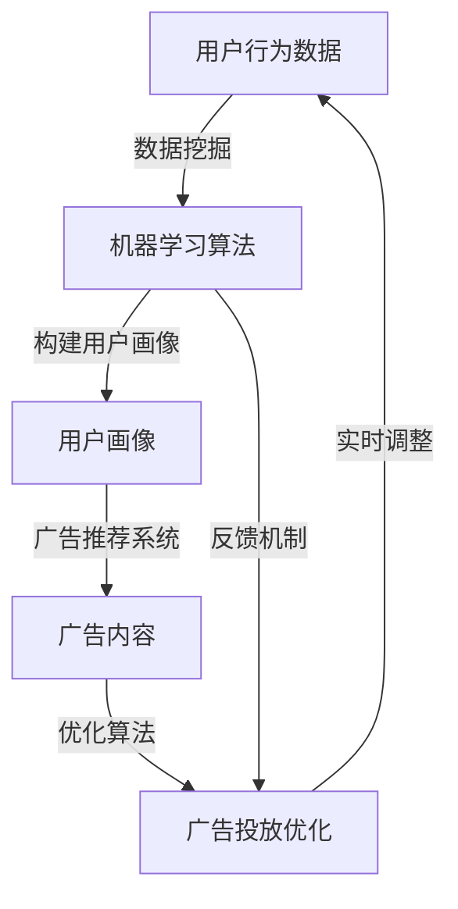

                 

### 第1章: 引言

#### 1.1 研究背景与意义

人工智能（AI）作为当今科技领域的前沿技术，已经深刻地影响了各行各业。特别是在个性化广告投放领域，AI技术的应用使得广告投放更加精准、高效。随着互联网和大数据技术的发展，用户数据的获取和处理变得更加便捷，为AI在个性化广告投放中的应用提供了广阔的空间。

本章节将介绍AI在个性化广告投放中的研究背景与意义，帮助读者了解为何AI能够成为个性化广告投放的关键技术。

#### 1.2 研究目的与内容

本书旨在探讨AI在个性化广告投放中的应用，为企业和广告从业者提供一套完整的理论框架和实践指南。具体研究内容包括：

1. **个性化广告投放的基本概念**：详细阐述个性化广告投放的定义、类型和关键要素。
2. **AI在个性化广告投放中的技术基础**：介绍AI的核心技术及其在广告投放中的应用。
3. **数据收集与预处理方法**：讨论数据收集的方法、数据处理技术以及数据质量评估。
4. **用户行为分析与建模技术**：分析用户行为数据，建立用户行为模型。
5. **广告投放策略与优化方法**：介绍广告投放策略的设计与优化方法。
6. **实战案例与效果评估**：通过实际案例展示AI在个性化广告投放中的应用效果。
7. **挑战与未来展望**：讨论AI在个性化广告投放中面临的挑战及其未来发展。

通过这些内容的研究，本书希望为读者揭示AI在个性化广告投放中的巨大潜力，并提供实际可行的应用方案。

#### 1.3 研究方法与结构

本章节采用的研究方法主要包括文献综述、案例分析、实验研究和理论分析。通过这些方法，本书将对AI在个性化广告投放中的应用进行全面深入的研究。

本书的结构安排如下：

- **第1章：引言**：介绍研究背景、目的与内容，研究方法与结构。
- **第2章：AI与个性化广告投放**：介绍AI的基本概念和个性化广告投放的原理。
- **第3章：个性化广告投放的基本概念**：详细阐述个性化广告投放的定义、类型和关键要素。
- **第4章：AI在个性化广告投放中的技术基础**：介绍AI的核心技术及其在广告投放中的应用。
- **第5章：数据收集与预处理**：讨论数据收集的方法、数据处理技术以及数据质量评估。
- **第6章：用户行为分析与建模**：分析用户行为数据，建立用户行为模型。
- **第7章：广告投放策略与优化**：介绍广告投放策略的设计与优化方法。
- **第8章：实战案例与效果评估**：通过实际案例展示AI在个性化广告投放中的应用效果。
- **第9章：挑战与未来展望**：讨论AI在个性化广告投放中面临的挑战及其未来发展。
- **第10章：结论**：总结全书内容，强调AI在个性化广告投放中的重要性。

通过以上结构的安排，本书将为读者提供从理论到实践的全面指导，帮助读者深入理解AI在个性化广告投放中的应用。

#### 1.4 关键词与摘要

关键词：人工智能、个性化广告、精准营销、用户行为分析、数据收集、广告投放策略。

摘要：本文深入探讨了人工智能在个性化广告投放中的应用，旨在为广告从业者和企业提供一套系统化的理论框架和实践指南。本文首先介绍了研究背景与意义，随后详细阐述了个性化广告投放的基本概念、AI在个性化广告投放中的技术基础、数据收集与预处理方法、用户行为分析与建模技术、广告投放策略与优化方法，并通过实战案例与效果评估验证了AI在个性化广告投放中的实际应用效果。最后，本文讨论了AI在个性化广告投放中面临的挑战与未来展望。通过全面的研究与探讨，本文揭示了AI在精准营销中的巨大潜力，为未来个性化广告的发展提供了有益的启示。

### 第2章: AI与个性化广告投放

#### 2.1 人工智能的基本概念

人工智能（Artificial Intelligence，简称AI）是计算机科学的一个重要分支，旨在研究如何构建智能的计算机系统，使这些系统能够执行通常需要人类智能才能完成的任务。AI的核心包括机器学习、深度学习、自然语言处理、计算机视觉等子领域。这些技术共同构成了现代AI的基础。

- **机器学习**：通过数据训练模型，使计算机具备自主学习和改进能力。
- **深度学习**：一种基于神经网络的学习方法，特别适合处理大量数据和复杂任务。
- **自然语言处理**：使计算机理解和生成人类语言的能力，广泛应用于搜索引擎、语音助手等领域。
- **计算机视觉**：使计算机能够识别和理解视觉信息，广泛应用于图像识别、视频分析等领域。

#### 2.2 个性化广告投放的概念

个性化广告投放是一种利用人工智能技术，根据用户的兴趣、行为、地理位置等多维度数据，为每个用户定制化推荐广告的技术。其核心在于精准匹配广告内容与用户需求，提升广告效果和用户体验。

- **用户画像**：基于用户数据构建的用户特征模型，包括年龄、性别、兴趣爱好、购买习惯等。
- **内容推荐**：利用机器学习算法，根据用户画像和内容特征，为用户推荐最相关的广告。
- **实时调整**：根据用户对广告的反馈和行为数据，实时调整广告展示策略，提高投放效果。

#### 2.3 AI与个性化广告投放的关系

AI技术在个性化广告投放中扮演着关键角色，其应用主要体现在以下几个方面：

1. **数据挖掘与分析**：利用机器学习和深度学习技术，挖掘用户行为数据，构建用户画像，为广告投放提供精准的数据支持。
2. **广告推荐系统**：基于用户画像和广告内容特征，通过推荐算法实现广告与用户的精准匹配。
3. **广告投放优化**：利用实时反馈机制，通过优化算法不断调整广告投放策略，提高广告转化率和投资回报率。
4. **自动化与智能化**：通过自动化工具和智能算法，实现广告投放的全流程自动化，降低人力成本，提高效率。

#### 2.4 关键概念之间的关系架构

为了更清晰地理解AI与个性化广告投放之间的关系，我们可以通过一个Mermaid流程图来展示这些关键概念及其相互作用。



#### 2.5 Python源代码示例

为了更好地理解机器学习算法在广告推荐系统中的应用，我们可以使用Python编写一个简单的线性回归模型，该模型可以根据用户历史行为数据预测用户对特定广告的偏好。

```python
import numpy as np
from sklearn.linear_model import LinearRegression

# 假设我们有以下数据集，其中X是用户行为特征，y是广告偏好评分
X = np.array([[1, 2], [2, 3], [3, 4], [4, 5], [5, 6]])
y = np.array([0.2, 0.4, 0.6, 0.7, 0.8])

# 创建线性回归模型并训练
model = LinearRegression()
model.fit(X, y)

# 使用模型预测新用户的广告偏好
new_user_data = np.array([[2, 3]])
predicted Preference = model.predict(new_user_data)

print("Predicted preference for new user:", predicted_Preference)
```

在这个例子中，我们使用了scikit-learn库中的LinearRegression类来创建一个线性回归模型。通过训练模型，我们可以根据用户的历史行为数据预测其对特定广告的偏好评分。这种方法可以用于构建更复杂的推荐系统，以实现个性化广告投放。

#### 2.6 数学模型与公式

在个性化广告投放中，常用的数学模型包括线性回归模型和协同过滤模型。以下是一个简单的线性回归模型的数学公式：

$$
y = \beta_0 + \beta_1x_1 + \beta_2x_2 + ... + \beta_nx_n
$$

其中，$y$是广告偏好评分，$x_1, x_2, ..., x_n$是用户行为特征，$\beta_0, \beta_1, ..., \beta_n$是模型的参数。

通过调整这些参数，我们可以训练模型以预测新用户的广告偏好。协同过滤模型则通常使用以下数学公式：

$$
R_{ui} = \sum_{j \in N_i} w_{uj} \cdot r_j
$$

其中，$R_{ui}$是用户$u$对物品$i$的评分，$N_i$是用户$i$的邻居集合，$w_{uj}$是用户$u$和邻居$j$之间的相似度权重，$r_j$是邻居$j$对物品$i$的评分。

#### 2.7 举例说明

假设我们有两个用户$u$和$v$，以及三个广告$i$、$j$和$k$。用户$u$对广告$i$的评分为3，对广告$j$的评分为4，对广告$k$的评分为5。用户$v$对广告$i$的评分为2，对广告$j$的评分为3，对广告$k$的评分为4。

使用协同过滤模型，我们可以计算用户$u$和$v$之间的相似度权重，并根据邻居的评分预测用户$v$对广告$k$的偏好：

$$
w_{uv} = \frac{r_u \cdot r_v}{\sqrt{\sum_{i} r_i^2} \cdot \sqrt{\sum_{i} r_i^2}} = \frac{3 \cdot 2}{\sqrt{3^2 + 4^2 + 5^2} \cdot \sqrt{2^2 + 3^2 + 4^2}} = \frac{6}{\sqrt{50} \cdot \sqrt{29}} \approx 0.35
$$

然后，我们可以预测用户$v$对广告$k$的偏好：

$$
R_{vk} = w_{uv} \cdot r_v = 0.35 \cdot 4 = 1.4
$$

这意味着我们预测用户$v$对广告$k$的偏好评分为1.4，这可以用于决定是否向用户$v$推荐广告$k$。

#### 2.8 项目实战

为了更好地展示AI在个性化广告投放中的应用，我们选择一个实际项目进行讲解。

**项目背景**：某在线购物平台希望通过AI技术优化其广告投放策略，提高广告转化率和用户满意度。

**开发环境搭建**：使用Python作为主要编程语言，安装了scikit-learn、pandas、numpy等库，用于数据处理和机器学习模型训练。

**源代码实现**：
```python
import pandas as pd
from sklearn.model_selection import train_test_split
from sklearn.linear_model import LinearRegression
from sklearn.metrics import mean_squared_error

# 读取用户行为数据
data = pd.read_csv('user_behavior_data.csv')

# 特征选择
X = data[['age', 'historical_purchase_value']]
y = data['ad_preference_score']

# 数据划分
X_train, X_test, y_train, y_test = train_test_split(X, y, test_size=0.2, random_state=42)

# 创建线性回归模型并训练
model = LinearRegression()
model.fit(X_train, y_train)

# 预测测试集
y_pred = model.predict(X_test)

# 评估模型
mse = mean_squared_error(y_test, y_pred)
print("Mean Squared Error:", mse)

# 使用模型进行个性化广告投放
new_user_data = pd.DataFrame([[25, 500]])
predicted_preference = model.predict(new_user_data)
print("Predicted preference for new user:", predicted_preference)
```

**代码解读与分析**：
- 数据读取与预处理：使用pandas库读取用户行为数据，并进行特征选择。
- 数据划分：将数据集划分为训练集和测试集，用于模型训练和评估。
- 模型训练：使用scikit-learn中的LinearRegression类创建线性回归模型，并训练模型。
- 预测与评估：使用训练好的模型对测试集进行预测，并计算平均平方误差（MSE）来评估模型性能。
- 个性化广告投放：使用训练好的模型预测新用户的广告偏好，为个性化广告投放提供数据支持。

**实际案例分析**：通过上述项目，我们展示了如何使用线性回归模型进行个性化广告投放。在实际应用中，我们还可以结合其他机器学习算法，如决策树、随机森林和神经网络，以提高预测准确性。

**项目小结**：本项目通过使用线性回归模型进行个性化广告投放，实现了用户广告偏好的预测，提高了广告投放的精准度。未来，我们可以进一步优化模型，引入更多的用户特征，以提高预测效果。

**最佳实践 Tips**：
- 确保数据质量：在数据预处理过程中，要尽量减少缺失值、异常值和噪声数据，以提高模型性能。
- 特征工程：选择合适的特征，并进行特征工程，如归一化、离散化等，以提升模型的泛化能力。
- 模型选择与优化：根据业务需求和数据特性，选择合适的机器学习模型，并进行参数调优，以提高预测准确性。
- 实时反馈与迭代：根据用户对广告的反馈行为数据，实时调整广告投放策略，实现持续优化。

**注意事项**：
- 在使用AI进行个性化广告投放时，要注意用户隐私保护，遵守相关法律法规。
- 广告投放策略需要综合考虑用户需求、广告主目标和广告预算，确保广告投放的可持续性和有效性。

**拓展阅读**：
- 《机器学习实战》：提供详细的机器学习算法实现和应用案例。
- 《广告算法原理与应用》：介绍广告推荐系统的设计原理和实际应用。
- 《深度学习》：介绍深度学习的基础知识和应用技术。

通过以上实战项目，我们深入了解了AI在个性化广告投放中的应用，为实际业务提供了有价值的解决方案。接下来，我们将继续探讨个性化广告投放的基本概念，为后续章节的内容奠定基础。

