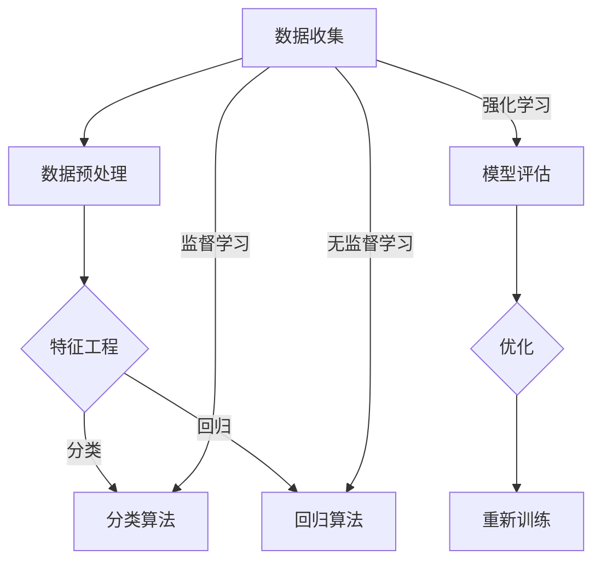
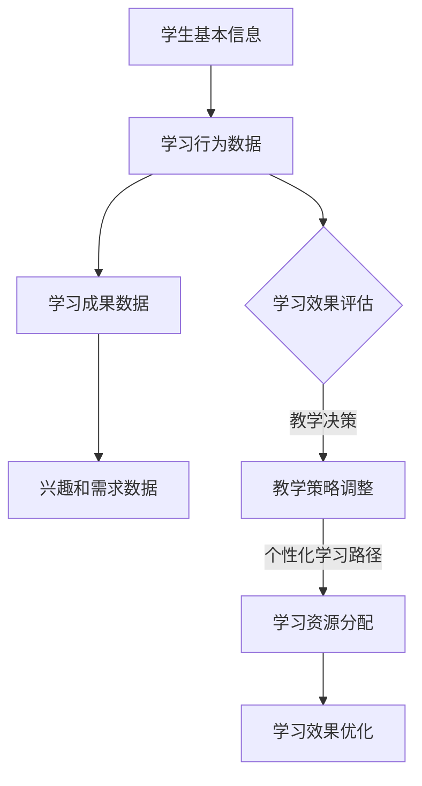

                 

## 第1章 引言：AI与个性化教育的融合

### 1.1 个性化教育的需求与挑战

随着教育领域的发展，传统的一刀切教学模式已经无法满足学生的个性化需求。每一个学生都有其独特的学习背景、兴趣和认知能力。因此，个性化教育成为现代教育改革的重要目标之一。个性化教育旨在根据每个学生的特点和需求，提供量身定制的学习体验，以提高学习效果和满意度。

然而，实现个性化教育面临着诸多挑战。首先，如何准确、全面地收集和分析学生的数据是一个关键问题。学生的行为数据、学习进度、兴趣爱好等信息的收集和分析需要高效的算法和强大的数据处理能力。其次，如何根据这些数据为学生制定合适的学习计划，使得学习内容既具有挑战性又能被学生接受，也是一个复杂的问题。此外，个性化教育还需要考虑教育资源的分配问题，如何保证每个学生都能获得足够的学习资源和支持。

AI技术的出现为解决这些挑战提供了新的可能。AI可以通过对大量学生数据的分析，发现学习规律和模式，从而为学生提供个性化的学习建议和方案。同时，AI还可以通过智能化的学习评估工具，实时监控学生的学习进度和效果，及时调整学习内容和方法。

### 1.2 AI技术在教育中的应用趋势

近年来，AI技术在教育领域的应用呈现出快速增长的态势。以下是几个典型的应用场景：

1. **自适应学习系统**：通过分析学生的学习行为和学习数据，自适应学习系统可以为每个学生提供个性化的学习路径和内容。例如，Knewton和DreamBox等公司开发的在线教育平台，可以根据学生的实时反馈和学习进度，动态调整学习内容和难度。

2. **智能评估与反馈**：AI技术可以帮助教师自动评估学生的学习成果，并提供个性化的反馈。例如，剑桥大学的MyMaths平台使用AI技术来评估学生的数学作业，并提供详细的反馈和建议。

3. **个性化学习路径规划**：AI技术可以帮助教育机构根据学生的特点和需求，规划个性化的学习路径。例如，IBM的Watson Education平台可以为每个学生创建一个个性化的学习计划，并推荐相关的学习资源和课程。

4. **虚拟教师与助教**：AI技术还可以用于创建虚拟教师和助教，为学生提供实时支持和辅导。例如，IBM的Watson Tutor可以为学生提供24/7的在线辅导服务。

### 1.3 本书结构概述

本书将从以下几个方面对AI在个性化教育中的应用进行深入探讨：

1. **AI基础**：介绍AI的基本概念、技术和算法，为后续内容提供理论基础。

2. **个性化教育核心概念**：阐述个性化教育的定义、目标和相关理论，为AI在教育中的应用奠定基础。

3. **AI在教育中的应用案例**：分析AI技术在教育中的具体应用，包括自适应学习系统、智能评估工具、个性化学习路径规划等。

4. **AI技术的实现方法**：探讨如何开发和部署AI系统以支持个性化教育，包括数据收集与预处理、模型选择与训练、模型评估与优化等。

5. **学习曲线的适应与优化**：研究如何根据学生的学习习惯和进度来调整教育内容，提高学习效果。

6. **教育政策与伦理**：讨论AI在个性化教育中的应用对教育政策、教学方法和伦理的影响。

通过本书的阅读，读者可以全面了解AI在个性化教育中的应用，掌握相关技术和方法，为教育领域的创新和发展提供支持。接下来的章节将逐步深入这些主题，提供详细的讲解和分析。

### 关键词

- 个性化教育
- AI技术
- 自适应学习
- 智能评估
- 学习曲线
- 教育数据分析
- 个性化学习路径
- 教育政策与伦理

### 摘要

本文深入探讨了AI在个性化教育中的应用，从背景介绍、核心概念、技术实现、应用案例到政策与伦理方面进行了全面分析。文章首先阐述了个性化教育的需求与挑战，并介绍了AI技术在教育领域的应用趋势。随后，文章详细介绍了AI在教育中的核心概念，包括个性化教育的定义、目标和相关理论。接着，文章分析了AI技术在教育中的具体应用，如自适应学习系统、智能评估工具和个性化学习路径规划。然后，文章探讨了AI技术的实现方法，包括数据收集与预处理、模型选择与训练、模型评估与优化。此外，文章还研究了学习曲线的适应与优化策略，以提高个性化教育的效果。最后，文章讨论了AI在个性化教育中的应用对教育政策、教学方法和伦理的影响。通过本文的阅读，读者可以全面了解AI在个性化教育中的应用，掌握相关技术和方法，为教育领域的创新和发展提供支持。

## 第2章 AI基础：理论与技术

### 2.1 机器学习和深度学习简介

人工智能（AI）作为现代科技的重要领域，其核心在于模拟人类智能，实现机器的自主学习和决策能力。AI的两大支柱是机器学习和深度学习，它们构成了AI技术的基础。

#### 机器学习

机器学习（Machine Learning，ML）是指通过算法从数据中自动学习规律和模式，从而进行预测或决策的技术。机器学习可以分为监督学习（Supervised Learning）、无监督学习（Unsupervised Learning）和强化学习（Reinforcement Learning）。

1. **监督学习**：监督学习有明确的输入和输出，通过已知的输入输出数据来训练模型。常见的算法有线性回归、逻辑回归、支持向量机（SVM）和决策树等。

   **示例**：假设我们有一个房价预测模型，输入是房屋的特征（如面积、房间数等），输出是房价。通过训练模型，我们可以预测未知房屋的房价。

   ```python
   # Python代码示例：线性回归模型
   from sklearn.linear_model import LinearRegression
   import numpy as np
   
   X = np.array([[1000], [1500], [2000]])  # 房屋面积
   y = np.array([1000000, 1500000, 2000000])  # 房价
   
   model = LinearRegression()
   model.fit(X, y)
   
   print(model.predict([[1800]]))  # 预测1800平方米的房价
   ```

2. **无监督学习**：无监督学习没有明确的输出，主要任务是发现数据中的隐含结构和规律。常见的算法有聚类（如K-means聚类）、降维（如PCA）和关联规则学习等。

   **示例**：假设我们有一组未标记的客户数据，通过聚类算法可以发现不同群体的客户特征，从而进行市场细分。

   ```python
   # Python代码示例：K-means聚类
   from sklearn.cluster import KMeans
   import numpy as np
   
   X = np.array([[1, 2], [1, 4], [1, 0], [4, 2], [4, 4], [4, 0]])
   kmeans = KMeans(n_clusters=2, random_state=0).fit(X)
   print(kmeans.labels_)  # 输出每个样本的聚类标签
   ```

3. **强化学习**：强化学习通过奖励机制来训练模型，使其在特定环境中做出最佳决策。常见的算法有Q学习、深度Q网络（DQN）和策略梯度算法等。

   **示例**：一个典型的强化学习应用是智能体在游戏中的自我训练，通过不断尝试和失败来学习最优策略。

   ```python
   # Python代码示例：Q学习
   import numpy as np
   import random
   
   Q = np.zeros((6, 6))  # 初始化Q值矩阵
   alpha = 0.1  # 学习率
   gamma = 0.9  # 折扣因子
   
   states = [[0, 0], [0, 1], [1, 0], [1, 1]]
   actions = ['Up', 'Down', 'Left', 'Right']
   
   for episode in range(1000):
       state = random.choice(states)
       done = False
       while not done:
           action = np.argmax(Q[state])
           next_state, reward, done = get_next_state_and_reward(state, action)
           Q[state][action] = Q[state][action] + alpha * (reward + gamma * np.max(Q[next_state]) - Q[state][action])
           state = next_state
   
   print(Q)  # 打印Q值矩阵
   ```

#### 深度学习

深度学习（Deep Learning，DL）是机器学习的一个子领域，它使用神经网络（Neural Networks）来模拟人类大脑的学习机制。与传统的机器学习模型相比，深度学习能够处理更复杂的任务，特别是在图像识别、自然语言处理和语音识别等领域取得了显著成果。

1. **神经网络基本概念**：神经网络由多个神经元（或节点）组成，每个神经元接收多个输入，通过激活函数产生输出。神经网络可以分为多层，包括输入层、隐藏层和输出层。

2. **前向传播与反向传播**：在前向传播过程中，输入数据通过神经网络，每层神经元将输入传递给下一层，最终产生输出。在反向传播过程中，模型根据预测误差，调整每个神经元的权重和偏置，以优化模型性能。

3. **激活函数**：激活函数是神经网络中用于引入非线性特性的函数，常见的激活函数有Sigmoid、ReLU和Tanh等。

4. **优化算法**：深度学习通常使用梯度下降（Gradient Descent）及其变种来优化模型参数。常见的优化算法有随机梯度下降（SGD）、Adam等。

5. **深度学习框架**：深度学习框架如TensorFlow、PyTorch等，提供了丰富的API和工具，使得深度学习模型的开发、训练和部署变得更加便捷。

**示例**：使用TensorFlow实现一个简单的神经网络，进行图像分类。

```python
import tensorflow as tf
from tensorflow.keras import layers

# 创建模型
model = tf.keras.Sequential([
    layers.Conv2D(32, (3, 3), activation='relu', input_shape=(28, 28, 1)),
    layers.MaxPooling2D((2, 2)),
    layers.Flatten(),
    layers.Dense(128, activation='relu'),
    layers.Dense(10, activation='softmax')
])

# 编译模型
model.compile(optimizer='adam',
              loss='sparse_categorical_crossentropy',
              metrics=['accuracy'])

# 加载MNIST数据集
mnist = tf.keras.datasets.mnist
(train_images, train_labels), (test_images, test_labels) = mnist.load_data()

# 预处理数据
train_images = train_images.reshape((60000, 28, 28, 1))
train_images = train_images / 255.0

test_images = test_images.reshape((10000, 28, 28, 1))
test_images = test_images / 255.0

# 训练模型
model.fit(train_images, train_labels, epochs=5)

# 测试模型
test_loss, test_acc = model.evaluate(test_images,  test_labels, verbose=2)
print('\nTest accuracy:', test_acc)
```

通过上述内容，我们可以看到机器学习和深度学习的基本概念、算法和实现方法。这些技术为AI在教育领域的应用提供了坚实的理论基础。

### 关键词

- 机器学习
- 深度学习
- 神经网络
- 神经元
- 激活函数
- 前向传播
- 反向传播
- 梯度下降
- 优化算法
- 深度学习框架

### 数学模型与公式

在机器学习和深度学习中，数学模型和公式是理解算法原理和实现关键的重要组成部分。以下是一些核心的数学概念和公式：

#### 梯度下降

梯度下降是一种优化算法，用于最小化损失函数。其基本思想是计算损失函数关于模型参数的梯度，并沿梯度方向调整参数，以减小损失。

公式：
$$
\Delta \theta = -\alpha \cdot \nabla_\theta J(\theta)
$$
其中，$\Delta \theta$ 是参数更新量，$\alpha$ 是学习率，$J(\theta)$ 是损失函数，$\nabla_\theta J(\theta)$ 是损失函数关于参数$\theta$ 的梯度。

#### 线性回归

线性回归是一种监督学习算法，用于预测一个连续值。其模型可以表示为：
$$
y = \theta_0 + \theta_1 \cdot x
$$
其中，$y$ 是输出值，$x$ 是输入特征，$\theta_0$ 和 $\theta_1$ 是模型参数。

损失函数通常为平方误差损失：
$$
J(\theta) = \frac{1}{2} \sum_{i=1}^m (y_i - \theta_0 - \theta_1 \cdot x_i)^2
$$
其中，$m$ 是样本数量。

#### 神经网络

神经网络中的每个神经元可以看作是一个简单的线性回归模型。一个多层感知器（MLP）可以表示为：
$$
a_{hl} = \sigma(\theta_{hl} \cdot x_l + b_{hl})
$$
其中，$a_{hl}$ 是第 $h$ 层第 $l$ 个神经元的激活值，$\sigma$ 是激活函数，$\theta_{hl}$ 是连接权重，$b_{hl}$ 是偏置项。

前向传播和反向传播分别用于计算输出值和更新模型参数。

#### 激活函数

常见的激活函数包括Sigmoid、ReLU和Tanh等。以ReLU为例，其公式为：
$$
\sigma(x) =
\begin{cases}
0 & \text{if } x < 0 \\
x & \text{if } x \geq 0
\end{cases}
$$

通过上述数学模型和公式，我们可以更深入地理解机器学习和深度学习的基本原理，为后续章节的应用分析提供理论支持。

### Mermaid 流程图

为了更直观地展示机器学习中的流程，我们可以使用Mermaid语法绘制一个简单的流程图。以下是一个示例：



这个流程图展示了从数据收集到模型评估的整个过程，包括监督学习、无监督学习和强化学习等不同类型的机器学习任务。通过这样的流程图，我们可以清晰地理解机器学习的整体框架和各个步骤之间的关系。

### 结论

在本章中，我们介绍了机器学习和深度学习的基础理论和技术。通过具体的示例和数学公式，我们详细讲解了监督学习、无监督学习和强化学习等算法的基本原理。同时，我们展示了如何使用Python和TensorFlow等工具实现这些算法，为后续章节中AI在个性化教育中的应用提供了理论基础。接下来的章节将进一步探讨AI技术在教育中的具体应用和实践案例。

### 最佳实践 tips

1. **数据质量的重要性**：确保数据的准确性和完整性对于机器学习模型的效果至关重要。在数据收集和处理过程中，注意数据的清洗和预处理。

2. **模型选择与优化**：根据具体的任务需求选择合适的机器学习算法，并通过交叉验证、网格搜索等技术进行参数调优。

3. **模型的可解释性**：尤其是在教育领域，理解模型如何做出预测是非常重要的。使用可解释性工具来分析模型内部结构和决策过程。

4. **持续学习和迭代**：机器学习模型需要不断更新和优化，以适应新的数据和变化的环境。定期重新训练模型，以保持其预测准确性。

### 小结

本章介绍了机器学习和深度学习的基础理论，包括监督学习、无监督学习和强化学习等算法的基本原理。通过具体示例和Python代码，我们展示了如何实现这些算法。下一章将深入探讨个性化教育的核心概念，以及AI技术在教育中的应用。

### 注意事项

- 在实现机器学习模型时，要充分了解数据集的特性，避免过拟合和欠拟合。
- 模型优化过程中，要关注计算资源和时间的平衡。
- 在使用深度学习时，要特别注意模型参数的初始化和正则化策略。

### 拓展阅读

- 《机器学习实战》 - by Peter Harrington
- 《深度学习》 - by Ian Goodfellow、Yoshua Bengio和Aaron Courville
- 《TensorFlow 2.0官方文档》 - [TensorFlow官方文档](https://www.tensorflow.org/)

## 第3章 个性化教育的核心概念

个性化教育是一种以学生为中心的教育模式，旨在根据每个学生的特点、需求和学习风格提供个性化的学习体验。这一概念的核心在于对学习者的深刻理解，以及在此基础上提供的定制化服务。为了实现这一目标，我们需要理解几个关键概念：个性化教育的定义、目标、学习曲线以及学生数据模型。

### 3.1 个性化教育的定义与目标

#### 个性化教育的定义

个性化教育（Personalized Education）是一种以学生为中心的教育模式，强调根据每个学生的特点、需求和兴趣来设计教学活动。与传统的一刀切教学模式不同，个性化教育注重学生的个体差异，致力于满足每个学生的学习需求，提高学习效果和满意度。

#### 个性化教育的目标

个性化教育的目标主要包括以下几个方面：

1. **提高学习效果**：通过个性化的学习路径和内容，使每个学生都能在最适合他们的学习环境中取得最佳的学习效果。

2. **满足个体需求**：尊重每个学生的个体差异，根据他们的兴趣、能力和学习风格提供定制化的学习资源和支持。

3. **激发学习兴趣**：通过个性化的学习体验，激发学生的学习兴趣和动机，培养他们的自主学习能力和创新精神。

4. **全面发展**：个性化教育不仅关注学生的学术成就，还注重他们的社会情感发展，培养他们的综合素质。

### 3.2 学习曲线的适应和优化

#### 学习曲线

学习曲线（Learning Curve）描述了学生在学习过程中的进步情况。它反映了学生在不同时间点的学习效果和进步速度。学习曲线可以用来监测学生的学习进展，帮助教师和家长了解学生的实际学习情况。

#### 学习曲线的适应

为了实现个性化教育，教师需要根据学生的学习曲线调整教学策略，使学习内容和方法与学生的实际情况相适应。以下是一些适应学习曲线的策略：

1. **差异化教学**：根据学生的学习进度和能力水平，提供不同难度和深度的学习内容。

2. **动态调整**：根据学生的学习表现和反馈，实时调整教学计划和学习资源。

3. **个性化反馈**：针对每个学生的特点，提供具体的、个性化的反馈，帮助他们明确学习目标和改进方向。

#### 学习曲线的优化

优化学习曲线的目标是提高学生的学习效率和效果。以下是一些优化学习曲线的方法：

1. **任务分解**：将复杂的学习任务分解成一系列小任务，帮助学生逐步克服学习障碍。

2. **适时干预**：在学生遇到困难时，及时提供帮助和指导，避免他们陷入学习瓶颈。

3. **激励制度**：通过奖励和激励措施，激发学生的学习动力和积极性。

### 3.3 学生数据模型

#### 学生数据模型的概念

学生数据模型（Student Data Model）是一种用于描述学生学习数据的结构和关系的模型。它通常包括学生的基本信息、学习行为数据、学习成果数据等。学生数据模型为个性化教育提供了数据基础，使得教育系统能够根据学生的数据做出个性化的决策。

#### 学生数据模型的结构

一个典型学生数据模型的结构可能包括以下部分：

1. **基本信息**：包括学生的姓名、年龄、性别、年级等。

2. **学习行为数据**：包括学生的出勤记录、作业完成情况、考试分数、在线学习记录等。

3. **学习成果数据**：包括学生的知识掌握情况、技能水平、学术成就等。

4. **兴趣和需求数据**：包括学生的兴趣领域、学习需求、学习风格等。

#### 学生数据模型的应用

学生数据模型在教育中的应用主要体现在以下几个方面：

1. **个性化学习路径规划**：根据学生的学习行为和成果数据，为学生制定个性化的学习计划。

2. **学习效果评估**：通过分析学生的学习数据，评估学生的学习效果和进步情况。

3. **教学决策支持**：为教师提供数据支持，帮助他们更好地进行教学设计和决策。

### Mermaid 流程图

为了更直观地展示个性化教育的核心概念，我们可以使用Mermaid语法绘制一个流程图。以下是一个示例：



这个流程图展示了个性化教育的数据流程和决策过程，包括学生的基本信息、学习行为数据、学习成果数据和兴趣需求数据，以及基于这些数据的评估和调整过程。

### 结论

本章介绍了个性化教育的核心概念，包括个性化教育的定义、目标以及学习曲线的适应和优化。我们详细讨论了学生数据模型的结构和应用，为AI在个性化教育中的应用提供了理论基础。在下一章中，我们将探讨AI在教育中的应用案例，展示AI如何帮助实现个性化教育。

### 最佳实践 tips

1. **数据隐私保护**：在收集和使用学生数据时，要严格遵守数据隐私保护法规，确保学生信息的安全。

2. **数据多样性**：确保学生数据的多样性，包括不同年级、学科和背景的数据，以获得更全面的个性化教育支持。

3. **家长参与**：鼓励家长参与个性化教育过程，提供反馈和建议，共同促进学生的成长。

### 小结

本章详细介绍了个性化教育的核心概念，包括定义、目标、学习曲线的适应和优化以及学生数据模型。这些概念为AI在个性化教育中的应用奠定了基础。下一章将探讨AI技术在教育中的具体应用，展示AI如何帮助实现个性化教育。

### 注意事项

- 在设计和实施个性化教育方案时，要充分考虑学生的个体差异和需求。
- 定期评估和调整个性化教育方案，确保其与学生的实际情况相匹配。

### 拓展阅读

- 《个性化学习：从理论到实践》 - by John S. Hargis
- 《数据驱动的教育：个性化学习的设计与应用》 - by Maria M. Villarreal
- 《教育数据科学：方法与应用》 - by John H. McDonald

## 第4章 AI在教育中的应用案例

AI技术在教育领域的应用已经成为教育创新和发展的重要驱动力。通过AI技术，教育机构可以为学生提供更高效、个性化的学习体验。以下是一些典型的AI在教育中的应用案例，包括自适应学习系统、智能评估工具和个性化学习路径规划。

### 4.1 自适应学习系统

自适应学习系统（Adaptive Learning Systems）是AI技术在教育中最为广泛应用的领域之一。这种系统可以根据学生的学习行为和表现，动态调整学习内容和难度，以满足学生的个性化需求。

#### 案例：Knewton

Knewton是一个典型的自适应学习平台，它通过分析学生的学习数据，如回答问题的时间、正确率等，为学生提供个性化的学习内容。Knewton平台采用了一种基于内容自适应的算法，可以根据学生的反馈，实时调整学习材料的难度和顺序。

**实现原理**：

1. **数据收集**：Knewton收集学生的行为数据，如做题时间、正确率、错误类型等。
2. **数据分析**：系统对数据进行分析，识别学生的学习风格和知识掌握情况。
3. **内容调整**：根据分析结果，系统为学生推荐适合的学习材料和练习题。
4. **实时反馈**：系统提供即时反馈，帮助学生巩固所学知识。

**应用效果**：

- 提高学习效果：学生能够根据自己的进度学习，避免过度难或过于简单的题目，提高学习效率。
- 增强学习动力：个性化的学习内容和挑战能够激发学生的学习兴趣和积极性。

### 4.2 智能评估与反馈

智能评估工具（Intelligent Assessment Tools）利用AI技术，对学生的知识水平和能力进行自动评估，并提供详细的反馈。这种工具可以帮助教师快速了解学生的学习情况，及时调整教学策略。

#### 案例：MyMaths

MyMaths是由剑桥大学开发的一个智能评估平台，它使用机器学习算法对学生的数学作业进行自动评分，并提供详细的反馈。MyMaths平台能够识别学生的错误类型，并给出相应的解释和建议。

**实现原理**：

1. **自动评分**：MyMaths使用机器学习算法对学生提交的作业进行自动评分。
2. **错误分析**：系统分析学生的错误，识别常见的错误类型和知识点盲区。
3. **反馈生成**：系统生成详细的反馈，包括正确的解题方法和相关知识点的解释。
4. **学习资源推荐**：根据学生的错误类型，推荐相关的学习资源和练习题。

**应用效果**：

- 提高评估效率：教师不再需要花费大量时间批改作业，可以将更多精力投入到教学和辅导中。
- 提升学习效果：详细的反馈和建议帮助学生理解错误原因，巩固所学知识。

### 4.3 个性化学习路径规划

个性化学习路径规划（Personalized Learning Path Planning）是利用AI技术，根据学生的特点和需求，为他们量身定制学习计划。这种规划可以帮助学生更有效地学习，提高学习效果。

#### 案例：IBM Watson Education

IBM Watson Education平台利用AI技术，为学生提供个性化的学习路径规划。该平台通过分析学生的数据，如成绩、兴趣、学习习惯等，为学生推荐最适合的学习资源和课程。

**实现原理**：

1. **数据收集**：平台收集学生的成绩、学习习惯、兴趣爱好等数据。
2. **数据分析**：系统对数据进行分析，识别学生的优势和劣势。
3. **路径规划**：根据分析结果，系统为学生制定个性化的学习计划。
4. **动态调整**：系统实时监控学生的学习进度和效果，根据反馈动态调整学习计划。

**应用效果**：

- 提高学习效率：个性化的学习计划能够帮助学生专注于自己的弱点和优势，提高学习效率。
- 增强学习动力：个性化的学习内容和挑战能够激发学生的学习兴趣和积极性。

### 4.4 虚拟教师与助教

虚拟教师和助教（Virtual Teachers and Tutors）是AI技术在教育中的另一个重要应用。通过自然语言处理和机器学习技术，虚拟教师和助教可以为学生提供实时支持和辅导。

#### 案例：IBM Watson Tutor

IBM Watson Tutor是一个智能辅导系统，它能够为学生提供24/7的在线辅导服务。Watson Tutor利用自然语言处理技术，理解学生的问题，并提供详细的解答和指导。

**实现原理**：

1. **问题理解**：Watson Tutor使用自然语言处理技术，理解学生的问题和需求。
2. **知识检索**：系统在庞大的知识库中检索相关的信息和解答。
3. **生成回答**：系统生成详细的回答，并将其呈现给学生。
4. **互动反馈**：系统与学生进行互动，回答学生的问题，并提供额外的学习资源。

**应用效果**：

- 提供实时支持：学生可以在任何时间、任何地点获得即时帮助，提高学习效果。
- 个性化辅导：Watson Tutor能够根据学生的具体问题，提供个性化的辅导方案。

### 结论

AI技术在教育中的应用已经取得了显著成果，通过自适应学习系统、智能评估工具、个性化学习路径规划和虚拟教师等应用，教育机构能够更好地满足学生的个性化需求，提高教育质量。随着技术的不断发展，AI在个性化教育中的应用将更加广泛和深入，为教育创新提供源源不断的动力。

### 最佳实践 tips

1. **数据驱动**：充分利用学生的学习数据，制定科学的教育决策。
2. **持续迭代**：定期更新和优化AI系统，确保其与教育需求相匹配。
3. **多方协作**：教师、技术团队和家长的协作是AI在教育中成功应用的关键。

### 小结

本章详细介绍了AI在教育中的几个重要应用案例，包括自适应学习系统、智能评估工具、个性化学习路径规划和虚拟教师等。这些案例展示了AI技术在教育领域的实际应用效果，并为教育创新提供了新的思路和方法。下一章将探讨如何实现AI在个性化教育中的技术，包括数据收集与预处理、模型选择与训练、模型评估与优化。

### 注意事项

- 在实施AI应用时，要确保学生数据的安全和隐私。
- AI系统应与教师的教学方法相结合，发挥互补作用。

### 拓展阅读

- 《自适应学习系统设计与应用》 - by Rick Sheng
- 《教育数据挖掘：方法与应用》 - by Alexander Gloeckner
- 《人工智能在教育中的应用》 - by Tamycaption J. C.

