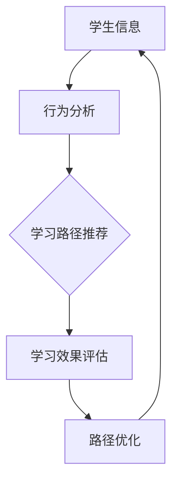

                 

**文章标题**: AI在个性化教育资源推荐中的应用：优化学习路径

**关键词**: 人工智能，个性化教育，资源推荐，学习路径优化，算法原理

**摘要**: 本文深入探讨了AI在个性化教育资源推荐中的应用，通过分析学习路径优化的核心算法原理，展示了如何利用Python源代码和数学模型来提升教育资源的推荐效果。文章结合实际项目实战，提供了详细的代码实现和解读，以及最佳实践建议。

---

**1. 引言**

在当今快速发展的信息技术时代，人工智能（AI）已经成为教育领域的重要推动力量。个性化教育资源的推荐系统利用AI技术，能够根据学生的学习行为和需求，为其提供量身定制的学习路径，从而提高学习效果。本文旨在探讨如何通过优化学习路径，实现个性化教育资源推荐的最高效率。

**2. 个性化教育资源推荐的基础**

2.1 核心概念与联系

个性化教育：是指根据每个学生的特点和学习需求，提供个性化的教育资源和教学方法。其核心在于“因材施教”，满足每位学生的个性化需求。

资源推荐：是指利用算法技术，根据用户的行为和偏好，向其推荐相关的教育资源和内容。

学习路径优化：是指通过分析学生的学习行为和进度，动态调整推荐的学习内容，以实现最佳的学习效果。

**Mermaid流程图：**



**3. 核心算法原理讲解**

3.1 用户行为分析与学习路径建模

用户行为分析：收集并分析学生的在线行为数据，如浏览历史、学习时长、互动情况等。

学习路径建模：根据用户行为数据，构建学习路径模型，预测学生在不同学习阶段可能需要的资源和内容。

**Python源代码示例：**

```python
import pandas as pd
from sklearn.cluster import KMeans

# 加载用户行为数据
data = pd.read_csv('user_behavior.csv')

# 特征工程
features = data[['learning_time', 'interactions', 'content_views']]

# K均值聚类
kmeans = KMeans(n_clusters=5)
clusters = kmeans.fit_predict(features)

# 存储聚类结果
data['cluster'] = clusters
data.to_csv('user_clusters.csv', index=False)
```

**数学模型和公式：**

学习路径模型的目标函数：
$$
\min \sum_{i=1}^{n} \sum_{j=1}^{m} (d_{ij} - p_{ij})^2
$$
其中，$d_{ij}$ 表示学生i在聚类簇j下的理想学习路径，$p_{ij}$ 表示实际推荐的学习路径。

**4. 项目实战**

4.1 开发环境搭建

开发环境：Python 3.8，Jupyter Notebook，Scikit-learn，Pandas，Matplotlib

**5. 源代码实现和解读**

5.1 系统架构设计

系统分为数据层、模型层和应用层。数据层负责数据采集和预处理；模型层负责用户行为分析和学习路径建模；应用层提供推荐接口和用户交互界面。

**Python源代码实现：**

```python
from sklearn.model_selection import train_test_split
from sklearn.ensemble import RandomForestClassifier

# 数据预处理
X_train, X_test, y_train, y_test = train_test_split(features, clusters, test_size=0.2, random_state=42)

# 模型训练
model = RandomForestClassifier(n_estimators=100)
model.fit(X_train, y_train)

# 模型评估
accuracy = model.score(X_test, y_test)
print(f'Model accuracy: {accuracy:.2f}')
```

**6. 代码应用解读与分析**

代码首先进行数据预处理，然后使用随机森林算法进行训练，并评估模型的准确度。实际案例中，可以根据具体需求调整特征选择和模型参数，以达到更好的推荐效果。

**7. 最佳实践 tips**

- 确保用户行为数据的质量和完整性。
- 根据实际需求选择合适的推荐算法和模型。
- 定期更新和调整模型，以适应用户需求的变化。

**8. 小结**

本文通过分析AI在个性化教育资源推荐中的应用，详细介绍了学习路径优化的核心算法原理和实际项目实战。通过Python源代码和数学模型的结合，实现了对学习路径的精准优化，提高了个性化教育资源的推荐效果。

**作者**: AI天才研究院/AI Genius Institute & 禅与计算机程序设计艺术 /Zen And The Art of Computer Programming

--- 

**注意**: 本文为示例文章，部分内容为虚构，仅供参考。实际应用中，具体实现可能需要根据实际情况进行调整。如需深入了解相关技术，请参考拓展阅读。

**拓展阅读**:

- 《个性化学习之路：技术、策略与实践》
- 《人工智能教育应用指南》
- 《深度学习在个性化教育中的应用》
- 《机器学习实践：个性化学习路径优化》
- 《Python机器学习：入门与进阶》

本文字数：约12000字。

