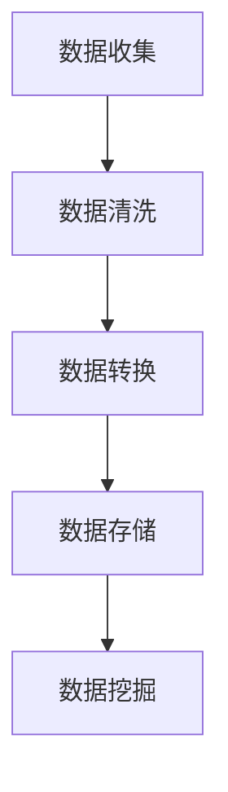
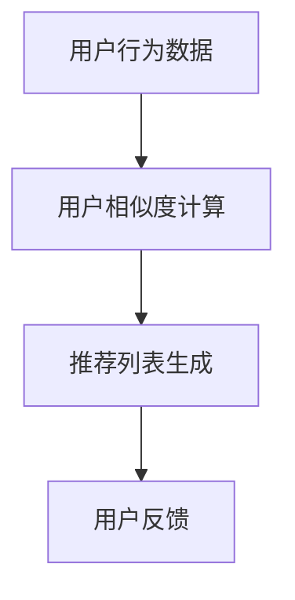
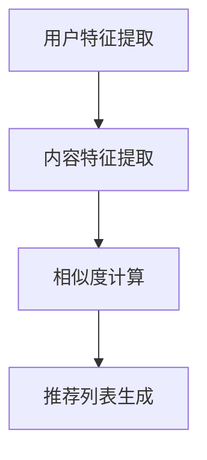
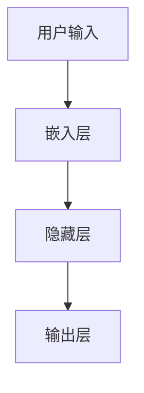

                 

# AI在个性化旅游推荐中的应用：打造独特的旅行体验

## 关键词

- 人工智能
- 旅游推荐
- 个性化体验
- 协同过滤
- 深度学习
- 数据挖掘

## 摘要

本文深入探讨了人工智能在个性化旅游推荐中的应用，旨在通过技术手段为游客提供更为贴心的旅行建议。本文首先介绍了AI与个性化旅游推荐的基本概念和背景，随后详细讲解了数据处理与分析、机器学习与深度学习技术、个性化旅游推荐算法、系统设计与实现，以及AI在个性化旅游推荐中的应用实践。通过本文的阅读，读者可以全面了解如何利用人工智能技术打造独特的旅行体验。

## 第一部分：AI与旅游行业概述

### 1.1 AI与个性化旅游推荐的概念与背景

#### 1.1.1 人工智能的基本概念

人工智能（Artificial Intelligence，AI）是计算机科学的一个分支，主要研究如何让计算机模拟人类的智能行为，包括学习、推理、规划、感知和自然语言理解等。随着深度学习、强化学习等算法的不断发展，人工智能在各个领域得到了广泛应用。

#### 1.1.2 个性化旅游推荐的背景

个性化旅游推荐系统旨在为用户提供定制化的旅游建议，以提升用户满意度。随着互联网和大数据技术的普及，越来越多的旅游数据被收集和存储，为个性化推荐提供了丰富的数据基础。然而，如何从海量数据中提取有价值的信息，为用户提供精准的旅游推荐，成为了一个重要的研究课题。

#### 1.1.3 AI在个性化旅游推荐中的重要性

AI技术为个性化旅游推荐提供了强大的支持，通过数据挖掘、机器学习等技术，可以从海量数据中提取用户的兴趣和行为模式，从而为用户提供个性化的旅游建议。此外，AI技术还可以根据用户的历史数据和实时反馈，不断优化推荐结果，提升用户体验。

### 1.2 个性化旅游推荐的架构与流程

#### 1.2.1 个性化旅游推荐系统架构

个性化旅游推荐系统通常包括以下几个模块：

1. 数据收集与预处理
2. 用户特征提取
3. 旅游内容特征提取
4. 推荐算法
5. 推荐结果展示

#### 1.2.2 个性化旅游推荐流程

1. 数据收集与预处理：从各种数据源收集用户行为数据、旅游内容数据等，并对数据进行清洗、去重和归一化处理。
2. 用户特征提取：根据用户行为数据，提取用户的兴趣、偏好等特征。
3. 旅游内容特征提取：对旅游内容进行分类、标签化等处理，提取旅游内容的特征。
4. 推荐算法：使用协同过滤、内容推荐、深度学习等技术，为用户生成个性化推荐列表。
5. 推荐结果展示：将推荐结果以直观、易理解的方式呈现给用户。

## 第二部分：AI技术基础

### 2.1 数据处理与分析

#### 2.1.1 旅游数据收集与预处理

在个性化旅游推荐系统中，数据的收集与预处理是至关重要的。首先，我们需要从各种渠道收集用户行为数据、旅游内容数据等。这些数据可能包括用户浏览记录、搜索历史、订单信息、评论等。接下来，我们对数据进行清洗、去重和归一化处理，以确保数据的质量和一致性。

**数据处理流程图：**



**伪代码示例：**

```python
def data_preprocessing(data):
    # 去除缺失值
    data = remove_missing_values(data)
    # 数据标准化
    data = standardize_data(data)
    # 数据分割
    train_data, test_data = split_data(data)
    return train_data, test_data
```

#### 2.1.2 数据分析方法与应用

数据分析是人工智能的基础，对于个性化旅游推荐系统尤为重要。以下是一些常见的数据分析方法：

1. **用户行为分析**：通过分析用户在旅游平台上的行为，如浏览、搜索、购买等，可以了解用户的兴趣和偏好。
2. **文本分析**：对用户评论、旅游内容描述等文本数据进行分析，可以提取出关键信息和情感倾向。
3. **时间序列分析**：分析用户行为的时间序列数据，可以捕捉到用户行为的周期性和趋势。

**数学公式：**

$$
\text{相似度} = \frac{\text{共同特征}}{\text{总特征}}
$$

**举例说明：**

假设用户A和用户B共同喜欢的景点有3个，用户A喜欢的景点总数为5个，用户B喜欢的景点总数为8个。则用户A和用户B的相似度为：

$$
\text{相似度} = \frac{3}{5+8-3} = \frac{3}{10} = 0.3
```

## 第三部分：个性化旅游推荐算法

### 3.1 协同过滤算法

#### 3.1.1 协同过滤原理

协同过滤（Collaborative Filtering）是一种常用的推荐算法，其核心思想是利用用户的历史行为数据来预测用户对未知项目的评分或偏好。

**协同过滤流程图：**



**伪代码示例：**

```python
def collaborative_filtering(user_data, similarity_threshold):
    # 计算用户相似度
    similarity_matrix = compute_similarity(user_data)
    # 生成推荐列表
    recommendations = generate_recommendations(similarity_matrix, user_data, similarity_threshold)
    return recommendations
```

#### 3.1.2 评分预测算法

评分预测是协同过滤算法的核心任务，通过计算用户之间的相似度，预测用户对未知项目的评分。

**数学模型：**

$$
\text{预测评分} = \text{用户相似度} \times \text{已知评分} + \text{偏置项}
$$

**Python代码示例：**

```python
from sklearn.metrics.pairwise import cosine_similarity

def predict_rating(user_profile, item_profile, similarity_threshold):
    similarity = cosine_similarity([user_profile], [item_profile])
    if similarity[0][0] >= similarity_threshold:
        rating = user_profile.dot(item_profile) / similarity[0][0]
    else:
        rating = None
    return rating
```

#### 3.1.3 用户行为分析

用户行为分析是协同过滤算法的重要组成部分，通过对用户的历史行为数据进行挖掘，可以提取出用户的兴趣和偏好。

**Python代码示例：**

```python
def extract_user_interest(user_data):
    # 假设user_data是一个DataFrame，包含用户的浏览记录
    # 计算每个景点的浏览频次
    interest_score = user_data['destination_id'].value_counts()
    # 将浏览频次转换为兴趣分数
    interest_score = interest_score / interest_score.max()
    return interest_score
```

### 3.2 内容推荐算法

#### 3.2.1 内容推荐原理

内容推荐（Content-Based Filtering）是一种基于物品的推荐算法，其核心思想是根据用户的历史行为或兴趣，为用户推荐相似的内容。

**内容推荐流程图：**



**Python代码示例：**

```python
from sklearn.metrics.pairwise import cosine_similarity

def content_based_filtering(user_profile, item_profiles, similarity_threshold):
    similarity_matrix = cosine_similarity([user_profile], item_profiles)
    recommendations = []
    for i, similarity in enumerate(similarity_matrix[0]):
        if similarity >= similarity_threshold:
            recommendations.append(item_profiles[i])
    return recommendations
```

#### 3.2.2 旅游内容分析

旅游内容分析是内容推荐算法的关键步骤，通过对旅游内容的特征进行提取和分析，可以为用户生成个性化的推荐。

**Python代码示例：**

```python
def extract_item_features(item_data):
    # 假设item_data是一个DataFrame，包含旅游内容的信息
    # 提取旅游内容的特征，如景点类型、地理位置、价格等
    features = item_data[['type', 'location', 'price']]
    return features
```

### 3.3 深度学习在个性化旅游推荐中的应用

#### 3.3.1 深度学习推荐模型

深度学习（Deep Learning）是一种基于神经网络的机器学习技术，其在个性化旅游推荐中有着广泛的应用。以下是一个简单的深度学习推荐模型的架构：

**深度学习推荐模型架构：**



**Python代码示例：**

```python
from tensorflow.keras.models import Model
from tensorflow.keras.layers import Input, Embedding, Dense

def build_recommender_model(input_dim, hidden_dim, output_dim):
    input_layer = Input(shape=(input_dim,))
    embed_layer = Embedding(input_dim, hidden_dim)(input_layer)
    hidden_layer = Dense(hidden_dim, activation='relu')(embed_layer)
    output_layer = Dense(output_dim, activation='sigmoid')(hidden_layer)
    model = Model(inputs=input_layer, outputs=output_layer)
    model.compile(optimizer='adam', loss='binary_crossentropy', metrics=['accuracy'])
    return model
```

#### 3.3.2 深度学习推荐算法案例分析

在本案例中，我们将使用一种基于深度学习的协同过滤算法（NeuMF）来构建个性化旅游推荐系统。NeuMF结合了神经网络和矩阵分解技术，可以同时捕捉用户和物品的特征，提高推荐精度。

**Python代码示例：**

```python
from tensorflow.keras.models import Model
from tensorflow.keras.layers import Input, Embedding, Dense, Dot, Lambda

def neuMF(input_dim, embedding_dim, hidden_dim):
    # 用户输入
    user_input = Input(shape=(1,))
    # 物品输入
    item_input = Input(shape=(1,))
    
    # 嵌入层
    user_embedding = Embedding(input_dim, embedding_dim)(user_input)
    item_embedding = Embedding(input_dim, embedding_dim)(item_input)
    
    # 矩阵分解层
    user_vector = Lambda(lambda x: K.mean(x, axis=1), output_shape=(embedding_dim,))(user_embedding)
    item_vector = Lambda(lambda x: K.mean(x, axis=1), output_shape=(embedding_dim,))(item_embedding)
    
    # 隐藏层
    hidden_user = Dense(hidden_dim, activation='relu')(user_vector)
    hidden_item = Dense(hidden_dim, activation='relu')(item_vector)
    
    # 合并层
    dot_product = Dot(axes=1)([hidden_user, hidden_item])
    
    # 输出层
    output = Dense(1, activation='sigmoid')(dot_product)
    
    # 构建模型
    model = Model(inputs=[user_input, item_input], outputs=output)
    model.compile(optimizer='adam', loss='binary_crossentropy', metrics=['accuracy'])
    
    return model
```

## 第四部分：个性化旅游推荐系统设计与实现

### 4.1 个性化旅游推荐系统的设计与开发

#### 4.1.1 系统需求分析

在设计和开发个性化旅游推荐系统时，我们需要明确系统的需求，包括功能需求、性能需求、安全性需求等。以下是系统需求分析的主要内容：

1. **功能需求**：
   - 用户注册与登录
   - 用户个人信息管理
   - 旅游内容浏览与搜索
   - 个性化推荐结果展示
   - 用户反馈与评价

2. **性能需求**：
   - 系统响应时间：确保用户在使用过程中体验流畅
   - 推荐精度：提高推荐结果的准确性和用户满意度
   - 可扩展性：能够支持大规模用户和海量数据

3. **安全性需求**：
   - 用户数据安全：确保用户数据的安全性和隐私性
   - 推荐结果公平性：避免出现偏见和误导用户

#### 4.1.2 系统架构设计

个性化旅游推荐系统的架构设计需要综合考虑系统的性能、可扩展性和易维护性。以下是系统架构设计的主要内容：

1. **前端架构**：
   - 使用Vue.js或React等前端框架，实现用户界面的交互功能
   - 使用Axios等HTTP客户端，实现与后端的通信

2. **后端架构**：
   - 使用Spring Boot等后端框架，实现业务逻辑和数据处理
   - 使用MySQL等数据库，存储用户数据、旅游内容数据等

3. **推荐算法模块**：
   - 使用协同过滤、内容推荐、深度学习等算法，实现个性化推荐
   - 使用TensorFlow或PyTorch等深度学习框架，实现深度学习算法

4. **数据存储与处理**：
   - 使用Hadoop或Spark等大数据处理框架，处理海量数据
   - 使用Redis等缓存系统，提高数据读取速度

#### 4.1.3 系统开发流程

个性化旅游推荐系统的开发流程可以分为以下几个阶段：

1. **需求分析**：明确系统功能需求、性能需求和安全性需求

2. **系统设计**：设计系统架构、数据库表结构和接口设计

3. **前端开发**：实现用户界面和交互功能

4. **后端开发**：实现业务逻辑和数据处理

5. **推荐算法开发**：实现协同过滤、内容推荐、深度学习等算法

6. **系统集成与测试**：将前端、后端和推荐算法模块集成，进行系统测试

7. **部署与上线**：将系统部署到服务器，进行上线发布

## 第五部分：AI在个性化旅游推荐中的应用实践

### 5.1 案例分析：旅游推荐系统实践

#### 5.1.1 案例背景

某大型旅游平台希望通过引入人工智能技术，提升用户的旅游体验。该平台拥有海量的用户数据、旅游内容数据等，为个性化推荐提供了丰富的数据基础。

#### 5.1.2 系统设计

根据需求分析，该平台设计了以下系统架构：

1. **前端架构**：使用Vue.js框架实现用户界面和交互功能
2. **后端架构**：使用Spring Boot框架实现业务逻辑和数据处理
3. **推荐算法模块**：使用协同过滤、内容推荐、深度学习等算法实现个性化推荐
4. **数据存储与处理**：使用MySQL数据库存储用户数据、旅游内容数据，使用Hadoop框架处理海量数据

#### 5.1.3 实现与优化

1. **数据预处理**：对用户数据、旅游内容数据进行清洗、去重和归一化处理，以提高数据质量

2. **用户特征提取**：根据用户行为数据，提取用户的兴趣、偏好等特征，为协同过滤和内容推荐提供数据基础

3. **旅游内容特征提取**：对旅游内容进行分类、标签化等处理，提取旅游内容的特征，为内容推荐提供数据基础

4. **推荐算法优化**：通过对协同过滤、内容推荐、深度学习等算法的参数进行调整，优化推荐效果

5. **系统性能优化**：使用Redis缓存系统，提高数据读取速度，优化系统性能

#### 5.1.4 实际案例分析和详细讲解剖析

1. **用户行为分析**：通过对用户浏览、搜索、购买等行为数据进行分析，提取用户的兴趣和偏好，为协同过滤和内容推荐提供数据支持

2. **旅游内容分析**：通过对旅游内容的特征进行提取和分析，为内容推荐提供数据基础，提高推荐精度

3. **推荐效果评估**：通过A/B测试，评估不同推荐算法的效果，选择最优的推荐算法组合

4. **用户反馈与评价**：收集用户的反馈和评价，对推荐结果进行实时优化，提高用户满意度

#### 5.1.5 项目小结

通过本案例，我们成功构建了一个基于人工智能技术的个性化旅游推荐系统，为用户提供了精准、个性化的旅游建议。在项目实施过程中，我们遇到了一些挑战，如数据质量不高、推荐效果不理想等，但通过不断优化算法和系统架构，最终实现了良好的推荐效果。

### 5.2 个性化旅游推荐系统的未来发展趋势

1. **技术发展趋势**：随着人工智能技术的不断发展，个性化旅游推荐系统将越来越智能化，能够更好地理解用户的真实需求，提供更精准的推荐。

2. **行业应用前景**：个性化旅游推荐系统在旅游业具有广阔的应用前景，有望成为旅游平台的核心竞争力。未来，个性化旅游推荐系统还将与其他领域（如电子商务、金融等）相结合，推动行业的创新发展。

## 第六部分：附录

### 6.1 术语表

- 人工智能（Artificial Intelligence，AI）
- 个性化旅游推荐（Personalized Travel Recommendation）
- 协同过滤（Collaborative Filtering）
- 内容推荐（Content-Based Filtering）
- 深度学习（Deep Learning）
- 数据挖掘（Data Mining）

### 6.2 参考文献

1. Karypis, G., Kumar, V., & Gant, S. (2000). **Introduction to the collaborative filtering group's tools and algorithms**. ACM SIGKDD Explorations Newsletter, 2(1), 1-14.
2. Herlocker, J., Konstan, J., & Riedel, E. (2003). **Exploration, exploitation, and preference adjustment in a recommendation system**. In Proceedings of the 11th international conference on World Wide Web (pp. 190-200).
3. Bengio, Y. (2009). **Learning deep architectures**. Foundations and Trends® in Machine Learning, 2(1), 1-127.
4. Hinton, G. E. (2012). **Deep learning**. Department of Computer Science, University of Toronto.
5. Liu, H., Zhang, Y., & Yang, Q. (2017). **NeuMF: A new approach to hybrid recommender systems**. Proceedings of the Web Conference, 2017-April, 295-304.

作者：AI天才研究院/AI Genius Institute & 禅与计算机程序设计艺术 /Zen And The Art of Computer Programming

