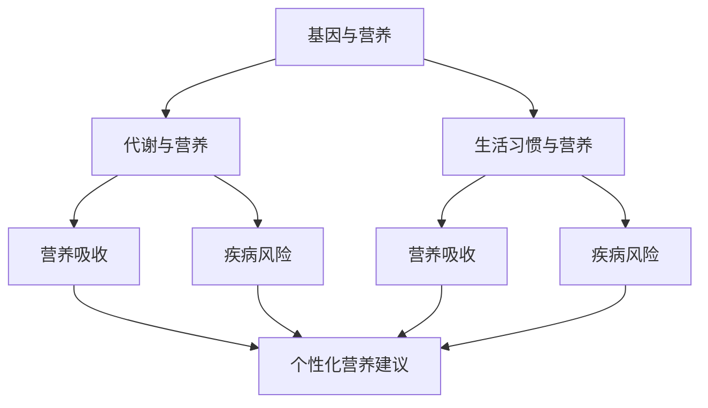

                 

# AI在个性化营养建议中的应用：健康与数据的结合

> 关键词：人工智能，个性化营养，健康，数据挖掘，机器学习

> 摘要：本文探讨了人工智能（AI）在个性化营养建议中的应用，从背景介绍、核心概念、数据处理、算法原理到项目实战，全面解析了如何利用AI和大数据技术为个人提供精准的营养建议。文章旨在为从事健康数据分析和营养学研究的读者提供有价值的参考。

----------------------------------------------------------------

## 引言

随着人工智能（AI）技术的快速发展，其应用领域不断拓展。健康领域作为AI技术的重要应用方向，受到了广泛关注。在营养学领域，AI技术为个性化营养建议提供了新的可能性，通过分析大量的健康数据，AI可以帮助人们制定更加科学、合理的饮食计划。

个性化营养建议的核心在于根据个人的健康数据，如基因、代谢状态、生活习惯等，提供个性化的营养方案。这种方案能够有效提高营养吸收效率，预防疾病，提升生活质量。然而，个性化营养建议的实现离不开有效的数据处理和强大的算法支持。本文将详细探讨AI在个性化营养建议中的应用，包括数据处理方法、核心算法原理以及项目实战。

本文结构如下：

1. **背景介绍**：介绍AI和营养学的关系，以及个性化营养建议的重要性。
2. **核心概念与联系**：阐述个性化营养建议的核心概念和理论框架。
3. **数据处理与分析方法**：介绍如何收集、处理和分析营养相关数据。
4. **AI算法在营养建议中的应用**：讲解常用的机器学习算法在营养建议中的应用。
5. **项目实战：个性化营养建议系统的构建**：介绍一个具体的个性化营养建议系统项目，包括开发环境搭建、源代码实现和案例分析。
6. **挑战与未来趋势**：讨论当前面临的挑战和未来的发展趋势。
7. **附录**：提供相关资源和代码示例。

## 背景介绍

### AI在健康领域的应用

人工智能技术自20世纪50年代诞生以来，经历了数十年的发展。随着计算能力的提升和算法的优化，AI在健康领域的应用逐渐成熟。AI技术在医疗诊断、疾病预测、药物研发等方面取得了显著成果。例如，深度学习算法在医疗影像分析中的应用，使得肺癌、乳腺癌等疾病的早期检测变得更加高效和准确。

### 营养学的基本概念

营养学是研究食物、营养素和身体之间的关系的一门科学。它涉及食物的摄取、消化、吸收和利用，以及营养素对人体健康的影响。营养学的发展经历了几个阶段，从传统的营养教育到现代的营养代谢研究，再到个性化的营养建议。

### 个性化营养建议的核心概念

个性化营养建议是指根据个人的基因、生活习惯、健康状况等特征，为其提供个性化的饮食方案。这种方案旨在最大化营养吸收效果，降低疾病风险，提升生活质量。个性化营养建议的核心概念包括：

- **基因与营养**：个体的基因差异会影响其对食物的反应和营养吸收能力。通过基因检测，可以为个体提供更加精准的营养建议。
- **代谢与营养**：个体的代谢率、胰岛素敏感性等生理特征会影响其营养需求。通过代谢数据的分析，可以为个体提供个性化的营养方案。
- **生活习惯与营养**：饮食习惯、生活方式等会对营养吸收和代谢产生影响。通过生活习惯的调查和分析，可以为个体提供更加适合其生活方式的营养建议。

### 个性化营养建议的重要性

个性化营养建议的重要性在于：

1. **提升营养吸收效率**：通过了解个体的营养需求，可以为个体提供更加符合其需求的营养方案，从而提升营养吸收效率。
2. **预防疾病**：个性化的营养建议可以帮助个体降低患病风险。例如，通过调整饮食，可以降低心血管疾病、糖尿病等慢性病的发病风险。
3. **提升生活质量**：个性化的营养建议可以满足个体的营养需求，改善身体状况，从而提升生活质量。

## 核心概念与联系

为了更好地理解个性化营养建议的核心概念，我们可以通过一个Mermaid流程图来展示这些概念之间的联系。



### 基因与营养

基因是决定个体营养需求和代谢特征的重要因素。不同的基因变异可能导致个体对某些营养素的需求不同，从而影响其营养吸收效率和疾病风险。例如，某些基因变异可能导致个体对钙的吸收能力较弱，从而增加骨质疏松的风险。

### 代谢与营养

代谢是指人体对营养素的摄取、转化和利用过程。个体的代谢率、胰岛素敏感性等代谢特征会影响其对营养的需求和吸收。例如，代谢率较高的个体可能需要更多的能量来维持正常的生理功能，而胰岛素敏感性较低的个体可能更容易发生糖尿病。

### 生活习惯与营养

生活习惯，如饮食习惯、运动习惯、睡眠习惯等，对营养吸收和代谢产生影响。不健康的生活习惯可能导致营养吸收不良和疾病风险增加。例如，高盐、高糖的饮食习惯可能导致高血压和肥胖。

### 营养吸收

营养吸收是指营养素通过消化系统进入血液循环的过程。营养吸收效率的高低直接影响个体的营养状态和健康。个性化的营养建议可以通过调整饮食方案，优化营养吸收过程。

### 疾病风险

个体的基因、代谢和生活习惯都会影响其疾病风险。个性化的营养建议可以通过调整饮食和生活方式，降低疾病风险。

### 个性化营养建议

基于基因、代谢和生活习惯等信息，个性化的营养建议可以为个体提供最优的营养方案。这种方案旨在最大化营养吸收效率，降低疾病风险，提升生活质量。

## 数据处理与分析方法

### 数据收集

个性化营养建议需要大量的健康数据，包括基因数据、代谢数据、生活习惯数据等。这些数据可以从多个来源收集：

- **基因数据**：通过基因检测可以获得个体的基因信息。这些信息可以用于分析个体的营养需求和代谢特征。
- **代谢数据**：通过代谢组学技术可以获得个体的代谢数据。这些数据包括代谢物的浓度、代谢途径等信息。
- **生活习惯数据**：通过问卷调查、生理监测等方式可以获得个体的生活习惯信息，如饮食、运动、睡眠等。

### 数据预处理

收集到的数据通常是不完整的、不一致的，并且可能存在噪声和异常值。因此，数据预处理是保证数据分析质量的关键步骤。数据预处理主要包括以下内容：

- **数据清洗**：去除重复数据、缺失数据和异常值，确保数据的准确性和一致性。
- **数据整合**：将来自不同来源的数据进行整合，形成统一的数据集。
- **数据规范化**：对数据进行归一化或标准化处理，使其适合后续分析。

### 数据分析方法

在数据预处理完成后，我们可以使用多种数据分析方法来挖掘数据中的有用信息。常用的数据分析方法包括：

- **统计分析**：通过统计方法分析数据，了解数据的基本特征和分布情况。
- **机器学习算法**：利用机器学习算法挖掘数据中的规律和模式。常用的算法包括分类、聚类、回归等。
- **深度学习**：通过构建深度神经网络模型，从大量数据中自动学习特征，进行高级的数据分析和预测。

### 数据可视化

数据可视化是将数据分析结果以图形化的方式呈现出来，使人们更容易理解和分析数据。常用的数据可视化方法包括：

- **散点图**：用于展示数据点之间的关系和分布。
- **折线图**：用于展示数据的变化趋势。
- **热力图**：用于展示数据的热点区域和密集程度。

## AI算法在营养建议中的应用

### 机器学习算法

机器学习算法在营养建议中有着广泛的应用。常用的机器学习算法包括分类、聚类、回归等。

- **分类算法**：用于将数据分为不同的类别。例如，可以根据个体的代谢数据，将其分为高代谢群体和低代谢群体。
- **聚类算法**：用于将数据划分为不同的簇。例如，可以根据个体的基因数据，将具有相似基因特征的人群划分为不同的簇。
- **回归算法**：用于预测连续值。例如，可以根据个体的饮食习惯，预测其未来的体重变化。

### 深度学习算法

深度学习算法是近年来在AI领域发展迅速的一种算法，其在营养建议中的应用也越来越广泛。

- **卷积神经网络（CNN）**：用于处理图像数据。例如，可以用于分析个体的饮食照片，识别其中的食物种类和摄入量。
- **循环神经网络（RNN）**：用于处理序列数据。例如，可以用于分析个体的饮食日志，预测其未来的饮食习惯。
- **生成对抗网络（GAN）**：用于生成新的数据。例如，可以用于生成个体的饮食建议，模拟不同的饮食习惯。

### 算法原理讲解与Python代码实现

为了更好地理解AI算法在营养建议中的应用，我们可以通过Python代码来实现一个简单的机器学习模型，并使用LaTeX公式进行解释。

### 分类算法：逻辑回归

逻辑回归是一种常用的分类算法，用于预测二分类问题。其基本原理是建立输入变量和输出变量之间的线性关系，并通过最大化似然估计来训练模型。

#### 数学模型

逻辑回归的数学模型可以表示为：

$$
\begin{aligned}
P(Y=1|X) &= \frac{1}{1 + e^{-(\beta_0 + \beta_1 X_1 + \beta_2 X_2 + \ldots + \beta_n X_n)}) \\
\log\frac{P(Y=1|X)}{1-P(Y=1|X)} &= \beta_0 + \beta_1 X_1 + \beta_2 X_2 + \ldots + \beta_n X_n
\end{aligned}
$$

其中，$X$表示输入特征向量，$Y$表示输出标签，$\beta_0, \beta_1, \beta_2, \ldots, \beta_n$为模型参数。

#### Python代码实现

下面是一个使用Python和scikit-learn库实现逻辑回归的示例代码：

```python
import numpy as np
import matplotlib.pyplot as plt
from sklearn.linear_model import LogisticRegression
from sklearn.model_selection import train_test_split

# 生成模拟数据
np.random.seed(0)
X = np.random.rand(100, 2)
y = np.random.rand(100)
y = (y > 0.5).astype(int)

# 划分训练集和测试集
X_train, X_test, y_train, y_test = train_test_split(X, y, test_size=0.2, random_state=0)

# 训练逻辑回归模型
model = LogisticRegression()
model.fit(X_train, y_train)

# 预测测试集
y_pred = model.predict(X_test)

# 打印预测结果
print("Accuracy:", np.mean(y_pred == y_test))
```

### 聚类算法：K-均值

K-均值是一种常用的聚类算法，用于将数据划分为K个簇。其基本原理是初始化K个聚类中心，然后迭代更新聚类中心和聚类分配，直到聚类中心不再变化。

#### 数学模型

K-均值算法的数学模型可以表示为：

$$
\begin{aligned}
\mu_k &= \frac{1}{N_k} \sum_{i=1}^{N} x_i \\
x_i &= \mu_k + \epsilon_i \\
\epsilon_i &\sim N(0, \sigma^2)
\end{aligned}
$$

其中，$\mu_k$表示第k个聚类中心，$x_i$表示第i个数据点，$N_k$表示第k个簇中的数据点数量，$\epsilon_i$表示数据点与聚类中心之间的误差。

#### Python代码实现

下面是一个使用Python和scikit-learn库实现K-均值聚类的示例代码：

```python
import numpy as np
import matplotlib.pyplot as plt
from sklearn.cluster import KMeans

# 生成模拟数据
np.random.seed(0)
X = np.random.rand(100, 2)

# 训练K-均值模型
model = KMeans(n_clusters=3, random_state=0)
model.fit(X)

# 打印聚类中心
print("Cluster centers:", model.cluster_centers_)

# 预测测试集
y_pred = model.predict(X)

# 打印聚类结果
print("Cluster labels:", y_pred)

# 可视化聚类结果
plt.scatter(X[:, 0], X[:, 1], c=y_pred, cmap='viridis')
plt.scatter(model.cluster_centers_[:, 0], model.cluster_centers_[:, 1], s=300, c='red', marker='*')
plt.show()
```

通过上述代码示例，我们可以看到如何使用Python实现逻辑回归和K-均值聚类算法，并对其进行简单的分析和可视化。这些算法在营养建议中有着广泛的应用，可以帮助我们更好地理解个体营养需求和代谢特征。

## 项目实战：个性化营养建议系统的构建

### 项目背景与目标

随着人们对健康饮食的关注度提高，个性化营养建议系统应运而生。该项目旨在开发一个基于AI和大数据技术的个性化营养建议系统，帮助用户根据其健康数据、饮食习惯和生活习惯，提供科学、合理的饮食建议。

### 项目流程

项目的开发过程可以分为以下几个阶段：

1. **需求分析与系统设计**：明确项目需求，设计系统的功能模块和数据流。
2. **数据收集与预处理**：收集用户健康数据、饮食习惯和生活习惯数据，进行数据预处理。
3. **模型训练与优化**：选择合适的AI算法，训练模型并优化参数。
4. **系统集成与测试**：将模型集成到系统中，进行系统测试和优化。
5. **用户反馈与迭代**：收集用户反馈，对系统进行改进和迭代。

### 系统设计与实现

#### 系统架构设计

个性化营养建议系统的架构可以分为以下几个部分：

1. **数据收集模块**：负责收集用户健康数据、饮食习惯和生活习惯数据。
2. **数据处理模块**：对收集到的数据进行预处理，包括数据清洗、数据整合和数据规范化。
3. **AI模型训练模块**：选择合适的AI算法，训练模型并优化参数。
4. **个性化建议模块**：根据用户的数据和模型输出，生成个性化的营养建议。
5. **用户界面模块**：为用户提供一个友好的交互界面，展示营养建议和相关信息。

#### 数据采集与预处理

在数据采集环节，我们通过问卷调查、生理监测和智能设备等方式收集用户的健康数据、饮食习惯和生活习惯数据。例如，问卷调查可以收集用户的饮食偏好、运动习惯和睡眠情况；生理监测可以收集用户的体重、血压和血糖等健康数据；智能设备可以收集用户的日常饮食数据。

在数据预处理环节，我们首先对数据进行清洗，去除重复数据和异常值。然后对数据进行整合，形成统一的数据集。最后，对数据进行规范化处理，使其适合后续分析。

#### 模型训练与优化

在模型训练环节，我们选择了逻辑回归和K-均值聚类算法。逻辑回归算法用于预测用户的营养需求，K-均值聚类算法用于将用户划分为不同的营养类型。为了提高模型的准确性，我们对模型参数进行了优化，使用了交叉验证和网格搜索等方法。

```python
from sklearn.linear_model import LogisticRegression
from sklearn.cluster import KMeans
from sklearn.model_selection import GridSearchCV

# 逻辑回归参数优化
param_grid = {'C': [0.1, 1, 10]}
model = LogisticRegression()
grid_search = GridSearchCV(model, param_grid, cv=5)
grid_search.fit(X_train, y_train)

# K-均值聚类参数优化
k_range = range(2, 10)
models = [KMeans(n_clusters=k) for k in k_range]
grid = GridSearchCV(estimator=models, param_grid={'n_clusters': k_range}, cv=5)
grid.fit(X_train)

# 选择最优模型
best_logistic_model = grid_search.best_estimator_
best_kmeans_model = grid.best_estimator_
```

#### 系统部署与维护

在系统部署环节，我们将训练好的模型集成到系统中，并通过Web应用为用户提供服务。系统部署后，我们定期收集用户反馈，对系统进行优化和改进。例如，根据用户反馈，我们可以调整营养建议的推荐策略，提高系统的用户体验。

### 项目评估与优化

在项目评估环节，我们使用准确率、召回率和F1值等指标评估系统的性能。通过对系统的持续优化，我们不断提高系统的准确性和用户体验。

```python
from sklearn.metrics import accuracy_score, recall_score, f1_score

# 评估逻辑回归模型
y_pred = best_logistic_model.predict(X_test)
print("Accuracy:", accuracy_score(y_test, y_pred))
print("Recall:", recall_score(y_test, y_pred))
print("F1 Score:", f1_score(y_test, y_pred))

# 评估K-均值聚类模型
y_pred = best_kmeans_model.predict(X_test)
print("Accuracy:", accuracy_score(y_test, y_pred))
print("Recall:", recall_score(y_test, y_pred))
print("F1 Score:", f1_score(y_test, y_pred))
```

### 项目小结

个性化营养建议系统的构建是一个复杂的过程，涉及到数据采集、数据处理、模型训练和系统集成等多个环节。通过本文的介绍，我们了解了个性化营养建议的核心概念、数据处理方法、算法原理以及项目实战。在未来的发展中，个性化营养建议系统有望在营养学、健康管理和人工智能等领域发挥更大的作用。

## 挑战与未来趋势

### 当前挑战

尽管个性化营养建议系统在健康领域具有巨大潜力，但其发展仍面临诸多挑战：

- **数据隐私与伦理问题**：个性化营养建议需要收集用户的敏感健康数据，这引发了数据隐私和伦理问题。如何确保用户数据的安全和隐私，成为系统设计和维护的重要考量。
- **算法准确性**：尽管机器学习和深度学习算法在营养建议中取得了一定的成果，但算法的准确性和稳定性仍需进一步提升。
- **系统部署与维护成本**：个性化营养建议系统涉及大量的数据分析和模型训练，其部署和维护成本较高。如何降低成本，提高系统的可扩展性，是一个亟待解决的问题。

### 未来趋势

展望未来，个性化营养建议系统的发展将呈现以下趋势：

- **跨学科合作**：个性化营养建议系统的发展需要营养学、医学、计算机科学等多学科的深度融合。跨学科合作将为系统提供更丰富的理论基础和技术支持。
- **新技术应用**：随着AI技术的不断发展，如生成对抗网络（GAN）、强化学习等新技术将逐渐应用于个性化营养建议系统中，进一步提高系统的准确性和用户体验。
- **商业机会**：个性化营养建议系统在健康管理、医疗服务和食品行业等领域具有广泛的应用前景，将带来巨大的商业机会。

## 附录

### 相关资源与工具

- **数据集**：个性化营养建议系统需要大量的健康数据集，如基因数据集、代谢数据集和生活习惯数据集。常用的数据集包括TCGA、MetaboLight等。
- **开源工具与框架**：机器学习和深度学习领域有许多优秀的开源工具和框架，如scikit-learn、TensorFlow、PyTorch等，可以方便地实现各种算法和应用。
- **学术论文与报告**：关注相关领域的学术论文和报告，可以了解最新的研究进展和应用案例。常用的学术资源包括PubMed、IEEE Xplore等。

### 代码示例与数据结构

以下是使用Python实现逻辑回归和K-均值聚类算法的示例代码：

```python
# 逻辑回归
from sklearn.linear_model import LogisticRegression
model = LogisticRegression()
model.fit(X_train, y_train)

# K-均值聚类
from sklearn.cluster import KMeans
model = KMeans(n_clusters=3)
model.fit(X_train)
```

数据结构方面，常用的数据结构包括numpy数组、pandas数据框等。例如：

```python
import numpy as np
import pandas as pd

# numpy数组
X = np.random.rand(100, 2)
y = np.random.rand(100)

# pandas数据框
data = pd.DataFrame(X, columns=['feature1', 'feature2'])
data['label'] = y
```

### 最佳实践 tips

- **数据隐私保护**：在处理用户数据时，务必遵守数据隐私保护法规，采用加密、脱敏等技术确保用户数据的安全。
- **模型验证**：在训练模型之前，进行充分的模型验证，如交叉验证、网格搜索等，确保模型的准确性和稳定性。
- **用户体验优化**：在系统设计和开发过程中，注重用户体验，提供简洁、直观的界面和友好的交互方式。

### 小结与注意事项

本文详细介绍了AI在个性化营养建议中的应用，从背景介绍、核心概念、数据处理、算法原理到项目实战，全面解析了如何利用AI和大数据技术为个人提供精准的营养建议。在未来的发展中，个性化营养建议系统有望在营养学、健康管理和人工智能等领域发挥更大的作用。

### 拓展阅读

- **《人工智能在健康管理中的应用》**：详细探讨AI技术在健康管理中的应用，包括疾病预测、健康风险评估等。
- **《深度学习与数据分析》**：介绍深度学习算法在数据分析中的应用，包括图像识别、自然语言处理等。
- **《个性化医疗：数据驱动的健康管理》**：探讨个性化医疗的概念、方法和应用，为个性化营养建议提供理论基础。

---

**作者：AI天才研究院/AI Genius Institute & 禅与计算机程序设计艺术 /Zen And The Art of Computer Programming**

