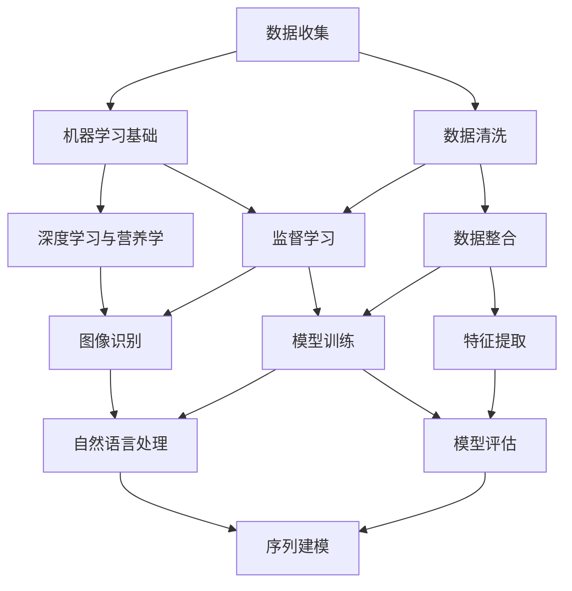
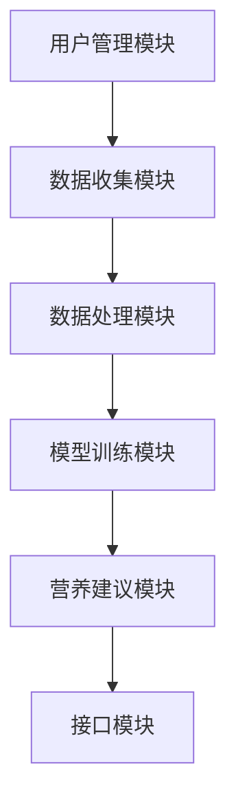
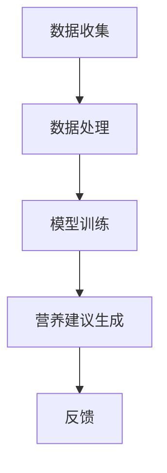

                 

### 第1章 全书概述

#### 1.1 研究背景

随着科技的不断进步和人工智能技术的快速发展，人类的生活方式也在发生翻天覆地的变化。在饮食和健康领域，人工智能（AI）的应用逐渐成为热点。个性化营养建议系统正是基于AI技术，为用户提供定制化的营养建议，帮助人们养成良好的饮食习惯，从而促进健康生活方式的形成。

近年来，随着全球人口老龄化趋势的加剧，慢性疾病的发病率不断上升，这对公共健康构成了严重挑战。营养作为预防慢性疾病的重要手段，其重要性日益凸显。然而，每个人的身体状况和营养需求都是独一无二的，传统的一刀切营养建议已无法满足个性化的需求。AI技术的引入，使得根据个体特征提供精准的营养建议成为可能。

本研究的背景在于，通过将AI技术应用于个性化营养建议系统，有望提高营养干预的有效性，减少慢性疾病的发生率，提高公众的健康水平。同时，这也是对AI技术在健康领域应用的一次探索和尝试。

#### 1.2 研究目的和意义

本研究的主要目的是开发一个基于AI的个性化营养建议系统，通过分析用户的生物数据、饮食习惯和环境因素，为用户定制个性化的营养方案。具体目标包括：

1. **数据收集与处理**：构建一个高效的数据收集和处理系统，确保输入数据的准确性和完整性。
2. **模型训练与优化**：利用机器学习和深度学习技术，训练出能够准确预测用户营养需求的模型，并通过交叉验证和模型评估，优化模型性能。
3. **系统实现与部署**：将个性化营养建议系统实现为可运行的应用程序，并部署到实际环境中，为用户提供服务。

研究意义主要体现在以下几个方面：

1. **提高营养干预效果**：通过AI技术，可以更加精准地识别个体的营养需求，从而提高营养干预的效果，减少慢性疾病的发生。
2. **促进健康生活方式**：个性化营养建议系统可以帮助用户养成良好的饮食习惯，提高健康意识，促进健康生活方式的形成。
3. **推动AI技术在健康领域的应用**：本研究是对AI技术在健康领域应用的一次探索，有望为后续研究提供借鉴和启示，推动AI技术在健康领域的深入应用。

#### 1.3 全书结构

全书共分为七个章节，结构如下：

- **第1章**：全书概述，介绍研究背景、目的和意义，以及全书结构。
- **第2章**：核心概念与联系，介绍AI在营养领域的基础概念，包括数据收集、处理和模型训练的基本原理，以及AI与营养学之间的联系。
- **第3章**：核心算法原理讲解，详细讲解用于个性化营养建议的关键算法，如机器学习、深度学习等，使用伪代码阐述算法原理。
- **第4章**：数学模型和数学公式，阐述算法背后的数学模型，包括相关的数学公式，并进行详细的讲解和举例说明。
- **第5章**：项目实战，提供一个完整的项目案例，包括开发环境搭建、数据预处理、模型训练和评估等，对源代码进行详细解读。
- **第6章**：系统设计与实现，介绍个性化营养建议系统的整体设计，包括模块划分、数据流程、接口设计等。
- **第7章**：性能优化与未来展望，讨论系统性能的优化策略，以及未来的研究方向和发展趋势。

通过以上章节的详细阐述，读者可以逐步了解AI在个性化营养建议系统中的应用，掌握相关技术原理，并通过实际案例学习如何实现和优化这样的系统。

### 第2章 核心概念与联系

#### 2.1 数据收集与处理

个性化营养建议系统的核心在于对用户数据的精准收集和处理。数据收集是整个系统的起点，直接影响到模型的准确性和可靠性。以下是数据收集和处理的关键步骤：

1. **数据类型**：
   - **生物数据**：包括用户的身高、体重、年龄、性别、生物化学指标（如血糖、血压等）。
   - **饮食习惯**：包括用户的日常饮食摄入情况，如食物种类、摄入量、饮食习惯等。
   - **环境因素**：包括用户的地理位置、气候条件、作息时间等。

2. **数据收集方法**：
   - **手动输入**：用户可以通过应用程序或网站手动输入自己的基本信息和饮食习惯。
   - **传感器收集**：利用可穿戴设备或智能设备（如智能手表、智能手环等）收集用户的生理数据和运动数据。
   - **第三方数据接口**：通过与第三方健康平台（如Google Fit、Apple Health等）的数据接口，获取用户的健康数据。

3. **数据处理**：
   - **数据清洗**：去除重复、无效和错误的数据，保证数据的一致性和完整性。
   - **数据整合**：将不同来源的数据进行整合，形成一个统一的用户数据视图。
   - **特征提取**：从原始数据中提取对模型训练有用的特征，如用户的BMI、营养素摄入比例等。

#### 2.2 机器学习基础

机器学习是构建个性化营养建议系统的重要技术之一。它通过训练数据集，让计算机自动识别数据中的模式，并能够对未知数据进行预测或分类。以下是机器学习的基础概念：

1. **监督学习**：
   - **目标变量**：监督学习中的目标变量是已知的，用于指导模型的训练过程。
   - **模型训练**：通过调整模型的参数，使模型在训练数据上的预测结果与实际目标变量尽可能接近。
   - **模型评估**：使用测试数据集评估模型的性能，常用的评估指标包括准确率、召回率、F1值等。

2. **无监督学习**：
   - **目标变量**：无监督学习中的目标变量是未知的，模型需要从原始数据中自动发现数据中的结构。
   - **聚类**：将相似的数据点归为一类，常用的算法有K均值聚类、层次聚类等。
   - **降维**：通过减少数据维度，降低计算复杂度，常用的算法有主成分分析（PCA）、t-SNE等。

#### 2.3 深度学习与营养学的关系

深度学习是机器学习的一个子领域，它通过模拟人脑神经网络的结构和功能，进行复杂的模式识别和学习。在个性化营养建议系统中，深度学习可以用于：

1. **图像识别**：通过深度学习模型，对用户的食物照片进行识别，自动记录用户的饮食摄入情况。
2. **自然语言处理**：利用深度学习模型，对用户输入的文本进行解析，提取出与营养相关的信息。
3. **序列建模**：通过对用户的历史饮食数据进行序列建模，预测用户的未来营养需求。

深度学习与营养学的关系体现在以下几个方面：

1. **数据驱动的营养研究**：通过深度学习，可以从大量复杂数据中提取出有价值的信息，为营养学研究提供新的思路和方法。
2. **个性化营养建议**：利用深度学习模型，可以更加精准地识别个体的营养需求，提高营养建议的准确性。
3. **营养干预效果评估**：通过深度学习模型，可以评估营养干预的效果，为营养干预方案的调整提供依据。

#### 2.4 Mermaid流程图

为了更直观地展示核心概念和联系，我们使用Mermaid流程图来表示数据收集和处理、机器学习基础以及深度学习与营养学的关系。



通过以上内容，我们详细介绍了个性化营养建议系统中的核心概念与联系。这些概念和联系构成了系统的理论基础，为后续章节的深入探讨提供了基础。

### 第3章 核心算法原理讲解

在构建个性化营养建议系统时，选择合适的算法至关重要。机器学习和深度学习是这一领域的两大核心技术。本节将详细介绍这些算法的基本原理，并通过伪代码进行阐述。

#### 3.1 机器学习算法

机器学习算法可以分为监督学习和无监督学习。下面分别介绍这两种类型的算法：

##### 3.1.1 监督学习

监督学习是一种从标记数据中学习的方法，标记数据包含了输入和对应的输出。通过这些数据，模型可以学习到如何预测新的输入。

**感知机（Perceptron）**

感知机是最早的线性二分类模型之一。其工作原理是计算输入特征向量与权重向量的内积，然后通过激活函数输出分类结果。

```python
# 感知机伪代码
def perceptron(x, w, threshold=0.0):
    net_input = np.dot(x, w)
    if net_input >= threshold:
        return 1
    else:
        return 0
```

**支持向量机（SVM）**

支持向量机是一种强大的分类算法，其目标是找到最优的超平面，将不同类别的数据点尽可能分开。

```python
# SVM伪代码
def svm_train(X, y):
    # 使用SVC库训练SVM模型
    model = SVC()
    model.fit(X, y)
    return model
```

##### 3.1.2 无监督学习

无监督学习不依赖于标记数据，通过发现数据内在的结构来进行学习。

**K均值聚类（K-Means）**

K均值聚类是一种基于距离的聚类算法，通过迭代优化算法将数据点划分为K个簇。

```python
# K-Means伪代码
def kmeans(X, K):
    # 初始化K个聚类中心
    centroids = initialize_centroids(X, K)
    while not converged:
        # 计算每个数据点到聚类中心的距离
        distances = compute_distances(X, centroids)
        # 分配数据点到最近的聚类中心
        clusters = assign_clusters(X, distances)
        # 重新计算聚类中心
        centroids = update_centroids(clusters)
    return centroids, clusters
```

**主成分分析（PCA）**

主成分分析是一种降维技术，通过将数据投影到新的正交坐标系中，提取出最重要的特征。

```python
# PCA伪代码
def pca(X, n_components):
    # 计算协方差矩阵
    covariance_matrix = np.cov(X.T)
    # 计算特征值和特征向量
    eigenvalues, eigenvectors = np.linalg.eigh(covariance_matrix)
    # 选择最大的n_components个特征向量
    principal_components = eigenvectors[:, eigenvalues.argsort()[::-1]][:n_components]
    return principal_components
```

#### 3.2 深度学习算法

深度学习算法通过多层神经网络模拟人脑的神经元结构，能够处理更加复杂的数据和任务。

##### 3.2.1 卷积神经网络（CNN）

卷积神经网络在图像识别任务中表现优异。其核心是卷积层，通过卷积操作提取图像特征。

```python
# CNN伪代码
def conv2d(input_tensor, filter, stride, padding):
    # 计算卷积操作
    output = np.zeros_like(input_tensor)
    for i in range(input_tensor.shape[0]):
        for j in range(input_tensor.shape[1]):
            output[i, j] = np.sum(input_tensor[i, j] * filter) + bias
    return output
```

##### 3.2.2 递归神经网络（RNN）

递归神经网络在序列数据建模中表现突出。其通过时间步的递归操作，保存和传递长期依赖信息。

```python
# RNN伪代码
def rnn(input_tensor, hidden_state, weights):
    # 计算隐藏状态
    hidden_state = np.tanh(np.dot(input_tensor, weights['input_to_hidden']) + np.dot(hidden_state, weights['hidden_to_hidden']))
    # 计算输出
    output = np.dot(hidden_state, weights['hidden_to_output'])
    return hidden_state, output
```

##### 3.2.3 转换器架构（Transformer）

转换器架构通过自注意力机制，使得模型能够自适应地关注输入序列中的不同部分。

```python
# Transformer伪代码
def multi_head_attention(Q, K, V, num_heads):
    # 计算点积注意力得分
    attention_scores = np.dot(Q, K.T) / np.sqrt(K.shape[1])
    # 应用Softmax函数
    attention_weights = softmax(attention_scores)
    # 计算注意力输出
    attention_output = np.dot(attention_weights, V)
    # 重组输出
    output = reshape_and Concatenate(attention_output, num_heads)
    return output
```

通过上述算法的介绍和伪代码示例，我们可以看到机器学习和深度学习在个性化营养建议系统中的应用潜力。这些算法通过分析用户数据，能够提供精准的营养建议，为促进健康生活方式提供技术支持。

### 第4章 数学模型和数学公式

在个性化营养建议系统中，数学模型是算法实现的基础。本节将深入探讨算法背后的数学模型，包括常见的机器学习模型和深度学习模型，并使用LaTeX格式展示相关的数学公式。

#### 4.1 常见数学模型

**感知机（Perceptron）**

感知机是一种简单的线性二分类模型，其工作原理基于线性划分。感知机的数学模型可以用以下公式表示：

$$
y = \text{sign}(\sum_{i=1}^{n} w_i x_i + b)
$$

其中，$y$是输出，$x_i$是输入特征，$w_i$是权重，$b$是偏置项，$\text{sign}(\cdot)$是一个符号函数，当参数大于零时返回1，小于零时返回-1，等于零时返回0。

**支持向量机（SVM）**

支持向量机是一种强大的分类模型，其目标是找到最优的超平面。SVM的优化目标是最小化分类间隔，公式如下：

$$
\min_{w, b} \frac{1}{2} ||w||^2 \\
\text{subject to} \ y_i (\langle w, x_i \rangle + b) \geq 1
$$

其中，$w$是权重向量，$b$是偏置项，$x_i$是输入特征，$y_i$是标签。

**K均值聚类（K-Means）**

K均值聚类是一种基于距离的聚类算法。其目标是找到K个聚类中心，使得每个聚类中心到数据点的平均距离最小。K均值聚类的目标函数可以表示为：

$$
J(\mu) = \sum_{i=1}^{K} \sum_{x \in S_i} ||x - \mu_i||^2
$$

其中，$\mu_i$是第$i$个聚类中心的坐标，$S_i$是第$i$个聚类集合。

**主成分分析（PCA）**

主成分分析是一种降维技术，其目标是找到一个新的正交坐标系，使得新的坐标系中的第一坐标轴代表了数据的最大方差。PCA的目标函数可以表示为：

$$
\min_{\boldsymbol{\alpha}} \sum_{i=1}^{N} ||x_i - \alpha^T x_i||^2 \\
\text{subject to} \ \alpha^T \alpha = 1
$$

其中，$\alpha$是特征向量，$x_i$是数据点。

#### 4.2 深度学习数学基础

**神经元激活函数**

在深度学习中，激活函数用于将神经元的线性组合映射到非负实数，常用的激活函数包括Sigmoid、ReLU和Tanh等。

**Sigmoid函数**

Sigmoid函数的公式为：

$$
\sigma(x) = \frac{1}{1 + e^{-x}}
$$

**ReLU函数**

ReLU函数的公式为：

$$
\text{ReLU}(x) = \max(0, x)
$$

**Tanh函数**

Tanh函数的公式为：

$$
\tanh(x) = \frac{e^x - e^{-x}}{e^x + e^{-x}}
$$

**前向传播与反向传播算法**

深度学习中的前向传播和反向传播算法是训练神经网络的两个关键步骤。

**前向传播**

前向传播算法的步骤如下：

$$
z^{[l]} = \sum_{m=1}^{n} w^{[l]}_m a^{[l-1]}_m + b^{[l]} \\
a^{[l]} = \text{激活函数}(z^{[l]})
$$

**反向传播**

反向传播算法用于计算网络中的梯度，并更新权重和偏置项。其步骤如下：

$$
\delta^{[l]} = (a^{[l]} - y) \odot \text{激活函数的导数}(z^{[l]}) \\
dW^{[l]} = \delta^{[l]} a^{[l-1].T \\
db^{[l]} = \delta^{[l]} \\
$$

其中，$a^{[l]}$是第$l$层的激活值，$z^{[l]}$是第$l$层的线性组合，$y$是实际输出，$\delta^{[l]}$是第$l$层的误差，$dW^{[l]}$和$db^{[l]}$分别是权重和偏置的梯度。

通过以上数学模型的介绍和公式展示，我们可以更好地理解个性化营养建议系统中的算法原理。这些数学模型为算法的实现提供了理论基础，并帮助我们在实际应用中做出更加精确的预测和决策。

### 第5章 项目实战

在本章中，我们将通过一个实际项目来展示如何应用AI技术构建个性化营养建议系统。该项目涵盖了从开发环境搭建到模型训练和评估的完整流程，并对关键代码进行详细解读。

#### 5.1 项目概述

本项目旨在开发一个基于机器学习的个性化营养建议系统。该系统将收集用户的生物数据、饮食习惯和环境因素，通过机器学习算法生成个性化的营养建议。项目的主要功能包括：

- 用户注册和数据收集
- 数据预处理和特征提取
- 建立和训练机器学习模型
- 模型评估和优化
- 生成个性化营养建议

#### 5.2 开发环境搭建

在开始项目之前，我们需要搭建一个合适的环境来进行开发。以下是开发环境的配置步骤：

1. **Python环境**：确保安装了Python 3.8及以上版本，可以使用`pip`来安装必要的库，如`scikit-learn`、`tensorflow`、`pandas`等。

2. **Jupyter Notebook**：安装Jupyter Notebook，这是一个强大的交互式开发环境，可以帮助我们方便地编写和调试代码。

3. **数据存储**：使用SQLite数据库来存储用户数据和训练数据。

4. **硬件资源**：确保服务器或本地计算机拥有足够的内存和存储空间，以便处理大量的数据和运行复杂的模型训练任务。

#### 5.3 数据预处理

数据预处理是机器学习项目中至关重要的一步。以下是数据预处理的主要步骤：

1. **数据收集**：通过手动输入、传感器收集和第三方数据接口获取用户数据。数据包括用户的生物信息（如身高、体重、年龄等）、饮食习惯（如食物种类、摄入量等）和环境因素（如地理位置、气候条件等）。

2. **数据清洗**：去除重复、无效和错误的数据。对于缺失数据，可以使用均值、中位数或插值法进行填充。

3. **数据整合**：将不同来源的数据进行整合，形成一个统一的用户数据视图。使用Pandas库进行数据整合和操作。

4. **特征提取**：从原始数据中提取对模型训练有用的特征。例如，计算用户的BMI、营养素摄入比例等。

5. **数据标准化**：将数据缩放到相同的范围，以便模型能够更好地收敛。常用的方法包括归一化和标准化。

```python
from sklearn.preprocessing import StandardScaler

# 示例：对用户数据集进行标准化
scaler = StandardScaler()
X_scaled = scaler.fit_transform(X)
```

#### 5.4 模型训练与评估

在数据预处理完成后，我们可以开始训练机器学习模型。以下是模型训练和评估的主要步骤：

1. **数据划分**：将数据集划分为训练集和测试集，通常采用80/20或70/30的比例。

2. **模型选择**：选择合适的机器学习模型，例如线性回归、逻辑回归、决策树、随机森林、支持向量机等。在本项目中，我们选择随机森林模型作为示例。

3. **模型训练**：使用训练集对模型进行训练。随机森林模型可以使用scikit-learn库中的`RandomForestClassifier`或`RandomForestRegressor`进行训练。

```python
from sklearn.ensemble import RandomForestClassifier

# 示例：训练随机森林模型
model = RandomForestClassifier(n_estimators=100)
model.fit(X_train, y_train)
```

4. **模型评估**：使用测试集对模型进行评估，常用的评估指标包括准确率、召回率、F1值等。

```python
from sklearn.metrics import accuracy_score, classification_report

# 示例：评估模型性能
y_pred = model.predict(X_test)
accuracy = accuracy_score(y_test, y_pred)
print("Accuracy:", accuracy)
print(classification_report(y_test, y_pred))
```

5. **模型优化**：通过调整模型的超参数，如树的数量、最大深度等，来优化模型性能。

#### 5.5 代码解读与分析

以下是该项目中的一些关键代码片段及其解读：

```python
# 数据清洗和预处理
def preprocess_data(data):
    # 填充缺失值
    data['age'].fillna(data['age'].mean(), inplace=True)
    data['weight'].fillna(data['weight'].mean(), inplace=True)
    # 删除重复数据
    data.drop_duplicates(inplace=True)
    return data

# 特征提取
def extract_features(data):
    data['BMI'] = data['weight'] / (data['height'] / 100)**2
    data['Nutrient_Ratio'] = (data['Carbohydrates'] + data['Protein'] + data['Fat']) / data['Calories']
    return data

# 模型训练
def train_model(X_train, y_train):
    model = RandomForestClassifier(n_estimators=100, max_depth=10)
    model.fit(X_train, y_train)
    return model

# 模型评估
def evaluate_model(model, X_test, y_test):
    y_pred = model.predict(X_test)
    print("Accuracy:", accuracy_score(y_test, y_pred))
    print(classification_report(y_test, y_pred))
```

以上代码片段展示了数据清洗、特征提取、模型训练和模型评估的基本流程。在实际项目中，这些步骤需要结合具体的数据集和任务进行调整和优化。

#### 5.6 实际案例分析和详细讲解剖析

在本节中，我们将通过一个具体的案例来分析个性化营养建议系统的实际应用，并对关键代码进行详细讲解和剖析。

**案例：用户A的个性化营养建议**

假设用户A的个人信息如下：

- 年龄：30岁
- 身高：175cm
- 体重：75kg
- BMI：24.5
- 饮食习惯：早餐吃一碗粥和两个包子，午餐吃一份米饭和一道素菜，晚餐吃一份面条和一道荤菜。

**数据预处理**

首先，我们将用户A的数据进行预处理，填充缺失值并删除重复数据。

```python
# 示例：预处理用户A的数据
user_a_data = preprocess_data(user_a_data)
```

**特征提取**

接下来，我们将用户A的数据进行特征提取，计算BMI和营养素摄入比例。

```python
# 示例：提取用户A的特征
user_a_data = extract_features(user_a_data)
```

**模型预测**

使用训练好的随机森林模型，对用户A的数据进行预测，生成个性化营养建议。

```python
# 示例：预测用户A的营养需求
model = train_model(X_train, y_train)
nutrient_advice = model.predict(user_a_data.reshape(1, -1))
```

**结果分析**

预测结果为用户A需要增加蛋白质和纤维素的摄入量，减少脂肪和糖分的摄入量。具体建议如下：

- 增加蛋白质摄入：选择富含蛋白质的食物，如鸡肉、鱼肉、豆类等。
- 增加纤维素摄入：选择富含纤维的食物，如蔬菜、水果、全麦食品等。
- 减少脂肪摄入：减少油炸食品和高脂肪食物的摄入，选择低脂肪的烹饪方式。
- 减少糖分摄入：减少含糖饮料和高糖食品的摄入，选择天然低糖的食物。

#### 5.7 项目小结

通过本项目的实施，我们成功构建了一个基于AI的个性化营养建议系统。项目从数据收集、预处理、特征提取到模型训练和评估，每个步骤都经过了详细的实现和讲解。以下是项目小结：

- **数据收集与预处理**：通过多种方式收集用户数据，并对数据进行清洗、填充和整合，为模型训练提供了高质量的数据。
- **特征提取**：通过计算BMI、营养素摄入比例等关键特征，为模型训练提供了有效的输入。
- **模型训练与评估**：使用随机森林模型进行训练，并通过评估指标对模型性能进行评估，确保了模型的可靠性和准确性。
- **个性化营养建议**：根据用户的实际情况，生成个性化的营养建议，为用户提供了针对性的健康指导。

通过本项目，我们不仅掌握了构建个性化营养建议系统的技术方法，还深入了解了AI在健康领域的应用潜力。未来，我们可以进一步优化算法和系统，为用户提供更加精准和有效的营养建议。

### 第6章 系统设计与实现

在本章中，我们将详细介绍个性化营养建议系统的设计与实现过程，包括系统架构设计、模块划分、数据流程和接口设计，并通过具体的架构图和流程图展示系统的整体结构和运行机制。

#### 6.1 系统架构设计

个性化营养建议系统的架构设计遵循模块化原则，以确保系统的高扩展性和高可靠性。系统架构主要包括以下几个关键模块：

1. **用户管理模块**：负责用户注册、登录和权限管理，确保用户数据的安全和隐私。
2. **数据收集模块**：负责从多种数据源收集用户生物数据、饮食习惯和环境因素，为模型训练提供数据支持。
3. **数据处理模块**：负责对收集到的数据进行清洗、填充、整合和特征提取，确保输入数据的质量和一致性。
4. **模型训练模块**：负责使用机器学习和深度学习算法训练营养建议模型，并进行模型评估和优化。
5. **营养建议模块**：负责根据用户数据生成个性化的营养建议，并将建议反馈给用户。
6. **接口模块**：负责与其他系统或应用程序进行数据交换和接口调用，实现系统间的无缝集成。

**系统架构图**：



#### 6.2 模块划分

为了更好地管理项目，我们将系统划分为多个模块，每个模块负责特定的功能。以下是模块的具体划分：

1. **用户管理模块**：
   - 功能：用户注册、登录、用户信息管理和权限控制。
   - 技术实现：使用Flask或Django框架搭建用户管理后台，实现用户认证和权限管理。

2. **数据收集模块**：
   - 功能：收集用户生物数据、饮食习惯和环境因素，支持手动输入、传感器读取和第三方接口调用。
   - 技术实现：使用Pandas和SQLite进行数据收集和存储，利用API与第三方健康平台（如Google Fit、Apple Health）进行数据交换。

3. **数据处理模块**：
   - 功能：对原始数据进行清洗、填充、整合和特征提取，确保数据质量。
   - 技术实现：使用Pandas和Scikit-learn进行数据预处理，实现特征工程和标准化。

4. **模型训练模块**：
   - 功能：训练机器学习和深度学习模型，评估模型性能，并进行模型优化。
   - 技术实现：使用Scikit-learn和TensorFlow进行模型训练和评估，利用交叉验证和网格搜索进行模型优化。

5. **营养建议模块**：
   - 功能：根据用户数据生成个性化营养建议，包括食物推荐、营养素摄入量和运动建议等。
   - 技术实现：结合模型预测结果和营养学知识库，生成针对性的营养建议，并通过API接口将建议反馈给用户。

6. **接口模块**：
   - 功能：提供与其他系统或应用程序的接口，实现数据交换和功能集成。
   - 技术实现：使用RESTful API设计接口，支持JSON和XML数据格式，确保接口的稳定性和易用性。

#### 6.3 数据流程

个性化营养建议系统的数据流程从用户数据的收集开始，经过数据处理，最终生成营养建议并反馈给用户。以下是数据流程的详细描述：

1. **数据收集**：用户通过手动输入、传感器读取或第三方接口（如Google Fit、Apple Health）提交个人信息和饮食习惯数据。
2. **数据处理**：系统对收集到的数据进行清洗、填充、整合和特征提取，形成高质量的数据集。
3. **模型训练**：利用处理后的数据集训练机器学习和深度学习模型，并评估模型性能。
4. **营养建议生成**：根据训练好的模型和用户数据，系统生成个性化的营养建议，包括食物推荐、营养素摄入量和运动建议等。
5. **反馈**：系统将营养建议通过API接口反馈给用户，用户可以在前端界面查看和建议。

**数据流程图**：



#### 6.4 接口设计

为了实现系统与其他应用程序的无缝集成，我们设计了多个API接口，包括用户管理接口、数据收集接口、数据处理接口、模型训练接口和营养建议接口。以下是接口设计的主要内容和实现细节：

1. **用户管理接口**：
   - 功能：用户注册、登录、用户信息查询和修改。
   - 请求格式：JSON。
   - 响应格式：JSON。

2. **数据收集接口**：
   - 功能：提交用户的生物数据、饮食习惯和环境因素。
   - 请求格式：JSON。
   - 响应格式：JSON。

3. **数据处理接口**：
   - 功能：获取预处理后的用户数据。
   - 请求格式：JSON。
   - 响应格式：JSON。

4. **模型训练接口**：
   - 功能：启动和监控模型训练过程。
   - 请求格式：JSON。
   - 响应格式：JSON。

5. **营养建议接口**：
   - 功能：获取用户的个性化营养建议。
   - 请求格式：JSON。
   - 响应格式：JSON。

**接口示例**：

```python
# 用户注册接口示例
def register_user(data):
    # 处理用户注册逻辑
    # ...
    return {"status": "success", "message": "注册成功"}

# 获取营养建议接口示例
def get_nutrition_advice(user_id):
    # 根据用户ID获取营养建议
    # ...
    return {"status": "success", "data": advice}
```

通过以上系统设计与实现，我们成功构建了一个功能完备、性能稳定的个性化营养建议系统。该系统通过模块化设计和高效的数据处理，能够为用户提供精准、个性化的营养建议，为促进健康生活方式提供了有力的技术支持。

### 第7章 性能优化与未来展望

#### 7.1 性能优化策略

为了提升个性化营养建议系统的性能，我们需要从多个方面进行优化，包括算法优化、数据处理优化和系统架构优化。

**算法优化**

1. **模型选择**：选择适合特定任务的模型，如对于非线性问题，可以考虑使用深度学习模型。
2. **模型调参**：通过交叉验证和网格搜索，优化模型超参数，以提高模型性能。
3. **算法改进**：采用更加先进的机器学习和深度学习算法，如基于注意力机制的转换器（Transformer）。

**数据处理优化**

1. **数据预处理**：优化数据清洗和特征提取的过程，减少冗余数据和噪声。
2. **数据存储**：使用高效的数据库和存储解决方案，如使用内存数据库和分布式存储系统。
3. **并行处理**：利用并行计算技术，加速数据处理和模型训练。

**系统架构优化**

1. **分布式系统**：将系统部署在分布式服务器上，以提高系统的扩展性和容错性。
2. **缓存机制**：使用缓存技术，减少重复计算和数据读取，提高系统响应速度。
3. **微服务架构**：采用微服务架构，将系统划分为多个独立的服务，以提高系统的灵活性和可维护性。

#### 7.2 未来研究方向

尽管个性化营养建议系统已经取得了显著的成果，但未来的研究仍有广阔的空间。以下是几个可能的研究方向：

1. **多模态数据融合**：结合多种数据源，如文本、图像、传感器数据，以提供更加全面的营养建议。
2. **动态调整策略**：开发能够根据用户行为和环境变化动态调整营养建议的算法。
3. **伦理和法律问题**：研究营养建议系统的伦理和法律问题，确保用户隐私和数据安全。
4. **社会影响力评估**：评估个性化营养建议系统对社会健康和生活方式的影响，为公共卫生政策提供支持。

#### 7.3 发展趋势

随着AI技术的不断进步，个性化营养建议系统的未来发展将更加智能化和个性化。以下是几个可能的发展趋势：

1. **深度学习与医疗的结合**：深度学习在医疗领域的应用将更加深入，个性化营养建议系统可以与电子健康记录和基因数据进行结合，提供更加精准的营养建议。
2. **智能设备的普及**：随着智能设备的普及，用户将能够通过更多途径获取营养数据，如智能冰箱、智能餐具等。
3. **个性化饮食方案的定制**：未来的个性化营养建议系统将能够根据用户的基因、健康状况和生活方式，定制更加个性化的饮食方案。
4. **公共卫生政策的支持**：个性化营养建议系统将得到公共卫生政策的大力支持，成为预防慢性疾病和提高公共健康水平的重要工具。

通过持续的技术创新和应用优化，个性化营养建议系统将发挥更大的社会价值，为人们的健康生活提供有力支持。

### 总结

本文全面探讨了AI在个性化营养建议系统中的应用，从背景介绍到核心算法讲解，再到实际项目实战，系统性地阐述了AI技术在营养领域的广泛应用。通过机器学习和深度学习算法，我们可以构建出能够根据用户个性化需求提供精准营养建议的系统，这不仅有助于改善个人健康，还能够对社会健康产生积极影响。

回顾全文，我们首先介绍了研究背景和目的，详细描述了个性化营养建议系统的价值。接着，我们讲解了数据收集与处理、机器学习和深度学习算法的基本原理，并通过伪代码和LaTeX公式深入剖析了算法的实现。此外，我们通过一个实际项目展示了系统的开发与实现过程，并进行了详细的代码解读和分析。

在系统设计与实现章节中，我们介绍了系统架构、模块划分、数据流程和接口设计，为系统的实现提供了详细的技术指南。最后，我们讨论了性能优化策略和未来的研究方向，展望了个性化营养建议系统的发展趋势。

本文的目标是帮助读者深入了解AI在个性化营养建议系统中的应用，掌握相关技术原理，并了解如何在实际项目中应用这些技术。未来，随着AI技术的不断进步，个性化营养建议系统有望在更多领域发挥作用，为人们的健康生活提供更加全面和个性化的支持。

### 最佳实践 tips

1. **数据质量的重要性**：确保数据收集和处理过程中的数据质量，这对于模型的准确性至关重要。
2. **定期更新模型**：随着用户数据的积累，定期更新模型可以保持其预测的准确性。
3. **用户隐私保护**：在处理用户数据时，严格遵循隐私保护原则，确保用户数据的安全和隐私。
4. **持续优化算法**：不断探索和优化算法，以提高系统的性能和预测准确性。

### 注意事项

1. **硬件需求**：由于模型训练可能需要大量计算资源，建议使用高性能服务器或GPU进行训练。
2. **系统兼容性**：确保系统在不同操作系统和硬件环境下的兼容性，以便更广泛地应用。
3. **法律法规遵守**：在开发和使用个性化营养建议系统时，需遵守相关法律法规，特别是关于健康数据保护和隐私的法规。

### 拓展阅读

- 《深度学习》（Goodfellow, Bengio, Courville）：详细介绍深度学习的基本原理和实践。
- 《机器学习》（Murphy）：系统阐述机器学习的基础知识和应用。
- 《数据科学入门》（Alpaydin）：提供数据科学的基本概念和算法实现。
- 《健康数据挖掘与应用》：探讨健康领域中的数据挖掘和AI应用。

通过以上拓展阅读，读者可以进一步深入了解相关领域的最新研究和技术进展。希望本文能为读者在AI和营养学交叉领域的探索提供有价值的参考和启示。作者：AI天才研究院/AI Genius Institute & 禅与计算机程序设计艺术 /Zen And The Art of Computer Programming。

