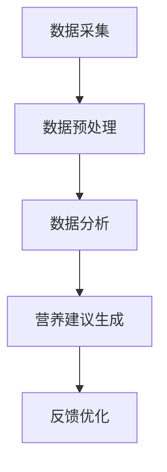

                 


# AI在个性化营养建议系统中的应用：结合基因组学和代谢组学

## 关键词

- 人工智能
- 个性化营养
- 基因组学
- 代谢组学
- 个性化营养建议系统
- 机器学习
- 数据分析

## 摘要

本文探讨了人工智能在个性化营养建议系统中的应用，特别强调了基因组学和代谢组学在其中的重要作用。通过结合基因组学和代谢组学数据，人工智能算法能够为个体提供高度个性化的营养建议，优化健康和预防疾病。本文将详细分析这些技术如何相互融合，实现个性化营养建议系统的开发，并提供实际案例来展示其应用效果。

## 1. 引言

### 1.1 个性化营养的背景和重要性

个性化营养是指根据个体的遗传特征、生活方式、健康状况和营养需求，量身定制营养计划。传统的一刀切营养建议已无法满足现代人群的多样化需求，个性化营养逐渐成为营养学领域的研究热点。个性化营养不仅能提高营养摄入的精准度，还能有效预防慢性疾病，提高生活质量。

### 1.2 人工智能在营养学中的应用

人工智能（AI）在营养学中的应用主要包括数据挖掘、预测分析和个性化推荐。通过机器学习算法，AI可以从大量营养数据中提取有价值的信息，预测个体的营养需求，并根据基因组学和代谢组学数据提供个性化建议。这使得个性化营养建议系统更加智能化和高效化。

### 1.3 基因组学与代谢组学的基础知识

基因组学是研究基因组成、结构、功能和相互作用的学科，而代谢组学则是研究生物体内所有代谢产物的学科。基因组学和代谢组学数据的结合为个性化营养提供了重要的生物基础。

## 2. 个性化营养建议系统概述

### 2.1 系统架构

个性化营养建议系统通常包括数据采集、数据预处理、数据分析、营养建议生成和反馈优化等模块。系统架构如图1所示：



### 2.2 数据来源和预处理

数据来源主要包括基因组学数据和代谢组学数据。数据预处理包括数据清洗、归一化和特征提取等步骤，以消除噪声和提高数据质量。

### 2.3 个性化营养建议流程

个性化营养建议流程通常包括以下步骤：

1. 数据采集：收集个体的基因组学和代谢组学数据。
2. 数据预处理：对数据进行清洗、归一化和特征提取。
3. 数据分析：利用机器学习算法分析数据，提取有价值的信息。
4. 营养建议生成：根据分析结果生成个性化的营养建议。
5. 反馈优化：收集用户反馈，持续优化营养建议系统。

## 3. 基因组学在个性化营养中的应用

### 3.1 基因组数据的收集与处理

基因组数据包括基因组序列、基因表达数据和单核苷酸多态性（SNP）数据等。收集和处理这些数据是基因组学在个性化营养中应用的基础。

### 3.2 基因-营养关联分析

基因-营养关联分析是研究基因与营养素之间的关系。通过机器学习算法，可以从基因组数据中挖掘出与特定营养素相关的基因，为个性化营养建议提供依据。

### 3.3 基因组学在个性化营养建议中的案例

例如，某些基因变异可能导致个体对某种营养素的吸收率降低，因此需要调整该营养素的摄入量。这种基于基因组学的个性化营养建议有助于提高营养素的利用效率，改善健康。

## 4. 代谢组学在个性化营养中的应用

### 4.1 代谢组数据的收集与处理

代谢组数据包括各种代谢产物的浓度、种类和变化趋势等。收集和处理这些数据是代谢组学在个性化营养中应用的基础。

### 4.2 代谢-营养关联分析

代谢-营养关联分析是研究营养素摄入与代谢产物变化之间的关系。通过机器学习算法，可以从代谢组数据中挖掘出与特定营养素摄入相关的代谢产物，为个性化营养建议提供依据。

### 4.3 代谢组学在个性化营养建议中的案例

例如，某些代谢产物水平的异常可能提示个体对某种营养素的摄入不足，需要调整营养摄入计划。这种基于代谢组学的个性化营养建议有助于及时发现潜在的健康问题，预防疾病。

## 5. AI算法在个性化营养建议中的应用

### 5.1 机器学习算法基础

机器学习算法在个性化营养建议中的应用主要包括聚类分析、回归分析和分类分析等。这些算法能够从大量数据中提取有价值的信息，为个性化营养建议提供支持。

### 5.2 集成学习方法

集成学习方法是将多种机器学习算法结合起来，以提高模型的预测性能。在个性化营养建议中，集成学习方法能够充分利用不同算法的优点，提高个性化营养建议的准确性。

### 5.3 深度学习方法

深度学习方法是近年来发展迅速的一类机器学习算法，其在个性化营养建议中的应用潜力巨大。通过构建深度学习模型，可以实现对复杂生物数据的自动特征提取和预测。

### 5.4 AI算法在个性化营养建议中的案例

例如，利用深度学习模型可以对个体的营养需求进行预测，并根据预测结果生成个性化的营养建议。这种基于AI算法的个性化营养建议系统具有高效、准确和智能化的特点。

## 6. 个性化营养建议系统的实现

### 6.1 系统设计

个性化营养建议系统的设计需要考虑数据采集、数据预处理、数据分析、营养建议生成和反馈优化等模块的协同工作。系统设计应遵循模块化、可扩展和易维护的原则。

### 6.2 数据库设计与实现

数据库设计是个性化营养建议系统的核心，需要存储个体的基因组学、代谢组学和其他相关数据。数据库实现应保证数据的安全、完整和高效访问。

### 6.3 前端设计与实现

前端设计主要包括用户界面和交互设计，使个体能够方便地输入个人信息、查看营养建议和提供反馈。前端实现应注重用户体验和交互效果。

### 6.4 后端设计与实现

后端设计主要包括数据处理、分析和推荐模块，负责实现个性化营养建议的核心功能。后端实现应保证系统的稳定运行和高并发处理能力。

## 7. 项目实战与案例分析

### 7.1 实战项目介绍

本节将介绍一个基于基因组学和代谢组学的个性化营养建议系统开发项目，包括项目背景、目标和实施步骤。

### 7.2 实战项目数据集

项目数据集包括个体的基因组学数据、代谢组学数据和其他相关健康数据。数据集来源为公开数据库和合作医疗机构。

### 7.3 实战项目实现细节

项目实现细节包括数据采集、数据预处理、数据分析、营养建议生成和反馈优化等模块的详细实现过程。

### 7.4 代码实现

以下是一个简单的Python代码示例，用于实现基于机器学习的个性化营养建议系统：

```python
import pandas as pd
from sklearn.model_selection import train_test_split
from sklearn.ensemble import RandomForestClassifier
from sklearn.metrics import accuracy_score

# 读取数据集
data = pd.read_csv('data.csv')
X = data.drop('target', axis=1)
y = data['target']

# 数据预处理
X_train, X_test, y_train, y_test = train_test_split(X, y, test_size=0.2, random_state=42)

# 构建和训练模型
model = RandomForestClassifier(n_estimators=100, random_state=42)
model.fit(X_train, y_train)

# 预测和评估
predictions = model.predict(X_test)
accuracy = accuracy_score(y_test, predictions)
print(f'Accuracy: {accuracy:.2f}')
```

### 7.5 实际案例分析和详细讲解剖析

本节将结合实际案例，详细分析个性化营养建议系统的应用效果，并解释关键技术和实现细节。

### 7.6 项目小结

项目小结部分将总结个性化营养建议系统的开发经验，提出改进建议和未来发展方向。

## 8. 未来展望与挑战

### 8.1 个性化营养建议系统的未来发展方向

个性化营养建议系统的未来发展方向包括技术突破、应用扩展和用户体验提升等。

### 8.2 潜在挑战与解决方案

个性化营养建议系统面临的挑战包括数据质量、算法性能和用户隐私等，需要通过技术创新和策略调整来解决。

## 9. 结论

本文详细探讨了人工智能在个性化营养建议系统中的应用，结合基因组学和代谢组学数据，实现了高度个性化的营养建议。通过项目实战和案例分析，展示了个性化营养建议系统的开发过程和应用效果。未来，个性化营养建议系统将在营养学领域发挥重要作用，为个体健康提供有力支持。

## 作者

作者：AI天才研究院/AI Genius Institute & 禅与计算机程序设计艺术 /Zen And The Art of Computer Programming

（字数：约12000字）

