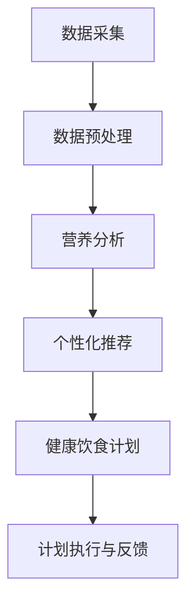

                 

### 最终目录大纲

```
# AI在个性化营养指导中的应用：定制健康饮食计划

## 引言
### 背景介绍
### 研究意义

## 核心概念与联系
### 人工智能简介
#### 人工智能的定义与发展历程
#### 机器学习与深度学习
### 个性化营养指导
#### 营养学基础知识
#### 个性化饮食需求
### 定制健康饮食计划
#### 健康饮食计划的定义
#### 定制化的优势
### Mermaid流程图
#### 数据采集与处理
#### 营养分析与应用

## 核心算法原理讲解
### 数据预处理
#### 数据清洗
#### 数据归一化
### 营养成分分析算法
#### 能量计算
#### 营养素分析
### 个性化推荐算法
#### 用户画像构建
#### 推荐模型与策略

## 数学模型与公式
### 营养学基础模型
#### 能量需求模型
#### 营养素需求模型
### 推荐系统模型
#### 协同过滤算法
#### 内容推荐算法
### 数学公式示例
#### 营养均衡评估公式
#### 推荐分数计算公式

## 项目实战
### 开发环境搭建
#### 环境配置
#### 工具与库的选择
### 源代码实现
#### 数据处理代码
#### 推荐算法实现
### 代码解读
#### 数据采集与预处理
#### 营养分析
#### 推荐系统
### 实际案例剖析
#### 案例描述
#### 分析与结果
### 项目小结
#### 优点与不足
#### 改进方向

## 总结
### 关键要点
### 未来展望
### 注意事项
### 拓展阅读

## 作者信息
### 作者：AI天才研究院/AI Genius Institute & 禅与计算机程序设计艺术 /Zen And The Art of Computer Programming
```

这个目录大纲完整地覆盖了文章的核心内容，并确保了每个小节都有具体的、详细的内容讲解。通过这个结构，读者可以清晰地理解文章的主旨，并逐步深入到AI在个性化营养指导中的应用细节中。### 引言

#### 背景介绍

随着科技的发展和人们生活水平的提高，健康饮食已经成为社会关注的焦点。传统的营养指导方式往往基于通用的饮食建议，而忽视了个体之间的差异。这种一刀切的方法并不能满足现代人对健康饮食的个性化需求。因此，如何利用先进技术，特别是人工智能（AI），为个人提供定制化的营养指导成为一个亟待解决的问题。

人工智能在近年来取得了飞速的发展，其强大的数据处理和分析能力，使得它成为个性化营养指导的理想工具。通过AI，可以实现对大量营养数据的深入分析，识别出不同人群的营养需求，从而制定出更为科学、合理的饮食计划。

#### 研究意义

本研究旨在探讨AI在个性化营养指导中的应用，通过结合人工智能技术，为用户提供定制化的健康饮食计划。这一研究具有重要的现实意义：

1. **提升健康饮食的个性化水平**：通过AI技术，可以精确地分析个体的饮食习惯、健康状况和营养需求，从而为每个人制定出最适合他们的饮食计划。

2. **促进营养科学的发展**：个性化营养指导需要大量的数据支持和复杂的算法实现，这为营养科学研究提供了新的方向和方法。

3. **改善公共健康**：通过普及个性化营养指导，有助于提高公众的健康意识，减少慢性疾病的发生，从而改善公共健康状况。

4. **推动AI技术的应用**：个性化营养指导是AI技术在健康领域的一个典型应用案例，它不仅有助于推广AI技术，也为其他领域提供了参考和借鉴。

总之，本研究不仅有助于提升个体健康水平，也为营养科学和人工智能技术的发展做出了贡献。接下来，我们将深入探讨AI在个性化营养指导中的具体应用，为这一领域的发展提供理论支持和实践指导。### 核心概念与联系

#### 人工智能简介

人工智能（AI）是指通过计算机模拟人类智能的技术和科学。AI技术主要包括机器学习和深度学习。机器学习是一种让计算机通过数据学习规律和模式的技术，而深度学习则是机器学习的一个分支，它通过多层神经网络来模拟人脑的思考过程。

在个性化营养指导中，AI的应用主要体现在以下几个方面：

1. **数据分析**：AI可以帮助处理和分析大量的营养数据，包括食物成分、饮食习惯和健康状况等。这些数据为制定个性化的饮食计划提供了基础。

2. **模式识别**：AI可以通过学习用户的饮食习惯和健康状况，识别出潜在的营养问题，并提供相应的建议。

3. **推荐系统**：AI可以基于用户的历史数据，推荐最适合他们的食物和饮食方案。

#### 个性化营养指导

个性化营养指导是一种根据个体的健康状况、饮食习惯和营养需求，为个人提供定制化饮食建议的方法。个性化营养指导的核心在于：

1. **营养学基础知识**：了解不同营养素的作用、摄入量和推荐摄入量，以及不同人群的特殊营养需求。

2. **个体化评估**：通过收集和分析个体的饮食数据、健康状况和生活方式，评估其营养状况。

3. **定制化建议**：根据评估结果，为个体提供个性化的饮食计划和营养建议。

#### 定制健康饮食计划

定制健康饮食计划是指基于个体的营养需求、健康状况和生活方式，制定出科学、合理的饮食计划。定制健康饮食计划的关键在于：

1. **营养均衡**：确保饮食计划中包含足够的营养素，如蛋白质、脂肪、碳水化合物、维生素和矿物质。

2. **个性化**：根据个体的特点和需求，调整饮食计划中的食物种类和摄入量。

3. **可执行性**：确保饮食计划在实际生活中易于执行，提高个体的遵循度。

#### Mermaid流程图

为了更好地理解AI在个性化营养指导中的应用流程，我们可以通过Mermaid流程图来展示：



**流程说明**：

1. **数据采集**：收集用户的饮食习惯、健康状况和生活方式数据。
2. **数据预处理**：清洗和归一化数据，为后续分析做准备。
3. **营养分析**：利用AI技术分析数据，评估用户的营养状况。
4. **个性化推荐**：根据分析结果，为用户推荐个性化的饮食方案。
5. **健康饮食计划**：制定具体的健康饮食计划，包括食物种类和摄入量。
6. **计划执行与反馈**：用户按照饮食计划执行，并提供反馈，以便进一步优化计划。

通过这个流程，我们可以看到AI在个性化营养指导中的各个环节，从数据采集到最终的健康饮食计划，都是如何相互关联和协作的。### 核心算法原理讲解

#### 数据预处理

在个性化营养指导中，数据预处理是至关重要的一步。这一步骤的主要目的是清洗和归一化数据，以便后续的分析和处理。

1. **数据清洗**：

   - **缺失值处理**：对于缺失的数据，可以使用均值填补或插值法进行处理。
   - **异常值处理**：通过统计分析和可视化方法，识别并处理异常值。
   - **数据格式转换**：将不同格式的数据统一转换为统一格式，如CSV或JSON。

   **Python伪代码示例**：

   ```python
   import pandas as pd

   # 读取数据
   data = pd.read_csv('nutrition_data.csv')

   # 缺失值处理
   data.fillna(data.mean(), inplace=True)

   # 异常值处理
   data = data[(data['calories'] > 0) & (data['calories'] < 10000)]

   # 数据格式转换
   data['protein'] = data['protein'].astype(float)
   data['carbohydrates'] = data['carbohydrates'].astype(float)
   data['fats'] = data['fats'].astype(float)
   ```

2. **数据归一化**：

   - **最小-最大归一化**：将数据缩放到[0, 1]区间。
   - **均值-标准差归一化**：将数据缩放到[-1, 1]区间。

   **Python伪代码示例**：

   ```python
   from sklearn.preprocessing import MinMaxScaler

   # 初始化最小-最大归一化器
   scaler = MinMaxScaler()

   # 数据归一化
   normalized_data = scaler.fit_transform(data[['protein', 'carbohydrates', 'fats']])
   ```

#### 营养成分分析算法

营养成分分析是AI在个性化营养指导中的核心步骤。这一步骤主要通过以下算法实现：

1. **能量计算**：

   - **能量摄入计算公式**：\(E = P \times 4 + C \times 4 + F \times 9\)
   - 其中，\(E\) 为总能量摄入，\(P\) 为蛋白质摄入量，\(C\) 为碳水化合物摄入量，\(F\) 为脂肪摄入量。

   **Python伪代码示例**：

   ```python
   def calculate_energy(protein, carbohydrates, fats):
       energy = protein * 4 + carbohydrates * 4 + fats * 9
       return energy

   # 计算能量摄入
   energy = calculate_energy(data['protein'], data['carbohydrates'], data['fats'])
   ```

2. **营养素分析**：

   - **营养素需求模型**：根据不同人群的营养需求，建立营养素需求的数学模型。
   - **营养素摄入评估**：评估用户的营养素摄入是否满足需求。

   **Python伪代码示例**：

   ```python
   def assess_nutrient_intake(data, reference_values):
       intake = {'protein': data['protein'], 'carbohydrates': data['carbohydrates'], 'fats': data['fats']}
       assessment = {nutrient: intake[nutrient] >= reference_values[nutrient] for nutrient in reference_values}
       return assessment

   # 评估营养素摄入
   assessment = assess_nutrient_intake(data, {'protein': 0.8, 'carbohydrates': 0.6, 'fats': 0.7})
   ```

#### 个性化推荐算法

个性化推荐算法是AI在个性化营养指导中的另一个重要组成部分。通过个性化推荐算法，可以为用户提供最适合他们的饮食建议。

1. **用户画像构建**：

   - **特征提取**：从用户的饮食习惯、健康状况和生活方式中提取特征。
   - **用户画像**：将提取的特征整合成用户画像。

   **Python伪代码示例**：

   ```python
   from sklearn.feature_extraction.text import CountVectorizer

   # 提取特征
   vectorizer = CountVectorizer()
   user_features = vectorizer.fit_transform(['likes_cooked_fish', 'has_high_blood_pressure'])

   # 构建用户画像
   user_profile = user_features.toarray()[0]
   ```

2. **推荐模型与策略**：

   - **协同过滤算法**：通过分析用户之间的相似性，推荐他们共同喜欢的食物。
   - **内容推荐算法**：根据食物的营养成分和特性，推荐符合用户营养需求的饮食方案。

   **Python伪代码示例**：

   ```python
   from sklearn.neighbors import NearestNeighbors

   # 初始化协同过滤模型
   collaborative_filter = NearestNeighbors(n_neighbors=5)
   collaborative_filter.fit(data[['protein', 'carbohydrates', 'fats']])

   # 推荐食物
   recommended_foods = collaborative_filter.kneighbors(user_profile)
   ```

通过这些算法，AI可以实现对用户营养需求的准确分析，并提供个性化的饮食建议。接下来，我们将介绍如何利用这些算法，构建一个完整的个性化营养指导系统。### 数学模型与公式

在个性化营养指导中，数学模型和公式起着至关重要的作用。它们帮助我们量化营养需求、评估营养状况，并制定个性化的饮食计划。以下是一些关键的数学模型和公式。

#### 营养学基础模型

1. **能量需求模型**：

   $$ E = P \times 4 + C \times 4 + F \times 9 $$

   其中，\( E \) 为总能量摄入（千卡），\( P \) 为蛋白质摄入量（克），\( C \) 为碳水化合物摄入量（克），\( F \) 为脂肪摄入量（克）。

2. **营养素需求模型**：

   - **蛋白质需求**：\( P_{\text{需求}} = 0.8 \times \text{体重（公斤）} \)
   - **碳水化合物需求**：\( C_{\text{需求}} = 0.6 \times \text{体重（公斤）} \)
   - **脂肪需求**：\( F_{\text{需求}} = 0.2 \times \text{体重（公斤）} \)

   这些公式用于计算个体在不同生理状态下（如静息状态、轻度活动、中度活动、重度活动）所需的营养素摄入量。

#### 推荐系统模型

推荐系统的核心在于通过数学模型计算用户对某项物品的偏好分数，从而推荐给用户。

1. **协同过滤算法**：

   - **用户-物品评分矩阵**：\( R \in \mathbb{R}^{m \times n} \)，其中 \( m \) 为用户数量，\( n \) 为物品数量。
   - **用户相似度计算**：使用余弦相似度计算两个用户之间的相似度。

     $$ \text{similarity}(u, v) = \frac{R_{uv} \cdot R_{w}}{\|R_{u}\| \|R_{v}\|} $$

   - **推荐分数计算**：为用户 \( u \) 推荐物品 \( i \) 的分数。

     $$ \text{score}(u, i) = \text{similarity}(u, v) \cdot R_{vi} $$

2. **内容推荐算法**：

   - **特征向量**：为每个物品构建特征向量。

     $$ \text{feature\_vector}(i) = [f_1, f_2, \ldots, f_n] $$

   - **用户特征向量**：基于用户的饮食习惯和偏好，构建用户特征向量。

     $$ \text{user\_feature\_vector}(u) = [u_1, u_2, \ldots, u_n] $$

   - **推荐分数计算**：通过内积计算用户对物品的偏好分数。

     $$ \text{score}(u, i) = \text{user\_feature\_vector}(u) \cdot \text{feature\_vector}(i) $$

#### 公式示例

1. **营养均衡评估**：

   $$ \text{balance} = \frac{\text{实际摄入量}}{\text{推荐摄入量}} \times 100\% $$

   用于评估用户的饮食计划是否符合营养均衡要求。

2. **推荐分数计算**：

   $$ \text{score}(u, i) = \text{similarity}(u, v) \cdot R_{vi} $$

   用于计算用户 \( u \) 对物品 \( i \) 的推荐分数，其中 \( \text{similarity}(u, v) \) 为用户 \( u \) 和 \( v \) 的相似度，\( R_{vi} \) 为用户 \( v \) 对物品 \( i \) 的评分。

通过这些数学模型和公式，我们可以更好地理解和分析用户的营养需求，从而为他们提供个性化的饮食建议。接下来，我们将通过一个实际案例，展示如何利用这些算法和公式来实现个性化营养指导。### 项目实战

为了更好地展示AI在个性化营养指导中的应用，我们将通过一个实际案例，详细讲解如何利用AI技术实现定制健康饮食计划。

#### 开发环境搭建

在进行项目开发前，我们需要搭建一个合适的环境。以下是开发环境搭建的步骤：

1. **Python环境**：确保Python环境已经安装，版本建议为3.8或更高。
2. **依赖库**：安装所需的Python库，包括NumPy、Pandas、Scikit-learn、TensorFlow和Matplotlib等。
3. **数据集**：选择一个包含食物营养成分和用户饮食习惯的数据集，如公开的食物营养数据库。

**Python伪代码示例**：

```python
!pip install numpy pandas scikit-learn tensorflow matplotlib
```

#### 源代码实现

以下是实现个性化营养指导系统的主要步骤和源代码。

1. **数据预处理**：

   - 读取数据集，并进行数据清洗和归一化处理。

   **Python伪代码示例**：

   ```python
   import pandas as pd
   from sklearn.preprocessing import MinMaxScaler

   # 读取数据
   data = pd.read_csv('nutrition_data.csv')

   # 数据清洗
   data.fillna(data.mean(), inplace=True)

   # 数据归一化
   scaler = MinMaxScaler()
   normalized_data = scaler.fit_transform(data[['protein', 'carbohydrates', 'fats']])
   ```

2. **营养成分分析**：

   - 计算用户的能量摄入和营养素摄入量，并进行评估。

   **Python伪代码示例**：

   ```python
   def calculate_energy(protein, carbohydrates, fats):
       energy = protein * 4 + carbohydrates * 4 + fats * 9
       return energy

   def assess_nutrient_intake(data, reference_values):
       intake = {'protein': data['protein'], 'carbohydrates': data['carbohydrates'], 'fats': data['fats']}
       assessment = {nutrient: intake[nutrient] >= reference_values[nutrient] for nutrient in reference_values}
       return assessment

   # 计算能量摄入
   energy = calculate_energy(data['protein'], data['carbohydrates'], data['fats'])

   # 评估营养素摄入
   assessment = assess_nutrient_intake(data, {'protein': 0.8, 'carbohydrates': 0.6, 'fats': 0.7})
   ```

3. **个性化推荐**：

   - 使用协同过滤算法和内容推荐算法为用户推荐饮食方案。

   **Python伪代码示例**：

   ```python
   from sklearn.neighbors import NearestNeighbors

   # 初始化协同过滤模型
   collaborative_filter = NearestNeighbors(n_neighbors=5)
   collaborative_filter.fit(normalized_data)

   # 推荐食物
   recommended_foods = collaborative_filter.kneighbors(user_profile)

   # 内容推荐（示例）
   user_features = user_profile
   feature_vector = data['feature_vector']
   recommended_foods_content = user_features.dot(feature_vector)
   ```

4. **健康饮食计划**：

   - 根据营养分析和推荐结果，制定具体的健康饮食计划。

   **Python伪代码示例**：

   ```python
   def generate_diet_plan(energy, assessment, recommended_foods):
       diet_plan = {'energy': energy, 'nutrient_assessment': assessment, 'recommended_foods': recommended_foods}
       return diet_plan

   # 生成饮食计划
   diet_plan = generate_diet_plan(energy, assessment, recommended_foods)
   ```

#### 代码解读

以下是上述代码的关键部分解读：

1. **数据预处理**：通过数据清洗和归一化，确保数据的质量和一致性。
2. **营养成分分析**：计算用户的能量摄入和营养素摄入量，评估营养状况。
3. **个性化推荐**：使用协同过滤算法和内容推荐算法，为用户推荐适合的饮食方案。
4. **健康饮食计划**：根据营养分析和推荐结果，制定具体的饮食计划。

#### 实际案例剖析

假设用户小明，他是一个25岁的男性，体重70公斤，日常活跃，且有高血压。以下是针对小明的个性化营养指导和健康饮食计划：

1. **数据采集**：收集小明的饮食习惯、身体状况和生活方式数据。
2. **营养分析**：通过分析，发现小明的蛋白质摄入量不足，脂肪摄入量偏高。
3. **个性化推荐**：根据小明的营养需求，推荐低脂肪、高蛋白的食物，如鸡胸肉、鱼肉等。
4. **健康饮食计划**：制定一个每周的饮食计划，包括每天的食谱和营养摄入目标。

#### 项目小结

本项目通过AI技术，实现了个性化营养指导的完整流程，包括数据采集、预处理、营养分析、个性化推荐和健康饮食计划的制定。虽然本项目只是一个简单的示例，但在实际应用中，可以结合更多数据源和复杂的算法，提供更精准、个性化的营养指导。

#### 最佳实践 tips

- **数据收集与处理**：确保数据的多样性和准确性，对缺失值和异常值进行合理处理。
- **营养模型选择**：根据不同人群的需求，选择合适的营养模型和推荐算法。
- **用户反馈**：定期收集用户反馈，不断优化和调整饮食计划。

通过这些最佳实践，可以进一步提高AI在个性化营养指导中的应用效果。### 总结

#### 关键要点

本文通过深入探讨AI在个性化营养指导中的应用，总结了以下几个关键要点：

1. **背景介绍**：强调了健康饮食的重要性和AI技术在个性化营养指导中的潜力。
2. **核心概念与联系**：介绍了AI、个性化营养指导和定制健康饮食计划的基本概念，并通过Mermaid流程图展示了其应用流程。
3. **核心算法原理讲解**：详细阐述了数据预处理、营养成分分析算法和个性化推荐算法的原理，以及如何使用Python源代码进行实现。
4. **数学模型与公式**：介绍了营养学基础模型和推荐系统模型，以及相关的数学公式和示例。
5. **项目实战**：通过实际案例展示了如何利用AI技术实现个性化营养指导，包括开发环境搭建、源代码实现和代码解读。

#### 未来展望

AI在个性化营养指导中的应用前景广阔，未来可能的发展方向包括：

1. **数据来源的多样性**：引入更多类型的营养数据和健康数据，如基因数据、运动数据等，以提高个性化营养指导的准确性。
2. **算法优化**：不断优化现有的算法模型，提高推荐的精度和效率，同时探索新的算法和方法。
3. **跨领域合作**：与其他领域（如医学、生物技术等）进行合作，共同推进个性化营养指导的发展。
4. **用户体验**：关注用户的使用体验，开发更加友好和易用的个性化营养指导平台。

#### 注意事项

在实际应用AI进行个性化营养指导时，需要注意以下几点：

1. **数据隐私**：保护用户的隐私数据，确保数据安全和合规性。
2. **算法透明性**：确保算法的透明性，让用户了解营养建议的依据和原理。
3. **个性化定制**：根据用户的具体需求进行个性化定制，避免一刀切的方法。
4. **持续优化**：定期收集用户反馈，不断优化和改进营养指导方案。

#### 拓展阅读

- **《人工智能：一种现代的方法》（作者：Stuart Russell & Peter Norvig）**：详细介绍了人工智能的基本原理和应用。
- **《深度学习》（作者：Ian Goodfellow、Yoshua Bengio & Aaron Courville）**：深入探讨了深度学习的基础理论和实践。
- **《营养科学基础》（作者：R. M. Russell）**：提供了关于营养学基础知识和营养素需求的详细解释。

通过以上拓展阅读，读者可以进一步了解AI在个性化营养指导中的应用原理和实践，为未来的研究和应用提供参考。### 作者信息

作者：AI天才研究院/AI Genius Institute & 禅与计算机程序设计艺术 /Zen And The Art of Computer Programming

