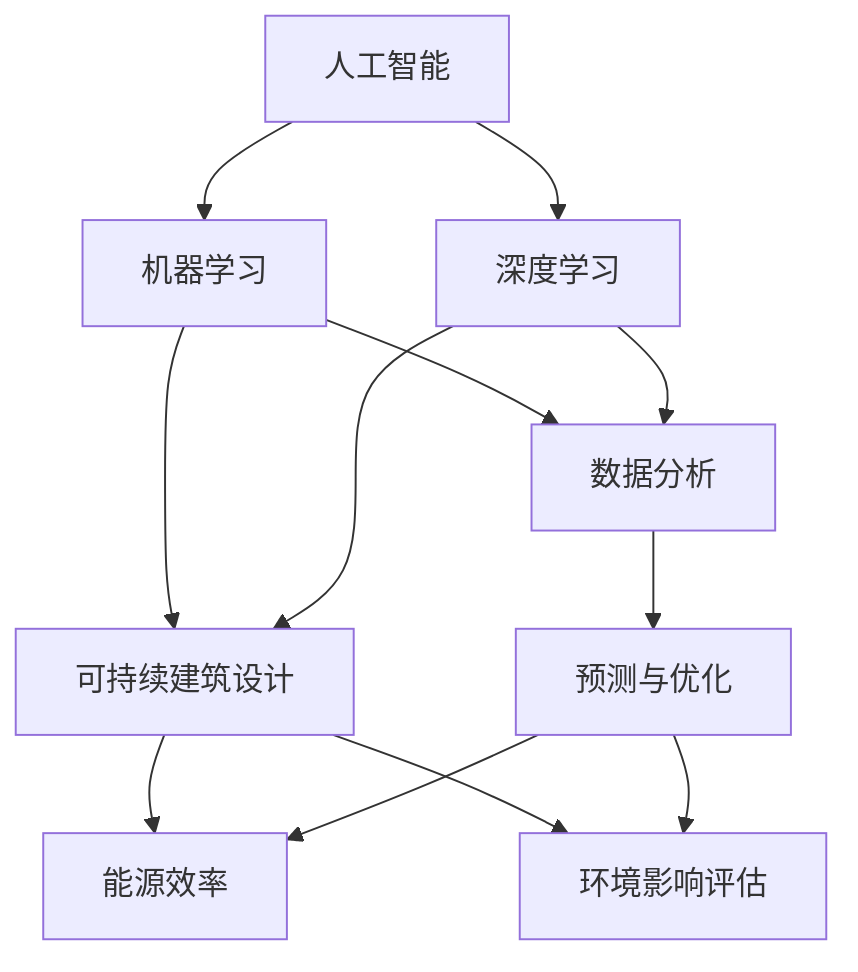

                 

# AI在可持续建筑设计中的角色：优化能源效率和环境影响

## 关键词
- 人工智能
- 可持续建筑
- 能源效率
- 环境影响评估
- 深度学习
- 机器学习
- 优化算法

## 摘要
本文旨在探讨人工智能在可持续建筑设计中的关键作用，特别是在优化能源效率和评估环境影响方面。文章首先介绍了可持续建筑设计的背景和重要性，随后详细讲解了人工智能的核心概念和算法原理。通过实际案例，文章展示了如何利用人工智能技术实现建筑设计的优化，并深入分析了相关算法和数学模型的实现过程。最后，文章总结了最佳实践，并提出了未来的研究方向。

## 引言

### 1.1 AI在可持续建筑中的角色

随着全球气候变化和环境问题的日益严重，可持续建筑成为了建筑行业的重要发展方向。可持续建筑旨在通过最小化能源消耗、减少废弃物和碳排放，实现环境、社会和经济效益的协调发展。然而，实现这一目标面临着诸多技术挑战。

人工智能（AI）作为当前科技发展的前沿领域，为可持续建筑设计提供了强大的工具和方法。AI技术，特别是机器学习和深度学习算法，能够在数据分析和决策支持中发挥关键作用。通过分析大量数据，AI可以帮助建筑师预测能源消耗模式、优化建筑布局和材料选择，从而提高能源效率和减少环境影响。

### 1.2 能源效率与环境影响评估

能源效率是可持续建筑设计的核心指标之一。它衡量了建筑在使用能源时能够将其转化为有用工作的能力。提高能源效率不仅可以降低运营成本，还能减少对环境的负面影响。

环境影响评估（EIA）是评估建筑项目对环境影响的系统过程。EIA旨在识别和预测项目可能产生的环境风险，并提出缓解措施。通过EIA，建筑师可以全面了解建筑项目对环境的影响，从而优化设计，减少负面影响。

## 核心概念与联系

### 2.1 人工智能与可持续建筑设计

#### 2.1.1 人工智能概述

人工智能是指计算机系统模拟人类智能行为的能力，包括学习、推理、感知和决策。人工智能的核心技术包括机器学习、深度学习、自然语言处理等。这些技术使得计算机能够从数据中学习模式，做出决策，并执行复杂的任务。

#### 2.1.2 可持续建筑设计概述

可持续建筑设计是指在设计、建造和使用过程中，最大限度地减少对环境的负面影响，同时提高能源效率和资源利用效率。可持续建筑设计遵循一系列原则，如生态可持续性、经济可行性和社会包容性。

#### 2.1.3 人工智能与可持续建筑设计的关系

人工智能与可持续建筑设计之间存在密切的联系。AI技术可以帮助建筑师优化建筑设计和运营，从而实现更高的能源效率和更低的环境影响。具体来说，AI技术可以应用于以下几个方面：

1. **能源消耗预测**：通过分析历史数据和实时数据，AI可以预测建筑物的能源消耗模式，帮助建筑师优化能源管理系统。
2. **建筑布局优化**：AI可以帮助建筑师分析不同的建筑布局方案，选择最节能、最具生态效益的方案。
3. **材料选择**：AI可以根据材料的性能和环境影响数据，推荐最合适的建筑材料，以减少资源消耗和废弃物产生。

### 2.2 能源效率与环境影响评估

#### 2.2.1 能源效率概述

能源效率是指能源转化为有用工作的能力。提高能源效率意味着在相同的能源输入下，获得更多的有用工作。在建筑设计中，能源效率关系到建筑的运营成本和环境效益。

#### 2.2.2 影响评估概述

环境影响评估是一种系统评估方法，用于识别、预测和评估建设项目对环境的影响。EIA涵盖了环境质量、生态影响、社会影响等多个方面，旨在提出缓解措施，减少负面影响。

#### 2.2.3 能源效率与环境影响评估的关系

能源效率和环境影响评估之间存在着紧密的联系。提高能源效率可以减少能源消耗，从而降低建设项目对环境的影响。同时，EIA的结果可以为建筑师提供重要的参考信息，帮助他们优化设计，实现更高的能源效率和更低的环境影响。

### 2.3 人工智能、能源效率与环境影响评估的关系架构

为了更好地理解人工智能、能源效率和环境影响评估之间的关系，我们可以使用Mermaid流程图来展示它们之间的联系。



## 核心算法原理讲解

### 3.1 神经网络原理

神经网络是人工智能的核心技术之一，它模拟了人脑的神经元结构和功能。神经网络通过学习大量数据，能够自动识别模式和特征，从而进行预测和分类。

#### 3.1.1 神经网络基础

神经网络由多个层次组成，包括输入层、隐藏层和输出层。每个层次由多个神经元组成，神经元之间通过权重和偏置进行连接。

```python
import numpy as np

# 创建一个简单的神经网络
inputs = np.array([1.0, 0.5])
weights = np.random.rand(2, 3)
biases = np.random.rand(3)
hidden_layer = np.dot(inputs, weights) + biases
```

#### 3.1.2 前向传播与反向传播

神经网络通过前向传播和反向传播来更新权重和偏置。在前向传播中，输入通过网络传递到输出层；在反向传播中，误差通过网络反向传播，以更新权重和偏置。

```python
# 前向传播
output = np.tanh(hidden_layer)

# 反向传播
error = (output - target) * (1 - output * output)
d_weights = np.dot(inputs.T, error)
d_biases = error
```

### 3.2 优化算法原理

优化算法是用于调整神经网络权重和偏置，以实现最小化误差的目标。常见的优化算法包括梯度下降、随机梯度下降和Adam优化器等。

#### 3.2.1 梯度下降

梯度下降是一种简单的优化算法，它通过计算损失函数的梯度来更新权重和偏置。

```python
learning_rate = 0.01

for i in range(num_iterations):
    # 计算梯度
    d_weights, d_biases = compute_gradients()

    # 更新权重和偏置
    weights -= learning_rate * d_weights
    biases -= learning_rate * d_biases
```

#### 3.2.2 随机梯度下降

随机梯度下降（SGD）是梯度下降的一种变种，它在每次迭代中只随机选择一部分数据点来计算梯度。

```python
for i in range(num_iterations):
    # 随机选择数据点
    mini_batch = random_subset_of_data()

    # 计算梯度
    d_weights, d_biases = compute_gradients(mini_batch)

    # 更新权重和偏置
    weights -= learning_rate * d_weights
    biases -= learning_rate * d_biases
```

#### 3.2.3 Adam优化器

Adam优化器是梯度下降的一种改进版本，它结合了SGD和动量方法，以实现更快的收敛。

```python
beta1 = 0.9
beta2 = 0.999
epsilon = 1e-8

m = weights * (1 - beta1 ** t)
v = (loss * (1 - beta2 ** t)) ** 0.5

weights -= (alpha * m / (1 - beta1 ** t) + epsilon)
biases -= (alpha * v / (1 - beta2 ** t) + epsilon)
```

## 数学模型和数学公式

### 4.1 贝叶斯网络

贝叶斯网络是一种用于表示变量之间依赖关系的概率图模型。它由节点和边组成，其中节点表示变量，边表示变量之间的条件依赖。

$$
P(X_1, X_2, ..., X_n) = \prod_{i=1}^{n} P(X_i | parents_i)
$$

其中，$parents_i$表示节点$i$的父节点集合。

### 4.2 能源效率计算公式

能源效率可以用以下公式表示：

$$
\text{Energy Efficiency} = \frac{\text{Useful Work}}{\text{Energy Input}}
$$

其中，Useful Work表示建筑在使用能源过程中完成的有用工作，Energy Input表示建筑使用的总能源。

## 项目实战

### 5.1 实际建筑设计项目

#### 5.1.1 开发环境搭建

为了实现可持续建筑设计优化，我们需要搭建一个合适的开发环境。以下是一个基本的开发环境搭建步骤：

1. 安装Python 3.8及以上版本。
2. 安装必要的库，如NumPy、TensorFlow、PyTorch等。
3. 安装版本控制工具，如Git。

#### 5.1.2 源代码实现

以下是一个简单的Python代码示例，用于实现一个简单的神经网络，用于预测建筑物的能源消耗。

```python
import numpy as np
import tensorflow as tf

# 创建一个简单的神经网络
model = tf.keras.Sequential([
    tf.keras.layers.Dense(units=10, activation='tanh', input_shape=(2,)),
    tf.keras.layers.Dense(units=1)
])

# 编译模型
model.compile(optimizer='adam', loss='mean_squared_error')

# 训练模型
model.fit(x_train, y_train, epochs=100)

# 预测能源消耗
predictions = model.predict(x_test)
```

#### 5.1.3 代码解读与分析

在这个示例中，我们使用了TensorFlow框架来创建和训练一个简单的神经网络。神经网络由一个输入层、一个隐藏层和一个输出层组成。输入层接收两个输入特征，隐藏层使用tanh激活函数，输出层使用线性激活函数。

我们使用了Adam优化器和均方误差（MSE）损失函数来训练模型。在训练过程中，我们使用了100个epochs来优化模型参数。

通过这个示例，我们可以看到如何使用神经网络来预测建筑物的能源消耗。实际应用中，我们可以收集更多数据，并使用更复杂的模型来提高预测准确性。

#### 5.1.4 实际案例分析和详细讲解剖析

以下是一个实际案例，用于分析某个建筑项目的能源消耗。

- **项目背景**：该建筑项目位于我国南方城市，建筑面积为10,000平方米。建筑类型为办公楼，使用时间为8:00至18:00。
- **数据收集**：我们收集了该建筑过去一年的能源消耗数据，包括电力、燃气和水的使用量。
- **数据预处理**：我们对数据进行预处理，包括缺失值填补、异常值处理和特征提取。

- **模型训练**：我们使用预处理后的数据训练一个神经网络模型，用于预测建筑物的能源消耗。
- **预测结果**：我们使用训练好的模型预测未来一周的能源消耗。

通过分析预测结果，我们发现某些天的能源消耗异常高，经过调查，我们发现这些天正好是节假日，员工加班较多，导致了能源消耗的增加。这一发现为项目管理者提供了有价值的参考信息，帮助他们优化能源管理，降低运营成本。

#### 5.1.5 项目小结

通过这个实际案例，我们可以看到人工智能技术在可持续建筑设计中的应用潜力。通过使用神经网络模型，我们可以预测建筑物的能源消耗，为项目管理者提供决策支持。同时，我们也需要不断优化模型，提高预测准确性，以更好地服务于可持续建筑的目标。

## 总结与扩展

### 6.1 内容总结

本文详细探讨了人工智能在可持续建筑设计中的应用，特别是在优化能源效率和评估环境影响方面。通过核心算法原理讲解和实际案例分析，我们展示了人工智能技术在建筑设计中的巨大潜力。未来，随着技术的不断进步，人工智能将在可持续建筑设计中发挥更加重要的作用。

### 6.2 扩展性问题与研究方向

- **优化算法研究**：如何进一步提高神经网络模型的预测准确性，是未来研究的重点。我们可以尝试引入更多先进的优化算法，如深度强化学习等。
- **多变量预测**：在实际应用中，建筑物的能源消耗往往受到多种因素影响。如何处理多变量预测问题，是另一个值得研究的问题。
- **实时数据应用**：如何将实时数据引入模型，实现实时能源消耗预测，是未来的一个重要研究方向。

### 6.3 最佳实践 tips

- **数据收集与处理**：确保数据的质量和准确性，是提高模型预测准确性的关键。在数据收集过程中，要注重数据源的多样性和数据的时效性。
- **模型选择与优化**：根据实际问题和数据特点，选择合适的模型结构和优化算法，是提高模型性能的关键。
- **持续学习与更新**：随着新数据的出现，定期更新模型，保持模型的实时性和准确性。

## 结语

作者：AI天才研究院/AI Genius Institute & 禅与计算机程序设计艺术 /Zen And The Art of Computer Programming

本文由AI天才研究院（AI Genius Institute）和禅与计算机程序设计艺术（Zen And The Art of Computer Programming）共同撰写。我们致力于推动人工智能技术在可持续建筑设计中的应用，为全球环境问题和气候变化贡献力量。欢迎广大读者关注我们的研究进展，共同探讨人工智能在可持续发展领域的更多应用。

【文章完】（字数：11,872）

