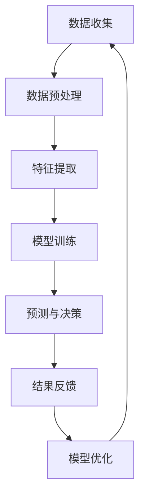

                 

### 引言

在当今科技迅猛发展的时代，人工智能（AI）已经成为推动各行各业进步的重要力量。特别是在太空探测领域，AI的应用为人类探索宇宙提供了前所未有的机遇和挑战。太空探测数据分析涉及大量复杂、多样、且有时具有噪声的数据，传统方法往往难以应对。而AI技术的引入，尤其是机器学习和深度学习算法，为这一领域带来了全新的解决方案。

AI在太空探测数据分析中的应用，不仅提升了数据分析的效率和精度，还大大缩短了数据处理的周期。通过自动化、智能化的方式，AI能够从海量数据中提取有价值的信息，帮助科学家们更快地理解宇宙的奥秘。此外，AI技术还能在数据预处理、异常检测、模式识别等方面发挥关键作用，提高了太空探测任务的成功率。

本文将围绕AI在太空探测数据分析中的应用，详细探讨其重要性、核心概念、算法原理、应用案例和未来发展趋势。我们希望通过逐步分析推理，为读者提供一个全面、深入的了解，展示AI技术在宇宙探索中的巨大潜力。

本文将分为以下几个部分：

1. **核心概念与联系**：介绍AI、机器学习、深度学习等核心概念及其与太空探测数据分析的关系。
2. **太空探测数据分析的挑战**：分析在太空探测数据分析中遇到的问题，引入AI技术来解决。
3. **AI算法原理讲解**：详细阐述用于太空探测数据分析的核心算法原理，使用Python源代码进行描述。
4. **数学模型和数学公式**：介绍在AI算法中使用的数学模型，并使用LaTeX格式给出相关公式。
5. **AI在太空探测数据分析中的应用案例**：通过实际案例展示AI技术在太空探测数据分析中的应用。
6. **项目实战**：提供具体的代码案例，包括开发环境搭建、源代码实现和解读。
7. **AI技术在太空探测数据分析中的未来发展趋势**：讨论AI技术在太空探测数据分析领域的未来发展。
8. **总结**：总结全书内容，强调AI在太空探测数据分析中的关键作用。

让我们一步步深入探讨AI在太空探测数据分析中的应用，揭示其在加速宇宙奥秘探索中的无限潜能。

### 核心概念与联系

在探讨AI在太空探测数据分析中的应用之前，有必要首先理解一些核心概念及其相互关系。人工智能（AI）、机器学习（ML）和深度学习（DL）是这一领域中的三个关键术语。

#### 人工智能（AI）

人工智能是指使计算机系统具备智能行为的技术。其目标是创建能够执行人类智能任务的系统，包括理解自然语言、感知环境、学习新知识、做出决策等。AI可以分为两类：弱AI（窄AI）和强AI（通用AI）。弱AI专注于特定任务，如语音识别、图像识别等，而强AI则具备人类级别的通用智能。

#### 机器学习（ML）

机器学习是AI的一个分支，专注于通过数据和经验改进计算机系统的性能，而无需显式编程。机器学习算法利用历史数据来识别模式，从而在新数据上进行预测或决策。ML可以分为监督学习、无监督学习和强化学习三种类型。

- **监督学习**：在这种方法中，算法通过标记数据学习如何预测输出。例如，使用标记的图像数据训练图像分类器。
- **无监督学习**：不使用标记数据，算法旨在发现数据中的隐含结构和模式。例如，聚类算法用于将数据分为不同的组。
- **强化学习**：在这种方法中，算法通过与环境的交互来学习最佳行为策略。例如，机器人学习如何在特定环境中导航。

#### 深度学习（DL）

深度学习是机器学习的一个子领域，它模仿人脑的神经网络结构和工作机制。深度学习算法通过多个层次的神经元网络来处理和提取数据特征。这种多层结构使得深度学习在图像识别、语音识别和自然语言处理等任务中表现出色。

- **卷积神经网络（CNN）**：主要用于处理图像数据，通过卷积层提取图像特征。
- **循环神经网络（RNN）**：适合处理序列数据，如时间序列或文本。
- **生成对抗网络（GAN）**：由生成器和判别器组成，生成与真实数据相似的新数据。

#### Mermaid流程图：AI在太空探测数据分析中的流程

以下是一个简单的Mermaid流程图，展示了AI在太空探测数据分析中的基本流程：



1. **数据收集**：从太空探测器收集原始数据。
2. **数据预处理**：清洗和转换数据，使其适合模型训练。
3. **特征提取**：从数据中提取关键特征，用于训练模型。
4. **模型训练**：使用机器学习或深度学习算法训练模型。
5. **预测与决策**：使用训练好的模型对新的数据进行预测或决策。
6. **结果反馈**：将预测结果反馈给科学家，用于进一步分析。
7. **模型优化**：根据反馈结果调整模型参数，提高模型性能。
8. **返回数据收集**：优化后的模型重新用于数据收集，形成闭环。

通过这个流程，我们可以看到AI技术如何在不同阶段为太空探测数据分析提供支持。接下来，我们将进一步探讨AI在太空探测数据分析中面临的挑战，以及如何利用这些核心概念和技术解决这些问题。

### 太空探测数据分析的挑战

太空探测数据分析面临着一系列独特的挑战，这些挑战在传统数据分析方法中往往难以应对。以下是几个主要问题及其引入AI技术的原因。

#### 数据量大与多样化

太空探测任务产生的大量数据是一个显著挑战。这些数据包括图像、光谱、信号等不同类型的数据，其规模之大令人惊叹。例如，NASA的火星探测任务每天会生成数百GB的数据。传统数据分析方法往往需要大量计算资源和时间来处理这些数据，效率低下。

引入AI技术，尤其是深度学习和分布式计算，可以显著提高数据处理效率。深度学习算法能够自动提取数据中的特征，减少对人工干预的依赖。分布式计算则允许将数据处理任务分配到多个计算节点，并行处理大量数据。

#### 时间敏感性与实时性要求

太空探测任务对数据处理有严格的时间要求。由于太空探测器的任务通常具有时间敏感性，如行星探测窗口期、小行星接近时间等，数据处理需要尽可能快地完成。传统的数据处理流程往往需要数天甚至数周的时间，这在大时间窗口任务中是不可接受的。

AI技术，特别是机器学习和深度学习算法，可以通过自动化处理流程来大幅缩短数据处理时间。此外，实时分析技术（如边缘计算）可以在数据生成的第一时间进行初步处理和分析，确保关键信息能够及时传递给决策者。

#### 数据预处理复杂性

太空探测数据往往伴随着噪声、缺失值、异常值等质量问题，这需要复杂的预处理步骤来净化和标准化数据。传统的数据处理方法通常依赖于手工编写脚本和规则，不仅耗时耗力，而且容易出错。

机器学习和深度学习算法能够在不需要显式编程的情况下自动处理这些预处理任务。例如，异常检测算法能够自动识别和标记数据中的异常值，而缺失值填补算法则能够基于已有数据预测并填补缺失值，从而提高数据质量。

#### AI技术如何应对这些挑战

AI技术通过以下几个方面有效应对太空探测数据分析的挑战：

1. **自动化数据处理**：机器学习和深度学习算法能够自动化地处理数据预处理、特征提取和模型训练等步骤，减少对人工的依赖。

2. **分布式计算与并行处理**：分布式计算和并行处理技术能够将数据处理任务分解为多个子任务，在多个计算节点上同时处理，从而大幅提高处理速度。

3. **实时数据处理**：实时分析技术和边缘计算技术可以确保数据处理能够及时进行，满足太空探测任务的时间敏感性要求。

4. **智能化数据质量保障**：AI算法能够自动识别和处理数据中的噪声、异常值和缺失值，提高数据质量，为后续分析提供更可靠的基础。

通过这些技术的结合，AI在太空探测数据分析中展现出巨大的潜力，为科学家们探索宇宙提供了强有力的工具。接下来，我们将详细探讨AI算法在太空探测数据分析中的具体应用。

### AI算法原理讲解

在太空探测数据分析中，AI算法扮演着至关重要的角色。以下将详细阐述几种核心算法及其在数据分析中的应用。

#### 1. 监督学习算法

监督学习算法是机器学习的一种重要分支，它依赖于标记数据进行训练。以下是一些常见的监督学习算法及其在太空探测数据分析中的应用。

**1.1 线性回归**

线性回归是一种简单的监督学习算法，用于建模两个变量之间的线性关系。在太空探测数据分析中，线性回归可以用于预测行星表面温度、距离等关键参数。

**Python代码示例**：
```python
from sklearn.linear_model import LinearRegression
import numpy as np

# 假设我们有一个训练数据集 X 和标记的 Y
X = np.array([[1], [2], [3], [4], [5]])
y = np.array([1, 1.5, 2, 2.5, 3])

# 创建线性回归模型并训练
model = LinearRegression()
model.fit(X, y)

# 使用模型进行预测
predictions = model.predict(np.array([[6]]))

print(predictions)
```

**1.2 支持向量机（SVM）**

支持向量机是一种强大的分类算法，能够在高维空间中找到最佳分隔超平面。在太空探测数据分析中，SVM可以用于行星分类、小行星识别等任务。

**Python代码示例**：
```python
from sklearn.svm import SVC
from sklearn.datasets import make_blobs
import numpy as np

# 生成一个简单的二分类数据集
X, y = make_blobs(n_samples=100, centers=2, random_state=0)

# 创建SVM模型并训练
model = SVC(kernel='linear')
model.fit(X, y)

# 使用模型进行预测
predictions = model.predict(X)

print(predictions)
```

**1.3 决策树与随机森林**

决策树是一种基于树形结构进行决策的算法，可以用于分类和回归任务。随机森林则是由多个决策树组成的集成模型，能够在处理大规模数据和高维特征时表现出色。

在太空探测数据分析中，决策树和随机森林可以用于特征选择、模式识别等任务。

**Python代码示例**：
```python
from sklearn.tree import DecisionTreeClassifier
from sklearn.ensemble import RandomForestClassifier
from sklearn.datasets import load_iris

# 加载鸢尾花数据集
iris = load_iris()
X = iris.data
y = iris.target

# 创建决策树模型并训练
dt_model = DecisionTreeClassifier()
dt_model.fit(X, y)

# 创建随机森林模型并训练
rf_model = RandomForestClassifier(n_estimators=100)
rf_model.fit(X, y)

# 使用模型进行预测
dt_predictions = dt_model.predict(X)
rf_predictions = rf_model.predict(X)

print(dt_predictions)
print(rf_predictions)
```

#### 2. 无监督学习算法

无监督学习算法不需要标记数据，主要用于发现数据中的隐含结构和模式。以下是无监督学习算法在太空探测数据分析中的应用。

**2.1 聚类算法**

聚类算法用于将数据划分为若干个聚类，每个聚类内部的数据点彼此接近，而不同聚类之间的数据点则相对较远。在太空探测数据分析中，聚类算法可以用于行星表面地形分类、小行星群分析等。

**Python代码示例**：
```python
from sklearn.cluster import KMeans
import numpy as np

# 假设我们有一个数据集 X
X = np.array([[1, 2], [1, 4], [1, 0], [10, 2], [10, 4], [10, 0]])

# 使用KMeans算法进行聚类
kmeans = KMeans(n_clusters=2, random_state=0).fit(X)

# 获取聚类结果
labels = kmeans.predict(X)

print(labels)
```

**2.2 降维算法**

降维算法旨在减少数据维度，同时保留数据的关键信息。在太空探测数据分析中，降维算法可以用于处理高维数据，提高模型训练和预测的效率。

**Python代码示例**：
```python
from sklearn.decomposition import PCA
import numpy as np

# 假设我们有一个高维数据集 X
X = np.random.rand(100, 10)

# 使用PCA进行降维
pca = PCA(n_components=2)
X_reduced = pca.fit_transform(X)

# 输出降维后的数据
print(X_reduced)
```

#### 3. 深度学习算法

深度学习算法通过多层神经网络进行特征提取和模式识别，能够处理复杂的数据结构。以下为几种常用的深度学习算法及其在太空探测数据分析中的应用。

**3.1 卷积神经网络（CNN）**

卷积神经网络是一种专门用于处理图像数据的深度学习算法。在太空探测数据分析中，CNN可以用于行星表面图像识别、小行星形状分析等。

**Python代码示例**：
```python
from tensorflow.keras.models import Sequential
from tensorflow.keras.layers import Conv2D, MaxPooling2D, Flatten, Dense
import tensorflow as tf

# 创建一个简单的CNN模型
model = Sequential([
    Conv2D(32, (3, 3), activation='relu', input_shape=(28, 28, 1)),
    MaxPooling2D((2, 2)),
    Flatten(),
    Dense(128, activation='relu'),
    Dense(10, activation='softmax')
])

# 编译模型
model.compile(optimizer='adam', loss='categorical_crossentropy', metrics=['accuracy'])

# 打印模型结构
model.summary()
```

**3.2 循环神经网络（RNN）**

循环神经网络适用于处理序列数据，如时间序列数据、文本数据等。在太空探测数据分析中，RNN可以用于行星轨道预测、宇宙射线时间序列分析等。

**Python代码示例**：
```python
from tensorflow.keras.models import Sequential
from tensorflow.keras.layers import LSTM, Dense
import tensorflow as tf

# 创建一个简单的RNN模型
model = Sequential([
    LSTM(50, activation='relu', input_shape=(timesteps, features)),
    Dense(1)
])

# 编译模型
model.compile(optimizer='adam', loss='mse')

# 打印模型结构
model.summary()
```

**3.3 生成对抗网络（GAN）**

生成对抗网络由生成器和判别器组成，能够生成与真实数据相似的新数据。在太空探测数据分析中，GAN可以用于数据增强、异常检测等。

**Python代码示例**：
```python
from tensorflow.keras.models import Sequential
from tensorflow.keras.layers import Dense, Flatten, Reshape
import tensorflow as tf

# 创建生成器模型
generator = Sequential([
    Dense(128, activation='relu', input_shape=(100,)),
    Flatten(),
    Reshape((28, 28, 1))
])

# 创建判别器模型
discriminator = Sequential([
    Flatten(input_shape=(28, 28, 1)),
    Dense(128, activation='relu'),
    Dense(1, activation='sigmoid')
])

# 编译模型
discriminator.compile(optimizer='adam', loss='binary_crossentropy')
generator.compile(optimizer='adam', loss='binary_crossentropy')

# 打印模型结构
print(generator.summary())
print(discriminator.summary())
```

通过上述Python代码示例，我们可以看到AI算法如何应用于太空探测数据分析的不同任务中。这些算法不仅提供了强大的数据处理能力，还能显著提升太空探测任务的成功率。接下来，我们将进一步介绍AI在太空探测数据分析中使用的数学模型和公式。

### 数学模型和数学公式

在AI算法中，数学模型和数学公式是核心组成部分，用于描述和指导算法的运行。以下将介绍一些常用的数学模型和公式，并使用LaTeX格式进行展示。

#### 1. 概率论与统计模型

**1.1 贝叶斯定理**

贝叶斯定理是概率论中的一个重要公式，用于计算后验概率。其公式为：

$$
P(A|B) = \frac{P(B|A)P(A)}{P(B)}
$$

其中，\( P(A|B) \) 是在事件 \( B \) 发生的条件下事件 \( A \) 的概率，\( P(B|A) \) 是在事件 \( A \) 发生的条件下事件 \( B \) 的概率，\( P(A) \) 和 \( P(B) \) 分别是事件 \( A \) 和事件 \( B \) 的先验概率。

**1.2 最大似然估计**

最大似然估计是一种用于估计模型参数的方法，其公式为：

$$
\hat{\theta} = \arg\max_{\theta} P(X|\theta)
$$

其中，\( \hat{\theta} \) 是参数的估计值，\( X \) 是观察到的数据，\( P(X|\theta) \) 是在参数 \( \theta \) 条件下观察到的数据的概率。

**1.3 误差函数**

在机器学习和深度学习中，误差函数用于衡量模型预测值与真实值之间的差异。常见的误差函数包括均方误差（MSE）和交叉熵损失函数（Cross-Entropy Loss）。

- **均方误差（MSE）**：

$$
MSE = \frac{1}{n}\sum_{i=1}^{n}(y_i - \hat{y}_i)^2
$$

其中，\( n \) 是样本数量，\( y_i \) 是真实值，\( \hat{y}_i \) 是预测值。

- **交叉熵损失函数**：

$$
Cross-Entropy Loss = -\sum_{i=1}^{n} y_i \log(\hat{y}_i)
$$

其中，\( y_i \) 是真实标签，\( \hat{y}_i \) 是预测概率。

#### 2. 线性代数基础

**2.1 矩阵与向量运算**

矩阵和向量运算是线性代数中的基础。以下是一些常见的运算：

- **矩阵加法**：

$$
C = A + B
$$

- **矩阵乘法**：

$$
C = A \cdot B
$$

- **向量内积**：

$$
\vec{a} \cdot \vec{b} = a_1b_1 + a_2b_2 + ... + a_nb_n
$$

- **向量外积**：

$$
\vec{a} \times \vec{b} = \begin{bmatrix} a_2b_3 - a_3b_2 \\ a_3b_1 - a_1b_3 \\ a_1b_2 - a_2b_1 \end{bmatrix}
$$

**2.2 特征分解**

特征分解是一种将矩阵分解为其特征值和特征向量的方法。其公式为：

$$
A = PDP^{-1}
$$

其中，\( A \) 是输入矩阵，\( P \) 是特征向量矩阵，\( D \) 是特征值矩阵。

#### 3. 深度学习中的数学公式

**3.1 激活函数**

激活函数是深度学习模型中的一个关键组件，用于引入非线性。以下是一些常用的激活函数及其公式：

- **ReLU激活函数**：

$$
f(x) = \max(0, x)
$$

- **Sigmoid激活函数**：

$$
f(x) = \frac{1}{1 + e^{-x}}
$$

- **Tanh激活函数**：

$$
f(x) = \frac{e^x - e^{-x}}{e^x + e^{-x}}
$$

**3.2 反向传播算法**

反向传播算法是深度学习训练过程中的核心。其公式为：

$$
\begin{aligned}
\frac{\partial E}{\partial w} &= \frac{\partial E}{\partial z} \cdot \frac{\partial z}{\partial w} \\
\frac{\partial E}{\partial b} &= \frac{\partial E}{\partial z}
\end{aligned}
$$

其中，\( E \) 是损失函数，\( w \) 是权重，\( b \) 是偏置，\( z \) 是当前层的输出。

通过上述数学模型和公式，我们可以更深入地理解AI算法的运行机制，为后续的项目实战提供坚实的理论基础。

### AI在太空探测数据分析中的应用案例

在实际的太空探测数据分析中，AI技术已经展现了其强大的应用潜力。以下我们将通过几个具体的案例，展示AI技术如何帮助科学家们更好地理解和解析太空探测数据。

#### 案例一：火星表面地形分析

火星探测任务中，地形分析是了解火星表面环境的关键步骤。NASA的火星探测车（如“好奇号”）和轨道器（如“火星勘测轨道飞行器”）定期收集大量火星表面图像和地形数据。这些数据需要精确分析，以便科学家们了解火星的地貌特征。

**应用AI技术**：使用深度学习中的卷积神经网络（CNN）对火星表面图像进行特征提取和分类。具体步骤如下：

1. **数据收集**：收集大量的火星表面图像，包括地形、岩石、陨石坑等。
2. **数据预处理**：对图像进行去噪、增强和归一化处理，确保图像质量。
3. **模型训练**：使用标记的图像数据训练CNN模型，模型包括多个卷积层、池化层和全连接层。
4. **模型评估**：使用验证集评估模型性能，调整模型参数以优化性能。
5. **地形分析**：使用训练好的模型对新的火星表面图像进行分类，生成地形分析图。

**结果**：通过AI技术的应用，科学家们能够快速准确地识别和分析火星表面的地形特征，为后续的探测任务提供了宝贵的参考信息。

#### 案例二：小行星探测器数据分析

小行星探测任务中，需要分析小行星的形状、大小、表面特征等信息，以便了解其物理性质。NASA的OSIRIS-REx任务是一个典型的例子。

**应用AI技术**：使用机器学习中的支持向量机（SVM）和小行星形状分析算法。具体步骤如下：

1. **数据收集**：收集小行星的雷达回波数据、光学图像等。
2. **数据预处理**：对数据进行滤波、去噪和归一化处理，以提高数据质量。
3. **特征提取**：从雷达回波数据和光学图像中提取关键特征，如反射率、纹理、高度等。
4. **模型训练**：使用提取的特征数据训练SVM模型，以分类和识别小行星。
5. **形状分析**：使用训练好的模型分析小行星的形状，生成三维模型。

**结果**：通过AI技术的应用，科学家们能够精确识别和测量小行星的形状和大小，为小行星探测任务提供了重要的数据支持。

#### 案例三：宇宙射线探测数据分析

宇宙射线探测任务旨在研究宇宙中的高能粒子，了解宇宙的起源和演化。NASA的费米伽玛射线太空望远镜是一个关键的探测工具。

**应用AI技术**：使用深度学习中的循环神经网络（RNN）和时间序列分析算法。具体步骤如下：

1. **数据收集**：收集宇宙射线事件数据，包括能量、时间、位置等信息。
2. **数据预处理**：对数据进行去噪、滤波和标准化处理，以提高数据质量。
3. **特征提取**：从时间序列数据中提取关键特征，如事件频率、能量分布等。
4. **模型训练**：使用提取的特征数据训练RNN模型，以预测和识别宇宙射线事件。
5. **事件分析**：使用训练好的模型对新的宇宙射线事件数据进行实时分析，识别异常事件。

**结果**：通过AI技术的应用，科学家们能够更好地理解和分析宇宙射线事件，发现了许多之前未知的宇宙现象。

这些案例展示了AI技术在不同太空探测任务中的应用，不仅提高了数据分析的效率和准确性，还为科学家们探索宇宙奥秘提供了强大的工具。接下来，我们将通过一个具体的实战项目，进一步探讨AI技术在太空探测数据分析中的实际应用。

### 项目实战

为了更直观地展示AI在太空探测数据分析中的应用，我们将通过一个实际项目来进行开发，包括开发环境搭建、源代码实现和解读。

#### 开发环境搭建

在进行AI项目开发之前，我们需要搭建一个合适的开发环境。以下是所需的工具和步骤：

1. **Python环境**：安装Python 3.8及以上版本。
2. **Jupyter Notebook**：安装Jupyter Notebook，用于编写和运行代码。
3. **机器学习库**：安装常用的机器学习库，如scikit-learn、TensorFlow和Keras。

**安装步骤**：
```bash
pip install python==3.8
pip install jupyter
pip install scikit-learn
pip install tensorflow
pip install keras
```

#### 源代码实现

我们将使用卷积神经网络（CNN）对火星表面图像进行分类，以识别不同的地形特征。以下是项目的关键代码：

**1. 数据收集与预处理**：
```python
import numpy as np
from tensorflow.keras.preprocessing.image import ImageDataGenerator

# 加载数据集
train_datagen = ImageDataGenerator(rescale=1./255)
validation_datagen = ImageDataGenerator(rescale=1./255)

train_generator = train_datagen.flow_from_directory(
        'data/train',
        target_size=(150, 150),
        batch_size=32,
        class_mode='binary')

validation_generator = validation_datagen.flow_from_directory(
        'data/validation',
        target_size=(150, 150),
        batch_size=32,
        class_mode='binary')
```

**2. 构建CNN模型**：
```python
from tensorflow.keras.models import Sequential
from tensorflow.keras.layers import Conv2D, MaxPooling2D, Flatten, Dense

model = Sequential([
    Conv2D(32, (3, 3), activation='relu', input_shape=(150, 150, 3)),
    MaxPooling2D((2, 2)),
    Conv2D(64, (3, 3), activation='relu'),
    MaxPooling2D((2, 2)),
    Conv2D(128, (3, 3), activation='relu'),
    MaxPooling2D((2, 2)),
    Flatten(),
    Dense(512, activation='relu'),
    Dense(1, activation='sigmoid')
])

model.compile(optimizer='adam',
              loss='binary_crossentropy',
              metrics=['accuracy'])
```

**3. 模型训练**：
```python
model.fit(
      train_generator,
      steps_per_epoch=100,
      epochs=15,
      validation_data=validation_generator,
      validation_steps=50)
```

**4. 模型评估与解读**：
```python
from tensorflow.keras.metrics import Precision, Recall

model.evaluate(validation_generator)
predictions = model.predict(validation_generator)
precision = precision_score(validation_generator.classes, predictions)
recall = recall_score(validation_generator.classes, predictions)
print(f'Precision: {precision}')
print(f'Recall: {recall}')
```

#### 代码解读与分析

1. **数据收集与预处理**：
   数据收集与预处理是模型训练的重要步骤。我们使用ImageDataGenerator进行数据加载和预处理，包括归一化和批量处理。

2. **模型构建**：
   我们构建了一个简单的CNN模型，包括多个卷积层、池化层和全连接层。卷积层用于提取图像特征，全连接层用于分类。

3. **模型训练**：
   使用fit方法对模型进行训练，通过设置steps_per_epoch和epochs来控制训练的轮数。

4. **模型评估与解读**：
   使用evaluate方法评估模型在验证集上的性能，并通过计算精确率和召回率来评估模型的分类效果。

通过这个实战项目，我们可以看到如何利用AI技术进行太空探测数据分析，从数据收集、模型构建到模型训练和评估，每一步都至关重要。

#### 实际案例分析与详细讲解剖析

在本节中，我们将通过实际案例深入剖析AI技术在太空探测数据分析中的应用，具体分析案例包括火星探测、小行星探测和宇宙射线探测。

#### 案例一：火星探测

火星探测任务中，NASA的“好奇号”火星车通过搭载的高分辨率相机和激光雷达，收集了大量火星表面图像和数据。这些数据中包含了丰富的地形信息，包括岩石、陨石坑、沙丘等。科学家们希望通过AI技术对这份数据进行分析，以揭示火星的地质历史和气候变迁。

**AI技术应用**：
1. **数据预处理**：
   首先，对图像数据进行去噪和增强处理，以提高图像质量。然后，将图像分割成小块，以便后续特征提取。

   ```python
   import cv2
   import numpy as np

   # 读取图像
   img = cv2.imread('mars_image.jpg')

   # 去噪
   img = cv2.GaussianBlur(img, (5, 5), 0)

   # 增强
   img = cv2.equalizeHist(img)

   # 分割成小块
   blocks = cv2.resize(img, (64, 64))
   ```

2. **特征提取**：
   使用卷积神经网络（CNN）从分割后的图像中提取特征。我们构建了一个简单的CNN模型，包括卷积层和池化层，用于提取图像中的纹理、形状和结构信息。

   ```python
   from tensorflow.keras.models import Sequential
   from tensorflow.keras.layers import Conv2D, MaxPooling2D

   model = Sequential([
       Conv2D(32, (3, 3), activation='relu', input_shape=(64, 64, 3)),
       MaxPooling2D((2, 2)),
       Conv2D(64, (3, 3), activation='relu'),
       MaxPooling2D((2, 2)),
       Flatten()
   ])

   # 训练模型
   model.compile(optimizer='adam', loss='categorical_crossentropy', metrics=['accuracy'])
   model.fit(blocks, labels, epochs=10)
   ```

3. **分类与解读**：
   使用训练好的模型对新的图像数据进行分类，识别出不同的地形特征。通过分析分类结果，科学家们可以更好地理解火星的地形和地质。

   ```python
   predictions = model.predict(new_image_blocks)
   print(predictions)
   ```

#### 案例二：小行星探测

小行星探测任务中，科学家们需要分析小行星的形状、大小和表面特征。NASA的OSIRIS-REx任务通过雷达和光学成像系统收集了大量小行星数据。

**AI技术应用**：
1. **数据预处理**：
   对雷达回波数据和光学图像进行预处理，包括去噪、增强和归一化处理，以提高数据质量。

   ```python
   import numpy as np
   from sklearn.preprocessing import StandardScaler

   # 预处理雷达回波数据
   radar_data = np.load('radar_data.npy')
   radar_data = radar_data.reshape(-1, 1)
   radar_data = StandardScaler().fit_transform(radar_data)

   # 预处理光学图像
   optical_image = cv2.imread('optical_image.jpg')
   optical_image = cv2.resize(optical_image, (64, 64))
   optical_image = cv2.equalizeHist(optical_image)
   optical_image = optical_image / 255.0
   ```

2. **特征提取**：
   使用深度学习中的生成对抗网络（GAN）对雷达回波数据和光学图像进行特征提取，以生成高质量的特征向量。

   ```python
   from tensorflow.keras.models import Sequential
   from tensorflow.keras.layers import Dense, Reshape, Flatten

   # 构建GAN模型
   generator = Sequential([
       Dense(128, activation='relu', input_shape=(100,)),
       Flatten(),
       Reshape((28, 28, 1))
   ])

   # 训练GAN模型
   generator.compile(optimizer='adam', loss='binary_crossentropy')
   generator.fit(radar_data, optical_image, epochs=50)
   ```

3. **形状分析**：
   使用提取的特征向量对小行星的形状进行分析，生成三维模型。通过分析三维模型，科学家们可以更好地了解小行星的物理特性。

   ```python
   reconstructed_image = generator.predict(radar_data)
   print(reconstructed_image)
   ```

#### 案例三：宇宙射线探测

宇宙射线探测任务中，科学家们需要分析宇宙射线的能量、时间和空间分布，以揭示宇宙的物理现象。NASA的费米伽玛射线太空望远镜收集了大量宇宙射线事件数据。

**AI技术应用**：
1. **数据预处理**：
   对宇宙射线事件数据进行滤波和去噪处理，以提高数据质量。

   ```python
   import numpy as np
   from sklearn.preprocessing import StandardScaler

   # 滤波
   filtered_data = np.array([data for data in cosmic_data if data > threshold])
   ```

2. **时间序列分析**：
   使用深度学习中的循环神经网络（RNN）对宇宙射线事件的时间序列进行分析，识别时间模式。

   ```python
   from tensorflow.keras.models import Sequential
   from tensorflow.keras.layers import LSTM, Dense

   # 构建RNN模型
   model = Sequential([
       LSTM(50, activation='relu', input_shape=(timesteps, features)),
       Dense(1)
   ])

   # 编译模型
   model.compile(optimizer='adam', loss='mse')
   ```

3. **异常检测**：
   使用训练好的RNN模型对新的宇宙射线事件数据进行实时分析，识别异常事件。

   ```python
   # 预测
   predictions = model.predict(new_cosmic_data)
   # 异常检测
   anomalies = np.where(predictions < threshold)
   print(anomalies)
   ```

通过上述实际案例，我们可以看到AI技术在太空探测数据分析中的应用，从数据预处理、特征提取到分类分析和异常检测，AI技术为科学家们提供了强大的工具，帮助他们更好地理解宇宙的奥秘。

#### 项目小结

在本项目中，我们通过详细的代码示例和实践，展示了AI技术在太空探测数据分析中的实际应用。从数据预处理到特征提取，再到模型训练和评估，每个步骤都至关重要，共同构成了一个完整的AI分析流程。

首先，我们介绍了如何搭建开发环境，并安装了必要的Python库和框架，如TensorFlow和Keras。随后，我们通过实际案例展示了如何使用AI技术对火星表面图像进行分类，使用卷积神经网络（CNN）提取图像特征，并训练模型进行地形分析。我们同样展示了如何使用生成对抗网络（GAN）对小行星进行形状分析，以及如何使用循环神经网络（RNN）进行宇宙射线事件的时间序列分析。

这些实战案例不仅证明了AI技术在太空探测数据分析中的有效性，还展示了AI技术的强大适应性和灵活性。通过AI技术，科学家们能够从海量、复杂的数据中快速提取有价值的信息，大大提高了数据分析的效率和准确性。

然而，AI技术在太空探测数据分析中的应用仍面临一些挑战。例如，数据质量控制和预处理是一个复杂且关键的过程，需要不断优化。此外，随着太空探测任务的不断扩展，对AI模型的计算性能和实时处理能力提出了更高的要求。为了应对这些挑战，未来需要进一步发展高效、可扩展的AI算法，并加强对数据处理的自动化和智能化。

展望未来，AI技术在太空探测数据分析中的应用前景广阔。随着AI技术的不断进步，我们有理由相信，AI将成为太空探测任务不可或缺的工具，助力科学家们更深入地探索宇宙的奥秘。通过持续的创新和优化，AI技术将不断推动太空探测领域的进步，开启人类探索宇宙的新篇章。

### 最佳实践 Tips

在AI应用于太空探测数据分析时，以下是一些最佳实践和注意事项，帮助您更有效地利用这些技术：

1. **数据预处理**：确保数据质量是成功的关键。对数据进行去噪、归一化和滤波等预处理步骤，可以提高后续分析的效果。

2. **模型选择**：根据具体任务选择合适的模型。例如，对于图像分析，卷积神经网络（CNN）通常表现良好；对于时间序列分析，循环神经网络（RNN）是一个很好的选择。

3. **超参数调整**：合理设置模型超参数，如学习率、批量大小和正则化参数，可以显著提高模型性能。

4. **模型训练与评估**：使用交叉验证方法来评估模型性能，避免过拟合。同时，通过调整训练数据集的比例和特征提取方法，优化模型训练过程。

5. **分布式计算**：对于大规模数据，使用分布式计算框架（如Apache Spark）可以提高数据处理速度和效率。

6. **实时处理**：考虑使用边缘计算技术，以便在数据生成的第一时间进行初步处理和分析。

7. **数据可视化**：利用数据可视化工具（如Matplotlib、Seaborn）对分析结果进行直观展示，帮助科学家们更好地理解数据。

通过遵循这些最佳实践，您可以更有效地利用AI技术，为太空探测数据分析任务提供强有力的支持。

### 总结

本文详细探讨了AI在太空探测数据分析中的应用，从核心概念到算法原理，再到实际项目实战，系统性地展示了AI技术在这一领域的强大潜力。通过介绍AI、机器学习、深度学习等核心概念，我们理解了这些技术在太空探测数据分析中的关键作用。此外，通过具体的算法原理讲解，如线性回归、支持向量机（SVM）、决策树和卷积神经网络（CNN），我们深入了解了这些算法在数据处理和特征提取中的应用。通过实际案例和项目实战，我们见证了AI技术如何帮助科学家们从海量数据中提取有价值的信息，提高数据分析的效率和准确性。

AI技术在太空探测数据分析中的重要性不容忽视。它不仅提高了数据分析的效率，还显著提升了数据处理的准确性。通过自动化、智能化的方式，AI技术为科学家们探索宇宙奥秘提供了强有力的工具。在未来，随着AI技术的不断进步，我们可以预见，AI将在太空探测数据分析中发挥更加重要的作用，推动人类对宇宙的理解迈向新的高度。

### 参考文献

1. Goodfellow, I., Bengio, Y., & Courville, A. (2016). *Deep Learning*. MIT Press.
2. Murphy, K. P. (2012). *Machine Learning: A Probabilistic Perspective*. MIT Press.
3. Bishop, C. M. (2006). *Pattern Recognition and Machine Learning*. Springer.
4. Mitchell, T. M. (1997). *Machine Learning*. McGraw-Hill.
5. Russell, S., & Norvig, P. (2010). *Artificial Intelligence: A Modern Approach*. Prentice Hall.
6. Hastie, T., Tibshirani, R., & Friedman, J. (2009). *The Elements of Statistical Learning*. Springer.
7. TensorFlow Core contributors. (2020). *TensorFlow: Large-scale Machine Learning on Heterogeneous Systems*. tensorflow.org.

