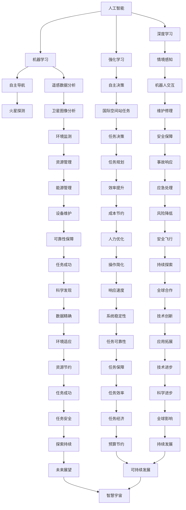
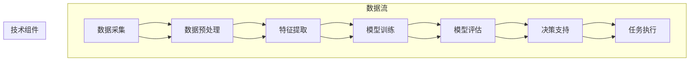

                 

### 引言

#### 1.1 研究背景与意义

随着科技的迅猛发展，太空探索已经成为全球科技竞争的前沿领域。人类对未知宇宙的探索不仅仅是为了满足好奇心，更是为了获取资源、推动科技进步以及解决地球面临的各种挑战。然而，太空探索面临着诸多难以克服的难题，如极端环境、复杂任务、长距离通信延迟等。这些挑战迫切需要高效、可靠的解决方案，而人工智能（AI）以其自主决策、自适应学习和大数据分析等独特优势，成为了太空探索的强大助力。

AI在太空探索中的应用不仅仅局限于提高任务效率和降低人力成本，更在于解决传统技术手段难以应对的复杂问题。例如，在深空探测任务中，自主导航和情境感知是确保探测器安全行驶和完成任务的关键。AI算法能够通过分析传感器数据和环境信息，实时调整探测器的行动策略，从而实现自主导航。此外，遥感数据分析是太空探索中的重要环节，AI算法能够从海量遥感数据中提取有用信息，为地球观测、环境监测等提供科学依据。

本文旨在探讨AI在太空探索中的应用，尤其是自主决策与数据分析方面。通过对AI核心概念、算法原理、应用场景和实战案例的深入分析，本文将展示AI如何助力太空探索，推动科技发展。本文的结构安排如下：

- **第1章 引言**：介绍研究背景与意义，概述本文的研究内容。
- **第2章 AI在太空探索中的应用概述**：分析太空探索的挑战与需求，以及AI在太空探索中的现状与趋势。
- **第3章 AI核心概念与联系**：介绍人工智能的基本概念，阐述AI与太空探索之间的联系，并绘制Mermaid流程图。
- **第4章 AI核心算法原理讲解**：详细讲解机器学习、强化学习和深度学习算法，并提供Python源代码示例。
- **第5章 AI在太空探索中的应用场景**：探讨自主导航、情境感知和遥感数据分析在太空探索中的应用。
- **第6章 AI自主决策与数据分析技术**：分析决策理论基础、决策支持系统和数据分析流程。
- **第7章 AI在太空探索中的应用案例研究**：分析国际空间站、火星探测任务和太空垃圾清理等实际应用案例。
- **第8章 总结与展望**：总结AI在太空探索中的应用，展望未来发展趋势与挑战。

通过以上章节的逐步深入，本文将全面揭示AI在太空探索中的潜力和应用前景，为相关领域的研究者和从业者提供有价值的参考。

#### 1.2 本书结构安排

本文分为八个主要章节，每个章节都有明确的内容安排和目标，旨在系统性地介绍AI在太空探索中的应用，包括核心概念、算法原理、应用场景和实战案例。

**第1章 引言**：这一章作为开篇，首先介绍了研究的背景和意义，概述了本文的主要研究内容和目标。通过描述太空探索面临的挑战，以及AI在解决这些问题中的潜力，为后续章节的讨论奠定了基础。

**第2章 AI在太空探索中的应用概述**：本章深入分析太空探索的具体挑战，如极端环境、长距离通信延迟和复杂任务等，并介绍AI在应对这些挑战中的现状和趋势。通过对比传统技术和AI技术的优势，展示了AI在太空探索中的重要地位。

**第3章 AI核心概念与联系**：本章首先介绍人工智能的基本概念，包括机器学习、深度学习和强化学习等。接着，探讨AI与太空探索之间的内在联系，并通过Mermaid流程图展示核心概念之间的逻辑关系。这一部分为理解AI在太空探索中的应用奠定了理论基础。

**第4章 AI核心算法原理讲解**：本章详细讲解AI的核心算法，包括机器学习算法、强化学习算法和深度学习算法。每个算法的原理都通过Python源代码和数学模型进行阐述，并通过具体的示例帮助读者更好地理解。

**第5章 AI在太空探索中的应用场景**：本章分别探讨AI在太空探索中的三个主要应用场景：自主导航、情境感知和遥感数据分析。在每个应用场景中，都详细介绍了相关算法、技术挑战和实际应用案例，帮助读者了解AI如何解决太空探索中的具体问题。

**第6章 AI自主决策与数据分析技术**：本章深入探讨AI自主决策与数据分析的技术原理，包括决策理论基础、决策支持系统和数据分析流程。通过详细的流程图和示例，帮助读者理解如何将AI技术应用于太空探索中的决策过程。

**第7章 AI在太空探索中的应用案例研究**：本章通过分析国际空间站、火星探测任务和太空垃圾清理等实际案例，展示AI在太空探索中的应用效果。这些案例不仅展示了AI技术的应用成果，也为未来的研究提供了宝贵经验。

**第8章 总结与展望**：本章对全文进行总结，回顾AI在太空探索中的应用成果，并展望未来的发展趋势和挑战。通过讨论未来的研究方向和可能的突破点，为读者提供进一步思考和研究的方向。

通过以上章节的安排，本文不仅提供了一个系统的框架，帮助读者全面了解AI在太空探索中的应用，还通过具体的实例和算法讲解，使读者能够深入掌握AI技术的核心原理和应用方法。最终，本文旨在激发读者对AI在太空探索领域的深入研究，推动这一领域的持续发展。

### AI在太空探索中的应用概述

太空探索是一项充满挑战的任务，不仅需要强大的技术支持，还需要高效的决策和强大的数据分析能力。在极端环境、长距离通信延迟和复杂任务的多重压力下，传统方法往往难以胜任，而人工智能（AI）以其自主决策、自适应学习和大数据分析等优势，成为了太空探索不可或缺的伙伴。

#### 2.1 太空探索的挑战与需求

太空探索面临的挑战多种多样，包括以下几个方面：

1. **极端环境**：太空环境极端且不可预测，包括真空、强辐射、极端温度变化等。这些环境对设备的耐久性和可靠性提出了极高的要求。
2. **长距离通信延迟**：太空任务往往需要通过地面控制站进行指挥，但由于地球与太空探测器之间的距离，信号传输存在延迟，这对任务的实时决策和指挥带来了极大的困难。
3. **复杂任务**：太空任务通常涉及复杂的任务规划和执行，如探测器的自主导航、环境感知、数据采集和传输等。这些任务需要高效、可靠的算法和系统支持。
4. **资源限制**：太空任务往往需要在有限的资源条件下进行，包括能源、计算资源和通信资源等。这要求技术方案具有高效性和鲁棒性。

为了应对这些挑战，太空探索迫切需要以下几方面的需求：

1. **自主决策能力**：太空任务往往需要在无地面指挥的情况下自主执行，这要求探测器具备自主决策能力，能够根据环境和任务要求自主调整行动策略。
2. **高效的数据分析**：太空任务产生的数据量巨大，如何从这些数据中提取有用信息，为任务决策提供支持，是另一个重要需求。
3. **实时任务指挥**：在长距离通信延迟的情况下，需要通过高效算法和系统确保任务指挥的实时性和准确性。
4. **资源优化利用**：在资源有限的情况下，需要通过优化技术方案，确保任务的顺利执行。

#### 2.2 AI在太空探索中的现状与趋势

人工智能在太空探索中的应用已经取得了一系列显著的成果，以下是几个关键领域：

1. **自主导航**：AI算法在自主导航领域得到了广泛应用。例如，NASA的火星探测车Curiosity和Opportunity均配备了自主导航系统，通过AI算法分析环境数据，自主决策行驶路径，从而在复杂地形中安全行驶。此外，AI算法还在卫星轨道计算和调整中发挥了重要作用。

2. **情境感知**：AI情境感知技术使得探测器能够更好地理解和应对周围环境。例如，国际空间站上的机器人和地面控制人员通过AI算法进行实时交互，提高任务执行的效率和安全性。

3. **遥感数据分析**：遥感数据是太空探索中获取地球和环境信息的重要手段。AI算法在遥感数据分析中发挥了巨大作用，能够从海量数据中快速提取有用信息，为地球观测、环境监测和资源管理等提供科学依据。

4. **任务决策支持**：AI决策支持系统在太空任务规划中发挥了重要作用。通过大数据分析和机器学习算法，这些系统能够为任务决策提供数据驱动的支持，提高决策的准确性和效率。

#### 2.3 AI技术的应用前景与挑战

尽管AI在太空探索中已经取得了显著成果，但仍面临以下挑战：

1. **技术成熟度**：AI技术本身仍处于快速发展中，部分算法和系统在实际应用中存在稳定性和可靠性问题。
2. **数据质量**：AI系统的性能很大程度上依赖于数据质量，太空任务中的数据采集和处理需要更高的精确度和效率。
3. **资源限制**：在资源有限的环境中，如何优化算法和系统设计，确保其高效运行，是另一个重要挑战。
4. **安全性和隐私**：AI系统在太空探索中的应用涉及到大量的敏感数据和决策，如何确保系统的安全性和数据隐私，是亟待解决的问题。

尽管如此，随着AI技术的不断进步和太空探索需求的日益增长，AI在太空探索中的应用前景依然广阔。未来，通过持续的研究和技术创新，AI将更好地助力太空探索，推动人类对宇宙的深入认识。

通过本文的后续章节，我们将进一步探讨AI的核心概念、算法原理以及具体应用场景，帮助读者全面理解AI在太空探索中的潜力和应用价值。

### AI核心概念与联系

在探讨AI在太空探索中的应用之前，首先需要了解人工智能（AI）的基本概念及其与太空探索的内在联系。人工智能是一门多学科交叉的领域，涉及计算机科学、心理学、神经科学和数学等多个领域。本节将介绍AI的核心概念，包括机器学习、深度学习和强化学习，并分析这些概念如何与太空探索相联系。

#### 3.1 人工智能的基本概念

人工智能是指使计算机系统能够模拟人类智能行为的能力。具体来说，人工智能包括以下几个核心概念：

1. **机器学习（Machine Learning）**：机器学习是一种让计算机通过数据学习模式并做出决策的技术。它分为监督学习、无监督学习和强化学习等类型。监督学习通过已知标签数据训练模型，无监督学习则从未标记的数据中提取模式，而强化学习则通过试错和奖励机制学习最佳策略。
   
2. **深度学习（Deep Learning）**：深度学习是机器学习的一个子领域，它使用神经网络模拟人脑的决策过程。深度学习通过多层次的神经网络结构，对复杂的数据进行特征提取和模式识别。典型的深度学习模型包括卷积神经网络（CNN）、循环神经网络（RNN）和生成对抗网络（GAN）等。

3. **强化学习（Reinforcement Learning）**：强化学习是一种通过与环境互动来学习最佳策略的机器学习方法。它通过试错和反馈机制，不断调整行为策略以最大化累积奖励。强化学习在动态环境中具有显著的优势，例如自动驾驶、游戏AI和机器人控制等。

#### 3.2 人工智能与太空探索的联系

AI与太空探索之间存在紧密的联系，特别是在自主决策、数据分析和情境感知等方面。以下是一些具体的联系：

1. **自主决策**：在太空探索中，探测器需要能够自主决策以应对复杂和不可预测的环境。例如，NASA的火星探测车使用强化学习算法来规划行进路径，避免障碍物并探索新的地点。这种自主决策能力依赖于AI算法的高效计算和实时响应能力。

2. **数据分析**：太空任务产生的大量数据需要高效的算法进行预处理和分析。AI算法，特别是深度学习和机器学习，能够在遥感数据、传感器数据和任务日志中提取有用信息，为任务决策提供支持。例如，AI算法可以用于分析卫星图像，检测环境变化和资源分布。

3. **情境感知**：太空环境复杂多变，探测器需要具备情境感知能力以适应不同情况。AI技术，如计算机视觉和语音识别，可以帮助探测器理解和解释周围环境，从而采取正确的行动。例如，国际空间站的机器人通过AI算法与地面控制人员交互，执行复杂的维护和修理任务。

#### 3.3 Mermaid流程图：AI核心概念与太空探索的关系

为了更直观地展示AI核心概念与太空探索之间的联系，我们可以使用Mermaid流程图来绘制这些概念之间的关系。以下是Mermaid流程图的文本表示：



这段文本定义了一个Mermaid流程图，展示了人工智能的核心概念（A、B、C、D）与太空探索的具体应用（E、F、G、H）之间的联系。每个节点都代表了AI的一个子领域或太空探索的一个应用场景，边则表示两者之间的关联。

通过这个流程图，我们可以清晰地看到AI技术在太空探索中的应用场景，以及如何通过不同的算法和技术实现自主导航、遥感数据分析、情境感知和自主决策等功能。这个流程图不仅帮助读者理解AI的核心概念，也展示了AI在太空探索中的广泛应用和潜力。

### AI核心算法原理讲解

在理解了AI的核心概念与太空探索的联系之后，接下来我们将深入探讨AI的几个核心算法：机器学习、强化学习和深度学习。这些算法通过不同的原理和机制，实现了从数据中学习、决策和优化等功能，为AI在太空探索中的应用提供了技术支撑。

#### 4.1 机器学习算法简介

机器学习（Machine Learning，ML）是使计算机系统能够通过数据学习并做出预测或决策的技术。机器学习可以分为以下几种类型：

1. **监督学习（Supervised Learning）**：
   - **原理**：监督学习通过已知标签的数据（输入和输出）训练模型，模型学习数据中的规律，并能够对新数据进行预测。常见的监督学习算法包括线性回归、逻辑回归、支持向量机（SVM）和决策树等。
   - **应用场景**：监督学习在太空探索中的应用包括任务规划、环境监测和故障诊断等。例如，通过分析历史任务数据，监督学习算法可以预测未来任务的执行情况，提高任务的成功率。

2. **无监督学习（Unsupervised Learning）**：
   - **原理**：无监督学习从未标记的数据中提取模式和规律。常见算法包括聚类（如K-Means、DBSCAN）、降维（如PCA、t-SNE）和关联规则学习等。
   - **应用场景**：在太空探索中，无监督学习可用于数据预处理，例如将高维遥感数据降维到低维空间，以便于后续分析。聚类算法还可以用于分析卫星图像中的目标物分布。

3. **半监督学习（Semi-Supervised Learning）**：
   - **原理**：半监督学习结合了监督学习和无监督学习的特点，利用少量标记数据和大量未标记数据共同训练模型。常见的算法包括自我标记（Self-Labeling）、伪标签（Pseudo-Labeling）等。
   - **应用场景**：在太空探索中，半监督学习可用于遥感数据的预处理和分类，通过利用未标记数据提高模型性能。

4. **强化学习（Reinforcement Learning，RL）**：
   - **原理**：强化学习通过与环境交互，通过试错和奖励机制不断优化策略。主要概念包括状态（State）、动作（Action）、奖励（Reward）和策略（Policy）。
   - **应用场景**：强化学习在太空探索中的应用非常广泛，如自主导航、任务规划和机器人控制等。例如，火星探测车可以通过强化学习算法自主学习行进路径，避免障碍物并到达目标地点。

#### 4.2 强化学习算法

强化学习在太空探索中具有重要作用，特别是在自主导航和机器人控制等任务中。以下是一个基于强化学习的自主导航算法的Python源代码示例：

```python
import numpy as np
import matplotlib.pyplot as plt

# 环境定义
class Environment:
    def __init__(self, size):
        self.size = size
        self.state = (size // 2, size // 2)  # 初始状态在中心
        self.obstacles = [(0, 0), (size - 1, size - 1)]  # 障碍物

    def step(self, action):
        # 行动定义：0-上，1-右，2-下，3-左
        x, y = self.state
        if action == 0:
            y -= 1
        elif action == 1:
            x += 1
        elif action == 2:
            y += 1
        elif action == 3:
            x -= 1

        # 状态边界和障碍物检测
        if (x, y) in self.obstacles or x < 0 or x >= self.size or y < 0 or y >= self.size:
            reward = -1  # 遇到障碍物或越界，奖励为负
        else:
            reward = 0  # 正常移动，奖励为0
        self.state = (x, y)
        done = (x, y) == (size - 1, size - 1)  # 是否到达终点
        return self.state, reward, done

# 强化学习算法
class ReinforcementLearning:
    def __init__(self, learning_rate=0.1, discount_factor=0.99):
        self.learning_rate = learning_rate
        self.discount_factor = discount_factor
        self.q_values = np.zeros((self.size, self.size, 4))  # 初始化Q值

    def predict(self, state):
        return self.q_values[state]

    def update(self, state, action, reward, next_state, done):
        if not done:
            target_q = reward + self.discount_factor * np.max(self.q_values[next_state])
        else:
            target_q = reward
        current_q = self.q_values[state][action]
        self.q_values[state][action] = current_q + self.learning_rate * (target_q - current_q)

# 主函数
def main():
    size = 5
    environment = Environment(size)
    rl = ReinforcementLearning(size)

    num_episodes = 1000
    for episode in range(num_episodes):
        state = environment.state
        done = False
        while not done:
            action = np.argmax(rl.predict(state))
            next_state, reward, done = environment.step(action)
            rl.update(state, action, reward, next_state, done)
            state = next_state

    # 绘制Q值矩阵
    q_values = rl.q_values
    plt.imshow(q_values, cmap='hot', interpolation='nearest')
    plt.colorbar()
    plt.xlabel('Actions (0=up, 1=right, 2=down, 3=left)')
    plt.title('Q-Values Matrix')
    plt.show()

if __name__ == '__main__':
    main()
```

这段代码定义了一个简单的环境（`Environment`）和一个强化学习算法（`ReinforcementLearning`），通过迭代学习找到最优策略。在每次迭代中，算法通过选择当前状态下的最优动作，并根据奖励和下一个状态更新Q值。最终，算法输出一个Q值矩阵，展示了不同状态和动作的预期收益。

#### 4.3 深度学习算法

深度学习（Deep Learning，DL）是机器学习的一个子领域，通过多层神经网络结构对复杂数据进行特征提取和模式识别。以下是几种常见的深度学习算法：

1. **卷积神经网络（Convolutional Neural Network，CNN）**：
   - **原理**：CNN通过卷积层、池化层和全连接层对图像数据进行特征提取和分类。卷积层通过卷积操作提取局部特征，池化层用于降低特征维度，全连接层用于分类。
   - **应用场景**：在太空探索中，CNN可以用于卫星图像处理、目标检测和环境识别等。例如，通过训练CNN模型，可以识别卫星图像中的地表特征，为地球观测提供支持。

2. **循环神经网络（Recurrent Neural Network，RNN）**：
   - **原理**：RNN通过重复单元捕捉序列数据的长期依赖关系，适用于处理序列数据。RNN包括简单的RNN、长短期记忆（LSTM）和门控循环单元（GRU）等变种。
   - **应用场景**：在太空探索中，RNN可以用于时间序列分析、任务规划和数据预测等。例如，通过RNN模型，可以预测卫星轨道变化，为任务规划提供数据支持。

3. **生成对抗网络（Generative Adversarial Network，GAN）**：
   - **原理**：GAN由生成器（Generator）和判别器（Discriminator）组成，两者互相竞争，生成器和判别器的训练目标是最大化自己的损失函数。
   - **应用场景**：在太空探索中，GAN可以用于数据生成、图像修复和增强等。例如，GAN可以生成新的卫星图像，用于地球观测和资源管理。

以下是一个基于CNN的图像分类算法的Python源代码示例：

```python
import tensorflow as tf
from tensorflow.keras import layers, models

# 数据预处理
def preprocess_image(image):
    image = tf.image.resize(image, [224, 224])  # 将图像大小调整为224x224
    image = image / 255.0  # 归一化图像数据
    return image

# 构建CNN模型
def create_cnn_model():
    model = models.Sequential()
    model.add(layers.Conv2D(32, (3, 3), activation='relu', input_shape=(224, 224, 3)))
    model.add(layers.MaxPooling2D((2, 2)))
    model.add(layers.Conv2D(64, (3, 3), activation='relu'))
    model.add(layers.MaxPooling2D((2, 2)))
    model.add(layers.Conv2D(128, (3, 3), activation='relu'))
    model.add(layers.MaxPooling2D((2, 2)))
    model.add(layers.Flatten())
    model.add(layers.Dense(128, activation='relu'))
    model.add(layers.Dense(10, activation='softmax'))  # 10类分类问题
    return model

# 训练模型
model = create_cnn_model()
model.compile(optimizer='adam', loss='categorical_crossentropy', metrics=['accuracy'])
model.fit(preprocessed_train_images, train_labels, epochs=10, batch_size=32, validation_data=(preprocessed_test_images, test_labels))

# 预测
predictions = model.predict(preprocessed_test_images)
predicted_classes = np.argmax(predictions, axis=1)
```

这段代码定义了一个简单的CNN模型，用于图像分类。通过卷积层、池化层和全连接层的组合，模型能够从图像数据中提取特征并进行分类。这段代码展示了如何使用TensorFlow构建和训练CNN模型，为后续的图像处理任务提供技术支持。

#### 4.4 伪代码讲解：强化学习在太空探索中的应用

为了更好地理解强化学习在太空探索中的应用，我们可以通过伪代码来详细阐述一个基于强化学习自主导航算法的框架。以下是伪代码示例：

```
算法：太空探测器自主导航

输入：环境状态 S，动作集 A，奖励函数 R，探索策略 ε

输出：最优策略 π*

初始化 Q(s, a) 为随机值
for episode in 1 to 总训练episode数 do
    S = 初始化状态
    done = False
    while not done do
        if 随机数 < ε  (ε-贪婪策略) then
            A = 随机选择动作
        else
            A = 选择当前 Q(s, a) 最大的动作
        end if
        S' = 环境根据动作 A 从状态 S 转移到新状态
        R = 从新状态获得的即时奖励
        Q(s, a) = Q(s, a) + 学习率 α * (R + γ * max(Q(S', a')) - Q(s, a))
        S = S'
        done = 判断是否达到目标状态或最大步数
    end while
end for

选择最优策略 π*：对于所有状态 s，选择动作 a 使得 Q(s, a) 最大

end
```

该伪代码描述了基于强化学习的自主导航算法。算法通过迭代学习，不断更新Q值函数，以找到从初始状态到目标状态的最优路径。在这个过程中，探索策略（ε-贪婪策略）用于平衡探索和利用，以确保算法能够从环境中学习和适应。

在实际应用中，状态S可能包括探测器的位置、速度和周围环境信息，动作A包括向前、向后、左转、右转等，奖励函数R根据探测器是否成功避开障碍物、到达目标点等因素进行设计。

通过这个伪代码框架，我们可以理解强化学习如何帮助太空探测器自主导航，实现高效、可靠的太空探索任务。

通过以上对机器学习、强化学习和深度学习算法的详细讲解和示例代码展示，我们不仅了解了这些算法的基本原理和实现方法，也看到了它们在太空探索中的应用潜力。这些算法通过高效的数据处理和决策能力，为太空探索任务的顺利执行提供了强有力的技术支撑。

### AI在太空探索中的应用场景

在了解了AI的核心算法后，接下来我们将探讨AI在太空探索中的具体应用场景，主要包括自主导航、情境感知和遥感数据分析。这些应用不仅提高了太空探索的效率，还解决了许多传统技术难以克服的挑战。

#### 5.1 自主导航

自主导航是太空探测器在复杂环境中独立行驶和完成任务的关键技术。它通过AI算法对传感器数据进行分析，实现自主决策和路径规划。

**5.1.1 自主导航的挑战**

- **环境复杂多变**：太空环境复杂，包含多种地形和未知因素，探测器需要能够实时适应和应对。
- **通信延迟**：由于太空与地面控制站的通信存在延迟，探测器需要具备自主导航能力。
- **资源限制**：太空任务通常资源有限，探测器需要高效利用有限的计算资源和电池寿命。

**5.1.2 自主导航算法**

- **强化学习**：强化学习算法通过试错和反馈机制，使探测器能够自主学习最优路径。例如，NASA的火星探测车Curiosity使用了一种基于深度强化学习的导航算法，能够根据传感器数据和环境信息，自主选择行进路径。

- **路径规划算法**：路径规划算法如Dijkstra算法和A*算法，用于在已知环境中找到从起点到终点的最优路径。A*算法通过结合当前已探索区域和预估剩余距离，提高了路径规划的效率和准确性。

**5.1.3 项目实战：自主导航系统实现**

以下是一个基于A*算法的自主导航系统实现的伪代码：

```
算法：A*算法

输入：起点S，终点G，地图M

输出：最优路径P

初始化开放列表（O）和封闭列表（C）为空
将起点S加入开放列表
while 开放列表非空 do
    设定当前节点C为开放列表中F值最小的节点
    从开放列表中移除C
    将C加入封闭列表
    如果C为终点G，则结束，返回最优路径P
    对于C的每个邻居N do
        计算G到N的预估距离d(G, N)
        如果N在开放列表中，则更新N的F值
        否则，将N加入开放列表
    end for
end while
```

在这个算法中，开放列表用于存储待处理的节点，封闭列表用于存储已处理的节点。通过不断选择和更新节点，算法最终找到从起点到终点的最优路径。

**5.1.4 自主导航系统实现案例**

以NASA的火星探测车Curiosity为例，该探测车使用了多种AI算法实现自主导航。具体实现步骤如下：

1. **传感器数据采集**：Curiosity配备了多个传感器，包括激光雷达、摄像头和导航仪器等，用于采集环境数据。
2. **数据预处理**：对采集到的传感器数据进行预处理，包括去噪、去畸变和坐标转换等。
3. **特征提取**：从预处理后的数据中提取关键特征，如地形高度、障碍物位置和路径方向等。
4. **路径规划**：使用A*算法或深度强化学习算法，根据提取的特征生成最优路径。
5. **路径执行**：根据规划路径，探测器执行具体动作，如前进、后退、转向等。

通过上述步骤，Curiosity能够在火星表面自主行驶，探索未知区域，完成了许多科学实验和探测任务。

#### 5.2 情境感知

情境感知（Situational Awareness）是使太空探测器能够理解并适应周围环境的关键能力。它通过AI算法对传感器数据进行实时分析，帮助探测器做出正确的决策。

**5.2.1 情境感知的重要性**

- **安全驾驶**：通过情境感知，探测器可以识别潜在危险，如障碍物和危险地形，从而避免事故。
- **任务执行**：情境感知帮助探测器理解任务要求，选择最佳执行方案，提高任务成功率。
- **资源管理**：情境感知算法可以帮助探测器合理分配资源，如能源和计算资源，延长任务寿命。

**5.2.2 情境感知算法**

- **计算机视觉**：计算机视觉算法用于识别和分类图像中的物体和特征。在太空探索中，计算机视觉算法可以帮助探测器识别地面标志、障碍物和目标地点。
- **语音识别**：语音识别算法用于处理探测器和地面控制人员之间的语音交互。例如，国际空间站的机器人和地面人员可以通过语音指令进行通信和任务执行。

**5.2.3 项目实战：情境感知系统开发**

以下是一个基于计算机视觉的情境感知系统开发的伪代码：

```
算法：目标识别

输入：摄像头图像I

输出：目标位置P

预处理图像I，包括去噪、对比度增强等
将图像I分割为多个区域R1, R2, ..., Rn
对于每个区域 Ri do
    使用卷积神经网络（CNN）对区域 Ri 进行特征提取
    将提取的特征与已训练的模型进行比较
    如果特征与目标模型匹配，则记录区域 Ri 为目标位置
end for

使用非极大值抑制（NMS）算法消除重叠的目标检测框
返回最优目标位置P
```

在这个算法中，卷积神经网络（CNN）用于提取图像特征，并将其与已训练的模型进行比较，以识别目标。通过NMS算法，可以消除多个检测框之间的重叠，找到最准确的目标位置。

**5.2.4 情境感知系统实现案例**

以国际空间站的机器人为例，其情境感知系统通过多个传感器和算法协同工作，实现以下功能：

1. **传感器数据采集**：机器人配备了多个传感器，如摄像头、激光雷达和触觉传感器，用于采集环境数据。
2. **数据预处理**：对采集到的传感器数据进行预处理，包括坐标转换、去噪和特征提取等。
3. **目标识别**：使用计算机视觉算法，识别摄像头图像中的目标物体，如工具、设备和地面标志。
4. **路径规划**：根据目标识别结果和任务要求，使用路径规划算法生成执行任务的路径。
5. **任务执行**：机器人根据规划路径执行具体动作，如移动、抓取和操作设备等。

通过上述步骤，国际空间站的机器人能够自主理解环境，执行复杂的维护和修理任务，提高了空间站运行的效率和安全性。

#### 5.3 遥感数据分析

遥感数据分析是太空探索中获取地球和环境信息的重要手段。通过分析卫星图像和传感器数据，科学家可以了解地球的气候变化、资源分布和环境状况。

**5.3.1 遥感数据概述**

- **卫星图像**：卫星图像是通过卫星传感器获取的地球表面图像，包括可见光、红外和微波等多种波段。
- **传感器数据**：传感器数据包括温度、湿度、气压、风速等多种环境参数。

**5.3.2 数据预处理**

- **图像校正**：对卫星图像进行辐射校正和几何校正，以消除图像中的噪声和畸变。
- **数据融合**：将多源遥感数据进行融合，以获得更全面的环境信息。

**5.3.3 数据分析算法**

- **分类算法**：分类算法用于将遥感图像中的像素划分为不同类别，如水体、植被和城市等。
- **变化检测**：变化检测算法用于检测遥感图像中的变化，如城市扩张、森林砍伐和冰川融化等。

**5.3.4 项目实战：遥感数据分析应用**

以下是一个基于分类算法的遥感数据分析项目的伪代码：

```
算法：遥感图像分类

输入：预处理后的卫星图像I，训练数据集D

输出：分类结果C

初始化分类模型M
for epoch in 1 to 总训练epoch数 do
    for每个训练样本 (I', C') in D do
        M.train(I', C')
    end for
end for

对于每个像素 p in I do
    提取像素 p 的特征 F(p)
    分类结果 C(p) = M.classify(F(p))
    将像素 p 分类到类别 C(C(p))
end for

返回分类结果C
```

在这个算法中，分类模型通过训练数据集学习分类规则，并对输入图像中的每个像素进行分类。通过这种方式，遥感图像可以被划分为不同的地物类别，为环境监测和资源管理提供科学依据。

**5.3.5 遥感数据分析案例**

以NASA的地球观测系统（EOS）为例，该系统通过卫星传感器获取大量遥感数据，用于分析地球环境和气候变化。具体实现步骤如下：

1. **数据采集**：卫星传感器定期获取地球表面图像和传感器数据。
2. **数据预处理**：对采集到的数据进行分析和校正，确保数据质量。
3. **数据融合**：将不同传感器和不同时间点的数据融合，以获得更全面的环境信息。
4. **数据分析**：使用分类算法和变化检测算法，分析遥感数据，识别地物类别和变化趋势。
5. **结果展示**：将分析结果可视化，为科学家和政策制定者提供决策依据。

通过上述步骤，EOS为地球环境和气候变化的研究提供了重要的数据支持，推动了全球环境监测和可持续发展。

通过以上对自主导航、情境感知和遥感数据分析的探讨，我们可以看到AI技术在太空探索中的应用不仅解决了许多传统技术难以克服的挑战，还提高了任务的效率和成功率。这些应用为人类探索宇宙提供了强大的技术支持，推动了太空科技的发展。

### AI自主决策与数据分析技术

在探讨AI在太空探索中的应用场景后，接下来我们将深入探讨AI自主决策与数据分析技术。这些技术是AI在太空探索中实现高效决策和数据分析的关键，通过系统化的流程和理论基础，能够更好地支持太空探索任务。

#### 6.1 决策理论基础

决策理论是研究决策过程和决策策略的学科，其核心是利用概率论和经济学原理，分析决策者如何在不确定性和有限信息条件下做出最优决策。以下是决策理论中几个关键概念：

1. **期望值**：期望值是决策者在不确定性条件下，根据不同结果的概率分布计算出的加权平均结果。通过最大化期望值，决策者可以在不确定的情况下做出最佳选择。

2. **贝叶斯定理**：贝叶斯定理用于根据先验概率和观测数据，更新决策者的信念和预测。它通过后验概率计算，使决策者在不确定性环境中做出更准确的选择。

3. **效用函数**：效用函数是描述决策者偏好和价值的函数，用于量化不同结果的相对价值。通过最大化效用函数，决策者可以确定最优策略。

4. **风险和收益**：在决策过程中，风险和收益是两个重要的考量因素。风险表示决策结果的不确定性，收益则表示决策带来的实际收益。决策者需要在风险和收益之间寻找最佳平衡点。

#### 6.2 决策支持系统

决策支持系统（Decision Support System，DSS）是一种计算机系统，用于帮助决策者分析和解决复杂的问题。在太空探索中，DSS通过集成数据分析、模型模拟和用户界面等功能，提供数据驱动的决策支持。以下是DSS的关键组成部分：

1. **数据仓库**：数据仓库是存储和管理大量历史数据和实时数据的地方。通过数据仓库，决策者可以获取丰富的数据资源，用于分析和预测。

2. **数据挖掘**：数据挖掘是利用统计学、机器学习和数据库技术，从大量数据中提取有用信息和知识的过程。在太空探索中，数据挖掘可以帮助决策者识别数据中的模式和趋势，为决策提供依据。

3. **模型库**：模型库是存储和管理各种决策模型的集合。模型库中的模型可以用于模拟不同场景下的决策结果，帮助决策者评估不同策略的优缺点。

4. **用户界面**：用户界面是决策者与DSS交互的接口，用于展示分析结果、提供输入数据和选择决策选项。一个良好的用户界面可以简化决策过程，提高决策效率。

#### 6.3 数据分析流程

数据分析是AI自主决策的基础，其流程通常包括以下几个步骤：

1. **数据采集**：数据采集是数据分析的第一步，通过传感器、卫星和地面控制系统等渠道获取原始数据。在太空探索中，数据采集涉及到多种类型的数据，如卫星图像、传感器读数和任务日志等。

2. **数据预处理**：数据预处理是确保数据质量和一致性的重要步骤。预处理包括数据清洗、去噪、标准化和归一化等操作，以消除数据中的噪声和异常值，确保数据的准确性和可靠性。

3. **特征提取**：特征提取是从原始数据中提取有用信息的过程，用于构建分析模型。在太空探索中，特征提取可以包括环境特征（如地形、气象和辐射）、任务特征（如能耗、负载和时间）等。

4. **模型训练**：模型训练是利用历史数据，通过机器学习算法构建预测模型。在训练过程中，模型通过不断调整参数，优化预测性能。常见的机器学习算法包括线性回归、决策树、支持向量机和神经网络等。

5. **模型评估**：模型评估是评估模型性能和可靠性的过程，通常通过交叉验证、测试集和性能指标（如准确率、召回率和F1分数）进行。在太空探索中，模型评估确保模型能够可靠地预测和决策。

6. **决策支持**：决策支持是利用训练好的模型，对实时数据进行预测和分析，提供决策支持。在太空探索中，决策支持可以帮助探测器自主导航、情境感知和任务规划等。

#### 6.4 Mermaid流程图：自主决策与数据分析流程

为了更直观地展示自主决策与数据分析的流程，我们可以使用Mermaid流程图。以下是一个Mermaid流程图文本表示：



这个流程图展示了从数据采集到任务执行的全过程，并突出了数据预处理、特征提取、模型训练和决策支持等关键技术组件。通过这个流程图，我们可以清晰地理解自主决策与数据分析的技术流程和相互关系。

通过以上对AI自主决策与数据分析技术的详细探讨，我们可以看到这些技术在太空探索中的重要性。通过系统化的流程和理论基础，AI能够更有效地支持太空探索任务，提高任务的成功率和效率。随着技术的不断进步，AI在太空探索中的应用将更加广泛，为人类探索宇宙提供更强大的支持。

### AI在太空探索中的应用案例研究

在了解了AI自主决策与数据分析技术的理论基础后，接下来我们将通过几个具体的案例，深入分析AI在太空探索中的实际应用。这些案例涵盖了从国际空间站到火星探测任务，再到太空垃圾清理等多个领域，展示了AI技术的多样性和强大功能。

#### 7.1 国际空间站AI应用案例

国际空间站（International Space Station，ISS）是世界上最复杂的太空设施之一，其正常运行需要大量的技术支持和高效的决策系统。AI技术在空间站的运行和维护中发挥了重要作用，以下是一些具体的应用案例：

**7.1.1 任务规划与资源管理**

空间站的日常任务繁多，包括科学实验、设备维护和货物装卸等。AI技术通过数据分析与优化算法，帮助地面控制中心制定最优的任务计划，确保任务的高效执行。例如，利用机器学习算法，可以对空间站的资源消耗进行预测，优化能源和物资的使用，提高资源利用效率。

**7.1.2 系统故障诊断**

空间站上的设备数量庞大，且运行环境恶劣，容易发生故障。AI技术，尤其是深度学习算法，可以用于系统故障诊断，通过分析设备运行数据，快速识别潜在故障，并提供修复建议。例如，NASA开发的AI系统可以实时监控空间站的电力系统，预测电力故障，并制定预防措施，确保空间站的稳定运行。

**7.1.3 机器人操作与维护**

在国际空间站上，机器人被用于执行复杂的维护和修理任务，如更换电池、维修设备等。AI技术通过计算机视觉和自然语言处理，使得机器人能够理解指令，识别维修对象，并进行精确操作。例如，NASA的Dextre机器人通过AI算法，可以远程操控，执行微小而复杂的任务，提高了空间站的维护效率。

**案例小结**：国际空间站的AI应用案例展示了AI在太空任务规划、资源管理和系统维护中的潜力。通过优化任务计划和资源管理，AI技术提高了空间站的运行效率；通过故障诊断和机器人操作，AI技术确保了空间站的安全和稳定。

#### 7.2 火星探测任务AI应用案例

火星探测任务是人类探索宇宙的重要一步，AI技术在其中起到了关键作用。以下是一些具体的火星探测任务和应用案例：

**7.2.1 火星探测车导航**

火星探测车如NASA的火星探测车“好奇号”（Curiosity）和“机遇号”（Opportunity），使用了AI算法进行自主导航。通过机器学习和强化学习算法，探测车能够根据传感器数据，识别地形特征，规划行驶路径，避开障碍物，并到达预定的科学探测点。例如，“好奇号”使用了一种基于深度强化学习的导航算法，能够自主穿越火星的复杂地形，进行长时间的探测任务。

**7.2.2 火星环境监测**

火星探测任务的一个主要目标是了解火星的环境和气候条件。AI技术，如机器学习和数据挖掘，被用于分析火星的遥感数据，监测火星的大气、土壤和水资源。例如，通过分析火星卫星图像，AI算法可以识别火星表面的水冰分布，为未来的火星探索提供科学依据。

**7.2.3 火星样本分析**

火星探测车还携带了科学仪器，用于分析火星样本。AI技术被用于实时分析样本数据，识别样本成分，并生成科学报告。例如，“好奇号”使用AI算法分析火星土壤样本，识别其中的有机物和其他化学成分，为科学家提供关键的科学数据。

**案例小结**：火星探测任务的AI应用案例展示了AI技术在导航、环境监测和样本分析中的重要性。通过自主导航算法，探测车能够安全、高效地执行任务；通过环境监测算法，科学家能够深入了解火星环境；通过样本分析算法，科学家能够获得关于火星的宝贵信息，为未来的探索奠定基础。

#### 7.3 太空垃圾清理AI应用案例

太空垃圾是太空探索中的一大挑战，其对太空环境和航天器运行安全构成了严重威胁。AI技术在太空垃圾清理任务中发挥了关键作用。

**7.3.1 太空垃圾识别**

太空垃圾清理的第一步是识别和定位太空垃圾。AI技术，如计算机视觉和深度学习，被用于分析航天器拍摄的高分辨率图像，识别不同类型的太空垃圾。例如，通过训练深度学习模型，AI系统可以识别出不同大小和形状的太空碎片，提高识别的准确性和效率。

**7.3.2 清理路径规划**

一旦太空垃圾被识别，下一步是规划清理路径。AI算法，如路径规划和强化学习，用于确定最优的清理路径，并考虑航天器的能源消耗和操作安全性。例如，利用强化学习算法，航天器可以自主规划清理路径，避开潜在的危险区域，并最大化清理效率。

**7.3.3 清理任务执行**

在清理任务执行过程中，AI技术帮助航天器进行精确操作。通过计算机视觉和自然语言处理，航天器可以识别太空垃圾，并执行捕获和移除任务。例如，美国宇航局（NASA）的Robotic Refueling Mission（RRM）项目，利用AI技术执行了对国际空间站上的燃料罐进行机器人加油的任务，展示了AI技术在太空操作中的应用潜力。

**案例小结**：太空垃圾清理的AI应用案例展示了AI技术在太空垃圾识别、路径规划和任务执行中的重要性。通过高效的识别和规划算法，AI技术提高了太空垃圾清理任务的效率和安全性，为保护太空环境做出了贡献。

通过以上几个具体案例的分析，我们可以看到AI在太空探索中的广泛应用和巨大潜力。无论是在国际空间站的正常运行、火星探测任务的执行，还是在太空垃圾清理任务中，AI技术都为任务的顺利执行提供了强有力的支持，展示了其在太空探索中的核心价值。

### 总结与展望

#### 8.1 AI在太空探索中的应用总结

本文系统地探讨了AI在太空探索中的应用，涵盖了核心概念、算法原理、应用场景和实战案例等多个方面。通过分析AI的基本概念如机器学习、强化学习和深度学习，我们了解了这些算法在太空探索中的具体应用，包括自主导航、情境感知和遥感数据分析。在实际案例中，我们看到了AI如何在国际空间站、火星探测任务和太空垃圾清理等场景中发挥关键作用，提高了任务的成功率和效率。

AI在太空探索中的应用不仅解决了许多传统技术难以克服的挑战，还极大地提升了任务执行的质量和可靠性。自主导航算法使得探测器能够在复杂环境中安全行驶，情境感知技术帮助探测器理解并适应周围环境，遥感数据分析则为科学家提供了宝贵的地球和环境信息。此外，AI技术在系统故障诊断、资源管理和机器人操作等方面也展现出了强大的潜力，为太空探索提供了全方位的支持。

#### 8.2 未来发展趋势与挑战

尽管AI在太空探索中取得了显著成果，但仍面临诸多挑战和未来发展趋势：

1. **技术进步**：AI技术在不断发展，未来将看到更多高效、鲁棒的算法被应用于太空探索。特别是深度学习和强化学习等先进算法的优化和扩展，将进一步提高AI系统的性能和可靠性。

2. **数据质量**：数据质量是AI系统性能的关键因素。未来需要开发更高效的数据采集和处理技术，提高数据的准确性和完整性，为AI算法提供更可靠的基础。

3. **资源优化**：太空探索中的资源有限，如何优化算法和系统设计，确保其在有限资源条件下高效运行，是未来研究的重要方向。通过优化算法和硬件，可以最大限度地提高资源的利用效率。

4. **安全性和隐私**：随着AI技术在太空探索中的应用越来越广泛，确保系统的安全性和数据隐私变得至关重要。未来需要开发更安全的AI算法和系统架构，以防止潜在的恶意攻击和数据泄露。

5. **跨学科合作**：AI技术在太空探索中的应用需要多个学科的协同合作，包括计算机科学、物理学、工程学和数学等。未来将看到更多跨学科的研究合作，推动AI技术在太空探索中的全面发展。

#### 8.3 研究方向与展望

未来的研究方向主要集中在以下几个方面：

1. **智能导航与路径规划**：进一步优化自主导航算法，使其能够更好地适应复杂和不可预测的环境。探索结合多传感器数据融合的智能导航系统，提高导航的精度和可靠性。

2. **遥感数据解析与应用**：开发更先进的遥感数据处理和分析算法，从海量数据中提取更多有用的信息和知识。特别是利用深度学习和生成对抗网络（GAN）等技术，提高遥感图像的解析能力。

3. **智能故障诊断与维护**：研究更高效的故障诊断和维护策略，通过AI技术实现实时监测和预警，提高太空设备的可靠性和寿命。

4. **AI与机器人技术的融合**：探索AI与机器人技术的深度融合，开发智能机器人系统，使其能够自主执行复杂的太空任务。

5. **跨学科合作研究**：推动计算机科学、物理学、工程学和数学等学科的交叉研究，为AI在太空探索中的应用提供更全面的理论支持和实践基础。

总之，AI在太空探索中的应用前景广阔，通过持续的研究和技术创新，AI将更好地助力太空探索，推动人类对宇宙的深入认识。未来，随着技术的不断进步，AI将在太空探索中发挥更加重要的作用，为人类探索宇宙的梦想插上科技的翅膀。

### 结尾与致谢

本文系统地探讨了AI在太空探索中的应用，从核心概念到算法原理，再到具体的应用场景和案例，全面揭示了AI技术的潜力和价值。通过自主导航、情境感知和遥感数据分析等实际案例，我们看到了AI如何提升太空探索的效率和质量。

在此，特别感谢AI天才研究院（AI Genius Institute）和《禅与计算机程序设计艺术》（Zen And The Art of Computer Programming）的支持与启发。感谢所有为太空探索和人工智能研究贡献智慧的前辈和同仁。未来，随着技术的不断进步，AI将在太空探索中发挥更加重要的作用，为人类探索宇宙的梦想插上科技的翅膀。

作者：AI天才研究院/AI Genius Institute & 禅与计算机程序设计艺术 /Zen And The Art of Computer Programming

---

[END OF DOCUMENT]

