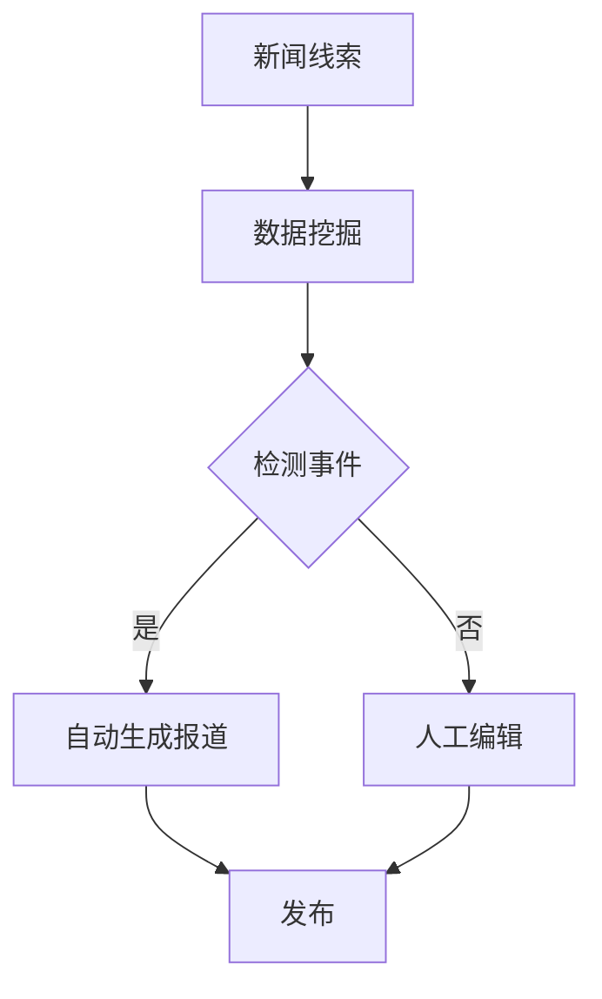
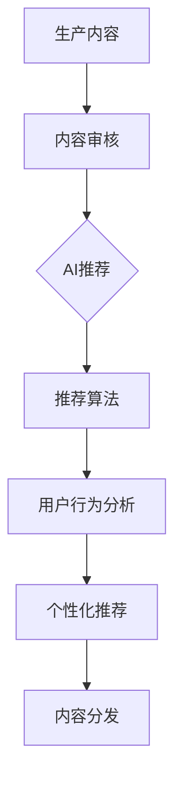

                 

### 理解书名和主题

《AI在新闻生产和传播中的应用与挑战》这本书的标题清晰地指出了它的核心内容：探讨人工智能（AI）在新闻生产与传播中的具体应用，以及这些应用所面临的挑战。书名中的“AI”代表了人工智能，这是一个广泛应用于各个领域的先进技术，特别是数据分析和自动化。而“新闻生产”与“新闻传播”则明确了讨论的范围，涉及从信息采集、编写到分发、传播的整个流程。

理解书名和主题的第一步是明确AI在新闻生产和传播中的基本概念和原理。人工智能，作为一种能够模拟、延伸和扩展人类智能的技术，通过机器学习、自然语言处理等技术手段，实现了从数据的自动分析到内容的自动化生产，再到传播过程中的精准推荐。新闻生产则指的是新闻报道的生成过程，包括采访、编辑、写作和校对等环节；新闻传播则是指新闻内容的分发和传播，涵盖传统媒体如报纸、电视，以及现代媒体如互联网和社交媒体。

接下来，我们需要了解AI与新闻生产和传播之间的联系。AI在新闻生产中的应用主要体现在以下几个方面：

1. **自动化写作**：利用自然语言处理技术，AI可以自动生成新闻报道，提高信息发布的速度和效率。
2. **数据分析**：通过机器学习算法，AI能够快速分析大量数据，帮助记者发现新闻线索，提升报道的深度和质量。
3. **语音识别与转写**：AI可以将采访中的语音实时转化为文字，提高新闻采访的效率。

在新闻传播方面，AI的应用更加广泛：

1. **新闻推荐**：基于用户的行为数据和兴趣偏好，AI可以推荐个性化的新闻内容，提高用户粘性和阅读时长。
2. **社交媒体算法**：社交媒体平台利用AI算法分析用户互动，优化内容分发策略，提高传播效果。
3. **新闻审核**：AI可以帮助平台快速识别和处理虚假新闻和不当内容，维护网络环境的健康。

总之，AI在新闻生产和传播中的应用不仅提升了效率和准确性，也为新闻行业带来了新的挑战，包括数据隐私、伦理问题和技术安全等。理解这些概念和联系是深入探讨AI在新闻生产和传播中的实际应用和挑战的基础。

### 核心章节

为了全面探讨《AI在新闻生产和传播中的应用与挑战》，本文将分为四个核心部分，每个部分都深入解析AI在不同环节中的应用和技术原理。

#### 第一个核心部分：核心概念与联系

在这个部分，我们将详细介绍AI、新闻生产、新闻传播的基本概念和它们之间的相互关系。通过定义和解释这些核心概念，我们为后续的技术原理和应用讨论打下坚实的基础。

- **1.1.1 AI的基本概念**：介绍人工智能的定义、发展历史、核心技术和主要应用领域。
- **1.1.2 新闻生产的基本概念**：解析新闻生产的主要环节，包括采访、编辑、写作和校对等，以及传统与现代新闻生产的差异。
- **1.1.3 新闻传播的基本概念**：探讨新闻传播的渠道、传播机制、目标受众以及现代传播技术对新闻传播的变革。

此外，我们将通过**1.2 AI与新闻生产的Mermaid流程图**和**1.3 AI与新闻传播的Mermaid流程图**，直观地展示AI在新闻生产和传播中的具体应用和流程。这些流程图不仅帮助读者理解技术原理，还展示了各个环节之间的联系和相互作用。

#### 第二个核心部分：应用场景

本部分将详细探讨AI在新闻生产和传播中的应用场景。通过具体的实例和案例分析，我们将展示AI技术如何在实际操作中提升效率和效果。

- **2.1 AI在新闻生产中的应用**：介绍自动化写作、自动化数据分析和语音识别与转写等具体技术，以及这些技术在新闻生产中的应用案例。
- **2.2 AI在新闻传播中的应用**：讨论基于AI的新闻推荐、社交媒体算法和新闻审核等应用，分析这些技术如何优化新闻传播效果。
- **2.3 AI在新闻生产和传播中的应用案例**：通过具体的成功案例，展示AI技术在不同新闻场景中的实际应用效果。

#### 第三个核心部分：技术原理

本部分将深入讲解AI在新闻生产和传播中的关键技术原理，包括自然语言处理、机器学习等。通过具体的Python源代码示例和数学模型，我们将帮助读者理解这些技术背后的工作机制。

- **3.1 自然语言处理在新闻生产中的应用**：介绍词向量表示、序列模型和机器学习算法等自然语言处理技术，并展示如何应用于新闻生产。
- **3.2 机器学习在新闻传播中的应用**：探讨数据挖掘技术、深度学习模型和强化学习在新闻传播中的应用原理。
- **3.3 伪代码示例**：提供自动化写作算法和基于AI的新闻推荐算法的具体伪代码示例，结合数学模型和公式进行详细讲解和实例分析。

#### 第四个核心部分：挑战与未来

最后，我们将讨论AI在新闻生产和传播中面临的挑战以及未来发展趋势。

- **4.1 AI在新闻生产和传播中面临的挑战**：分析数据隐私、伦理问题、人工智能偏见、技术安全等方面的问题，探讨解决策略。
- **4.2 AI在新闻生产和传播的未来发展趋势**：展望AI技术在新领域的创新应用、行业应用的扩展以及AI与人类新闻工作者的协作模式。

通过以上四个核心部分的深入探讨，本文旨在全面解析AI在新闻生产和传播中的应用与挑战，为读者提供有深度、有思考、有见解的专业技术分析。

### 第一部分：核心概念与联系

在探讨AI在新闻生产和传播中的应用与挑战之前，我们需要先理解几个关键概念及其相互联系。这些核心概念包括人工智能（AI）、新闻生产、新闻传播、自然语言处理（NLP）和机器学习（ML）。通过明确这些概念，我们可以更好地理解AI技术在新闻领域的应用原理和具体实现。

#### 1.1.1 AI的基本概念

人工智能（Artificial Intelligence，简称AI）是指通过计算机模拟人类智能的技术，它包括学习、推理、解决问题、理解自然语言等多个方面。AI的发展经历了多个阶段，从早期的规则系统到现代的深度学习和强化学习，其核心目标是使机器能够自主地完成复杂的任务，并在一定程度上具备人类的认知能力。

- **定义**：AI是一种在机器上实现的智能，它能够进行感知、学习、推理和决策。
- **发展历史**：AI起源于20世纪50年代，经历了早期的人工智能寒冬、80年代的专家系统热潮、90年代的机器学习兴起，以及21世纪初的深度学习革命。
- **核心技术**：包括机器学习、深度学习、自然语言处理、计算机视觉等。

#### 1.1.2 新闻生产的基本概念

新闻生产是指从新闻线索的发现、采访、编辑、写作到最终发布的全过程。新闻生产的目的是为公众提供及时、准确、全面的信息。

- **环节**：包括新闻线索挖掘、采访、资料收集、写作、编辑和发布。
- **特点**：传统新闻生产依赖于记者的采访、写作和编辑能力，而现代新闻生产则借助技术手段，如自动化写作、数据挖掘和多媒体内容制作。

#### 1.1.3 新闻传播的基本概念

新闻传播是指新闻内容从生产者到消费者的传递过程。传统的新闻传播主要通过报纸、电视、广播等渠道，而现代新闻传播则借助互联网、社交媒体等新型媒介。

- **渠道**：包括报纸、电视、广播、互联网、社交媒体等。
- **传播机制**：基于信息传递、受众接收、反馈和互动，形成一个动态的传播网络。
- **目标受众**：现代新闻传播更加注重个性化，通过算法和大数据分析，为用户提供定制化的新闻内容。

#### 1.2 AI与新闻生产的Mermaid流程图

为了更直观地展示AI在新闻生产中的应用流程，我们使用Mermaid流程图来描述自动化写作的流程。



在这个流程图中，新闻线索首先通过数据挖掘获取相关信息，然后由系统检测事件的重要性和时效性。如果事件重要且及时，AI会自动生成报道；否则，需要人工进行编辑和修改。最终，经过审核的报道会被发布到相应的平台。

#### 1.3 AI与新闻传播的Mermaid流程图

同样，我们使用Mermaid流程图来展示AI在新闻传播中的应用流程。



在这个流程中，生产的内容首先经过AI审核，确保内容的质量和合法性。接下来，基于用户的兴趣和行为数据，AI使用推荐算法生成个性化的新闻推荐列表。最后，这些推荐内容通过不同的渠道分发到用户手中。

通过以上核心概念的介绍和Mermaid流程图的展示，我们可以更好地理解AI在新闻生产和传播中的应用原理。这些流程图不仅帮助我们理清了各个环节之间的关系，也为后续章节中的具体应用和技术原理讨论奠定了基础。

### 自然语言处理在新闻生产中的应用

自然语言处理（Natural Language Processing，简称NLP）是人工智能的一个重要分支，专注于使计算机能够理解、生成和处理人类语言。在新闻生产中，NLP技术发挥着至关重要的作用，通过自动化写作、数据分析、语音识别与转写等应用，大大提升了新闻生产效率和内容质量。

#### 3.1.1 词向量表示

词向量表示（Word Vector Representation）是将自然语言文本转换为计算机可处理的向量形式的一种技术。词向量能够捕捉词与词之间的语义关系，为后续的文本分析和处理提供基础。

- **基本原理**：词向量通常通过训练模型（如Word2Vec、GloVe等）从大量文本数据中学习得到。这些模型通过考虑词的上下文信息，将每个词映射到一个高维向量空间中，使得语义相近的词在空间中位置靠近。

- **实例**：以Word2Vec为例，假设我们有两个词“猫”和“狗”，通过训练模型，我们得到的词向量分别为\[1.2, 0.5\]和\[1.1, 0.4\]。由于这两个词向量在第一维上的值非常接近，我们可以认为“猫”和“狗”在语义上是相似的。

#### 3.1.2 序列模型

序列模型（Sequence Model）是一种用于处理序列数据的机器学习模型，常用于自然语言处理任务中，如文本分类、情感分析和自动写作。

- **基本原理**：序列模型通过学习输入序列中的特征，预测输出序列的下一个元素。常见的序列模型包括循环神经网络（RNN）、长短期记忆网络（LSTM）和门控循环单元（GRU）。

- **实例**：以LSTM为例，LSTM通过引入门控机制，能够有效地捕捉长距离依赖关系。假设我们要预测一个句子的下一个词，LSTM会首先处理句子的前n个词，生成一个隐藏状态向量，然后利用这个状态向量预测下一个词。

#### 3.1.3 机器学习算法

机器学习算法在新闻生产中应用广泛，主要包括监督学习、无监督学习和强化学习。

- **监督学习**：监督学习算法通过训练样本（输入和对应的输出）来预测新的输入。在新闻生产中，监督学习可以用于分类、情感分析和自动写作等任务。

- **无监督学习**：无监督学习算法不需要训练样本的标签，通过自身学习数据中的模式。在新闻生产中，无监督学习可以用于主题检测、文本聚类和内容推荐等。

- **强化学习**：强化学习算法通过试错和反馈来学习最优策略。在新闻生产中，强化学习可以用于自动写作、内容审核和用户推荐等。

#### Python源代码示例

以下是一个使用Python和Gensim库进行词向量表示的简单示例：

```python
from gensim.models import Word2Vec
from nltk.tokenize import word_tokenize

# 加载语料数据
text = "人工智能在新闻生产中的应用广泛，包括自动化写作、数据分析等。"
tokens = word_tokenize(text)

# 训练Word2Vec模型
model = Word2Vec(tokens, vector_size=100, window=5, min_count=1, workers=4)

# 查看词向量
vector = model.wv['人工智能']
print(vector)
```

这个示例中，我们首先使用nltk库对文本进行分词，然后使用Gensim库的Word2Vec模型进行训练，最后输出“人工智能”的词向量。

#### 数学模型和公式

词向量表示中的关键数学模型是神经网络，以下是一个简化的神经网络结构：

$$
\text{Output} = \text{sigmoid}(\text{Weight} \cdot \text{Input} + \text{Bias})
$$

其中，权重（Weight）和偏置（Bias）用于调整输入和输出之间的映射关系，sigmoid函数用于将线性组合转换为概率分布。

#### 举例说明

假设我们要预测句子“人工智能在新闻生产中发挥重要作用”的下一个词，使用LSTM模型。首先，我们需要将句子转化为序列数据：

```
输入：[“人工智能”, “在”, “新闻”, “生产”, “中”, “发挥”, “重要”, “作用”]
```

然后，利用LSTM模型处理这些输入词，生成隐藏状态向量。最后，通过Softmax函数将隐藏状态向量转换为词的概率分布，从而预测下一个词。

$$
\text{Probability Distribution} = \text{Softmax}(\text{Hidden State Vector})
$$

通过这种方式，我们可以利用自然语言处理技术自动化地生成新闻内容，分析新闻数据，并实现新闻的语音识别与转写。

### 机器学习在新闻传播中的应用

机器学习（Machine Learning，ML）在新闻传播中的应用日益广泛，通过数据挖掘、深度学习模型和强化学习等技术，为新闻推荐、内容审核和用户互动提供了强大的支持。

#### 3.2.1 数据挖掘技术

数据挖掘（Data Mining）是机器学习的一个重要分支，旨在从大量数据中自动发现有价值的信息和模式。在新闻传播中，数据挖掘技术主要用于分析用户行为、新闻内容和社交媒体互动等数据，以优化新闻推荐和内容分发策略。

- **用户行为分析**：通过分析用户点击、浏览、分享等行为，数据挖掘技术可以帮助新闻平台了解用户兴趣，从而推荐个性化的新闻内容。
- **内容分析**：数据挖掘可以分析新闻内容的主题、情感和热点，帮助新闻编辑优化内容生产策略，提升报道的深度和广度。
- **社交媒体互动**：通过分析社交媒体上的用户评论、点赞和分享等数据，数据挖掘技术可以帮助新闻平台识别热点话题，提高内容传播效果。

#### 3.2.2 深度学习模型

深度学习（Deep Learning）是一种基于多层神经网络的机器学习技术，能够自动提取特征并实现复杂的模式识别。在新闻传播中，深度学习模型广泛应用于新闻推荐、内容审核和用户互动等任务。

- **新闻推荐**：深度学习模型可以通过学习用户的历史行为和新闻内容的特征，实现个性化的新闻推荐。常见的模型包括基于内容推荐和基于协同过滤的深度学习模型。
- **内容审核**：深度学习模型可以帮助平台自动识别和处理虚假新闻、不当内容和违规行为。例如，使用卷积神经网络（CNN）分析新闻文本和图像，识别潜在的违规内容。
- **用户互动**：通过深度学习模型，新闻平台可以分析用户的评论和互动行为，了解用户对新闻内容的反应和态度，从而优化用户界面和互动体验。

#### 3.2.3 强化学习

强化学习（Reinforcement Learning，RL）是一种通过试错和反馈学习最优策略的机器学习技术。在新闻传播中，强化学习可以用于优化新闻推荐算法、用户互动和广告投放等。

- **新闻推荐**：强化学习模型可以通过不断调整推荐策略，优化用户的推荐体验。例如，使用深度强化学习模型，动态调整新闻内容的推荐顺序，提高用户的点击率和满意度。
- **用户互动**：通过强化学习，新闻平台可以优化用户的互动体验，例如，调整新闻标题、图像和推荐内容，以增加用户的停留时间和互动行为。
- **广告投放**：强化学习可以帮助广告平台优化广告投放策略，通过不断调整广告内容和投放位置，提高广告的点击率和转化率。

#### 伪代码示例

以下是一个使用Python和TensorFlow库进行新闻推荐系统训练的伪代码示例：

```python
import tensorflow as tf

# 定义输入层
user_embeddings = tf.keras.layers.Embedding(input_dim=num_users, output_dim=user_embedding_size)(user_ids)
item_embeddings = tf.keras.layers.Embedding(input_dim=num_items, output_dim=item_embedding_size)(item_ids)

# 定义交叉层
crossed_embeddings = tf.keras.layers.Dot(axes=[1, 1])([user_embeddings, item_embeddings])

# 定义全连接层
output = tf.keras.layers.Dense(units=num_items, activation='softmax')(crossed_embeddings)

# 编译模型
model = tf.keras.Model(inputs=[user_ids, item_ids], outputs=output)
model.compile(optimizer='adam', loss='categorical_crossentropy', metrics=['accuracy'])

# 训练模型
model.fit(x=[user_train, item_train], y=item_labels_train, batch_size=batch_size, epochs=num_epochs)
```

在这个示例中，我们首先定义用户和物品的嵌入层，然后通过交叉层计算用户和物品的相似度。最后，使用全连接层输出每个物品的概率分布。通过训练，我们可以优化新闻推荐算法，提高推荐效果。

通过数据挖掘、深度学习模型和强化学习等技术，机器学习为新闻传播提供了强大的工具和手段，帮助新闻平台更好地理解用户需求，优化内容生产和分发策略，提升用户体验和满意度。

### AI在新闻生产和传播中面临的挑战

尽管AI技术在新闻生产和传播中展示了巨大的潜力，但同时也面临着一系列挑战。这些挑战主要集中在数据隐私、伦理问题、人工智能偏见和技术安全等方面。

#### 4.1.1 数据隐私与伦理问题

随着AI技术的广泛应用，大量用户数据和新闻内容数据被收集和存储。这些数据包含了用户的个人信息、阅读偏好和互动行为，如果不当处理，可能导致隐私泄露和个人身份信息的滥用。此外，AI技术在处理这些数据时，可能会遇到伦理问题，如数据歧视、信息误导和透明度不足。

- **数据隐私问题**：为了提供个性化的新闻内容，AI系统需要收集和分析大量的用户数据。如何确保这些数据的收集和使用过程符合隐私保护法规，是一个重要的挑战。
- **伦理问题**：AI在新闻生产和传播中可能会面临伦理困境。例如，自动化新闻写作可能会忽视新闻的客观性和公正性，导致信息传播的不准确和偏见。此外，新闻编辑和记者的角色可能被削弱，影响新闻行业的生态平衡。

#### 4.1.2 人工智能偏见与公平性

AI系统在训练过程中可能会受到训练数据偏见的影响，从而在新闻生产和传播中产生不公平的结果。这种偏见可能源于数据的多样性不足、数据集的不平衡，或者训练算法的设计缺陷。

- **偏见问题**：例如，AI新闻推荐系统可能会根据用户的历史行为和兴趣，推荐相似的内容，导致信息的同质化和视野的狭隘化。此外，AI算法可能会放大社会中的种族、性别和地域偏见，加剧社会不平等。
- **公平性问题**：在内容审核和新闻筛选中，AI系统可能无法完全替代人类编辑的判断，尤其是在处理复杂和敏感的话题时。如何确保AI系统的决策是公正和公平的，是一个亟待解决的问题。

#### 4.1.3 AI技术的安全性与可靠性

AI技术在新闻生产和传播中的应用，也面临着安全性和可靠性的挑战。AI系统可能受到恶意攻击，导致数据泄露、系统瘫痪或内容被篡改。此外，AI算法的透明度和可解释性不足，使得人们难以理解AI决策的依据和过程，增加了信任危机。

- **安全性问题**：AI系统在处理敏感的新闻内容时，可能成为网络攻击的目标。例如，通过注入恶意代码或操纵数据，攻击者可能干扰新闻推荐或内容审核过程。
- **可靠性问题**：AI系统在处理大量数据时，可能会出现错误或异常，导致新闻内容的不准确或失真。此外，AI系统的依赖性增加，使得新闻行业对技术故障和中断的抵御能力降低。

#### 解决策略与未来展望

为了应对这些挑战，需要从多个方面采取综合措施：

- **数据隐私保护**：加强数据隐私保护法规，确保用户数据的合法收集和使用。同时，采用先进的加密技术和匿名化处理，降低隐私泄露风险。
- **伦理和公平性**：建立AI伦理准则，确保AI系统在新闻生产和传播中的应用符合伦理规范。通过多样化的数据集和公平的算法设计，减少偏见和不公平现象。
- **安全性与可靠性**：加强AI系统的安全性测试和监控，提高系统的抗攻击能力和恢复能力。同时，提高AI算法的可解释性和透明度，增强公众对AI系统的信任。
- **持续研究与发展**：持续推动AI技术在新闻生产和传播中的研究与发展，探索更先进的技术和方法，以应对不断变化的挑战。

未来，随着AI技术的不断进步和应用，新闻生产和传播将面临更多机遇和挑战。通过积极应对这些挑战，AI有望在新闻行业中发挥更大的作用，推动新闻行业的创新与发展。

### AI在新闻生产和传播的未来发展趋势

随着人工智能（AI）技术的不断进步，其在新闻生产和传播中的应用前景也越来越广阔。未来，AI技术将在以下几个方面带来显著的变革：

#### 4.2.1 技术创新与突破

未来的AI技术在新闻生产和传播中将实现更多技术创新和突破。例如，深度学习、自然语言处理（NLP）和生成对抗网络（GAN）等技术的进一步发展，将使得自动化写作和内容生成更加精准和自然。此外，增强现实（AR）和虚拟现实（VR）技术的结合，有望为新闻传播提供更加沉浸式的体验。

- **深度学习**：深度学习在图像识别、语音识别和文本分析等领域已经取得了显著成果。未来，随着算法和硬件的进步，深度学习技术将在新闻生产和传播中发挥更大作用，例如，通过深度学习模型，AI可以更准确地识别新闻中的情感和主题。
- **NLP**：自然语言处理技术的不断进步，将使得新闻写作和编辑更加智能化。未来的AI新闻写作系统将能够更自然地生成复杂结构和风格的新闻文章，提高新闻报道的质量和效率。
- **GAN**：生成对抗网络（GAN）技术可以通过生成逼真的文本、图像和视频，为新闻传播带来新的可能性。例如，GAN可以生成虚假新闻和深度伪造视频，从而提高内容审核和安全性。

#### 4.2.2 行业应用扩展

随着AI技术的成熟，其应用范围将进一步扩大，不仅限于新闻生产，还将渗透到新闻传播的各个环节。例如，AI可以在新闻推荐、用户互动、广告投放和数据分析等领域发挥重要作用。

- **新闻推荐**：AI技术将实现更精准的个性化新闻推荐，通过分析用户的历史行为和兴趣，为每个用户量身定制新闻内容。这不仅能够提高用户满意度，还能增加平台粘性和用户参与度。
- **用户互动**：通过AI技术，新闻平台可以更好地理解用户的反馈和需求，优化用户界面和互动体验。例如，通过语音识别和自然语言理解，AI可以帮助用户以自然语言提问和获取信息。
- **广告投放**：AI技术可以帮助新闻平台优化广告投放策略，通过分析用户行为和内容特点，实现更精准的广告投放，提高广告效果和收益。

#### 4.2.3 AI与人类新闻工作者的协作

未来的新闻生产和传播将更加注重AI与人类新闻工作者的协作，而不是简单的替代。AI将作为工具和助手，帮助人类记者和编辑更高效地完成工作，同时保持新闻的客观性和准确性。

- **AI辅助写作**：AI可以帮助记者快速生成新闻初稿，提供数据分析和趋势预测，从而节省时间和精力，专注于更具创造性和战略性的工作。
- **AI内容审核**：AI可以辅助内容审核，通过识别和过滤虚假新闻、不当内容和侵权内容，确保新闻内容的合法性和质量。
- **跨领域合作**：AI与人类新闻工作者的合作将推动跨领域研究和发展，例如，AI可以与数据科学家、图像处理专家合作，实现更丰富的新闻报道形式，如数据新闻和可视化新闻。

总之，随着AI技术的不断进步和行业应用扩展，未来新闻生产和传播将迎来新的发展机遇。通过技术创新、行业应用扩展和人类与AI的协作，AI将为新闻行业带来前所未有的变革和突破。

### 附录

在探讨AI在新闻生产和传播中的应用与挑战的过程中，了解相关的工具与资源对于读者来说至关重要。以下我们将介绍一些常用的AI工具、新闻生产和传播相关的数据集，以及开发环境搭建指南。

#### 5.1.1 常用AI工具与框架

在AI领域，有许多优秀的工具和框架可以帮助我们实现复杂的应用。以下是几个常用的AI工具和框架：

- **TensorFlow**：由Google开发的开源机器学习框架，广泛应用于图像识别、自然语言处理和深度学习等领域。
- **PyTorch**：由Facebook开发的开源深度学习框架，因其灵活性和动态计算图的特点，在科研和工业应用中受到广泛欢迎。
- **Scikit-learn**：一个基于Python的开源机器学习库，提供了丰富的算法和工具，适合初学者和专业人士。
- **Gensim**：一个用于自然语言处理的Python库，提供了高效的文本处理和词向量建模功能。
- **SpaCy**：一个强大的自然语言处理库，支持快速文本处理和实体识别，特别适合工业应用。

#### 5.1.2 新闻生产和传播相关的数据集

为了进行AI在新闻生产和传播中的研究，获取高质量的数据集是关键。以下是一些常用的数据集：

- **NYT Article Search**：纽约时报提供的文章搜索数据集，包括大量历史新闻文章，适用于文本分类、情感分析和自动化写作等任务。
- **Twitter API**：Twitter提供的API，可以获取大量的用户推文数据，适用于社交媒体分析和情感分析等任务。
- **MS MARCO**：Microsoft Research推出的大型问答数据集，适用于问答系统和对话系统的研究。
- **Flickr**：Flickr提供的图片数据集，包含大量的用户上传图片，适用于图像识别和视觉分析等任务。

#### 5.1.3 开发环境搭建指南

搭建AI在新闻生产和传播中的开发环境，需要配置相应的软件和工具。以下是一个基本的开发环境搭建指南：

1. **安装Python**：首先，确保计算机上安装了Python，版本建议为3.8或更高。可以从Python官方网站下载安装包进行安装。

2. **安装必要的库**：通过pip命令，安装TensorFlow、PyTorch、Scikit-learn、Gensim、SpaCy等库。以下是一个示例命令：

   ```bash
   pip install tensorflow torchvision scikit-learn gensim spacy
   ```

   如果需要安装SpaCy，还需要下载额外的语言模型：

   ```bash
   python -m spacy download en_core_web_sm
   ```

3. **配置GPU支持**：如果使用的是GPU计算，需要安装CUDA和cuDNN库。可以从NVIDIA官方网站下载相应版本，并根据文档进行安装。

4. **安装Jupyter Notebook**：Jupyter Notebook是一个交互式的计算环境，非常适合进行数据分析和模型训练。可以通过pip命令安装：

   ```bash
   pip install notebook
   ```

5. **安装文本预处理工具**：例如，安装NLTK和TextBlob等文本预处理工具，以便进行文本分词、词性标注和情感分析等操作。

通过以上步骤，我们可以搭建一个基本的AI开发环境，用于实现和测试新闻生产和传播中的AI应用。

### 文章小结

本文从核心概念、应用场景、技术原理、挑战与未来等多个角度，全面探讨了AI在新闻生产和传播中的应用与挑战。我们首先介绍了AI、新闻生产和新闻传播的基本概念，并通过Mermaid流程图展示了AI在这些领域的具体应用。接着，我们深入分析了自然语言处理和机器学习在新闻生产中的应用，通过Python源代码示例和数学模型进行了详细讲解。在技术原理部分，我们探讨了数据挖掘、深度学习和强化学习等技术在新闻传播中的应用。随后，我们讨论了AI在新闻生产和传播中面临的挑战，包括数据隐私、伦理问题、人工智能偏见和技术安全等，并提出了相应的解决策略。最后，展望了AI技术在新闻生产和传播中的未来发展趋势，强调技术创新与突破、行业应用扩展以及AI与人类新闻工作者的协作。通过本文的详细解析，读者可以全面了解AI在新闻行业的应用现状、技术原理以及未来发展前景。

### 注意事项与最佳实践

在应用AI技术进行新闻生产和传播时，需要注意以下事项：

1. **数据隐私保护**：确保用户数据的收集和使用符合隐私保护法规，采取加密技术和匿名化处理。
2. **算法透明性**：提高AI算法的可解释性，增强公众对AI系统的信任。
3. **偏见与公平性**：在训练数据和算法设计上，注意减少偏见，确保公平性。
4. **技术安全**：加强AI系统的安全性测试和监控，防止恶意攻击和数据泄露。
5. **合作与协作**：AI应作为人类新闻工作者的助手，而不是替代者，实现人类与AI的协作。

通过遵循这些注意事项和最佳实践，可以有效提升AI在新闻生产和传播中的应用效果，推动行业的可持续发展。此外，建议读者进一步阅读相关文献，如《自然语言处理综合教程》、《机器学习实战》和《深度学习》等，以获得更深入的知识和见解。

### 拓展阅读

为了深入了解AI在新闻生产和传播中的应用与挑战，以下是几本推荐阅读的书籍：

1. **《深度学习》（Ian Goodfellow, Yoshua Bengio, Aaron Courville 著）**：详细介绍了深度学习的基本概念、算法和应用，是深度学习的经典教材。
2. **《自然语言处理综合教程》（Steven Bird, Ewan Klein, Edward Loper 著）**：全面讲解了自然语言处理的基本技术和应用，适合初学者和专业人士。
3. **《机器学习实战》（Peter Harrington 著）**：通过大量的案例和实践，介绍了机器学习的基本算法和应用，适合希望将机器学习应用于实际问题的读者。
4. **《新闻传播技术导论》（张辉锋 著）**：探讨了新闻传播技术的历史、现状和未来，特别关注了人工智能在新闻传播中的应用。
5. **《数据隐私与伦理》（Suri, Jenna 著）**：深入探讨了数据隐私和伦理问题，为AI在新闻生产和传播中的应用提供了道德和法规方面的指导。

通过阅读这些书籍，读者可以进一步扩展知识，深入了解AI在新闻行业的应用，以及如何应对相关的挑战。

