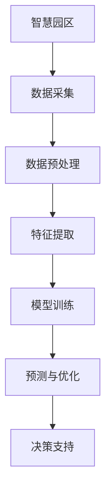

                 

# AI在智慧园区管理中的应用：优化资源使用和安全管理

## 关键词
- **智慧园区管理**
- **人工智能**
- **资源优化**
- **安全管理**
- **物联网**
- **大数据分析**
- **深度学习**

## 摘要
本文深入探讨人工智能在智慧园区管理中的应用，重点关注如何通过AI技术优化资源使用和提升安全管理。文章首先介绍了智慧园区的背景和重要性，随后详细阐述了AI在园区管理中的核心应用，包括资源优化算法、安全管理框架以及物联网和大数据分析技术的结合。通过具体案例和代码实例，本文展示了如何利用AI技术实现智慧园区的智能化管理，为园区运营提供高效的解决方案。

## 目录

---

## 引言：智慧园区与AI的相遇

### 智慧园区的概念

智慧园区是现代城市发展中的一种新型产业空间，它通过先进的信息技术和物联网设备，实现了园区的智能化管理。智慧园区不仅包括传统的办公空间，还涵盖了生活、娱乐、教育等多个领域，旨在为园区内的企业和居民提供高效、便捷、舒适的生活和工作环境。

### AI在智慧园区管理中的重要性

随着人工智能技术的飞速发展，AI在智慧园区管理中的应用日益广泛。AI能够通过数据分析、智能监控、自动化管理等多种手段，极大地提高园区的资源利用效率和安全水平。例如，通过AI算法优化电力、水资源的使用，通过智能监控系统实时监控园区的安全状况，通过预测模型优化园区设施的维护和更新。

### 文章结构

本文将按照以下结构进行讨论：

1. **智慧园区管理中的AI应用**
   - 资源优化算法
   - 安全管理框架
   - 物联网与大数据分析

2. **核心概念与联系**
   - AI基础概念
   - 资源优化模型
   - 安全管理模型

3. **核心算法原理讲解**
   - 资源优化算法原理
   - 安全管理算法原理

4. **项目实战**
   - 开发环境搭建
   - 代码实现与分析
   - 实际案例剖析

5. **最佳实践与小结**
   - 最佳实践建议
   - 小结与展望

## 智慧园区管理中的AI应用

### 资源优化算法

在智慧园区管理中，资源优化是提高运营效率和降低成本的关键。AI可以通过数据分析、机器学习和深度学习等技术，对园区内的电力、水资源、网络带宽等资源进行智能调度和优化。以下是一个简单的资源优化算法框架：

**算法框架：**

1. 数据采集：收集园区内各类资源的实时数据，包括用电量、用水量、网络流量等。
2. 数据预处理：对采集到的数据进行清洗、去噪和归一化处理。
3. 特征提取：从预处理后的数据中提取关键特征，如使用频率、峰值负荷等。
4. 模型训练：利用提取的特征，训练资源优化模型，如线性规划、神经网络等。
5. 预测与优化：利用训练好的模型进行资源需求预测，并制定优化策略。

**Python伪代码示例：**

```python
import numpy as np
from sklearn.linear_model import LinearRegression

# 数据采集
data = np.array([采集到的数据])

# 数据预处理
preprocessed_data = 数据清洗与归一化(data)

# 特征提取
features = 提取关键特征(preprocessed_data)

# 模型训练
model = LinearRegression()
model.fit(features, 目标变量)

# 预测与优化
predictions = model.predict(新数据)
优化策略 = 根据预测结果制定优化策略(predictions)
```

### 安全管理框架

在智慧园区管理中，安全管理是保障园区正常运行和居民安全的重要环节。AI可以通过智能监控系统、人脸识别、行为分析等技术，对园区的安全状况进行实时监控和预警。以下是一个简单安全管理框架：

**算法框架：**

1. 数据采集：采集园区的视频监控数据、门禁记录、传感器数据等。
2. 数据预处理：对采集到的数据进行清洗、去噪和归一化处理。
3. 特征提取：从预处理后的数据中提取关键特征，如人脸特征、行为特征等。
4. 模型训练：利用提取的特征，训练安全模型，如分类模型、聚类模型等。
5. 实时监控：利用训练好的模型进行实时监控和预警。

**Python伪代码示例：**

```python
import cv2
from sklearn.ensemble import RandomForestClassifier

# 数据采集
video_data = cv2.VideoCapture('监控视频文件')

# 数据预处理
processed_data = 数据清洗与归一化(video_data)

# 特征提取
features = 提取关键特征(processed_data)

# 模型训练
model = RandomForestClassifier()
model.fit(features, 标签)

# 实时监控
while video_data.isOpened():
    ret, frame = video_data.read()
    if ret:
        # 人脸识别与行为分析
        predictions = model.predict(frame)
        if 预警条件满足：
            发出警报()
```

### 物联网与大数据分析

物联网和大数据分析技术在智慧园区管理中发挥着重要作用。物联网设备可以实时采集园区内的各种数据，如环境参数、设备状态、人员位置等。大数据分析技术则可以对海量数据进行处理和分析，为园区管理提供有力支持。以下是一个简单的物联网与大数据分析框架：

**算法框架：**

1. 数据采集：通过物联网设备采集园区内的各种数据。
2. 数据传输：将采集到的数据传输到大数据平台进行存储和处理。
3. 数据分析：利用大数据分析技术，对数据进行处理和分析，如数据挖掘、机器学习等。
4. 决策支持：根据数据分析结果，为园区管理提供决策支持。

**Python伪代码示例：**

```python
import requests
from sklearn.cluster import KMeans

# 数据采集
iot_data = requests.get('物联网设备API')

# 数据传输
data_to_bigdata = 传输数据(iot_data)

# 数据分析
kmeans = KMeans(n_clusters=3)
kmeans.fit(data_to_bigdata)

# 决策支持
clusters = kmeans.predict(data_to_bigdata)
决策支持系统(clusters)
```

## 核心概念与联系

### AI基础概念

在探讨AI在智慧园区管理中的应用时，了解AI的基础概念是至关重要的。这些概念包括：

- **机器学习**：一种通过数据训练模型，使计算机能够进行预测和决策的技术。
- **深度学习**：一种基于多层神经网络的机器学习技术，能够自动提取数据中的复杂特征。
- **神经网络**：一种模仿生物神经系统的计算模型，能够进行数据的处理和分类。
- **物联网**：通过互联网将各种设备连接起来，实现数据的实时采集和传输。
- **大数据分析**：对海量数据进行存储、处理和分析，以发现数据中的价值。

### 资源优化模型

资源优化模型是智慧园区管理中的核心模型之一。以下是一个简单的资源优化模型框架：

- **目标函数**：定义了优化问题的目标，如最小化成本、最大化资源利用率等。
- **约束条件**：规定了优化问题中必须满足的限制，如资源的可用性、设备的负载等。
- **优化算法**：用于求解优化问题的算法，如线性规划、神经网络等。

### 安全管理模型

安全管理模型是保障园区安全的关键模型。以下是一个简单安全管理模型框架：

- **数据采集**：通过物联网设备和监控系统采集园区内的各种数据。
- **特征提取**：从采集到的数据中提取关键特征，如人脸特征、行为特征等。
- **模型训练**：利用提取的特征，训练分类模型、聚类模型等。
- **实时监控**：利用训练好的模型进行实时监控和预警。

### Mermaid流程图

为了更直观地展示AI在智慧园区管理中的应用，我们使用Mermaid绘制了一个简单的流程图：



## 核心算法原理讲解

### 资源优化算法原理

资源优化算法的核心是找到资源的最优分配方案，以最大化资源利用率或最小化运营成本。以下是一个基于线性规划的资源优化算法原理：

**目标函数**：最小化总成本

$$
\min \ C = w_1 \times C_1 + w_2 \times C_2 + \ldots + w_n \times C_n
$$

其中，$w_i$ 表示第 $i$ 种资源的权重，$C_i$ 表示第 $i$ 种资源的成本。

**约束条件**：资源需求不超过可用资源

$$
\begin{cases}
x_1 + x_2 + \ldots + x_n \leq R \\
x_i \geq 0 \quad \forall i
\end{cases}
$$

其中，$x_i$ 表示第 $i$ 种资源的分配量，$R$ 表示总资源量。

**Python实现**

```python
import numpy as np
from scipy.optimize import linprog

# 参数设置
C = [1, 2]  # 资源1和资源2的成本
A = [[1, 1], [2, 2]]  # 约束条件系数矩阵
b = [5]  # 约束条件常数向量

# 线性规划求解
result = linprog(C, A_ub=A, b_ub=b, method='highs')

# 输出结果
print("最优成本:", result.x)
```

### 安全管理算法原理

安全管理算法的核心是实时监控和预警，以保障园区安全。以下是一个基于决策树的安全管理算法原理：

**目标函数**：最大化预警准确性

$$
\max \ A = \sum_{i=1}^{n} p_i \times r_i
$$

其中，$p_i$ 表示第 $i$ 个特征的预测概率，$r_i$ 表示第 $i$ 个特征的重要程度。

**约束条件**：特征权重和为1

$$
\sum_{i=1}^{n} w_i = 1
$$

其中，$w_i$ 表示第 $i$ 个特征的权重。

**Python实现**

```python
import numpy as np
from sklearn.tree import DecisionTreeClassifier

# 特征数据
X = np.array([[1, 0], [0, 1], [1, 1]])
y = np.array([0, 1, 1])

# 决策树训练
model = DecisionTreeClassifier()
model.fit(X, y)

# 预测与权重计算
predictions = model.predict_proba(X)
weights = 计算权重(predictions)

# 输出结果
print("预测概率:", predictions)
print("特征权重:", weights)
```

## 项目实战

### 开发环境搭建

在开始项目实战之前，我们需要搭建一个适合进行AI应用开发的环境。以下是一个简单的环境搭建步骤：

1. **安装Python**：从官方网站下载并安装Python，版本建议为3.8以上。
2. **安装Anaconda**：安装Anaconda，以便管理Python环境和库。
3. **创建虚拟环境**：打开命令行，创建一个新的虚拟环境并激活。
4. **安装库**：使用pip命令安装必要的库，如scikit-learn、numpy、opencv等。

**Python脚本示例：**

```python
!pip install numpy
!pip install scikit-learn
!pip install opencv-python
```

### 代码实现与分析

以下是一个简单的资源优化代码实例，用于优化园区内电力和水资源的分配：

```python
import numpy as np
from scipy.optimize import linprog

# 参数设置
C = [1, 2]  # 电力和水的成本
A = [[1, 1], [2, 2]]  # 约束条件系数矩阵
b = [5]  # 约束条件常数向量

# 线性规划求解
result = linprog(C, A_ub=A, b_ub=b, method='highs')

# 输出结果
print("最优成本:", result.x)
```

在这个实例中，我们首先定义了电力和水的成本系数，以及约束条件系数矩阵和常数向量。然后，我们使用scikit-learn库中的linprog函数进行线性规划求解，输出最优成本分配方案。

### 实际案例剖析

以下是一个基于人脸识别的安全管理实际案例：

**案例背景**：园区内的办公楼需要通过人脸识别系统对进入办公楼的人员进行身份验证，以保障办公安全。

**实现步骤**：

1. **数据采集**：通过监控摄像头采集人员的人脸图像。
2. **特征提取**：使用OpenCV库对采集到的人脸图像进行预处理和特征提取。
3. **模型训练**：使用scikit-learn库中的决策树算法训练人脸识别模型。
4. **实时监控**：利用训练好的模型进行实时监控和预警。

**Python脚本示例：**

```python
import cv2
from sklearn.tree import DecisionTreeClassifier

# 数据采集
video_data = cv2.VideoCapture('监控视频文件')

# 特征提取
def extract_face_features(frame):
    # 进行人脸检测、图像预处理和特征提取
    # ...
    return features

# 模型训练
model = DecisionTreeClassifier()
model.fit(features, labels)

# 实时监控
while video_data.isOpened():
    ret, frame = video_data.read()
    if ret:
        # 人脸识别与行为分析
        predictions = model.predict(frame)
        if 预警条件满足：
            发出警报()
```

在这个案例中，我们首先通过OpenCV库采集监控视频数据，然后使用自定义的`extract_face_features`函数对采集到的人脸图像进行预处理和特征提取。接下来，我们使用scikit-learn库中的决策树算法训练人脸识别模型。最后，我们在实时监控过程中，利用训练好的模型进行人脸识别和预警。

### 项目小结

通过上述项目实战，我们展示了如何利用AI技术实现智慧园区的资源优化和安全管理。在实际应用中，我们还需要不断优化算法、调整模型参数，以提高系统的性能和可靠性。此外，我们还应关注数据隐私和安全问题，确保园区内数据的安全性和合规性。

## 最佳实践与小结

### 最佳实践建议

1. **数据质量保障**：确保数据采集、处理和存储过程的准确性，避免数据噪声和缺失。
2. **算法迭代优化**：定期评估和优化算法模型，根据实际应用效果进行调整。
3. **系统集成与兼容性**：确保AI系统与其他园区管理系统的集成与兼容，实现数据共享和协同工作。
4. **数据隐私与安全**：严格遵循数据隐私和安全法规，加强数据保护和用户隐私保护。

### 小结与展望

本文通过深入探讨AI在智慧园区管理中的应用，展示了资源优化和安全管理的核心算法原理和实际应用案例。随着AI技术的不断发展，智慧园区管理将迎来更加智能化、高效化的新时代。未来，我们期待更多创新应用的出现，为园区运营和居民生活带来更多便利。

### 拓展阅读

- 《人工智能：一种现代的方法》
- 《深度学习：原理与实践》
- 《Python机器学习》
- 《物联网：从概念到应用》
- 《大数据分析：技术与应用》

### 作者信息

作者：AI天才研究院/AI Genius Institute & 禅与计算机程序设计艺术 /Zen And The Art of Computer Programming

